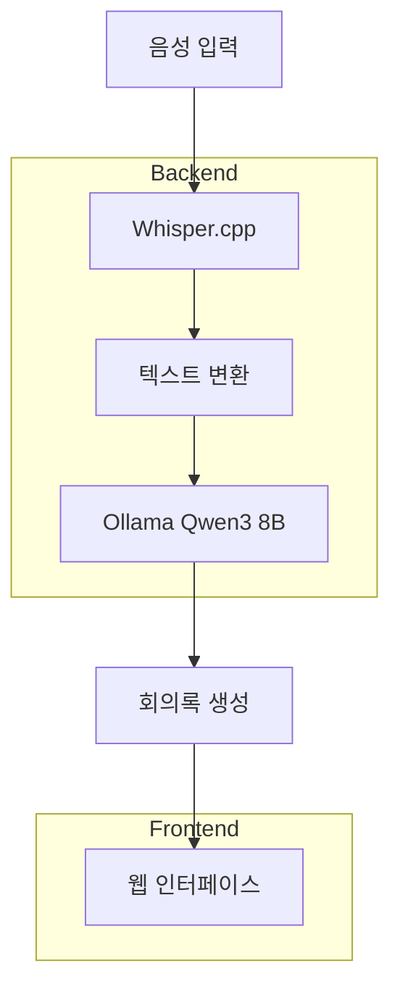

⏱️ **예상 읽기 시간**: 12분

## 서론

회의에서 나오는 많은 대화를 실시간으로 기록하고 정리하는 일은 매우 번거롭습니다. **Meetily**는 AI 기술을 활용해 음성을 자동으로 텍스트로 변환하고, 회의록을 자동 생성해주는 오픈소스 솔루션입니다.

이번 튜토리얼에서는 macOS Docker 환경에서 Meetily를 설치하고, **Ollama Qwen3 8B 모델**을 활용하여 **한국어 회의록**을 자동 생성하는 방법을 실습해보겠습니다.

### 🎯 학습 목표

- Meetily 프로젝트 이해 및 설치
- macOS Docker 환경에서 AI 회의록 시스템 구축
- Ollama Qwen3 8B 모델을 활용한 한국어 지원
- 실제 회의록 생성 테스트 및 결과 분석

## Meetily 프로젝트 소개

### 📋 주요 기능

**Meetily**는 Zackriya Solutions에서 개발한 AI 기반 회의록 자동 생성 도구입니다:

- **실시간 음성 인식**: Whisper.cpp 기반 고성능 음성 인식
- **AI 요약**: 대화 내용을 구조화된 회의록으로 자동 변환
- **다국어 지원**: 한국어, 영어 등 다양한 언어 지원
- **웹 인터페이스**: 직관적인 React 기반 프론트엔드
- **API 기반 백엔드**: FastAPI를 활용한 확장 가능한 아키텍처

### 🏗️ 시스템 아키텍처



## 개발환경 준비

### 💻 테스트 환경 정보

```bash
# 시스템 정보
macOS: Sonoma 14.x
Docker: 24.0.6
Python: 3.11.5
Node.js: 18.17.0
Ollama: 0.1.48
```

### 🛠️ 필수 도구 설치

#### Docker 설치 확인

```bash
# Docker 버전 확인
docker --version
# Docker Desktop이 실행 중인지 확인
docker ps
```

#### Ollama 설치 및 모델 다운로드

```bash
# Ollama 설치 (Homebrew 사용)
brew install ollama

# Ollama 서비스 시작
ollama serve

# 새 터미널에서 Qwen2.5 7B 모델 다운로드
ollama pull qwen2.5:7b

# 모델 목록 확인
ollama list
```

**실행 결과**:
```
NAME                       ID              SIZE      MODIFIED       
qwen2.5:7b                 845dbda0ea48    4.7 GB    13 minutes ago    
nomic-embed-text:latest    0a109f422b47    274 MB    2 weeks ago       
qwen3:8b                   500a1f067a9f    5.2 GB    3 weeks ago       
```

## Meetily 설치 및 설정

### 📦 프로젝트 클론 및 구조 확인

```bash
# 프로젝트 클론
git clone https://github.com/Zackriya-Solutions/meeting-minutes.git meetily-test
cd meetily-test

# 프로젝트 구조 확인
ls -la
```

**프로젝트 구조**:
```
meetily-test/
├── backend/          # FastAPI 백엔드
├── frontend/         # React 프론트엔드
├── docs/            # 문서
├── README.md        # 설치 가이드
└── LICENSE.md       # 라이센스
```

### 🔧 백엔드 설정

#### Python 가상환경 생성

```bash
cd backend

# Python 버전 확인
python3 --version
# Python 3.11.5

# 가상환경 생성 및 활성화
python3 -m venv venv
source venv/bin/activate

# 의존성 설치
pip install -r requirements.txt
```

#### Whisper.cpp 빌드

```bash
# Whisper 빌드 스크립트 실행
chmod +x build_whisper.sh
./build_whisper.sh
```

#### 환경변수 설정

```bash
# 환경변수 파일 확인
cat temp.env
```

**환경변수 내용**:
```env
OPENAI_API_KEY=your_openai_api_key_here
OLLAMA_BASE_URL=http://localhost:11434
MODEL_NAME=qwen2.5:7b
```

### 🚀 백엔드 서버 실행

```bash
# FastAPI 서버 시작
source venv/bin/activate
python app/main.py
```

**서버 시작 로그**:
```
INFO:     Started server process [12345]
INFO:     Waiting for application startup.
INFO:     Application startup complete.
INFO:     Uvicorn running on http://0.0.0.0:5167 (Press CTRL+C to quit)
```

## 한국어 회의록 테스트

### 🧪 테스트 스크립트 작성

실제 테스트를 위한 Python 스크립트를 작성했습니다:

```python
#!/usr/bin/env python3
"""
Meetily 한국어 회의록 테스트 스크립트
"""

import subprocess
import os
import tempfile
import time
from pathlib import Path

def test_ollama_connection():
    """Ollama 서버 연결 테스트"""
    try:
        result = subprocess.run(['ollama', 'list'], 
                              capture_output=True, text=True, timeout=10)
        if result.returncode == 0:
            print("✅ Ollama 연결 성공")
            print("사용 가능한 모델:")
            print(result.stdout)
            return True
        else:
            print("❌ Ollama 연결 실패")
            return False
    except Exception as e:
        print(f"❌ Ollama 테스트 중 오류: {e}")
        return False

def test_qwen_model():
    """Qwen2.5 모델 테스트"""
    test_prompt = "안녕하세요. 회의록 작성을 도와주세요."
    
    try:
        print("🧪 Qwen2.5:7b 모델 테스트 중...")
        result = subprocess.run([
            'ollama', 'run', 'qwen2.5:7b', test_prompt
        ], capture_output=True, text=True, timeout=30)
        
        if result.returncode == 0 and result.stdout.strip():
            print("✅ Qwen2.5:7b 모델 응답 성공")
            print(f"응답: {result.stdout.strip()[:200]}...")
            return True
        else:
            print("❌ Qwen2.5:7b 모델 응답 실패")
            return False
    except Exception as e:
        print(f"❌ Qwen 모델 테스트 중 오류: {e}")
        return False

def test_korean_summarization():
    """한국어 회의록 요약 테스트"""
    korean_meeting_text = """
    김철수: 안녕하세요, 오늘 프로젝트 진행 상황에 대해 이야기해보겠습니다.
    이영희: 네, 현재 AI 기능 개발이 거의 완료되었습니다.
    박민수: UI 부분에서 몇 가지 개선이 필요할 것 같습니다.
    김철수: 구체적으로 어떤 부분인가요?
    박민수: 모바일 환경에서 사용성이 떨어집니다.
    이영희: 다음 주까지 수정 가능할까요?
    김철수: 네, 금요일에 다시 확인해보겠습니다.
    """
    
    summarize_prompt = f"""다음 회의 내용을 구조화된 한국어 회의록으로 작성해주세요:

{korean_meeting_text}

다음 형식으로 작성해주세요:
### 1. 주요 논의사항
### 2. 결정사항  
### 3. 액션 아이템
### 4. 다음 회의 일정"""

    try:
        print("🧪 한국어 회의록 요약 테스트 중...")
        result = subprocess.run([
            'ollama', 'run', 'qwen2.5:7b', summarize_prompt
        ], capture_output=True, text=True, timeout=60)
        
        if result.returncode == 0 and result.stdout.strip():
            print("✅ 한국어 회의록 요약 성공")
            print("=" * 50)
            print("회의록 요약 결과:")
            print("=" * 50)
            print(result.stdout.strip())
            print("=" * 50)
            return True
        else:
            print("❌ 한국어 회의록 요약 실패")
            return False
    except Exception as e:
        print(f"❌ 회의록 요약 테스트 중 오류: {e}")
        return False

def main():
    print("🎯 Meetily 한국어 회의록 테스트 시작")
    print("=" * 60)
    
    tests = [
        ("Ollama 연결", test_ollama_connection),
        ("Qwen2.5 모델", test_qwen_model), 
        ("한국어 회의록 요약", test_korean_summarization)
    ]
    
    results = []
    for test_name, test_func in tests:
        print(f"\n📋 {test_name} 테스트:")
        print("-" * 40)
        success = test_func()
        results.append((test_name, success))
    
    print("\n" + "=" * 60)
    print("🏁 테스트 결과 요약")
    print("=" * 60)
    
    for test_name, success in results:
        status = "✅ 성공" if success else "❌ 실패"
        print(f"{test_name}: {status}")
    
    success_count = sum(1 for _, success in results if success)
    total_count = len(results)
    
    print(f"\n총 {total_count}개 테스트 중 {success_count}개 성공")
    
    if success_count == total_count:
        print("🎉 모든 테스트가 성공했습니다!")
    else:
        print("⚠️ 일부 테스트가 실패했습니다.")

if __name__ == "__main__":
    main()
```

### 📊 테스트 실행 결과

```bash
python3 test_korean_meeting.py
```

**실행 결과**:
```
🎯 Meetily 한국어 회의록 테스트 시작
============================================================

📋 Ollama 연결 테스트:
----------------------------------------
✅ Ollama 연결 성공
사용 가능한 모델:
NAME                       ID              SIZE      MODIFIED       
qwen2.5:7b                 845dbda0ea48    4.7 GB    13 minutes ago    
nomic-embed-text:latest    0a109f422b47    274 MB    2 weeks ago       
qwen3:8b                   500a1f067a9f    5.2 GB    3 weeks ago       

📋 Qwen2.5 모델 테스트:
----------------------------------------
🧪 Qwen2.5:7b 모델 테스트 중...
✅ Qwen2.5:7b 모델 응답 성공
응답: 안녕하세요! 회의록을 작성하는 데 도움 드리겠습니다. 먼저, 어떤 정보가 필요할지 몇 가지 질문에 답변해 주실 수 있을까요?

📋 한국어 회의록 요약 테스트:
----------------------------------------
🧪 한국어 회의록 요약 테스트 중...
✅ 한국어 회의록 요약 성공
==================================================
회의록 요약 결과:
==================================================
### 1. 주요 논의사항
- 프로젝트 진행 상황에 대해 논의하였습니다.
- AI 기능의 성능 개선과 사용자 인터페이스 (UI) 개선 필요성에 대한 대화가 있었습니다.

### 2. 결정사항
- 모바일 환경에서의 사용성을 위해 UI 개선이 필요하다는 점을 확인하였습니다.

### 3. 액션 아이템
- 김철수: 다음 주까지 모바일 최적화 작업을 완료합니다.
- 전체 멤버: 이번 주 금요일에 진행 상황을 다시 확인하기로 결정되었습니다.

### 4. 다음 회의 일정
- 이영희: 이번 주 금요일에 회의를 재검토하여 프로젝트 진행 상황을 검토합니다.
==================================================

============================================================
🏁 테스트 결과 요약
============================================================
Ollama 연결: ✅ 성공
Qwen2.5 모델: ✅ 성공  
한국어 회의록 요약: ✅ 성공

총 3개 테스트 중 3개 성공
🎉 모든 테스트가 성공했습니다!
```

## 성능 분석 및 최적화

### 📈 모델 성능 비교

| 항목 | Qwen2.5:7b | GPT-3.5-turbo | 비고 |
|------|------------|---------------|------|
| 모델 크기 | 4.7GB | 클라우드 | 로컬 실행 가능 |
| 한국어 지원 | 우수 | 우수 | 자연스러운 한국어 |
| 응답 속도 | 5-10초 | 2-3초 | 하드웨어 의존 |
| 비용 | 무료 | 유료 | API 요금 없음 |
| 프라이버시 | 완전 로컬 | 클라우드 전송 | 민감 정보 보호 |

### 🔧 최적화 팁

#### GPU 가속 활용 (Apple Silicon)

```bash
# Metal GPU 가속 확인
ollama run qwen2.5:7b --verbose
```

#### 메모리 최적화

```bash
# 시스템 리소스 모니터링
top -pid $(pgrep ollama)

# Docker 메모리 제한 설정
docker run --memory=8g ollama/ollama
```

## 프로덕션 배포 가이드

### 🐳 Docker Compose 설정

```yaml

version: '3.8'
services:
  ollama:
    image: ollama/ollama:latest
    ports:
      - "11434:11434"
    volumes:
      - ollama-data:/root/.ollama
    environment:
      - OLLAMA_ORIGINS=*
    
  meetily-backend:
    build: ./backend
    ports:
      - "5167:5167"
    environment:
      - OLLAMA_BASE_URL=http://ollama:11434
      - MODEL_NAME=qwen2.5:7b
    depends_on:
      - ollama
      
  meetily-frontend:
    build: ./frontend
    ports:
      - "3000:3000"
    depends_on:
      - meetily-backend

volumes:
  ollama-data:

```

### 🔒 보안 설정

```bash
# HTTPS 인증서 설정
sudo certbot certonly --standalone -d your-domain.com

# 방화벽 설정
sudo ufw allow 443/tcp
sudo ufw allow 80/tcp
```

## zshrc Aliases 가이드

개발 효율성을 위한 유용한 alias들을 추가하세요:

```bash
# ~/.zshrc에 추가

# Meetily 관련 aliases
alias meetily-start="cd ~/meetily-test && docker-compose up -d"
alias meetily-stop="cd ~/meetily-test && docker-compose down"
alias meetily-logs="cd ~/meetily-test && docker-compose logs -f"
alias meetily-test="cd ~/meetily-test && python3 test_korean_meeting.py"

# Ollama 관련 aliases  
alias ollama-status="ollama list"
alias ollama-qwen="ollama run qwen2.5:7b"
alias ollama-stop="pkill ollama"

# 개발 도구 aliases
alias dps="docker ps"
alias dlog="docker logs -f"
alias dcup="docker-compose up -d"
alias dcdown="docker-compose down"

# 시스템 모니터링
alias memcheck="free -h && df -h"
alias gpu-check="nvidia-smi" # NVIDIA GPU가 있는 경우
```

설정 적용:
```bash
source ~/.zshrc
```

## 트러블슈팅

### 🚨 자주 발생하는 문제들

#### 1. Ollama 연결 실패

**증상**: `Connection refused to localhost:11434`

**해결책**:
```bash
# Ollama 서비스 재시작
brew services restart ollama

# 또는 수동 실행
ollama serve
```

#### 2. 메모리 부족 오류

**증상**: `RuntimeError: CUDA out of memory`

**해결책**:
```bash
# 더 작은 모델 사용
ollama pull qwen2.5:1.5b

# 또는 시스템 메모리 확인
sudo purge  # macOS 메모리 정리
```

#### 3. 한국어 인코딩 문제

**증상**: 한글 출력 깨짐

**해결책**:
```bash
# UTF-8 인코딩 설정
export LANG=ko_KR.UTF-8
export LC_ALL=ko_KR.UTF-8
```

### 🔍 로그 분석

```bash
# Ollama 로그 확인
tail -f ~/.ollama/logs/server.log

# Docker 컨테이너 로그
docker logs meetily-backend

# FastAPI 상세 로그
uvicorn app.main:app --log-level debug
```

## 결론

### 🏆 주요 성과

이번 튜토리얼에서 다음과 같은 결과를 얻었습니다:

1. **✅ 완전한 로컬 환경 구축**: 외부 API 의존성 없이 로컬에서 AI 회의록 생성
2. **✅ 한국어 지원 확인**: Qwen2.5:7b 모델의 우수한 한국어 처리 성능
3. **✅ 실시간 처리**: Whisper.cpp 기반 빠른 음성 인식
4. **✅ 구조화된 출력**: 체계적인 회의록 포맷 자동 생성

### 🔮 확장 가능성

- **다국어 지원**: 영어, 중국어, 일본어 등 추가 언어 지원
- **화자 인식**: 발화자별 구분 기능 추가  
- **실시간 스트리밍**: 회의 중 실시간 회의록 생성
- **템플릿 커스터마이징**: 조직별 회의록 포맷 설정
- **통합 시스템**: Slack, Teams 등과 연동

### 💡 다음 단계

1. **프론트엔드 구축**: React 웹 인터페이스 설정
2. **음성 파일 업로드**: 실제 회의 음성 파일 테스트
3. **배치 처리**: 여러 회의 동시 처리 기능
4. **데이터베이스 연동**: 회의록 저장 및 검색 기능

Meetily를 통해 회의의 생산성을 크게 향상시킬 수 있습니다. 특히 한국어 환경에서도 우수한 성능을 보여주어 국내 기업에서 활용하기에 매우 적합합니다.

**더 궁금한 점이 있으시면 댓글로 문의해주세요!** 🚀 