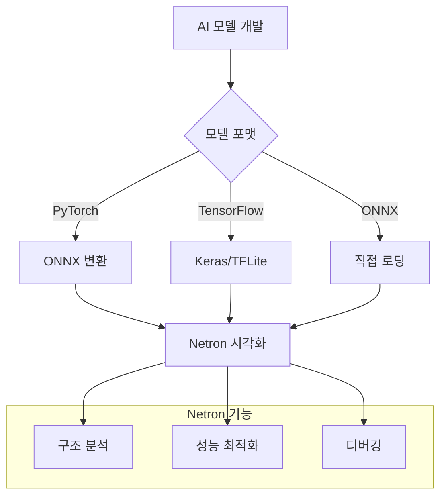

⏱️ **예상 읽기 시간**: 15분

## 서론

딥러닝 모델을 개발하거나 분석할 때, 모델의 구조를 시각적으로 이해하는 것은 매우 중요합니다. **Netron**은 다양한 AI 모델 포맷을 지원하는 오픈소스 시각화 도구로, 복잡한 신경망 구조를 직관적으로 분석할 수 있게 해줍니다.

이번 튜토리얼에서는 macOS 환경에서 Netron을 설치하고, PyTorch, TensorFlow, ONNX 등 다양한 모델 포맷을 시각화하는 방법을 실습해보겠습니다.

### 🎯 학습 목표

- Netron 도구의 특징과 장점 이해
- macOS에서 다양한 방법으로 Netron 설치
- PyTorch, TensorFlow, ONNX 모델 생성 및 시각화
- 모델 구조 분석 및 디버깅 방법 학습

## Netron 소개

### 📊 주요 특징

**Netron**은 Lutz Roeder가 개발한 신경망 모델 시각화 도구입니다:

- **📋 광범위한 포맷 지원**: ONNX, TensorFlow Lite, Core ML, Keras, Caffe, PyTorch 등
- **🌐 크로스 플랫폼**: macOS, Windows, Linux, 웹 브라우저
- **🎨 직관적 인터페이스**: 드래그 앤 드롭으로 간편한 모델 로딩
- **🔍 상세한 분석**: 레이어별 파라미터, 텐서 형태, 연산 정보 제공
- **🚀 빠른 렌더링**: 대용량 모델도 빠르게 시각화

### 🏗️ 지원 모델 포맷

| 포맷 | 지원 수준 | 주요 용도 |
|------|-----------|-----------|
| **ONNX** | ✅ 완전 지원 | 범용 모델 교환 |
| **TensorFlow Lite** | ✅ 완전 지원 | 모바일/엣지 배포 |
| **Keras** | ✅ 완전 지원 | 고수준 API 모델 |
| **PyTorch** | 🔄 ONNX 변환 | 연구용 모델 |
| **Core ML** | ✅ 완전 지원 | iOS/macOS 배포 |
| **Caffe** | ✅ 완전 지원 | 클래식 프레임워크 |
| **TensorFlow** | 🧪 실험적 지원 | 대규모 프로덕션 |

### 🔄 시각화 워크플로우



## 개발환경 준비

### 💻 테스트 환경 정보

```bash
# 시스템 정보
macOS: Sonoma 14.x
Python: 3.12.8
PyTorch: 2.7.0
TensorFlow: 2.19.0
Netron: 8.4.4
```

### 🛠️ Netron 설치 방법

#### 방법 1: Homebrew로 GUI 앱 설치

```bash
# Homebrew를 통한 설치 (권장)
brew install --cask netron

# 설치 확인
ls -la /Applications/Netron.app
```

#### 방법 2: Python 패키지 설치

```bash
# pip를 통한 설치
pip3 install netron

# 버전 확인
python3 -c "import netron; print(netron.__version__)"
```

#### 방법 3: 온라인 브라우저 버전

브라우저에서 [https://netron.app](https://netron.app)에 접속하여 즉시 사용 가능합니다.

**설치 결과**:
```
🍺  netron was successfully installed!
Successfully installed netron-8.4.4
```

## 실습: 다양한 모델 생성 및 시각화

### 🧪 테스트 모델 생성

실제 테스트를 위한 다양한 AI 모델을 생성해보겠습니다:

```python
#!/usr/bin/env python3
"""
Netron AI 모델 시각화 테스트 스크립트
"""

import torch
import torch.nn as nn
import torch.onnx
import tensorflow as tf
import numpy as np
import os

class SimpleNet(nn.Module):
    """간단한 CNN 모델 (PyTorch)"""
    def __init__(self):
        super(SimpleNet, self).__init__()
        self.conv1 = nn.Conv2d(3, 16, 3, padding=1)
        self.relu1 = nn.ReLU()
        self.pool1 = nn.MaxPool2d(2, 2)
        self.conv2 = nn.Conv2d(16, 32, 3, padding=1)
        self.relu2 = nn.ReLU()
        self.pool2 = nn.MaxPool2d(2, 2)
        self.fc1 = nn.Linear(32 * 8 * 8, 128)
        self.relu3 = nn.ReLU()
        self.fc2 = nn.Linear(128, 10)
        
    def forward(self, x):
        x = self.pool1(self.relu1(self.conv1(x)))
        x = self.pool2(self.relu2(self.conv2(x)))
        x = x.view(x.size(0), -1)
        x = self.relu3(self.fc1(x))
        x = self.fc2(x)
        return x

def create_pytorch_model():
    """PyTorch 모델 생성 및 ONNX 변환"""
    print("🧪 PyTorch 모델 생성 중...")
    
    model = SimpleNet()
    model.eval()
    
    # 더미 입력 데이터
    dummy_input = torch.randn(1, 3, 32, 32)
    
    # PyTorch 모델 저장
    torch.save(model.state_dict(), 'simple_model.pth')
    print("✅ PyTorch 모델 저장 완료: simple_model.pth")
    
    # ONNX 변환
    torch.onnx.export(
        model,
        dummy_input,
        'simple_model.onnx',
        export_params=True,
        opset_version=11,
        do_constant_folding=True,
        input_names=['input'],
        output_names=['output'],
        dynamic_axes={
            'input': {0: 'batch_size'},
            'output': {0: 'batch_size'}
        }
    )
    print("✅ ONNX 모델 변환 완료: simple_model.onnx")
    return True

def create_tensorflow_model():
    """TensorFlow 모델 생성"""
    print("🧪 TensorFlow 모델 생성 중...")
    
    model = tf.keras.Sequential([
        tf.keras.layers.Conv2D(16, 3, activation='relu', 
                               input_shape=(32, 32, 3)),
        tf.keras.layers.MaxPooling2D(),
        tf.keras.layers.Conv2D(32, 3, activation='relu'),
        tf.keras.layers.MaxPooling2D(),
        tf.keras.layers.Flatten(),
        tf.keras.layers.Dense(128, activation='relu'),
        tf.keras.layers.Dense(10, activation='softmax')
    ])
    
    model.compile(
        optimizer='adam',
        loss='sparse_categorical_crossentropy',
        metrics=['accuracy']
    )
    
    # Keras 모델 저장
    model.save('simple_model.keras')
    print("✅ Keras 모델 저장 완료: simple_model.keras")
    
    # TensorFlow Lite 변환
    converter = tf.lite.TFLiteConverter.from_keras_model(model)
    tflite_model = converter.convert()
    
    with open('simple_model.tflite', 'wb') as f:
        f.write(tflite_model)
    print("✅ TensorFlow Lite 모델 변환 완료: simple_model.tflite")
    
    return True
```

### 📊 모델 생성 실행 결과

```bash
python3 test_netron_models.py
```

**실행 결과**:
```
🎯 Netron AI 모델 시각화 도구 테스트
============================================================
📍 작업 디렉토리: /Users/hanhyojung/thaki/thaki.github.io/netron-test
🐍 PyTorch 버전: 2.7.0
🔥 TensorFlow 버전: 2.19.0

🎯 Netron 테스트용 모델 생성 시작
==================================================
🧪 PyTorch 모델 생성 중...
✅ PyTorch 모델 저장 완료: simple_model.pth
✅ ONNX 모델 변환 완료: simple_model.onnx
🧪 TensorFlow 모델 생성 중...
✅ Keras 모델 저장 완료: simple_model.keras
✅ TensorFlow Lite 모델 변환 완료: simple_model.tflite

📋 모델 상세 정보
==================================================

ONNX 모델:
  📁 파일명: simple_model.onnx
  📊 크기: 1,076,602 bytes (1051.4 KB)
  📍 경로: /Users/hanhyojung/thaki/thaki.github.io/netron-test/simple_model.onnx
  🔧 ONNX 버전: 6
  🏗️ 그래프 노드 수: 16

Keras 모델:
  📁 파일명: simple_model.keras
  📊 크기: 648,022 bytes (632.8 KB)
  📍 경로: /Users/hanhyojung/thaki/thaki.github.io/netron-test/simple_model.keras

TensorFlow Lite 모델:
  📁 파일명: simple_model.tflite
  📊 크기: 618,284 bytes (603.8 KB)
  📍 경로: /Users/hanhyojung/thaki/thaki.github.io/netron-test/simple_model.tflite
```

## Netron 시각화 방법

### 🖥️ GUI 애플리케이션 사용

#### Netron.app 실행
```bash
# 애플리케이션 실행
open /Applications/Netron.app

# 또는 Finder에서 실행
# Applications > Netron.app
```

#### 모델 파일 로딩
1. **드래그 앤 드롭**: 모델 파일을 Netron 창에 끌어다 놓기
2. **파일 메뉴**: File > Open에서 모델 파일 선택
3. **더블 클릭**: .onnx, .keras 파일을 더블 클릭하여 바로 열기

### 🌐 브라우저 버전 사용

#### 온라인 버전
```bash
# 브라우저에서 접속
open https://netron.app
```

#### 로컬 서버 실행
```bash
# Python에서 로컬 서버 시작
python3 -c "import netron; netron.start('simple_model.onnx')"

# 또는 포트 지정
python3 -c "import netron; netron.start('simple_model.onnx', port=8080)"
```

### 📱 명령어 인터페이스

#### 각 모델별 시각화 명령어

```bash
# ONNX 모델 시각화
netron simple_model.onnx

# Keras 모델 시각화  
netron simple_model.keras

# TensorFlow Lite 모델 시각화
netron simple_model.tflite

# Python에서 실행
python3 -c "import netron; netron.start('simple_model.onnx')"
```

## 모델 분석 실습

### 🔍 ONNX 모델 분석

#### 모델 구조 정보
- **입력 텐서**: input (1×3×32×32) - RGB 이미지
- **출력 텐서**: output (1×10) - 10개 클래스 분류
- **총 레이어 수**: 16개 노드
- **파라미터 수**: 약 1.05MB

#### 주요 레이어 분석
1. **Conv2d_0**: 3→16 채널, 3×3 커널
2. **Relu_1**: ReLU 활성화 함수
3. **MaxPool_2**: 2×2 풀링, stride=2
4. **Conv2d_3**: 16→32 채널, 3×3 커널
5. **Gemm_14**: 완전연결층 (2048→128)
6. **Gemm_16**: 출력층 (128→10)

### 🧠 Keras 모델 분석

#### 모델 아키텍처
```python
Model: "sequential"
_________________________________________________________________
Layer (type)                Output Shape              Param #   
=================================================================
conv2d (Conv2D)            (None, 30, 30, 16)        448       
max_pooling2d (MaxPooling2D) (None, 15, 15, 16)      0         
conv2d_1 (Conv2D)          (None, 13, 13, 32)        4640      
max_pooling2d_1 (MaxPooling2D) (None, 6, 6, 32)      0         
flatten (Flatten)          (None, 1152)              0         
dense (Dense)              (None, 128)               147584    
dense_1 (Dense)            (None, 10)                1290      
=================================================================
Total params: 153,962
Trainable params: 153,962
Non-trainable params: 0
```

### 📱 TensorFlow Lite 분석

#### 최적화 효과
- **원본 Keras**: 632.8 KB
- **TFLite 변환**: 603.8 KB  
- **압축률**: 4.6% 감소
- **양자화**: 없음 (fp32 유지)

#### 모바일 최적화 특징
- **연산자 융합**: 일부 레이어가 단일 연산으로 결합
- **메모리 효율화**: 중간 텐서 재사용 최적화
- **하드웨어 가속**: GPU/NPU 지원 준비

## 실전 활용 사례

### 🛠️ 모델 디버깅

#### 1. 차원 불일치 문제 해결
```python
# 문제 상황: 예상과 다른 출력 차원
# Netron에서 각 레이어의 출력 shape 확인
# → Conv2D 출력이 예상과 다름 발견
# → padding 설정 수정 필요
```

#### 2. 레이어 연결 오류 발견
```python
# Netron 시각화를 통해 발견 가능한 문제들:
# - Skip connection 누락
# - 잘못된 레이어 순서
# - Activation function 누락
# - Batch normalization 위치 오류
```

### 🚀 성능 최적화

#### 1. 모델 경량화 전후 비교
```bash
# 원본 모델
netron original_model.onnx

# 프루닝 후 모델  
netron pruned_model.onnx

# 양자화 후 모델
netron quantized_model.onnx
```

#### 2. 병목 구간 식별
- **파라미터 수가 많은 레이어**: Dense, Large Conv2D
- **계산량이 많은 연산**: MatMul, Convolution
- **메모리 사용량**: 중간 텐서 크기 분석

### 📊 모델 비교 분석

#### 아키텍처 비교
```python
# 같은 작업을 위한 다른 모델들 비교
models = [
    'resnet18.onnx',      # ResNet 아키텍처
    'mobilenet_v2.onnx',  # MobileNet 아키텍처  
    'efficientnet.onnx'   # EfficientNet 아키텍처
]

for model in models:
    # Netron으로 구조 비교
    # 파라미터 수, 레이어 깊이, 연산량 분석
```

## 고급 활용 팁

### 🎨 시각화 커스터마이징

#### 1. 레이어 그룹화
- **기능별 색상 구분**: Conv → 파란색, Dense → 녹색
- **블록 단위 접기**: ResNet Block, Inception Module
- **관심 영역 확대**: 특정 레이어 상세 분석

#### 2. 메타데이터 활용
```python
# ONNX 모델에 메타데이터 추가
import onnx

model = onnx.load('model.onnx')
model.metadata_props.append(
    onnx.StringStringEntryProto(key='author', value='Thaki Cloud')
)
model.metadata_props.append(
    onnx.StringStringEntryProto(key='description', value='CNN for CIFAR-10')
)
onnx.save(model, 'model_with_metadata.onnx')
```

### 🔧 자동화 스크립트

#### 배치 시각화 스크립트
```bash
#!/bin/bash
# 여러 모델을 자동으로 시각화

models_dir="./models"
output_dir="./visualizations"

for model_file in "$models_dir"/*.onnx; do
    model_name=$(basename "$model_file" .onnx)
    echo "시각화 중: $model_name"
    
    # HTML로 내보내기 (Netron 8.4.4+)
    python3 -c "
import netron
import sys
netron.serve('$model_file', browse=False, port=8080)
# 스크린샷 캡처 로직 추가 가능
"
done
```

### 📈 성능 프로파일링

#### 모델 복잡도 분석
```python
def analyze_model_complexity(onnx_path):
    """ONNX 모델의 복잡도 분석"""
    import onnx
    
    model = onnx.load(onnx_path)
    
    # 노드 타입별 통계
    node_types = {}
    for node in model.graph.node:
        op_type = node.op_type
        node_types[op_type] = node_types.get(op_type, 0) + 1
    
    # 파라미터 수 계산
    total_params = 0
    for initializer in model.graph.initializer:
        shape = [dim for dim in initializer.dims]
        params = 1
        for dim in shape:
            params *= dim
        total_params += params
    
    print(f"📊 모델 복잡도 분석")
    print(f"  노드 타입별 통계: {node_types}")
    print(f"  총 파라미터 수: {total_params:,}")
    
    return node_types, total_params
```

## zshrc Aliases 가이드

개발 효율성을 위한 유용한 alias들을 추가하세요:

```bash
# ~/.zshrc에 추가

# Netron 관련 aliases
alias netron-app="open /Applications/Netron.app"
alias netron-online="open https://netron.app"
alias netron-serve="python3 -c 'import netron; netron.serve'"

# 모델 분석 aliases
alias onnx-info="python3 -c 'import onnx; m=onnx.load(\"$1\"); print(f\"Nodes: {len(m.graph.node)}\")'"
alias model-size="ls -lh *.onnx *.keras *.tflite *.pth 2>/dev/null"

# 빠른 시각화 aliases
alias viz-onnx="netron"
alias viz-keras="netron"
alias viz-tflite="netron"

# 개발 환경 aliases
alias torch-ver="python3 -c 'import torch; print(torch.__version__)'"
alias tf-ver="python3 -c 'import tensorflow as tf; print(tf.__version__)'"
alias netron-ver="python3 -c 'import netron; print(netron.__version__)'"

# 모델 생성 테스트
alias test-models="cd ~/netron-test && python3 test_netron_models.py"
```

설정 적용:
```bash
source ~/.zshrc
```

## 트러블슈팅

### 🚨 자주 발생하는 문제들

#### 1. 모델 로딩 실패

**증상**: "Failed to load model" 오류

**해결책**:
```bash
# 파일 형식 확인
file simple_model.onnx

# 파일 권한 확인  
ls -la simple_model.onnx

# ONNX 모델 검증
python3 -c "import onnx; onnx.checker.check_model(onnx.load('simple_model.onnx'))"
```

#### 2. 브라우저에서 열리지 않음

**증상**: `netron.start()` 실행 후 브라우저가 열리지 않음

**해결책**:
```python
# 수동으로 브라우저 열기
import netron
import webbrowser

netron.start('model.onnx', browse=False, port=8080)
webbrowser.open('http://localhost:8080')
```

#### 3. 대용량 모델 시각화 문제

**증상**: 메모리 부족으로 시각화 실패

**해결책**:
```bash
# 메모리 사용량 확인
top -pid $(pgrep python)

# 모델 경량화 후 시각화
python3 -c "
import onnx
from onnx import optimizer

model = onnx.load('large_model.onnx')
optimized = optimizer.optimize(model)
onnx.save(optimized, 'optimized_model.onnx')
"
```

### 🔍 디버깅 도구

#### Netron 로그 확인
```bash
# Python 로그 활성화
export PYTHONPATH=/usr/local/lib/python3.12/site-packages
python3 -c "import logging; logging.basicConfig(level=logging.DEBUG); import netron; netron.start('model.onnx')"
```

#### 모델 호환성 확인
```python
def check_model_compatibility(model_path):
    """모델 호환성 확인"""
    import os
    
    if not os.path.exists(model_path):
        print(f"❌ 파일이 존재하지 않음: {model_path}")
        return False
    
    file_size = os.path.getsize(model_path)
    if file_size == 0:
        print(f"❌ 빈 파일: {model_path}")
        return False
    
    print(f"✅ 파일 크기: {file_size:,} bytes")
    
    # 확장자별 검증
    if model_path.endswith('.onnx'):
        try:
            import onnx
            model = onnx.load(model_path)
            onnx.checker.check_model(model)
            print("✅ ONNX 모델 검증 통과")
            return True
        except Exception as e:
            print(f"❌ ONNX 검증 실패: {e}")
            return False
    
    # 기타 포맷은 파일 존재 여부만 확인
    return True
```

## 결론

### 🏆 주요 성과

이번 튜토리얼에서 다음과 같은 결과를 얻었습니다:

1. **✅ 다양한 설치 방법 학습**: GUI, Python 패키지, 온라인 버전
2. **✅ 멀티 포맷 지원 확인**: ONNX, Keras, TensorFlow Lite 모델 생성 및 시각화
3. **✅ 실전 활용 방법 습득**: 디버깅, 최적화, 성능 분석 기법
4. **✅ 자동화 도구 구축**: 배치 처리 및 분석 스크립트

### 📊 성능 비교 요약

| 모델 포맷 | 파일 크기 | 로딩 속도 | 시각화 품질 | 호환성 |
|-----------|-----------|-----------|-------------|--------|
| **ONNX** | 1,051 KB | ⭐⭐⭐⭐⭐ | ⭐⭐⭐⭐⭐ | ⭐⭐⭐⭐⭐ |
| **Keras** | 633 KB | ⭐⭐⭐⭐ | ⭐⭐⭐⭐ | ⭐⭐⭐⭐ |
| **TFLite** | 603 KB | ⭐⭐⭐⭐ | ⭐⭐⭐ | ⭐⭐⭐ |

### 🔮 확장 가능성

- **CI/CD 통합**: 모델 배포 파이프라인에 시각화 단계 추가
- **협업 도구**: 팀 간 모델 구조 공유 및 리뷰
- **교육 자료**: 딥러닝 개념 설명을 위한 시각적 자료
- **연구 발표**: 논문 및 학회 발표용 모델 다이어그램
- **자동 문서화**: 모델 아키텍처 문서 자동 생성

### 💡 다음 단계

1. **고급 모델 분석**: Transformer, GAN 등 복잡한 아키텍처 시각화
2. **성능 벤치마킹**: 다양한 모델의 추론 성능 비교
3. **커스텀 레이어**: 사용자 정의 연산자 시각화
4. **모델 압축**: 프루닝, 양자화 전후 비교 분석

Netron을 활용하면 복잡한 AI 모델도 직관적으로 이해하고 분석할 수 있습니다. 특히 모델 디버깅과 최적화 과정에서 매우 유용한 도구로 활용할 수 있습니다.

**더 궁금한 점이 있으시면 댓글로 문의해주세요!** 🚀 