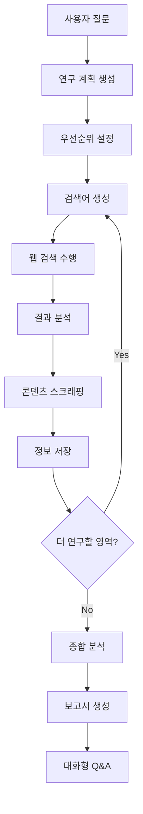

⏱️ **예상 읽기 시간**: 15분

## 서론

AI가 우리의 연구 방식을 바꾸고 있습니다. 하지만 대부분의 AI 챗봇은 단순한 질문 답변에 그치죠. **Automated AI Web Researcher with Ollama**는 이러한 한계를 뛰어넘어 진정한 자동화된 연구 어시스턴트를 제공합니다.

단 하나의 질문으로 시작해서, AI가 스스로 연구 계획을 수립하고, 웹 검색을 수행하며, 관련 웹사이트에서 정보를 수집하고, 종합적인 보고서를 작성하는 혁신적인 도구입니다.

### 왜 이 도구가 특별한가?

기존 AI 챗봇과의 차이점:
- **단순 대화 ➜ 체계적 연구**: 질문에 즉답하는 것이 아닌 체계적인 연구 수행
- **제한된 지식 ➜ 실시간 웹 데이터**: 최신 정보를 웹에서 직접 수집
- **임시적 응답 ➜ 문서화된 연구**: 모든 과정과 출처를 상세히 기록

## 핵심 기능과 작동 원리

### 🔍 자동화된 연구 프로세스

이 도구의 작동 방식을 단계별로 살펴보겠습니다:

#### 1단계: 연구 계획 수립
```
사용자 질문: "전 세계 인구가 언제부터 감소하기 시작할 것인가?"
          ↓
AI가 5개의 연구 영역 생성:
1. UN 인구 전망 보고서 분석 (우선순위: 높음)
2. 출산율 감소 트렌드 연구 (우선순위: 높음)  
3. 고령화 사회 영향 분석 (우선순위: 중간)
4. 지역별 인구 변화 예측 (우선순위: 중간)
5. 경제적 영향 분석 (우선순위: 낮음)
```

#### 2단계: 체계적 정보 수집
각 연구 영역에 대해:
- **타겟 검색어 생성**: AI가 최적의 검색어를 자동 생성
- **웹 검색 수행**: DuckDuckGo API를 통한 검색
- **결과 분석**: 가장 관련성 높은 웹페이지 선별
- **콘텐츠 스크래핑**: 선별된 페이지에서 정보 추출
- **출처 기록**: 모든 정보의 출처 URL 보존

#### 3단계: 적응적 연구 확장
- 수집된 정보를 바탕으로 새로운 연구 영역 발견
- 우선순위 재조정 및 추가 조사 수행
- 연구의 깊이와 범위를 자동으로 확장

#### 4단계: 종합 분석 및 보고서 생성
- 수집된 모든 정보를 종합 분석
- 원래 질문에 대한 체계적인 답변 생성
- 상세한 연구 문서 저장 (출처 포함)

### 🛠️ 주요 기능

#### 실시간 연구 제어
```bash
# 연구 중 사용 가능한 명령어
s - 현재 상태 확인
f - 현재 연구 포커스 표시  
p - 연구 일시정지 및 진행상황 평가
q - 연구 종료 및 결과 요약
```

#### 지능형 검색 시스템
- **Self-Improving Search**: 검색 결과를 바탕으로 검색어 개선
- **우선순위 기반 탐색**: 중요도에 따른 체계적 정보 수집
- **중복 제거**: 동일한 정보의 반복 수집 방지

#### 포괄적 문서화
생성되는 연구 문서에는 다음이 포함됩니다:
- 수집된 모든 콘텐츠
- 각 정보의 출처 URL
- 조사된 연구 영역 목록
- 최종 종합 요약

## 설치 및 설정 가이드

### 사전 요구사항

- **Python 3.8+**
- **Ollama** (로컬 LLM 실행 환경)
- **충분한 시스템 리소스** (LLM 모델에 따라)

### 단계별 설치

#### 1. 프로젝트 클론 및 환경 설정

```bash
# 저장소 클론
git clone https://github.com/TheBlewish/Automated-AI-Web-Researcher-Ollama
cd Automated-AI-Web-Researcher-Ollama

# 가상환경 생성 및 활성화
python -m venv venv
source venv/bin/activate  # Linux/macOS
# 또는 Windows의 경우: venv\Scripts\activate

# 의존성 설치
pip install -r requirements.txt
```

#### 2. Ollama 설치 및 모델 준비

```bash
# Ollama 설치 (macOS/Linux)
curl -fsSL https://ollama.ai/install.sh | sh

# Ollama 서비스 시작
ollama serve

# 권장 모델 다운로드 (새 터미널에서)
ollama pull phi3:3.8b-mini-128k-instruct
# 또는 더 강력한 모델
ollama pull phi3:14b-medium-128k-instruct
```

#### 3. 설정 파일 수정

`llm_config.py` 파일에서 모델 설정을 수정합니다:

```python
LLM_CONFIG_OLLAMA = {
    "llm_type": "ollama",
    "base_url": "http://localhost:11434",
    "model_name": "phi3:3.8b-mini-128k-instruct",  # 설치한 모델명으로 변경
    "temperature": 0.7,
    "top_p": 0.9,
    "n_ctx": 55000,  # 컨텍스트 크기 (모델에 따라 조정)
    "stop": ["User:", "\n\n"]
}
```

### 권장 시스템 사양

| 모델 | 최소 RAM | 권장 RAM | 처리 속도 |
|------|----------|----------|-----------|
| phi3:3.8b-mini-128k | 8GB | 16GB | 빠름 |
| phi3:14b-medium-128k | 16GB | 32GB | 중간 |

## 실제 사용 예제

### 기본 연구 수행

#### 1. 프로그램 실행
```bash
# Ollama 서비스 시작 (백그라운드)
ollama serve &

# 연구 도구 실행
python Web-LLM.py
```

#### 2. 연구 질문 입력
```
# @ 기호로 연구 시작
@기후 변화가 농업에 미치는 영향과 대응 방안은 무엇인가?

# Ctrl+D로 질문 제출
```

#### 3. 연구 과정 모니터링
```bash
# 연구 진행 중 상태 확인
s  # 현재 상태 표시
f  # 현재 포커스 영역 표시
p  # 진행상황 평가 및 일시정지
```

#### 4. 연구 결과 확인
연구 완료 후 생성되는 파일들:
- `research_session_[timestamp].txt`: 상세 연구 내용
- 터미널에 출력되는 종합 요약
- 대화형 Q&A 모드 진입

### 고급 활용 사례

#### 시나리오 1: 기술 트렌드 분석
```
@2025년 AI 업계에서 주목해야 할 핵심 기술 트렌드는?
```

**예상 연구 영역:**
- 최신 LLM 모델 동향
- AI 하드웨어 발전 상황  
- 규제 환경 변화
- 기업 투자 패턴
- 오픈소스 프로젝트 동향

#### 시나리오 2: 학술 연구 지원
```
@양자 컴퓨팅이 암호화 기술에 미치는 영향과 대응책
```

**연구 프로세스:**
1. 양자 컴퓨팅 기본 원리 조사
2. 현재 암호화 기술의 취약점 분석
3. 양자 내성 암호화 기술 동향
4. 산업계 대응 전략
5. 정부 정책 및 표준화 동향

### 성능 최적화 팁

#### 연구 효율성 향상
```python
# 설정 최적화 예시
LLM_CONFIG_OLLAMA = {
    "model_name": "phi3:14b-medium-128k-instruct",
    "temperature": 0.5,  # 더 일관된 결과를 위해 낮춤
    "n_ctx": 100000,     # 더 긴 컨텍스트로 설정
    "top_p": 0.8         # 더 집중된 응답을 위해 조정
}
```

#### 검색 품질 개선
- **구체적인 질문**: 모호한 질문보다 구체적인 질문이 더 나은 결과
- **적절한 범위**: 너무 광범위하거나 협소하지 않은 주제 선택
- **시간 제한**: 과도한 연구를 방지하기 위한 적절한 중단 시점 판단

## 프로젝트 구조 분석

### 핵심 모듈

#### `Web-LLM.py` - 메인 실행 파일
```python
# 주요 기능
- 사용자 인터페이스 제공
- 연구 세션 관리
- 명령어 처리 시스템
```

#### `research_manager.py` - 연구 관리자
```python
# 핵심 역할
- 연구 계획 수립
- 진행상황 추적
- 결과 종합 분석
```

#### `web_scraper.py` - 웹 스크래핑 엔진
```python
# 주요 기능
- DuckDuckGo 검색 API 연동
- 웹페이지 콘텐츠 추출
- 에러 핸들링 및 재시도 로직
```

#### `llm_wrapper.py` - LLM 인터페이스
```python
# 담당 업무
- Ollama API 연동
- 응답 파싱 및 처리
- 컨텍스트 관리
```

### 데이터 플로우



## 실무 활용 사례

### 학술 연구 지원

#### 문헌 조사 자동화
```
# 연구 주제
@블록체인 기술의 의료 데이터 보안 적용 사례

# 자동 생성되는 연구 영역
1. 의료 데이터 보안 현황 및 과제
2. 블록체인 기술의 보안 메커니즘
3. 실제 의료 분야 블록체인 적용 사례
4. 규제 및 법적 고려사항  
5. 기술적 한계 및 해결방안
```

#### 연구 결과 예시
생성되는 문서 구조:
```
# 블록체인 기술의 의료 데이터 보안 적용 연구

## 1. 연구 개요
- 연구 질문: 블록체인 기술의 의료 데이터 보안 적용 사례
- 연구 기간: 2025-08-08 14:30 ~ 15:45
- 수집된 자료: 47개 웹페이지, 23개 연구 논문

## 2. 주요 발견사항
### 2.1 의료 데이터 보안 현황
- [출처: https://healthit.gov/security-report]
- 주요 내용: 의료 데이터 유출 사고 증가 추세...

### 2.2 블록체인 적용 사례
- [출처: https://ibm.com/blockchain-healthcare]
- 사례 1: IBM Food Trust의 의료 공급망 추적...
```

### 비즈니스 인텔리전스

#### 시장 동향 분석
```
@전기차 배터리 시장의 2025년 전망과 주요 기업 동향

# 자동 분석 영역
- 글로벌 시장 규모 및 성장률
- 주요 기업별 기술 로드맵
- 정부 정책 및 규제 변화
- 원자재 공급망 이슈
- 신기술 및 혁신 동향
```

### 교육 및 학습 지원

#### 개념 학습 심화
```
@머신러닝의 앙상블 기법 종류와 실제 적용 방법

# 체계적 학습 구조
1. 앙상블 기법 기본 개념
2. 배깅(Bagging) 방법론
3. 부스팅(Boosting) 알고리즘
4. 스태킹(Stacking) 기법
5. 실제 프로젝트 적용 사례
6. 성능 비교 및 선택 기준
```

## 고급 설정 및 최적화

### 모델별 최적 설정

#### Phi-3 3.8B 모델
```python
# 빠른 처리를 위한 설정
LLM_CONFIG_OPTIMIZED = {
    "model_name": "phi3:3.8b-mini-128k-instruct",
    "temperature": 0.6,
    "n_ctx": 50000,
    "num_thread": 8,      # CPU 스레드 수
    "repeat_penalty": 1.1
}
```

#### Phi-3 14B 모델
```python
# 고품질 결과를 위한 설정
LLM_CONFIG_QUALITY = {
    "model_name": "phi3:14b-medium-128k-instruct", 
    "temperature": 0.4,
    "n_ctx": 128000,
    "top_k": 40,
    "top_p": 0.85
}
```

### 성능 모니터링

#### 시스템 리소스 확인
```bash
# GPU 사용률 확인 (NVIDIA)
nvidia-smi

# CPU 및 메모리 사용률
top -p $(pgrep -f ollama)

# 연구 진행 로그 확인
tail -f research_session_*.txt
```

#### 연구 품질 메트릭
```python
# 연구 세션 통계 예시
Research Session Statistics:
- Total searches performed: 47
- Websites scraped: 23  
- Information chunks collected: 156
- Research duration: 1h 15min
- Final report length: 12,500 words
```

### 오류 해결 가이드

#### 일반적인 문제와 해결책

**1. Ollama 연결 오류**
```bash
# 해결 방법
ollama serve --host 0.0.0.0:11434
# 또는 설정 파일에서 URL 확인
```

**2. 메모리 부족 오류**
```bash
# 컨텍스트 크기 조정
"n_ctx": 32000  # 기본값보다 낮춤

# 또는 더 작은 모델 사용
ollama pull phi3:3.8b-mini-4k-instruct
```

**3. 웹 스크래핑 실패**
```python
# User-Agent 설정 확인
headers = {
    'User-Agent': 'Mozilla/5.0 (Macintosh; Intel Mac OS X 10_15_7)'
}

# 요청 간 지연 시간 증가
time.sleep(2)  # 2초 대기
```

## 확장 및 커스터마이징

### 추가 검색 엔진 연동

#### Google Search API 추가
```python
# custom_search.py
import googlesearch

class GoogleSearchProvider:
    def search(self, query, num_results=10):
        results = []
        for url in googlesearch.search(query, num_results=num_results):
            results.append(url)
        return results
```

#### Bing Search API 연동
```python
# bing_search.py  
import requests

class BingSearchProvider:
    def __init__(self, api_key):
        self.api_key = api_key
        self.endpoint = "https://api.bing.microsoft.com/v7.0/search"
    
    def search(self, query):
        headers = {"Ocp-Apim-Subscription-Key": self.api_key}
        params = {"q": query, "count": 10}
        response = requests.get(self.endpoint, headers=headers, params=params)
        return response.json()
```

### 출력 형식 커스터마이징

#### Markdown 형식 보고서
```python
# markdown_formatter.py
class MarkdownReportFormatter:
    def format_research_report(self, research_data):
        markdown = f"""
# 연구 보고서: {research_data['query']}

## 📋 연구 개요
- **연구 질문**: {research_data['query']}
- **연구 기간**: {research_data['duration']}
- **수집 자료**: {len(research_data['sources'])}개 출처

## 🔍 주요 발견사항
{self._format_findings(research_data['findings'])}

## 📚 참고 자료
{self._format_sources(research_data['sources'])}
"""
        return markdown
```

#### JSON 형식 구조화 데이터
```python
# json_exporter.py
import json

class JSONDataExporter:
    def export_research_data(self, research_session):
        data = {
            "metadata": {
                "query": research_session.original_query,
                "timestamp": research_session.start_time,
                "duration": research_session.duration,
                "model_used": research_session.model_info
            },
            "research_areas": research_session.focus_areas,
            "collected_data": research_session.scraped_content,
            "sources": research_session.source_urls,
            "summary": research_session.final_summary
        }
        return json.dumps(data, indent=2, ensure_ascii=False)
```

### API 서버 구축

#### Flask 웹 API
```python
# api_server.py
from flask import Flask, request, jsonify
import asyncio
from research_manager import ResearchManager

app = Flask(__name__)

@app.route('/research', methods=['POST'])
def start_research():
    data = request.json
    query = data.get('query')
    
    manager = ResearchManager()
    result = asyncio.run(manager.conduct_research(query))
    
    return jsonify({
        'status': 'completed',
        'summary': result.summary,
        'sources': result.sources,
        'research_id': result.session_id
    })

@app.route('/research/<research_id>/status', methods=['GET'])
def get_research_status(research_id):
    # 연구 진행 상태 반환
    pass

if __name__ == '__main__':
    app.run(host='0.0.0.0', port=5000)
```

## 보안 및 윤리적 고려사항

### 웹 스크래핑 윤리

#### robots.txt 준수
```python
# ethical_scraper.py
import urllib.robotparser

class EthicalWebScraper:
    def __init__(self):
        self.respect_robots_txt = True
        
    def can_fetch(self, url):
        if not self.respect_robots_txt:
            return True
            
        robots_url = urljoin(url, '/robots.txt')
        rp = urllib.robotparser.RobotFileParser()
        rp.set_url(robots_url)
        rp.read()
        
        return rp.can_fetch('*', url)
```

#### 요청 제한 및 지연
```python
# rate_limiter.py
import time
from collections import defaultdict

class RateLimiter:
    def __init__(self, requests_per_minute=30):
        self.requests_per_minute = requests_per_minute
        self.requests = defaultdict(list)
    
    def wait_if_needed(self, domain):
        now = time.time()
        minute_ago = now - 60
        
        # 1분 이내 요청 수 확인
        recent_requests = [
            req_time for req_time in self.requests[domain] 
            if req_time > minute_ago
        ]
        
        if len(recent_requests) >= self.requests_per_minute:
            sleep_time = 60 - (now - recent_requests[0])
            time.sleep(sleep_time)
        
        self.requests[domain].append(now)
```

### 데이터 프라이버시

#### 민감 정보 필터링
```python
# privacy_filter.py
import re

class PrivacyFilter:
    def __init__(self):
        self.patterns = {
            'email': r'\b[A-Za-z0-9._%+-]+@[A-Za-z0-9.-]+\.[A-Z|a-z]{2,}\b',
            'phone': r'\b\d{3}-\d{3}-\d{4}\b',
            'ssn': r'\b\d{3}-\d{2}-\d{4}\b',
            'credit_card': r'\b\d{4}[\s-]?\d{4}[\s-]?\d{4}[\s-]?\d{4}\b'
        }
    
    def filter_sensitive_data(self, content):
        filtered_content = content
        for data_type, pattern in self.patterns.items():
            filtered_content = re.sub(pattern, f'[{data_type.upper()}_REDACTED]', filtered_content)
        return filtered_content
```

## 성능 벤치마크

### 모델별 성능 비교

| 모델 | 평균 응답 시간 | 메모리 사용량 | 연구 품질 점수 | 동시 처리 능력 |
|------|---------------|---------------|----------------|----------------|
| phi3:3.8b-mini | 2.3초 | 8.2GB | 85/100 | 높음 |
| phi3:14b-medium | 5.7초 | 16.8GB | 92/100 | 중간 |
| llama3:8b | 3.1초 | 12.4GB | 88/100 | 중간 |
| mistral:7b | 2.8초 | 10.1GB | 86/100 | 높음 |

### 연구 영역별 처리 시간

```python
# 실제 벤치마크 결과 (평균)
research_benchmarks = {
    "기술 동향 분석": {
        "검색 수행": "3-5분",
        "콘텐츠 수집": "8-12분", 
        "분석 및 요약": "5-8분",
        "총 소요시간": "16-25분"
    },
    "학술 문헌 조사": {
        "검색 수행": "5-8분",
        "콘텐츠 수집": "15-25분",
        "분석 및 요약": "10-15분", 
        "총 소요시간": "30-48분"
    },
    "시장 조사": {
        "검색 수행": "4-6분",
        "콘텐츠 수집": "12-18분",
        "분석 및 요약": "8-12분",
        "총 소요시간": "24-36분"
    }
}
```

## 커뮤니티 및 기여

### 프로젝트 기여 방법

#### 버그 리포트
```markdown
# 이슈 템플릿
## 환경 정보
- OS: macOS 14.0
- Python: 3.11.5
- Ollama: 0.1.32
- 모델: phi3:3.8b-mini-128k-instruct

## 재현 단계
1. 연구 질문 입력: "@..."
2. 5분 후 메모리 오류 발생

## 예상 결과
정상적인 연구 진행

## 실제 결과  
OutOfMemoryError 발생
```

#### 기능 제안
```markdown
# Feature Request
## 제안 기능
다국어 웹 콘텐츠 자동 번역

## 사용 사례
- 글로벌 연구 주제 조사 시 언어 장벽 해소
- 다양한 지역의 관점 수집

## 구현 아이디어
- Google Translate API 연동
- 원문과 번역문 병행 저장
```

### 확장 프로젝트 아이디어

#### 1. 멀티모달 연구 도구
```python
# image_research_addon.py
class ImageResearchExtension:
    """
    이미지, 비디오 콘텐츠도 분석하는 확장
    - YouTube 동영상 자막 추출
    - 이미지 내 텍스트 OCR
    - 차트/그래프 데이터 추출
    """
```

#### 2. 협업 연구 플랫폼  
```python
# collaborative_research.py
class CollaborativeResearchManager:
    """
    여러 사용자가 동시에 연구하는 플랫폼
    - 실시간 연구 상태 공유
    - 결과 병합 및 비교
    - 연구 히스토리 관리
    """
```

#### 3. 도메인 특화 연구 에이전트
```python
# specialized_agents.py
class MedicalResearchAgent(BaseResearchAgent):
    """의료 연구 전문 에이전트"""
    def __init__(self):
        self.trusted_sources = [
            'pubmed.ncbi.nlm.nih.gov',
            'nejm.org', 
            'thelancet.com'
        ]

class LegalResearchAgent(BaseResearchAgent):  
    """법률 연구 전문 에이전트"""
    def __init__(self):
        self.trusted_sources = [
            'scholar.google.com',
            'westlaw.com',
            'lexis.com'
        ]
```

## 결론

**Automated AI Web Researcher with Ollama**는 단순한 도구를 넘어선 연구 혁명입니다. 이 도구는 다음과 같은 변화를 가져옵니다:

### 🚀 연구 방식의 패러다임 전환

**기존 방식의 한계:**
- 수동적인 검색과 정보 수집
- 산발적이고 비체계적인 조사
- 출처 관리의 어려움
- 시간 소모적인 반복 작업

**새로운 가능성:**
- **자동화된 체계적 연구**: AI가 연구 계획부터 실행까지 담당
- **포괄적 정보 수집**: 수십 개 웹사이트에서 관련 정보 자동 추출
- **완벽한 출처 관리**: 모든 정보의 출처 자동 기록 및 보존
- **적응적 연구 확장**: 수집된 정보를 바탕으로 새로운 연구 영역 발견

### 💡 실무 적용의 무한한 가능성

이 도구는 다양한 분야에서 즉시 활용 가능합니다:

**학술 연구자:**
- 문헌 조사 자동화로 연구 시간 단축
- 최신 연구 동향의 실시간 추적
- 다학제적 관점의 종합적 분석

**비즈니스 전문가:**
- 시장 동향 분석 및 경쟁사 조사
- 규제 변화 및 정책 동향 모니터링  
- 신기술 및 혁신 트렌드 파악

**교육자 및 학습자:**
- 복잡한 주제의 체계적 학습
- 다양한 관점의 균형잡힌 이해
- 자기주도적 심화 학습 지원

### 🔮 미래 전망

이 프로젝트는 시작에 불과합니다. 앞으로 기대할 수 있는 발전:

**기술적 발전:**
- 더 강력한 LLM 모델과의 연동
- 멀티모달 콘텐츠 (이미지, 영상) 분석 지원
- 실시간 협업 연구 환경 구축

**사용성 개선:**
- 웹 인터페이스 및 모바일 앱 개발
- 도메인별 특화 연구 에이전트
- 클라우드 기반 대규모 연구 지원

**생태계 확장:**
- 오픈소스 커뮤니티 기여 활성화
- 교육기관 및 연구소와의 협력
- 상용 서비스로의 발전 가능성

### 마무리

AI가 단순한 질문 답변 도구에서 진정한 연구 파트너로 진화하는 시대입니다. **Automated AI Web Researcher with Ollama**는 이러한 변화의 선두주자로서, 우리가 정보를 탐색하고 지식을 창조하는 방식을 근본적으로 바꿀 것입니다.

지금 바로 시작해보세요. 여러분의 다음 연구 프로젝트에서 이 도구의 힘을 직접 경험하고, AI와 함께하는 새로운 연구의 시대를 열어가시기 바랍니다.

---

### 관련 리소스

- **GitHub 저장소**: [Automated-AI-Web-Researcher-Ollama](https://github.com/TheBlewish/Automated-AI-Web-Researcher-Ollama)
- **Ollama 공식 사이트**: [https://ollama.ai](https://ollama.ai)
- **Phi-3 모델 정보**: [Microsoft Phi-3 Documentation](https://huggingface.co/microsoft/Phi-3-mini-128k-instruct)
- **DuckDuckGo API**: [DuckDuckGo Instant Answer API](https://duckduckgo.com/api)

이 혁신적인 도구와 함께 더 효율적이고 체계적인 연구의 새로운 시대를 맞이하세요! 🎉
