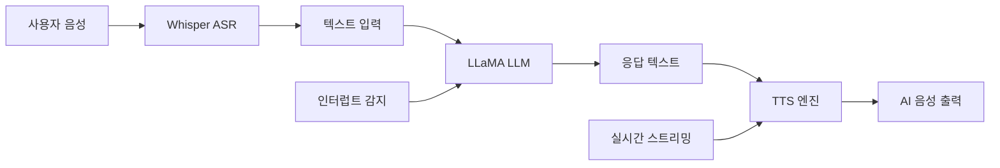

⏱️ **예상 읽기 시간**: 18분

## 서론

데이터 프라이버시와 보안이 중요한 시대에, 클라우드 기반 AI 서비스에 의존하지 않고 완전히 로컬에서 동작하는 음성 AI 시스템을 구축하는 것이 주목받고 있습니다. Local Talking LLM은 인터넷 연결 없이도 사용자와 자연스러운 음성 대화가 가능한 AI 어시스턴트를 구현하는 혁신적인 접근법입니다.

이 가이드에서는 OpenAI Whisper (음성 인식), LLaMA (언어 모델), 그리고 TTS (텍스트 음성 변환) 시스템을 결합하여 완전한 오프라인 음성 AI 시스템을 구축하는 방법을 단계별로 설명합니다.

## 시스템 아키텍처 개요

### 🏗️ 핵심 구성 요소

Local Talking LLM 시스템은 3개의 주요 신경망이 협력하여 동작합니다:

```python
# 시스템 아키텍처 개요
system_architecture = {
    "input_pipeline": {
        "component": "OpenAI Whisper",
        "function": "음성을 텍스트로 변환",
        "model_size": "small (39MB) ~ large (1.5GB)",
        "languages": "99개 언어 지원"
    },
    "processing_core": {
        "component": "LLaMA-based LLM",
        "function": "자연어 이해 및 응답 생성",
        "variants": ["Wizard-Vicuna", "Alpaca", "Guanaco"],
        "memory_requirement": "4GB ~ 32GB"
    },
    "output_pipeline": {
        "component": "TTS Engine",
        "function": "텍스트를 음성으로 변환",
        "options": ["Mimic 3", "Piper", "Coqui TTS"],
        "voice_quality": "자연스러운 인간 음성"
    }
}
```

### 🔄 데이터 플로우



## 시스템 요구사항

### 💻 하드웨어 요구사항

#### 최소 요구사항
```yaml
minimum_specs:
  ram: "16GB"
  cpu: "4코어 이상"
  storage: "50GB 여유 공간"
  microphone: "USB 헤드셋 또는 내장 마이크"
  speakers: "오디오 출력 장치"
  
  performance: "기본적인 대화 가능"
  response_time: "5-10초"
```

#### 권장 요구사항
```yaml
recommended_specs:
  ram: "32GB 이상"
  cpu: "8코어 이상 (Intel i7/AMD Ryzen 7)"
  gpu: "NVIDIA RTX 3060 이상 (선택사항)"
  storage: "100GB SSD"
  
  performance: "빠르고 자연스러운 대화"
  response_time: "1-3초"
```

#### 고성능 설정
```yaml
high_end_specs:
  ram: "64GB"
  cpu: "16코어 이상"
  gpu: "NVIDIA RTX 4090"
  storage: "200GB NVMe SSD"
  
  features:
    - "대용량 모델 지원 (65B 파라미터)"
    - "실시간 스트리밍"
    - "다중 언어 동시 지원"
```

### 🐧 소프트웨어 요구사항

```bash
# 지원 운영체제
supported_os = [
    "Ubuntu 22.04 LTS",
    "Debian 11/12",
    "CentOS 8+",
    "macOS 12+",
    "Windows 10/11 (WSL2)"
]

# Python 환경
python_requirements = {
    "version": "3.8+",
    "recommended": "3.11",
    "virtual_env": "강력 권장"
}
```

## 설치 가이드

### 🚀 자동 설치 스크립트

```bash
#!/bin/bash
# install_local_talking_llm.sh

echo "🎙️ Local Talking LLM 자동 설치 시작..."

# 시스템 체크
check_system() {
    echo "📋 시스템 요구사항 확인..."
    
    # RAM 체크
    RAM_GB=$(free -g | awk '/^Mem:/{print $2}')
    if [ $RAM_GB -lt 16 ]; then
        echo "❌ 최소 16GB RAM이 필요합니다. 현재: ${RAM_GB}GB"
        exit 1
    fi
    
    # CPU 코어 체크
    CPU_CORES=$(nproc)
    if [ $CPU_CORES -lt 4 ]; then
        echo "❌ 최소 4코어 CPU가 필요합니다. 현재: ${CPU_CORES}코어"
        exit 1
    fi
    
    # 디스크 공간 체크
    DISK_GB=$(df -BG . | awk 'NR==2{print $4}' | sed 's/G//')
    if [ $DISK_GB -lt 50 ]; then
        echo "❌ 최소 50GB 디스크 공간이 필요합니다. 현재: ${DISK_GB}GB"
        exit 1
    fi
    
    echo "✅ 시스템 요구사항 충족"
}

# 의존성 설치
install_dependencies() {
    echo "📦 의존성 패키지 설치..."
    
    # Ubuntu/Debian
    if command -v apt &> /dev/null; then
        sudo apt update
        sudo apt install -y \
            python3 python3-pip python3-venv \
            git curl wget \
            build-essential cmake \
            portaudio19-dev \
            alsa-utils speech-dispatcher \
            libsdl2-dev \
            ffmpeg
    
    # macOS
    elif command -v brew &> /dev/null; then
        brew install python3 git cmake portaudio ffmpeg
    
    # CentOS/RHEL
    elif command -v dnf &> /dev/null; then
        sudo dnf install -y \
            python3 python3-pip \
            git curl wget \
            gcc gcc-c++ cmake \
            portaudio-devel \
            alsa-lib-devel \
            SDL2-devel \
            ffmpeg-devel
    fi
}

# Python 가상환경 설정
setup_python_env() {
    echo "🐍 Python 가상환경 설정..."
    
    python3 -m venv local_talking_llm_env
    source local_talking_llm_env/bin/activate
    
    pip install --upgrade pip wheel setuptools
    
    # 필수 패키지 설치
    pip install \
        torch torchvision torchaudio \
        transformers \
        openai-whisper \
        TTS \
        streamlit \
        streamlit-mic-recorder \
        sounddevice \
        pygame \
        numpy \
        scipy \
        librosa \
        soundfile
}

# 모델 다운로드
download_models() {
    echo "📥 AI 모델 다운로드..."
    
    mkdir -p models/{whisper,llm,tts}
    
    # Whisper 모델
    echo "🎤 Whisper 모델 다운로드..."
    python3 -c "import whisper; whisper.load_model('small')"
    
    # LLM 모델 (Ollama 사용)
    if ! command -v ollama &> /dev/null; then
        echo "📥 Ollama 설치..."
        curl -fsSL https://ollama.ai/install.sh | sh
    fi
    
    echo "🧠 LLM 모델 다운로드..."
    ollama pull llama3.2:3b
    
    # TTS 모델
    echo "🔊 TTS 모델 설정..."
    python3 -c "from TTS.api import TTS; TTS(model_name='tts_models/en/ljspeech/tacotron2-DDC')"
}

# 메인 실행
main() {
    check_system
    install_dependencies
    setup_python_env
    download_models
    
    echo "✅ Local Talking LLM 설치 완료!"
    echo "🚀 실행: source local_talking_llm_env/bin/activate && python talking_llm.py"
}

main "$@"
```

### 🐳 Docker를 이용한 설치

```dockerfile
# Dockerfile
FROM nvidia/cuda:11.8-devel-ubuntu22.04

ENV DEBIAN_FRONTEND=noninteractive
ENV PYTHONUNBUFFERED=1

# 시스템 패키지 설치
RUN apt-get update && apt-get install -y \
    python3 python3-pip python3-venv \
    git curl wget \
    build-essential cmake \
    portaudio19-dev \
    alsa-utils speech-dispatcher \
    libsdl2-dev \
    ffmpeg \
    && rm -rf /var/lib/apt/lists/*

# 작업 디렉토리 설정
WORKDIR /app

# Python 의존성 설치
COPY requirements.txt .
RUN pip3 install --no-cache-dir -r requirements.txt

# 애플리케이션 코드 복사
COPY . .

# 모델 다운로드 스크립트
RUN python3 download_models.py

# 포트 노출
EXPOSE 8501

# 실행 명령
CMD ["python3", "talking_llm.py"]
```

```yaml
# docker-compose.yml
version: '3.8'

services:
  local-talking-llm:
    build: .
    container_name: talking_llm
    restart: unless-stopped
    ports:
      - "8501:8501"
    volumes:
      - ./models:/app/models
      - ./data:/app/data
      - /dev/snd:/dev/snd  # 오디오 장치 접근
    devices:
      - /dev/dri:/dev/dri  # GPU 접근
    environment:
      - NVIDIA_VISIBLE_DEVICES=all
      - NVIDIA_DRIVER_CAPABILITIES=compute,utility
    deploy:
      resources:
        reservations:
          devices:
            - driver: nvidia
              count: 1
              capabilities: [gpu]

  ollama:
    image: ollama/ollama:latest
    container_name: ollama_server
    restart: unless-stopped
    ports:
      - "11434:11434"
    volumes:
      - ollama_data:/root/.ollama
    environment:
      - NVIDIA_VISIBLE_DEVICES=all

volumes:
  ollama_data:
```

### 📦 Conda 환경 설정

```bash
# conda_setup.sh
#!/bin/bash

echo "🐍 Conda 환경 설정..."

# Miniconda 설치 (없는 경우)
if ! command -v conda &> /dev/null; then
    echo "📥 Miniconda 설치..."
    wget https://repo.anaconda.com/miniconda/Miniconda3-latest-Linux-x86_64.sh
    bash Miniconda3-latest-Linux-x86_64.sh -b
    source ~/miniconda3/bin/activate
    conda init
fi

# 환경 생성
conda create -n talking_llm python=3.11 -y
conda activate talking_llm

# PyTorch 설치 (CUDA 지원)
conda install pytorch torchvision torchaudio pytorch-cuda=11.8 -c pytorch -c nvidia -y

# 추가 패키지 설치
pip install \
    transformers \
    openai-whisper \
    TTS \
    streamlit \
    streamlit-mic-recorder \
    sounddevice \
    pygame \
    ollama

echo "✅ Conda 환경 설정 완료"
echo "🔄 환경 활성화: conda activate talking_llm"
```

## 핵심 구현

### 🎤 음성 인식 (Whisper) 구현

```python
# whisper_asr.py
import whisper
import numpy as np
import sounddevice as sd
import queue
import threading
import time
from typing import Optional, Callable

class WhisperASR:
    def __init__(self, model_name: str = "small", device: str = "auto"):
        """
        Whisper 음성 인식 클래스
        
        Args:
            model_name: Whisper 모델 크기 (tiny, base, small, medium, large)
            device: 실행 장치 (cpu, cuda, auto)
        """
        self.model = whisper.load_model(model_name)
        self.device = device
        self.sample_rate = 16000
        self.chunk_duration = 2.0  # 2초 청크
        self.chunk_size = int(self.sample_rate * self.chunk_duration)
        
        self.audio_queue = queue.Queue()
        self.is_recording = False
        self.callback_func: Optional[Callable] = None
        
    def audio_callback(self, indata, frames, time, status):
        """오디오 콜백 함수"""
        if status:
            print(f"Audio status: {status}")
        
        # 오디오 데이터를 큐에 추가
        self.audio_queue.put(indata.copy())
    
    def start_recording(self, callback: Optional[Callable] = None):
        """실시간 음성 인식 시작"""
        self.callback_func = callback
        self.is_recording = True
        
        # 오디오 스트림 시작
        self.stream = sd.InputStream(
            samplerate=self.sample_rate,
            channels=1,
            callback=self.audio_callback,
            blocksize=self.chunk_size,
            dtype=np.float32
        )
        
        self.stream.start()
        
        # 처리 스레드 시작
        self.processing_thread = threading.Thread(target=self._process_audio)
        self.processing_thread.start()
        
        print("🎤 음성 인식 시작됨")
    
    def stop_recording(self):
        """음성 인식 중지"""
        self.is_recording = False
        
        if hasattr(self, 'stream'):
            self.stream.stop()
            self.stream.close()
        
        if hasattr(self, 'processing_thread'):
            self.processing_thread.join()
        
        print("🛑 음성 인식 중지됨")
    
    def _process_audio(self):
        """오디오 처리 스레드"""
        audio_buffer = np.array([], dtype=np.float32)
        
        while self.is_recording:
            try:
                # 큐에서 오디오 데이터 가져오기
                chunk = self.audio_queue.get(timeout=1.0)
                audio_buffer = np.concatenate([audio_buffer, chunk.flatten()])
                
                # 충분한 오디오가 쌓이면 처리
                if len(audio_buffer) >= self.chunk_size:
                    # 음성 활동 감지 (간단한 에너지 기반)
                    energy = np.mean(audio_buffer ** 2)
                    
                    if energy > 0.001:  # 임계값
                        # Whisper로 음성 인식
                        text = self._transcribe_audio(audio_buffer)
                        
                        if text and self.callback_func:
                            self.callback_func(text)
                    
                    # 버퍼 초기화 (오버랩 유지)
                    overlap_size = self.chunk_size // 4
                    audio_buffer = audio_buffer[-overlap_size:]
                    
            except queue.Empty:
                continue
            except Exception as e:
                print(f"오디오 처리 오류: {e}")
    
    def _transcribe_audio(self, audio: np.ndarray) -> str:
        """오디오를 텍스트로 변환"""
        try:
            # Whisper 입력 형식으로 변환
            audio_whisper = whisper.pad_or_trim(audio)
            
            # 음성 인식 실행
            result = self.model.transcribe(
                audio_whisper,
                language="ko",  # 한국어 설정
                task="transcribe"
            )
            
            text = result["text"].strip()
            
            if text:
                print(f"👤 사용자: {text}")
                return text
                
        except Exception as e:
            print(f"음성 인식 오류: {e}")
        
        return ""
    
    def transcribe_file(self, audio_file: str) -> str:
        """파일에서 음성 인식"""
        try:
            result = self.model.transcribe(audio_file, language="ko")
            return result["text"].strip()
        except Exception as e:
            print(f"파일 음성 인식 오류: {e}")
            return ""

# 사용 예제
if __name__ == "__main__":
    def on_speech_detected(text):
        print(f"인식된 텍스트: {text}")
    
    asr = WhisperASR(model_name="small")
    asr.start_recording(callback=on_speech_detected)
    
    try:
        print("음성을 말해보세요... (Ctrl+C로 종료)")
        while True:
            time.sleep(1)
    except KeyboardInterrupt:
        asr.stop_recording()
```

### 🧠 LLM 처리 엔진

```python
# llm_engine.py
import ollama
import threading
import queue
from typing import Iterator, Optional, Dict, Any
import json
import time

class LocalLLMEngine:
    def __init__(self, model_name: str = "llama3.2:3b"):
        """
        로컬 LLM 엔진
        
        Args:
            model_name: 사용할 모델 이름
        """
        self.model_name = model_name
        self.conversation_history = []
        self.max_history = 10  # 최대 대화 기록 수
        
        # 시스템 프롬프트 설정
        self.system_prompt = """당신은 도움이 되고 친근한 AI 어시스턴트입니다.
사용자와 자연스럽고 유익한 대화를 나누세요.
답변은 간결하고 명확하게 해주세요.
한국어로 대답해주세요."""
        
        self._initialize_model()
    
    def _initialize_model(self):
        """모델 초기화 및 확인"""
        try:
            # 모델 존재 확인
            models = ollama.list()
            model_names = [model['name'] for model in models['models']]
            
            if self.model_name not in model_names:
                print(f"📥 모델 {self.model_name} 다운로드 중...")
                ollama.pull(self.model_name)
            
            # 테스트 생성
            response = ollama.generate(
                model=self.model_name,
                prompt="Hello",
                stream=False
            )
            
            print(f"✅ LLM 엔진 초기화 완료: {self.model_name}")
            
        except Exception as e:
            print(f"❌ LLM 초기화 실패: {e}")
            raise
    
    def generate_response(self, user_input: str) -> Iterator[str]:
        """
        사용자 입력에 대한 응답 생성 (스트리밍)
        
        Args:
            user_input: 사용자 입력 텍스트
            
        Yields:
            str: 생성된 응답 토큰
        """
        # 대화 기록에 추가
        self.conversation_history.append({
            "role": "user",
            "content": user_input
        })
        
        # 대화 기록 제한
        if len(self.conversation_history) > self.max_history * 2:
            self.conversation_history = self.conversation_history[-self.max_history * 2:]
        
        # 프롬프트 구성
        messages = [{"role": "system", "content": self.system_prompt}]
        messages.extend(self.conversation_history)
        
        try:
            # 스트리밍 응답 생성
            response_text = ""
            stream = ollama.chat(
                model=self.model_name,
                messages=messages,
                stream=True
            )
            
            for chunk in stream:
                if chunk['done']:
                    break
                
                content = chunk['message']['content']
                response_text += content
                yield content
            
            # 응답을 대화 기록에 추가
            self.conversation_history.append({
                "role": "assistant",
                "content": response_text
            })
            
        except Exception as e:
            error_msg = f"응답 생성 중 오류가 발생했습니다: {e}"
            print(f"❌ {error_msg}")
            yield error_msg
    
    def generate_complete_response(self, user_input: str) -> str:
        """완전한 응답 생성 (비스트리밍)"""
        response_parts = list(self.generate_response(user_input))
        return "".join(response_parts)
    
    def clear_history(self):
        """대화 기록 초기화"""
        self.conversation_history = []
        print("🗑️ 대화 기록이 초기화되었습니다.")
    
    def set_system_prompt(self, prompt: str):
        """시스템 프롬프트 설정"""
        self.system_prompt = prompt
        print(f"📝 시스템 프롬프트 업데이트됨")
    
    def get_model_info(self) -> Dict[str, Any]:
        """모델 정보 조회"""
        try:
            info = ollama.show(self.model_name)
            return {
                "name": info.get("name", ""),
                "size": info.get("size", ""),
                "modified": info.get("modified_at", ""),
                "parameters": info.get("details", {}).get("parameter_size", ""),
                "quantization": info.get("details", {}).get("quantization_level", "")
            }
        except Exception as e:
            return {"error": str(e)}

# 성능 최적화된 LLM 엔진
class OptimizedLLMEngine(LocalLLMEngine):
    def __init__(self, model_name: str = "llama3.2:3b", **kwargs):
        super().__init__(model_name)
        
        # 성능 설정
        self.generation_config = {
            "temperature": 0.7,
            "top_p": 0.9,
            "top_k": 40,
            "repeat_penalty": 1.1,
            "num_predict": 512,  # 최대 토큰 수
        }
        
        # 응답 캐시
        self.response_cache = {}
        self.cache_size_limit = 100
        
    def generate_response(self, user_input: str) -> Iterator[str]:
        """캐시를 활용한 최적화된 응답 생성"""
        # 캐시 확인
        cache_key = hash(user_input)
        if cache_key in self.response_cache:
            cached_response = self.response_cache[cache_key]
            for char in cached_response:
                yield char
                time.sleep(0.01)  # 타이핑 효과
            return
        
        # 새로운 응답 생성
        response_text = ""
        for token in super().generate_response(user_input):
            response_text += token
            yield token
        
        # 캐시에 저장
        if len(self.response_cache) >= self.cache_size_limit:
            # 오래된 항목 제거
            oldest_key = next(iter(self.response_cache))
            del self.response_cache[oldest_key]
        
        self.response_cache[cache_key] = response_text

# 사용 예제
if __name__ == "__main__":
    engine = LocalLLMEngine()
    
    print("💬 LLM 엔진 테스트 시작")
    print(f"📊 모델 정보: {engine.get_model_info()}")
    
    while True:
        try:
            user_input = input("\n사용자: ")
            if user_input.lower() in ['quit', 'exit', '종료']:
                break
            
            print("🤖 AI: ", end="", flush=True)
            for token in engine.generate_response(user_input):
                print(token, end="", flush=True)
            print()  # 줄바꿈
            
        except KeyboardInterrupt:
            break
    
    print("\n👋 대화를 종료합니다.")
```

### 🔊 텍스트 음성 변환 (TTS)

```python
# tts_engine.py
import pygame
import io
from TTS.api import TTS
import numpy as np
import threading
import queue
import time
from typing import Optional, List
import tempfile
import os

class LocalTTSEngine:
    def __init__(self, model_name: str = "tts_models/en/ljspeech/tacotron2-DDC"):
        """
        로컬 TTS 엔진
        
        Args:
            model_name: 사용할 TTS 모델
        """
        # pygame 초기화
        pygame.mixer.init(frequency=22050, size=-16, channels=1, buffer=512)
        
        # TTS 모델 로드
        self.tts = TTS(model_name=model_name)
        
        # 한국어 모델도 추가 로드
        try:
            self.tts_ko = TTS(model_name="tts_models/ko/kss/tacotron2-DDC")
            self.korean_available = True
        except:
            self.korean_available = False
            print("⚠️ 한국어 TTS 모델을 사용할 수 없습니다.")
        
        # 오디오 큐
        self.audio_queue = queue.Queue()
        self.is_playing = False
        self.current_playback = None
        
        # 음성 설정
        self.speech_rate = 1.0  # 말하기 속도
        self.volume = 0.8
        
        print("✅ TTS 엔진 초기화 완료")
    
    def text_to_speech(self, text: str, language: str = "auto") -> bytes:
        """
        텍스트를 음성으로 변환
        
        Args:
            text: 변환할 텍스트
            language: 언어 설정 (auto, en, ko)
            
        Returns:
            bytes: WAV 오디오 데이터
        """
        try:
            # 언어 자동 감지
            if language == "auto":
                # 한글이 포함되어 있으면 한국어
                if any('\uac00' <= char <= '\ud7a3' for char in text):
                    language = "ko"
                else:
                    language = "en"
            
            # 모델 선택
            if language == "ko" and self.korean_available:
                tts_model = self.tts_ko
            else:
                tts_model = self.tts
            
            # 임시 파일 생성
            with tempfile.NamedTemporaryFile(suffix=".wav", delete=False) as tmp_file:
                tmp_path = tmp_file.name
            
            # TTS 생성
            tts_model.tts_to_file(text=text, file_path=tmp_path)
            
            # 오디오 데이터 읽기
            with open(tmp_path, 'rb') as f:
                audio_data = f.read()
            
            # 임시 파일 삭제
            os.unlink(tmp_path)
            
            return audio_data
            
        except Exception as e:
            print(f"❌ TTS 변환 오류: {e}")
            return b""
    
    def speak(self, text: str, language: str = "auto", blocking: bool = False):
        """
        텍스트를 음성으로 재생
        
        Args:
            text: 재생할 텍스트
            language: 언어 설정
            blocking: 차단 모드 (True면 재생 완료까지 대기)
        """
        if not text.strip():
            return
        
        print(f"🔊 TTS: {text}")
        
        # 음성 생성
        audio_data = self.text_to_speech(text, language)
        
        if audio_data:
            # 큐에 추가
            self.audio_queue.put(audio_data)
            
            # 재생 스레드 시작 (아직 실행 중이 아닌 경우)
            if not self.is_playing:
                playback_thread = threading.Thread(target=self._playback_worker)
                playback_thread.start()
            
            # 블로킹 모드인 경우 재생 완료까지 대기
            if blocking:
                while not self.audio_queue.empty() or self.is_playing:
                    time.sleep(0.1)
    
    def speak_streaming(self, text_stream, language: str = "auto"):
        """
        스트리밍 텍스트를 음성으로 변환
        
        Args:
            text_stream: 텍스트 스트림 (Iterator)
            language: 언어 설정
        """
        sentence_buffer = ""
        
        for token in text_stream:
            sentence_buffer += token
            
            # 문장 끝 감지
            if any(punct in sentence_buffer for punct in ['.', '!', '?', '。', '！', '？']):
                # 문장 단위로 음성 생성
                if sentence_buffer.strip():
                    self.speak(sentence_buffer.strip(), language)
                sentence_buffer = ""
        
        # 남은 텍스트 처리
        if sentence_buffer.strip():
            self.speak(sentence_buffer.strip(), language)
    
    def _playback_worker(self):
        """오디오 재생 워커 스레드"""
        self.is_playing = True
        
        while not self.audio_queue.empty():
            try:
                audio_data = self.audio_queue.get_nowait()
                
                # 임시 파일로 저장
                with tempfile.NamedTemporaryFile(suffix=".wav", delete=False) as tmp_file:
                    tmp_file.write(audio_data)
                    tmp_path = tmp_file.name
                
                # pygame으로 재생
                sound = pygame.mixer.Sound(tmp_path)
                sound.set_volume(self.volume)
                channel = sound.play()
                
                # 재생 완료까지 대기
                while channel.get_busy():
                    time.sleep(0.1)
                
                # 임시 파일 삭제
                os.unlink(tmp_path)
                
            except queue.Empty:
                break
            except Exception as e:
                print(f"❌ 오디오 재생 오류: {e}")
        
        self.is_playing = False
    
    def stop(self):
        """재생 중지"""
        pygame.mixer.stop()
        
        # 큐 비우기
        while not self.audio_queue.empty():
            try:
                self.audio_queue.get_nowait()
            except queue.Empty:
                break
        
        print("🛑 TTS 재생 중지")
    
    def set_volume(self, volume: float):
        """볼륨 설정 (0.0 ~ 1.0)"""
        self.volume = max(0.0, min(1.0, volume))
        print(f"🔊 볼륨 설정: {self.volume:.1f}")
    
    def set_speech_rate(self, rate: float):
        """말하기 속도 설정"""
        self.speech_rate = max(0.5, min(2.0, rate))
        print(f"⚡ 말하기 속도: {self.speech_rate:.1f}x")
    
    def get_available_models(self) -> List[str]:
        """사용 가능한 TTS 모델 목록"""
        return TTS.list_models()

# 고급 TTS 엔진 (감정 표현 지원)
class AdvancedTTSEngine(LocalTTSEngine):
    def __init__(self):
        super().__init__()
        
        # 감정별 음성 설정
        self.emotion_settings = {
            "neutral": {"rate": 1.0, "volume": 0.8},
            "happy": {"rate": 1.2, "volume": 0.9},
            "sad": {"rate": 0.8, "volume": 0.6},
            "excited": {"rate": 1.4, "volume": 1.0},
            "calm": {"rate": 0.9, "volume": 0.7}
        }
    
    def speak_with_emotion(self, text: str, emotion: str = "neutral"):
        """감정을 포함한 음성 출력"""
        settings = self.emotion_settings.get(emotion, self.emotion_settings["neutral"])
        
        # 임시로 설정 변경
        original_rate = self.speech_rate
        original_volume = self.volume
        
        self.set_speech_rate(settings["rate"])
        self.set_volume(settings["volume"])
        
        # 음성 출력
        self.speak(text)
        
        # 설정 복원
        self.set_speech_rate(original_rate)
        self.set_volume(original_volume)

# 사용 예제
if __name__ == "__main__":
    tts = LocalTTSEngine()
    
    # 기본 테스트
    tts.speak("안녕하세요! 로컬 TTS 엔진입니다.", blocking=True)
    tts.speak("Hello! This is a local TTS engine.", blocking=True)
    
    # 볼륨 테스트
    tts.set_volume(0.5)
    tts.speak("볼륨이 절반으로 줄었습니다.", blocking=True)
    
    print("✅ TTS 테스트 완료")
```

### 🎭 통합 시스템

```python
# talking_llm.py
import streamlit as st
import threading
import time
from whisper_asr import WhisperASR
from llm_engine import LocalLLMEngine
from tts_engine import LocalTTSEngine
import queue

class TalkingLLMSystem:
    def __init__(self):
        """통합 Talking LLM 시스템"""
        self.initialize_components()
        self.setup_ui()
        
    def initialize_components(self):
        """구성 요소 초기화"""
        with st.spinner("🚀 시스템 초기화 중..."):
            # 각 구성 요소 초기화
            self.asr = WhisperASR(model_name="small")
            self.llm = LocalLLMEngine(model_name="llama3.2:3b")
            self.tts = LocalTTSEngine()
            
            # 상태 변수
            self.is_listening = False
            self.conversation_active = False
            
            # 메시지 큐
            self.message_queue = queue.Queue()
            
        st.success("✅ 시스템 초기화 완료!")
    
    def setup_ui(self):
        """Streamlit UI 설정"""
        st.set_page_config(
            page_title="Local Talking LLM",
            page_icon="🎙️",
            layout="wide"
        )
        
        st.title("🎙️ Local Talking LLM")
        st.markdown("완전 오프라인 음성 AI 어시스턴트")
        
        # 사이드바 설정
        with st.sidebar:
            st.header("⚙️ 설정")
            
            # 모델 정보
            st.subheader("📊 모델 정보")
            model_info = self.llm.get_model_info()
            st.json(model_info)
            
            # 음성 설정
            st.subheader("🔊 음성 설정")
            volume = st.slider("볼륨", 0.0, 1.0, 0.8, 0.1)
            self.tts.set_volume(volume)
            
            speech_rate = st.slider("말하기 속도", 0.5, 2.0, 1.0, 0.1)
            self.tts.set_speech_rate(speech_rate)
            
            # 시스템 제어
            st.subheader("🎛️ 시스템 제어")
            if st.button("🗑️ 대화 기록 초기화"):
                self.llm.clear_history()
                st.success("대화 기록이 초기화되었습니다.")
        
        # 메인 영역
        self.main_interface()
    
    def main_interface(self):
        """메인 인터페이스"""
        col1, col2 = st.columns([3, 1])
        
        with col1:
            # 대화 영역
            st.subheader("💬 대화")
            
            # 대화 기록 표시
            chat_container = st.container()
            with chat_container:
                if hasattr(self.llm, 'conversation_history'):
                    for msg in self.llm.conversation_history:
                        if msg['role'] == 'user':
                            st.chat_message("user").write(msg['content'])
                        elif msg['role'] == 'assistant':
                            st.chat_message("assistant").write(msg['content'])
            
            # 텍스트 입력
            user_input = st.chat_input("메시지를 입력하거나 음성으로 말하세요...")
            
            if user_input:
                self.process_user_input(user_input)
        
        with col2:
            # 음성 제어
            st.subheader("🎤 음성 제어")
            
            if st.button("🎙️ 음성 대화 시작", key="start_voice"):
                self.start_voice_conversation()
            
            if st.button("🛑 음성 대화 중지", key="stop_voice"):
                self.stop_voice_conversation()
            
            # 상태 표시
            status_placeholder = st.empty()
            
            if self.is_listening:
                status_placeholder.success("🎤 듣고 있습니다...")
            elif self.conversation_active:
                status_placeholder.info("💭 생각 중...")
            else:
                status_placeholder.info("⏸️ 대기 중")
    
    def process_user_input(self, user_input: str):
        """사용자 입력 처리"""
        # 사용자 메시지 표시
        st.chat_message("user").write(user_input)
        
        # AI 응답 생성
        with st.chat_message("assistant"):
            response_placeholder = st.empty()
            full_response = ""
            
            # 스트리밍 응답
            for token in self.llm.generate_response(user_input):
                full_response += token
                response_placeholder.write(full_response)
            
            # TTS로 음성 출력
            self.tts.speak(full_response)
    
    def start_voice_conversation(self):
        """음성 대화 시작"""
        if not self.is_listening:
            self.is_listening = True
            self.asr.start_recording(callback=self.on_speech_detected)
            st.success("🎤 음성 대화가 시작되었습니다!")
    
    def stop_voice_conversation(self):
        """음성 대화 중지"""
        if self.is_listening:
            self.is_listening = False
            self.asr.stop_recording()
            self.tts.stop()
            st.info("🛑 음성 대화가 중지되었습니다.")
    
    def on_speech_detected(self, text: str):
        """음성 감지 콜백"""
        if text and len(text.strip()) > 3:  # 최소 길이 필터
            self.message_queue.put(text)
            
            # 백그라운드에서 처리
            threading.Thread(
                target=self.process_speech_input,
                args=(text,),
                daemon=True
            ).start()
    
    def process_speech_input(self, text: str):
        """음성 입력 처리"""
        self.conversation_active = True
        
        try:
            # LLM 응답 생성
            response_text = ""
            for token in self.llm.generate_response(text):
                response_text += token
            
            # TTS 출력
            if response_text:
                self.tts.speak(response_text)
            
        except Exception as e:
            st.error(f"처리 중 오류: {e}")
        
        finally:
            self.conversation_active = False

def main():
    """메인 함수"""
    try:
        system = TalkingLLMSystem()
        
        # 자동 새로고침 (개발 중)
        if st.button("🔄 새로고침"):
            st.rerun()
            
    except Exception as e:
        st.error(f"시스템 초기화 실패: {e}")
        st.info("시스템 요구사항을 확인하고 다시 시도해주세요.")

if __name__ == "__main__":
    main()
```

## 고급 기능 구현

### 🎯 실시간 음성 중단 및 스트리밍

```python
# advanced_features.py
import threading
import time
from typing import Generator
import numpy as np

class InterruptibleTTS:
    def __init__(self, tts_engine, asr_engine):
        self.tts = tts_engine
        self.asr = asr_engine
        self.is_speaking = False
        self.interrupt_flag = threading.Event()
        
    def speak_with_interruption(self, text: str):
        """중단 가능한 음성 출력"""
        self.interrupt_flag.clear()
        self.is_speaking = True
        
        # 음성 감지 스레드 시작
        interrupt_thread = threading.Thread(
            target=self._monitor_interruption,
            daemon=True
        )
        interrupt_thread.start()
        
        # 문장 단위로 분할하여 재생
        sentences = self._split_sentences(text)
        
        for sentence in sentences:
            if self.interrupt_flag.is_set():
                print("🛑 음성 출력이 중단되었습니다.")
                break
                
            self.tts.speak(sentence, blocking=True)
        
        self.is_speaking = False
    
    def _monitor_interruption(self):
        """음성 중단 모니터링"""
        silence_threshold = 0.01
        speech_threshold = 0.05
        
        while self.is_speaking and not self.interrupt_flag.is_set():
            # 마이크에서 오디오 레벨 체크
            audio_level = self._get_audio_level()
            
            if audio_level > speech_threshold:
                # 사용자가 말하기 시작함
                self.interrupt_flag.set()
                self.tts.stop()
                break
            
            time.sleep(0.1)
    
    def _get_audio_level(self) -> float:
        """현재 오디오 레벨 측정"""
        # 실제 구현에서는 sounddevice 또는 pyaudio 사용
        return np.random.random() * 0.1  # 더미 구현
    
    def _split_sentences(self, text: str) -> list:
        """텍스트를 문장 단위로 분할"""
        import re
        sentences = re.split(r'[.!?。！？]\s*', text)
        return [s.strip() for s in sentences if s.strip()]

class StreamingLLMProcessor:
    def __init__(self, llm_engine, tts_engine):
        self.llm = llm_engine
        self.tts = tts_engine
        
    def process_streaming(self, user_input: str) -> Generator[str, None, None]:
        """스트리밍 LLM 처리"""
        sentence_buffer = ""
        
        for token in self.llm.generate_response(user_input):
            sentence_buffer += token
            yield token
            
            # 문장 완성 시 즉시 TTS 시작
            if self._is_sentence_complete(sentence_buffer):
                # 백그라운드에서 TTS 실행
                threading.Thread(
                    target=self.tts.speak,
                    args=(sentence_buffer.strip(),),
                    daemon=True
                ).start()
                
                sentence_buffer = ""
        
        # 남은 텍스트 처리
        if sentence_buffer.strip():
            threading.Thread(
                target=self.tts.speak,
                args=(sentence_buffer.strip(),),
                daemon=True
            ).start()
    
    def _is_sentence_complete(self, text: str) -> bool:
        """문장 완성 여부 확인"""
        endings = ['.', '!', '?', '。', '！', '？']
        return any(text.strip().endswith(end) for end in endings)
```

### 🌍 다국어 지원

```python
# multilingual_support.py
import langdetect
from typing import Dict, List

class MultilingualProcessor:
    def __init__(self):
        # 지원 언어 설정
        self.supported_languages = {
            'ko': {
                'name': '한국어',
                'whisper_code': 'ko',
                'tts_model': 'tts_models/ko/kss/tacotron2-DDC',
                'system_prompt': '당신은 도움이 되는 한국어 AI 어시스턴트입니다.'
            },
            'en': {
                'name': 'English',
                'whisper_code': 'en',
                'tts_model': 'tts_models/en/ljspeech/tacotron2-DDC',
                'system_prompt': 'You are a helpful English AI assistant.'
            },
            'ja': {
                'name': '日本語',
                'whisper_code': 'ja',
                'tts_model': 'tts_models/ja/kokoro/tacotron2-DDC',
                'system_prompt': 'あなたは役に立つ日本語のAIアシスタントです。'
            },
            'zh': {
                'name': '中文',
                'whisper_code': 'zh',
                'tts_model': 'tts_models/zh-CN/baker/tacotron2-DDC',
                'system_prompt': '你是一个有用的中文AI助手。'
            }
        }
        
        self.current_language = 'ko'  # 기본 언어
    
    def detect_language(self, text: str) -> str:
        """텍스트 언어 감지"""
        try:
            detected = langdetect.detect(text)
            if detected in self.supported_languages:
                return detected
        except:
            pass
        
        # 한글 문자 포함 여부로 판단
        if any('\uac00' <= char <= '\ud7a3' for char in text):
            return 'ko'
        
        return 'en'  # 기본값
    
    def set_language(self, language_code: str):
        """언어 설정"""
        if language_code in self.supported_languages:
            self.current_language = language_code
            print(f"🌍 언어 설정: {self.supported_languages[language_code]['name']}")
        else:
            print(f"❌ 지원하지 않는 언어: {language_code}")
    
    def get_language_config(self, language_code: str = None) -> Dict:
        """언어별 설정 조회"""
        lang = language_code or self.current_language
        return self.supported_languages.get(lang, self.supported_languages['ko'])
    
    def get_system_prompt(self, language_code: str = None) -> str:
        """언어별 시스템 프롬프트"""
        config = self.get_language_config(language_code)
        return config['system_prompt']

# 언어별 모델 관리자
class LanguageModelManager:
    def __init__(self):
        self.loaded_models = {}
        self.multilingual = MultilingualProcessor()
    
    def load_model_for_language(self, language_code: str):
        """언어별 모델 로드"""
        if language_code not in self.loaded_models:
            config = self.multilingual.get_language_config(language_code)
            
            # TTS 모델 로드
            try:
                from TTS.api import TTS
                tts_model = TTS(model_name=config['tts_model'])
                self.loaded_models[language_code] = {
                    'tts': tts_model,
                    'config': config
                }
                print(f"✅ {config['name']} 모델 로드 완료")
            except Exception as e:
                print(f"❌ {config['name']} 모델 로드 실패: {e}")
    
    def get_tts_model(self, language_code: str):
        """언어별 TTS 모델 조회"""
        if language_code not in self.loaded_models:
            self.load_model_for_language(language_code)
        
        return self.loaded_models.get(language_code, {}).get('tts')
```

### 🎛️ 고급 설정 및 최적화

```python
# advanced_config.py
import json
import os
from dataclasses import dataclass, asdict
from typing import Optional, Dict, Any

@dataclass
class SystemConfig:
    """시스템 설정 클래스"""
    
    # 음성 인식 설정
    whisper_model: str = "small"
    whisper_language: str = "auto"
    audio_threshold: float = 0.001
    chunk_duration: float = 2.0
    
    # LLM 설정
    llm_model: str = "llama3.2:3b"
    max_history: int = 10
    temperature: float = 0.7
    max_tokens: int = 512
    
    # TTS 설정
    tts_model: str = "tts_models/en/ljspeech/tacotron2-DDC"
    speech_rate: float = 1.0
    volume: float = 0.8
    
    # 시스템 설정
    enable_interruption: bool = True
    enable_streaming: bool = True
    cache_responses: bool = True
    log_conversations: bool = False
    
    # 성능 설정
    num_threads: int = 4
    gpu_acceleration: bool = True
    memory_limit: str = "8GB"

class ConfigManager:
    def __init__(self, config_file: str = "config.json"):
        self.config_file = config_file
        self.config = self.load_config()
    
    def load_config(self) -> SystemConfig:
        """설정 파일 로드"""
        if os.path.exists(self.config_file):
            try:
                with open(self.config_file, 'r', encoding='utf-8') as f:
                    data = json.load(f)
                return SystemConfig(**data)
            except Exception as e:
                print(f"설정 로드 실패: {e}")
        
        # 기본 설정 반환
        return SystemConfig()
    
    def save_config(self):
        """설정 파일 저장"""
        try:
            with open(self.config_file, 'w', encoding='utf-8') as f:
                json.dump(asdict(self.config), f, indent=2, ensure_ascii=False)
            print(f"✅ 설정 저장됨: {self.config_file}")
        except Exception as e:
            print(f"❌ 설정 저장 실패: {e}")
    
    def update_config(self, **kwargs):
        """설정 업데이트"""
        for key, value in kwargs.items():
            if hasattr(self.config, key):
                setattr(self.config, key, value)
                print(f"📝 설정 업데이트: {key} = {value}")
        
        self.save_config()
    
    def get_optimized_config(self) -> Dict[str, Any]:
        """하드웨어 기반 최적화된 설정"""
        import psutil
        
        # 시스템 정보 수집
        ram_gb = psutil.virtual_memory().total // (1024**3)
        cpu_count = psutil.cpu_count()
        
        optimized = asdict(self.config)
        
        # RAM 기반 최적화
        if ram_gb >= 32:
            optimized['llm_model'] = "llama3.2:8b"
            optimized['whisper_model'] = "medium"
            optimized['max_tokens'] = 1024
        elif ram_gb >= 16:
            optimized['llm_model'] = "llama3.2:3b"
            optimized['whisper_model'] = "small"
            optimized['max_tokens'] = 512
        else:
            optimized['llm_model'] = "llama3.2:1b"
            optimized['whisper_model'] = "tiny"
            optimized['max_tokens'] = 256
        
        # CPU 기반 최적화
        optimized['num_threads'] = min(cpu_count, 8)
        
        return optimized

# 성능 모니터링
class PerformanceMonitor:
    def __init__(self):
        self.metrics = {
            'asr_latency': [],
            'llm_latency': [],
            'tts_latency': [],
            'memory_usage': [],
            'cpu_usage': []
        }
    
    def record_metric(self, metric_name: str, value: float):
        """메트릭 기록"""
        if metric_name in self.metrics:
            self.metrics[metric_name].append(value)
            
            # 최근 100개만 유지
            if len(self.metrics[metric_name]) > 100:
                self.metrics[metric_name] = self.metrics[metric_name][-100:]
    
    def get_average_latency(self, component: str) -> float:
        """평균 지연시간 계산"""
        latencies = self.metrics.get(f'{component}_latency', [])
        return sum(latencies) / len(latencies) if latencies else 0.0
    
    def get_performance_report(self) -> Dict[str, Any]:
        """성능 리포트 생성"""
        return {
            'asr_avg_latency': self.get_average_latency('asr'),
            'llm_avg_latency': self.get_average_latency('llm'),
            'tts_avg_latency': self.get_average_latency('tts'),
            'total_conversations': len(self.metrics['asr_latency']),
            'system_health': self._calculate_health_score()
        }
    
    def _calculate_health_score(self) -> str:
        """시스템 건강도 계산"""
        total_latency = (
            self.get_average_latency('asr') +
            self.get_average_latency('llm') +
            self.get_average_latency('tts')
        )
        
        if total_latency < 3.0:
            return "excellent"
        elif total_latency < 5.0:
            return "good"
        elif total_latency < 8.0:
            return "fair"
        else:
            return "poor"
```

## 문제 해결 가이드

### 🔧 일반적인 문제들

#### 1. 음성 인식 문제

```python
# 디버깅 도구
class ASRDebugger:
    def __init__(self, asr_engine):
        self.asr = asr_engine
    
    def test_microphone(self):
        """마이크 테스트"""
        import sounddevice as sd
        
        print("🎤 마이크 테스트 시작...")
        
        # 사용 가능한 오디오 장치 확인
        devices = sd.query_devices()
        print("📱 사용 가능한 오디오 장치:")
        for i, device in enumerate(devices):
            print(f"  {i}: {device['name']}")
        
        # 기본 입력 장치 테스트
        try:
            duration = 3  # 3초
            print(f"🔴 {duration}초간 녹음 시작...")
            
            recording = sd.rec(
                int(duration * 16000),
                samplerate=16000,
                channels=1,
                dtype='float32'
            )
            sd.wait()
            
            # 오디오 레벨 확인
            max_level = np.max(np.abs(recording))
            print(f"📊 최대 오디오 레벨: {max_level:.4f}")
            
            if max_level < 0.001:
                print("⚠️ 오디오 레벨이 너무 낮습니다. 마이크 설정을 확인하세요.")
            else:
                print("✅ 마이크가 정상적으로 작동합니다.")
                
                # Whisper 테스트
                text = self.asr._transcribe_audio(recording.flatten())
                if text:
                    print(f"🎯 인식된 텍스트: '{text}'")
                else:
                    print("❌ 음성 인식 실패")
            
        except Exception as e:
            print(f"❌ 마이크 테스트 실패: {e}")
    
    def check_whisper_models(self):
        """Whisper 모델 확인"""
        import whisper
        
        available_models = whisper.available_models()
        print(f"📦 사용 가능한 Whisper 모델: {available_models}")
        
        for model_name in ["tiny", "base", "small"]:
            try:
                model = whisper.load_model(model_name)
                print(f"✅ {model_name} 모델 로드 성공")
            except Exception as e:
                print(f"❌ {model_name} 모델 로드 실패: {e}")
```

#### 2. LLM 성능 문제

```bash
# 시스템 리소스 확인 스크립트
#!/bin/bash
# check_system_resources.sh

echo "🖥️ 시스템 리소스 확인"
echo "===================="

# RAM 사용량
echo "💾 메모리 사용량:"
free -h

echo ""

# CPU 정보
echo "🖥️ CPU 정보:"
lscpu | grep -E "(Model name|CPU\(s\)|Core\(s\)|Thread\(s\))"

echo ""

# 디스크 공간
echo "💿 디스크 사용량:"
df -h

echo ""

# GPU 정보 (NVIDIA)
if command -v nvidia-smi &> /dev/null; then
    echo "🎮 GPU 정보:"
    nvidia-smi --query-gpu=name,memory.total,memory.used --format=csv,noheader,nounits
else
    echo "🎮 NVIDIA GPU 없음"
fi

echo ""

# Ollama 상태 확인
if command -v ollama &> /dev/null; then
    echo "🦙 Ollama 모델 목록:"
    ollama list
else
    echo "❌ Ollama가 설치되지 않음"
fi
```

#### 3. TTS 음질 문제

```python
# TTS 최적화 설정
class TTSOptimizer:
    def __init__(self):
        self.optimization_settings = {
            "high_quality": {
                "model": "tts_models/en/ljspeech/glow-tts",
                "vocoder": "vocoder_models/en/ljspeech/hifigan_v2",
                "sample_rate": 22050
            },
            "fast": {
                "model": "tts_models/en/ljspeech/tacotron2-DDC",
                "vocoder": "vocoder_models/en/ljspeech/hifigan_v1",
                "sample_rate": 16000
            },
            "balanced": {
                "model": "tts_models/en/ljspeech/tacotron2-DCA",
                "vocoder": "vocoder_models/en/ljspeech/multiband-melgan",
                "sample_rate": 22050
            }
        }
    
    def optimize_for_hardware(self) -> str:
        """하드웨어에 따른 최적화"""
        import psutil
        
        ram_gb = psutil.virtual_memory().total // (1024**3)
        cpu_count = psutil.cpu_count()
        
        if ram_gb >= 16 and cpu_count >= 8:
            return "high_quality"
        elif ram_gb >= 8 and cpu_count >= 4:
            return "balanced"
        else:
            return "fast"
    
    def get_recommended_settings(self) -> dict:
        """권장 설정 반환"""
        profile = self.optimize_for_hardware()
        return self.optimization_settings[profile]
```

## 배포 및 운영

### 🚀 프로덕션 배포

```bash
#!/bin/bash
# deploy_production.sh

echo "🚀 프로덕션 배포 시작..."

# 환경 설정
export ENVIRONMENT="production"
export LOG_LEVEL="INFO"
export MAX_WORKERS=4

# 가상환경 활성화
source local_talking_llm_env/bin/activate

# 의존성 업데이트
pip install --upgrade -r requirements.txt

# 모델 최적화
python optimize_models.py

# 설정 검증
python validate_config.py

# 서비스 시작
if command -v systemctl &> /dev/null; then
    # systemd 서비스로 실행
    sudo cp talking-llm.service /etc/systemd/system/
    sudo systemctl daemon-reload
    sudo systemctl enable talking-llm
    sudo systemctl start talking-llm
    
    echo "✅ systemd 서비스로 시작됨"
else
    # 직접 실행
    nohup python talking_llm.py > logs/app.log 2>&1 &
    echo "✅ 백그라운드에서 시작됨"
fi

echo "🎉 배포 완료!"
```

```ini
# talking-llm.service
[Unit]
Description=Local Talking LLM Service
After=network.target

[Service]
Type=simple
User=talking-llm
WorkingDirectory=/opt/talking-llm
Environment=PATH=/opt/talking-llm/venv/bin
ExecStart=/opt/talking-llm/venv/bin/python talking_llm.py
Restart=always
RestartSec=10

[Install]
WantedBy=multi-user.target
```

### 📊 모니터링 및 로깅

```python
# monitoring.py
import logging
import time
import psutil
from datetime import datetime
import json

class SystemMonitor:
    def __init__(self, log_file: str = "system_monitor.log"):
        # 로깅 설정
        logging.basicConfig(
            level=logging.INFO,
            format='%(asctime)s - %(levelname)s - %(message)s',
            handlers=[
                logging.FileHandler(log_file, encoding='utf-8'),
                logging.StreamHandler()
            ]
        )
        self.logger = logging.getLogger(__name__)
        
        self.start_time = time.time()
        self.conversation_count = 0
        
    def log_conversation(self, user_input: str, ai_response: str, 
                        processing_time: float):
        """대화 로깅"""
        self.conversation_count += 1
        
        log_data = {
            "timestamp": datetime.now().isoformat(),
            "conversation_id": self.conversation_count,
            "user_input_length": len(user_input),
            "ai_response_length": len(ai_response),
            "processing_time": processing_time,
            "system_memory": psutil.virtual_memory().percent,
            "system_cpu": psutil.cpu_percent()
        }
        
        self.logger.info(f"CONVERSATION: {json.dumps(log_data, ensure_ascii=False)}")
    
    def log_system_status(self):
        """시스템 상태 로깅"""
        uptime = time.time() - self.start_time
        
        status = {
            "uptime_hours": uptime / 3600,
            "total_conversations": self.conversation_count,
            "memory_usage": psutil.virtual_memory().percent,
            "cpu_usage": psutil.cpu_percent(interval=1),
            "disk_usage": psutil.disk_usage('/').percent
        }
        
        self.logger.info(f"SYSTEM_STATUS: {json.dumps(status)}")
    
    def check_health(self) -> bool:
        """시스템 건강도 체크"""
        memory_usage = psutil.virtual_memory().percent
        cpu_usage = psutil.cpu_percent(interval=1)
        disk_usage = psutil.disk_usage('/').percent
        
        if memory_usage > 90:
            self.logger.warning(f"High memory usage: {memory_usage}%")
            return False
        
        if cpu_usage > 95:
            self.logger.warning(f"High CPU usage: {cpu_usage}%")
            return False
        
        if disk_usage > 95:
            self.logger.warning(f"High disk usage: {disk_usage}%")
            return False
        
        return True
```

## 결론

Local Talking LLM 시스템은 완전한 데이터 프라이버시를 보장하면서도 자연스러운 음성 대화가 가능한 혁신적인 AI 어시스턴트를 구현합니다. 이 가이드를 통해 다음과 같은 이점을 얻을 수 있습니다:

### 🎯 주요 성과

- **완전한 오프라인 동작**: 인터넷 연결 없이 독립적 운영
- **데이터 프라이버시**: 모든 대화 내용이 로컬에서 처리
- **실시간 상호작용**: 자연스러운 음성 대화 경험
- **다국어 지원**: 여러 언어에서 동시 동작 가능
- **커스터마이징**: 개인 또는 기업 요구에 맞춘 설정

### 🚀 향후 발전 방향

```python
future_enhancements = {
    "performance": [
        "GPU 가속 최적화",
        "더 작은 모델 크기",
        "실시간 스트리밍 개선"
    ],
    "features": [
        "감정 인식 및 표현",
        "컨텍스트 기억 확장",
        "멀티모달 입력 지원"
    ],
    "integration": [
        "스마트홈 연동",
        "IoT 디바이스 제어",
        "외부 API 연결 옵션"
    ]
}
```

### 💡 실무 적용 권장사항

1. **하드웨어 투자**: 16GB+ RAM과 SSD는 필수
2. **점진적 배포**: 소규모 테스트부터 시작
3. **모니터링**: 시스템 성능 지속적 관찰
4. **보안**: 정기적인 모델 및 시스템 업데이트

Local Talking LLM은 AI 기술의 민주화와 개인정보 보호를 동시에 실현하는 미래지향적인 솔루션입니다. 이 가이드를 바탕으로 여러분만의 프라이빗 AI 어시스턴트를 구축해보세요.

---

**더 알아보기:**
- [OpenAI Whisper GitHub](https://github.com/openai/whisper)
- [Ollama 공식 웹사이트](https://ollama.ai/)
- [Coqui TTS](https://github.com/coqui-ai/TTS)
- [LLaMA 모델 가이드](https://llama.meta.com/)
