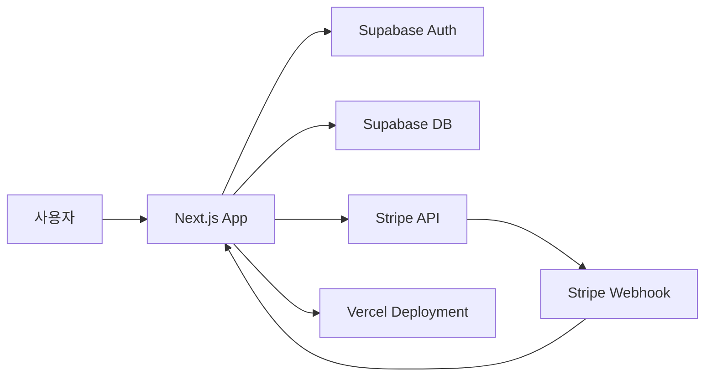

⏱️ **예상 읽기 시간**: 22분

## 서론

SaaS(Software as a Service) 애플리케이션 개발에서 가장 중요한 요소 중 하나는 안정적이고 확장 가능한 구독 결제 시스템입니다. [Next.js SaaS Stripe Starter](https://github.com/vercel/nextjs-subscription-payments)는 이러한 복잡한 요구사항을 만족하는 완전한 솔루션을 제공합니다.

이 가이드에서는 Next.js, Supabase, Stripe를 결합하여 프로덕션 준비가 완료된 SaaS 애플리케이션을 구축하는 모든 과정을 다루겠습니다. 사용자 인증부터 구독 관리, 결제 처리, 웹훅 처리까지 실무에 필요한 모든 기능을 구현해보겠습니다.

## 아키텍처 개요

### 🏗️ 기술 스택

```yaml
technology_stack:
  frontend:
    framework: "Next.js 14"
    language: "TypeScript"
    styling: "Tailwind CSS"
    ui_components: "Headless UI"
    
  backend:
    runtime: "Next.js API Routes"
    database: "Supabase (PostgreSQL)"
    auth: "Supabase Auth"
    file_storage: "Supabase Storage"
    
  payments:
    gateway: "Stripe"
    features: ["구독", "일회성 결제", "고객 포털"]
    
  deployment:
    platform: "Vercel"
    cdn: "Vercel Edge Network"
    monitoring: "Vercel Analytics"
```

### 🔄 시스템 아키텍처



### 📊 데이터베이스 스키마

```sql
-- 주요 테이블 구조
table_structure = {
  "users": {
    "id": "uuid PRIMARY KEY",
    "email": "text",
    "full_name": "text",
    "avatar_url": "text",
    "billing_address": "jsonb",
    "payment_method": "jsonb"
  },
  
  "products": {
    "id": "text PRIMARY KEY",
    "active": "boolean",
    "name": "text",
    "description": "text",
    "image": "text",
    "metadata": "jsonb"
  },
  
  "prices": {
    "id": "text PRIMARY KEY", 
    "product_id": "text REFERENCES products",
    "active": "boolean",
    "currency": "text",
    "type": "pricing_type",
    "unit_amount": "bigint",
    "interval": "pricing_plan_interval",
    "interval_count": "integer"
  },
  
  "subscriptions": {
    "id": "text PRIMARY KEY",
    "user_id": "uuid REFERENCES users",
    "status": "subscription_status",
    "metadata": "jsonb",
    "price_id": "text REFERENCES prices",
    "quantity": "integer",
    "cancel_at_period_end": "boolean",
    "created": "timestamp",
    "current_period_start": "timestamp",
    "current_period_end": "timestamp",
    "ended_at": "timestamp",
    "cancel_at": "timestamp",
    "canceled_at": "timestamp"
  }
}
```

## 프로젝트 설정

### 🚀 빠른 시작 (Vercel 배포 버튼 사용)

```bash
# 1. Vercel Deploy 버튼 클릭
# https://vercel.com/new/templates/next.js/subscription-starter

# 2. GitHub 저장소 생성 및 Vercel 배포
# 3. Supabase 프로젝트 자동 생성
# 4. 환경 변수 자동 설정

echo "✅ 1-클릭 배포 완료!"
```

### 📦 수동 설치

```bash
# 저장소 클론
git clone https://github.com/vercel/nextjs-subscription-payments.git
cd nextjs-subscription-payments

# 의존성 설치
pnpm install

# 환경 변수 파일 생성
cp .env.local.example .env.local
cp .env.example .env
```

### 🛠️ 개발 환경 설정

```bash
# package.json 스크립트 확인
{
  "scripts": {
    "dev": "next dev",
    "build": "next build", 
    "start": "next start",
    "lint": "next lint",
    "supabase:start": "supabase start",
    "supabase:stop": "supabase stop",
    "supabase:status": "supabase status",
    "supabase:reset": "supabase db reset",
    "supabase:link": "supabase link",
    "supabase:pull": "supabase db pull",
    "supabase:push": "supabase db push",
    "supabase:generate-types": "supabase gen types typescript --local > types_db.ts",
    "supabase:generate-migration": "supabase db diff -f migration_name",
    "supabase:generate-seed": "supabase db dump --data-only -f supabase/seed.sql",
    "stripe:login": "stripe login",
    "stripe:listen": "stripe listen --forward-to localhost:3000/api/webhooks"
  }
}
```

## Supabase 설정

### 🗄️ 데이터베이스 설정

#### 프로젝트 생성 및 초기화

```bash
# Supabase CLI 설치
npm install -g supabase

# 새 Supabase 프로젝트 생성
supabase init

# 로컬 Supabase 시작
pnpm supabase:start

# 데이터베이스 스키마 적용
supabase db reset
```

#### 데이터베이스 스키마

```sql
-- supabase/migrations/001_initial_schema.sql

-- Enable necessary extensions
CREATE EXTENSION IF NOT EXISTS "uuid-ossp";

-- Create custom types
CREATE TYPE pricing_type AS ENUM ('one_time', 'recurring');
CREATE TYPE pricing_plan_interval AS ENUM ('day', 'week', 'month', 'year');
CREATE TYPE subscription_status AS ENUM (
  'trialing', 'active', 'canceled', 'incomplete', 
  'incomplete_expired', 'past_due', 'unpaid', 'paused'
);

-- Users table (extends Supabase auth.users)
CREATE TABLE users (
  id UUID REFERENCES auth.users NOT NULL PRIMARY KEY,
  full_name TEXT,
  avatar_url TEXT,
  billing_address JSONB,
  payment_method JSONB
);

-- Products table
CREATE TABLE products (
  id TEXT PRIMARY KEY,
  active BOOLEAN DEFAULT TRUE,
  name TEXT NOT NULL,
  description TEXT,
  image TEXT,
  metadata JSONB DEFAULT '{}'::jsonb
);

-- Prices table
CREATE TABLE prices (
  id TEXT PRIMARY KEY,
  product_id TEXT REFERENCES products(id) ON DELETE CASCADE,
  active BOOLEAN DEFAULT TRUE,
  description TEXT,
  unit_amount BIGINT,
  currency TEXT CHECK (char_length(currency) = 3),
  type pricing_type,
  interval pricing_plan_interval,
  interval_count INTEGER,
  trial_period_days INTEGER,
  metadata JSONB DEFAULT '{}'::jsonb
);

-- Subscriptions table
CREATE TABLE subscriptions (
  id TEXT PRIMARY KEY,
  user_id UUID REFERENCES auth.users NOT NULL,
  status subscription_status,
  metadata JSONB DEFAULT '{}'::jsonb,
  price_id TEXT REFERENCES prices(id),
  quantity INTEGER,
  cancel_at_period_end BOOLEAN DEFAULT FALSE,
  created TIMESTAMP WITH TIME ZONE DEFAULT timezone('utc'::text, now()) NOT NULL,
  current_period_start TIMESTAMP WITH TIME ZONE DEFAULT timezone('utc'::text, now()) NOT NULL,
  current_period_end TIMESTAMP WITH TIME ZONE DEFAULT timezone('utc'::text, now()) NOT NULL,
  ended_at TIMESTAMP WITH TIME ZONE,
  cancel_at TIMESTAMP WITH TIME ZONE,
  canceled_at TIMESTAMP WITH TIME ZONE,
  trial_start TIMESTAMP WITH TIME ZONE,
  trial_end TIMESTAMP WITH TIME ZONE
);

-- Enable Row Level Security
ALTER TABLE users ENABLE ROW LEVEL SECURITY;
ALTER TABLE products ENABLE ROW LEVEL SECURITY;
ALTER TABLE prices ENABLE ROW LEVEL SECURITY;
ALTER TABLE subscriptions ENABLE ROW LEVEL SECURITY;

-- Create policies
CREATE POLICY "Users can view own user data" ON users FOR SELECT USING (auth.uid() = id);
CREATE POLICY "Users can update own user data" ON users FOR UPDATE USING (auth.uid() = id);

CREATE POLICY "Allow public read-only access to products" ON products FOR SELECT USING (true);
CREATE POLICY "Allow public read-only access to prices" ON prices FOR SELECT USING (true);

CREATE POLICY "Users can view own subscriptions" ON subscriptions FOR SELECT USING (auth.uid() = user_id);

-- Create functions
CREATE OR REPLACE FUNCTION handle_new_user()
RETURNS TRIGGER AS $$
BEGIN
  INSERT INTO public.users (id, full_name, avatar_url)
  VALUES (new.id, new.raw_user_meta_data->>'full_name', new.raw_user_meta_data->>'avatar_url');
  RETURN new;
END;
$$ LANGUAGE plpgsql SECURITY definer;

-- Create trigger
CREATE TRIGGER on_auth_user_created
  AFTER INSERT ON auth.users
  FOR EACH ROW EXECUTE PROCEDURE handle_new_user();
```

### 🔐 인증 설정

#### GitHub OAuth 설정

```javascript
// 1. GitHub에서 OAuth App 생성
// Settings > Developer settings > OAuth Apps > New OAuth App

const githubOAuthConfig = {
  applicationName: "Your SaaS App",
  homepageURL: "https://your-app.vercel.app",
  authorizationCallbackURL: "https://your-app.vercel.app/auth/callback",
  // 로컬 개발용
  localCallbackURL: "http://localhost:3000/auth/callback"
};

// 2. Supabase에서 GitHub Provider 설정
// Authentication > Settings > Auth Providers > GitHub
```

#### Supabase 환경 변수

```bash
# .env.local
NEXT_PUBLIC_SUPABASE_URL=your_supabase_project_url
NEXT_PUBLIC_SUPABASE_ANON_KEY=your_supabase_anon_key
SUPABASE_SERVICE_ROLE_KEY=your_supabase_service_role_key
```

### 📱 타입 생성

```bash
# TypeScript 타입 자동 생성
pnpm supabase:generate-types

# 생성된 타입 확인
cat types_db.ts
```

## Stripe 설정

### 🏪 제품 및 가격 설정

#### Stripe 대시보드에서 제품 생성

```javascript
// 제품 예시 구조
const products = [
  {
    name: "Basic Plan",
    description: "기본 기능을 포함한 스타터 플랜",
    prices: [
      {
        amount: 999, // $9.99
        currency: "usd",
        interval: "month"
      },
      {
        amount: 9999, // $99.99 (연간 할인)
        currency: "usd", 
        interval: "year"
      }
    ]
  },
  {
    name: "Pro Plan",
    description: "고급 기능을 포함한 프로 플랜",
    prices: [
      {
        amount: 2999, // $29.99
        currency: "usd",
        interval: "month"
      },
      {
        amount: 29999, // $299.99
        currency: "usd",
        interval: "year"
      }
    ]
  }
];
```

#### Stripe Fixtures로 테스트 데이터 생성

```bash
# Stripe CLI 로그인
stripe login

# 테스트 제품 및 가격 생성
stripe fixtures fixtures/stripe-fixtures.json
```

```json
<!-- fixtures/stripe-fixtures.json -->
{
  "products": [
    {
      "id": "prod_starter",
      "name": "Starter",
      "description": "Perfect for small teams",
      "metadata": {
        "features": "5 users, 10GB storage, Basic support"
      }
    },
    {
      "id": "prod_pro", 
      "name": "Pro",
      "description": "For growing businesses",
      "metadata": {
        "features": "25 users, 100GB storage, Priority support"
      }
    }
  ],
  "prices": [
    {
      "id": "price_starter_monthly",
      "product": "prod_starter",
      "unit_amount": 999,
      "currency": "usd",
      "recurring": {
        "interval": "month"
      }
    },
    {
      "id": "price_starter_yearly",
      "product": "prod_starter", 
      "unit_amount": 9999,
      "currency": "usd",
      "recurring": {
        "interval": "year"
      }
    },
    {
      "id": "price_pro_monthly",
      "product": "prod_pro",
      "unit_amount": 2999,
      "currency": "usd",
      "recurring": {
        "interval": "month"
      }
    },
    {
      "id": "price_pro_yearly",
      "product": "prod_pro",
      "unit_amount": 29999,
      "currency": "usd",
      "recurring": {
        "interval": "year"
      }
    }
  ]
}
```

### 🎣 웹훅 설정

#### 웹훅 엔드포인트 생성

```typescript
// app/api/webhooks/route.ts
import { headers } from 'next/headers';
import { NextRequest, NextResponse } from 'next/server';
import Stripe from 'stripe';
import { stripe } from '@/utils/stripe';
import {
  upsertProductRecord,
  upsertPriceRecord,
  manageSubscriptionStatusChange,
  deleteProductRecord,
  deletePriceRecord
} from '@/utils/supabase-admin';

const relevantEvents = new Set([
  'product.created',
  'product.updated',
  'product.deleted',
  'price.created', 
  'price.updated',
  'price.deleted',
  'checkout.session.completed',
  'customer.subscription.created',
  'customer.subscription.updated',
  'customer.subscription.deleted',
  'invoice.payment_succeeded',
  'invoice.payment_failed'
]);

export async function POST(req: NextRequest) {
  const body = await req.text();
  const sig = headers().get('stripe-signature') as string;
  const webhookSecret = process.env.STRIPE_WEBHOOK_SECRET;

  let event: Stripe.Event;

  try {
    if (!sig || !webhookSecret) {
      console.error('Missing stripe signature or webhook secret');
      return new NextResponse('Webhook secret not found.', { status: 400 });
    }
    
    event = stripe.webhooks.constructEvent(body, sig, webhookSecret);
    console.log(`🔔 Webhook received: ${event.type}`);
  } catch (err: any) {
    console.error(`❌ Webhook signature verification failed: ${err.message}`);
    return new NextResponse(`Webhook Error: ${err.message}`, { status: 400 });
  }

  if (relevantEvents.has(event.type)) {
    try {
      switch (event.type) {
        case 'product.created':
        case 'product.updated':
          await upsertProductRecord(event.data.object as Stripe.Product);
          break;
        case 'price.created':
        case 'price.updated':
          await upsertPriceRecord(event.data.object as Stripe.Price);
          break;
        case 'price.deleted':
          await deletePriceRecord(event.data.object as Stripe.Price);
          break;
        case 'product.deleted':
          await deleteProductRecord(event.data.object as Stripe.Product);
          break;
        case 'customer.subscription.created':
        case 'customer.subscription.updated':
        case 'customer.subscription.deleted':
          const subscription = event.data.object as Stripe.Subscription;
          await manageSubscriptionStatusChange(
            subscription.id,
            subscription.customer as string,
            event.type === 'customer.subscription.created'
          );
          break;
        case 'checkout.session.completed':
          const checkoutSession = event.data.object as Stripe.Checkout.Session;
          if (checkoutSession.mode === 'subscription') {
            const subscriptionId = checkoutSession.subscription;
            await manageSubscriptionStatusChange(
              subscriptionId as string,
              checkoutSession.customer as string,
              true
            );
          }
          break;
        default:
          throw new Error('Unhandled relevant event!');
      }
    } catch (error) {
      console.error('Error processing webhook:', error);
      return new NextResponse('Webhook handler failed. View your nextjs function logs.', {
        status: 400
      });
    }
  } else {
    return new NextResponse(`Unsupported event type: ${event.type}`, {
      status: 400
    });
  }
  
  return new NextResponse(JSON.stringify({ received: true }));
}
```

#### 로컬 웹훅 테스트

```bash
# 터미널 1: Next.js 개발 서버
pnpm dev

# 터미널 2: Stripe 웹훅 리스닝  
pnpm stripe:listen

# 출력에서 웹훅 시크릿 복사하여 .env.local에 추가
# STRIPE_WEBHOOK_SECRET=whsec_xxxxx
```

## 핵심 기능 구현

### 💳 구독 체크아웃

```typescript
// utils/stripe-helpers.ts
import { createClientComponentClient } from '@supabase/auth-helpers-nextjs';
import { getStripe } from '@/utils/stripe-client';
import { Price, ProductWithPrice } from '@/types';

interface CheckoutResponse {
  errorRedirect?: string;
  sessionId?: string;
}

export const getErrorRedirect = (
  path: string,
  errorMsgPrefix: string,
  errorMsg: string = 'An unknown error occurred.'
) => `${path}?error=${encodeURIComponent(`${errorMsgPrefix}: ${errorMsg}`)}`;

export const redirectToCheckout = async (price: Price): Promise<void> => {
  try {
    const supabase = createClientComponentClient();
    
    // 사용자 인증 확인
    const {
      data: { user }
    } = await supabase.auth.getUser();

    if (!user) {
      throw new Error('사용자가 로그인되어 있지 않습니다.');
    }

    // 체크아웃 세션 생성
    const { data: checkoutResponse, error } = await supabase.functions.invoke(
      'create-checkout-session',
      {
        body: {
          price: price,
          quantity: 1,
          metadata: {
            user_id: user.id
          }
        }
      }
    );

    if (error) {
      throw new Error(error.message);
    }

    const { sessionId } = checkoutResponse as CheckoutResponse;
    
    if (!sessionId) {
      throw new Error('체크아웃 세션 생성에 실패했습니다.');
    }

    // Stripe Checkout으로 리디렉션
    const stripe = await getStripe();
    const { error: stripeError } = await stripe!.redirectToCheckout({
      sessionId
    });

    if (stripeError) {
      throw new Error(stripeError.message);
    }
  } catch (error) {
    console.error('Checkout error:', error);
    return window.location.assign(
      getErrorRedirect(
        '/pricing',
        '체크아웃 오류',
        error instanceof Error ? error.message : '알 수 없는 오류가 발생했습니다.'
      )
    );
  }
};
```

#### 체크아웃 API Route

```typescript
// app/api/create-checkout-session/route.ts
import { createRouteHandlerClient } from '@supabase/auth-helpers-nextjs';
import { cookies } from 'next/headers';
import { NextRequest, NextResponse } from 'next/server';
import { stripe } from '@/utils/stripe';
import { createOrRetrieveCustomer } from '@/utils/supabase-admin';
import { getURL } from '@/utils/helpers';

export async function POST(req: NextRequest) {
  try {
    const { price, quantity = 1, metadata = {} } = await req.json();
    
    const supabase = createRouteHandlerClient({ cookies });
    const {
      data: { user }
    } = await supabase.auth.getUser();

    if (!user) {
      throw new Error('인증되지 않은 사용자입니다.');
    }

    // Stripe 고객 생성 또는 조회
    const customer = await createOrRetrieveCustomer({
      uuid: user.id,
      email: user.email || ''
    });

    // 체크아웃 세션 생성
    const session = await stripe.checkout.sessions.create({
      payment_method_types: ['card'],
      billing_address_collection: 'required',
      customer,
      line_items: [
        {
          price: price.id,
          quantity
        }
      ],
      mode: 'subscription',
      allow_promotion_codes: true,
      subscription_data: {
        metadata
      },
      success_url: `${getURL()}/account`,
      cancel_url: `${getURL()}/pricing`
    });

    return NextResponse.json({ sessionId: session.id });
  } catch (error: any) {
    console.error('Error creating checkout session:', error);
    return new NextResponse(
      JSON.stringify({ error: error.message }),
      { status: 500 }
    );
  }
}
```

### 🎛️ 고객 포털

```typescript
// utils/stripe-helpers.ts 계속
export const redirectToCustomerPortal = async (): Promise<void> => {
  try {
    const supabase = createClientComponentClient();
    
    const {
      data: { user }
    } = await supabase.auth.getUser();

    if (!user) {
      throw new Error('사용자가 로그인되어 있지 않습니다.');
    }

    const { data, error } = await supabase.functions.invoke(
      'create-portal-session'
    );

    if (error) {
      throw new Error(error.message);
    }

    window.location.assign(data.url);
  } catch (error) {
    console.error('Portal redirect error:', error);
    return window.location.assign(
      getErrorRedirect(
        '/account',
        '포털 오류',
        error instanceof Error ? error.message : '알 수 없는 오류가 발생했습니다.'
      )
    );
  }
};
```

#### 포털 API Route

```typescript
// app/api/create-portal-session/route.ts
import { createRouteHandlerClient } from '@supabase/auth-helpers-nextjs';
import { cookies } from 'next/headers';
import { NextRequest, NextResponse } from 'next/server';
import { stripe } from '@/utils/stripe';
import { createOrRetrieveCustomer } from '@/utils/supabase-admin';
import { getURL } from '@/utils/helpers';

export async function POST(req: NextRequest) {
  try {
    const supabase = createRouteHandlerClient({ cookies });
    const {
      data: { user }
    } = await supabase.auth.getUser();

    if (!user) {
      throw new Error('인증되지 않은 사용자입니다.');
    }

    const customer = await createOrRetrieveCustomer({
      uuid: user.id,
      email: user.email || ''
    });

    if (!customer) {
      throw new Error('고객 정보를 찾을 수 없습니다.');
    }

    const { url } = await stripe.billingPortal.sessions.create({
      customer,
      return_url: `${getURL()}/account`
    });

    return NextResponse.json({ url });
  } catch (error: any) {
    console.error('Error creating portal session:', error);
    return new NextResponse(
      JSON.stringify({ error: error.message }),
      { status: 500 }
    );
  }
}
```

### 👤 사용자 계정 관리

```typescript
// components/AccountForm.tsx
'use client';

import { useState } from 'react';
import { useRouter } from 'next/navigation';
import { createClientComponentClient } from '@supabase/auth-helpers-nextjs';
import { User } from '@supabase/gotrue-js';
import { Card, CardContent, CardHeader, CardTitle } from '@/components/ui/Card';
import { Button } from '@/components/ui/Button';

interface Props {
  user: User;
}

export default function AccountForm({ user }: Props) {
  const router = useRouter();
  const supabase = createClientComponentClient();
  const [loading, setLoading] = useState(false);
  const [fullName, setFullName] = useState(user.user_metadata?.full_name ?? '');

  const updateProfile = async (e: React.FormEvent) => {
    e.preventDefault();
    setLoading(true);

    try {
      const { error } = await supabase.auth.updateUser({
        data: { full_name: fullName }
      });

      if (error) {
        throw error;
      }

      router.refresh();
    } catch (error) {
      console.error('프로필 업데이트 오류:', error);
    } finally {
      setLoading(false);
    }
  };

  return (
    <div className="max-w-2xl mx-auto p-6">
      <Card>
        <CardHeader>
          <CardTitle>계정 정보</CardTitle>
        </CardHeader>
        <CardContent>
          <form onSubmit={updateProfile} className="space-y-4">
            <div>
              <label className="block text-sm font-medium mb-1">
                이메일 주소
              </label>
              <input
                type="email"
                value={user.email}
                disabled
                className="w-full p-2 border rounded-md bg-gray-50"
              />
            </div>
            
            <div>
              <label className="block text-sm font-medium mb-1">
                전체 이름
              </label>
              <input
                type="text"
                value={fullName}
                onChange={(e) => setFullName(e.target.value)}
                className="w-full p-2 border rounded-md"
                placeholder="전체 이름을 입력하세요"
              />
            </div>

            <Button
              type="submit"
              disabled={loading}
              className="w-full"
            >
              {loading ? '업데이트 중...' : '프로필 업데이트'}
            </Button>
          </form>
        </CardContent>
      </Card>
    </div>
  );
}
```

### 📊 구독 상태 관리

```typescript
// components/SubscriptionStatus.tsx
'use client';

import { useState } from 'react';
import { redirectToCustomerPortal } from '@/utils/stripe-helpers';
import { Subscription, Price, Product } from '@/types';
import { Button } from '@/components/ui/Button';
import { Card, CardContent, CardHeader, CardTitle } from '@/components/ui/Card';

interface Props {
  subscription: Subscription & {
    prices: Price & {
      products: Product;
    };
  };
}

export default function SubscriptionStatus({ subscription }: Props) {
  const [loading, setLoading] = useState(false);

  const handlePortalRedirect = async () => {
    setLoading(true);
    await redirectToCustomerPortal();
    setLoading(false);
  };

  const formatDate = (dateString: string) => {
    return new Date(dateString).toLocaleDateString('ko-KR', {
      year: 'numeric',
      month: 'long',
      day: 'numeric'
    });
  };

  const getStatusColor = (status: string) => {
    switch (status) {
      case 'active':
        return 'text-green-600 bg-green-100';
      case 'trialing':
        return 'text-blue-600 bg-blue-100';
      case 'past_due':
        return 'text-yellow-600 bg-yellow-100';
      case 'canceled':
        return 'text-red-600 bg-red-100';
      default:
        return 'text-gray-600 bg-gray-100';
    }
  };

  return (
    <Card>
      <CardHeader>
        <CardTitle>구독 정보</CardTitle>
      </CardHeader>
      <CardContent className="space-y-4">
        <div className="flex justify-between items-center">
          <span className="font-medium">플랜:</span>
          <span>{subscription.prices.products.name}</span>
        </div>

        <div className="flex justify-between items-center">
          <span className="font-medium">상태:</span>
          <span className={`px-2 py-1 rounded text-sm ${getStatusColor(subscription.status)}`}>
            {subscription.status.charAt(0).toUpperCase() + subscription.status.slice(1)}
          </span>
        </div>

        <div className="flex justify-between items-center">
          <span className="font-medium">요금:</span>
          <span>
            ${(subscription.prices.unit_amount / 100).toFixed(2)} / {subscription.prices.interval}
          </span>
        </div>

        <div className="flex justify-between items-center">
          <span className="font-medium">다음 결제일:</span>
          <span>{formatDate(subscription.current_period_end)}</span>
        </div>

        {subscription.cancel_at_period_end && (
          <div className="p-3 bg-yellow-50 border border-yellow-200 rounded">
            <p className="text-yellow-800 text-sm">
              구독이 {formatDate(subscription.current_period_end)}에 취소됩니다.
            </p>
          </div>
        )}

        <Button
          onClick={handlePortalRedirect}
          disabled={loading}
          className="w-full"
          variant="outline"
        >
          {loading ? '로딩 중...' : '구독 관리'}
        </Button>
      </CardContent>
    </Card>
  );
}
```

## UI 구성요소

### 🎨 가격 책정 페이지

```typescript
// components/Pricing.tsx
'use client';

import { useState } from 'react';
import { redirectToCheckout } from '@/utils/stripe-helpers';
import { ProductWithPrice } from '@/types';
import { Button } from '@/components/ui/Button';
import { Card, CardContent, CardHeader, CardTitle } from '@/components/ui/Card';
import { CheckIcon } from '@heroicons/react/24/outline';

interface Props {
  products: ProductWithPrice[];
}

export default function Pricing({ products }: Props) {
  const [billingInterval, setBillingInterval] = useState<'month' | 'year'>('month');
  const [loading, setLoading] = useState<string | null>(null);

  const handleCheckout = async (priceId: string) => {
    setLoading(priceId);
    
    const price = products
      .flatMap(product => product.prices)
      .find(price => price.id === priceId);

    if (price) {
      await redirectToCheckout(price);
    }
    
    setLoading(null);
  };

  const getFeatures = (productName: string): string[] => {
    switch (productName.toLowerCase()) {
      case 'starter':
        return [
          '5명의 팀 멤버',
          '10GB 저장 공간',
          '기본 고객 지원',
          '기본 분석',
          '모바일 앱'
        ];
      case 'pro':
        return [
          '25명의 팀 멤버',
          '100GB 저장 공간',
          '우선 고객 지원', 
          '고급 분석',
          '모바일 앱',
          'API 접근',
          '사용자 정의 통합'
        ];
      case 'enterprise':
        return [
          '무제한 팀 멤버',
          '무제한 저장 공간',
          '24/7 전담 지원',
          '엔터프라이즈 분석',
          '모든 플랫폼',
          '전체 API 접근',
          '사용자 정의 개발',
          'SSO 통합',
          '고급 보안'
        ];
      default:
        return [];
    }
  };

  return (
    <div className="max-w-6xl mx-auto p-6">
      {/* 헤더 */}
      <div className="text-center mb-12">
        <h1 className="text-4xl font-bold mb-4">
          간단하고 투명한 가격책정
        </h1>
        <p className="text-xl text-gray-600 mb-8">
          비즈니스 성장에 맞는 플랜을 선택하세요
        </p>
        
        {/* 빌링 주기 토글 */}
        <div className="flex items-center justify-center space-x-4">
          <span className={billingInterval === 'month' ? 'font-semibold' : 'text-gray-600'}>
            월간
          </span>
          <button
            onClick={() => setBillingInterval(billingInterval === 'month' ? 'year' : 'month')}
            className="relative inline-flex h-6 w-11 items-center rounded-full bg-gray-200 transition-colors focus:outline-none focus:ring-2 focus:ring-blue-500 focus:ring-offset-2"
          >
            <span
              className={`inline-block h-4 w-4 transform rounded-full bg-white transition-transform ${
                billingInterval === 'year' ? 'translate-x-6' : 'translate-x-1'
              }`}
            />
          </button>
          <span className={billingInterval === 'year' ? 'font-semibold' : 'text-gray-600'}>
            연간 <span className="text-green-600 text-sm">(20% 할인)</span>
          </span>
        </div>
      </div>

      {/* 가격 카드 */}
      <div className="grid md:grid-cols-3 gap-8">
        {products?.map((product) => {
          const price = product.prices.find(
            (price) => price.interval === billingInterval
          );
          
          if (!price) return null;

          const features = getFeatures(product.name);
          const isPopular = product.name.toLowerCase() === 'pro';

          return (
            <Card 
              key={product.id}
              className={`relative ${isPopular ? 'border-blue-500 ring-2 ring-blue-200' : ''}`}
            >
              {isPopular && (
                <div className="absolute -top-4 left-1/2 transform -translate-x-1/2">
                  <span className="bg-blue-500 text-white px-4 py-1 rounded-full text-sm font-medium">
                    인기
                  </span>
                </div>
              )}
              
              <CardHeader className="text-center">
                <CardTitle className="text-2xl">{product.name}</CardTitle>
                <div className="mt-4">
                  <span className="text-4xl font-bold">
                    ${(price.unit_amount / 100).toFixed(0)}
                  </span>
                  <span className="text-gray-600">/{price.interval}</span>
                </div>
                <p className="text-gray-600 mt-2">{product.description}</p>
              </CardHeader>

              <CardContent>
                <Button
                  onClick={() => handleCheckout(price.id)}
                  disabled={loading === price.id}
                  className={`w-full mb-6 ${
                    isPopular 
                      ? 'bg-blue-500 hover:bg-blue-600' 
                      : 'bg-gray-900 hover:bg-gray-800'
                  }`}
                >
                  {loading === price.id ? '처리 중...' : '시작하기'}
                </Button>

                <ul className="space-y-3">
                  {features.map((feature, index) => (
                    <li key={index} className="flex items-center">
                      <CheckIcon className="h-5 w-5 text-green-500 mr-3 flex-shrink-0" />
                      <span className="text-sm">{feature}</span>
                    </li>
                  ))}
                </ul>
              </CardContent>
            </Card>
          );
        })}
      </div>

      {/* FAQ 섹션 */}
      <div className="mt-16 text-center">
        <h2 className="text-2xl font-bold mb-8">자주 묻는 질문</h2>
        <div className="grid md:grid-cols-2 gap-8 text-left">
          <div>
            <h3 className="font-semibold mb-2">언제든지 취소할 수 있나요?</h3>
            <p className="text-gray-600">
              네, 언제든지 구독을 취소할 수 있습니다. 취소 시 현재 결제 주기 말까지 서비스를 이용할 수 있습니다.
            </p>
          </div>
          <div>
            <h3 className="font-semibold mb-2">플랜을 변경할 수 있나요?</h3>
            <p className="text-gray-600">
              언제든지 플랜을 업그레이드하거나 다운그레이드할 수 있습니다. 변경 사항은 즉시 적용됩니다.
            </p>
          </div>
          <div>
            <h3 className="font-semibold mb-2">환불 정책은 어떻게 되나요?</h3>
            <p className="text-gray-600">
              모든 요금제에 대해 30일 환불 보장을 제공합니다. 만족하지 않으시면 전액 환불해드립니다.
            </p>
          </div>
          <div>
            <h3 className="font-semibold mb-2">기업용 플랜이 있나요?</h3>
            <p className="text-gray-600">
              네, 대규모 조직을 위한 Enterprise 플랜을 제공합니다. 문의해 주시면 맞춤 견적을 제공해드립니다.
            </p>
          </div>
        </div>
      </div>
    </div>
  );
}
```

### 🔐 인증 UI

```typescript
// components/AuthUI.tsx
'use client';

import { useState } from 'react';
import { createClientComponentClient } from '@supabase/auth-helpers-nextjs';
import { Button } from '@/components/ui/Button';
import { Card, CardContent, CardHeader, CardTitle } from '@/components/ui/Card';

export default function AuthUI() {
  const [loading, setLoading] = useState(false);
  const [email, setEmail] = useState('');
  const [password, setPassword] = useState('');
  const [isSignUp, setIsSignUp] = useState(false);
  const [message, setMessage] = useState('');

  const supabase = createClientComponentClient();

  const handleAuth = async (e: React.FormEvent) => {
    e.preventDefault();
    setLoading(true);
    setMessage('');

    try {
      if (isSignUp) {
        const { error } = await supabase.auth.signUp({
          email,
          password,
          options: {
            emailRedirectTo: `${location.origin}/auth/callback`
          }
        });
        
        if (error) throw error;
        setMessage('확인 이메일을 보냈습니다. 이메일을 확인해주세요.');
      } else {
        const { error } = await supabase.auth.signInWithPassword({
          email,
          password
        });
        
        if (error) throw error;
      }
    } catch (error: any) {
      setMessage(error.message);
    } finally {
      setLoading(false);
    }
  };

  const handleGitHubSignIn = async () => {
    setLoading(true);
    
    const { error } = await supabase.auth.signInWithOAuth({
      provider: 'github',
      options: {
        redirectTo: `${location.origin}/auth/callback`
      }
    });
    
    if (error) {
      setMessage(error.message);
    }
    
    setLoading(false);
  };

  return (
    <div className="max-w-md mx-auto p-6">
      <Card>
        <CardHeader>
          <CardTitle className="text-center">
            {isSignUp ? '회원가입' : '로그인'}
          </CardTitle>
        </CardHeader>
        <CardContent>
          <form onSubmit={handleAuth} className="space-y-4">
            <div>
              <label className="block text-sm font-medium mb-1">
                이메일
              </label>
              <input
                type="email"
                value={email}
                onChange={(e) => setEmail(e.target.value)}
                className="w-full p-2 border rounded-md"
                placeholder="your@email.com"
                required
              />
            </div>
            
            <div>
              <label className="block text-sm font-medium mb-1">
                비밀번호
              </label>
              <input
                type="password"
                value={password}
                onChange={(e) => setPassword(e.target.value)}
                className="w-full p-2 border rounded-md"
                placeholder="••••••••"
                required
              />
            </div>

            <Button
              type="submit"
              disabled={loading}
              className="w-full"
            >
              {loading ? '처리 중...' : (isSignUp ? '회원가입' : '로그인')}
            </Button>
          </form>

          <div className="mt-4">
            <div className="relative">
              <div className="absolute inset-0 flex items-center">
                <div className="w-full border-t border-gray-300" />
              </div>
              <div className="relative flex justify-center text-sm">
                <span className="px-2 bg-white text-gray-500">또는</span>
              </div>
            </div>

            <Button
              onClick={handleGitHubSignIn}
              disabled={loading}
              variant="outline"
              className="w-full mt-4"
            >
              GitHub으로 계속하기
            </Button>
          </div>

          <div className="mt-4 text-center">
            <button
              onClick={() => setIsSignUp(!isSignUp)}
              className="text-sm text-blue-600 hover:underline"
            >
              {isSignUp 
                ? '이미 계정이 있으신가요? 로그인' 
                : '계정이 없으신가요? 회원가입'
              }
            </button>
          </div>

          {message && (
            <div className={`mt-4 p-3 rounded text-sm ${
              message.includes('error') || message.includes('Error')
                ? 'bg-red-50 text-red-700 border border-red-200'
                : 'bg-green-50 text-green-700 border border-green-200'
            }`}>
              {message}
            </div>
          )}
        </CardContent>
      </Card>
    </div>
  );
}
```

## 배포 및 운영

### 🚀 Vercel 배포

```bash
# Vercel CLI 설치
npm i -g vercel

# 프로젝트 배포
vercel --prod

# 환경 변수 설정
vercel env add NEXT_PUBLIC_SUPABASE_URL
vercel env add NEXT_PUBLIC_SUPABASE_ANON_KEY
vercel env add SUPABASE_SERVICE_ROLE_KEY
vercel env add NEXT_PUBLIC_STRIPE_PUBLISHABLE_KEY
vercel env add STRIPE_SECRET_KEY
vercel env add STRIPE_WEBHOOK_SECRET
vercel env add NEXT_PUBLIC_SITE_URL
```

### 📊 환경 변수 체크리스트

```bash
# .env.local (개발 환경)
NEXT_PUBLIC_SUPABASE_URL=your_supabase_project_url
NEXT_PUBLIC_SUPABASE_ANON_KEY=your_supabase_anon_key
SUPABASE_SERVICE_ROLE_KEY=your_supabase_service_role_key

NEXT_PUBLIC_STRIPE_PUBLISHABLE_KEY=pk_test_...
STRIPE_SECRET_KEY=sk_test_...
STRIPE_WEBHOOK_SECRET=whsec_...

NEXT_PUBLIC_SITE_URL=http://localhost:3000
```

```bash
# 프로덕션 환경 변수
NEXT_PUBLIC_SUPABASE_URL=https://your-project.supabase.co
NEXT_PUBLIC_SUPABASE_ANON_KEY=your_production_anon_key
SUPABASE_SERVICE_ROLE_KEY=your_production_service_role_key

NEXT_PUBLIC_STRIPE_PUBLISHABLE_KEY=pk_live_...
STRIPE_SECRET_KEY=sk_live_...
STRIPE_WEBHOOK_SECRET=whsec_...

NEXT_PUBLIC_SITE_URL=https://your-app.vercel.app
```

### 🔄 CI/CD 파이프라인

```yaml
# .github/workflows/deploy.yml
name: Deploy to Vercel

on:
  push:
    branches: [main]
  pull_request:
    branches: [main]

jobs:
  build-and-deploy:
    runs-on: ubuntu-latest

    steps:
      - name: Checkout code
        uses: actions/checkout@v4

      - name: Setup Node.js
        uses: actions/setup-node@v4
        with:
          node-version: '18'
          cache: 'npm'

      - name: Install dependencies
        run: npm ci

      - name: Run tests
        run: npm run test

      - name: Run linting
        run: npm run lint

      - name: Build project
        run: npm run build

      - name: Deploy to Vercel
        if: github.ref == 'refs/heads/main'
        uses: amondnet/vercel-action@v25
        with:
          vercel-token: ${{ secrets.VERCEL_TOKEN }}
          vercel-org-id: ${{ secrets.ORG_ID }}
          vercel-project-id: ${{ secrets.PROJECT_ID }}
          vercel-args: '--prod'
```

## 고급 기능

### 📈 분석 및 추적

```typescript
// utils/analytics.ts
import { createClientComponentClient } from '@supabase/auth-helpers-nextjs';

interface AnalyticsEvent {
  event_name: string;
  user_id?: string;
  properties?: Record<string, any>;
  timestamp?: string;
}

export class Analytics {
  private supabase = createClientComponentClient();

  async track(event: AnalyticsEvent) {
    try {
      const { data: { user } } = await this.supabase.auth.getUser();
      
      const eventData = {
        ...event,
        user_id: user?.id || event.user_id,
        timestamp: event.timestamp || new Date().toISOString()
      };

      // Supabase에 이벤트 저장
      const { error } = await this.supabase
        .from('analytics_events')
        .insert(eventData);

      if (error) {
        console.error('Analytics tracking error:', error);
      }

      // 추가 분석 서비스 (선택사항)
      if (typeof window !== 'undefined' && window.gtag) {
        window.gtag('event', event.event_name, {
          user_id: eventData.user_id,
          ...event.properties
        });
      }
    } catch (error) {
      console.error('Analytics error:', error);
    }
  }

  // 구독 이벤트 추적
  subscriptionStarted(planName: string, planPrice: number) {
    return this.track({
      event_name: 'subscription_started',
      properties: {
        plan_name: planName,
        plan_price: planPrice
      }
    });
  }

  subscriptionCancelled(planName: string) {
    return this.track({
      event_name: 'subscription_cancelled',
      properties: {
        plan_name: planName
      }
    });
  }

  checkoutStarted(planName: string) {
    return this.track({
      event_name: 'checkout_started',
      properties: {
        plan_name: planName
      }
    });
  }
}

// 사용 예시
export const analytics = new Analytics();
```

### 🔔 이메일 알림

```typescript
// utils/email.ts
import { Resend } from 'resend';

const resend = new Resend(process.env.RESEND_API_KEY);

interface EmailTemplate {
  to: string;
  subject: string;
  template: string;
  variables?: Record<string, any>;
}

export class EmailService {
  async sendWelcomeEmail(userEmail: string, userName: string) {
    try {
      await resend.emails.send({
        from: 'noreply@yourdomain.com',
        to: userEmail,
        subject: '환영합니다! 🎉',
        html: `
          <div style="font-family: Arial, sans-serif; max-width: 600px; margin: 0 auto;">
            <h1>안녕하세요 ${userName}님!</h1>
            <p>저희 서비스에 가입해 주셔서 감사합니다.</p>
            <p>이제 모든 기능을 사용하실 수 있습니다:</p>
            <ul>
              <li>대시보드 접근</li>
              <li>프리미엄 기능 사용</li>
              <li>24/7 고객 지원</li>
            </ul>
            <a href="${process.env.NEXT_PUBLIC_SITE_URL}/dashboard" 
               style="background: #007bff; color: white; padding: 12px 24px; text-decoration: none; border-radius: 6px; display: inline-block; margin: 20px 0;">
              시작하기
            </a>
          </div>
        `
      });
    } catch (error) {
      console.error('이메일 발송 오류:', error);
    }
  }

  async sendSubscriptionConfirmation(userEmail: string, planName: string) {
    try {
      await resend.emails.send({
        from: 'noreply@yourdomain.com',
        to: userEmail,
        subject: '구독이 활성화되었습니다! ✅',
        html: `
          <div style="font-family: Arial, sans-serif; max-width: 600px; margin: 0 auto;">
            <h1>구독 확인</h1>
            <p><strong>${planName}</strong> 플랜 구독이 성공적으로 활성화되었습니다.</p>
            <p>지금부터 모든 프리미엄 기능을 이용하실 수 있습니다.</p>
            <a href="${process.env.NEXT_PUBLIC_SITE_URL}/account" 
               style="background: #28a745; color: white; padding: 12px 24px; text-decoration: none; border-radius: 6px; display: inline-block; margin: 20px 0;">
              계정 관리
            </a>
          </div>
        `
      });
    } catch (error) {
      console.error('구독 확인 이메일 발송 오류:', error);
    }
  }

  async sendPaymentFailedEmail(userEmail: string) {
    try {
      await resend.emails.send({
        from: 'noreply@yourdomain.com',
        to: userEmail,
        subject: '결제 실패 알림 ⚠️',
        html: `
          <div style="font-family: Arial, sans-serif; max-width: 600px; margin: 0 auto;">
            <h1>결제 실패</h1>
            <p>구독 갱신 결제가 실패했습니다.</p>
            <p>서비스 중단을 방지하기 위해 결제 정보를 업데이트해 주세요.</p>
            <a href="${process.env.NEXT_PUBLIC_SITE_URL}/account" 
               style="background: #dc3545; color: white; padding: 12px 24px; text-decoration: none; border-radius: 6px; display: inline-block; margin: 20px 0;">
              결제 정보 업데이트
            </a>
          </div>
        `
      });
    } catch (error) {
      console.error('결제 실패 이메일 발송 오류:', error);
    }
  }
}

export const emailService = new EmailService();
```

### 🛡️ 보안 및 권한 관리

```typescript
// middleware.ts
import { createMiddlewareClient } from '@supabase/auth-helpers-nextjs';
import { NextResponse } from 'next/server';
import type { NextRequest } from 'next/server';

export async function middleware(req: NextRequest) {
  const res = NextResponse.next();
  const supabase = createMiddlewareClient({ req, res });

  const {
    data: { session },
  } = await supabase.auth.getSession();

  // 인증이 필요한 경로
  const protectedPaths = ['/account', '/dashboard'];
  const isProtectedPath = protectedPaths.some(path => 
    req.nextUrl.pathname.startsWith(path)
  );

  // 구독이 필요한 경로
  const subscriptionPaths = ['/dashboard', '/premium'];
  const isSubscriptionPath = subscriptionPaths.some(path =>
    req.nextUrl.pathname.startsWith(path)
  );

  // 인증되지 않은 사용자
  if (isProtectedPath && !session) {
    return NextResponse.redirect(new URL('/auth', req.url));
  }

  // 구독 확인
  if (isSubscriptionPath && session) {
    const { data: subscription } = await supabase
      .from('subscriptions')
      .select('status')
      .eq('user_id', session.user.id)
      .eq('status', 'active')
      .single();

    if (!subscription) {
      return NextResponse.redirect(new URL('/pricing', req.url));
    }
  }

  return res;
}

export const config = {
  matcher: ['/((?!api|_next/static|_next/image|favicon.ico).*)'],
};
```

## 테스트

### 🧪 단위 테스트

```typescript
// __tests__/components/Pricing.test.tsx
import { render, screen, fireEvent, waitFor } from '@testing-library/react';
import '@testing-library/jest-dom';
import Pricing from '@/components/Pricing';
import { redirectToCheckout } from '@/utils/stripe-helpers';

// Mock
jest.mock('@/utils/stripe-helpers');
const mockRedirectToCheckout = redirectToCheckout as jest.MockedFunction<typeof redirectToCheckout>;

const mockProducts = [
  {
    id: 'prod_1',
    name: 'Basic',
    description: 'Basic plan',
    prices: [
      {
        id: 'price_1',
        unit_amount: 999,
        interval: 'month',
        currency: 'usd'
      }
    ]
  }
];

describe('Pricing Component', () => {
  beforeEach(() => {
    jest.clearAllMocks();
  });

  it('renders pricing plans correctly', () => {
    render(<Pricing products={mockProducts} />);
    
    expect(screen.getByText('Basic')).toBeInTheDocument();
    expect(screen.getByText('$9')).toBeInTheDocument();
    expect(screen.getByText('시작하기')).toBeInTheDocument();
  });

  it('handles checkout click', async () => {
    mockRedirectToCheckout.mockResolvedValue();
    
    render(<Pricing products={mockProducts} />);
    
    const checkoutButton = screen.getByText('시작하기');
    fireEvent.click(checkoutButton);
    
    await waitFor(() => {
      expect(mockRedirectToCheckout).toHaveBeenCalledWith(mockProducts[0].prices[0]);
    });
  });

  it('toggles billing interval', () => {
    render(<Pricing products={mockProducts} />);
    
    const toggle = screen.getByRole('button', { name: /billing toggle/i });
    fireEvent.click(toggle);
    
    // 연간 할인 텍스트 확인
    expect(screen.getByText(/20% 할인/)).toBeInTheDocument();
  });
});
```

### 🔧 E2E 테스트

```typescript
// e2e/subscription-flow.spec.ts
import { test, expect } from '@playwright/test';

test.describe('Subscription Flow', () => {
  test('complete subscription purchase', async ({ page }) => {
    // 홈페이지 방문
    await page.goto('/');
    
    // 가격 페이지로 이동
    await page.click('text=Pricing');
    await expect(page.locator('h1')).toContainText('가격책정');
    
    // 플랜 선택
    await page.click('[data-testid="basic-plan-button"]');
    
    // Stripe Checkout 페이지 확인
    await expect(page).toHaveURL(/checkout\.stripe\.com/);
    
    // 테스트 카드 정보 입력
    await page.fill('[data-elements-stable-field-name="cardNumber"]', '4242424242424242');
    await page.fill('[data-elements-stable-field-name="cardExpiry"]', '12/25');
    await page.fill('[data-elements-stable-field-name="cardCvc"]', '123');
    await page.fill('[data-elements-stable-field-name="billingName"]', 'Test User');
    
    // 결제 완료
    await page.click('[data-testid="hosted-payment-submit-button"]');
    
    // 성공 페이지 확인
    await expect(page).toHaveURL('/account');
    await expect(page.locator('text=구독이 활성화되었습니다')).toBeVisible();
  });

  test('customer portal access', async ({ page }) => {
    // 로그인 (구독이 있는 사용자)
    await page.goto('/auth');
    await page.fill('[data-testid="email"]', 'test@example.com');
    await page.fill('[data-testid="password"]', 'password');
    await page.click('[data-testid="sign-in-button"]');
    
    // 계정 페이지로 이동
    await page.goto('/account');
    
    // 구독 관리 버튼 클릭
    await page.click('text=구독 관리');
    
    // Stripe 고객 포털 확인
    await expect(page).toHaveURL(/billing\.stripe\.com/);
  });
});
```

## 문제 해결

### 🔧 일반적인 문제들

#### 1. 웹훅 처리 오류

```typescript
// utils/webhook-logger.ts
import { createServiceRoleClient } from '@/utils/supabase-admin';

export async function logWebhookEvent(
  eventType: string,
  eventData: any,
  success: boolean,
  error?: string
) {
  const supabase = createServiceRoleClient();
  
  await supabase.from('webhook_logs').insert({
    event_type: eventType,
    event_data: eventData,
    success,
    error,
    created_at: new Date().toISOString()
  });
}

// webhook endpoint에서 사용
export async function POST(req: NextRequest) {
  try {
    // ... webhook 처리 로직
    
    await logWebhookEvent(event.type, event.data, true);
    return NextResponse.json({ received: true });
  } catch (error) {
    await logWebhookEvent(event.type, event.data, false, error.message);
    throw error;
  }
}
```

#### 2. 구독 동기화 문제

```bash
# 구독 상태 수동 동기화 스크립트
#!/bin/bash

echo "🔄 Stripe 구독 동기화 시작..."

# Stripe에서 모든 구독 조회
stripe subscriptions list --limit=100 > subscriptions.json

# Node.js 스크립트로 데이터베이스 업데이트
node scripts/sync-subscriptions.js

echo "✅ 동기화 완료"
```

#### 3. 환경 변수 검증

```typescript
// utils/env-validation.ts
const requiredEnvVars = [
  'NEXT_PUBLIC_SUPABASE_URL',
  'NEXT_PUBLIC_SUPABASE_ANON_KEY',
  'SUPABASE_SERVICE_ROLE_KEY',
  'NEXT_PUBLIC_STRIPE_PUBLISHABLE_KEY',
  'STRIPE_SECRET_KEY',
  'STRIPE_WEBHOOK_SECRET'
];

export function validateEnvironmentVariables() {
  const missing = requiredEnvVars.filter(envVar => !process.env[envVar]);
  
  if (missing.length > 0) {
    throw new Error(`Missing required environment variables: ${missing.join(', ')}`);
  }
  
  console.log('✅ All environment variables are set');
}

// app/layout.tsx에서 실행
if (process.env.NODE_ENV === 'development') {
  validateEnvironmentVariables();
}
```

## 결론

Next.js SaaS Stripe Starter는 현대적인 SaaS 애플리케이션 개발을 위한 완전한 솔루션을 제공합니다. 이 가이드를 통해 다음과 같은 성과를 달성할 수 있습니다:

### 🎯 주요 성과

- **빠른 개발**: 검증된 아키텍처로 개발 시간 단축
- **확장성**: 사용자 증가에 따른 안정적인 확장
- **보안**: 최신 보안 표준 및 모범 사례 적용
- **사용자 경험**: 직관적이고 반응성 있는 인터페이스
- **비즈니스 성장**: 안정적인 구독 결제 시스템

### 🚀 다음 단계

```javascript
next_steps = {
  immediate: [
    "프로덕션 환경 배포",
    "도메인 연결 및 SSL 설정",
    "모니터링 시스템 구축"
  ],
  
  growth: [
    "A/B 테스트 구현",
    "고급 분석 도구 통합",
    "국제화 (i18n) 지원"
  ],
  
  scale: [
    "마이크로서비스 아키텍처 고려",
    "CDN 최적화",
    "성능 모니터링 강화"
  ]
}
```

### 💡 최종 권장사항

1. **점진적 배포**: 기본 기능부터 시작하여 점진적으로 확장
2. **사용자 피드백**: 실제 사용자 피드백을 통한 지속적 개선
3. **모니터링**: 성능과 오류를 지속적으로 모니터링
4. **보안**: 정기적인 보안 감사 및 업데이트
5. **문서화**: 팀 내 지식 공유를 위한 문서화

Next.js SaaS Stripe Starter를 기반으로 여러분만의 성공적인 SaaS 애플리케이션을 구축해보세요!

---

**더 알아보기:**
- [Next.js 공식 문서](https://nextjs.org/docs)
- [Supabase 문서](https://supabase.com/docs)
- [Stripe 개발자 가이드](https://stripe.com/docs)
- [Vercel 배포 가이드](https://vercel.com/docs)
