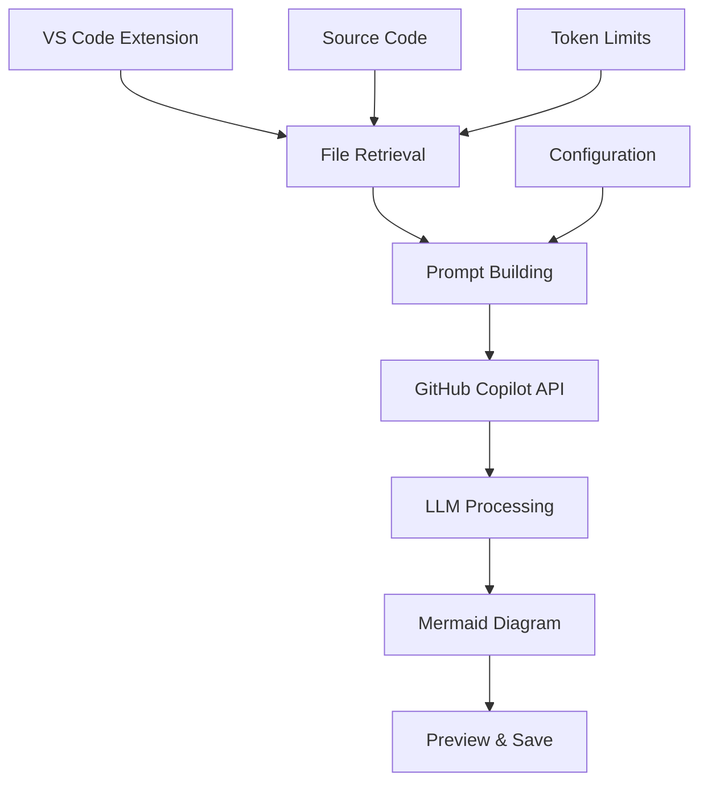
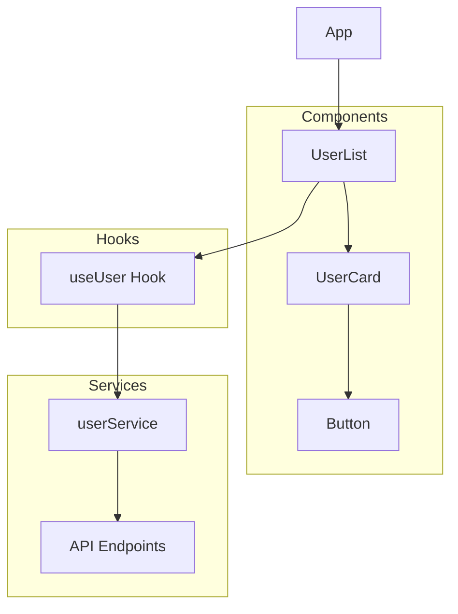
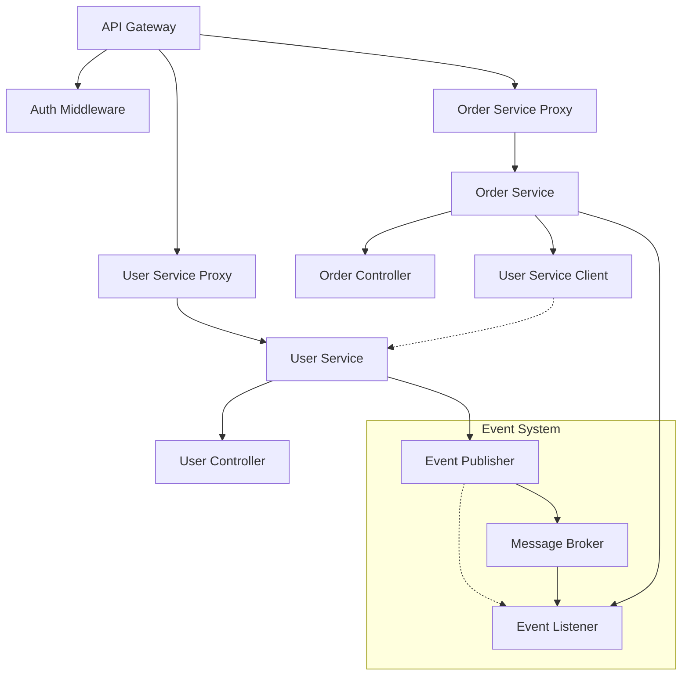

⏱️ **예상 읽기 시간**: 18분

## 서론

복잡한 코드베이스를 이해하고 문서화하는 것은 모든 개발자가 직면하는 중요한 과제입니다. 특히 새로운 프로젝트에 참여하거나, 레거시 코드를 분석하거나, AI가 생성한 코드를 검토할 때 전체적인 아키텍처를 파악하는 것은 매우 어려운 일입니다.

[Swark](https://github.com/swark-io/swark)는 이러한 문제를 혁신적으로 해결하는 VS Code 확장입니다. 934개의 GitHub 스타를 받으며 검증된 이 도구는 대화형 언어 모델(LLM)을 활용해 코드에서 자동으로 아키텍처 다이어그램을 생성합니다.

본 튜토리얼에서는 Swark의 설치부터 고급 활용법까지 실습과 함께 완전히 마스터하는 방법을 알아보겠습니다.

## Swark란?

### 핵심 특징

**🆓 완전 무료 & 오픈소스**
- GitHub Copilot 무료 계층 활용
- AGPL-3.0 라이센스로 완전 오픈소스
- 추가 API 키나 인증 불필요

**🌍 범용 언어 지원**
- 모든 프로그래밍 언어와 프레임워크 지원
- LLM 기반으로 결정론적 파싱 한계 극복
- 새로운 언어에 대한 점진적 지원 불필요

**🔒 프라이버시 우선**
- 소스코드는 GitHub Copilot에만 공유
- 외부 API나 서비스에 데이터 전송 없음
- 완전한 개인정보 보호

**🧜‍♀️ Mermaid.js 기반**
- 업계 표준 다이어그램-as-코드 프레임워크
- 편집 가능하고 버전 관리 친화적
- 다양한 다이어그램 유형 지원

### 주요 사용 사례

| 사용 사례 | 설명 | 활용 시나리오 |
|---------|------|-------------|
| **🔎 새 코드베이스 학습** | 익숙하지 않은 저장소의 고수준 구조 파악 | 온보딩, 새 프로젝트 참여 |
| **🤖 AI 생성 코드 검토** | AI가 생성한 코드의 구조와 품질 검증 | AI 도구 결과물 검증 |
| **📕 문서화 개선** | 최신 아키텍처 다이어그램으로 문서 업데이트 | 기술 문서 작성 |
| **🕰️ 레거시 코드 이해** | 오래된 코드베이스의 구조 시각화 | 유지보수, 리팩토링 |
| **🧩 설계 결함 발견** | 의존성 그래프에서 불필요한 결합 식별 | 코드 품질 개선 |
| **✅ 테스트 커버리지 분석** | 테스트 파일 포함으로 커버리지 현황 파악 | 테스트 전략 수립 |

### 기술 아키텍처



## 시스템 요구사항

### 필수 요구사항

**소프트웨어:**
- Visual Studio Code (최신 버전 권장)
- GitHub Copilot 확장 (무료 계층 사용 가능)

**계정:**
- GitHub 계정 (Copilot 활성화용)

### 선택사항

**추가 확장:**
- Markdown Preview Mermaid Support (다이어그램 미리보기용)

## 설치 및 설정 가이드

### 1. GitHub Copilot 설정

#### GitHub Copilot 설치

```bash
# VS Code에서 확장 설치
# 1. VS Code 실행
# 2. 확장 마켓플레이스 (Ctrl+Shift+X)
# 3. "GitHub Copilot" 검색 및 설치
```

#### GitHub 계정 연동

1. **VS Code에서 GitHub 로그인**
   - `Ctrl+Shift+P` (또는 `Cmd+Shift+P`)
   - "GitHub Copilot: Sign In" 검색 실행
   - 브라우저에서 GitHub 인증 완료

2. **Copilot 활성화 확인**
   ```bash
   # VS Code 하단 상태바에서 Copilot 아이콘 확인
   # "GitHub Copilot: Enabled" 표시 확인
   ```

### 2. Swark 확장 설치

#### VS Code 마켓플레이스에서 설치

```bash
# 방법 1: VS Code 내에서 설치
# 1. 확장 마켓플레이스 열기 (Ctrl+Shift+X)
# 2. "Swark" 검색
# 3. "Install" 클릭

# 방법 2: 명령줄에서 설치
code --install-extension swark.swark
```

#### 설치 확인

```bash
# VS Code에서 설치 확인
# 1. Ctrl+Shift+P로 명령 팔레트 열기
# 2. "Swark: Create Architecture Diagram" 검색
# 3. 명령어가 나타나면 설치 성공
```

### 3. 선택적 확장 설치

#### Mermaid 미리보기 지원

```bash
# Markdown Preview Mermaid Support 설치
code --install-extension bierner.markdown-mermaid

# 또는 VS Code 마켓플레이스에서 검색:
# "Markdown Preview Mermaid Support"
```

### 4. 설정 검증

#### 테스트 프로젝트 생성

```bash
# 테스트 디렉토리 생성
mkdir swark-test-project
cd swark-test-project

# VS Code로 프로젝트 열기
code .
```

#### 샘플 코드 생성

```javascript
// app.js
const express = require('express');
const { UserService } = require('./services/userService');
const { DatabaseConnection } = require('./database/connection');

class App {
    constructor() {
        this.app = express();
        this.userService = new UserService();
        this.database = new DatabaseConnection();
        this.setupRoutes();
    }

    setupRoutes() {
        this.app.get('/users', (req, res) => {
            const users = this.userService.getAllUsers();
            res.json(users);
        });

        this.app.post('/users', (req, res) => {
            const user = this.userService.createUser(req.body);
            res.json(user);
        });
    }

    start() {
        this.database.connect();
        this.app.listen(3000, () => {
            console.log('Server running on port 3000');
        });
    }
}

module.exports = App;
```

```javascript
// services/userService.js
const { UserModel } = require('../models/userModel');

class UserService {
    constructor() {
        this.userModel = new UserModel();
    }

    getAllUsers() {
        return this.userModel.findAll();
    }

    createUser(userData) {
        return this.userModel.create(userData);
    }

    updateUser(id, userData) {
        return this.userModel.update(id, userData);
    }

    deleteUser(id) {
        return this.userModel.delete(id);
    }
}

module.exports = { UserService };
```

```javascript
// models/userModel.js
const { DatabaseConnection } = require('../database/connection');

class UserModel {
    constructor() {
        this.db = new DatabaseConnection();
    }

    findAll() {
        return this.db.query('SELECT * FROM users');
    }

    create(userData) {
        return this.db.query('INSERT INTO users SET ?', userData);
    }

    update(id, userData) {
        return this.db.query('UPDATE users SET ? WHERE id = ?', [userData, id]);
    }

    delete(id) {
        return this.db.query('DELETE FROM users WHERE id = ?', id);
    }
}

module.exports = { UserModel };
```

```javascript
// database/connection.js
class DatabaseConnection {
    constructor() {
        this.isConnected = false;
    }

    connect() {
        // 데이터베이스 연결 로직
        this.isConnected = true;
        console.log('Database connected');
    }

    query(sql, params = []) {
        if (!this.isConnected) {
            throw new Error('Database not connected');
        }
        // 쿼리 실행 로직
        console.log('Executing query:', sql);
        return { success: true, data: [] };
    }

    disconnect() {
        this.isConnected = false;
        console.log('Database disconnected');
    }
}

module.exports = { DatabaseConnection };
```

## 기본 사용법

### 첫 번째 아키텍처 다이어그램 생성

#### 1. Swark 실행

```bash
# 방법 1: 단축키 사용
# macOS: Cmd+Shift+R
# Windows/Linux: Ctrl+Shift+R

# 방법 2: 명령 팔레트 사용
# 1. Ctrl+Shift+P (또는 Cmd+Shift+P)
# 2. "Swark: Create Architecture Diagram" 입력 및 실행
```

#### 2. 폴더 선택

1. **루트 폴더 선택**: 전체 프로젝트 구조 분석
2. **특정 모듈 선택**: 특정 기능이나 서비스 집중 분석
3. **서비스 폴더 선택**: 마이크로서비스 아키텍처 분석

#### 3. 결과 확인

```bash
# 생성된 파일 구조
swark-test-project/
├── swark-output/
│   ├── 2025-08-11__14-30-15__diagram.md
│   └── 2025-08-11__14-30-15__log.md
├── app.js
├── services/
├── models/
└── database/
```

#### 4. 다이어그램 미리보기

```markdown
<!-- 생성된 다이어그램 예시 -->
# Architecture Diagram

```mermaid
graph TD
    A[App] --> B[UserService]
    A --> C[DatabaseConnection]
    B --> D[UserModel]
    D --> C
    
    A --> E[Express Routes]
    E --> F[GET /users]
    E --> G[POST /users]
    
    F --> B
    G --> B
```
```

### Swark 출력 파일 이해

#### 다이어그램 파일 구조

```markdown
<!-- 2025-08-11__14-30-15__diagram.md -->
# Architecture Diagram - Generated by Swark

## Overview
This diagram represents the architecture of the analyzed codebase.

## Mermaid Diagram

```mermaid
graph TD
    App[App Class] --> UserService[User Service]
    App --> DatabaseConnection[Database Connection]
    UserService --> UserModel[User Model]
    UserModel --> DatabaseConnection
    
    subgraph "API Routes"
        GetUsers[GET /users]
        PostUsers[POST /users]
    end
    
    App --> GetUsers
    App --> PostUsers
    GetUsers --> UserService
    PostUsers --> UserService
```

## Components Description

- **App**: Main application class handling Express.js setup
- **UserService**: Business logic layer for user operations
- **UserModel**: Data access layer for user entities
- **DatabaseConnection**: Database abstraction layer
```

#### 로그 파일 분석

```markdown
<!-- 2025-08-11__14-30-15__log.md -->
# Swark Execution Log

## Configuration
- Max Files: 50
- File Extensions: [".js", ".ts", ".py", ".java", ".go"]
- Exclude Patterns: ["**/.*", "**/node_modules/**"]
- Language Model: gpt-4

## Files Processed
1. app.js (157 tokens)
2. services/userService.js (98 tokens)
3. models/userModel.js (112 tokens)
4. database/connection.js (89 tokens)

## Total
- Files: 4
- Total Tokens: 456
- Processing Time: 3.2 seconds

## Generated Diagram
- Type: Component Diagram
- Nodes: 8
- Edges: 7
- Complexity: Medium
```

## 고급 설정 및 커스터마이징

### VS Code 설정 커스터마이징

#### settings.json 설정

```json
{
    "swark.maxFiles": 100,
    "swark.fileExtensions": [
        ".js", ".ts", ".jsx", ".tsx",
        ".py", ".java", ".go", ".rs",
        ".cpp", ".c", ".h", ".php"
    ],
    "swark.excludePatterns": [
        "**/.*",
        "**/node_modules/**",
        "**/dist/**",
        "**/build/**",
        "**/.next/**",
        "**/coverage/**",
        "**/*.test.js",
        "**/*.spec.js"
    ],
    "swark.languageModel": "gpt-4",
    "swark.fixMermaidCycles": true
}
```

#### 프로젝트별 설정

```json
// .vscode/settings.json
{
    "swark.maxFiles": 30,
    "swark.fileExtensions": [".js", ".jsx", ".ts", ".tsx"],
    "swark.excludePatterns": [
        "**/.*",
        "**/node_modules/**",
        "**/src/components/ui/**",
        "**/src/utils/helpers/**"
    ]
}
```

### 언어별 최적화 설정

#### JavaScript/TypeScript 프로젝트

```json
{
    "swark.fileExtensions": [".js", ".jsx", ".ts", ".tsx", ".mjs"],
    "swark.excludePatterns": [
        "**/node_modules/**",
        "**/dist/**", 
        "**/build/**",
        "**/.next/**",
        "**/coverage/**",
        "**/*.test.{js,ts,jsx,tsx}",
        "**/*.spec.{js,ts,jsx,tsx}",
        "**/stories/**",
        "**/*.stories.{js,ts,jsx,tsx}"
    ]
}
```

#### Python 프로젝트

```json
{
    "swark.fileExtensions": [".py", ".pyx"],
    "swark.excludePatterns": [
        "**/.*",
        "**/__pycache__/**",
        "**/venv/**",
        "**/env/**",
        "**/dist/**",
        "**/build/**",
        "**/*.pyc",
        "**/test_*.py",
        "**/*_test.py"
    ]
}
```

#### Java 프로젝트

```json
{
    "swark.fileExtensions": [".java", ".kt", ".scala"],
    "swark.excludePatterns": [
        "**/.*",
        "**/target/**",
        "**/build/**",
        "**/bin/**",
        "**/*.class",
        "**/src/test/**",
        "**/src/androidTest/**"
    ]
}
```

## 실제 활용 시나리오

### 시나리오 1: React 애플리케이션 아키텍처 분석

#### 프로젝트 구조

```bash
# React 프로젝트 생성
npx create-react-app swark-react-demo
cd swark-react-demo

# 추가 구조 생성
mkdir -p src/components/common
mkdir -p src/components/user
mkdir -p src/services
mkdir -p src/store
mkdir -p src/hooks
```

#### 컴포넌트 생성

```jsx
// src/components/user/UserList.jsx
import React, { useEffect } from 'react';
import { useUser } from '../../hooks/useUser';
import { UserCard } from './UserCard';

export const UserList = () => {
    const { users, loading, fetchUsers } = useUser();

    useEffect(() => {
        fetchUsers();
    }, []);

    if (loading) return <div>Loading...</div>;

    return (
        <div className="user-list">
            {users.map(user => (
                <UserCard key={user.id} user={user} />
            ))}
        </div>
    );
};
```

```jsx
// src/components/user/UserCard.jsx
import React from 'react';
import { Button } from '../common/Button';

export const UserCard = ({ user }) => {
    const handleEdit = () => {
        console.log('Edit user:', user.id);
    };

    return (
        <div className="user-card">
            <h3>{user.name}</h3>
            <p>{user.email}</p>
            <Button onClick={handleEdit}>Edit</Button>
        </div>
    );
};
```

```jsx
// src/hooks/useUser.js
import { useState, useCallback } from 'react';
import { userService } from '../services/userService';

export const useUser = () => {
    const [users, setUsers] = useState([]);
    const [loading, setLoading] = useState(false);

    const fetchUsers = useCallback(async () => {
        setLoading(true);
        try {
            const userData = await userService.getUsers();
            setUsers(userData);
        } catch (error) {
            console.error('Failed to fetch users:', error);
        } finally {
            setLoading(false);
        }
    }, []);

    return { users, loading, fetchUsers };
};
```

```javascript
// src/services/userService.js
class UserService {
    constructor() {
        this.baseURL = 'https://api.example.com';
    }

    async getUsers() {
        const response = await fetch(`${this.baseURL}/users`);
        return response.json();
    }

    async createUser(userData) {
        const response = await fetch(`${this.baseURL}/users`, {
            method: 'POST',
            headers: { 'Content-Type': 'application/json' },
            body: JSON.stringify(userData)
        });
        return response.json();
    }
}

export const userService = new UserService();
```

#### Swark 실행 및 결과

```bash
# VS Code에서 src 폴더 선택하여 Swark 실행
# Cmd+Shift+R (또는 Ctrl+Shift+R)
```

**생성된 다이어그램:**



### 시나리오 2: 마이크로서비스 아키텍처 분석

#### 프로젝트 구조 생성

```bash
mkdir microservices-demo
cd microservices-demo

# 각 서비스 디렉토리 생성
mkdir -p user-service/src
mkdir -p order-service/src
mkdir -p notification-service/src
mkdir -p api-gateway/src
```

#### 서비스별 코드 작성

```javascript
// user-service/src/userController.js
const { UserService } = require('./userService');
const { EventPublisher } = require('./eventPublisher');

class UserController {
    constructor() {
        this.userService = new UserService();
        this.eventPublisher = new EventPublisher();
    }

    async createUser(req, res) {
        try {
            const user = await this.userService.createUser(req.body);
            await this.eventPublisher.publish('user.created', user);
            res.json(user);
        } catch (error) {
            res.status(500).json({ error: error.message });
        }
    }

    async getUser(req, res) {
        const user = await this.userService.getUser(req.params.id);
        res.json(user);
    }
}

module.exports = { UserController };
```

```javascript
// order-service/src/orderController.js
const { OrderService } = require('./orderService');
const { UserServiceClient } = require('./userServiceClient');
const { EventListener } = require('./eventListener');

class OrderController {
    constructor() {
        this.orderService = new OrderService();
        this.userClient = new UserServiceClient();
        this.setupEventListeners();
    }

    setupEventListeners() {
        const eventListener = new EventListener();
        eventListener.on('user.created', this.handleUserCreated.bind(this));
    }

    async createOrder(req, res) {
        const user = await this.userClient.getUser(req.body.userId);
        const order = await this.orderService.createOrder(req.body, user);
        res.json(order);
    }

    handleUserCreated(userEvent) {
        console.log('User created event received:', userEvent);
    }
}

module.exports = { OrderController };
```

#### API Gateway 설정

```javascript
// api-gateway/src/gateway.js
const { UserServiceProxy } = require('./proxies/userServiceProxy');
const { OrderServiceProxy } = require('./proxies/orderServiceProxy');
const { AuthMiddleware } = require('./middleware/authMiddleware');

class APIGateway {
    constructor() {
        this.userProxy = new UserServiceProxy();
        this.orderProxy = new OrderServiceProxy();
        this.auth = new AuthMiddleware();
        this.setupRoutes();
    }

    setupRoutes() {
        // User routes
        this.app.use('/api/users', this.auth.authenticate, this.userProxy.router);
        
        // Order routes  
        this.app.use('/api/orders', this.auth.authenticate, this.orderProxy.router);
    }
}

module.exports = { APIGateway };
```

#### 전체 시스템 다이어그램 생성

```bash
# 루트 디렉토리에서 Swark 실행
# 전체 마이크로서비스 아키텍처 시각화
```

**예상 다이어그램:**



### 시나리오 3: 레거시 코드베이스 분석

#### 자동화 스크립트 생성

```bash
#!/bin/bash
# analyze-legacy.sh

# 레거시 프로젝트 클론
git clone https://github.com/example/legacy-project.git
cd legacy-project

# VS Code로 프로젝트 열기
code .

# Swark 설정 파일 생성
cat > .vscode/settings.json << 'EOF'
{
    "swark.maxFiles": 200,
    "swark.fileExtensions": [
        ".js", ".php", ".java", ".py",
        ".rb", ".go", ".cs", ".cpp"
    ],
    "swark.excludePatterns": [
        "**/vendor/**",
        "**/node_modules/**", 
        "**/target/**",
        "**/bin/**",
        "**/obj/**",
        "**/*.min.js",
        "**/*.bundle.js"
    ],
    "swark.fixMermaidCycles": true
}
EOF

echo "Legacy project ready for Swark analysis"
echo "Run Swark with Ctrl+Shift+R (or Cmd+Shift+R)"
```

#### 단계별 분석 접근법

```bash
# 1단계: 전체 아키텍처 개요
# 루트 디렉토리에서 Swark 실행

# 2단계: 핵심 모듈별 분석  
# /src, /lib, /core 디렉토리 개별 분석

# 3단계: 의존성 관계 파악
# 각 서비스나 컴포넌트 디렉토리별 분석

# 4단계: 데이터 플로우 분석
# 모델, 컨트롤러, 뷰 디렉토리 개별 분석
```

## 문제 해결 및 최적화

### 일반적인 문제 해결

#### 1. 토큰 제한 초과 문제

```json
// 파일 수 제한 조정
{
    "swark.maxFiles": 30,  // 기본값 50에서 감소
    "swark.excludePatterns": [
        "**/.*",
        "**/node_modules/**",
        "**/test/**",        // 테스트 파일 제외
        "**/tests/**",
        "**/*.test.*",
        "**/*.spec.*",
        "**/docs/**",        // 문서 파일 제외
        "**/examples/**"     // 예제 파일 제외
    ]
}
```

#### 2. 다이어그램 렌더링 실패

```json
// Mermaid 사이클 자동 수정 활성화
{
    "swark.fixMermaidCycles": true
}
```

#### 3. GitHub Copilot 연결 문제

```bash
# VS Code에서 재인증
# 1. Ctrl+Shift+P
# 2. "GitHub Copilot: Sign Out" 실행
# 3. "GitHub Copilot: Sign In" 실행
# 4. 브라우저에서 재인증
```

#### 4. 특정 언어 지원 문제

```json
// 파일 확장자 명시적 추가
{
    "swark.fileExtensions": [
        ".js", ".jsx", ".ts", ".tsx",
        ".vue", ".svelte",           // 프론트엔드 프레임워크
        ".py", ".pyi",               // Python
        ".java", ".kt", ".scala",    // JVM 언어
        ".go", ".rs",                // 시스템 언어
        ".php", ".rb",               // 스크립트 언어
        ".cs", ".fs", ".vb",         // .NET 언어
        ".swift", ".m", ".mm"        // 모바일 언어
    ]
}
```

### 성능 최적화

#### 1. 큰 프로젝트 처리 전략

```bash
#!/bin/bash
# large-project-analysis.sh

# 핵심 모듈만 선별적 분석
echo "Analyzing core modules..."

# 1. 비즈니스 로직 분석
mkdir temp-analysis
cp -r src/core temp-analysis/
cp -r src/services temp-analysis/
# Swark로 temp-analysis 분석

# 2. API 계층 분석  
rm -rf temp-analysis/*
cp -r src/controllers temp-analysis/
cp -r src/routes temp-analysis/
# Swark로 temp-analysis 분석

# 3. 데이터 계층 분석
rm -rf temp-analysis/*
cp -r src/models temp-analysis/
cp -r src/repositories temp-analysis/
# Swark로 temp-analysis 분석

echo "Multi-layered analysis complete"
```

#### 2. 점진적 분석 스크립트

```python
#!/usr/bin/env python3
# progressive-analysis.py

import os
import subprocess
import json
from pathlib import Path

def analyze_directory(dir_path, max_files=20):
    """디렉토리별 점진적 분석"""
    
    # Swark 설정 생성
    config = {
        "swark.maxFiles": max_files,
        "swark.excludePatterns": [
            "**/.*", "**/node_modules/**", 
            "**/test/**", "**/*.test.*"
        ]
    }
    
    # .vscode/settings.json 생성
    vscode_dir = Path(dir_path) / ".vscode"
    vscode_dir.mkdir(exist_ok=True)
    
    with open(vscode_dir / "settings.json", "w") as f:
        json.dump(config, f, indent=2)
    
    print(f"Analyzing: {dir_path}")
    # VS Code 실행 (수동으로 Swark 실행 필요)
    subprocess.run(["code", str(dir_path)])

def main():
    # 분석할 디렉토리 목록
    directories = [
        "src/components",
        "src/services", 
        "src/models",
        "src/utils",
        "src/config"
    ]
    
    for directory in directories:
        if os.path.exists(directory):
            analyze_directory(directory)
            input(f"Press Enter after analyzing {directory}...")

if __name__ == "__main__":
    main()
```

## 고급 활용 기법

### 1. 커스텀 다이어그램 유형 생성

#### 데이터 플로우 다이어그램 생성

```javascript
// data-flow-analysis.js
// Swark 입력용 메타데이터 주석 추가

/**
 * @swark-diagram-type: data-flow
 * @swark-focus: data transformation pipeline
 */

class DataProcessor {
    constructor() {
        this.inputValidator = new InputValidator();
        this.transformer = new DataTransformer();
        this.outputFormatter = new OutputFormatter();
    }

    /**
     * @swark-flow: input -> validation -> transformation -> formatting -> output
     */
    process(rawData) {
        const validatedData = this.inputValidator.validate(rawData);
        const transformedData = this.transformer.transform(validatedData);
        return this.outputFormatter.format(transformedData);
    }
}
```

#### 시퀀스 다이어그램 생성

```javascript
/**
 * @swark-diagram-type: sequence
 * @swark-participants: Client, APIGateway, UserService, Database
 */

class UserAPI {
    async authenticateUser(credentials) {
        // Client -> APIGateway: authenticate request
        const authResult = await this.gateway.authenticate(credentials);
        
        if (authResult.success) {
            // APIGateway -> UserService: get user profile
            const user = await this.userService.getProfile(authResult.userId);
            
            // UserService -> Database: query user data
            const userData = await this.database.findUser(authResult.userId);
            
            return userData;
        }
        
        throw new Error('Authentication failed');
    }
}
```

### 2. 다중 프로젝트 분석 자동화

```bash
#!/bin/bash
# multi-project-analysis.sh

# 여러 프로젝트를 순차적으로 분석
PROJECTS=(
    "frontend-app"
    "backend-api" 
    "mobile-app"
    "shared-libs"
)

OUTPUT_DIR="architecture-analysis"
mkdir -p "$OUTPUT_DIR"

for project in "${PROJECTS[@]}"; do
    echo "Analyzing project: $project"
    
    # 프로젝트 디렉토리로 이동
    cd "$project"
    
    # Swark 실행 (VS Code 명령줄 확장 필요)
    # 또는 수동으로 실행 후 결과 복사
    
    # 결과 파일 복사
    if [ -d "swark-output" ]; then
        cp swark-output/* "../$OUTPUT_DIR/$project-"
    fi
    
    cd ..
done

echo "Multi-project analysis complete. Results in: $OUTPUT_DIR"
```

### 3. CI/CD 통합

#### GitHub Actions 워크플로우

```yaml
# .github/workflows/architecture-docs.yml
name: Generate Architecture Documentation

on:
  push:
    branches: [ main, develop ]
    paths: 
      - 'src/**'
      - 'lib/**'

jobs:
  generate-docs:
    runs-on: ubuntu-latest
    
    steps:
    - uses: actions/checkout@v3
    
    - name: Setup Node.js
      uses: actions/setup-node@v3
      with:
        node-version: '18'
    
    - name: Install VS Code CLI
      run: |
        wget -qO- https://packages.microsoft.com/keys/microsoft.asc | gpg --dearmor > packages.microsoft.gpg
        sudo install -o root -g root -m 644 packages.microsoft.gpg /etc/apt/trusted.gpg.d/
        sudo sh -c 'echo "deb [arch=amd64,arm64,armhf signed-by=/etc/apt/trusted.gpg.d/packages.microsoft.gpg] https://packages.microsoft.com/repos/code stable main" > /etc/apt/sources.list.d/vscode.list'
        sudo apt update
        sudo apt install code
    
    - name: Install Swark Extension
      run: code --install-extension swark.swark
    
    - name: Generate Architecture Diagrams
      run: |
        # 자동화된 다이어그램 생성 스크립트 실행
        ./scripts/generate-architecture-docs.sh
    
    - name: Commit Documentation
      run: |
        git config --local user.email "action@github.com"
        git config --local user.name "GitHub Action"
        git add docs/architecture/
        git commit -m "Update architecture documentation" || exit 0
        git push
```

#### 자동화 스크립트

```bash
#!/bin/bash
# scripts/generate-architecture-docs.sh

# 문서 디렉토리 준비
mkdir -p docs/architecture

# 각 주요 모듈별 다이어그램 생성
MODULES=("src/frontend" "src/backend" "src/shared")

for module in "${MODULES[@]}"; do
    echo "Generating diagram for: $module"
    
    # 모듈별 설정 파일 생성
    cat > .vscode/settings.json << EOF
{
    "swark.maxFiles": 50,
    "swark.fileExtensions": [".js", ".ts", ".jsx", ".tsx"],
    "swark.excludePatterns": [
        "**/node_modules/**",
        "**/test/**",
        "**/*.test.*"
    ]
}
EOF
    
    # VS Code 헤드리스 모드로 Swark 실행 (가상 환경)
    # 실제로는 수동 실행 후 결과 복사가 필요
    
    # 생성된 다이어그램을 문서 디렉토리로 복사
    if [ -d "swark-output" ]; then
        module_name=$(basename "$module")
        cp swark-output/*diagram.md "docs/architecture/${module_name}-architecture.md"
    fi
done

echo "Architecture documentation generated successfully"
```

## 팀 워크플로우 통합

### 1. 코드 리뷰 프로세스 개선

#### Pull Request 템플릿

```markdown
<!-- .github/pull_request_template.md -->
## Architecture Impact

### Changes Made
- [ ] New components added
- [ ] Service dependencies modified  
- [ ] API contracts changed
- [ ] Database schema updated

### Architecture Diagram
Please run Swark on the affected modules and attach the generated diagram:

1. Select the modified directory in VS Code
2. Run Swark (Ctrl+Shift+R or Cmd+Shift+R)
3. Attach the generated `.md` file from `swark-output/`

### Architectural Review Checklist
- [ ] No circular dependencies introduced
- [ ] Appropriate separation of concerns maintained
- [ ] Service boundaries respected
- [ ] Performance implications considered
```

#### 리뷰 가이드라인

```markdown
# Architecture Review Guidelines

## Before Reviewing Code

1. **Generate Current State Diagram**
   ```bash
   # Checkout main branch
   git checkout main
   
   # Generate baseline diagram
   # Run Swark on affected modules
   ```

2. **Generate Proposed State Diagram**  
   ```bash
   # Checkout PR branch
   git checkout feature/new-feature
   
   # Generate updated diagram
   # Run Swark on same modules
   ```

3. **Compare Diagrams**
   - Identify new dependencies
   - Check for architectural violations
   - Assess complexity changes

## Review Criteria

### ✅ Good Architecture Changes
- Clear separation of concerns
- Reduced coupling
- Improved cohesion
- Well-defined interfaces

### ❌ Architecture Red Flags
- Circular dependencies
- God objects/services
- Tight coupling between layers
- Violation of established patterns
```

### 2. 온보딩 프로세스 개선

#### 신규 개발자 가이드

```markdown
# Developer Onboarding with Swark

## Day 1: Architecture Overview

### Step 1: Install Development Tools
```bash
# Install VS Code extensions
code --install-extension ms-vscode.vscode-github-copilot
code --install-extension swark.swark
code --install-extension bierner.markdown-mermaid
```

### Step 2: Generate System Overview
```bash
# Clone repository
git clone https://github.com/company/main-product.git
cd main-product

# Open in VS Code
code .

# Generate overall architecture (Ctrl+Shift+R)
# Select root directory
```

### Step 3: Module-by-Module Exploration
```bash
# Generate diagrams for each major module:
# 1. src/frontend → Frontend Architecture
# 2. src/backend → Backend Architecture  
# 3. src/shared → Shared Components
# 4. src/database → Data Layer
```

### Step 4: Create Learning Notes
```markdown
<!-- learning-notes.md -->
# Architecture Learning Notes

## System Overview
[Attach overall architecture diagram]

## Frontend Architecture
[Attach frontend diagram]
Key components I need to understand:
- [ ] Component A: Purpose and responsibilities
- [ ] Service B: API interactions
- [ ] Module C: Business logic

## Backend Architecture  
[Attach backend diagram]
Key services to study:
- [ ] Service X: Core business logic
- [ ] Service Y: Data processing
- [ ] Service Z: External integrations

## Questions for Team
1. Why is Component A connected to Service X?
2. What's the purpose of the connection between...?
3. Are there any planned architecture changes?
```
```

### 3. 아키텍처 문서화 자동화

#### 문서 생성 스크립트

```python
#!/usr/bin/env python3
# generate-arch-docs.py

import os
import shutil
import datetime
from pathlib import Path

class ArchitectureDocGenerator:
    def __init__(self, project_root):
        self.project_root = Path(project_root)
        self.docs_dir = self.project_root / "docs" / "architecture"
        self.docs_dir.mkdir(parents=True, exist_ok=True)
        
    def generate_module_docs(self):
        """각 모듈별 아키텍처 문서 생성"""
        
        modules = [
            "src/frontend",
            "src/backend", 
            "src/shared",
            "src/mobile"
        ]
        
        for module in modules:
            if (self.project_root / module).exists():
                self.generate_single_module_doc(module)
    
    def generate_single_module_doc(self, module_path):
        """단일 모듈 문서 생성"""
        
        module_name = Path(module_path).name
        timestamp = datetime.datetime.now().strftime("%Y-%m-%d")
        
        # Swark 출력 파일 찾기
        swark_output = self.project_root / "swark-output"
        if swark_output.exists():
            # 가장 최근 다이어그램 파일 찾기
            diagram_files = list(swark_output.glob("*diagram.md"))
            if diagram_files:
                latest_diagram = max(diagram_files, key=os.path.getctime)
                
                # 모듈별 문서 디렉토리 생성
                module_doc_dir = self.docs_dir / module_name
                module_doc_dir.mkdir(exist_ok=True)
                
                # 다이어그램 복사
                shutil.copy2(latest_diagram, 
                           module_doc_dir / f"{timestamp}-architecture.md")
                
                # README 생성
                self.create_module_readme(module_doc_dir, module_name)
    
    def create_module_readme(self, module_dir, module_name):
        """모듈 README 생성"""
        
        readme_content = f"""# {module_name.title()} Architecture

## Overview
This directory contains architecture documentation for the {module_name} module.

## Files
- `*-architecture.md`: Auto-generated Swark diagrams
- `manual-notes.md`: Manual architecture notes
- `decisions.md`: Architecture decision records

## How to Update
1. Make code changes in `src/{module_name}/`
2. Run Swark on the module directory
3. Copy generated diagram to this directory
4. Update manual notes if needed

## Architecture Principles
- Single Responsibility Principle
- Dependency Inversion
- Separation of Concerns
- Domain-Driven Design

## Key Components
[To be documented based on generated diagrams]

## Dependencies
[To be documented based on generated diagrams]

## Future Improvements
- [ ] Reduce coupling between components
- [ ] Implement missing abstractions
- [ ] Add integration tests
"""
        
        readme_path = module_dir / "README.md"
        with open(readme_path, "w") as f:
            f.write(readme_content)

if __name__ == "__main__":
    generator = ArchitectureDocGenerator(".")
    generator.generate_module_docs()
    print("Architecture documentation generated successfully!")
```

## 결론

Swark는 현대 개발팀이 직면하는 아키텍처 이해와 문서화 문제를 혁신적으로 해결하는 도구입니다. 이 튜토리얼을 통해 다음과 같은 내용을 학습했습니다:

### 주요 성과

**🎯 핵심 기능 마스터**
- GitHub Copilot과 LLM을 활용한 자동 아키텍처 다이어그램 생성
- 모든 프로그래밍 언어 지원으로 범용적 활용 가능
- Mermaid.js 기반 편집 가능한 다이어그램 출력

**⚙️ 고급 활용법 습득**
- 프로젝트별 커스터마이징을 통한 최적화
- 대규모 코드베이스 분석을 위한 전략적 접근
- CI/CD 파이프라인 통합으로 자동화된 문서화

**🔧 팀 워크플로우 개선**
- 코드 리뷰 프로세스에서의 아키텍처 영향 분석
- 신규 개발자 온보딩 가속화
- 지속적인 아키텍처 문서 업데이트 자동화

### 다음 단계

Swark를 더욱 효과적으로 활용하기 위한 추천 사항:

1. **팀 표준화**: 팀 내 Swark 사용 가이드라인 수립 및 설정 표준화
2. **문서화 문화**: 코드 변경 시 아키텍처 다이어그램 업데이트를 필수 프로세스로 도입
3. **아키텍처 리뷰**: 정기적인 아키텍처 리뷰 미팅에서 Swark 다이어그램 활용
4. **교육 자료**: 새로운 팀원을 위한 시스템 이해 교육 자료로 활용

### 미래 전망

Swark의 LLM 기반 접근 방식은 다음과 같은 가능성을 제시합니다:

- **지능형 분석**: 단순한 구조 시각화를 넘어 아키텍처 패턴 인식 및 개선 제안
- **다양한 관점**: 비즈니스 도메인, 기술 스택, 성능 등 다각적 아키텍처 분석
- **실시간 업데이트**: 코드 변경에 따른 실시간 아키텍처 다이어그램 업데이트

Swark의 강력함과 GitHub Copilot의 접근성을 바탕으로, 여러분의 개발 팀에서도 아키텍처 이해와 문서화의 새로운 표준을 만들어보시길 바랍니다. 코드에서 자동으로 생성되는 아키텍처 다이어그램이 단순한 시각화 도구를 넘어 팀의 소통과 이해를 높이는 핵심 자산이 될 것입니다.
