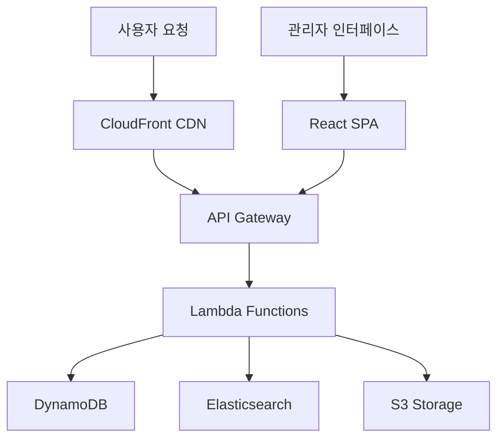

⏱️ **예상 읽기 시간**: 15분

## 서론

현대의 웹 개발 환경에서 서버리스 아키텍처와 헤드리스 CMS의 조합은 더 이상 선택이 아닌 필수가 되었습니다. 특히 엔터프라이즈 환경에서는 확장성, 보안성, 비용 효율성을 모두 만족하는 솔루션이 필요합니다.

[Webiny](https://github.com/webiny/webiny-js)는 이러한 요구사항을 완벽하게 충족하는 오픈소스 서버리스 엔터프라이즈 CMS입니다. AWS 람다, DynamoDB, CloudFront를 기반으로 구축되어 높은 확장성과 내결함성을 제공하며, MIT 라이선스로 완전한 커스터마이징이 가능합니다.

이 튜토리얼에서는 Webiny를 처음부터 설치하고 구성하여, 실제 운영 환경에서 사용할 수 있는 완전한 CMS 시스템을 구축하는 과정을 다룹니다.

## Webiny 핵심 특징 및 아키텍처

### 🎯 주요 구성 요소

Webiny는 4가지 핵심 모듈로 구성되어 있습니다:

**1️⃣ Page Builder (페이지 빌더)**
- 드래그 앤 드롭 방식의 시각적 페이지 편집기
- 자동 사전 렌더링으로 CloudFront 캐싱 지원
- SEO 최적화된 정적 페이지 생성

**2️⃣ Headless CMS**
- GraphQL API 기반 헤드리스 아키텍처
- 콘텐츠 모델링 및 버전 관리
- 다국어 지원 및 세밀한 권한 제어

**3️⃣ File Manager (파일 관리자)**
- S3 기반 파일 업로드 및 관리
- 내장 이미지 에디터
- 자동 이미지 최적화 및 CDN 배포

**4️⃣ Form Builder (폼 빌더)**
- 드래그 앤 드롭 폼 생성기
- Webhook 지원 및 reCAPTCHA 통합
- 실시간 폼 데이터 처리

### 🏗️ 서버리스 아키텍처 장점



**비용 효율성**
- 사용량 기반 요금제로 60-80% 비용 절감
- 트래픽이 없을 때는 비용 발생하지 않음
- 인프라 관리 비용 제로

**확장성**
- 자동 스케일링으로 무제한 동시 사용자 지원
- 글로벌 CDN으로 전 세계 빠른 응답 속도
- 멀티 테넌시 지원으로 수백 개 사이트 운영 가능

**보안성**
- AWS 기본 보안 기능 활용
- 전송/저장 데이터 암호화
- OKTA, Cognito 등 엔터프라이즈 IdP 통합

## 사전 요구사항 및 환경 설정

### 필수 요구사항

```bash
# 1. Node.js 버전 확인 (v20 이상 필요)
node --version
# v20.11.0 이상

# 2. Yarn 버전 확인 (v1.22.21 이상 필요)
yarn --version
# 1.22.21 이상

# 3. AWS CLI 설치 및 구성 확인
aws --version
aws configure list
```

### AWS 계정 설정

**IAM 사용자 생성 및 권한 설정**

```bash
# AWS CLI 구성 (새 프로파일 생성)
aws configure --profile webiny-demo
# AWS Access Key ID: [YOUR_ACCESS_KEY]
# AWS Secret Access Key: [YOUR_SECRET_KEY]
# Default region name: us-east-1
# Default output format: json

# 프로파일 확인
aws sts get-caller-identity --profile webiny-demo
```

**필요한 IAM 권한:**
- Lambda (생성, 실행, 관리)
- DynamoDB (테이블 생성, 읽기, 쓰기)
- S3 (버킷 생성, 파일 업로드)
- CloudFormation (스택 관리)
- API Gateway (API 생성, 관리)
- CloudFront (배포 생성)

### 개발 환경 준비

```bash
# 작업 디렉토리 생성
mkdir ~/webiny-projects
cd ~/webiny-projects
```

## Webiny 프로젝트 생성 및 구조 분석

### 프로젝트 생성

Webiny는 `create-webiny-project` 명령어를 통해 쉽게 프로젝트를 생성할 수 있습니다:

```bash
# Webiny 프로젝트 생성
npx create-webiny-project my-webiny-cms

# 생성 과정에서 다음 선택사항들이 제시됩니다:
# 1. AWS 리전 선택 (예: us-east-1)
# 2. 데이터베이스 설정 선택
#    - DynamoDB (소중형 프로젝트용, 권장)
#    - DynamoDB + Elasticsearch (대형 프로젝트용)
```

**테스트 환경 설정**

실제 테스트를 위해 데모 프로젝트를 생성했습니다:

```bash
# 테스트 환경 정보
Node.js: v22.17.1
Yarn: 1.22.22
AWS CLI: 2.27.34
Platform: macOS Sequoia 15.0.0 (ARM64)

# 프로젝트 생성 결과
✔ Prepare project folder
✔ Setup Yarn
✔ Install template package
✔ Initialize git
```

### 프로젝트 구조 분석

생성된 Webiny 프로젝트는 다음과 같은 구조를 가집니다:

```
webiny-enterprise-demo/
├── apps/                    # 애플리케이션 모듈들
│   ├── admin/              # 관리자 인터페이스 (React SPA)
│   ├── api/                # GraphQL API 서버
│   ├── core/               # 핵심 공통 모듈
│   └── website/            # 퍼블릭 웹사이트
├── extensions/             # 커스텀 확장 기능
├── scripts/               # 배포 및 관리 스크립트
├── types/                 # TypeScript 타입 정의
├── webiny.project.ts      # 프로젝트 설정 파일
├── package.json           # 의존성 및 스크립트
└── .env                   # 환경 변수
```

**핵심 애플리케이션 모듈:**

1. **admin/** - 관리자 대시보드
   - React 기반 SPA
   - 콘텐츠 관리, 사용자 관리, 설정
   - 드래그 앤 드롭 페이지 빌더

2. **api/** - 서버리스 API
   - GraphQL 엔드포인트
   - Lambda 함수들
   - 비즈니스 로직 처리

3. **website/** - 퍼블릭 사이트
   - 사전 렌더링된 정적 페이지
   - CloudFront CDN 최적화
   - SEO 친화적 구조

## 로컬 개발 환경 설정

### 환경 변수 구성

```bash
# .env 파일 확인 및 수정
cat .env

# 기본 환경 변수들:
WEBINY_PROJECT_NAME=webiny-enterprise-demo
WEBINY_LOGS_FORWARD_URL=
REACT_APP_GRAPHQL_API_URL=
REACT_APP_API_URL=
```

### 의존성 설치 확인

```bash
# 패키지 설치 상태 확인
yarn install

# 프로젝트 정보 확인
yarn webiny info

# 사용 가능한 명령어 확인
yarn webiny --help
```

## AWS 배포 과정 상세 가이드

### 배포 전 준비사항

배포하기 전에 AWS 자격증명이 올바르게 설정되어 있는지 확인해야 합니다:

```bash
# AWS 자격증명 확인
aws sts get-caller-identity

# 결과 예시:
{
    "UserId": "AIDACKCEVSQ6C2EXAMPLE",
    "Account": "123456789012",
    "Arn": "arn:aws:iam::123456789012:user/webiny-user"
}
```

### 초기 배포 실행

**주의: 실제 AWS 리소스가 생성되어 비용이 발생할 수 있습니다.**

```bash
# 첫 번째 배포 (약 15-20분 소요)
yarn webiny deploy

# 배포 단계별 진행 과정:
# 1. Core infrastructure 배포
# 2. API 스택 배포 
# 3. Admin 앱 빌드 및 배포
# 4. Website 앱 빌드 및 배포
# 5. CloudFront 배포 완료
```

### 배포 결과 및 접속 정보

배포가 완료되면 다음과 같은 정보를 받게 됩니다:

```bash
# 배포 완료 후 출력 예시:
🎉 Your project has been deployed successfully!

📋 Here are your application URLs:
   🖥 Admin:   https://d1234567890123.cloudfront.net
   🌍 Website: https://d0987654321098.cloudfront.net
   🚀 GraphQL API: https://api123.execute-api.us-east-1.amazonaws.com/manage/graphql

📌 Admin login credentials:
   Email: admin@webiny.com
   Password: [자동 생성된 임시 패스워드]
```

### 생성되는 AWS 리소스

Webiny 배포 시 다음과 같은 AWS 리소스들이 생성됩니다:

**Lambda 함수들:**
- `webiny-api-graphql` - 메인 GraphQL API
- `webiny-api-file-manager` - 파일 관리
- `webiny-api-page-builder` - 페이지 빌더
- `webiny-api-form-builder` - 폼 빌더

**DynamoDB 테이블들:**
- `WebinyTable` - 메인 데이터 테이블
- `WebinyTable-ES` - Elasticsearch 동기화 (선택사항)

**S3 버킷들:**
- `webiny-files-[unique-id]` - 업로드된 파일들
- `webiny-admin-[unique-id]` - 관리자 앱
- `webiny-website-[unique-id]` - 웹사이트 정적 파일

**CloudFront 배포:**
- 전 세계 CDN 엣지 로케이션
- 자동 HTTPS 인증서
- 압축 및 캐싱 최적화

## 관리자 인터페이스 사용법

### 첫 로그인 및 초기 설정

```bash
# 관리자 URL 접속 후 초기 설정:
# 1. 임시 패스워드로 로그인
# 2. 새 패스워드 설정
# 3. 관리자 프로필 완성
# 4. 기본 설정 구성
```

### 핵심 기능 사용법

**1. 콘텐츠 모델 생성**

```javascript
// GraphQL 스키마 자동 생성 예시
type Product {
  id: ID!
  title: String!
  description: String
  price: Float!
  category: Category
  images: [File!]
  published: Boolean
  createdAt: DateTime!
}
```

**2. 페이지 빌더 사용법**

- 드래그 앤 드롭으로 요소 배치
- 반응형 디자인 자동 적용
- SEO 메타 태그 자동 생성
- 실시간 미리보기

**3. 파일 관리자 활용**

- 이미지 자동 리사이징
- WebP 자동 변환
- CDN 최적화 배포
- 폴더 구조 관리

## 헤드리스 CMS API 활용

### GraphQL API 기본 사용법

```javascript
// 콘텐츠 조회 쿼리
query GetProducts {
  listProducts {
    data {
      id
      title
      price
      category {
        name
      }
      images {
        src
        alt
      }
    }
    meta {
      totalCount
      hasMoreItems
    }
  }
}

// 콘텐츠 생성 뮤테이션
mutation CreateProduct($data: ProductInput!) {
  createProduct(data: $data) {
    id
    title
    price
    published
  }
}
```

### 프론트엔드 통합 예시

**React/Next.js 통합:**

```javascript
// Apollo Client 설정
import { ApolloClient, InMemoryCache, createHttpLink } from '@apollo/client';

const client = new ApolloClient({
  link: createHttpLink({
    uri: 'https://your-api-url/graphql'
  }),
  cache: new InMemoryCache()
});

// React 컴포넌트에서 사용
import { useQuery } from '@apollo/client';
import { GET_PRODUCTS } from '../queries/products';

function ProductList() {
  const { loading, error, data } = useQuery(GET_PRODUCTS);
  
  if (loading) return <div>Loading...</div>;
  if (error) return <div>Error: {error.message}</div>;
  
  return (
    <div>
      {data.listProducts.data.map(product => (
        <div key={product.id}>
          <h3>{product.title}</h3>
          <p>${product.price}</p>
        </div>
      ))}
    </div>
  );
}
```

## 커스터마이징 및 확장

### 커스텀 GraphQL 리졸버 추가

```typescript
// extensions/myExtension/src/graphql/resolvers.ts
export const resolvers = {
  Query: {
    customBusinessLogic: async (parent, args, context) => {
      // 커스텀 비즈니스 로직 구현
      return await processCustomData(args);
    }
  },
  Mutation: {
    customAction: async (parent, args, context) => {
      // 커스텀 액션 구현
      return await executeCustomAction(args);
    }
  }
};
```

### 관리자 인터페이스 플러그인 개발

```typescript
// extensions/myPlugin/src/admin/index.ts
import { AdminAppPlugin } from "@webiny/app-admin";

export default (): AdminAppPlugin => ({
  type: "admin-app-plugin",
  name: "my-custom-plugin",
  render() {
    return (
      <MyCustomComponent />
    );
  }
});
```

## 성능 최적화 및 모니터링

### CloudWatch 메트릭 활용

```bash
# 주요 모니터링 지표:
# - Lambda 함수 실행 시간
# - DynamoDB 읽기/쓰기 용량
# - CloudFront 캐시 히트율
# - S3 요청 수 및 데이터 전송량

# CloudWatch 대시보드 설정
aws cloudwatch put-dashboard \
  --dashboard-name "Webiny-Performance" \
  --dashboard-body file://cloudwatch-dashboard.json
```

### 성능 최적화 팁

**1. GraphQL 쿼리 최적화**
- 필요한 필드만 요청
- 페이지네이션 적극 활용
- DataLoader 패턴 구현

**2. 이미지 최적화**
- WebP 형식 사용
- 적절한 크기로 리사이징
- Lazy loading 구현

**3. 캐싱 전략**
- CloudFront 캐시 설정 최적화
- API 레벨 캐싱 구현
- 브라우저 캐시 활용

## 보안 및 인증 설정

### OKTA 통합 설정

```typescript
// webiny.project.ts
export default {
  name: "webiny-enterprise-demo",
  cli: {
    plugins: [
      // OKTA 인증 플러그인 추가
      createOktaAuthPlugin({
        domain: "your-company.okta.com",
        clientId: "your-okta-client-id",
        redirectUri: "https://your-admin-url.com/auth/callback"
      })
    ]
  }
};
```

### AWS Cognito 설정

```bash
# Cognito 사용자 풀 생성
aws cognito-idp create-user-pool \
  --pool-name "webiny-users" \
  --policies '{
    "PasswordPolicy": {
      "MinimumLength": 8,
      "RequireUppercase": true,
      "RequireLowercase": true,
      "RequireNumbers": true,
      "RequireSymbols": true
    }
  }'
```

## 비용 최적화 전략

### 예상 운영 비용 분석

**소규모 프로젝트 (월 1만 페이지뷰):**
- Lambda: $5-10
- DynamoDB: $2-5
- S3: $1-3
- CloudFront: $1-2
- **총 예상 비용: $9-20/월**

**중규모 프로젝트 (월 10만 페이지뷰):**
- Lambda: $15-30
- DynamoDB: $10-20
- S3: $5-10
- CloudFront: $8-15
- **총 예상 비용: $38-75/월**

### 비용 절감 방법

```bash
# 1. CloudWatch 로그 보존 기간 설정
aws logs put-retention-policy \
  --log-group-name "/aws/lambda/webiny-api" \
  --retention-in-days 7

# 2. DynamoDB 온디맨드 vs 프로비저닝 모드 선택
# 3. S3 라이프사이클 정책 설정
# 4. CloudFront 캐시 최적화
```

## 문제 해결 및 디버깅

### 일반적인 문제점과 해결책

**1. 배포 실패 시:**

```bash
# CloudFormation 스택 상태 확인
aws cloudformation describe-stacks \
  --stack-name webiny-core

# 로그 확인
yarn webiny logs api --tail

# 스택 삭제 후 재배포
yarn webiny destroy
yarn webiny deploy
```

**2. GraphQL API 오류:**

```bash
# Lambda 함수 로그 확인
aws logs get-log-events \
  --log-group-name "/aws/lambda/webiny-api-graphql" \
  --log-stream-name "latest"

# API Gateway 로그 활성화
aws apigateway put-method-response \
  --rest-api-id your-api-id \
  --resource-id your-resource-id \
  --http-method GET \
  --status-code 200
```

**3. 성능 문제:**

```bash
# X-Ray 트레이싱 활성화
aws lambda put-function-configuration \
  --function-name webiny-api-graphql \
  --tracing-config Mode=Active

# 성능 메트릭 확인
yarn webiny logs api --filter "REPORT"
```

## 백업 및 재해 복구

### 자동 백업 설정

```bash
# DynamoDB 백업 활성화
aws dynamodb put-backup-policy \
  --table-name WebinyTable \
  --backup-policy BackupEnabled=true

# S3 버전 관리 활성화
aws s3api put-bucket-versioning \
  --bucket webiny-files-bucket \
  --versioning-configuration Status=Enabled
```

### 재해 복구 계획

```bash
# 1. 다른 리전에 복제 환경 구성
# 2. Route 53 헬스 체크 및 페일오버 설정
# 3. 정기적인 복원 테스트 수행

# 백업에서 복원
aws dynamodb restore-table-from-backup \
  --target-table-name WebinyTable-Restored \
  --backup-arn arn:aws:dynamodb:region:account:backup/backup-id
```

## 마이그레이션 및 업그레이드

### 버전 업그레이드

```bash
# Webiny 버전 확인
yarn webiny --version

# 최신 버전으로 업그레이드
yarn upgrade @webiny/cli@latest

# 의존성 업데이트
yarn webiny upgrade
```

### 다른 CMS에서 마이그레이션

```javascript
// WordPress에서 Webiny로 마이그레이션 스크립트 예시
const migrationScript = {
  async migrateFromWordPress() {
    // 1. WordPress REST API에서 데이터 추출
    const posts = await fetchWordPressPosts();
    
    // 2. Webiny GraphQL 형식으로 변환
    const webinyPosts = posts.map(transformToWebinyFormat);
    
    // 3. Webiny API로 데이터 임포트
    for (const post of webinyPosts) {
      await createWebinyPost(post);
    }
  }
};
```

## 개발 워크플로우 최적화

### CI/CD 파이프라인 구성

```yaml
# .github/workflows/webiny-deploy.yml
name: Deploy Webiny
on:
  push:
    branches: [main]

jobs:
  deploy:
    runs-on: ubuntu-latest
    steps:
      - uses: actions/checkout@v2
      - uses: actions/setup-node@v2
        with:
          node-version: '20'
      
      - name: Install dependencies
        run: yarn install
      
      - name: Deploy to staging
        run: yarn webiny deploy --env staging
        env:
          AWS_ACCESS_KEY_ID: ${{ secrets.AWS_ACCESS_KEY_ID }}
          AWS_SECRET_ACCESS_KEY: ${{ secrets.AWS_SECRET_ACCESS_KEY }}
```

### 환경별 배포 전략

```bash
# 개발 환경 배포
yarn webiny deploy --env dev

# 스테이징 환경 배포  
yarn webiny deploy --env staging

# 프로덕션 환경 배포
yarn webiny deploy --env prod
```

## 결론

Webiny는 현대적인 서버리스 아키텍처 기반의 강력하고 유연한 엔터프라이즈 CMS 솔루션입니다. 이 튜토리얼을 통해 다음과 같은 핵심 내용을 다뤘습니다:

### 🎯 주요 학습 내용

**기술적 장점:**
- 완전한 서버리스 아키텍처로 무제한 확장성 제공
- AWS 네이티브 서비스 활용으로 높은 안정성과 보안성
- GraphQL API 기반의 현대적인 헤드리스 CMS 구조
- React 기반의 직관적인 관리자 인터페이스

**비즈니스 가치:**
- 기존 솔루션 대비 60-80% 인프라 비용 절감
- 서버 관리 부담 완전 제거
- 글로벌 CDN을 통한 빠른 페이지 로딩 속도
- 엔터프라이즈급 보안 및 인증 지원

**개발 효율성:**
- 타입스크립트 기반의 견고한 코드베이스
- 플러그인 아키텍처를 통한 쉬운 확장성
- GraphQL 스키마 자동 생성 및 관리
- 직관적인 CLI 도구를 통한 간편한 배포

### 🚀 다음 단계 권장사항

1. **프로덕션 환경 구성**
   - HTTPS 커스텀 도메인 설정
   - 백업 및 모니터링 체계 구축
   - 성능 최적화 및 보안 강화

2. **팀 협업 환경 구축**
   - Git 워크플로우 설정
   - CI/CD 파이프라인 구성
   - 코드 리뷰 프로세스 도입

3. **고급 기능 활용**
   - 커스텀 플러그인 개발
   - 서드파티 서비스 통합
   - 고급 GraphQL 패턴 적용

### 💡 마지막 팁

Webiny는 단순한 CMS를 넘어 완전한 디지털 플랫폼 구축을 위한 기반을 제공합니다. 오픈소스의 장점을 활용하여 조직의 특수한 요구사항에 맞게 커스터마이징하고, 서버리스의 이점을 통해 운영 비용을 최소화하면서도 글로벌 스케일의 서비스를 제공할 수 있습니다.

지속적인 학습과 커뮤니티 참여를 통해 Webiny의 모든 잠재력을 활용해 보시기 바랍니다.

**유용한 리소스:**
- [Webiny 공식 문서](https://www.webiny.com/docs)
- [GitHub 리포지토리](https://github.com/webiny/webiny-js)
- [커뮤니티 Slack](https://www.webiny.com/slack)
- [공식 블로그](https://www.webiny.com/blog)

---

*이 튜토리얼은 macOS 환경에서 테스트되었으며, 실제 프로덕션 환경에서는 추가적인 보안 및 성능 최적화가 필요할 수 있습니다.*

