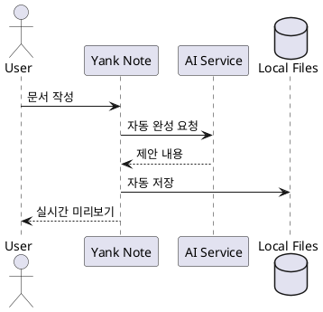
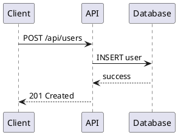
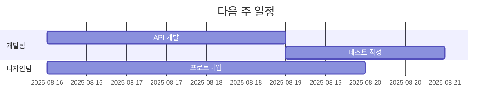
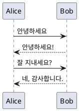

⏱️ **예상 읽기 시간**: 18분

## 개요

[Yank Note](https://github.com/purocean/yn)는 생산성 향상을 위해 설계된 **고도로 확장 가능한 마크다운 에디터**입니다. **GitHub 6.2k개의 스타**와 활발한 커뮤니티를 보유한 이 도구는 Monaco 커널(VSCode 편집기 엔진)을 사용하여 VSCode와 동일한 편집 경험을 제공하면서도, 마크다운 작성에 특화된 혁신적인 기능들을 제공합니다.

### 🎯 Yank Note의 핵심 가치

- **VSCode 급 편집 경험**: Monaco 에디터로 최고 수준의 텍스트 편집 환경
- **확장성**: 사용자 정의 플러그인으로 무한한 기능 확장
- **생산성**: AI 코파일럿, 버전 관리, 코드 실행 등 통합 기능
- **보안**: 파일별 암호화로 민감한 정보 안전 보관
- **호환성**: 표준 마크다운 문법을 유지하면서 고급 기능 제공

## Yank Note란 무엇인가?

### 🚀 차세대 마크다운 에디터

Yank Note는 단순한 텍스트 에디터를 넘어선 **종합적인 문서 작성 플랫폼**입니다:

```
아이디어 → Yank Note 작성 → 버전 관리 → AI 지원 → 출판/공유
```

### 🏗️ 현대적 아키텍처

**Electron + Vue.js 기반**:
- 크로스 플랫폼 지원 (Windows, macOS, Linux)
- 현대적 웹 기술로 빠른 성능
- 풍부한 UI/UX 경험

**Monaco 에디터 통합**:
- VSCode와 동일한 편집 엔진
- 문법 하이라이팅과 자동 완성
- 키보드 단축키 호환성

### 🔧 주요 특징 개요

| 기능 | 설명 | 활용도 |
|------|------|--------|
| **AI 코파일럿** | OpenAI 기반 자동 완성 | ⭐⭐⭐⭐⭐ |
| **버전 관리** | Git 스타일 문서 히스토리 | ⭐⭐⭐⭐⭐ |
| **암호화** | 파일별 개별 암호화 | ⭐⭐⭐⭐⭐ |
| **코드 실행** | 인라인 스크립트 실행 | ⭐⭐⭐⭐ |
| **플러그인** | JavaScript 기반 확장 | ⭐⭐⭐⭐⭐ |

## 시스템 요구사항

### 🖥️ 지원 플랫폼

**Desktop 환경**:
- **Windows**: Windows 10 이상
- **macOS**: macOS 10.14 이상
- **Linux**: Ubuntu 18.04, Debian 10, CentOS 8 이상

**하드웨어 요구사항**:
- **메모리**: 최소 4GB, 권장 8GB
- **저장 공간**: 500MB 여유 공간
- **CPU**: Intel i3 또는 AMD 동급 이상

### 🌐 웹 버전 지원

브라우저에서도 사용 가능:
- Chrome 90+
- Firefox 88+
- Safari 14+
- Edge 90+

## 설치 및 초기 설정

### 1단계: 다운로드

**공식 다운로드 페이지**:
- [GitHub Releases](https://github.com/purocean/yn/releases)
- [공식 웹사이트](https://yank-note.com)

**플랫폼별 설치 파일**:
```bash
# Windows
YankNote-3.84.0-win-x64.exe

# macOS (Apple Silicon)
YankNote-3.84.0-mac-arm64.dmg

# macOS (Intel)
YankNote-3.84.0-mac-x64.dmg

# Linux
YankNote-3.84.0-linux-x86_64.AppImage
YankNote-3.84.0-linux-amd64.deb
```

### 2단계: 플랫폼별 설치

#### macOS 설치
```bash
# Homebrew를 통한 설치 (권장)
brew install --cask yank-note

# 수동 설치
# 1. DMG 파일 다운로드
# 2. DMG 마운트
# 3. Yank Note.app을 Applications 폴더로 드래그
# 4. 첫 실행 시 보안 설정에서 허용
```

#### Windows 설치
```bash
# Chocolatey를 통한 설치
choco install yanknote

# 수동 설치
# 1. EXE 파일 다운로드 및 실행
# 2. 설치 마법사 따라하기
# 3. 바탕화면 바로가기 생성 선택
```

#### Linux 설치
```bash
# Ubuntu/Debian
sudo dpkg -i YankNote-3.84.0-linux-amd64.deb

# AppImage (모든 배포판)
chmod +x YankNote-3.84.0-linux-x86_64.AppImage
./YankNote-3.84.0-linux-x86_64.AppImage

# Snap Store
sudo snap install yank-note
```

### 3단계: 초기 환경 설정

#### 첫 실행 설정
```bash
# 1. 애플리케이션 실행
# 2. 데이터 저장 위치 설정
#    - 기본: ~/Documents/YankNote
#    - 사용자 정의: 원하는 디렉토리 선택

# 3. 언어 설정
#    - English (기본)
#    - 中文 (중국어)
#    - 한국어 지원 플러그인 설치 필요

# 4. 테마 설정
#    - Light Theme (기본)
#    - Dark Theme
#    - 사용자 정의 테마
```

#### 기본 설정 최적화
```json
{
  "editor.wordWrap": "on",
  "editor.fontSize": 14,
  "editor.lineHeight": 1.6,
  "editor.fontFamily": "Monaco, 'Courier New', monospace",
  "editor.minimap.enabled": false,
  "editor.folding": true,
  "preview.syncScroll": true,
  "preview.theme": "github"
}
```

## 핵심 기능 상세 가이드

### 📝 기본 편집 기능

#### Monaco 에디터 활용
```markdown
# VSCode와 동일한 단축키
Ctrl/Cmd + P: 빠른 파일 열기
Ctrl/Cmd + Shift + P: 명령 팔레트
Ctrl/Cmd + D: 단어 선택
Alt + Click: 다중 커서
Ctrl/Cmd + /: 주석 토글

# 마크다운 특화 기능
Ctrl/Cmd + B: **굵게**
Ctrl/Cmd + I: *기울임*
Ctrl/Cmd + K: [링크](url)
Ctrl/Cmd + Shift + K: ```코드 블록```
```

#### 동시 편집 및 미리보기
```
┌─────────────┬─────────────┐
│ 편집 영역   │ 미리보기     │
│             │             │
│ # 제목      │ 제목        │
│ **굵게**    │ 굵게        │
│ - 리스트    │ • 리스트    │
│             │             │
└─────────────┴─────────────┘
       ↕️ 동기화 스크롤
```

### 🔒 문서 암호화

#### 암호화 파일 생성
```bash
# 암호화 파일 생성 (확장자 .c.md)
새 파일 → 파일명.c.md

# 암호 설정
첫 저장 시 → 암호 입력 → 확인

# 암호화된 내용 예시
---
encrypted: true
cipher: aes-256-gcm
---

# 민감한 정보
계정: my-secret-account
비밀번호: super-secret-password
API 키: sk-1234567890abcdef
```

#### 암호화 보안 가이드
```bash
# 강력한 암호 생성 규칙
✅ 12자 이상
✅ 대소문자, 숫자, 특수문자 조합
✅ 사전에 없는 단어
❌ 개인정보 사용 금지
❌ 다른 서비스와 동일한 암호 사용 금지

# 암호 관리 팁
1. 암호 관리자 사용 (1Password, Bitwarden)
2. 복구 힌트를 별도 보관
3. 정기적인 암호 변경
```

### 📊 버전 관리

#### 자동 버전 추적
```bash
# 변경 사항 자동 감지
편집 → 자동 저장 → 버전 생성

# 버전 히스토리 보기
Ctrl/Cmd + H → 버전 목록 → 비교/복원

# 버전 정보 예시
Version 1.0.0 (2025-08-15 09:00)
+ Added introduction section
+ Created table of contents

Version 1.0.1 (2025-08-15 10:30)
* Modified code example
- Removed outdated information
```

#### 고급 버전 관리
```javascript
// 커스텀 버전 태그
---
version: "1.2.0"
tags: ["release", "stable"]
changelog: |
  - Added new features
  - Fixed critical bugs
  - Updated dependencies
---

// 브랜치 관리 (플러그인 필요)
main: 메인 문서
feature/new-section: 새 섹션 작업
hotfix/typo-fix: 오타 수정
```

### 🤖 AI 코파일럿

#### OpenAI 통합 설정
```bash
# API 키 설정
설정 → AI → OpenAI API Key 입력

# 모델 선택
- GPT-4: 최고 품질 (느림, 비쌈)
- GPT-3.5-turbo: 균형 (권장)
- GPT-3.5-turbo-16k: 긴 컨텍스트

# 사용량 제한 설정
월 사용량: $50
일 요청 수: 100개
```

#### AI 활용 예시
```markdown
<!-- AI 자동 완성 -->
## 머신러닝 개요

머신러닝은 [AI 제안: 데이터로부터 패턴을 학습하여...]

<!-- 코드 생성 -->
```python
# TODO: 선형 회귀 구현
[AI 제안: 
import numpy as np
from sklearn.linear_model import LinearRegression

# 데이터 준비
X = np.array([[1], [2], [3], [4]])
y = np.array([2, 4, 6, 8])

# 모델 훈련
model = LinearRegression()
model.fit(X, y)
]
```

<!-- 번역 기능 -->
AI: "Translate to English"
→ 선택된 한국어 텍스트를 영어로 번역
```

### ⚙️ 코드 실행

#### 지원 언어
```bash
# JavaScript/Node.js
```javascript
console.log("Hello, World!");
const data = [1, 2, 3, 4, 5];
console.log("Sum:", data.reduce((a, b) => a + b, 0));
```
<!-- 출력: Hello, World! Sum: 15 -->

# Python
```python
import matplotlib.pyplot as plt
import numpy as np

x = np.linspace(0, 10, 100)
y = np.sin(x)

plt.plot(x, y)
plt.title("Sine Wave")
plt.show()
```
<!-- 차트가 문서에 직접 표시됨 -->

# Bash
```bash
echo "Current directory: $(pwd)"
ls -la | head -5
date
```
<!-- 실시간 터미널 출력 -->
```

#### 코드 실행 환경 설정
```json
{
  "codeRunner": {
    "javascript": {
      "command": "node",
      "timeout": 30000,
      "showOutput": true
    },
    "python": {
      "command": "python3",
      "timeout": 60000,
      "showOutput": true,
      "env": {
        "PYTHONPATH": "/custom/path"
      }
    },
    "bash": {
      "command": "bash",
      "timeout": 10000,
      "showOutput": true
    }
  }
}
```

### 📈 차트 및 다이어그램

#### PlantUML 다이어그램


#### Mermaid 플로우차트

<!--
  animated-architecture-diagram — self-contained D3 embed template.
  HuggingFace research-article style: declarative NODES/EDGES/SEQ model,
  data(solid)/event(dashed) edges, hover-trace + tooltip, flow-dot animation
  along edge paths, replay button, scroll-into-view autoplay, reduced-motion +
  light/dark aware. The renderer injects window.__ARCH_SPEC__ at the marker.
  Format (D3 machinery + CSS) is owned by this committed template; the model
  only authors the JSON spec (content). See references/spec-schema.md.
-->
<div class="d3-arch" data-arch-root id="kdowneditorcompleteguide-1"></div>
<style>
  /* ---- Theme tokens (standalone; light default + dark override) ---- */
  .d3-arch {
    --page-bg: #ffffff;
    --surface-bg: #f7f8fa;
    --text-color: #1a1d21;
    --muted-color: #6b7280;
    --border-color: #d5d9e0;
    --primary-color: hsl(217 91% 55%); /* brand accent — swap for #1B4F72 etc. */
    position: relative;
    font-family: -apple-system, BlinkMacSystemFont, "Segoe UI", "Noto Sans KR", system-ui, sans-serif;
    color: var(--text-color);
  }
  @media (prefers-color-scheme: dark) {
    .d3-arch {
      --page-bg: #0f1115;
      --surface-bg: #171a21;
      --text-color: #e6e8eb;
      --muted-color: #9aa3af;
      --border-color: #2a2f3a;
      --primary-color: hsl(217 91% 62%);
    }
  }
  .d3-arch[data-theme="light"] { --page-bg:#fff; --surface-bg:#f7f8fa; --text-color:#1a1d21; --muted-color:#6b7280; --border-color:#d5d9e0; --primary-color:hsl(217 91% 55%); }
  .d3-arch[data-theme="dark"]  { --page-bg:#0f1115; --surface-bg:#171a21; --text-color:#e6e8eb; --muted-color:#9aa3af; --border-color:#2a2f3a; --primary-color:hsl(217 91% 62%); }

  .d3-arch .diagram-scroll { overflow-x: auto; }
  .d3-arch svg { display: block; width: 100%; min-width: 760px; height: auto; font-family: inherit; }

  /* Group boxes */
  .d3-arch .group rect { fill: none; stroke: var(--border-color); stroke-dasharray: 3 3; rx: 12px; }
  .d3-arch .group text { font-size: 10px; font-weight: 700; letter-spacing: 0.08em; text-transform: uppercase; fill: var(--muted-color); }

  /* Nodes */
  .d3-arch .node rect { fill: var(--surface-bg); stroke: var(--border-color); stroke-width: 1; transition: stroke 0.15s ease, opacity 0.15s ease; }
  .d3-arch .node .node-title { font-size: 12px; font-weight: 600; fill: var(--text-color); }
  .d3-arch .node .node-sub { font-size: 9.5px; fill: var(--muted-color); }
  .d3-arch .node { cursor: default; transition: opacity 0.15s ease; }

  /* Edges */
  .d3-arch .edge { transition: opacity 0.15s ease; }
  .d3-arch .edge path.main { fill: none; stroke-width: 1.5; }
  .d3-arch .edge.data path.main { stroke: var(--primary-color); }
  .d3-arch .edge.event path.main { stroke: var(--muted-color); stroke-dasharray: 5 4; }
  .d3-arch .edge text { font-size: 9.5px; fill: var(--muted-color); paint-order: stroke; stroke: var(--page-bg); stroke-width: 3px; stroke-linejoin: round; }

  /* Hover highlighting */
  .d3-arch.hovering .edge:not(.hl) { opacity: 0.12; }
  .d3-arch.hovering .node:not(.hl):not(.nb) { opacity: 0.25; }
  .d3-arch .node.hl rect { stroke: var(--primary-color); stroke-width: 1.5; }

  /* Flow animation */
  .d3-arch .flow-dot.data { fill: var(--primary-color); stroke: var(--page-bg); stroke-width: 1.5; }
  .d3-arch .flow-dot.event { fill: var(--page-bg); stroke: var(--muted-color); stroke-width: 1.5; }
  .d3-arch .node.anim-hl rect { stroke: var(--primary-color); stroke-width: 1.5; }
  .d3-arch .replay-btn { font: inherit; font-size: 11px; font-weight: 600; padding: 4px 10px; border: 1px solid var(--border-color); border-radius: 8px; background: var(--surface-bg); color: var(--text-color); cursor: pointer; transition: border-color 0.15s ease, opacity 0.15s ease; }
  .d3-arch .replay-btn:hover:not(:disabled) { border-color: var(--primary-color); }
  .d3-arch .replay-btn:disabled { opacity: 0.45; cursor: default; }
  .d3-arch .replay-btn:focus-visible { outline: 2px solid var(--primary-color); outline-offset: 1px; }

  /* Legend */
  .d3-arch .legend { display: flex; flex-direction: column; align-items: flex-start; gap: 6px; margin-top: 10px; }
  .d3-arch .legend-title { font-size: 12px; font-weight: 700; color: var(--text-color); }
  .d3-arch .legend .items { display: flex; flex-wrap: wrap; gap: 8px 18px; align-items: center; }
  .d3-arch .legend .item { display: inline-flex; align-items: center; gap: 7px; white-space: nowrap; font-size: 12px; color: var(--text-color); }
  .d3-arch .legend .swatch { width: 22px; height: 0; }
  .d3-arch .legend .swatch.data-line { border-top: 2.5px solid var(--primary-color); }
  .d3-arch .legend .swatch.event-line { border-top: 2.5px dashed var(--muted-color); }
  .d3-arch .legend .hint { font-size: 11px; font-style: italic; color: var(--muted-color); }
</style>
<script>
  (() => {
    const SPEC = ({"title": "", "ariaLabel": "", "width": 351, "height": 866, "legendTitle": "Legend", "hint": "Hover a node to trace its connections.", "groups": [], "nodes": [{"id": "A", "x": 112, "y": 24, "w": 120, "h": 46, "title": "문서 작성"}, {"id": "B", "x": 103, "y": 148, "w": 138, "h": 52, "title": "암호화 필요?"}, {"id": "C", "x": 199, "y": 292, "w": 120, "h": 46, "title": "암호 설정"}, {"id": "D", "x": 24, "y": 416, "w": 120, "h": 46, "title": "일반 저장"}, {"id": "E", "x": 199, "y": 416, "w": 120, "h": 46, "title": "암호화 저장"}, {"id": "F", "x": 112, "y": 540, "w": 120, "h": 46, "title": "버전 관리"}, {"id": "G", "x": 112, "y": 664, "w": 120, "h": 46, "title": "AI 자동 완성"}, {"id": "H", "x": 112, "y": 788, "w": 120, "h": 46, "title": "최종 출력"}], "edges": [{"src": "A", "dst": "B", "kind": "data", "line": [172, 70, 172, 148]}, {"src": "B", "dst": "C", "kind": "data", "label": "Yes", "curve": [[203, 200], [259, 246], [259, 246], [259, 292]], "off": "50%"}, {"src": "B", "dst": "D", "kind": "data", "label": "No", "curve": [[140, 200], [84, 246], [84, 377], [84, 416]], "off": "50%"}, {"src": "C", "dst": "E", "kind": "data", "line": [259, 338, 259, 416]}, {"src": "D", "dst": "F", "kind": "data", "curve": [[84, 462], [84, 501], [84, 501], [139, 540]]}, {"src": "E", "dst": "F", "kind": "data", "curve": [[259, 462], [259, 501], [259, 501], [204, 540]]}, {"src": "F", "dst": "G", "kind": "data", "line": [172, 586, 172, 664]}, {"src": "G", "dst": "H", "kind": "data", "line": [172, 710, 172, 788]}]});
    const ensureD3 = (cb) => {
      if (window.d3 && typeof window.d3.select === 'function') return cb();
      let s = document.getElementById('d3-cdn-script');
      if (!s) {
        s = document.createElement('script');
        s.id = 'd3-cdn-script';
        s.src = 'https://cdn.jsdelivr.net/npm/d3@7/dist/d3.min.js';
        document.head.appendChild(s);
      }
      const onReady = () => { if (window.d3 && typeof window.d3.select === 'function') cb(); };
      s.addEventListener('load', onReady, { once: true });
      if (window.d3) onReady();
    };

    const bootstrap = () => {
      const container = document.getElementById('kdowneditorcompleteguide-1')
        || document.querySelector('.d3-arch[data-arch-root]:not([data-mounted])');
      if (!container || (container.dataset && container.dataset.mounted === 'true')) return;
      if (container.dataset) container.dataset.mounted = 'true';

      try {
        const uid = 'kdowneditorcompleteguide-1';
        const NODES = SPEC.nodes || [];
        const EDGES = SPEC.edges || [];
        const GROUPS = SPEC.groups || [];
        const HOP = SPEC.hop || 800;
        const legendCfg = SPEC.legend || {};
        const dataLabel = legendCfg.data || 'Data path';
        const eventLabel = legendCfg.event || 'Event side-channel';

        const byId = Object.fromEntries(NODES.map((n) => [n.id, n]));
        const cx = (n) => n.x + n.w / 2;
        const asTitle = (t) => Array.isArray(t) ? t : [t];

        // Canvas: explicit, else auto from node/group extents + padding
        let W = SPEC.width, H = SPEC.height;
        if (!W || !H) {
          const xs = [], ys = [];
          NODES.forEach((n) => { xs.push(n.x + n.w); ys.push(n.y + n.h); });
          GROUPS.forEach((g) => { xs.push(g.x + g.w); ys.push(g.y + g.h); });
          W = W || Math.max(760, Math.ceil(Math.max(...xs, 0) + 24));
          H = H || Math.ceil(Math.max(...ys, 0) + 20);
        }

        // Tooltip
        container.style.position = container.style.position || 'relative';
        const tip = document.createElement('div');
        Object.assign(tip.style, {
          position: 'absolute', top: '0px', left: '0px',
          transform: 'translate(-9999px, -9999px)', pointerEvents: 'none',
          padding: '8px 10px', borderRadius: '8px', fontSize: '12px', lineHeight: '1.4',
          border: '1px solid var(--border-color)', background: 'var(--surface-bg)',
          color: 'var(--text-color)', boxShadow: '0 4px 24px rgba(0,0,0,.18)',
          opacity: '0', transition: 'opacity .12s ease', maxWidth: '260px', zIndex: '3'
        });
        const tipInner = document.createElement('div');
        tip.appendChild(tipInner);

        const scroll = document.createElement('div');
        scroll.className = 'diagram-scroll';
        container.appendChild(scroll);

        const svg = d3.select(scroll).append('svg')
          .attr('viewBox', `0 0 ${W} ${H}`)
          .attr('preserveAspectRatio', 'xMidYMid meet')
          .attr('role', 'img')
          .attr('aria-label', SPEC.ariaLabel || SPEC.title || 'Architecture diagram');

        const defs = svg.append('defs');
        const mkMarker = (id, color) => {
          defs.append('marker')
            .attr('id', id).attr('viewBox', '0 0 10 10')
            .attr('refX', 9).attr('refY', 5)
            .attr('markerWidth', 6.5).attr('markerHeight', 6.5)
            .attr('orient', 'auto-start-reverse')
            .append('path').attr('d', 'M 0 0 L 10 5 L 0 10 z').style('fill', color);
        };
        mkMarker(`${uid}-arrow-data`, 'var(--primary-color)');
        mkMarker(`${uid}-arrow-event`, 'var(--muted-color)');

        // Groups
        const groups = svg.append('g');
        GROUPS.forEach((gr) => {
          const g = groups.append('g').attr('class', 'group');
          g.append('rect').attr('x', gr.x).attr('y', gr.y).attr('width', gr.w).attr('height', gr.h).attr('rx', 12);
          if (gr.label) g.append('text').attr('x', gr.lx != null ? gr.lx : gr.x + 12).attr('y', gr.ly != null ? gr.ly : gr.y + 18).text(gr.label);
        });

        // Edges (under nodes)
        const edgeLayer = svg.append('g');
        const curvePath = (p) => `M ${p[0][0]} ${p[0][1]} C ${p[1][0]} ${p[1][1]}, ${p[2][0]} ${p[2][1]}, ${p[3][0]} ${p[3][1]}`;
        EDGES.forEach((e, i) => {
          const kind = e.kind === 'event' ? 'event' : 'data';
          const g = edgeLayer.append('g').attr('class', `edge ${kind}`).attr('data-src', e.src).attr('data-dst', e.dst);
          const marker = `url(#${uid}-arrow-${kind})`;
          if (e.line) {
            const [x1, y1, x2, y2] = e.line;
            e.pathEl = g.append('path').attr('class', 'main').attr('d', `M ${x1} ${y1} L ${x2} ${y2}`).attr('marker-end', marker).node();
            if (e.label) g.append('text').attr('x', e.lx != null ? e.lx : (x1 + x2) / 2).attr('y', e.ly != null ? e.ly : (y1 + y2) / 2 - 6).attr('text-anchor', e.anchor || 'middle').text(e.label);
          } else if (e.curve) {
            e.pathEl = g.append('path').attr('class', 'main').attr('d', curvePath(e.curve)).attr('marker-end', marker).node();
            if (e.label && e.off) {
              const p = e.curve;
              const lp = p[3][0] < p[0][0] ? [p[3], p[2], p[1], p[0]] : p;
              const lpId = `${uid}-lbl-${i}`;
              g.append('path').attr('id', lpId).attr('d', curvePath(lp)).attr('fill', 'none').attr('stroke', 'none');
              g.append('text').attr('dy', -5).append('textPath').attr('href', `#${lpId}`).attr('startOffset', e.off).attr('text-anchor', 'middle').text(e.label);
            } else if (e.label) {
              g.append('text').attr('x', e.lx).attr('y', e.ly).attr('text-anchor', e.anchor || 'start').text(e.label);
            }
          }
        });

        // Nodes (over edges)
        const nodeLayer = svg.append('g');
        NODES.forEach((n) => {
          const g = nodeLayer.append('g').attr('class', 'node').attr('data-id', n.id);
          g.append('rect').attr('x', n.x).attr('y', n.y).attr('width', n.w).attr('height', n.h).attr('rx', 9);
          const title = asTitle(n.title);
          const lines = title.length;
          const baseY = n.y + n.h / 2 - (lines - 1) * 7 - (n.sub ? 5 : -4);
          title.forEach((t, li) => {
            g.append('text').attr('class', 'node-title').attr('x', cx(n)).attr('y', baseY + li * 14).attr('text-anchor', 'middle').text(t);
          });
          if (n.sub) g.append('text').attr('class', 'node-sub').attr('x', cx(n)).attr('y', baseY + (lines - 1) * 14 + 15).attr('text-anchor', 'middle').text(n.sub);
        });

        // Hover highlighting
        const edgeSel = svg.selectAll('.edge');
        const nodeSel = svg.selectAll('.node');
        nodeSel
          .on('mouseenter', function () {
            const id = this.getAttribute('data-id');
            const n = byId[id];
            container.classList.add('hovering');
            const nb = new Set([id]);
            edgeSel.classed('hl', function () {
              const hit = this.getAttribute('data-src') === id || this.getAttribute('data-dst') === id;
              if (hit) { nb.add(this.getAttribute('data-src')); nb.add(this.getAttribute('data-dst')); }
              return hit;
            });
            nodeSel.classed('hl', function () { return this.getAttribute('data-id') === id; })
                   .classed('nb', function () { return nb.has(this.getAttribute('data-id')); });
            if (n && n.desc) { tipInner.innerHTML = `<strong>${asTitle(n.title).join('')}</strong><br>${n.desc}`; tip.style.opacity = '1'; }
          })
          .on('mousemove', function (event) {
            const [mx, my] = d3.pointer(event, container);
            const flip = mx > container.clientWidth - 280;
            tip.style.transform = `translate(${flip ? mx - 270 : mx + 14}px, ${my + 14}px)`;
          })
          .on('mouseleave', function () {
            container.classList.remove('hovering');
            edgeSel.classed('hl', false);
            nodeSel.classed('hl', false).classed('nb', false);
            tip.style.opacity = '0';
            tip.style.transform = 'translate(-9999px, -9999px)';
          });

        // Flow animation sequence: explicit SEQ, else auto forward-cascade of data edges
        const resolveEdge = (s) => {
          if (typeof s.e === 'number') return s.e;
          if (s.from && s.to) return EDGES.findIndex((e) => e.src === s.from && e.dst === s.to);
          return -1;
        };
        let SEQ = (SPEC.seq || []).map((s) => ({ e: resolveEdge(s), t0: s.t0 })).filter((s) => s.e >= 0);
        if (!SEQ.length) {
          let t = 0;
          EDGES.forEach((e, i) => { if ((e.kind || 'data') === 'data') { SEQ.push({ e: i, t0: t }); t += HOP; } });
        }
        const TOTAL = SPEC.total || (Math.max(0, ...SEQ.map((s) => s.t0)) + HOP + 800);

        let playing = false, replayBtn = null;
        const pulseNode = (id) => {
          const sel = nodeSel.filter(function () { return this.getAttribute('data-id') === id; });
          sel.classed('anim-hl', true);
          setTimeout(() => sel.classed('anim-hl', false), 550);
        };
        const play = () => {
          if (playing) return;
          playing = true;
          if (replayBtn) replayBtn.disabled = true;
          const layer = svg.append('g');
          const steps = SEQ.map((s) => {
            const edge = EDGES[s.e];
            return { ...s, edge, len: edge.pathEl.getTotalLength(), dot: null, arrived: false };
          });
          const start = performance.now();
          const frame = (now) => {
            const t = now - start;
            steps.forEach((s) => {
              if (t < s.t0) return;
              const f = Math.min(1, (t - s.t0) / HOP);
              if (f >= 1) { if (s.dot) { s.dot.remove(); s.dot = null; } if (!s.arrived) { s.arrived = true; pulseNode(s.edge.dst); } return; }
              if (!s.dot) s.dot = layer.append('circle').attr('class', `flow-dot ${s.edge.kind || 'data'}`).attr('r', (s.edge.kind === 'event') ? 4 : 5);
              const p = s.edge.pathEl.getPointAtLength(d3.easeCubicInOut(f) * s.len);
              s.dot.attr('cx', p.x).attr('cy', p.y);
            });
            if (t < TOTAL) requestAnimationFrame(frame);
            else { layer.remove(); playing = false; if (replayBtn) replayBtn.disabled = false; }
          };
          requestAnimationFrame(frame);
        };

        // Legend
        const legend = document.createElement('div');
        legend.className = 'legend';
        legend.innerHTML = `
          <div class="legend-title">${SPEC.legendTitle || 'Legend'}</div>
          <div class="items">
            <span class="item"><span class="swatch data-line"></span><span>${dataLabel}</span></span>
            <span class="item"><span class="swatch event-line"></span><span>${eventLabel}</span></span>
            <button class="replay-btn" type="button" aria-label="Replay the flow animation">&#9654; Replay</button>
            <span class="hint">${SPEC.hint || 'Hover a component to trace its connections.'}</span>
          </div>`;
        container.appendChild(legend);
        container.appendChild(tip);
        replayBtn = legend.querySelector('.replay-btn');
        replayBtn.addEventListener('click', play);

        const prefersReduced = window.matchMedia && window.matchMedia('(prefers-reduced-motion: reduce)').matches;
        if (!prefersReduced && window.IntersectionObserver) {
          const io = new IntersectionObserver((entries) => {
            entries.forEach((en) => { if (en.isIntersecting) { io.disconnect(); play(); } });
          }, { threshold: 0.5 });
          io.observe(container);
        }
      } catch (err) {
        const pre = document.createElement('pre');
        pre.style.color = '#c0392b';
        pre.style.fontSize = '12px';
        pre.textContent = 'Failed to render architecture diagram: ' + (err && err.message ? err.message : err);
        container.appendChild(pre);
      }
    };

    if (document.readyState === 'loading') document.addEventListener('DOMContentLoaded', () => ensureD3(bootstrap), { once: true });
    else ensureD3(bootstrap);
  })();
</script>


#### ECharts 인터랙티브 차트
```echarts
{
  "title": {
    "text": "월별 문서 작성량"
  },
  "xAxis": {
    "type": "category",
    "data": ["1월", "2월", "3월", "4월", "5월", "6월"]
  },
  "yAxis": {
    "type": "value"
  },
  "series": [{
    "data": [120, 200, 150, 80, 70, 110],
    "type": "bar",
    "itemStyle": {
      "color": "#4CAF50"
    }
  }]
}
```

### 🧠 마인드 맵

#### 자동 마인드 맵 변환
```markdown
# 프로젝트 계획
- 기획 단계
  - 요구사항 분석
    - 기능 요구사항
    - 비기능 요구사항
  - 사용자 리서치
    - 설문 조사
    - 인터뷰
- 설계 단계
  - UI/UX 설계
  - 시스템 아키텍처
- 개발 단계
  - 프론트엔드
  - 백엔드
  - 테스트
```

위 목록이 자동으로 마인드 맵으로 변환됩니다:
```
프로젝트 계획
├── 기획 단계
│   ├── 요구사항 분석
│   └── 사용자 리서치
├── 설계 단계
└── 개발 단계
```

## 실전 활용 예제

### 예제 1: 기술 문서 작성

```markdown
---
title: "API 문서"
version: "1.0.0"
tags: ["api", "documentation"]
---

# REST API 가이드

## 인증

```javascript
// API 키 인증 예시
const response = await fetch('/api/users', {
  headers: {
    'Authorization': 'Bearer YOUR_API_KEY',
    'Content-Type': 'application/json'
  }
});
```

## 엔드포인트

| 메서드 | 경로 | 설명 |
|--------|------|------|
| GET | `/api/users` | 사용자 목록 조회 |
| POST | `/api/users` | 새 사용자 생성 |


```

### 예제 2: 프로젝트 회의록

```markdown
---
encrypted: true
meeting: "주간 스프린트 리뷰"
date: "2025-08-15"
attendees: ["김개발", "박기획", "이디자인"]
---

# 주간 스프린트 리뷰 회의록 🔒

## 완료된 작업
- [x] 로그인 API 개발 (김개발)
- [x] UI 목업 완성 (이디자인)
- [x] 요구사항 문서 업데이트 (박기획)

## 진행 중인 작업
- [ ] 데이터베이스 스키마 설계
- [ ] 프론트엔드 컴포넌트 개발

## 다음 주 계획



## 기밀 정보 🚨
- 서버 접속 정보: `ssh admin@secret-server.com`
- 데이터베이스 패스워드: `超Secret123!`
```

### 예제 3: 학습 노트

```markdown
# 머신러닝 학습 노트

## 선형 회귀 실습

### 이론
선형 회귀는 독립 변수 X와 종속 변수 y 사이의 선형 관계를 모델링합니다.

공식: $y = wx + b$

### 실습 코드
```python
import numpy as np
import matplotlib.pyplot as plt
from sklearn.linear_model import LinearRegression

# 샘플 데이터 생성
np.random.seed(42)
X = np.random.randn(100, 1)
y = 2 * X.ravel() + np.random.randn(100)

# 모델 훈련
model = LinearRegression()
model.fit(X, y)

# 예측
y_pred = model.predict(X)

# 시각화
plt.scatter(X, y, alpha=0.6)
plt.plot(X, y_pred, color='red', linewidth=2)
plt.title('Linear Regression Example')
plt.xlabel('X')
plt.ylabel('y')
plt.show()

print(f"기울기: {model.coef_[0]:.2f}")
print(f"절편: {model.intercept_:.2f}")
```

### 결과 분석
모델이 학습한 기울기는 실제 값(2.0)에 가깝고, 
데이터의 선형 관계를 잘 포착했습니다.
```

## macOS에서 테스트해보기

실제로 Yank Note를 macOS에서 설치하고 테스트할 수 있는 스크립트를 작성해보겠습니다.

### 자동 설치 및 테스트 스크립트

```bash
#!/bin/bash
# yank-note-test-setup.sh

echo "🚀 Yank Note 설치 및 테스트 스크립트"
echo "===================================="

# 1. Homebrew 확인
if command -v brew &> /dev/null; then
    echo "✅ Homebrew 확인됨"
else
    echo "❌ Homebrew 필요: /bin/bash -c \"\$(curl -fsSL https://raw.githubusercontent.com/Homebrew/install/HEAD/install.sh)\""
    exit 1
fi

# 2. Yank Note 설치
echo "📥 Yank Note 설치 중..."
if brew list --cask yank-note &> /dev/null; then
    echo "✅ Yank Note 이미 설치됨"
else
    brew install --cask yank-note
    echo "✅ Yank Note 설치 완료"
fi

# 3. 테스트 문서 디렉토리 생성
TEST_DIR="$HOME/YankNote-Test-$(date +%Y%m%d)"
mkdir -p "$TEST_DIR"
cd "$TEST_DIR"

# 4. 샘플 문서 생성
cat > "01-기본-테스트.md" << 'EOF'
# Yank Note 기본 기능 테스트

## 텍스트 포맷팅
**굵게**, *기울임*, ~~취소선~~, `코드`

## 목록
- 항목 1
- 항목 2
  - 하위 항목 2.1
  - 하위 항목 2.2

## 표
| 항목 | 설명 | 상태 |
|------|------|------|
| 설치 | Yank Note 설치 | ✅ |
| 테스트 | 기능 확인 | 🔄 |

## 코드 블록
```javascript
console.log("Hello, Yank Note!");
const sum = (a, b) => a + b;
console.log("2 + 3 =", sum(2, 3));
```

## 수식
인라인 수식: $E = mc^2$

블록 수식:
$$
\int_{-\infty}^{\infty} e^{-x^2} dx = \sqrt{\pi}
$$
EOF

# 5. 암호화 테스트 문서 생성
cat > "02-암호화-테스트.c.md" << 'EOF'
# 암호화 문서 테스트 🔒

이 문서는 암호화되어 저장됩니다.

## 기밀 정보
- 테스트 계정: test@example.com
- 테스트 비밀번호: SecretPassword123!

## 중요 사항
- 암호를 절대 잊지 마세요
- 정기적으로 백업하세요
EOF

# 6. AI 테스트 문서 생성
cat > "03-AI-테스트.md" << 'EOF'
# AI 코파일럿 테스트

## AI 자동 완성 요청
머신러닝은 <!-- AI에게 완성 요청 -->

## 코드 생성 요청
```python
# TODO: 피보나치 수열 생성기 구현
<!-- AI에게 코드 생성 요청 -->
```

## 번역 테스트
Hello, World! <!-- 한국어로 번역 요청 -->
EOF

# 7. 다이어그램 테스트 문서 생성
cat > "04-다이어그램-테스트.md" << 'EOF'
# 다이어그램 기능 테스트

## Mermaid 플로우차트

<!--
  animated-architecture-diagram — self-contained D3 embed template.
  HuggingFace research-article style: declarative NODES/EDGES/SEQ model,
  data(solid)/event(dashed) edges, hover-trace + tooltip, flow-dot animation
  along edge paths, replay button, scroll-into-view autoplay, reduced-motion +
  light/dark aware. The renderer injects window.__ARCH_SPEC__ at the marker.
  Format (D3 machinery + CSS) is owned by this committed template; the model
  only authors the JSON spec (content). See references/spec-schema.md.
-->
<div class="d3-arch" data-arch-root id="kdowneditorcompleteguide-2"></div>
<style>
  /* ---- Theme tokens (standalone; light default + dark override) ---- */
  .d3-arch {
    --page-bg: #ffffff;
    --surface-bg: #f7f8fa;
    --text-color: #1a1d21;
    --muted-color: #6b7280;
    --border-color: #d5d9e0;
    --primary-color: hsl(217 91% 55%); /* brand accent — swap for #1B4F72 etc. */
    position: relative;
    font-family: -apple-system, BlinkMacSystemFont, "Segoe UI", "Noto Sans KR", system-ui, sans-serif;
    color: var(--text-color);
  }
  @media (prefers-color-scheme: dark) {
    .d3-arch {
      --page-bg: #0f1115;
      --surface-bg: #171a21;
      --text-color: #e6e8eb;
      --muted-color: #9aa3af;
      --border-color: #2a2f3a;
      --primary-color: hsl(217 91% 62%);
    }
  }
  .d3-arch[data-theme="light"] { --page-bg:#fff; --surface-bg:#f7f8fa; --text-color:#1a1d21; --muted-color:#6b7280; --border-color:#d5d9e0; --primary-color:hsl(217 91% 55%); }
  .d3-arch[data-theme="dark"]  { --page-bg:#0f1115; --surface-bg:#171a21; --text-color:#e6e8eb; --muted-color:#9aa3af; --border-color:#2a2f3a; --primary-color:hsl(217 91% 62%); }

  .d3-arch .diagram-scroll { overflow-x: auto; }
  .d3-arch svg { display: block; width: 100%; min-width: 760px; height: auto; font-family: inherit; }

  /* Group boxes */
  .d3-arch .group rect { fill: none; stroke: var(--border-color); stroke-dasharray: 3 3; rx: 12px; }
  .d3-arch .group text { font-size: 10px; font-weight: 700; letter-spacing: 0.08em; text-transform: uppercase; fill: var(--muted-color); }

  /* Nodes */
  .d3-arch .node rect { fill: var(--surface-bg); stroke: var(--border-color); stroke-width: 1; transition: stroke 0.15s ease, opacity 0.15s ease; }
  .d3-arch .node .node-title { font-size: 12px; font-weight: 600; fill: var(--text-color); }
  .d3-arch .node .node-sub { font-size: 9.5px; fill: var(--muted-color); }
  .d3-arch .node { cursor: default; transition: opacity 0.15s ease; }

  /* Edges */
  .d3-arch .edge { transition: opacity 0.15s ease; }
  .d3-arch .edge path.main { fill: none; stroke-width: 1.5; }
  .d3-arch .edge.data path.main { stroke: var(--primary-color); }
  .d3-arch .edge.event path.main { stroke: var(--muted-color); stroke-dasharray: 5 4; }
  .d3-arch .edge text { font-size: 9.5px; fill: var(--muted-color); paint-order: stroke; stroke: var(--page-bg); stroke-width: 3px; stroke-linejoin: round; }

  /* Hover highlighting */
  .d3-arch.hovering .edge:not(.hl) { opacity: 0.12; }
  .d3-arch.hovering .node:not(.hl):not(.nb) { opacity: 0.25; }
  .d3-arch .node.hl rect { stroke: var(--primary-color); stroke-width: 1.5; }

  /* Flow animation */
  .d3-arch .flow-dot.data { fill: var(--primary-color); stroke: var(--page-bg); stroke-width: 1.5; }
  .d3-arch .flow-dot.event { fill: var(--page-bg); stroke: var(--muted-color); stroke-width: 1.5; }
  .d3-arch .node.anim-hl rect { stroke: var(--primary-color); stroke-width: 1.5; }
  .d3-arch .replay-btn { font: inherit; font-size: 11px; font-weight: 600; padding: 4px 10px; border: 1px solid var(--border-color); border-radius: 8px; background: var(--surface-bg); color: var(--text-color); cursor: pointer; transition: border-color 0.15s ease, opacity 0.15s ease; }
  .d3-arch .replay-btn:hover:not(:disabled) { border-color: var(--primary-color); }
  .d3-arch .replay-btn:disabled { opacity: 0.45; cursor: default; }
  .d3-arch .replay-btn:focus-visible { outline: 2px solid var(--primary-color); outline-offset: 1px; }

  /* Legend */
  .d3-arch .legend { display: flex; flex-direction: column; align-items: flex-start; gap: 6px; margin-top: 10px; }
  .d3-arch .legend-title { font-size: 12px; font-weight: 700; color: var(--text-color); }
  .d3-arch .legend .items { display: flex; flex-wrap: wrap; gap: 8px 18px; align-items: center; }
  .d3-arch .legend .item { display: inline-flex; align-items: center; gap: 7px; white-space: nowrap; font-size: 12px; color: var(--text-color); }
  .d3-arch .legend .swatch { width: 22px; height: 0; }
  .d3-arch .legend .swatch.data-line { border-top: 2.5px solid var(--primary-color); }
  .d3-arch .legend .swatch.event-line { border-top: 2.5px dashed var(--muted-color); }
  .d3-arch .legend .hint { font-size: 11px; font-style: italic; color: var(--muted-color); }
</style>
<script>
  (() => {
    const SPEC = ({"title": "", "ariaLabel": "", "width": 237, "height": 494, "legendTitle": "Legend", "hint": "Hover a node to trace its connections.", "groups": [], "nodes": [{"id": "A", "x": 33, "y": 24, "w": 120, "h": 46, "title": "시작"}, {"id": "B", "x": 24, "y": 148, "w": 138, "h": 52, "title": "조건"}, {"id": "C", "x": 85, "y": 292, "w": 120, "h": 46, "title": "처리"}, {"id": "D", "x": 33, "y": 416, "w": 120, "h": 46, "title": "종료"}], "edges": [{"src": "A", "dst": "B", "kind": "data", "line": [93, 70, 93, 148]}, {"src": "B", "dst": "C", "kind": "data", "label": "Yes", "curve": [[112, 200], [145, 246], [145, 246], [145, 292]], "off": "50%"}, {"src": "B", "dst": "D", "kind": "data", "label": "No", "curve": [[74, 200], [41, 246], [41, 377], [74, 416]], "off": "50%"}, {"src": "C", "dst": "D", "kind": "data", "curve": [[145, 338], [145, 377], [145, 377], [112, 416]]}]});
    const ensureD3 = (cb) => {
      if (window.d3 && typeof window.d3.select === 'function') return cb();
      let s = document.getElementById('d3-cdn-script');
      if (!s) {
        s = document.createElement('script');
        s.id = 'd3-cdn-script';
        s.src = 'https://cdn.jsdelivr.net/npm/d3@7/dist/d3.min.js';
        document.head.appendChild(s);
      }
      const onReady = () => { if (window.d3 && typeof window.d3.select === 'function') cb(); };
      s.addEventListener('load', onReady, { once: true });
      if (window.d3) onReady();
    };

    const bootstrap = () => {
      const container = document.getElementById('kdowneditorcompleteguide-2')
        || document.querySelector('.d3-arch[data-arch-root]:not([data-mounted])');
      if (!container || (container.dataset && container.dataset.mounted === 'true')) return;
      if (container.dataset) container.dataset.mounted = 'true';

      try {
        const uid = 'kdowneditorcompleteguide-2';
        const NODES = SPEC.nodes || [];
        const EDGES = SPEC.edges || [];
        const GROUPS = SPEC.groups || [];
        const HOP = SPEC.hop || 800;
        const legendCfg = SPEC.legend || {};
        const dataLabel = legendCfg.data || 'Data path';
        const eventLabel = legendCfg.event || 'Event side-channel';

        const byId = Object.fromEntries(NODES.map((n) => [n.id, n]));
        const cx = (n) => n.x + n.w / 2;
        const asTitle = (t) => Array.isArray(t) ? t : [t];

        // Canvas: explicit, else auto from node/group extents + padding
        let W = SPEC.width, H = SPEC.height;
        if (!W || !H) {
          const xs = [], ys = [];
          NODES.forEach((n) => { xs.push(n.x + n.w); ys.push(n.y + n.h); });
          GROUPS.forEach((g) => { xs.push(g.x + g.w); ys.push(g.y + g.h); });
          W = W || Math.max(760, Math.ceil(Math.max(...xs, 0) + 24));
          H = H || Math.ceil(Math.max(...ys, 0) + 20);
        }

        // Tooltip
        container.style.position = container.style.position || 'relative';
        const tip = document.createElement('div');
        Object.assign(tip.style, {
          position: 'absolute', top: '0px', left: '0px',
          transform: 'translate(-9999px, -9999px)', pointerEvents: 'none',
          padding: '8px 10px', borderRadius: '8px', fontSize: '12px', lineHeight: '1.4',
          border: '1px solid var(--border-color)', background: 'var(--surface-bg)',
          color: 'var(--text-color)', boxShadow: '0 4px 24px rgba(0,0,0,.18)',
          opacity: '0', transition: 'opacity .12s ease', maxWidth: '260px', zIndex: '3'
        });
        const tipInner = document.createElement('div');
        tip.appendChild(tipInner);

        const scroll = document.createElement('div');
        scroll.className = 'diagram-scroll';
        container.appendChild(scroll);

        const svg = d3.select(scroll).append('svg')
          .attr('viewBox', `0 0 ${W} ${H}`)
          .attr('preserveAspectRatio', 'xMidYMid meet')
          .attr('role', 'img')
          .attr('aria-label', SPEC.ariaLabel || SPEC.title || 'Architecture diagram');

        const defs = svg.append('defs');
        const mkMarker = (id, color) => {
          defs.append('marker')
            .attr('id', id).attr('viewBox', '0 0 10 10')
            .attr('refX', 9).attr('refY', 5)
            .attr('markerWidth', 6.5).attr('markerHeight', 6.5)
            .attr('orient', 'auto-start-reverse')
            .append('path').attr('d', 'M 0 0 L 10 5 L 0 10 z').style('fill', color);
        };
        mkMarker(`${uid}-arrow-data`, 'var(--primary-color)');
        mkMarker(`${uid}-arrow-event`, 'var(--muted-color)');

        // Groups
        const groups = svg.append('g');
        GROUPS.forEach((gr) => {
          const g = groups.append('g').attr('class', 'group');
          g.append('rect').attr('x', gr.x).attr('y', gr.y).attr('width', gr.w).attr('height', gr.h).attr('rx', 12);
          if (gr.label) g.append('text').attr('x', gr.lx != null ? gr.lx : gr.x + 12).attr('y', gr.ly != null ? gr.ly : gr.y + 18).text(gr.label);
        });

        // Edges (under nodes)
        const edgeLayer = svg.append('g');
        const curvePath = (p) => `M ${p[0][0]} ${p[0][1]} C ${p[1][0]} ${p[1][1]}, ${p[2][0]} ${p[2][1]}, ${p[3][0]} ${p[3][1]}`;
        EDGES.forEach((e, i) => {
          const kind = e.kind === 'event' ? 'event' : 'data';
          const g = edgeLayer.append('g').attr('class', `edge ${kind}`).attr('data-src', e.src).attr('data-dst', e.dst);
          const marker = `url(#${uid}-arrow-${kind})`;
          if (e.line) {
            const [x1, y1, x2, y2] = e.line;
            e.pathEl = g.append('path').attr('class', 'main').attr('d', `M ${x1} ${y1} L ${x2} ${y2}`).attr('marker-end', marker).node();
            if (e.label) g.append('text').attr('x', e.lx != null ? e.lx : (x1 + x2) / 2).attr('y', e.ly != null ? e.ly : (y1 + y2) / 2 - 6).attr('text-anchor', e.anchor || 'middle').text(e.label);
          } else if (e.curve) {
            e.pathEl = g.append('path').attr('class', 'main').attr('d', curvePath(e.curve)).attr('marker-end', marker).node();
            if (e.label && e.off) {
              const p = e.curve;
              const lp = p[3][0] < p[0][0] ? [p[3], p[2], p[1], p[0]] : p;
              const lpId = `${uid}-lbl-${i}`;
              g.append('path').attr('id', lpId).attr('d', curvePath(lp)).attr('fill', 'none').attr('stroke', 'none');
              g.append('text').attr('dy', -5).append('textPath').attr('href', `#${lpId}`).attr('startOffset', e.off).attr('text-anchor', 'middle').text(e.label);
            } else if (e.label) {
              g.append('text').attr('x', e.lx).attr('y', e.ly).attr('text-anchor', e.anchor || 'start').text(e.label);
            }
          }
        });

        // Nodes (over edges)
        const nodeLayer = svg.append('g');
        NODES.forEach((n) => {
          const g = nodeLayer.append('g').attr('class', 'node').attr('data-id', n.id);
          g.append('rect').attr('x', n.x).attr('y', n.y).attr('width', n.w).attr('height', n.h).attr('rx', 9);
          const title = asTitle(n.title);
          const lines = title.length;
          const baseY = n.y + n.h / 2 - (lines - 1) * 7 - (n.sub ? 5 : -4);
          title.forEach((t, li) => {
            g.append('text').attr('class', 'node-title').attr('x', cx(n)).attr('y', baseY + li * 14).attr('text-anchor', 'middle').text(t);
          });
          if (n.sub) g.append('text').attr('class', 'node-sub').attr('x', cx(n)).attr('y', baseY + (lines - 1) * 14 + 15).attr('text-anchor', 'middle').text(n.sub);
        });

        // Hover highlighting
        const edgeSel = svg.selectAll('.edge');
        const nodeSel = svg.selectAll('.node');
        nodeSel
          .on('mouseenter', function () {
            const id = this.getAttribute('data-id');
            const n = byId[id];
            container.classList.add('hovering');
            const nb = new Set([id]);
            edgeSel.classed('hl', function () {
              const hit = this.getAttribute('data-src') === id || this.getAttribute('data-dst') === id;
              if (hit) { nb.add(this.getAttribute('data-src')); nb.add(this.getAttribute('data-dst')); }
              return hit;
            });
            nodeSel.classed('hl', function () { return this.getAttribute('data-id') === id; })
                   .classed('nb', function () { return nb.has(this.getAttribute('data-id')); });
            if (n && n.desc) { tipInner.innerHTML = `<strong>${asTitle(n.title).join('')}</strong><br>${n.desc}`; tip.style.opacity = '1'; }
          })
          .on('mousemove', function (event) {
            const [mx, my] = d3.pointer(event, container);
            const flip = mx > container.clientWidth - 280;
            tip.style.transform = `translate(${flip ? mx - 270 : mx + 14}px, ${my + 14}px)`;
          })
          .on('mouseleave', function () {
            container.classList.remove('hovering');
            edgeSel.classed('hl', false);
            nodeSel.classed('hl', false).classed('nb', false);
            tip.style.opacity = '0';
            tip.style.transform = 'translate(-9999px, -9999px)';
          });

        // Flow animation sequence: explicit SEQ, else auto forward-cascade of data edges
        const resolveEdge = (s) => {
          if (typeof s.e === 'number') return s.e;
          if (s.from && s.to) return EDGES.findIndex((e) => e.src === s.from && e.dst === s.to);
          return -1;
        };
        let SEQ = (SPEC.seq || []).map((s) => ({ e: resolveEdge(s), t0: s.t0 })).filter((s) => s.e >= 0);
        if (!SEQ.length) {
          let t = 0;
          EDGES.forEach((e, i) => { if ((e.kind || 'data') === 'data') { SEQ.push({ e: i, t0: t }); t += HOP; } });
        }
        const TOTAL = SPEC.total || (Math.max(0, ...SEQ.map((s) => s.t0)) + HOP + 800);

        let playing = false, replayBtn = null;
        const pulseNode = (id) => {
          const sel = nodeSel.filter(function () { return this.getAttribute('data-id') === id; });
          sel.classed('anim-hl', true);
          setTimeout(() => sel.classed('anim-hl', false), 550);
        };
        const play = () => {
          if (playing) return;
          playing = true;
          if (replayBtn) replayBtn.disabled = true;
          const layer = svg.append('g');
          const steps = SEQ.map((s) => {
            const edge = EDGES[s.e];
            return { ...s, edge, len: edge.pathEl.getTotalLength(), dot: null, arrived: false };
          });
          const start = performance.now();
          const frame = (now) => {
            const t = now - start;
            steps.forEach((s) => {
              if (t < s.t0) return;
              const f = Math.min(1, (t - s.t0) / HOP);
              if (f >= 1) { if (s.dot) { s.dot.remove(); s.dot = null; } if (!s.arrived) { s.arrived = true; pulseNode(s.edge.dst); } return; }
              if (!s.dot) s.dot = layer.append('circle').attr('class', `flow-dot ${s.edge.kind || 'data'}`).attr('r', (s.edge.kind === 'event') ? 4 : 5);
              const p = s.edge.pathEl.getPointAtLength(d3.easeCubicInOut(f) * s.len);
              s.dot.attr('cx', p.x).attr('cy', p.y);
            });
            if (t < TOTAL) requestAnimationFrame(frame);
            else { layer.remove(); playing = false; if (replayBtn) replayBtn.disabled = false; }
          };
          requestAnimationFrame(frame);
        };

        // Legend
        const legend = document.createElement('div');
        legend.className = 'legend';
        legend.innerHTML = `
          <div class="legend-title">${SPEC.legendTitle || 'Legend'}</div>
          <div class="items">
            <span class="item"><span class="swatch data-line"></span><span>${dataLabel}</span></span>
            <span class="item"><span class="swatch event-line"></span><span>${eventLabel}</span></span>
            <button class="replay-btn" type="button" aria-label="Replay the flow animation">&#9654; Replay</button>
            <span class="hint">${SPEC.hint || 'Hover a component to trace its connections.'}</span>
          </div>`;
        container.appendChild(legend);
        container.appendChild(tip);
        replayBtn = legend.querySelector('.replay-btn');
        replayBtn.addEventListener('click', play);

        const prefersReduced = window.matchMedia && window.matchMedia('(prefers-reduced-motion: reduce)').matches;
        if (!prefersReduced && window.IntersectionObserver) {
          const io = new IntersectionObserver((entries) => {
            entries.forEach((en) => { if (en.isIntersecting) { io.disconnect(); play(); } });
          }, { threshold: 0.5 });
          io.observe(container);
        }
      } catch (err) {
        const pre = document.createElement('pre');
        pre.style.color = '#c0392b';
        pre.style.fontSize = '12px';
        pre.textContent = 'Failed to render architecture diagram: ' + (err && err.message ? err.message : err);
        container.appendChild(pre);
      }
    };

    if (document.readyState === 'loading') document.addEventListener('DOMContentLoaded', () => ensureD3(bootstrap), { once: true });
    else ensureD3(bootstrap);
  })();
</script>


## PlantUML 시퀀스 다이어그램

EOF

# 8. 사용 가이드 생성
cat > "README.md" << 'EOF'
# Yank Note 테스트 가이드

## 설치 확인
1. Spotlight 검색(Cmd + Space)에서 "Yank Note" 검색
2. 애플리케이션 실행

## 테스트 순서
1. `01-기본-테스트.md` - 기본 마크다운 기능 확인
2. `02-암호화-테스트.c.md` - 암호화 기능 테스트
3. `03-AI-테스트.md` - AI 코파일럿 기능 (API 키 필요)
4. `04-다이어그램-테스트.md` - 차트 및 다이어그램 기능

## 주요 단축키
- `Cmd + P`: 파일 빠른 열기
- `Cmd + Shift + P`: 명령 팔레트
- `Cmd + B`: 굵게
- `Cmd + I`: 기울임
- `Cmd + K`: 링크 삽입

## AI 설정 (선택사항)
1. 설정 → AI → OpenAI API Key 입력
2. 모델 선택: GPT-3.5-turbo 권장
3. 월 사용량 제한 설정

## 플러그인 개발 (고급)
플러그인 디렉토리: `~/YankNote/plugins/`
EOF

echo ""
echo "🎉 Yank Note 테스트 환경 준비 완료!"
echo "================================="
echo ""
echo "📁 테스트 디렉토리: $TEST_DIR"
echo ""
echo "🚀 다음 단계:"
echo "1. Spotlight에서 'Yank Note' 검색 및 실행"
echo "2. File → Open Folder → $TEST_DIR 선택"
echo "3. README.md부터 순서대로 테스트"
echo ""
echo "📋 생성된 테스트 파일:"
echo "- 01-기본-테스트.md: 기본 마크다운 기능"
echo "- 02-암호화-테스트.c.md: 암호화 기능"
echo "- 03-AI-테스트.md: AI 코파일럿 기능"
echo "- 04-다이어그램-테스트.md: 차트/다이어그램"
echo "- README.md: 사용 가이드"

# 9. Yank Note 실행 (선택사항)
read -p "지금 Yank Note를 실행하시겠습니까? (y/n): " -n 1 -r
echo
if [[ $REPLY =~ ^[Yy]$ ]]; then
    echo "🚀 Yank Note 실행 중..."
    open -a "Yank Note" "$TEST_DIR"
else
    echo "✅ 테스트 환경 준비 완료. 언제든지 Yank Note로 $TEST_DIR 폴더를 열어서 테스트하세요!"
fi
```

## 플러그인 개발 가이드

### 기본 플러그인 구조

```javascript
// ~/YankNote/plugins/my-plugin/index.js

module.exports = {
  name: 'my-plugin',
  version: '1.0.0',
  description: '나만의 플러그인',
  
  // 플러그인 초기화
  activate(ctx) {
    console.log('플러그인 활성화됨');
    
    // 메뉴 항목 추가
    ctx.addMenuItem({
      id: 'my-action',
      label: '내 기능',
      onclick: () => {
        ctx.showMessage('안녕하세요!');
      }
    });
    
    // 에디터 명령 등록
    ctx.addCommand({
      id: 'insert-date',
      title: '현재 날짜 삽입',
      callback: () => {
        const date = new Date().toISOString().split('T')[0];
        ctx.editor.insertText(date);
      }
    });
  },
  
  // 플러그인 비활성화
  deactivate(ctx) {
    console.log('플러그인 비활성화됨');
  }
};
```

### 고급 플러그인 예제

```javascript
// 마크다운 테이블 자동 포맷팅 플러그인
module.exports = {
  name: 'table-formatter',
  version: '1.0.0',
  
  activate(ctx) {
    // 테이블 포맷팅 함수
    function formatTable(text) {
      const lines = text.split('\n');
      const tableLines = [];
      let inTable = false;
      
      for (const line of lines) {
        if (line.includes('|')) {
          inTable = true;
          const cells = line.split('|').map(cell => cell.trim());
          const formattedLine = '| ' + cells.join(' | ') + ' |';
          tableLines.push(formattedLine);
        } else if (inTable) {
          break;
        }
      }
      
      return tableLines.join('\n');
    }
    
    // 단축키 등록
    ctx.addKeybinding({
      key: 'Ctrl+Shift+T',
      callback: () => {
        const selection = ctx.editor.getSelection();
        if (selection) {
          const formatted = formatTable(selection);
          ctx.editor.replaceSelection(formatted);
        }
      }
    });
  }
};
```

## 고급 활용 팁

### 워크플로우 자동화

```markdown
<!-- 매크로 대체 기능 -->
오늘 날짜: {{new Date().toLocaleDateString('ko-KR')}}
현재 시간: {{new Date().toLocaleTimeString('ko-KR')}}
문서 경로: {{ctx.currentFile.path}}
작성자: {{process.env.USER || 'Unknown'}}

<!-- 동적 목차 생성 -->
{{
  const headings = ctx.document.getHeadings();
  headings.map(h => `${'  '.repeat(h.level-1)}- [${h.text}](#${h.anchor})`).join('\n')
}}
```

### 팀 협업 설정

```json
{
  "team": {
    "repository": "/shared/docs",
    "syncInterval": 30,
    "conflictResolution": "manual",
    "backup": {
      "enabled": true,
      "interval": "1h",
      "location": "/backup/docs"
    }
  },
  "notifications": {
    "onChange": true,
    "onConflict": true,
    "onBackup": false
  }
}
```

## zshrc Aliases 설정

개발 효율성을 높이기 위한 유용한 alias들을 설정해보겠습니다:

```bash
# ~/.zshrc에 추가할 Yank Note 관련 alias들

# Yank Note 실행 단축 명령어
alias yn="open -a 'Yank Note'"
alias yank="open -a 'Yank Note'"
alias yanknote="open -a 'Yank Note'"

# 특정 디렉토리에서 Yank Note 실행
alias yn-docs="open -a 'Yank Note' ~/Documents"
alias yn-projects="open -a 'Yank Note' ~/Projects"
alias yn-notes="open -a 'Yank Note' ~/Notes"

# Yank Note 설정 및 플러그인 관리
alias yn-config="open ~/YankNote"
alias yn-plugins="open ~/YankNote/plugins"
alias yn-backup="cp -r ~/YankNote ~/YankNote-backup-$(date +%Y%m%d)"

# 마크다운 파일 빠른 생성
alias mkmd='function _mkmd(){ echo "# $1" > "$1.md" && yn "$1.md"; }; _mkmd'
alias mkenc='function _mkenc(){ echo "# $1" > "$1.c.md" && yn "$1.c.md"; }; _mkenc'

# 테스트 환경 설정
alias yn-test="cd ~/YankNote-Test && yn ."
alias yn-setup="curl -O https://raw.githubusercontent.com/purocean/yn/develop/scripts/test-setup.sh && chmod +x test-setup.sh && ./test-setup.sh"

# 유용한 마크다운 도구들
alias md2pdf="pandoc -o output.pdf"
alias md2html="pandoc -o output.html"
alias count-words="wc -w"
```

### alias 적용 방법

```bash
# 1. zshrc 파일 편집
nano ~/.zshrc

# 2. 위의 alias들을 파일 끝에 추가

# 3. 변경사항 적용
source ~/.zshrc

# 4. alias 확인
alias | grep yn
```

## 트러블슈팅

### 자주 발생하는 문제들

**1. 앱이 실행되지 않음 (macOS)**
```bash
# 해결 방법
sudo xattr -r -d com.apple.quarantine "/Applications/Yank Note.app"
```

**2. 암호화된 파일이 열리지 않음**
```bash
# 원인: 잘못된 암호 또는 파일 손상
# 해결 방법: 
# 1. 암호 재확인
# 2. 백업 파일에서 복원
# 3. 파일 복구 도구 사용 (파일이 손상된 경우)
```

**3. AI 기능이 작동하지 않음**
```bash
# 원인 확인:
# 1. API 키 유효성
# 2. 네트워크 연결
# 3. 사용량 한도 초과

# 해결 방법:
# 1. 설정 → AI → API 키 재입력
# 2. 네트워크 상태 확인
# 3. OpenAI 계정에서 사용량 확인
```

**4. 플러그인이 로드되지 않음**
```bash
# 플러그인 디렉토리 확인
ls ~/YankNote/plugins/

# 플러그인 로그 확인
Console.app에서 "Yank Note" 검색

# 플러그인 재설치
rm -rf ~/YankNote/plugins/plugin-name
# 플러그인 재다운로드 및 설치
```

## 보안 고려사항

### 중요한 보안 주의사항

1. **신뢰할 수 없는 파일 주의**: Yank Note는 코드 실행 기능으로 인해 악성 스크립트에 취약할 수 있습니다.
2. **암호 관리**: 암호화된 파일의 암호는 복구 불가능하므로 안전하게 보관하세요.
3. **플러그인 검증**: 제3자 플러그인 설치 시 코드를 검토하세요.
4. **정기 백업**: 중요한 문서는 정기적으로 백업하세요.

## 결론

Yank Note는 **마크다운 편집의 새로운 표준**을 제시하는 혁신적인 도구입니다. VSCode의 편집 경험을 마크다운에 최적화하여 제공하면서도, AI 코파일럿, 버전 관리, 문서 암호화, 플러그인 시스템 등 다양한 고급 기능을 통해 문서 작성의 생산성을 극대화합니다.

### 🎯 핵심 장점 요약

1. **최고의 편집 경험**: Monaco 에디터로 VSCode급 편집 환경
2. **포괄적 기능**: AI 지원부터 암호화까지 모든 기능을 하나에
3. **확장성**: 플러그인으로 무한한 기능 확장
4. **크로스 플랫폼**: Windows, macOS, Linux 모두 지원

### 🚀 앞으로의 전망

Yank Note의 지속적인 발전과 활발한 오픈소스 커뮤니티를 바탕으로, 마크다운 기반 문서 작성의 **필수 도구**로 자리잡을 것으로 예상됩니다. 특히 AI 기능의 발전과 함께 더욱 지능적이고 효율적인 문서 작성 경험을 제공할 것입니다.

지금 바로 [Yank Note](https://github.com/purocean/yn)를 설치해서 차세대 마크다운 편집의 새로운 경험을 시작해보세요! 🚀

---

**관련 글:**
- [마크다운 완전 가이드](https://thakicloud.com/tech-blog/tutorials/markdown-complete-guide/)
- [VSCode 확장 프로그램 개발](https://thakicloud.com/tech-blog/dev/vscode-extension-development/)
- [Electron 앱 개발 가이드](https://thakicloud.com/tech-blog/tutorials/electron-app-development/)
