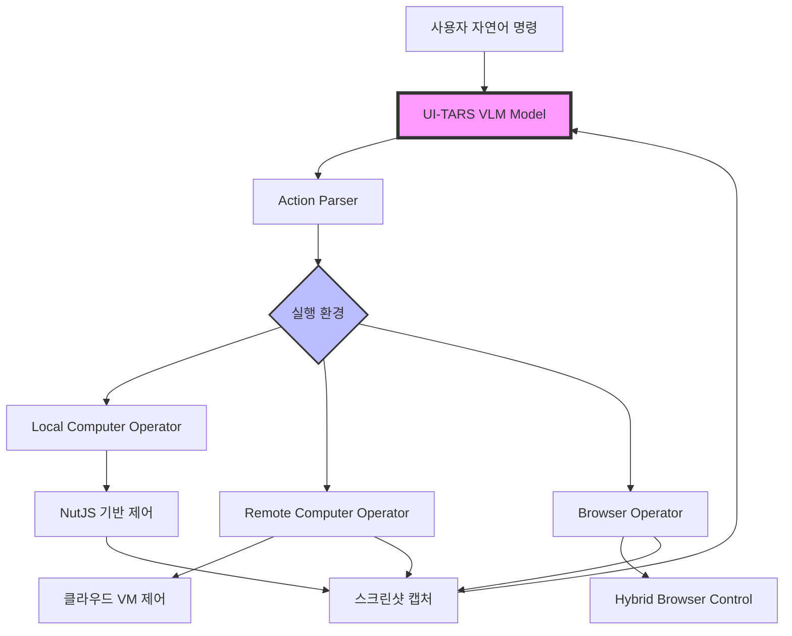

⏱️ **예상 읽기 시간**: 150분

## 서론

**UI-TARS Desktop**은 ByteDance에서 개발한 혁신적인 GUI 자동화 에이전트로, Vision-Language Model(VLM)을 활용하여 자연어 명령으로 컴퓨터와 브라우저를 제어할 수 있는 획기적인 솔루션입니다. 2025년 8월 현재 GitHub에서 **17.3k 스타**를 받으며 GUI 자동화 분야의 새로운 패러다임을 제시하고 있습니다.

본 가이드에서는 UI-TARS Desktop의 아키텍처 분석부터 실제 기업 환경에서의 활용 방안까지 완전히 다루겠습니다.

## UI-TARS 생태계 이해

### 1. Agent TARS vs UI-TARS Desktop 차이점

UI-TARS 프로젝트는 두 가지 주요 솔루션으로 구성됩니다:

| 특징 | Agent TARS | UI-TARS Desktop |
|------|------------|-----------------|
| **배포 방식** | CLI/Web UI 기반 | 네이티브 데스크톱 앱 |
| **타겟 사용자** | 개발자, DevOps 엔지니어 | 일반 사용자, 비즈니스 유저 |
| **핵심 기능** | 터미널 기반 멀티모달 에이전트 | GUI 기반 컴퓨터/브라우저 제어 |
| **MCP 지원** | ✅ 네이티브 지원 | ⚠️ 제한적 지원 |
| **플랫폼** | Node.js 22+ 필요 | Windows/macOS 네이티브 |
| **원격 제어** | 제한적 | ✅ 완전 지원 |

### 2. 핵심 기술 아키텍처



## 프로젝트 구조 심화 분석

### 1. 모노레포 구조 이해


```
UI-TARS-desktop/
├── apps/ui-tars/                    # 메인 데스크톱 애플리케이션
│   ├── src/main/                    # Electron 메인 프로세스
│   │   ├── agent/                   # 에이전트 로직
│   │   ├── services/                # 핵심 서비스
│   │   └── remote/                  # 원격 제어 기능
│   └── src/renderer/                # React 기반 UI
├── multimodal/                      # Agent TARS 생태계
│   ├── agent-tars/                  # CLI 버전
│   ├── gui-agent/                   # GUI 에이전트 코어
│   └── tarko/                       # 내부 라이브러리
└── packages/                        # 공유 패키지
    ├── ui-tars/                     # 코어 SDK
    └── agent-infra/                 # 인프라 컴포넌트
```


### 2. 핵심 컴포넌트 분석

#### Electron 메인 프로세스 (`apps/ui-tars/src/main/`)

```typescript
// agent/operator.ts - 핵심 에이전트 로직
interface AgentOperator {
  screenshot(): Promise<ScreenshotData>;
  execute(action: ParsedAction): Promise<ExecutionResult>;
  getActionSpaces(): string[];
}

// services/runAgent.ts - 에이전트 실행 엔진
class AgentRunner {
  private model: UITarsModel;
  private operator: AgentOperator;
  
  async run(instruction: string): Promise<AgentResult> {
    const screenshots = await this.operator.screenshot();
    const actions = await this.model.predict(instruction, screenshots);
    return await this.operator.execute(actions);
  }
}
```

#### React 렌더러 프로세스 (`apps/ui-tars/src/renderer/`)

```typescript
// components/RunMessages/ - 실시간 메시지 처리
interface MessageComponent {
  type: 'human' | 'gpt' | 'screenshot' | 'action';
  content: string;
  timestamp: number;
  status: 'pending' | 'success' | 'error';
}

// hooks/useRunAgent.ts - 에이전트 상태 관리
const useRunAgent = () => {
  const [status, setStatus] = useState<AgentStatus>('idle');
  const [messages, setMessages] = useState<MessageComponent[]>([]);
  
  const runAgent = async (instruction: string) => {
    // IPC를 통한 메인 프로세스와 통신
  };
};
```

## 설치 및 초기 설정

### 1. 시스템 요구사항

| 항목 | 최소 요구사항 | 권장 사양 |
|------|---------------|-----------|
| **운영체제** | macOS 10.15+ / Windows 10+ | macOS 12+ / Windows 11+ |
| **메모리** | 8GB RAM | 16GB+ RAM |
| **저장공간** | 2GB 여유공간 | 5GB+ 여유공간 |
| **브라우저** | Chrome/Edge/Firefox | Chrome 최신 버전 |
| **Node.js** | v20.0.0+ (Agent TARS CLI용) | v22.0.0+ |

### 2. macOS 설치 및 권한 설정

#### 2.1 Homebrew를 통한 설치

```bash
# Homebrew 설치 (필요시)
/bin/bash -c "$(curl -fsSL https://raw.githubusercontent.com/Homebrew/install/HEAD/install.sh)"

# UI-TARS Desktop 설치
brew install --cask ui-tars

# 설치 확인
ls -la /Applications/ | grep "UI TARS"
```

#### 2.2 수동 설치 및 권한 설정

```bash
# 최신 릴리즈 다운로드
curl -L -o ui-tars-latest.dmg https://github.com/bytedance/UI-TARS-desktop/releases/latest/download/ui-tars-latest.dmg

# DMG 마운트 및 설치
hdiutil attach ui-tars-latest.dmg
cp -R "/Volumes/UI TARS/UI TARS.app" /Applications/
hdiutil detach "/Volumes/UI TARS"
```

#### 2.3 macOS 권한 설정 자동화

```bash
#!/bin/bash
# 파일: setup-uitars-macos.sh

echo "🔐 UI-TARS macOS 권한 설정 시작..."

# Accessibility 권한 확인
if ! osascript -e 'tell application "System Events" to get UI elements of application process "Finder"' >/dev/null 2>&1; then
    echo "❌ Accessibility 권한이 필요합니다."
    echo "시스템 설정 > 개인정보 보호 및 보안 > 손쉬운 사용에서 'UI TARS' 추가"
    open "x-apple.systempreferences:com.apple.preference.security?Privacy_Accessibility"
fi

# Screen Recording 권한 확인
if ! osascript -e 'tell application "System Events" to keystroke "test"' >/dev/null 2>&1; then
    echo "❌ 화면 기록 권한이 필요합니다."
    echo "시스템 설정 > 개인정보 보호 및 보안 > 화면 및 시스템 오디오 기록에서 'UI TARS' 추가"
    open "x-apple.systempreferences:com.apple.preference.security?Privacy_ScreenCapture"
fi

echo "✅ 권한 설정 완료 후 UI TARS를 재시작하세요."
```

### 3. Windows 설치 가이드

```powershell
# PowerShell로 최신 버전 다운로드
$LatestRelease = Invoke-RestMethod -Uri "https://api.github.com/repos/bytedance/UI-TARS-desktop/releases/latest"
$DownloadUrl = $LatestRelease.assets | Where-Object { $_.name -like "*win*" } | Select-Object -First 1 -ExpandProperty browser_download_url

# 다운로드 및 설치
Invoke-WebRequest -Uri $DownloadUrl -OutFile "ui-tars-setup.exe"
Start-Process -FilePath "ui-tars-setup.exe" -Wait

Write-Host "✅ UI-TARS Desktop 설치 완료"
```

## Agent TARS CLI 설치 및 설정

### 1. Node.js 환경 설정

```bash
# Node.js 버전 확인
node --version  # v22.17.1 이상 필요

# Agent TARS CLI 전역 설치
npm install -g @agent-tars/cli@latest

# 설치 확인
agent-tars --version  # v0.2.10
```

### 2. 환경 설정 파일 생성

```yaml
# agent-tars.config.yml
model:
  provider: "anthropic"  # anthropic, openai, volcengine
  id: "claude-3-5-sonnet-20241022"
  apiKey: "${ANTHROPIC_API_KEY}"
  baseURL: "https://api.anthropic.com"

workspace:
  workingDirectory: "./workspace"

browser:
  control: "mixed"  # mixed, browser-use-only, gui-agent-only

planner:
  enable: true

snapshot:
  enable: true
  snapshotPath: "./snapshots"

logLevel: "info"
debug: false
```

### 3. 환경변수 설정

```bash
# ~/.zshrc 또는 ~/.bashrc에 추가
export ANTHROPIC_API_KEY="your-api-key-here"
export OPENAI_API_KEY="your-openai-key-here"
export VOLCENGINE_API_KEY="your-volcengine-key-here"

# Agent TARS 작업 디렉토리
export AGENT_TARS_WORKSPACE="$HOME/agent-tars-workspace"

# 설정 적용
source ~/.zshrc
```

## 모델 설정 및 제공업체별 가이드

### 1. Hugging Face UI-TARS-1.5 설정

#### 1.1 Hugging Face Endpoints 배포

```bash
# Hugging Face CLI 설치
pip install huggingface_hub

# 로그인
huggingface-cli login

# UI-TARS-1.5 모델 정보 확인
huggingface-cli repo info ByteDance-Seed/UI-TARS-1.5-7B
```

#### 1.2 UI-TARS Desktop 설정

```yaml
# UI-TARS Desktop 설정
Language: en
VLM Provider: Hugging Face for UI-TARS-1.5
VLM Base URL: https://your-endpoint.endpoints.huggingface.cloud/v1/
VLM API KEY: hf_xxxxxxxxxxxxx
VLM Model Name: ByteDance-Seed/UI-TARS-1.5-7B
```

### 2. VolcEngine Doubao-1.5-UI-TARS 설정

```yaml
# VolcEngine 설정
Language: cn
VLM Provider: VolcEngine Ark for Doubao-1.5-UI-TARS
VLM Base URL: https://ark.cn-beijing.volces.com/api/v3
VLM API KEY: ARK_API_KEY_xxxxx
VLM Model Name: doubao-1.5-ui-tars-250328
```

### 3. Anthropic Claude 설정 (Agent TARS용)

```bash
# Agent TARS CLI로 Claude 사용
agent-tars --provider anthropic \
  --model claude-3-5-sonnet-20241022 \
  --apiKey your-anthropic-key \
  --stream \
  --thinking.type enabled
```

## 기업별 활용 시나리오

### 1. 소프트웨어 개발 회사

#### 1.1 QA 자동화 시나리오

```yaml
# qa-automation.yml
tasks:
  - name: "웹 애플리케이션 UI 테스트"
    instruction: "Chrome에서 localhost:3000을 열고 로그인 버튼을 클릭한 후 사용자명 'testuser', 비밀번호 'password123'을 입력하여 로그인하세요"
    expected_result: "대시보드 페이지 진입"
    
  - name: "폼 유효성 검사 테스트"
    instruction: "회원가입 페이지에서 잘못된 이메일 형식을 입력하고 에러 메시지가 표시되는지 확인하세요"
    expected_result: "유효한 이메일 형식 에러 표시"
```

#### 1.2 개발 환경 설정 자동화

```typescript
// dev-setup-agent.ts
import { GUIAgent } from '@ui-tars/sdk';
import { NutJSOperator } from '@ui-tars/operator-nut-js';

const setupDevelopmentEnvironment = async () => {
  const agent = new GUIAgent({
    model: {
      baseURL: process.env.MODEL_BASE_URL,
      apiKey: process.env.MODEL_API_KEY,
      model: "ui-tars-1.5-7b"
    },
    operator: new NutJSOperator(),
    onData: ({ data }) => console.log('진행상황:', data.status)
  });

  const tasks = [
    'VS Code를 열고 새 터미널을 시작하세요',
    'git clone https://github.com/our-company/project.git을 실행하세요',
    'npm install을 실행하여 의존성을 설치하세요',
    'npm run dev를 실행하여 개발 서버를 시작하세요'
  ];

  for (const task of tasks) {
    await agent.run(task);
  }
};
```

### 2. 금융 서비스 회사

#### 2.1 규정 준수 모니터링

```yaml
# compliance-monitoring.yml
compliance_checks:
  - name: "데이터 보안 감사"
    instruction: "시스템 보안 설정 페이지를 열고 SSL 인증서 만료일과 암호화 설정을 확인하여 스크린샷을 저장하세요"
    frequency: "daily"
    alert_threshold: "30일 이내 만료"
    
  - name: "거래 한도 검증"
    instruction: "관리자 대시보드에서 일일 거래 한도 설정을 확인하고 규정 한도와 비교하세요"
    frequency: "weekly"
```

#### 2.2 고객 서비스 자동화

```javascript
// customer-service-automation.js
const customerServiceTasks = [
  {
    scenario: "계좌 잔액 조회",
    instruction: "고객 ID 12345의 계좌 관리 시스템에 접속하여 현재 잔액과 최근 거래 내역 3개를 조회하세요",
    security_level: "high"
  },
  {
    scenario: "신용카드 한도 확인",
    instruction: "신용카드 관리 시스템에서 고객의 현재 사용 한도와 가용 한도를 확인하세요",
    security_level: "medium"
  }
];

// 보안 강화 설정
const secureAgent = new GUIAgent({
  model: { /* 모델 설정 */ },
  operator: new SecureOperator({
    encryptScreenshots: true,
    logLevel: 'audit',
    complianceMode: true
  }),
  maxLoopCount: 10, // 보안상 제한
  onError: (error) => auditLogger.log(error)
});
```

### 3. 전자상거래 회사

#### 3.1 상품 관리 자동화

```yaml
# product-management.yml
product_tasks:
  - name: "재고 업데이트"
    instruction: "상품 관리 시스템에 로그인하여 재고가 10개 이하인 상품을 필터링하고 공급업체에 발주 요청 이메일을 보내세요"
    schedule: "0 9 * * *"  # 매일 오전 9시
    
  - name: "가격 모니터링"
    instruction: "경쟁사 웹사이트 3곳을 방문하여 주요 상품 가격을 확인하고 스프레드시트에 기록하세요"
    schedule: "0 */6 * * *"  # 6시간마다
```

#### 3.2 마케팅 캠페인 관리

```typescript
// marketing-automation.ts
const marketingAgent = async () => {
  const campaigns = [
    {
      platform: "Facebook Ads",
      task: "페이스북 광고 관리자에서 어제 캠페인 성과를 확인하고 CTR이 2% 이하인 광고를 일시정지하세요"
    },
    {
      platform: "Google Ads",
      task: "구글 광고에서 키워드별 품질 점수를 확인하고 6점 이하인 키워드를 개선하세요"
    },
    {
      platform: "Instagram",
      task: "인스타그램 비즈니스 계정에서 새 게시물을 업로드하고 해시태그를 추가하세요"
    }
  ];

  for (const campaign of campaigns) {
    await agent.run(campaign.task);
    // 결과 로깅 및 리포팅
  }
};
```

### 4. 헬스케어 회사

#### 4.1 환자 데이터 관리

```yaml
# healthcare-automation.yml
patient_management:
  - name: "일일 검진 스케줄 확인"
    instruction: "병원 관리 시스템에서 오늘 예정된 검진 목록을 확인하고 환자별 준비사항을 체크하세요"
    compliance: "HIPAA"
    encryption: "AES-256"
    
  - name: "의료진 스케줄 조정"
    instruction: "의료진 관리 시스템에서 응급상황 발생 시 대체 인력 배치 계획을 수립하세요"
    priority: "high"
```

#### 4.2 의료기기 모니터링

```javascript
// medical-device-monitoring.js
const deviceMonitoring = {
  tasks: [
    "의료기기 관리 시스템에서 모든 장비의 상태를 확인하고 이상 징후가 있는 장비를 리포트하세요",
    "정기 점검 일정을 확인하고 7일 이내 점검 예정인 장비 목록을 작성하세요",
    "소모품 재고를 확인하고 부족한 항목에 대해 주문 요청을 생성하세요"
  ],
  compliance_standards: ["FDA", "CE", "ISO 13485"],
  audit_trail: true
};
```

### 5. 교육 기관

#### 5.1 온라인 강의 관리

```yaml
# education-automation.yml
course_management:
  - name: "출석 체크 자동화"
    instruction: "LMS 시스템에서 오늘 강의 출석률을 확인하고 70% 이하인 강의에 대해 알림을 보내세요"
    
  - name: "과제 제출 현황 확인"
    instruction: "과제 관리 시스템에서 제출 기한이 지난 과제를 확인하고 미제출 학생에게 독려 메시지를 보내세요"
    
  - name: "성적 처리 자동화"
    instruction: "시험 결과를 확인하고 평점을 계산하여 성적표를 생성하세요"
```

## 실제 테스트 시나리오

### 1. 로컬 컴퓨터 제어 테스트

```bash
# 테스트 환경 설정
mkdir -p ~/ui-tars-test
cd ~/ui-tars-test

# 테스트 스크립트 생성
cat > test-local-control.sh << 'EOF'
#!/bin/bash

echo "🧪 UI-TARS 로컬 제어 테스트 시작..."

# 1. 기본 데스크톱 제어 테스트
echo "1️⃣ 데스크톱 제어 테스트"
osascript -e 'tell application "UI TARS" to activate'
sleep 2

# 2. 브라우저 제어 테스트
echo "2️⃣ 브라우저 제어 테스트"
open -a "Google Chrome" "https://example.com"
sleep 3

# 3. 애플리케이션 제어 테스트
echo "3️⃣ 애플리케이션 제어 테스트"
open -a "Calculator"
sleep 2

echo "✅ 테스트 환경 준비 완료"
EOF

chmod +x test-local-control.sh
./test-local-control.sh
```

### 2. Agent TARS CLI 기능 테스트

```bash
# Agent TARS CLI 기능 테스트
mkdir -p ~/agent-tars-test
cd ~/agent-tars-test

# 설정 파일 생성
cat > agent-tars.config.yml << 'EOF'
model:
  provider: "anthropic"
  id: "claude-3-5-sonnet-20241022"
  apiKey: "${ANTHROPIC_API_KEY}"

workspace:
  workingDirectory: "./workspace"

browser:
  control: "mixed"

logLevel: "info"
EOF

# 워크스페이스 초기화
agent-tars workspace init

# 기본 테스트 실행
echo "📋 Agent TARS 기본 기능 테스트"
agent-tars request --prompt "현재 시간을 알려주세요"

# 브라우저 제어 테스트 (실제 API 키가 있을 때)
if [ ! -z "$ANTHROPIC_API_KEY" ]; then
    echo "🌐 브라우저 제어 테스트"
    agent-tars run "Chrome을 열고 google.com을 방문하세요"
fi
```

### 3. 통합 테스트 시나리오

```python
#!/usr/bin/env python3
# test-integration.py

import subprocess
import time
import json
from pathlib import Path

class UITarsTestSuite:
    def __init__(self):
        self.test_results = []
        self.workspace = Path.home() / "ui-tars-test"
        self.workspace.mkdir(exist_ok=True)
    
    def test_desktop_app_launch(self):
        """데스크톱 앱 시작 테스트"""
        print("🚀 UI-TARS Desktop 앱 시작 테스트...")
        try:
            # macOS에서 앱 실행 확인
            result = subprocess.run([
                "osascript", "-e", 
                'tell application "System Events" to exists application process "UI TARS"'
            ], capture_output=True, text=True)
            
            success = "true" in result.stdout
            self.test_results.append({
                "test": "desktop_app_launch",
                "success": success,
                "message": "앱 실행 성공" if success else "앱 실행 실패"
            })
        except Exception as e:
            self.test_results.append({
                "test": "desktop_app_launch",
                "success": False,
                "error": str(e)
            })
    
    def test_agent_cli_installation(self):
        """Agent TARS CLI 설치 테스트"""
        print("📦 Agent TARS CLI 설치 테스트...")
        try:
            result = subprocess.run(["agent-tars", "--version"], 
                                  capture_output=True, text=True)
            success = result.returncode == 0
            version = result.stdout.strip() if success else "설치되지 않음"
            
            self.test_results.append({
                "test": "agent_cli_installation",
                "success": success,
                "version": version
            })
        except Exception as e:
            self.test_results.append({
                "test": "agent_cli_installation", 
                "success": False,
                "error": str(e)
            })
    
    def test_node_version(self):
        """Node.js 버전 테스트"""
        print("🟢 Node.js 버전 테스트...")
        try:
            result = subprocess.run(["node", "--version"], 
                                  capture_output=True, text=True)
            version = result.stdout.strip()
            major_version = int(version.split('.')[0][1:])  # v22.17.1 -> 22
            
            success = major_version >= 20
            self.test_results.append({
                "test": "node_version",
                "success": success,
                "version": version,
                "requirement": ">=20.0.0"
            })
        except Exception as e:
            self.test_results.append({
                "test": "node_version",
                "success": False,
                "error": str(e)
            })
    
    def generate_report(self):
        """테스트 리포트 생성"""
        print("\n📊 테스트 결과 리포트")
        print("=" * 50)
        
        passed = sum(1 for test in self.test_results if test.get("success", False))
        total = len(self.test_results)
        
        for test in self.test_results:
            status = "✅ PASS" if test.get("success", False) else "❌ FAIL"
            print(f"{status} {test['test']}")
            if "version" in test:
                print(f"    버전: {test['version']}")
            if "error" in test:
                print(f"    오류: {test['error']}")
        
        print(f"\n📈 전체 결과: {passed}/{total} 테스트 통과")
        
        # JSON 리포트 저장
        report_file = self.workspace / "test-report.json"
        with open(report_file, 'w', encoding='utf-8') as f:
            json.dump(self.test_results, f, indent=2, ensure_ascii=False)
        
        print(f"📄 상세 리포트: {report_file}")

if __name__ == "__main__":
    test_suite = UITarsTestSuite()
    test_suite.test_node_version()
    test_suite.test_agent_cli_installation()
    test_suite.test_desktop_app_launch()
    test_suite.generate_report()
```

## 고급 활용 및 커스터마이징

### 1. 커스텀 오퍼레이터 개발

```typescript
// custom-operator.ts
import { Operator, ScreenshotOutput, ExecuteParams } from '@ui-tars/sdk/core';

export class CustomBusinessOperator extends Operator {
  static MANUAL = {
    ACTION_SPACES: [
      'click(start_box="") # 지정된 좌표의 요소를 클릭',
      'type(content="") # 현재 입력 필드에 지정된 내용 입력',
      'erp_login(username="", password="") # ERP 시스템 로그인',
      'generate_report(type="", date_range="") # 보고서 생성',
      'finished() # 작업 완료'
    ],
  };

  async screenshot(): Promise<ScreenshotOutput> {
    // 커스텀 스크린샷 로직
    const screenshot = await this.captureScreen();
    return {
      base64: screenshot.toBase64(),
      scaleFactor: screenshot.getScaleFactor()
    };
  }

  async execute(params: ExecuteParams): Promise<any> {
    const { parsedPrediction } = params;
    
    switch (parsedPrediction.action_type) {
      case 'erp_login':
        return await this.handleERPLogin(parsedPrediction.action_inputs);
      
      case 'generate_report':
        return await this.handleReportGeneration(parsedPrediction.action_inputs);
      
      case 'finished':
        return { status: 'END' };
      
      default:
        return await super.execute(params);
    }
  }

  private async handleERPLogin(inputs: any) {
    // ERP 시스템별 로그인 로직
    console.log(`ERP 로그인: ${inputs.username}`);
    // 실제 로그인 구현
  }

  private async handleReportGeneration(inputs: any) {
    // 보고서 생성 로직
    console.log(`보고서 생성: ${inputs.type}, 기간: ${inputs.date_range}`);
    // 실제 보고서 생성 구현
  }
}
```

### 2. 기업용 보안 강화 설정

```typescript
// enterprise-security.ts
import { GUIAgent } from '@ui-tars/sdk';
import { createHash, createCipher } from 'crypto';

class SecureUITarsAgent extends GUIAgent {
  private auditLog: AuditEntry[] = [];
  private encryptionKey: string;

  constructor(config: any) {
    super({
      ...config,
      onData: (data) => this.handleSecureData(data),
      onError: (error) => this.handleSecureError(error)
    });
    
    this.encryptionKey = process.env.UITARS_ENCRYPTION_KEY || 'default-key';
  }

  private handleSecureData(data: any) {
    // 모든 활동 로깅
    this.auditLog.push({
      timestamp: new Date().toISOString(),
      action: data.action,
      user: process.env.USER,
      hash: createHash('sha256').update(JSON.stringify(data)).digest('hex')
    });

    // 스크린샷 암호화
    if (data.screenshot) {
      data.screenshot = this.encryptData(data.screenshot);
    }

    // 원본 핸들러 호출
    this.config.onData?.(data);
  }

  private encryptData(data: string): string {
    const cipher = createCipher('aes-256-cbc', this.encryptionKey);
    let encrypted = cipher.update(data, 'utf8', 'hex');
    encrypted += cipher.final('hex');
    return encrypted;
  }

  public exportAuditLog(): string {
    return JSON.stringify(this.auditLog, null, 2);
  }
}

interface AuditEntry {
  timestamp: string;
  action: any;
  user: string;
  hash: string;
}
```

### 3. 멀티 에이전트 워크플로우

```typescript
// multi-agent-workflow.ts
class MultiAgentWorkflow {
  private agents: Map<string, GUIAgent> = new Map();

  constructor() {
    this.setupAgents();
  }

  private setupAgents() {
    // 데이터 수집 에이전트
    this.agents.set('collector', new GUIAgent({
      model: { /* 설정 */ },
      operator: new WebScrapingOperator(),
      systemPrompt: "당신은 웹에서 데이터를 수집하는 전문 에이전트입니다."
    }));

    // 데이터 처리 에이전트
    this.agents.set('processor', new GUIAgent({
      model: { /* 설정 */ },
      operator: new SpreadsheetOperator(),
      systemPrompt: "당신은 수집된 데이터를 분석하고 처리하는 전문 에이전트입니다."
    }));

    // 보고서 생성 에이전트
    this.agents.set('reporter', new GUIAgent({
      model: { /* 설정 */ },
      operator: new DocumentOperator(),
      systemPrompt: "당신은 분석 결과를 바탕으로 보고서를 작성하는 전문 에이전트입니다."
    }));
  }

  async executeWorkflow(task: WorkflowTask) {
    const results: WorkflowResult[] = [];

    // 1단계: 데이터 수집
    console.log('📊 1단계: 데이터 수집 시작');
    const collectionResult = await this.agents.get('collector')!.run(task.collectionInstruction);
    results.push({ step: 'collection', result: collectionResult });

    // 2단계: 데이터 처리
    console.log('⚙️ 2단계: 데이터 처리 시작');
    const processingResult = await this.agents.get('processor')!.run(task.processingInstruction);
    results.push({ step: 'processing', result: processingResult });

    // 3단계: 보고서 생성
    console.log('📝 3단계: 보고서 생성 시작');
    const reportResult = await this.agents.get('reporter')!.run(task.reportInstruction);
    results.push({ step: 'reporting', result: reportResult });

    return results;
  }
}

interface WorkflowTask {
  collectionInstruction: string;
  processingInstruction: string;
  reportInstruction: string;
}

interface WorkflowResult {
  step: string;
  result: any;
}
```

## 성능 최적화 및 모니터링

### 1. 성능 모니터링 대시보드

```typescript
// performance-monitor.ts
class UITarsPerformanceMonitor {
  private metrics: PerformanceMetric[] = [];
  private startTime: number = 0;

  startMonitoring() {
    this.startTime = Date.now();
    
    // 메모리 사용량 모니터링
    setInterval(() => {
      const usage = process.memoryUsage();
      this.recordMetric('memory', {
        rss: usage.rss / 1024 / 1024, // MB
        heapUsed: usage.heapUsed / 1024 / 1024,
        heapTotal: usage.heapTotal / 1024 / 1024
      });
    }, 5000);

    // CPU 사용량 모니터링
    setInterval(() => {
      const cpuUsage = process.cpuUsage();
      this.recordMetric('cpu', {
        user: cpuUsage.user / 1000000, // seconds
        system: cpuUsage.system / 1000000
      });
    }, 5000);
  }

  recordMetric(type: string, data: any) {
    this.metrics.push({
      timestamp: Date.now(),
      type,
      data,
      uptime: Date.now() - this.startTime
    });

    // 메트릭 개수 제한 (메모리 절약)
    if (this.metrics.length > 1000) {
      this.metrics.splice(0, 500);
    }
  }

  generateReport(): PerformanceReport {
    const memoryMetrics = this.metrics.filter(m => m.type === 'memory');
    const cpuMetrics = this.metrics.filter(m => m.type === 'cpu');

    return {
      period: {
        start: this.startTime,
        end: Date.now(),
        duration: Date.now() - this.startTime
      },
      memory: {
        average: this.calculateAverage(memoryMetrics, 'heapUsed'),
        peak: Math.max(...memoryMetrics.map(m => m.data.heapUsed)),
        current: memoryMetrics[memoryMetrics.length - 1]?.data.heapUsed || 0
      },
      cpu: {
        average: this.calculateAverage(cpuMetrics, 'user'),
        peak: Math.max(...cpuMetrics.map(m => m.data.user))
      },
      recommendations: this.generateRecommendations()
    };
  }

  private calculateAverage(metrics: PerformanceMetric[], field: string): number {
    if (metrics.length === 0) return 0;
    const sum = metrics.reduce((acc, metric) => acc + metric.data[field], 0);
    return sum / metrics.length;
  }

  private generateRecommendations(): string[] {
    const recommendations: string[] = [];
    const latestMemory = this.metrics.filter(m => m.type === 'memory').slice(-10);
    
    if (latestMemory.length > 0) {
      const avgMemory = this.calculateAverage(latestMemory, 'heapUsed');
      if (avgMemory > 512) {
        recommendations.push('메모리 사용량이 높습니다. 에이전트 인스턴스 수를 줄이는 것을 고려하세요.');
      }
      if (avgMemory > 1024) {
        recommendations.push('심각한 메모리 부족 상황입니다. 시스템 재시작을 권장합니다.');
      }
    }

    return recommendations;
  }
}

interface PerformanceMetric {
  timestamp: number;
  type: string;
  data: any;
  uptime: number;
}

interface PerformanceReport {
  period: { start: number; end: number; duration: number };
  memory: { average: number; peak: number; current: number };
  cpu: { average: number; peak: number };
  recommendations: string[];
}
```

### 2. 자동 스케일링 시스템

```bash
#!/bin/bash
# auto-scaling.sh

# 시스템 리소스 모니터링 및 자동 스케일링

check_system_resources() {
    # CPU 사용률 확인
    CPU_USAGE=$(top -l 1 | grep "CPU usage" | awk '{print $3}' | sed 's/%//')
    
    # 메모리 사용률 확인
    MEMORY_USAGE=$(vm_stat | perl -ne '/page size of (\d+)/ and $size=$1; /Pages\s+([^:]+)[^\d]+(\d+)/ and printf("%-16s % 16.2f MB\n", "$1:", $2 * $size / 1048576);' | grep "free:" | awk '{print $2}')
    
    # UI-TARS 프로세스 개수 확인
    UITARS_PROCESSES=$(pgrep -f "UI TARS" | wc -l)
    
    echo "💻 시스템 상태:"
    echo "   CPU 사용률: ${CPU_USAGE}%"
    echo "   사용 가능 메모리: ${MEMORY_USAGE}MB"
    echo "   UI-TARS 프로세스: ${UITARS_PROCESSES}개"
    
    # 스케일링 결정
    if (( $(echo "${CPU_USAGE} > 80" | bc -l) )); then
        echo "⚠️ CPU 사용률 높음 - 에이전트 수 감소 권장"
        scale_down_agents
    elif (( $(echo "${CPU_USAGE} < 30" | bc -l) && $(echo "${MEMORY_USAGE} > 2048" | bc -l) )); then
        echo "📈 리소스 여유 - 에이전트 수 증가 가능"
        scale_up_agents
    fi
}

scale_down_agents() {
    echo "📉 에이전트 스케일 다운 실행..."
    # 가장 오래된 에이전트 프로세스 종료
    OLDEST_PID=$(pgrep -f "agent-tars" | head -1)
    if [ ! -z "$OLDEST_PID" ]; then
        kill -TERM $OLDEST_PID
        echo "   프로세스 $OLDEST_PID 종료"
    fi
}

scale_up_agents() {
    echo "📈 에이전트 스케일 업 실행..."
    # 새 에이전트 인스턴스 시작
    nohup agent-tars serve --port 8889 > /dev/null 2>&1 &
    echo "   새 에이전트 인스턴스 시작 (포트 8889)"
}

# 메인 모니터링 루프
while true; do
    check_system_resources
    sleep 30  # 30초마다 확인
done
```

## 문제 해결 및 디버깅

### 1. 일반적인 문제 해결

#### 1.1 macOS 권한 문제

```bash
#!/bin/bash
# fix-macos-permissions.sh

echo "🔧 macOS 권한 문제 해결 시작..."

# 1. Accessibility 권한 확인
echo "1️⃣ Accessibility 권한 확인..."
if ! osascript -e 'tell application "System Events" to get UI elements of application process "Finder"' >/dev/null 2>&1; then
    echo "❌ Accessibility 권한 필요"
    echo "해결방법:"
    echo "   시스템 설정 > 개인정보 보호 및 보안 > 손쉬운 사용"
    echo "   'UI TARS' 추가 후 체크박스 활성화"
    open "x-apple.systempreferences:com.apple.preference.security?Privacy_Accessibility"
else
    echo "✅ Accessibility 권한 정상"
fi

# 2. Screen Recording 권한 확인
echo "2️⃣ Screen Recording 권한 확인..."
screencapture -T 1 /tmp/test_screenshot.png 2>/dev/null
if [ $? -eq 0 ]; then
    echo "✅ Screen Recording 권한 정상"
    rm -f /tmp/test_screenshot.png
else
    echo "❌ Screen Recording 권한 필요"
    echo "해결방법:"
    echo "   시스템 설정 > 개인정보 보호 및 보안 > 화면 및 시스템 오디오 기록"
    echo "   'UI TARS' 추가 후 체크박스 활성화"
    open "x-apple.systempreferences:com.apple.preference.security?Privacy_ScreenCapture"
fi

# 3. Full Disk Access 권한 확인 (필요시)
echo "3️⃣ Full Disk Access 권한 확인..."
if [ -r "$HOME/Desktop" ]; then
    echo "✅ 기본 접근 권한 정상"
else
    echo "⚠️ Full Disk Access 권한이 필요할 수 있습니다"
    echo "해결방법:"
    echo "   시스템 설정 > 개인정보 보호 및 보안 > 전체 디스크 접근 권한"
    echo "   'UI TARS' 추가 (선택사항)"
fi

echo "🔧 권한 확인 완료"
```

#### 1.2 Windows 권한 및 보안 설정

```powershell
# fix-windows-permissions.ps1

Write-Host "🔧 Windows 권한 및 보안 설정 확인..." -ForegroundColor Cyan

# 1. 관리자 권한 확인
$currentUser = [Security.Principal.WindowsIdentity]::GetCurrent()
$principal = New-Object Security.Principal.WindowsPrincipal($currentUser)
$isAdmin = $principal.IsInRole([Security.Principal.WindowsBuiltInRole]::Administrator)

if ($isAdmin) {
    Write-Host "✅ 관리자 권한으로 실행 중" -ForegroundColor Green
} else {
    Write-Host "❌ 관리자 권한 필요" -ForegroundColor Red
    Write-Host "해결방법: PowerShell을 관리자 권한으로 실행하세요" -ForegroundColor Yellow
    exit 1
}

# 2. Windows Defender 예외 설정
Write-Host "2️⃣ Windows Defender 예외 설정 확인..." -ForegroundColor Cyan

$uitarsPath = "$env:LOCALAPPDATA\Programs\ui-tars"
$exclusions = Get-MpPreference | Select-Object -ExpandProperty ExclusionPath

if ($exclusions -contains $uitarsPath) {
    Write-Host "✅ Windows Defender 예외 설정 완료" -ForegroundColor Green
} else {
    Write-Host "⚠️ Windows Defender 예외 설정 추가..." -ForegroundColor Yellow
    try {
        Add-MpPreference -ExclusionPath $uitarsPath
        Write-Host "✅ Windows Defender 예외 설정 완료" -ForegroundColor Green
    } catch {
        Write-Host "❌ Windows Defender 예외 설정 실패: $_" -ForegroundColor Red
    }
}

# 3. 방화벽 설정 확인
Write-Host "3️⃣ 방화벽 설정 확인..." -ForegroundColor Cyan

$firewallRules = Get-NetFirewallRule -DisplayName "*UI-TARS*" -ErrorAction SilentlyContinue

if ($firewallRules) {
    Write-Host "✅ 방화벽 규칙 존재" -ForegroundColor Green
} else {
    Write-Host "⚠️ 방화벽 규칙 추가..." -ForegroundColor Yellow
    try {
        New-NetFirewallRule -DisplayName "UI-TARS Desktop" -Direction Inbound -Program "$uitarsPath\UI-TARS.exe" -Action Allow
        Write-Host "✅ 방화벽 규칙 추가 완료" -ForegroundColor Green
    } catch {
        Write-Host "❌ 방화벽 규칙 추가 실패: $_" -ForegroundColor Red
    }
}

Write-Host "🔧 Windows 설정 확인 완료" -ForegroundColor Cyan
```

### 2. 디버깅 도구

```typescript
// debug-utils.ts
export class UITarsDebugger {
  private logLevel: 'debug' | 'info' | 'warn' | 'error' = 'info';
  private logBuffer: LogEntry[] = [];

  constructor(logLevel?: string) {
    this.logLevel = (logLevel as any) || 'info';
  }

  log(level: string, message: string, data?: any) {
    const entry: LogEntry = {
      timestamp: new Date().toISOString(),
      level,
      message,
      data,
      stack: new Error().stack
    };

    this.logBuffer.push(entry);
    
    // 콘솔 출력
    if (this.shouldLog(level)) {
      console.log(`[${entry.timestamp}] ${level.toUpperCase()}: ${message}`);
      if (data) {
        console.log(JSON.stringify(data, null, 2));
      }
    }

    // 로그 버퍼 크기 제한
    if (this.logBuffer.length > 1000) {
      this.logBuffer.splice(0, 500);
    }
  }

  private shouldLog(level: string): boolean {
    const levels = ['debug', 'info', 'warn', 'error'];
    const currentLevelIndex = levels.indexOf(this.logLevel);
    const messageLevelIndex = levels.indexOf(level);
    return messageLevelIndex >= currentLevelIndex;
  }

  exportLogs(): string {
    return JSON.stringify(this.logBuffer, null, 2);
  }

  saveLogs(filename: string) {
    const fs = require('fs');
    fs.writeFileSync(filename, this.exportLogs());
    console.log(`로그 저장 완료: ${filename}`);
  }

  // 성능 측정 도구
  time(label: string) {
    console.time(label);
  }

  timeEnd(label: string) {
    console.timeEnd(label);
  }

  // 메모리 사용량 추적
  memoryUsage(): any {
    const usage = process.memoryUsage();
    return {
      rss: Math.round(usage.rss / 1024 / 1024 * 100) / 100,
      heapUsed: Math.round(usage.heapUsed / 1024 / 1024 * 100) / 100,
      heapTotal: Math.round(usage.heapTotal / 1024 / 1024 * 100) / 100,
      external: Math.round(usage.external / 1024 / 1024 * 100) / 100
    };
  }
}

interface LogEntry {
  timestamp: string;
  level: string;
  message: string;
  data?: any;
  stack?: string;
}

// 사용 예시
const debugger = new UITarsDebugger('debug');

// 에이전트 실행 전
debugger.log('info', '에이전트 시작', { 
  config: 'production',
  memory: debugger.memoryUsage()
});

debugger.time('agent-execution');

// 에이전트 실행 중
debugger.log('debug', '스크린샷 캡처 완료', { 
  size: '1920x1080',
  format: 'base64'
});

// 에이전트 실행 후
debugger.timeEnd('agent-execution');
debugger.log('info', '에이전트 완료', {
  memory: debugger.memoryUsage()
});

// 로그 저장
debugger.saveLogs(`uitars-debug-${Date.now()}.json`);
```

## 운영 및 유지보수

### 1. 자동 업데이트 시스템

```bash
#!/bin/bash
# auto-update.sh

CURRENT_VERSION=""
LATEST_VERSION=""
UPDATE_AVAILABLE=false

check_current_version() {
    echo "📋 현재 버전 확인 중..."
    
    # UI-TARS Desktop 버전
    if [ -f "/Applications/UI TARS.app/Contents/Info.plist" ]; then
        CURRENT_VERSION=$(defaults read "/Applications/UI TARS.app/Contents/Info.plist" CFBundleShortVersionString)
        echo "   UI-TARS Desktop: v$CURRENT_VERSION"
    fi
    
    # Agent TARS CLI 버전
    if command -v agent-tars >/dev/null 2>&1; then
        CLI_VERSION=$(agent-tars --version 2>/dev/null | grep -o '[0-9]\+\.[0-9]\+\.[0-9]\+')
        echo "   Agent TARS CLI: v$CLI_VERSION"
    fi
}

check_latest_version() {
    echo "🔍 최신 버전 확인 중..."
    
    # GitHub API에서 최신 릴리즈 확인
    LATEST_VERSION=$(curl -s https://api.github.com/repos/bytedance/UI-TARS-desktop/releases/latest | jq -r '.tag_name' | sed 's/^v//')
    
    if [ "$LATEST_VERSION" != "null" ] && [ ! -z "$LATEST_VERSION" ]; then
        echo "   최신 버전: v$LATEST_VERSION"
        
        if [ "$CURRENT_VERSION" != "$LATEST_VERSION" ]; then
            UPDATE_AVAILABLE=true
            echo "🆕 업데이트 사용 가능!"
        else
            echo "✅ 최신 버전 사용 중"
        fi
    else
        echo "❌ 최신 버전 확인 실패"
    fi
}

update_application() {
    if [ "$UPDATE_AVAILABLE" = true ]; then
        echo "📥 업데이트 다운로드 중..."
        
        # 백업 생성
        BACKUP_DIR="$HOME/ui-tars-backup-$(date +%Y%m%d-%H%M%S)"
        mkdir -p "$BACKUP_DIR"
        
        if [ -d "/Applications/UI TARS.app" ]; then
            cp -R "/Applications/UI TARS.app" "$BACKUP_DIR/"
            echo "   백업 생성: $BACKUP_DIR"
        fi
        
        # 최신 버전 다운로드
        DOWNLOAD_URL=$(curl -s https://api.github.com/repos/bytedance/UI-TARS-desktop/releases/latest | jq -r '.assets[] | select(.name | contains("mac")) | .browser_download_url')
        
        if [ ! -z "$DOWNLOAD_URL" ]; then
            curl -L -o "/tmp/ui-tars-latest.dmg" "$DOWNLOAD_URL"
            echo "✅ 다운로드 완료"
            
            # 자동 설치 (사용자 확인 필요)
            echo "🔄 설치 중..."
            hdiutil attach "/tmp/ui-tars-latest.dmg" -quiet
            cp -R "/Volumes/UI TARS/UI TARS.app" /Applications/
            hdiutil detach "/Volumes/UI TARS" -quiet
            rm "/tmp/ui-tars-latest.dmg"
            
            echo "✅ 업데이트 완료!"
            echo "🔄 애플리케이션을 재시작하세요."
        else
            echo "❌ 다운로드 URL을 찾을 수 없습니다."
        fi
    fi
}

# Agent TARS CLI 업데이트
update_cli() {
    echo "📦 Agent TARS CLI 업데이트 확인 중..."
    
    npm update -g @agent-tars/cli@latest
    
    NEW_CLI_VERSION=$(agent-tars --version 2>/dev/null | grep -o '[0-9]\+\.[0-9]\+\.[0-9]\+')
    echo "✅ Agent TARS CLI 업데이트 완료: v$NEW_CLI_VERSION"
}

# 메인 실행
main() {
    echo "🔄 UI-TARS 자동 업데이트 시작..."
    
    check_current_version
    check_latest_version
    
    if [ "$UPDATE_AVAILABLE" = true ]; then
        read -p "업데이트를 진행하시겠습니까? (y/N): " -n 1 -r
        echo
        if [[ $REPLY =~ ^[Yy]$ ]]; then
            update_application
        fi
    fi
    
    update_cli
    
    echo "🏁 자동 업데이트 완료"
}

main "$@"
```

### 2. 백업 및 복구 시스템

```python
#!/usr/bin/env python3
# backup-restore.py

import os
import json
import shutil
import tarfile
from datetime import datetime
from pathlib import Path

class UITarsBackupManager:
    def __init__(self):
        self.backup_dir = Path.home() / "ui-tars-backups"
        self.backup_dir.mkdir(exist_ok=True)
        
        self.config_paths = [
            Path.home() / ".config" / "ui-tars",
            Path.home() / "Library" / "Application Support" / "UI TARS",  # macOS
            Path.home() / "AppData" / "Roaming" / "ui-tars",  # Windows
        ]
        
        self.workspace_paths = [
            Path.home() / "agent-tars-workspace",
            Path.cwd() / "workspace"
        ]

    def create_backup(self, backup_name: str = None) -> str:
        """백업 생성"""
        if not backup_name:
            backup_name = f"uitars-backup-{datetime.now().strftime('%Y%m%d-%H%M%S')}"
        
        backup_path = self.backup_dir / f"{backup_name}.tar.gz"
        
        print(f"📦 백업 생성 중: {backup_path}")
        
        with tarfile.open(backup_path, 'w:gz') as tar:
            # 설정 파일 백업
            for config_path in self.config_paths:
                if config_path.exists():
                    print(f"   설정 백업: {config_path}")
                    tar.add(config_path, arcname=f"config/{config_path.name}")
            
            # 워크스페이스 백업
            for workspace_path in self.workspace_paths:
                if workspace_path.exists():
                    print(f"   워크스페이스 백업: {workspace_path}")
                    tar.add(workspace_path, arcname=f"workspace/{workspace_path.name}")
            
            # 메타데이터 생성
            metadata = {
                "backup_name": backup_name,
                "created_at": datetime.now().isoformat(),
                "version": self.get_current_version(),
                "platform": os.name,
                "config_paths": [str(p) for p in self.config_paths if p.exists()],
                "workspace_paths": [str(p) for p in self.workspace_paths if p.exists()]
            }
            
            metadata_json = json.dumps(metadata, indent=2).encode('utf-8')
            info = tarfile.TarInfo(name='metadata.json')
            info.size = len(metadata_json)
            tar.addfile(info, fileobj=io.BytesIO(metadata_json))
        
        print(f"✅ 백업 완료: {backup_path}")
        return str(backup_path)

    def list_backups(self) -> list:
        """백업 목록 조회"""
        backups = []
        for backup_file in self.backup_dir.glob("*.tar.gz"):
            try:
                with tarfile.open(backup_file, 'r:gz') as tar:
                    if 'metadata.json' in tar.getnames():
                        metadata_file = tar.extractfile('metadata.json')
                        if metadata_file:
                            metadata = json.loads(metadata_file.read().decode('utf-8'))
                            backups.append({
                                "file": str(backup_file),
                                "name": metadata.get("backup_name", backup_file.stem),
                                "created_at": metadata.get("created_at"),
                                "version": metadata.get("version"),
                                "size": backup_file.stat().st_size
                            })
            except Exception as e:
                print(f"⚠️ 백업 파일 읽기 오류 {backup_file}: {e}")
        
        return sorted(backups, key=lambda x: x["created_at"], reverse=True)

    def restore_backup(self, backup_path: str, restore_config: bool = True, restore_workspace: bool = True):
        """백업 복구"""
        backup_file = Path(backup_path)
        if not backup_file.exists():
            raise FileNotFoundError(f"백업 파일을 찾을 수 없습니다: {backup_path}")
        
        print(f"🔄 백업 복구 중: {backup_file}")
        
        # 현재 설정 백업 (복구 전)
        current_backup = self.create_backup(f"pre-restore-{datetime.now().strftime('%Y%m%d-%H%M%S')}")
        print(f"   현재 설정 백업: {current_backup}")
        
        with tarfile.open(backup_file, 'r:gz') as tar:
            # 메타데이터 확인
            if 'metadata.json' in tar.getnames():
                metadata_file = tar.extractfile('metadata.json')
                if metadata_file:
                    metadata = json.loads(metadata_file.read().decode('utf-8'))
                    print(f"   백업 정보: {metadata.get('backup_name')} ({metadata.get('created_at')})")
            
            # 설정 복구
            if restore_config:
                config_members = [m for m in tar.getmembers() if m.name.startswith('config/')]
                for member in config_members:
                    print(f"   설정 복구: {member.name}")
                    # 실제 복구 로직 구현
            
            # 워크스페이스 복구
            if restore_workspace:
                workspace_members = [m for m in tar.getmembers() if m.name.startswith('workspace/')]
                for member in workspace_members:
                    print(f"   워크스페이스 복구: {member.name}")
                    # 실제 복구 로직 구현
        
        print("✅ 백업 복구 완료")

    def get_current_version(self) -> str:
        """현재 버전 확인"""
        try:
            import subprocess
            result = subprocess.run(['agent-tars', '--version'], 
                                  capture_output=True, text=True)
            if result.returncode == 0:
                return result.stdout.strip()
        except:
            pass
        return "unknown"

    def cleanup_old_backups(self, keep_count: int = 10):
        """오래된 백업 정리"""
        backups = self.list_backups()
        if len(backups) > keep_count:
            for backup in backups[keep_count:]:
                backup_file = Path(backup["file"])
                print(f"🗑️ 오래된 백업 삭제: {backup_file.name}")
                backup_file.unlink()

if __name__ == "__main__":
    import sys
    import io
    
    backup_manager = UITarsBackupManager()
    
    if len(sys.argv) < 2:
        print("사용법: python backup-restore.py [create|list|restore|cleanup] [옵션]")
        sys.exit(1)
    
    command = sys.argv[1]
    
    if command == "create":
        backup_name = sys.argv[2] if len(sys.argv) > 2 else None
        backup_path = backup_manager.create_backup(backup_name)
        print(f"백업 생성 완료: {backup_path}")
    
    elif command == "list":
        backups = backup_manager.list_backups()
        print(f"📋 백업 목록 ({len(backups)}개)")
        for backup in backups:
            size_mb = backup["size"] / 1024 / 1024
            print(f"   {backup['name']} - {backup['created_at']} ({size_mb:.1f}MB)")
    
    elif command == "restore":
        if len(sys.argv) < 3:
            print("복구할 백업 파일을 지정하세요")
            sys.exit(1)
        backup_manager.restore_backup(sys.argv[2])
    
    elif command == "cleanup":
        keep_count = int(sys.argv[2]) if len(sys.argv) > 2 else 10
        backup_manager.cleanup_old_backups(keep_count)
        print(f"백업 정리 완료 (최신 {keep_count}개 유지)")
```

## 결론

<function_calls>
<invoke name="delete_file">
<parameter name="target_file">ui-tars-temp
