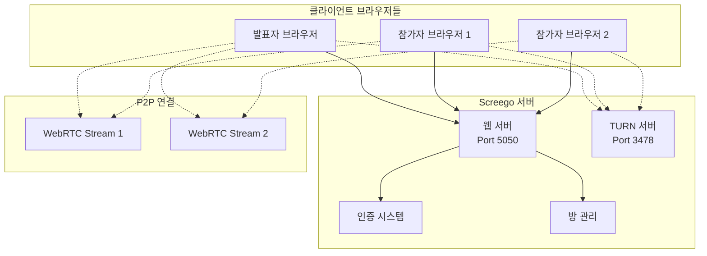

⏱️ **예상 읽기 시간**: 15분

## 서론

원격 개발 협업에서 가장 중요한 것 중 하나는 고품질 스크린 공유입니다. Microsoft Teams나 Zoom 같은 기업용 솔루션들은 종종 지연시간이 길거나 화질이 떨어져 코드 리뷰나 디버깅 세션에서 아쉬움을 남깁니다.

**Screego**는 이런 문제를 해결하기 위해 만들어진 개발자 중심의 스크린 공유 서버입니다. WebRTC 기술을 기반으로 낮은 지연시간과 고해상도를 제공하며, 자체 호스팅이 가능해 보안과 프라이버시를 완벽하게 통제할 수 있습니다.

### 왜 Screego인가?

- 🚀 **낮은 지연시간**: WebRTC P2P 연결로 실시간 화면 공유
- 🔒 **자체 호스팅**: 민감한 코드나 데이터가 외부로 나가지 않음
- 💻 **개발자 친화적**: 단순하고 깔끔한 인터페이스
- 🐳 **간편한 배포**: Docker 컨테이너로 5분 내 구축
- 🌐 **통합 TURN 서버**: NAT 통과 문제 자동 해결
- 👥 **다중 사용자**: 여러 명이 동시에 화면 공유 가능

## 시스템 요구사항

### 최소 요구사항

- **운영체제**: Linux, macOS, Windows (Docker 지원)
- **Docker**: 20.10+
- **Docker Compose**: 2.0+
- **메모리**: 최소 512MB (권장 1GB+)
- **네트워크**: 인터넷 연결 (TURN 서버용)

### 권장 사양

- **CPU**: 2코어 이상
- **메모리**: 2GB 이상
- **디스크**: 10GB 이상 여유 공간
- **대역폭**: 업로드 10Mbps 이상

### 포트 요구사항

- **5050**: 웹 인터페이스 (기본값)
- **3478**: TURN 서버 포트
- **UDP 포트 범위**: 49152-65535 (WebRTC 미디어 전송용)

## Screego 소개

### 핵심 특징

Screego는 Go 언어로 개발된 경량 스크린 공유 서버로, 다음과 같은 특징을 가지고 있습니다:

1. **WebRTC 기반**: 브라우저 네이티브 기술로 높은 성능
2. **P2P 연결**: 서버 부하 최소화
3. **통합 TURN 서버**: NAT/방화벽 문제 자동 해결
4. **사용자 관리**: 간단한 파일 기반 인증
5. **보안 중심**: HTTPS, TURN 인증 지원

### 아키텍처 구성



### 기술 스택

- **백엔드**: Go (Golang)
- **프론트엔드**: TypeScript, WebRTC
- **컨테이너**: Docker
- **프로토콜**: WebRTC, TURN/STUN
- **인증**: 파일 기반 사용자 관리

## 설치 및 환경 준비

### 1. Docker 환경 준비

macOS에서 Docker Desktop이 설치되어 있는지 확인합니다:

```bash
# Docker 버전 확인
docker --version
docker-compose --version

# Docker 데몬 실행 상태 확인
docker info
```

### 2. 프로젝트 디렉토리 생성

```bash
# Screego 프로젝트 디렉토리 생성
mkdir -p ~/screego-server
cd ~/screego-server

# 설정 및 데이터 디렉토리 생성
mkdir -p config data certs
```

### 3. Docker Compose 설정

`docker-compose.yml` 파일을 생성합니다:

```yaml
version: '3.8'

services:
  screego:
    image: screego/server:latest
    container_name: screego-server
    ports:
      - "5050:5050"
      - "3478:3478/udp"
    environment:
      # 기본 서버 설정
      SCREEGO_EXTERNAL_IP: localhost
      SCREEGO_SECRET: "change-this-super-secret-key-2025"
      SCREEGO_CHECK_ORIGIN: false
      SCREEGO_LOG_LEVEL: info
      
      # TURN 서버 설정 (NAT 통과용)
      SCREEGO_TURN_EXTERNAL_IP: localhost
      SCREEGO_TURN_PORT: 3478
      SCREEGO_TURN_STRICT_AUTH: false
      
      # 사용자 인증 설정
      SCREEGO_AUTH_MODE: turn
      SCREEGO_USERS_FILE: /config/users
    volumes:
      - ./config:/config
      - ./data:/data
    restart: unless-stopped
    networks:
      - screego-network

networks:
  screego-network:
    driver: bridge
```

### 4. 사용자 설정 파일 생성

`config/users` 파일을 생성하여 접근 가능한 사용자를 정의합니다:

```bash
# 사용자 파일 생성
cat > config/users << 'EOF'
# Screego 사용자 설정
# 형식: username:password
admin:secure-admin-password
dev1:dev-password-123
dev2:another-password
team:team-collaboration-key
EOF
```

## 서버 실행 및 설정

### 1. Screego 서버 시작

```bash
# 서버 시작
docker-compose up -d

# 서비스 상태 확인
docker-compose ps

# 로그 확인
docker-compose logs -f screego
```

### 2. 서비스 접근 확인

```bash
# 웹 서비스 확인
curl -I http://localhost:5050

# 브라우저에서 접속
open http://localhost:5050  # macOS
```

### 3. 자동 설정 스크립트

편의를 위해 자동 설정 스크립트를 생성할 수 있습니다:

```bash
#!/bin/bash
# setup-screego.sh

set -e

echo "🎯 Screego 서버 자동 설정 시작..."

# 색상 정의
GREEN='\033[0;32m'
BLUE='\033[0;34m'
NC='\033[0m'

print_status() {
    echo -e "${BLUE}[INFO]${NC} $1"
}

print_success() {
    echo -e "${GREEN}[SUCCESS]${NC} $1"
}

# Docker 확인
if ! command -v docker &> /dev/null; then
    echo "Docker가 설치되어 있지 않습니다."
    exit 1
fi

# 디렉토리 생성
print_status "설정 디렉토리 생성 중..."
mkdir -p config data

# 사용자 파일 생성
print_status "사용자 설정 파일 생성 중..."
cat > config/users << 'EOF'
admin:admin123
demo:demo123
team:team123
EOF

# 서버 시작
print_status "Screego 서버 시작 중..."
docker-compose up -d

print_success "설정 완료! http://localhost:5050 에서 접속하세요."

echo ""
echo "📋 테스트 계정:"
echo "  - admin / admin123"
echo "  - demo / demo123"
echo "  - team / team123"
```

## 프로덕션 환경 설정

### 1. 도메인 및 HTTPS 설정

프로덕션 환경에서는 HTTPS가 필요합니다. Let's Encrypt를 사용한 설정:

```yaml
version: '3.8'

services:
  screego:
    image: screego/server:latest
    container_name: screego-prod
    ports:
      - "443:5050"
      - "3478:3478/udp"
    environment:
      SCREEGO_EXTERNAL_IP: yourdomain.com
      SCREEGO_SECRET: "production-super-secret-key"
      SCREEGO_CHECK_ORIGIN: true
      SCREEGO_LOG_LEVEL: warn
      
      # TLS 설정
      SCREEGO_TLS_CERT_FILE: /certs/fullchain.pem
      SCREEGO_TLS_KEY_FILE: /certs/privkey.pem
      
      # TURN 서버 설정
      SCREEGO_TURN_EXTERNAL_IP: yourdomain.com
      SCREEGO_TURN_PORT: 3478
      SCREEGO_TURN_STRICT_AUTH: true
      SCREEGO_TURN_USERNAME: turn-user
      SCREEGO_TURN_PASSWORD: secure-turn-password
      
      # 인증 설정
      SCREEGO_AUTH_MODE: turn
      SCREEGO_USERS_FILE: /config/users
      
      # CORS 설정
      SCREEGO_CORS_ALLOWED_ORIGINS: https://yourdomain.com
    volumes:
      - ./config:/config
      - ./data:/data
      - /etc/letsencrypt/live/yourdomain.com:/certs:ro
    restart: unless-stopped
```

### 2. Nginx 리버스 프록시 설정

Nginx를 통한 프록시 설정 예제:

```nginx
server {
    listen 443 ssl http2;
    server_name screego.yourdomain.com;
    
    ssl_certificate /etc/letsencrypt/live/screego.yourdomain.com/fullchain.pem;
    ssl_certificate_key /etc/letsencrypt/live/screego.yourdomain.com/privkey.pem;
    
    location / {
        proxy_pass http://localhost:5050;
        proxy_set_header Host $host;
        proxy_set_header X-Real-IP $remote_addr;
        proxy_set_header X-Forwarded-For $proxy_add_x_forwarded_for;
        proxy_set_header X-Forwarded-Proto $scheme;
        
        # WebSocket 지원
        proxy_http_version 1.1;
        proxy_set_header Upgrade $http_upgrade;
        proxy_set_header Connection "upgrade";
    }
}
```

### 3. 방화벽 설정

필요한 포트를 열어줍니다:

```bash
# UFW 방화벽 설정 (Ubuntu)
sudo ufw allow 5050/tcp
sudo ufw allow 3478/udp
sudo ufw allow 49152:65535/udp  # WebRTC 미디어 포트

# iptables 설정
sudo iptables -A INPUT -p tcp --dport 5050 -j ACCEPT
sudo iptables -A INPUT -p udp --dport 3478 -j ACCEPT
sudo iptables -A INPUT -p udp --dport 49152:65535 -j ACCEPT
```

## 사용법 및 기능

### 1. 웹 인터페이스 접속

1. 브라우저에서 `http://localhost:5050` 접속
2. 설정한 사용자 계정으로 로그인
3. 새 방 생성 또는 기존 방 참여

### 2. 화면 공유 시작

**발표자 (스크린 공유하는 사람)**:
1. "Create Room" 버튼 클릭
2. 방 이름 입력 (예: "code-review-session")
3. "Share Screen" 버튼 클릭
4. 공유할 화면/창/탭 선택
5. 방 URL을 참가자들에게 공유

**참가자 (화면을 보는 사람)**:
1. 공유받은 방 URL로 접속
2. 동일한 사용자 계정으로 로그인
3. 자동으로 발표자의 화면이 표시됨

### 3. 고급 기능

**다중 발표자**:
- 한 방에서 여러 명이 동시에 화면 공유 가능
- 각 스트림이 개별 창으로 표시

**화질 조정**:
- 네트워크 상황에 따라 자동 품질 조정
- 수동으로 해상도 및 프레임레이트 설정 가능

**권한 관리**:
- 방 생성자가 참가자 권한 제어
- 화면 공유 허용/차단 설정

### 4. 모바일 지원

Screego는 모바일 브라우저에서도 동작합니다:

- **iOS Safari**: 화면 공유 지원 (iOS 15+)
- **Android Chrome**: 완전 지원
- **모바일 최적화**: 터치 인터페이스 지원

## 설정 옵션 상세

### 환경 변수 전체 목록

```bash
# 기본 서버 설정
SCREEGO_EXTERNAL_IP=localhost           # 외부 접속 IP
SCREEGO_PORT=5050                       # 웹 서버 포트
SCREEGO_SECRET=your-secret-key          # JWT 토큰 암호화 키
SCREEGO_LOG_LEVEL=info                  # 로그 레벨 (debug, info, warn, error)

# 인증 설정
SCREEGO_AUTH_MODE=turn                  # 인증 모드 (turn, none)
SCREEGO_USERS_FILE=/config/users        # 사용자 파일 경로
SCREEGO_CHECK_ORIGIN=true               # Origin 헤더 검증

# TURN 서버 설정
SCREEGO_TURN_EXTERNAL_IP=your-ip        # TURN 서버 외부 IP
SCREEGO_TURN_PORT=3478                  # TURN 서버 포트
SCREEGO_TURN_STRICT_AUTH=true           # TURN 인증 강제
SCREEGO_TURN_USERNAME=turn-user         # TURN 사용자명
SCREEGO_TURN_PASSWORD=turn-pass         # TURN 비밀번호

# TLS 설정
SCREEGO_TLS_CERT_FILE=/certs/cert.pem   # TLS 인증서 파일
SCREEGO_TLS_KEY_FILE=/certs/key.pem     # TLS 개인키 파일

# CORS 설정
SCREEGO_CORS_ALLOWED_ORIGINS=*          # 허용할 Origin 목록

# 방 설정
SCREEGO_ROOM_TIMEOUT=24h                # 방 타임아웃
SCREEGO_MAX_ROOM_SIZE=10                # 방 최대 인원

# 성능 설정
SCREEGO_MAX_BITRATE=5000                # 최대 비트레이트 (kbps)
```

### 사용자 파일 형식

`config/users` 파일은 다음 형식을 사용합니다:

```
# 주석은 #으로 시작
username1:password1
username2:password2
admin:very-secure-password

# 팀별 계정 예제
frontend-team:frontend-2025
backend-team:backend-secure
devops-team:devops-tools
```

### 로그 레벨 설정

```bash
# 개발 환경: 상세한 디버그 정보
SCREEGO_LOG_LEVEL=debug

# 프로덕션 환경: 필요한 정보만
SCREEGO_LOG_LEVEL=warn

# 문제 해결시: 모든 정보
SCREEGO_LOG_LEVEL=debug
```

## 문제 해결

### 1. 일반적인 문제들

**연결이 안 되는 경우**:
```bash
# 포트 확인
netstat -tulpn | grep :5050
netstat -tulpn | grep :3478

# 방화벽 상태 확인
sudo ufw status
```

**화면 공유가 시작되지 않는 경우**:
- 브라우저가 HTTPS를 요구하는지 확인
- 마이크/카메라 권한이 필요할 수 있음
- 브라우저 개발자 도구에서 오류 메시지 확인

**WebRTC 연결 실패**:
```bash
# TURN 서버 로그 확인
docker-compose logs screego | grep -i turn

# ICE 연결 상태 확인 (브라우저 개발자 도구)
# about:webrtc (Firefox) 또는 chrome://webrtc-internals (Chrome)
```

### 2. 네트워크 문제 해결

**NAT 통과 문제**:
```yaml
# docker-compose.yml에서 TURN 설정 강화
environment:
  SCREEGO_TURN_STRICT_AUTH: true
  SCREEGO_TURN_USERNAME: secure-turn-user
  SCREEGO_TURN_PASSWORD: very-secure-turn-password
```

**기업 방화벽 환경**:
```bash
# 추가 포트 범위 개방 필요
sudo ufw allow 49152:65535/udp
```

### 3. 성능 최적화

**높은 CPU 사용률**:
```yaml
# 컨테이너 리소스 제한
services:
  screego:
    deploy:
      resources:
        limits:
          cpus: '2.0'
          memory: 1G
        reservations:
          cpus: '0.5'
          memory: 512M
```

**네트워크 대역폭 최적화**:
```bash
# 비트레이트 조정
SCREEGO_MAX_BITRATE=2000  # 낮은 대역폭 환경
SCREEGO_MAX_BITRATE=8000  # 고품질 환경
```

### 4. 디버깅 도구

**연결 상태 확인**:
```bash
# 실시간 연결 모니터링
docker-compose logs -f screego | grep -E "(connect|disconnect|error)"

# 네트워크 트래픽 확인
netstat -i
iftop -i docker0
```

**WebRTC 상태 확인**:
- Chrome: `chrome://webrtc-internals`
- Firefox: `about:webrtc`
- 연결 상태, 비트레이트, 패킷 손실률 등 확인 가능

## 실무 활용 사례

### 1. 개발팀 코드 리뷰

```bash
# 코드 리뷰 전용 설정
cat > config/users << 'EOF'
senior-dev:code-review-lead
junior-dev1:review-participant
junior-dev2:review-participant
product-owner:review-observer
EOF
```

**활용 방법**:
1. 시니어 개발자가 방 생성
2. 코드 에디터 화면 공유
3. 실시간으로 코드 설명 및 피드백
4. 참가자들이 질문 및 토론

### 2. 버그 재현 및 디버깅

```bash
# 디버깅 세션 예제
# 방 이름: "bug-reproduction-issue-1234"
```

**워크플로우**:
1. QA가 버그 재현 과정 화면 공유
2. 개발자가 실시간으로 관찰
3. 디버깅 도구 사용 과정 공유
4. 해결 과정 문서화

### 3. 기술 교육 및 멘토링

```yaml
# 교육용 설정 - 더 많은 참가자 허용
environment:
  SCREEGO_MAX_ROOM_SIZE: 20
  SCREEGO_ROOM_TIMEOUT: 4h
```

**교육 시나리오**:
- 새로운 기술 스택 소개
- 개발 환경 설정 가이드
- 실시간 코딩 세션
- 아키텍처 설계 워크샵

### 4. 고객 지원 및 데모

```bash
# 고객 지원용 계정
cat > config/users << 'EOF'
support-agent:customer-help-2025
customer-demo:demo-account
sales-engineer:sales-demo-lead
EOF
```

## 모니터링 및 관리

### 1. 로그 관리

```yaml
# 로그 로테이션 설정
services:
  screego:
    logging:
      driver: "json-file"
      options:
        max-size: "10m"
        max-file: "3"
```

### 2. 헬스 체크

```bash
#!/bin/bash
# health-check.sh

# 웹 서비스 확인
if curl -f http://localhost:5050/health > /dev/null 2>&1; then
    echo "✅ Screego 웹 서비스 정상"
else
    echo "❌ Screego 웹 서비스 문제 발생"
    docker-compose restart screego
fi

# TURN 서버 확인
if netstat -ulpn | grep -q :3478; then
    echo "✅ TURN 서버 정상"
else
    echo "❌ TURN 서버 문제 발생"
fi
```

### 3. 자동 백업

```bash
#!/bin/bash
# backup-screego.sh

BACKUP_DIR="/backups/screego/$(date +%Y%m%d)"
mkdir -p "$BACKUP_DIR"

# 설정 파일 백업
cp -r config/ "$BACKUP_DIR/"

# 데이터 백업 (필요시)
cp -r data/ "$BACKUP_DIR/"

echo "백업 완료: $BACKUP_DIR"
```

## zsh Aliases 설정

생산성 향상을 위한 편리한 명령어 aliases:

```bash
# ~/.zshrc에 추가할 Screego 관련 aliases

# 기본 관리 명령어
alias screego-start='cd ~/screego-server && docker-compose up -d'
alias screego-stop='cd ~/screego-server && docker-compose down'
alias screego-restart='cd ~/screego-server && docker-compose restart'
alias screego-logs='cd ~/screego-server && docker-compose logs -f'
alias screego-status='cd ~/screego-server && docker-compose ps'

# 업데이트 및 관리
alias screego-update='cd ~/screego-server && docker-compose pull && docker-compose up -d'
alias screego-clean='cd ~/screego-server && docker-compose down -v && docker system prune -f'

# 설정 관리
alias screego-config='cd ~/screego-server && code config/users'
alias screego-backup='cd ~/screego-server && tar -czf screego-backup-$(date +%Y%m%d).tar.gz config/ data/'

# 디버깅
alias screego-debug='cd ~/screego-server && docker-compose logs screego | tail -100'
alias screego-health='curl -s http://localhost:5050/health || echo "서비스 응답 없음"'

# 빠른 접속
alias screego-open='open http://localhost:5050'

# 네트워크 진단
alias screego-ports='netstat -tulpn | grep -E "(5050|3478)"'
alias screego-connections='netstat -an | grep -E "(5050|3478)" | wc -l'
```

aliases 적용 방법:

```bash
# aliases 파일 생성
cat > ~/screego-aliases.sh << 'EOF'
# Screego 관리 aliases
alias screego-start='cd ~/screego-server && docker-compose up -d'
# ... (위의 모든 aliases)
EOF

# .zshrc에 추가
echo "source ~/screego-aliases.sh" >> ~/.zshrc

# 즉시 적용
source ~/.zshrc
```

## 보안 고려사항

### 1. 사용자 인증 강화

```bash
# 강력한 비밀번호 생성
openssl rand -base64 32

# 사용자 파일 보안 설정
chmod 600 config/users
chown root:root config/users
```

### 2. 네트워크 보안

```yaml
# 내부 네트워크만 허용하는 설정
environment:
  SCREEGO_CORS_ALLOWED_ORIGINS: "https://internal.company.com"
  SCREEGO_CHECK_ORIGIN: true
```

### 3. 컨테이너 보안

```yaml
# 보안 강화된 컨테이너 설정
services:
  screego:
    security_opt:
      - no-new-privileges:true
    read_only: true
    tmpfs:
      - /tmp
    user: "1000:1000"
```

## 결론

Screego는 개발팀의 원격 협업을 위한 완벽한 스크린 공유 솔루션입니다. WebRTC 기반의 P2P 연결로 낮은 지연시간과 고품질을 제공하며, 자체 호스팅을 통해 보안과 프라이버시를 완벽하게 통제할 수 있습니다.

### 주요 장점 요약

- **🚀 성능**: WebRTC P2P 연결로 실시간 화면 공유
- **🔒 보안**: 민감한 데이터가 외부로 나가지 않는 자체 호스팅
- **💻 편의성**: Docker로 5분 내 구축 가능
- **🌐 호환성**: 모든 모던 브라우저에서 동작
- **👥 확장성**: 다중 사용자 및 방 관리 지원

### 다음 단계

1. **기본 설치**: Docker Compose로 로컬 환경 구축
2. **팀 도입**: 개발팀 내부 테스트 진행
3. **프로덕션 배포**: HTTPS 및 도메인 설정으로 본격 운영
4. **워크플로우 통합**: CI/CD, 이슈 트래킹 시스템과 연동

Screego를 통해 더 효율적이고 안전한 개발팀 협업 환경을 구축해보세요. 코드 리뷰부터 기술 교육까지, 모든 화면 공유 요구사항을 만족하는 완벽한 솔루션이 될 것입니다.

### 참고 자료

- **공식 문서**: [screego.net](https://screego.net/)
- **GitHub 저장소**: [screego/server](https://github.com/screego/server)
- **WebRTC 가이드**: [webrtc.org](https://webrtc.org/)
- **Docker 공식 문서**: [docs.docker.com](https://docs.docker.com/)

