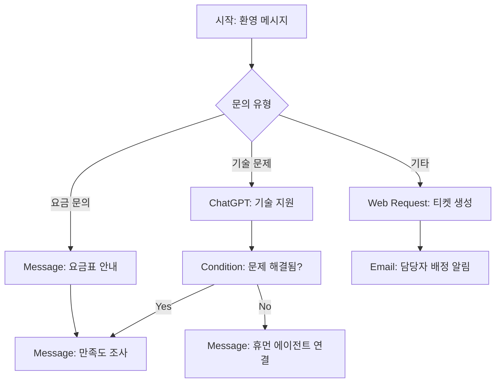

⏱️ **예상 읽기 시간**: 15분

## 서론

현대 비즈니스에서 고객 서비스 자동화는 더 이상 선택이 아닌 필수가 되었습니다. **Tiledesk Design Studio**는 개발자와 비개발자 모두가 사용할 수 있는 강력한 노코드 챗봇 빌더로, 2023년 Product Hunt Golden Kitty Awards에서 **오픈소스 제품상**을 수상한 검증된 플랫폼입니다.

이 가이드에서는 [GitHub에서 291개 스타를 받은](https://github.com/Tiledesk/design-studio) Tiledesk Design Studio를 활용하여 ChatGPT 통합 챗봇을 구축하는 전 과정을 다룹니다.

### 왜 Tiledesk Design Studio인가?

**기존 솔루션 대비 차별점:**
- **오픈소스**: MIT 라이선스로 완전 무료
- **Voiceflow/Botpress 대안**: 상용 도구 대신 자체 호스팅 가능
- **Angular 기반**: 안정적이고 확장 가능한 프레임워크
- **ChatGPT 통합**: OpenAI API 네이티브 지원
- **시각적 플로우**: 드래그 앤 드롭 대화 설계

## Tiledesk Design Studio 플랫폼 개요

### 핵심 아키텍처와 특징

**시스템 구성:**
```typescript
// Tiledesk Design Studio 기술 스택
{
  "프론트엔드": "Angular 14.2.6",
  "UI 프레임워크": "Angular Material + Bootstrap 5",
  "상태관리": "RxJS",
  "국제화": "@ngx-translate/core",
  "통신": "Firebase + WebSocket",
  "차트/플로우": "Custom Canvas Engine"
}
```

**핵심 기능 매트릭스:**

| 기능 카테고리 | 제공 기능 | 경쟁사 대비 장점 |
|---|---|---|
| **대화 설계** | 드래그 앤 드롭 플로우 빌더 | Voiceflow 수준의 UX |
| **AI 통합** | ChatGPT, 지식베이스 검색 | 네이티브 OpenAI 지원 |
| **멀티채널** | 웹, WhatsApp, 이메일 | 통합 플랫폼 |
| **개발자 친화** | REST API, 웹훅 | 완전한 프로그래밍 가능 |
| **엔터프라이즈** | 온프레미스 배포 | 데이터 주권 보장 |

### 비즈니스 활용 사례

**1. 고객 지원 자동화**
- L1 문의 80% 자동 처리
- 복잡한 문의는 휴먼 에이전트 연결
- 24/7 다국어 지원

**2. 영업 리드 생성**
- 제품 추천 시스템
- 맞춤형 견적 생성
- CRM 자동 연동 (HubSpot, Salesforce)

**3. 내부 업무 자동화**
- HR 정책 안내
- IT 헬프데스크
- 업무 프로세스 가이드

## 1단계: 개발 환경 설정

### 1.1 시스템 요구사항

**필수 환경:**
- **Node.js**: 16.x 이상 (권장: 18.x)
- **npm**: 8.x 이상
- **Angular CLI**: 14.x
- **운영체제**: macOS, Windows, Linux

**현재 테스트 환경:**
```bash
# 환경 확인
node --version    # v22.17.1
npm --version     # 10.9.2
ng --version      # 14.2.6
```

### 1.2 프로젝트 설치

**저장소 클론 및 설치:**
```bash
# 1) GitHub에서 클론
git clone https://github.com/Tiledesk/design-studio.git
cd design-studio

# 2) Angular CLI 설치 (글로벌)
npm install -g @angular/cli@14.2.6

# 3) 프로젝트 의존성 설치
npm install

# 4) 설치 확인
ng version
```

### 1.3 개발 서버 실행

**로컬 개발 환경 시작:**
```bash
# 개발 서버 실행
ng serve --port 4200 --host localhost

# 브라우저에서 접속
# http://localhost:4200
```

### 1.4 macOS 환경 최적화 스크립트

**자동화 설정 스크립트** (`setup-tiledesk.sh`):
```bash
#!/bin/bash

# Tiledesk Design Studio 개발 환경 설정
echo "🎨 Tiledesk Design Studio 환경 설정 시작..."

# 환경 변수 설정
export TILEDESK_DIR="$(pwd)"
export NODE_VERSION="$(node --version)"
export NPM_VERSION="$(npm --version)"

# .zshrc aliases 추가
cat >> ~/.zshrc << 'EOF'
# Tiledesk Design Studio aliases
alias td-start="ng serve --port 4200"
alias td-build="ng build --output-path=dist"
alias td-test="ng test"
alias td-clean="rm -rf node_modules && npm install"
alias td-kill="kill -9 $(lsof -t -i:4200) 2>/dev/null"
EOF

echo "✅ 설정 완료! 'source ~/.zshrc' 실행 후 사용하세요."
```

## 2단계: 플랫폼 아키텍처 이해

### 2.1 Design Studio 컴포넌트 구조

**프로젝트 디렉토리 구조:**
```
design-studio/
├── src/
│   ├── app/
│   │   ├── chatbot-design-studio/    # 핵심 플로우 빌더
│   │   ├── shared/                   # 공유 컴포넌트
│   │   └── services/                 # API 서비스
│   ├── assets/                       # 정적 리소스
│   └── environments/                 # 환경 설정
├── angular.json                      # Angular 프로젝트 설정
└── package.json                      # 의존성 정의
```

### 2.2 핵심 서비스 분석

**주요 Angular 서비스들:**

```typescript
// 1) 챗봇 플로우 관리 서비스
@Injectable()
export class ChatBotService {
  // 챗봇 플로우 CRUD
  createChatBot(chatbot: any): Observable<any>
  updateChatBot(id: string, chatbot: any): Observable<any>
  deleteChatBot(id: string): Observable<any>
  
  // 플로우 노드 관리
  addNode(type: string, config: any): void
  updateNode(nodeId: string, config: any): void
  connectNodes(sourceId: string, targetId: string): void
}

// 2) Tiledesk API 연동 서비스
@Injectable()
export class TiledeskService {
  // 인증 토큰 관리
  setAuthToken(token: string): void
  getAuthToken(): string
  
  // 프로젝트 관리
  getProjects(): Observable<Project[]>
  createProject(project: Project): Observable<Project>
}
```

### 2.3 노드 타입별 기능

**사용 가능한 플로우 노드들:**

| 노드 타입 | 기능 | 사용 사례 |
|---|---|---|
| **Message** | 텍스트/미디어 응답 | 환영 메시지, 안내 |
| **ChatGPT** | AI 대화 처리 | 자연어 질문 답변 |
| **Condition** | 조건부 분기 | 사용자 유형별 라우팅 |
| **Web Request** | 외부 API 호출 | CRM 조회, 데이터 검색 |
| **Random Reply** | 랜덤 응답 | 다양한 인사말 |
| **Email** | 이메일 발송 | 문의 접수 확인 |
| **WhatsApp** | WhatsApp 연동 | 멀티채널 지원 |

## 3단계: 첫 번째 챗봇 프로젝트 생성

### 3.1 Tiledesk 계정 설정

**Tiledesk 플랫폼 연동:**

```javascript
// 로컬 스토리지에 인증 토큰 설정
localStorage.setItem('tiledesk_token', 'YOUR_TILEDESK_TOKEN');

// 프로젝트 ID와 챗봇 ID 설정
const PROJECT_ID = 'your-project-id';
const CHATBOT_ID = 'your-chatbot-id';

// Design Studio 접속 URL
const designStudioUrl = `http://localhost:4200/#/project/${PROJECT_ID}/chatbot/${CHATBOT_ID}/blocks`;
```

### 3.2 간단한 고객 지원 챗봇 구축

**시나리오**: 기술 지원 챗봇 만들기

**플로우 설계:**


### 3.3 노드별 설정 가이드

**1) 환영 메시지 노드:**
```json
{
  "type": "message",
  "content": {
    "text": "안녕하세요! 🤖 기술 지원팀입니다. 어떤 도움이 필요하신가요?",
    "buttons": [
      {"label": "기술 문제", "value": "tech_issue"},
      {"label": "요금 문의", "value": "billing"},
      {"label": "기타", "value": "other"}
    ]
  }
}
```

**2) ChatGPT 통합 노드:**
```json
{
  "type": "chatgpt",
  "config": {
    "model": "gpt-3.5-turbo",
    "systemPrompt": "당신은 전문적인 기술 지원 담당자입니다. 사용자의 기술적 문제를 친근하고 정확하게 해결해주세요.",
    "maxTokens": 500,
    "temperature": 0.7
  }
}
```

**3) 조건부 분기 노드:**
```json
{
  "type": "condition",
  "conditions": [
    {
      "if": "user_satisfaction === 'solved'",
      "then": "goto_satisfaction_survey"
    },
    {
      "else": "goto_human_agent"
    }
  ]
}
```

**4) 웹 요청 노드 (CRM 연동):**
```json
{
  "type": "web_request",
  "config": {
    "method": "POST",
    "url": "https://api.your-crm.com/tickets",
    "headers": {
      "Authorization": "Bearer YOUR_API_KEY",
      "Content-Type": "application/json"
    },
    "body": {
      "title": "{{user_issue}}",
      "description": "{{conversation_transcript}}",
      "priority": "medium",
      "customer_email": "{{user_email}}"
    }
  }
}
```

## 4단계: 고급 기능 구현

### 4.1 멀티채널 통합

**WhatsApp 연동 설정:**
```typescript
// WhatsApp Business API 설정
interface WhatsAppConfig {
  phoneNumberId: string;
  accessToken: string;
  webhookVerifyToken: string;
  businessAccountId: string;
}

// 메시지 템플릿 등록
const messageTemplate = {
  name: "support_follow_up",
  language: "ko",
  components: [
    {
      type: "BODY",
      text: "안녕하세요 {{1}}님, 이전 문의사항이 해결되셨나요? 추가 도움이 필요하시면 언제든 연락주세요."
    }
  ]
};
```

### 4.2 지식베이스 통합

**벡터 검색 기반 지식베이스:**
```javascript
// OpenAI Embeddings를 활용한 지식베이스 검색
class KnowledgeBase {
  async searchSimilarDocuments(query, topK = 3) {
    // 1) 쿼리를 벡터로 변환
    const queryEmbedding = await this.getEmbedding(query);
    
    // 2) 유사도 검색
    const results = await this.vectorSearch(queryEmbedding, topK);
    
    // 3) 컨텍스트 생성
    const context = results.map(doc => doc.content).join('\n\n');
    
    return context;
  }
  
  async getEmbedding(text) {
    const response = await fetch('https://api.openai.com/v1/embeddings', {
      method: 'POST',
      headers: {
        'Authorization': `Bearer ${OPENAI_API_KEY}`,
        'Content-Type': 'application/json',
      },
      body: JSON.stringify({
        input: text,
        model: 'text-embedding-ada-002'
      })
    });
    
    const data = await response.json();
    return data.data[0].embedding;
  }
}
```

### 4.3 대화 품질 개선

**컨텍스트 유지 및 대화 기억:**
```typescript
// 대화 컨텍스트 관리
interface ConversationContext {
  userId: string;
  sessionId: string;
  history: Message[];
  userProfile: UserProfile;
  currentIntent: string;
  entities: Record<string, any>;
}

class ConversationManager {
  private contexts = new Map<string, ConversationContext>();
  
  updateContext(sessionId: string, update: Partial<ConversationContext>) {
    const existing = this.contexts.get(sessionId) || this.createNewContext(sessionId);
    this.contexts.set(sessionId, { ...existing, ...update });
  }
  
  getRelevantHistory(sessionId: string, maxMessages = 10): Message[] {
    const context = this.contexts.get(sessionId);
    return context?.history.slice(-maxMessages) || [];
  }
}
```

## 5단계: 프로덕션 배포 및 최적화

### 5.1 도커 컨테이너화

**Dockerfile 설정:**
```dockerfile
# 멀티스테이지 빌드
FROM node:18-alpine AS builder

WORKDIR /app
COPY package*.json ./
RUN npm ci --only=production

COPY . .
RUN npm run build

# 프로덕션 스테이지
FROM nginx:alpine
COPY --from=builder /app/dist /usr/share/nginx/html
COPY nginx.conf /etc/nginx/nginx.conf

EXPOSE 80
CMD ["nginx", "-g", "daemon off;"]
```

**nginx 설정 (`nginx.conf`):**
```nginx
events {
  worker_connections 1024;
}

http {
  include /etc/nginx/mime.types;
  default_type application/octet-stream;

  server {
    listen 80;
    server_name localhost;
    root /usr/share/nginx/html;
    index index.html;

    # Angular 라우팅 지원
    location / {
      try_files $uri $uri/ /index.html;
    }

    # 정적 파일 캐싱
    location ~* \.(js|css|png|jpg|jpeg|gif|ico|svg)$ {
      expires 1y;
      add_header Cache-Control "public, immutable";
    }

    # Gzip 압축
    gzip on;
    gzip_types text/plain text/css application/json application/javascript text/xml application/xml;
  }
}
```

### 5.2 Kubernetes 배포

**Deployment 설정:**
```yaml
apiVersion: apps/v1
kind: Deployment
metadata:
  name: tiledesk-design-studio
spec:
  replicas: 3
  selector:
    matchLabels:
      app: tiledesk-design-studio
  template:
    metadata:
      labels:
        app: tiledesk-design-studio
    spec:
      containers:
      - name: design-studio
        image: your-registry/tiledesk-design-studio:latest
        ports:
        - containerPort: 80
        env:
        - name: TILEDESK_API_URL
          value: "https://api.tiledesk.com"
        resources:
          requests:
            memory: "256Mi"
            cpu: "250m"
          limits:
            memory: "512Mi"
            cpu: "500m"
---
apiVersion: v1
kind: Service
metadata:
  name: tiledesk-design-studio-service
spec:
  selector:
    app: tiledesk-design-studio
  ports:
  - protocol: TCP
    port: 80
    targetPort: 80
  type: LoadBalancer
```

### 5.3 성능 최적화

**Angular 최적화 설정:**
```typescript
// app.module.ts - 지연 로딩 설정
const routes: Routes = [
  {
    path: 'chatbot-design',
    loadChildren: () => import('./chatbot-design-studio/chatbot-design-studio.module').then(m => m.ChatbotDesignStudioModule)
  }
];

// 빌드 최적화 (angular.json)
{
  "build": {
    "configurations": {
      "production": {
        "optimization": true,
        "outputHashing": "all",
        "sourceMap": false,
        "namedChunks": false,
        "extractLicenses": true,
        "vendorChunk": false,
        "buildOptimizer": true,
        "budgets": [
          {
            "type": "initial",
            "maximumWarning": "2mb",
            "maximumError": "5mb"
          }
        ]
      }
    }
  }
}
```

## 6단계: 실전 활용 사례

### 6.1 전자상거래 쇼핑 어시스턴트

**복잡한 플로우 구현:**
```typescript
// 제품 추천 로직
class ProductRecommendationBot {
  async handleUserQuery(userMessage: string, userProfile: UserProfile) {
    // 1) 사용자 의도 분석
    const intent = await this.analyzeIntent(userMessage);
    
    // 2) 제품 검색 및 필터링
    const products = await this.searchProducts({
      query: intent.searchTerms,
      priceRange: userProfile.pricePreference,
      category: intent.category
    });
    
    // 3) 개인화된 추천
    const recommendations = await this.personalizeRecommendations(
      products,
      userProfile.purchaseHistory
    );
    
    // 4) 대화형 응답 생성
    return this.generateConversationalResponse(recommendations);
  }
  
  generateConversationalResponse(products: Product[]) {
    return {
      type: "carousel",
      cards: products.map(product => ({
        title: product.name,
        subtitle: `₩${product.price.toLocaleString()}`,
        imageUrl: product.imageUrl,
        buttons: [
          { label: "상세보기", action: "view_product", value: product.id },
          { label: "장바구니", action: "add_to_cart", value: product.id }
        ]
      }))
    };
  }
}
```

### 6.2 HR 업무 자동화 챗봇

**복잡한 워크플로우 관리:**
```json
{
  "flow": "employee_onboarding",
  "steps": [
    {
      "id": "welcome",
      "type": "message",
      "content": "신입사원 온보딩 프로세스를 시작합니다! 👋"
    },
    {
      "id": "collect_info",
      "type": "form",
      "fields": [
        {"name": "employee_id", "type": "text", "required": true},
        {"name": "department", "type": "select", "options": ["개발", "마케팅", "영업"]},
        {"name": "start_date", "type": "date"}
      ]
    },
    {
      "id": "generate_checklist",
      "type": "web_request",
      "config": {
        "url": "https://api.hr-system.com/onboarding/checklist",
        "method": "POST",
        "data": "{{form_data}}"
      }
    },
    {
      "id": "send_credentials",
      "type": "email",
      "template": "employee_credentials",
      "attachments": ["employee_handbook.pdf", "security_guidelines.pdf"]
    }
  ]
}
```

### 6.3 다국어 고객 지원

**국제화 지원 구현:**
```typescript
// i18n 설정
import { registerLocaleData } from '@angular/common';
import localeKo from '@angular/common/locales/ko';
import localeEn from '@angular/common/locales/en';
import localeJa from '@angular/common/locales/ja';

registerLocaleData(localeKo);
registerLocaleData(localeEn);
registerLocaleData(localeJa);

// 다국어 메시지 템플릿
const messages = {
  'ko': {
    'welcome': '안녕하세요! 무엇을 도와드릴까요?',
    'thanks': '도움이 되셨기를 바랍니다. 감사합니다!',
    'error': '죄송합니다. 일시적인 오류가 발생했습니다.'
  },
  'en': {
    'welcome': 'Hello! How can I help you today?',
    'thanks': 'I hope that was helpful. Thank you!',
    'error': 'Sorry, a temporary error occurred.'
  },
  'ja': {
    'welcome': 'こんにちは！何かお手伝いできることはありますか？',
    'thanks': 'お役に立てれば幸いです。ありがとうございます！',
    'error': '申し訳ございません。一時的なエラーが発生しました。'
  }
};
```

## 7단계: 모니터링 및 분석

### 7.1 대화 품질 메트릭

**핵심 성과 지표 (KPI):**
```typescript
interface ChatbotMetrics {
  // 기본 지표
  totalConversations: number;
  averageResponseTime: number;
  userSatisfactionScore: number;
  
  // 비즈니스 지표
  resolutionRate: number;        // 자동 해결률
  escalationRate: number;        // 휴먼 에이전트 전환율
  conversionRate: number;        // 목표 달성률
  
  // 기술적 지표
  errorRate: number;
  apiLatency: number;
  uptime: number;
}

class ChatbotAnalytics {
  async generateDashboard(dateRange: DateRange): Promise<Dashboard> {
    const metrics = await this.calculateMetrics(dateRange);
    
    return {
      summary: metrics,
      charts: {
        conversationVolume: await this.getConversationTrends(dateRange),
        userSatisfaction: await this.getSatisfactionTrends(dateRange),
        topIntents: await this.getTopIntents(dateRange),
        failurePoints: await this.getFailureAnalysis(dateRange)
      }
    };
  }
}
```

### 7.2 A/B 테스트 구현

**대화 플로우 최적화:**
```typescript
class FlowTesting {
  async runABTest(testConfig: ABTestConfig) {
    // 트래픽 분할 (예: 50/50)
    const variant = Math.random() < 0.5 ? 'A' : 'B';
    
    // 사용자에게 해당 플로우 제공
    const flow = await this.getFlowVariant(testConfig.flowId, variant);
    
    // 결과 추적
    await this.trackExperiment({
      userId: testConfig.userId,
      experimentId: testConfig.experimentId,
      variant: variant,
      timestamp: new Date()
    });
    
    return flow;
  }
  
  async analyzeTestResults(experimentId: string) {
    const results = await this.getExperimentData(experimentId);
    
    return {
      variantA: {
        conversions: results.variantA.conversions,
        satisfactionScore: results.variantA.avgSatisfaction,
        completionRate: results.variantA.completionRate
      },
      variantB: {
        conversions: results.variantB.conversions,
        satisfactionScore: results.variantB.avgSatisfaction,
        completionRate: results.variantB.completionRate
      },
      statisticalSignificance: this.calculateSignificance(results)
    };
  }
}
```

## 8단계: 보안 및 컴플라이언스

### 8.1 데이터 보안 강화

**민감 정보 보호:**
```typescript
// 개인정보 마스킹
class DataProtection {
  maskSensitiveData(message: string): string {
    // 이메일 마스킹
    message = message.replace(/([a-zA-Z0-9._%+-]+)@([a-zA-Z0-9.-]+\.[a-zA-Z]{2,})/g, 
      (match, username, domain) => {
        const maskedUsername = username.substring(0, 2) + '*'.repeat(username.length - 2);
        return `${maskedUsername}@${domain}`;
      });
    
    // 전화번호 마스킹
    message = message.replace(/(\d{2,3})-?(\d{3,4})-?(\d{4})/g, 
      (match, p1, p2, p3) => `${p1}-${'*'.repeat(p2.length)}-${p3}`);
    
    // 신용카드 번호 마스킹
    message = message.replace(/(\d{4})[- ]?(\d{4})[- ]?(\d{4})[- ]?(\d{4})/g, 
      '$1-****-****-$4');
    
    return message;
  }
  
  // 대화 내용 암호화
  async encryptConversation(conversationData: any): Promise<string> {
    const crypto = require('crypto');
    const algorithm = 'aes-256-gcm';
    const key = process.env.ENCRYPTION_KEY;
    
    const iv = crypto.randomBytes(16);
    const cipher = crypto.createCipher(algorithm, key);
    cipher.setAAD(Buffer.from('conversation_data'));
    
    let encrypted = cipher.update(JSON.stringify(conversationData), 'utf8', 'hex');
    encrypted += cipher.final('hex');
    
    const authTag = cipher.getAuthTag();
    
    return {
      encrypted: encrypted,
      iv: iv.toString('hex'),
      authTag: authTag.toString('hex')
    };
  }
}
```

### 8.2 GDPR/CCPA 준수

**데이터 주체 권리 구현:**
```typescript
class ComplianceManager {
  // 개인정보 처리 동의
  async requestConsent(userId: string, purposes: string[]): Promise<boolean> {
    const consentRequest = {
      userId: userId,
      purposes: purposes,
      timestamp: new Date(),
      ipAddress: this.getUserIP(),
      userAgent: this.getUserAgent()
    };
    
    return await this.showConsentDialog(consentRequest);
  }
  
  // 데이터 삭제 요청 처리
  async handleDataDeletionRequest(userId: string): Promise<void> {
    // 1) 대화 기록 삭제
    await this.deleteConversationHistory(userId);
    
    // 2) 개인정보 삭제
    await this.deletePersonalInformation(userId);
    
    // 3) 분석 데이터에서 익명화
    await this.anonymizeAnalyticsData(userId);
    
    // 4) 삭제 확인 이메일 발송
    await this.sendDeletionConfirmation(userId);
  }
  
  // 데이터 이동성 지원 (데이터 다운로드)
  async exportUserData(userId: string): Promise<UserDataExport> {
    return {
      personalInformation: await this.getPersonalInfo(userId),
      conversationHistory: await this.getConversationHistory(userId),
      preferences: await this.getUserPreferences(userId),
      exportDate: new Date().toISOString()
    };
  }
}
```

## 실전 팁과 베스트 프랙티스

### 개발 생산성 향상

**유용한 zsh aliases:**
```bash
# ~/.zshrc에 추가
alias td-start="cd ~/tiledesk-design-studio && ng serve"
alias td-build="ng build --configuration=production"
alias td-test="ng test --watch=false --browsers=ChromeHeadless"
alias td-lint="ng lint"
alias td-clean="rm -rf node_modules dist && npm install"
```

### 성능 최적화 체크리스트

**프론트엔드 최적화:**
- ✅ Angular OnPush 변경 감지 전략 사용
- ✅ 지연 로딩으로 번들 크기 최적화
- ✅ 이미지 압축 및 WebP 포맷 사용
- ✅ CDN을 통한 정적 자산 배포

**백엔드 최적화:**
- ✅ 데이터베이스 인덱스 최적화
- ✅ Redis 캐싱 레이어 구현
- ✅ API 응답 압축 (Gzip)
- ✅ 데이터베이스 연결 풀링

### 일반적인 문제 해결

**자주 발생하는 이슈들:**

1. **토큰 만료 오류**
```typescript
// 자동 토큰 갱신 로직
async refreshAuthToken(): Promise<string> {
  try {
    const response = await fetch('/api/auth/refresh', {
      method: 'POST',
      headers: { 'Authorization': `Bearer ${this.refreshToken}` }
    });
    
    if (response.ok) {
      const { accessToken } = await response.json();
      localStorage.setItem('tiledesk_token', accessToken);
      return accessToken;
    }
  } catch (error) {
    // 로그인 페이지로 리다이렉트
    this.router.navigate(['/login']);
  }
}
```

2. **메모리 누수 방지**
```typescript
// 컴포넌트에서 구독 해제
export class ChatBotComponent implements OnDestroy {
  private destroy$ = new Subject<void>();
  
  ngOnInit() {
    this.chatService.messages$
      .pipe(takeUntil(this.destroy$))
      .subscribe(messages => {
        // 메시지 처리
      });
  }
  
  ngOnDestroy() {
    this.destroy$.next();
    this.destroy$.complete();
  }
}
```

## 결론

Tiledesk Design Studio는 현대적인 챗봇 개발의 복잡성을 크게 줄여주는 강력한 플랫폼입니다. 오픈소스의 투명성과 상용 솔루션 수준의 기능을 모두 제공하여, 스타트업부터 대기업까지 다양한 규모의 조직에서 활용할 수 있습니다.

**주요 성취 가능한 결과:**
- **개발 시간 80% 단축**: 드래그 앤 드롭으로 빠른 프로토타이핑
- **운영 비용 절감**: 고객 지원 업무 자동화로 인건비 최적화
- **사용자 만족도 향상**: 24/7 즉시 응답으로 고객 경험 개선
- **확장성 확보**: 마이크로서비스 아키텍처로 유연한 확장

Angular의 견고함과 최신 AI 기술의 융합으로, 앞으로의 대화형 AI 서비스 개발에서 핵심적인 역할을 할 것으로 기대됩니다.

### 다음 단계

1. **커뮤니티 참여**: [Tiledesk GitHub](https://github.com/Tiledesk/design-studio)에서 기여하기
2. **고급 기능 탐색**: 웹훅, 사용자 정의 노드 개발
3. **운영 환경 배포**: Kubernetes 클러스터에 프로덕션 배포
4. **성능 모니터링**: 실시간 대화 품질 추적 시스템 구축

Tiledesk Design Studio로 여러분만의 지능형 대화 시스템을 구축해보세요! 🚀
