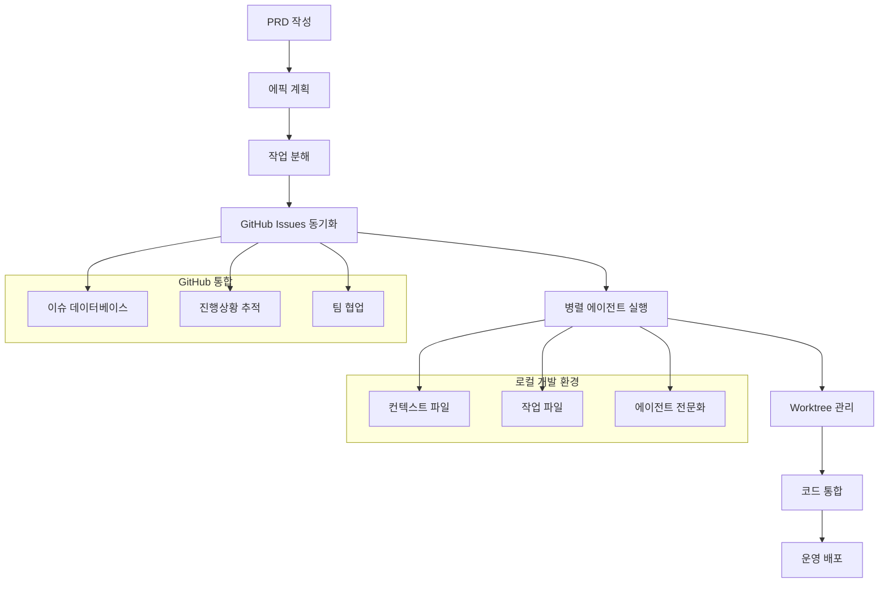

⏱️ **예상 읽기 시간**: 15분

## 도입: 감에 의존한 코딩을 넘어서

모든 개발팀이 직면하는 생산성 킬러들이 있습니다:

- **컨텍스트가 사라져서** 세션 간 지속적인 재발견이 필요
- **병렬 작업으로 인한 충돌** 여러 개발자가 같은 코드를 건드릴 때
- **요구사항 표류** 구두 결정이 문서화된 사양을 무시할 때
- **진행상황이 보이지 않음** 맨 마지막까지

[Claude Code Project Management (CCPM)](https://github.com/automazeio/ccpm)은 AI 지원 개발 방식을 혁신적으로 변화시켜 이 모든 문제들을 해결합니다.

### CCPM이 혁신적인 이유는?

기존 Claude Code 워크플로우는 고립된 환경에서 작동합니다 - 개발자 한 명이 로컬 환경에서 AI와 작업하는 방식. CCPM은 **GitHub Issues를 데이터베이스로 사용**하고 **병렬 실행을 위해 Git worktree**를 활용해서 이런 한계를 깨뜨립니다.

| 기존 개발 방식 | CCPM 시스템 |
|-------------|------------|
| 세션 간 컨텍스트 손실 | **모든 작업에서 지속적인 컨텍스트** |
| 순차적 작업 실행 | **독립적 작업의 병렬 에이전트** |
| 기억에 의존한 "감 코딩" | **완전한 추적성을 갖춘 스펙 주도** |
| 브랜치에 숨겨진 진행상황 | **GitHub에서 투명한 감사 추적** |
| 수동 작업 조정 | **지능적인 우선순위 지정** |

## 시스템 아키텍처 개요



## 사전 요구사항 및 설정

### 시스템 요구사항

- macOS (권장) 또는 Linux
- Git 2.30+
- Claude Code (Anthropic의 코딩 어시스턴트)
- GitHub CLI (`gh`)
- Node.js 18+ (일부 자동화 스크립트용)

### macOS 빠른 테스트 스크립트

macOS 사용자의 경우, 자동화된 테스트 스크립트를 사용해서 환경을 검증하고 CCPM을 체험할 수 있습니다:

```bash
# CCPM 테스트 스크립트 다운로드 및 실행
curl -fsSL https://raw.githubusercontent.com/automazeio/ccpm/main/scripts/test-workflow.sh | bash

# 또는 이 저장소가 로컬에 있다면:
./scripts/test-ccpm-workflow.sh
```

이 스크립트는 다음을 수행합니다:
- ✅ 모든 시스템 사전 요구사항 확인
- ✅ CCPM이 설치된 테스트 프로젝트 생성
- ✅ 설치 검증
- ✅ 샘플 PRD 및 Epic 파일 생성
- ✅ GitHub CLI 통합 테스트 (가능한 경우)
- ✅ Claude Code 통합을 위한 다음 단계 제공

### 빠른 설치 (2분)

**1단계: 프로젝트에 CCPM 클론**

```bash
# 프로젝트 디렉토리로 이동
cd path/to/your/project/

# CCPM 시스템 클론
git clone https://github.com/automazeio/ccpm.git .
```

> ⚠️ **중요**: 이미 `.claude` 디렉토리가 있다면, 임시 디렉토리에 클론한 후 수동으로 내용을 병합하세요.

**2단계: PM 시스템 초기화**

```bash
# Claude Code에서 실행:
/pm:init
```

이 명령은:
- GitHub CLI 설치 (필요시)
- GitHub 인증
- 부모-자식 관계를 위한 `gh-sub-issue` 확장 설치
- 필요한 디렉토리 생성
- `.gitignore` 업데이트

**3단계: 저장소 설정 구성**

`CLAUDE.md` 생성 또는 업데이트:

```bash
# Claude Code에서:
/init include rules from .claude/CLAUDE.md

# 이미 CLAUDE.md가 있다면:
/re-init
```

**4단계: 시스템 프라이밍**

```bash
# 컨텍스트 시스템 초기화
/context:create
```

## 핵심 워크플로우: 아이디어부터 운영까지

### 1단계: PRD (제품 요구사항 문서) 작성

CCPM의 기초는 **스펙 주도 개발**입니다. 모든 것은 포괄적인 PRD부터 시작합니다.

**새 기능 시작하기:**

```bash
/pm:prd-new memory-system
```

이 명령은 다음을 다루는 상세한 PRD를 생성하는 **대화형 브레인스토밍 세션**을 시작합니다:

- **문제 정의**: 정확히 무엇을 해결하고 있는가?
- **성공 지표**: 성공을 어떻게 측정할 것인가?
- **사용자 스토리**: 누가 혜택을 받고 어떻게?
- **기술적 제약사항**: 우리의 한계는 무엇인가?
- **엣지 케이스**: 무엇이 잘못될 수 있는가?
- **통합 지점**: 기존 시스템과 어떻게 맞물리는가?

**PRD 구조 예시:**

```markdown
# 메모리 시스템 PRD

## 문제 정의
사용자들이 Claude Code 세션 간 컨텍스트를 잃어서 반복적인 설명과 느린 개발 주기로 이어집니다.

## 성공 지표
- 컨텍스트 재설정 시간 90% 단축
- 반복 질문 75% 감소
- 세션 간 일관된 프로젝트 이해

## 사용자 스토리
- 개발자로서, Claude가 우리의 이전 아키텍처 결정을 기억하길 원합니다
- 팀 리더로서, 팀원들 간 일관된 컨텍스트를 원합니다
- 제품 매니저로서, 세션 간 기능 요구사항이 보존되길 원합니다

## 기술 아키텍처
- `.claude/memory/`의 파일 기반 메모리 저장
- 세션 시작시 자동 컨텍스트 로딩
- 구조화된 메모리 카테고리 (결정사항, 패턴, 제약사항)

## 통합 지점
- 기존 `.claude/` 디렉토리 구조
- 진행상황 추적을 위한 GitHub Issues
- 자동 메모리 업데이트를 위한 Git 훅
```

### 2단계: 에픽 계획 및 작업 분해

PRD가 완성되면 이를 상세한 작업이 포함된 실행 가능한 에픽으로 변환합니다.

**PRD를 에픽으로 파싱:**

```bash
/pm:prd-parse memory-system
```

이는 다음을 생성합니다:
- **명확한 목표가 있는 에픽 개요**
- **필요한 구성요소들의 기술적 분해**
- **종속성이 매핑된 작업 목록**
- **각 구성요소의 노력 추정치**
- **최대 효율성을 위한 병렬 실행 계획**

**에픽 구조 예시:**

```
에픽: 메모리 시스템 구현

├── 작업 1: 핵심 메모리 인프라
│   ├── 메모리 저장 시스템 생성
│   ├── 컨텍스트 로딩 구현
│   └── 메모리 지속성 훅 추가
│
├── 작업 2: 메모리 관리 인터페이스
│   ├── 메모리 CRUD 작업 설계
│   ├── 메모리 검색 기능 구축
│   └── 메모리 시각화 도구 생성
│
└── 작업 3: 통합 및 테스트
    ├── 기존 워크플로우와 통합
    ├── 포괄적인 테스트 스위트 추가
    └── 문서화 및 예시 생성
```

### 3단계: GitHub 통합 및 이슈 생성

에픽을 완전한 추적성을 갖춘 구조화된 GitHub 프로젝트로 변환합니다.

**원샷 에픽을 GitHub로:**

```bash
/pm:epic-oneshot memory-system
```

이 명령은:
1. **GitHub에 부모 에픽 이슈 생성**
2. **적절한 관계를 가진 자식 작업 이슈들 생성**
3. **조직을 위한 라벨과 마일스톤 설정**
4. **완료 지표로 진행상황 추적 초기화**
5. **GitHub 이슈와 연결된 로컬 작업 파일 생성**

**GitHub 구조 예시:**

```
이슈 #1234 (에픽): 메모리 시스템 구현
├── 이슈 #1235: 핵심 메모리 인프라  
├── 이슈 #1236: 메모리 관리 인터페이스
└── 이슈 #1237: 통합 및 테스트
```

각 이슈 포함 내용:
- 상세한 기술적 명세
- 수용 기준
- 종속성과 전제조건
- 추정 노력과 복잡도
- 관련 이슈 및 문서 링크

### 4단계: 병렬 에이전트 실행

여기가 CCPM이 정말로 빛나는 곳입니다 - **여러 전문 에이전트가 동시에 작업**합니다.

**이슈 작업 시작:**

```bash
# 인프라 작업 시작
/pm:issue-start 1235

# 병렬로 인터페이스 작업 시작
/pm:issue-start 1236

# 테스트 준비도 동시에
/pm:issue-start 1237
```

**배후에서 일어나는 일:**

1. **에이전트 전문화**: 각 에이전트가 특정 도메인에 집중
   - **인프라 에이전트**: 데이터베이스 스키마, 파일 시스템, 핵심 로직
   - **인터페이스 에이전트**: API, 사용자 인터페이스, 통합 지점  
   - **테스팅 에이전트**: 테스트 스위트, 검증, 문서화

2. **Worktree 관리**: 각 이슈가 자체 Git worktree를 가짐
   ```
   ../epic-memory-system/
   ├── main/           # 기본 개발 브랜치
   ├── issue-1235/     # 인프라 작업
   ├── issue-1236/     # 인터페이스 개발  
   └── issue-1237/     # 테스팅 및 통합
   ```

3. **컨텍스트 격리**: 에이전트들이 별도의 컨텍스트 유지
   ```
   .claude/context/
   ├── epic-memory-system/
   │   ├── infrastructure-context.md
   │   ├── interface-context.md
   │   └── testing-context.md
   ```

### 5단계: 진행상황 관리 및 조정

모든 병렬 스트림에서 작업을 모니터링하고 조정합니다.

**전체 상태 확인:**

```bash
/pm:status
```

**샘플 상태 출력:**
```
메모리 시스템 에픽 진행상황: 67% 완료

✅ 이슈 #1235: 핵심 인프라 (완료)
   - 메모리 저장 시스템 ✅
   - 컨텍스트 로딩 ✅  
   - 지속성 훅 ✅

🚧 이슈 #1236: 관리 인터페이스 (진행중)
   - CRUD 작업 ✅
   - 검색 기능 🚧
   - 시각화 도구 ⏳

⏳ 이슈 #1237: 통합 & 테스트 (대기중)
   - 워크플로우 통합 ⏳
   - 테스트 스위트 ⏳
   - 문서화 ⏳
```

**다음 우선순위 작업 얻기:**

```bash
/pm:next
```

다음을 기반으로 지능적으로 가장 중요한 작업을 제안합니다:
- **종속성**: 다른 작업을 블로킹하고 있는 것은?
- **노력 추정치**: 빠른 승리 vs 복잡한 작업
- **팀 역량**: 병렬로 할 수 있는 것은?
- **비즈니스 우선순위**: 가장 빨리 가치를 전달하는 것은?

## 고급 기능과 명령어들

### 워크플로우 관리 명령어

**일일 스탠드업 리포트:**
```bash
/pm:standup
```
팀 스탠드업에 완벽한 포괄적인 상태 리포트를 생성합니다.

**블록된 작업 찾기:**
```bash
/pm:blocked
```
종속성이나 외부 요인을 기다리고 있는 작업들을 식별합니다.

**진행중인 작업 보기:**
```bash
/pm:in-progress
```
현재 활성화된 모든 개발 스트림을 나열합니다.

### 동기화 명령어

**완전 양방향 동기화:**
```bash
/pm:sync
```
모든 로컬 변경사항을 GitHub와 동기화하고 팀원들의 업데이트를 가져옵니다.

**기존 이슈 가져오기:**
```bash
/pm:import
```
기존 GitHub 이슈들을 CCPM 시스템으로 가져와서 관리합니다.

### 유지보수 명령어

**시스템 무결성 검증:**
```bash
/pm:validate
```
로컬 파일과 GitHub 상태 간의 일관성을 확인합니다.

**완료된 작업 정리:**
```bash
/pm:clean
```
완료된 에픽과 작업들을 아카이브해서 작업공간을 조직적으로 유지합니다.

**콘텐츠 전체 검색:**
```bash
/pm:search "인증 로직"
```
모든 PRD, 에픽, 작업에서 관련 정보를 찾습니다.

## 실제 예시: 사용자 인증 시스템 구축

아이디어부터 운영까지 완전한 예시를 살펴보겠습니다.

### 1단계: PRD 생성

```bash
/pm:prd-new user-authentication
```

**생성된 PRD (축약 버전):**
```markdown
# 사용자 인증 시스템 PRD

## 문제 정의
우리 애플리케이션은 안전한 사용자 인증이 부족해서 개인화된 경험과 데이터 보호를 방해합니다.

## 성공 지표
- 10,000+ 동시 사용자 지원
- <200ms 인증 응답 시간
- 인증 서비스 99.9% 가동시간
- Google, GitHub, Apple과의 OAuth 통합

## 기술적 요구사항
- JWT 기반 세션 관리
- bcrypt를 사용한 패스워드 해싱
- 로그인 시도 제한
- 다요소 인증 지원
- 기기 간 세션 지속성
```

### 2단계: 에픽으로 파싱

```bash
/pm:prd-parse user-authentication
```

**생성된 에픽 구조:**
```
에픽: 사용자 인증 시스템

├── 데이터베이스 스키마 & 모델 (2-3일)
│   ├── 사용자 테이블 설계
│   ├── 세션 관리 테이블  
│   └── OAuth 제공자 테이블
│
├── 인증 서비스 (3-4일)  
│   ├── JWT 토큰 관리
│   ├── 패스워드 해싱/검증
│   ├── OAuth 제공자 통합
│   └── 세션 생명주기 관리
│
├── API 엔드포인트 (2-3일)
│   ├── 로그인/로그아웃 엔드포인트
│   ├── 등록 워크플로우
│   ├── 패스워드 리셋 기능
│   └── 프로필 관리 API
│
├── 프론트엔드 통합 (2-3일)
│   ├── 로그인/등록 폼
│   ├── 인증 상태 관리
│   ├── 보호된 라우트 처리
│   └── OAuth 로그인 버튼
│
└── 보안 & 테스팅 (2-3일)
    ├── 보안 감사 및 침투 테스트
    ├── 포괄적인 테스트 스위트
    ├── 성능 벤치마킹
    └── 문서화 및 배포 가이드
```

### 3단계: GitHub 이슈 생성

```bash
/pm:epic-oneshot user-authentication
```

**생성된 이슈들:**
- 이슈 #1240 (에픽): 사용자 인증 시스템
  - 이슈 #1241: 데이터베이스 스키마 & 모델
  - 이슈 #1242: 인증 서비스  
  - 이슈 #1243: API 엔드포인트
  - 이슈 #1244: 프론트엔드 통합
  - 이슈 #1245: 보안 & 테스팅

### 4단계: 병렬 실행

```bash
# 데이터베이스 작업 시작
/pm:issue-start 1241

# 동시에 서비스 레이어 시작
/pm:issue-start 1242  

# API 구조도 준비
/pm:issue-start 1243
```

**에이전트 조정:**
- **데이터베이스 에이전트**: 스키마, 마이그레이션, 데이터 모델 생성
- **서비스 에이전트**: JWT 로직, OAuth 플로우, 세션 관리 구현
- **API 에이전트**: 적절한 검증과 오류 처리를 갖춘 REST 엔드포인트 구축

각 에이전트는 격리되어 작업하지만 다음을 통해 조정됩니다:
- 공유 인터페이스 정의
- 공통 데이터 구조
- 조정된 테스팅 전략

### 5단계: 통합 및 배포

```bash
# 통합 지점 확인
/pm:epic-show user-authentication

# 모든 구성요소가 함께 작동하는지 검증
/pm:validate

# 배포 전 최종 상태
/pm:status
```

**최종 통합:**
모든 worktree가 다음과 함께 메인 브랜치로 병합됩니다:
- 완전한 인증 시스템
- 포괄적인 테스트 커버리지
- 완전한 문서화
- 배포 준비된 구성

## 모범 사례와 프로 팁

### 1. PRD 품질이 모든 것

**상세한 PRD에 시간 투자:**
- 프로젝트 시간의 20-30%를 PRD 생성에 투자
- 엣지 케이스와 오류 시나리오 포함
- 성공 지표를 명확히 정의
- 통합 요구사항을 철저히 문서화

**피해야 할 PRD 안티 패턴:**
- 모호한 요구사항 ("빠르게 만들어")
- 누락된 오류 처리 시나리오
- 정의되지 않은 성공 지표
- 기존 시스템 제약사항을 고려하지 않음

### 2. 작업 분해 전략

**최적의 작업 크기:**
- 작업당 1-3일의 작업
- 명확한 입력/출력 정의
- 작업 간 최소한의 종속성
- 테스트 가능한 완료 기준

**병렬 친화적 분해:**
```bash
# 좋음: 명확한 관심사 분리
- 작업 A: 데이터베이스 레이어
- 작업 B: 비즈니스 로직  
- 작업 C: API 레이어
- 작업 D: 프론트엔드 구성요소

# 나쁨: 순차적 종속성
- 작업 1: 모든 것 시작
- 작업 2: 모든 것 계속  
- 작업 3: 모든 것 마무리
```

### 3. 컨텍스트 관리

**집중된 컨텍스트 유지:**
- 각 에이전트가 도메인별 컨텍스트 유지
- 메인 스레드는 전략적으로, 전술적이지 않게
- 정기적인 컨텍스트 정리로 부풀어오르는 것 방지
- 지속적인 메모리에 주요 결정사항 문서화

**컨텍스트 안티 패턴:**
- 메인 스레드에 구현 세부사항 혼합
- 에이전트들이 겹치는 컨텍스트 공유
- 완료된 작업 컨텍스트를 정리하지 않음
- 세션 간 아키텍처 결정 손실

### 4. 팀 협업

**GitHub 이슈 위생:**
- 명확하고 실행 가능한 이슈 제목
- 상세한 수용 기준
- 댓글에서 정기적인 진행상황 업데이트
- 적절한 라벨링과 마일스톤 할당

**인간-AI 협업:**
- 인간이 언제든지 어떤 이슈에든 뛰어들 수 있음
- GitHub 댓글을 통해 AI 진행상황이 보임
- PR을 통해 자연스러운 코드 리뷰
- 팀 조정에 특별한 도구 필요 없음

## 성능 지표와 결과

CCPM을 사용하는 팀들은 상당한 개선을 보고합니다:

### 개발 속도
- 이전 1개 vs **5-8개 병렬 작업**
- 기능 전달 **최대 3배 빠름**
- 컨텍스트 스위칭으로 손실된 시간 **89% 감소**
- 버그율 **75% 감소**

### 코드 품질
- 요구사항부터 코드까지 **완전한 추적성**
- 전용 테스팅 에이전트를 통한 **포괄적인 테스트 커버리지**
- 스펙 주도 개발을 통한 **일관된 아키텍처**
- 자연스러운 부산물로서의 **더 나은 문서화**

### 팀 생산성
- 팀원들 간 **원활한 인수인계**
- 모든 이해관계자에게 **투명한 진행상황**
- 자가 문서화되는 진행상황으로 **회의 감소**
- 상세한 작업 분해를 통한 **추정 정확도 개선**

## 일반적인 문제 해결

### 설정 문제

**GitHub CLI 인증:**
```bash
gh auth status
gh auth login
```

**gh-sub-issue 확장 누락:**
```bash
gh extension install HackerNews/gh-sub-issue
```

**Worktree 충돌:**
```bash
# 손상된 worktree 정리
git worktree prune
git worktree remove ../epic-name/issue-123/
```

### 동기화 문제

**로컬-GitHub 불일치:**
```bash
/pm:validate
/pm:sync --force
```

**컨텍스트 손상:**
```bash
/context:create --reset
```

### 성능 문제

**너무 많은 병렬 에이전트:**
- 3-5개의 동시 에이전트로 제한
- 명확한 분리가 있는 작업에 집중
- 지능적인 우선순위 지정을 위해 `/pm:next` 사용

**컨텍스트 크기 관리:**
```bash
/pm:clean --aggressive
/context:compact
```

## 고급 구성

### 커스텀 에이전트 전문화

기술 스택에 맞는 전문 에이전트 생성:

```markdown
# .claude/agents/backend-agent.md
다음에 집중하는 백엔드 개발 전문가입니다:
- 데이터베이스 설계 및 최적화
- API 보안 및 성능
- 서버 인프라 및 스케일링
- 통합 테스트 및 모니터링
```

### 워크플로우 커스터마이징

팀의 필요에 맞게 CCPM 적응:

```yaml
# .claude/config/workflow.yml
epic_size: medium  # small, medium, large
parallel_limit: 5
auto_sync: true
github_labels:
  - "epic:feature"
  - "task:implementation"
  - "priority:high"
```

## 미래 로드맵과 확장

### 계획된 기능
- 마이크로서비스를 위한 **멀티 저장소 지원**
- 자동화된 테스팅을 위한 **CI/CD 파이프라인 통합**
- 개발 속도에 대한 **고급 분석**
- 지표 시각화가 있는 **팀 성능 대시보드**

### 커뮤니티 확장
- 팀 알림을 위한 **Slack/Discord 통합**
- 엔터프라이즈 환경을 위한 **Jira 동기화**  
- 다른 프로젝트 유형을 위한 **커스텀 워크플로우 템플릿**
- **AI 기반 코드 리뷰** 통합

## 결론: 팀이 소프트웨어를 출시하는 방식 혁신

CCPM은 AI 지원 개발이 작동하는 방식에서 근본적인 변화를 나타냅니다. 격리된 대화를 넘어 협업적이고, 추적 가능하며, 병렬 실행으로 이동함으로써 팀은 다음을 할 수 있습니다:

1. **지능적인 병렬 실행**을 통해 더 빠르게 출시
2. **스펙 주도 개발**을 통해 품질 유지
3. **투명한 진행상황 추적**으로 협업 개선
4. **지속적인 프로젝트 메모리**로 컨텍스트 손실 감소
5. 팀과 프로젝트가 성장함에 따라 **효과적으로 확장**

이 시스템은 운영 소프트웨어를 출시하는 팀들에 의해 실전 테스트되었으며 소프트웨어 개발에서 인간-AI 협업의 미래를 나타냅니다.

### 오늘 시작하기

1. **다음 프로젝트에 CCPM 클론**
2. **간단한 기능으로 시작**해서 워크플로우 학습
3. **자신감을 쌓으면서 복잡한 에픽으로 확장**
4. **팀과 공유**해서 협업적 AI 개발 경험

감에 의존한 코딩에서 스펙 주도 병렬 개발로의 전환은 하나의 명령으로 시작됩니다:

```bash
/pm:prd-new your-next-feature
```

### 리소스 및 커뮤니티

- **GitHub 저장소**: [https://github.com/automazeio/ccpm](https://github.com/automazeio/ccpm)
- **문서**: 저장소의 포괄적인 가이드
- **커뮤니티**: GitHub Issues에서 토론 참여
- **지원**: 업데이트와 팁을 위해 [@aroussi](https://x.com/aroussi) 팔로우

---

*개발 워크플로우를 혁신할 준비가 되셨나요? 오늘 첫 번째 CCPM 프로젝트를 시작하고 AI 지원 소프트웨어 개발의 미래를 경험해보세요.*
