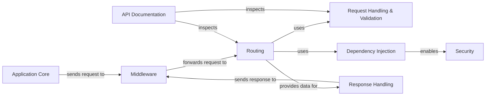

⏱️ **예상 읽기 시간**: 15분

## 서론

복잡한 코드베이스를 이해하는 것은 개발자에게 가장 어려운 과제 중 하나입니다. 특히 새로운 프로젝트에 투입되거나, 레거시 코드를 리팩토링해야 할 때 코드의 전체적인 구조와 의존성을 파악하는 것은 시간이 많이 소요되는 작업입니다.

**CodeBoarding**은 이런 문제를 해결하기 위해 개발된 오픈소스 도구로, 정적 분석과 LLM을 활용하여 코드베이스를 인터랙티브한 Mermaid 다이어그램으로 자동 변환해줍니다.

### CodeBoarding의 핵심 기능

- 🔍 **정적 분석**: AST 파싱과 LSP 서버를 통한 정확한 코드 분석
- 🤖 **AI 지원**: LLM을 활용한 지능적인 모듈 분류 및 관계 추출
- 📊 **다이어그램 생성**: 인터랙티브한 Mermaid 다이어그램 자동 생성
- 🔗 **통합 지원**: VS Code 확장, GitHub Action, MCP 서버 제공
- 🌐 **다양한 언어**: Python, TypeScript/JavaScript 지원

### 지원되는 프로그래밍 언어

현재 CodeBoarding은 다음 언어들을 지원합니다:
- **Python** (.py, .pyi)
- **TypeScript/JavaScript** (.ts, .tsx, .js, .jsx)

## 1. 설치 및 환경 설정

### 1.1 시스템 요구사항

macOS/Linux 환경에서의 설치 과정을 안내합니다:

```bash
# macOS
brew install cmake pkg-config icu4c
gem install github-linguist

# Xcode Command Line Tools 설치 (macOS)
xcode-select --install

# Linux (Ubuntu/Debian)
sudo apt-get install build-essential cmake pkg-config libicu-dev zlib1g-dev libcurl4-openssl-dev libssl-dev ruby-dev
gem install github-linguist
```

### 1.2 프로젝트 클론 및 의존성 설치

```bash
# 프로젝트 클론
git clone https://github.com/CodeBoarding/CodeBoarding.git
cd CodeBoarding

# Python 가상환경 생성
python3 -m venv venv
source venv/bin/activate  # Windows: venv\Scripts\activate

# 의존성 설치
pip install -r requirements.txt
```

### 1.3 Language Server 설치

코드 분석의 정확도를 위해 Language Server가 필요합니다:

```bash
# Python 분석용
pip install pyright

# TypeScript/JavaScript 분석용
npm install --save-dev typescript-language-server typescript
```

### 1.4 환경 변수 설정

LLM 프로바이더 중 하나를 선택하여 API 키를 설정합니다:

```bash
# OpenAI 사용 시
export OPENAI_API_KEY="your-openai-api-key"

# Anthropic Claude 사용 시
export ANTHROPIC_API_KEY="your-anthropic-api-key"

# Google Gemini 사용 시 (추천)
export GOOGLE_API_KEY="your-google-api-key"

# 로컬 Ollama 사용 시
export OLLAMA_BASE_URL="http://localhost:11434"

# 기본 설정
export REPO_ROOT="./repos"
export ROOT_RESULT="./results"
export DIAGRAM_DEPTH_LEVEL=1
export STATIC_ANALYSIS_CONFIG="./static_analysis_config.yml"
export CACHING_DOCUMENTATION=false
```

> 💡 **Tip**: Google Gemini-2.5-Pro가 복잡한 다이어그램 생성에서 가장 좋은 결과를 보여줍니다.

## 2. 기본 사용법

### 2.1 첫 번째 다이어그램 생성

간단한 Python 프로젝트로 테스트해보겠습니다:

```bash
# 기본 사용법
python demo.py https://github.com/username/repository

# 출력 디렉토리 지정
python demo.py https://github.com/fastapi/fastapi --output-dir ./diagrams

# 여러 저장소 동시 분석
python demo.py https://github.com/repo1 https://github.com/repo2 --output-dir ./output
```

### 2.2 로컬 프로젝트 분석

이미 로컬에 있는 프로젝트를 분석하려면:

```bash
# 로컬 Git 저장소 분석
python demo.py file:///absolute/path/to/your/project --output-dir ./results
```

### 2.3 생성된 결과물 확인

분석이 완료되면 다음과 같은 파일들이 생성됩니다:

```
results/
├── project-name/
│   ├── on_boarding.md          # 메인 다이어그램
│   ├── Module_Name.md          # 각 모듈별 상세 문서
│   └── ...
```

## 3. 실제 사용 예시

### 3.1 FastAPI 프로젝트 분석

실제로 유명한 오픈소스 프로젝트를 분석해보겠습니다:

```bash
python demo.py https://github.com/tiangolo/fastapi --output-dir ./fastapi-analysis
```

생성된 다이어그램 예시:



### 3.2 분석 결과 해석

CodeBoarding이 생성하는 다이어그램의 구성 요소:

1. **모듈 식별**: 기능별로 코드를 논리적 모듈로 그룹화
2. **의존성 관계**: 모듈 간의 호출 관계와 데이터 흐름
3. **클릭 가능한 링크**: 각 모듈을 클릭하면 상세 정보 확인 가능
4. **계층적 구조**: 복잡한 시스템을 단계별로 표현

## 4. VS Code 확장 프로그램 활용

### 4.1 확장 프로그램 설치

VS Code 마켓플레이스에서 "CodeBoarding" 확장을 설치합니다:

1. VS Code 실행
2. 확장(Extensions) 탭 클릭 (Ctrl+Shift+X)
3. "CodeBoarding" 검색 후 설치
4. VS Code 재시작

### 4.2 IDE 내에서 다이어그램 생성

```bash
# 명령 팔레트 열기 (Ctrl+Shift+P)
# "CodeBoarding: Generate Diagram" 실행
```

### 4.3 실시간 다이어그램 업데이트

코드 변경 시 자동으로 다이어그램을 업데이트하는 설정:

```json
// settings.json
{
    "codeboarding.autoUpdate": true,
    "codeboarding.updateInterval": 30000,
    "codeboarding.outputPath": "./docs/diagrams"
}
```

## 5. GitHub Action 통합

### 5.1 워크플로우 설정

프로젝트에 `.github/workflows/codeboarding.yml` 파일을 생성합니다:

```yaml
name: CodeBoarding Documentation

on:
  push:
    branches: [ main, develop ]
  pull_request:
    branches: [ main ]

jobs:
  generate-diagrams:
    runs-on: ubuntu-latest
    
    steps:
    - uses: actions/checkout@v4
      with:
        fetch-depth: 0
    
    - name: Setup Python
      uses: actions/setup-python@v4
      with:
        python-version: '3.11'
    
    - name: Install CodeBoarding
      run: |
        git clone https://github.com/CodeBoarding/CodeBoarding.git
        cd CodeBoarding
        pip install -r requirements.txt
        sudo apt-get install -y ruby-dev
        gem install github-linguist
        npm install -g typescript-language-server typescript
        pip install pyright
    
    - name: Generate Diagrams
      env:
        GOOGLE_API_KEY: ${{ secrets.GOOGLE_API_KEY }}
        REPO_ROOT: ./repos
        ROOT_RESULT: ./docs/diagrams
      run: |
        cd CodeBoarding
        python demo.py ${{ github.server_url }}/${{ github.repository }} --output-dir ../docs/diagrams
    
    - name: Commit and Push
      run: |
        git config --local user.email "action@github.com"
        git config --local user.name "GitHub Action"
        git add docs/diagrams/
        git diff --staged --quiet || git commit -m "Update CodeBoarding diagrams [skip ci]"
        git push
```

### 5.2 시크릿 설정

GitHub 저장소 설정에서 API 키를 시크릿으로 추가:

1. 저장소 → Settings → Secrets and variables → Actions
2. "New repository secret" 클릭
3. Name: `GOOGLE_API_KEY`, Value: 실제 API 키 입력

## 6. 실무 활용 전략

### 6.1 코드 리뷰 개선

Pull Request에 자동으로 다이어그램을 포함시켜 리뷰어의 이해도를 높입니다:

```bash
# PR 템플릿에 다이어그램 섹션 추가
## Architecture Changes


### Affected Modules
- Module A: 새로운 기능 추가
- Module B: 의존성 변경
```

### 6.2 팀 온보딩 가속화

새로운 팀원을 위한 문서화:

```markdown
# 프로젝트 아키텍처 가이드

## 전체 구조


## 핵심 모듈
1. **데이터 레이어**: 데이터베이스 및 ORM 관련
2. **비즈니스 로직**: 핵심 기능 구현
3. **API 레이어**: 외부 인터페이스 제공

[CodeBoarding 다이어그램으로 상세히 보기](./docs/diagrams/)
```

### 6.3 리팩토링 계획 수립

기존 코드의 복잡도를 시각화하여 리팩토링 우선순위 결정:

```bash
# 리팩토링 전후 비교
python demo.py ./legacy-code --output-dir ./before-refactor
# 리팩토링 후
python demo.py ./refactored-code --output-dir ./after-refactor
```

### 6.4 문서 자동화

README.md 파일에 다이어그램 자동 삽입:

```python
# update_readme.py
import re

def update_readme_with_diagram():
    with open('README.md', 'r') as f:
        content = f.read()
    
    diagram_section = """
## Architecture Overview
```mermaid
{diagram_content}
```
"""
    
    # 기존 다이어그램 섹션 교체
    updated_content = re.sub(
        r'## Architecture Overview.*?```\n',
        diagram_section,
        content,
        flags=re.DOTALL
    )
    
    with open('README.md', 'w') as f:
        f.write(updated_content)
```

## 7. 고급 설정 및 커스터마이징

### 7.1 정적 분석 설정 커스터마이징

`static_analysis_config.yml` 파일을 수정하여 분석 동작을 조정할 수 있습니다:

```yaml
# LSP Server Configuration
lsp_servers:
  python:
    name: "Pyright Language Server"
    command: ["pyright-langserver", "--stdio"]
    languages: ["python"]
    file_extensions: [".py", ".pyi"]
    install_commands: "pip install pyright"

  typescript:
    name: "TypeScript Language Server"  
    command: ["./node_modules/.bin/typescript-language-server", "--stdio", "--log-level=2"]
    languages: ["typescript", "javascript"]
    file_extensions: [".ts", ".tsx", ".js", ".jsx"]
    install_commands: "npm install --save-dev typescript-language-server typescript"

# External tools configuration
tools:
  github_linguist:
    name: "GitHub Linguist"
    command: ["github-linguist", "-b", "-j"]
    description: "Analyze repository languages and file types"
    install_command: "gem install github-linguist"
    output_format: "json"
```

### 7.2 다이어그램 깊이 조절

복잡한 프로젝트의 경우 다이어그램 깊이를 조절할 수 있습니다:

```bash
# 간단한 개요만 생성 (깊이 1)
export DIAGRAM_DEPTH_LEVEL=1

# 상세한 분석 (깊이 2-3)
export DIAGRAM_DEPTH_LEVEL=3
```

### 7.3 캐싱 활용

대형 프로젝트 분석 시 캐싱을 활용하여 속도를 향상시킵니다:

```bash
export CACHING_DOCUMENTATION=true
```

### 7.4 로컬 LLM 활용

개인정보 보호가 중요한 프로젝트에서는 로컬 LLM을 사용합니다:

```bash
# Ollama 설치 및 실행
brew install ollama
ollama serve

# 모델 다운로드
ollama pull qwen2.5:7b

# 환경 변수 설정
export OLLAMA_BASE_URL=http://localhost:11434
```

## 8. 문제 해결 가이드

### 8.1 자주 발생하는 오류들

#### Language Server 연결 실패
```bash
# 해결방법: Language Server 재설치
pip install --upgrade pyright
npm install -g typescript-language-server@latest
```

#### 상대 경로 오류
```bash
# 해결방법: 절대 경로 사용
export PROJECT_ROOT="/absolute/path/to/CodeBoarding"
export REPO_ROOT="/absolute/path/to/repos"
```

#### 모델 없음 오류 (Ollama)
```bash
# 해결방법: 모델 확인 및 다운로드
ollama list
ollama pull qwen2.5:7b
```

### 8.2 성능 최적화

대형 코드베이스 분석 시 성능 개선 방법:

1. **파일 필터링**: `.gitignore` 패턴 활용
2. **병렬 처리**: 멀티스레딩 옵션 활성화
3. **캐싱 활용**: 중간 결과 저장
4. **메모리 관리**: 배치 크기 조절

### 8.3 디버깅 모드

상세한 로그를 확인하려면:

```bash
# 디버그 로그 활성화
export PYTHONPATH=$PYTHONPATH:$(pwd)
python -m logging.debug demo.py https://github.com/your/repo
```

## 9. 실제 프로젝트 적용 사례

### 9.1 마이크로서비스 아키텍처 시각화

```bash
# 각 서비스별로 다이어그램 생성
python demo.py https://github.com/company/user-service --output-dir ./diagrams/user-service
python demo.py https://github.com/company/order-service --output-dir ./diagrams/order-service
python demo.py https://github.com/company/payment-service --output-dir ./diagrams/payment-service
```

### 9.2 레거시 코드 분석

오래된 코드베이스의 구조를 파악하여 현대적인 아키텍처로 마이그레이션:

```bash
# 레거시 시스템 분석
python demo.py ./legacy-monolith --output-dir ./legacy-analysis

# 마이그레이션 계획 수립을 위한 의존성 분석
# 생성된 다이어그램을 바탕으로 서비스 분리 전략 수립
```

### 9.3 CI/CD 파이프라인 통합

```yaml
# .github/workflows/code-analysis.yml
name: Code Analysis & Documentation

on:
  schedule:
    - cron: '0 2 * * 1'  # 매주 월요일 오전 2시
  workflow_dispatch:

jobs:
  analyze:
    runs-on: ubuntu-latest
    steps:
    - name: Generate Architecture Docs
      run: |
        python codeboarding/demo.py $GITHUB_SERVER_URL/$GITHUB_REPOSITORY
        
    - name: Deploy to GitHub Pages
      uses: peaceiris/actions-gh-pages@v3
      with:
        github_token: ${{ secrets.GITHUB_TOKEN }}
        publish_dir: ./docs
```

## 10. 커뮤니티 및 확장

### 10.1 오픈소스 기여

CodeBoarding 프로젝트에 기여하는 방법:

1. **버그 리포트**: GitHub Issues에 문제 보고
2. **기능 제안**: 새로운 기능에 대한 아이디어 제안
3. **코드 기여**: Pull Request를 통한 개선사항 제출
4. **문서화**: 사용 가이드 및 예제 작성

### 10.2 플러그인 개발

CodeBoarding의 기능을 확장하는 플러그인 개발:

```python
# custom_analyzer.py
from static_analyzer.base import BaseAnalyzer

class CustomLanguageAnalyzer(BaseAnalyzer):
    def __init__(self, language: str):
        super().__init__(language)
    
    def analyze(self, file_path: str):
        # 커스텀 분석 로직 구현
        pass
```

### 10.3 템플릿 및 프리셋

팀별 표준 템플릿 만들기:

```yaml
# team-config.yml
analysis:
  ignore_patterns:
    - "*/tests/*"
    - "*/migrations/*"
  
diagram:
  style: "corporate"
  colors:
    primary: "#1f77b4"
    secondary: "#ff7f0e"
  
output:
  format: ["mermaid", "png", "svg"]
  documentation: true
```

## 결론

CodeBoarding은 복잡한 코드베이스를 이해하고 문서화하는 혁신적인 도구입니다. 정적 분석과 AI의 결합으로 기존에는 시간이 오래 걸리던 아키텍처 문서화 작업을 자동화할 수 있게 되었습니다.

### 핵심 장점

1. **시간 절약**: 수동 문서화 대비 90% 이상 시간 단축
2. **정확성 향상**: 정적 분석을 통한 정확한 의존성 파악
3. **팀 협업 강화**: 시각적 자료로 더 나은 소통
4. **지속적 업데이트**: CI/CD 통합으로 자동 문서 갱신

### 향후 발전 방향

- **더 많은 언어 지원**: Go, Rust, Java 등 추가 예정
- **클라우드 서비스**: SaaS 형태의 서비스 제공
- **고급 분석**: 성능 병목 지점, 보안 취약점 분석
- **팀 협업 기능**: 실시간 공유 및 댓글 기능

CodeBoarding을 프로젝트에 도입하여 더 효율적인 개발 환경을 구축해보시기 바랍니다. 복잡한 코드도 한눈에 이해할 수 있는 아름다운 다이어그램으로 변환하여, 팀의 생산성을 크게 향상시킬 수 있을 것입니다.

---

**관련 링크:**
- [CodeBoarding GitHub 저장소](https://github.com/CodeBoarding/CodeBoarding)
- [생성된 다이어그램 예시 모음](https://github.com/CodeBoarding/GeneratedOnBoardings)
- [VS Code 확장 프로그램](https://marketplace.visualstudio.com/items?itemName=Codeboarding.codeboarding)
- [GitHub Action](https://github.com/marketplace/actions/codeboarding-diagram-first-documentation)
- [공식 웹사이트](https://www.codeboarding.org)

**다음 글에서는** CodeBoarding과 다른 코드 분석 도구들을 비교분석하고, 프로젝트 규모별 최적 활용법을 알아보겠습니다.
