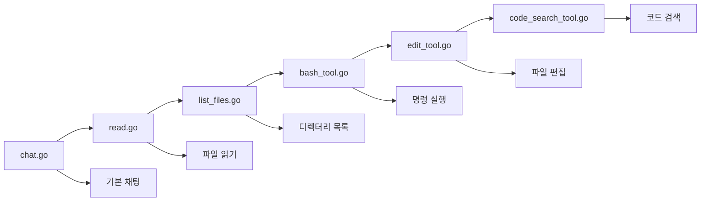

⏱️ **예상 읽기 시간**: 15분

## 서론: AI 코딩 에이전트의 부상

AI 개발 환경은 Cursor, Cline, Amp, Windsurf 같은 코딩 에이전트들에 의해 혁명적으로 변화했습니다. 이러한 도구들은 컨텍스트를 이해하고, 명령을 실행하며, 전체 코드베이스를 관리하는 지능적인 지원을 통해 개발자들이 코드를 작성, 디버깅, 유지보수하는 방식을 근본적으로 바꾸고 있습니다.

[Geoffrey Huntley의 워크샵 저장소](https://github.com/ghuntley/how-to-build-a-coding-agent)는 처음부터 코딩 에이전트를 구축하는 포괄적인 가이드를 제공합니다. 이 튜토리얼은 기본적인 채팅 기능부터 고급 코드 검색 기능까지 전체 과정을 안내해드립니다.

## 나만의 코딩 에이전트를 만드는 이유

### 기초 이해하기

자신만의 코딩 에이전트를 구축하면 여러 장점이 있습니다:

- **완전한 제어**: 에이전트 동작의 모든 측면을 커스터마이징
- **학습 기회**: AI 에이전트 아키텍처에 대한 깊은 이해
- **비용 최적화**: 특정 요구사항에 맞춘 리소스 사용
- **프라이버시**: 민감한 코드를 자체 인프라에서 보관
- **확장성**: 커스텀 도구와 통합 기능 추가

### 현대 코딩 에이전트의 핵심 기능

오늘날의 코딩 에이전트는 일반적으로 다음을 포함합니다:

1. **자연어 인터페이스**: 개발자와의 채팅 기반 상호작용
2. **파일 시스템 작업**: 프로젝트 파일 읽기, 쓰기, 관리
3. **코드 검색**: 고급 패턴 매칭과 코드 발견
4. **명령 실행**: 시스템 명령과 빌드 프로세스 실행
5. **컨텍스트 인식**: 프로젝트 구조와 의존성 이해

## 워크샵 아키텍처 개요

워크샵은 6개의 개별 애플리케이션으로 점진적 향상 접근법을 따르며, 각각은 이전 것을 기반으로 구축됩니다:



## 1단계: 기본 채팅 에이전트 (chat.go)

### 핵심 아키텍처

기초는 대화 루프 패턴을 확립하는 간단한 채팅 인터페이스로 시작합니다:

```go
type Agent struct {
    client      *anthropic.Client
    getUserMessage func() (string, bool)
    tools       []ToolDefinition
    verbose     bool
}
```

### 주요 학습 포인트

- **API 통합**: Anthropic Claude API에 직접 연결
- **대화 관리**: 채팅 히스토리와 컨텍스트 유지
- **오류 처리**: API 호출에 대한 견고한 오류 관리
- **사용자 인터페이스**: 터미널 기반 상호작용 패턴

### 구현 하이라이트

채팅 에이전트는 다음을 보여줍니다:
- 실시간 상호작용을 위한 스트리밍 응답
- 대화 상태 관리
- 기본적인 오류 복구 메커니즘
- 로깅과 디버깅 기능

## 2단계: 파일 읽기 에이전트 (read.go)

### 도구 통합 기초

이 단계는 모든 후속 에이전트의 중심이 되는 도구 시스템을 도입합니다:

```go
type ToolDefinition struct {
    Name        string
    Description string
    InputSchema ToolInputSchemaParam
    Function    func(input json.RawMessage) (string, error)
}
```

### 파일 읽기 도구 구현

```go
type ReadFileInput struct {
    Path string `json:"path" jsonschema:"description=읽을 파일 경로"`
}

func ReadFile(input json.RawMessage) (string, error) {
    var params ReadFileInput
    if err := json.Unmarshal(input, &params); err != nil {
        return "", err
    }
    
    content, err := os.ReadFile(params.Path)
    if err != nil {
        return "", fmt.Errorf("파일 읽기 실패: %w", err)
    }
    
    return string(content), nil
}
```

### 도구 등록 패턴

워크샵은 도구 등록을 위한 일관된 패턴을 확립합니다:

```go
var readFileTool = ToolDefinition{
    Name:        "read_file",
    Description: "파일의 내용을 읽습니다",
    InputSchema: GenerateSchema[ReadFileInput](),
    Function:    ReadFile,
}
```

## 3단계: 파일 시스템 탐색 (list_files.go)

### 디렉터리 작업

파일 읽기를 기반으로, 이 단계는 디렉터리 순회 기능을 추가합니다:

```go
type ListFilesInput struct {
    Path string `json:"path" jsonschema:"description=목록을 표시할 디렉터리 경로"`
}
```

### 향상된 파일 관리

list files 도구는 다음을 제공합니다:
- 재귀적 디렉터리 스캔
- 파일 타입 필터링
- 경로 정규화
- 권한 및 접근 문제에 대한 오류 처리

### 다중 도구 조정

이 단계는 여러 도구가 함께 작동하는 방법을 보여줍니다:
- 콘텐츠 접근을 위한 `read_file`
- 발견을 위한 `list_files`
- 복잡한 작업을 위한 조정된 작업

## 4단계: 시스템 통합 (bash_tool.go)

### 명령 실행 기능

bash 도구는 시스템 레벨 작업을 도입합니다:

```go
type BashInput struct {
    Command string `json:"command" jsonschema:"description=실행할 bash 명령"`
}

func BashCommand(input json.RawMessage) (string, error) {
    var params BashInput
    if err := json.Unmarshal(input, &params); err != nil {
        return "", err
    }
    
    cmd := exec.Command("bash", "-c", params.Command)
    output, err := cmd.CombinedOutput()
    
    return string(output), err
}
```

### 안전성 및 보안 고려사항

워크샵은 중요한 보안 측면을 다룹니다:
- 명령 검증 및 무해화
- 출력 캡처 및 오류 처리
- 프로세스 관리 및 타임아웃
- 권한 및 접근 제어

### 실제 응용 프로그램

명령 실행으로 에이전트는 다음을 할 수 있습니다:
- 빌드 프로세스와 테스트 실행
- 의존성과 패키지 설치
- git 작업 실행
- 시스템 진단 수행

## 5단계: 코드 편집 (edit_tool.go)

### 파일 수정 엔진

편집 도구는 상당한 기능 도약을 나타냅니다:

```go
type EditFileInput struct {
    Path   string `json:"path" jsonschema:"description=편집할 파일 경로"`
    OldStr string `json:"old_str" jsonschema:"description=교체할 문자열"`
    NewStr string `json:"new_str" jsonschema:"description=대체 문자열"`
}
```

### 검증 및 안전성

편집 도구는 여러 안전 메커니즘을 구현합니다:
- 수정 전 콘텐츠 검증
- 롤백 기능을 위한 백업 생성
- 부분 편집을 방지하는 원자적 작업
- 변경 추적을 위한 diff 생성

### 고급 편집 기능

주요 기능은 다음과 같습니다:
- 정확한 문자열 교체
- 다중 라인 콘텐츠 처리
- 들여쓰기 보존
- 인코딩 및 문자 집합 관리

## 6단계: 코드 발견 (code_search_tool.go)

### Ripgrep 통합

마지막 단계는 ripgrep을 사용한 강력한 코드 검색을 추가합니다:

```go
type CodeSearchInput struct {
    Pattern       string `json:"pattern" jsonschema:"description=검색 패턴"`
    Path          string `json:"path,omitempty" jsonschema:"description=검색 경로"`
    FileType      string `json:"file_type,omitempty" jsonschema:"description=파일 타입 필터"`
    CaseSensitive bool   `json:"case_sensitive,omitempty" jsonschema:"description=대소문자 구분 검색"`
}
```

### 고급 검색 기능

코드 검색 도구는 다음을 제공합니다:
- 정규 표현식 패턴 매칭
- 타겟 검색을 위한 파일 타입 필터링
- 대소문자 구분 옵션
- 컨텍스트 라인 포함
- 대용량 코드베이스를 위한 성능 최적화

### 검색 전략 패턴

일반적인 검색 패턴은 다음과 같습니다:
- 함수 및 메서드 정의
- 변수 및 상수 선언
- import 및 의존성 분석
- TODO 및 FIXME 주석 발견
- 오류 처리 패턴 식별

## 개발 환경 설정

### 전제 조건 및 의존성

워크샵은 현대적인 개발 관행을 사용합니다:

```yaml
# devenv.yaml
name: coding-agent-workshop
starship: true

imports:
  - devenv-nixpkgs

env:
  ANTHROPIC_API_KEY: "your-api-key-here"

languages:
  go:
    enable: true
    package: "go_1_24"
```

### 환경의 이점

devenv 사용은 다음을 제공합니다:
- 재현 가능한 개발 환경
- 자동 의존성 관리
- 크로스 플랫폼 호환성
- 팀 멤버 간 버전 일관성

## 도구 시스템 아키텍처 심화

### 스키마 생성

워크샵은 자동 JSON 스키마 생성을 보여줍니다:

```go
func GenerateSchema[T any]() ToolInputSchemaParam {
    schema := jsonschema.Reflect(&struct{ T }{})
    return ToolInputSchemaParam{
        Type:       "object",
        Properties: schema.Properties,
        Required:   schema.Required,
    }
}
```

### 이벤트 루프 패턴

모든 에이전트는 일관된 이벤트 루프를 따릅니다:

1. **사용자 입력**: 사용자 명령 수락 및 검증
2. **컨텍스트 구축**: 대화 히스토리 조합
3. **API 요청**: 사용 가능한 도구와 함께 Claude에 요청 전송
4. **도구 실행**: 도구 사용 요청 처리
5. **결과 통합**: 도구 출력과 AI 응답 결합
6. **응답 전달**: 최종 결과를 사용자에게 제시

### 오류 처리 전략

워크샵은 포괄적인 오류 처리를 구현합니다:
- 입력 검증 및 무해화
- API 오류 복구 및 재시도 로직
- 도구 실행 타임아웃 관리
- 사용자 친화적인 오류 메시지
- 디버깅 및 로깅 기능

## 고급 기능 및 확장

### 상세 로깅

모든 애플리케이션은 디버깅을 위한 상세 모드를 지원합니다:

```bash
go run edit_tool.go --verbose
```

이는 다음에 대한 상세한 인사이트를 제공합니다:
- API 호출 타이밍 및 성능
- 도구 실행 추적
- 파일 작업 세부사항
- 오류 진단 정보

### 커스텀 도구 개발

프레임워크는 쉬운 도구 확장을 지원합니다:

```go
func CustomTool(input json.RawMessage) (string, error) {
    // 커스텀 도구 구현
    return result, nil
}

var customToolDef = ToolDefinition{
    Name:        "custom_tool",
    Description: "커스텀 기능",
    InputSchema: GenerateSchema[CustomInput](),
    Function:    CustomTool,
}
```

## 테스트 및 검증

### 샘플 파일

저장소는 실험을 위한 테스트 파일을 포함합니다:
- `fizzbuzz.js`: 편집 연습용 JavaScript 코드
- `riddle.txt`: 읽기 테스트용 텍스트 콘텐츠
- `AGENT.md`: 분석용 문서

### 테스트 시나리오

권장되는 테스트 접근법:

1. **기본 기능**: 파일 읽기 및 목록
2. **시스템 통합**: 명령 실행 및 출력 캡처
3. **코드 수정**: 안전한 편집 및 검증
4. **검색 작업**: 패턴 매칭 및 발견
5. **오류 조건**: 실패 및 경계 사례 처리

## 프로덕션 고려사항

### 보안 모범 사례

코딩 에이전트 배포 시:
- 적절한 인증 및 권한 부여 구현
- 모든 사용자 입력 및 명령 무해화
- 샌드박스 실행 환경 사용
- 모든 에이전트 활동 모니터링 및 로깅
- 속도 제한 및 사용 제어 구현

### 성능 최적화

주요 최적화 전략:
- 자주 접근하는 파일과 검색 결과 캐싱
- 대용량 코드베이스를 위한 지연 로딩 구현
- 긴 작업을 위한 스트리밍 응답 사용
- 도구 실행 순서 및 병렬화 최적화
- 메모리 사용량 모니터링 및 리소스 정리

### 확장성 계획

대규모 배포를 위해:
- 로드 밸런싱을 통한 수평 확장 구현
- 공유 상태를 위한 분산 캐싱 사용
- 도구 격리를 위한 마이크로서비스 아키텍처 고려
- 동시 사용자 세션 계획
- 적절한 모니터링 및 관찰성 구현

## 일반적인 문제 및 문제해결

### API 통합 문제

일반적인 문제와 해결책:
- **속도 제한**: 지수 백오프 구현
- **인증**: API 키 구성 확인
- **네트워크 문제**: 회로 차단기를 통한 재시도 로직 추가
- **응답 파싱**: JSON 스키마 호환성 검증

### 도구 실행 과제

일반적인 문제:
- **권한 오류**: 파일 시스템 권한 확인
- **경로 문제**: 파일 경로 정규화 및 검증
- **명령 실패**: 적절한 오류 캡처 구현
- **리소스 제한**: 메모리 및 CPU 사용량 모니터링

## 다음 단계 및 고급 주제

### 기능 향상

추가 고려사항:
- 외부 콘텐츠를 위한 웹 스크래핑 기능
- 영구 저장을 위한 데이터베이스 통합
- 외부 서비스를 위한 API 통합
- Go 이외의 다국어 지원
- 비기술 사용자를 위한 GUI 인터페이스

### 아키텍처 진화

탐구할 고급 패턴:
- 메시지 큐를 사용한 이벤트 기반 아키텍처
- 확장 가능한 기능을 위한 플러그인 시스템
- 분산 에이전트 조정
- 행동 적응을 위한 머신러닝 통합
- 실시간 협업 기능

## 실행 가능 테스트 스크립트

### macOS 환경 설정 스크립트

```bash
#!/bin/bash
# setup-coding-agent.sh
# 코딩 에이전트 워크샵 환경 설정

set -e

echo "🚀 코딩 에이전트 워크샵 환경 설정 시작..."

# Go 설치 확인
if ! command -v go &> /dev/null; then
    echo "❌ Go가 설치되어 있지 않습니다."
    echo "https://golang.org/dl/ 에서 Go를 설치하세요."
    exit 1
fi

# Go 버전 확인
GO_VERSION=$(go version | awk '{print $3}' | sed 's/go//')
REQUIRED_VERSION="1.24.0"

if [[ "$(printf '%s\n' "$REQUIRED_VERSION" "$GO_VERSION" | sort -V | head -n1)" != "$REQUIRED_VERSION" ]]; then
    echo "❌ Go 버전이 $REQUIRED_VERSION 이상이어야 합니다. 현재: $GO_VERSION"
    exit 1
fi

# 워크샵 저장소 클론
WORKSHOP_DIR="coding-agent-workshop"
if [ ! -d "$WORKSHOP_DIR" ]; then
    echo "📦 워크샵 저장소 클론 중..."
    git clone https://github.com/ghuntley/how-to-build-a-coding-agent.git "$WORKSHOP_DIR"
fi

cd "$WORKSHOP_DIR"

# 의존성 설치
echo "📚 의존성 설치 중..."
go mod tidy

# API 키 설정 확인
if [ -z "$ANTHROPIC_API_KEY" ]; then
    echo "⚠️  ANTHROPIC_API_KEY 환경 변수를 설정해주세요."
    echo "export ANTHROPIC_API_KEY='your-api-key-here'"
    echo ""
fi

# 테스트 파일 생성
echo "📝 테스트 파일 생성 중..."

cat > test-example.py << 'EOF'
# Python 예제 파일
def fibonacci(n):
    """피보나치 수열을 계산합니다."""
    if n <= 1:
        return n
    return fibonacci(n-1) + fibonacci(n-2)

def main():
    """메인 함수"""
    for i in range(10):
        print(f"fibonacci({i}) = {fibonacci(i)}")

if __name__ == "__main__":
    main()
EOF

cat > test-riddle.txt << 'EOF'
나는 갈기가 있지만 사자가 아니고,
네 다리가 있지만 테이블이 아니며,
달릴 수 있지만 사람이 아닙니다.
나는 무엇일까요?

답: 말
EOF

echo "✅ 환경 설정이 완료되었습니다!"
echo ""
echo "🎯 사용 방법:"
echo "1. 기본 채팅: go run chat.go"
echo "2. 파일 읽기: go run read.go"
echo "3. 파일 목록: go run list_files.go"
echo "4. 명령 실행: go run bash_tool.go"
echo "5. 파일 편집: go run edit_tool.go"
echo "6. 코드 검색: go run code_search_tool.go"
echo ""
echo "🔍 상세 로깅: --verbose 플래그 사용"
echo "예: go run edit_tool.go --verbose"
```

### 테스트 실행 스크립트

```bash
#!/bin/bash
# test-agent-features.sh
# 코딩 에이전트 기능 테스트

set -e

echo "🧪 코딩 에이전트 기능 테스트 시작..."

# API 키 확인
if [ -z "$ANTHROPIC_API_KEY" ]; then
    echo "❌ ANTHROPIC_API_KEY가 설정되지 않았습니다."
    exit 1
fi

# 테스트 함수들
test_file_reading() {
    echo "📖 파일 읽기 테스트..."
    timeout 30s go run read.go << 'EOF' || echo "타임아웃 또는 오류 발생"
test-riddle.txt 파일을 읽어주세요.
ctrl-c
EOF
}

test_file_listing() {
    echo "📂 파일 목록 테스트..."
    timeout 30s go run list_files.go << 'EOF' || echo "타임아웃 또는 오류 발생"
현재 디렉터리의 파일 목록을 보여주세요.
ctrl-c
EOF
}

test_command_execution() {
    echo "⚡ 명령 실행 테스트..."
    timeout 30s go run bash_tool.go << 'EOF' || echo "타임아웃 또는 오류 발생"
현재 시간을 출력해주세요.
ctrl-c
EOF
}

test_code_search() {
    echo "🔍 코드 검색 테스트..."
    timeout 30s go run code_search_tool.go << 'EOF' || echo "타임아웃 또는 오류 발생"
Go 파일에서 func 키워드를 찾아주세요.
ctrl-c
EOF
}

# 테스트 실행
test_file_reading
test_file_listing
test_command_execution
test_code_search

echo "✅ 모든 테스트가 완료되었습니다!"
```

## 결론

코딩 에이전트를 처음부터 구축하는 것은 AI 지원 개발에 대한 귀중한 통찰력을 제공합니다. [how-to-build-a-coding-agent 워크샵](https://github.com/ghuntley/how-to-build-a-coding-agent)은 기본 채팅 기능부터 완전한 기능을 갖춘 코딩 어시스턴트까지 구조적이고 점진적인 접근법을 제공합니다.

6단계 진행—간단한 대화부터 고급 코드 검색까지—은 복잡한 AI 시스템을 점진적으로 구축할 수 있는 방법을 보여줍니다. 각 단계는 이전 기초를 바탕으로 구축하면서 필수적인 개념을 도입하여 에이전트 아키텍처에 대한 포괄적인 이해를 만들어냅니다.

### 핵심 요점

1. **점진적 개발**: 간단하게 시작하고 점진적으로 복잡성 추가
2. **도구 중심 설계**: 재사용 가능하고 조합 가능한 도구 시스템 구축
3. **안전 우선**: 전체적으로 검증 및 오류 처리 구현
4. **실제 테스트**: 실용적인 예제와 경계 사례 사용
5. **프로덕션 준비**: 보안, 성능, 확장성 고려

현대 개발 환경은 점점 더 AI 기반 도구에 의존하고 있습니다. 이러한 에이전트를 구축하고 커스터마이징하는 방법을 이해하면 이 기술적 진화의 최전선에 설 수 있습니다. 내부 도구를 구축하거나, 오픈소스 프로젝트에 기여하거나, 상용 제품을 만들든 관계없이, 이 워크샵에서 보여주는 원칙과 관행은 성공을 위한 견고한 기반을 제공합니다.

기본 채팅 에이전트로 시작하여 각 단계를 체계적으로 진행하면 곧 자신의 특정 요구사항과 워크플로우에 맞춘 정교한 코딩 에이전트를 갖게 될 것입니다.
