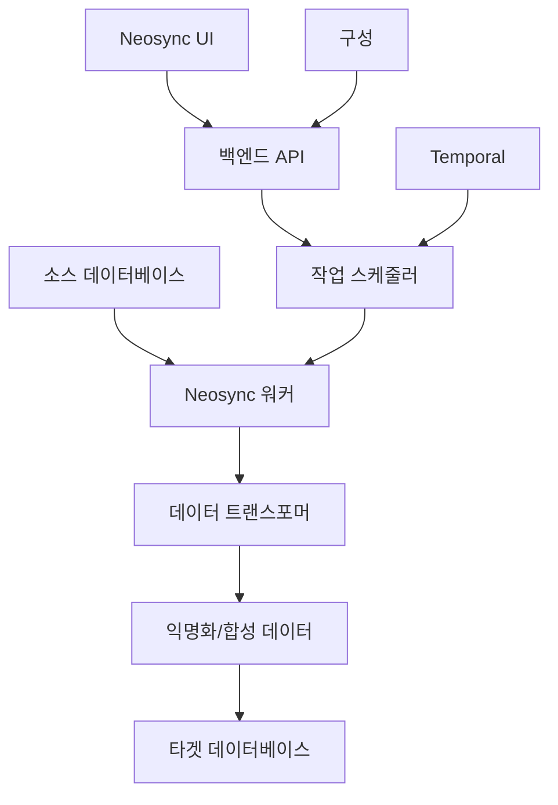

⏱️ **예상 읽기 시간**: 15분

## Neosync 소개 및 개요

[**Neosync**](https://github.com/nucleuscloud/neosync)는 민감한 데이터 처리 방식을 혁신하는 오픈소스, 개발자 중심 플랫폼입니다. **데이터 익명화**, **합성 데이터 생성**, **환경 동기화**를 위한 포괄적 솔루션을 제공하여 기업이 개인정보보호법(GDPR), HIPAA, FERPA 등의 규정을 준수하면서도 프로덕션 수준의 데이터로 안전하게 테스트할 수 있도록 돕습니다.

### Neosync가 중요한 이유

오늘날 데이터 중심 개발 환경에서 개발자들은 테스트, 디버깅, 개발을 위해 현실적인 데이터에 접근해야 합니다. 하지만 실제 프로덕션 데이터를 사용하는 것은 심각한 보안 및 컴플라이언스 위험을 초래합니다. Neosync는 다음과 같은 방법으로 이러한 격차를 해소합니다:

1. **안전한 프로덕션 데이터 테스트** - 로컬 개발을 위한 민감한 프로덕션 데이터 익명화
2. **프로덕션 버그 재현** - 디버깅을 위한 안전하고 대표적인 데이터셋 생성
3. **고품질 테스트 데이터** - 스테이징 및 QA 환경을 위한 프로덕션 수준 데이터 생성
4. **컴플라이언스 솔루션** - GDPR, HIPAA, FERPA 규정의 컴플라이언스 범위 축소
5. **개발 데이터베이스 시딩** - 단위 테스트 및 데모를 위한 합성 데이터 생성

### 핵심 기능 개요

- **스키마 기반 합성 데이터 생성** - 기존 스키마를 기반으로 한 데이터 생성
- **프로덕션 데이터 익명화** - 참조 무결성을 보존하면서 데이터 변환
- **데이터베이스 서브셋팅** - SQL 쿼리를 사용한 집중적 테스트
- **비동기 파이프라인 아키텍처** - 자동 재시도 및 실패 처리
- **GitOps 통합** - 선언적 구성 관리
- **내장 트랜스포머** - 주요 데이터 타입용 변환기 (이메일, 이름, 주소 등)
- **커스텀 트랜스포머** - JavaScript 또는 LLM을 활용한 사용자 정의 변환
- **다중 데이터베이스 지원** - PostgreSQL, MySQL, S3 통합

## 사전 준비사항 및 환경 설정

### 시스템 요구사항

이 튜토리얼을 시작하기 전에 다음이 준비되어 있는지 확인하세요:

- **Docker & Docker Compose** (최신 버전)
- **Git** (저장소 클론용)
- **PostgreSQL 클라이언트** (선택사항, 연결 테스트용)
- **웹 브라우저** (Neosync UI 접근용)
- **macOS, Linux, 또는 Windows** (WSL2 포함)

### 설치 단계

로컬 머신에 Neosync를 설정해보겠습니다:

#### 1단계: 저장소 클론

```bash
# Neosync 저장소 클론
git clone https://github.com/nucleuscloud/neosync.git
cd neosync

# 저장소 구조 확인
ls -la
```

#### 2단계: Neosync 서비스 시작

Neosync는 프로덕션 준비 Docker Compose 설정을 제공합니다:

```bash
# 모든 Neosync 서비스 시작
make compose/up

# 또는 Docker Compose를 직접 사용
docker compose up -d
```

이 명령은 다음과 같은 작업을 수행합니다:
- 필요한 모든 컨테이너를 다운로드하고 시작
- Neosync 메타데이터용 PostgreSQL 데이터베이스 설정
- Neosync 백엔드 API 실행
- 웹 프론트엔드 인터페이스 시작
- 샘플 연결 및 작업 초기화

#### 3단계: 설치 확인

```bash
# 실행 중인 컨테이너 확인
docker compose ps

# 필요시 로그 확인
docker compose logs -f neosync-app
```

웹 브라우저에서 `http://localhost:3000`으로 Neosync에 접근하세요.

## Neosync 아키텍처 이해하기

### 핵심 구성요소

Neosync는 여러 상호 연결된 구성요소로 이루어져 있습니다:

1. **프론트엔드 (Next.js)** - 구성 및 모니터링을 위한 웹 인터페이스
2. **백엔드 API (Go)** - 핵심 비즈니스 로직 및 작업 오케스트레이션
3. **워커 서비스** - 데이터 처리 및 변환 작업 처리
4. **PostgreSQL 데이터베이스** - 메타데이터, 구성, 작업 상태 저장
5. **Temporal** - 안정적인 작업 실행을 위한 워크플로우 오케스트레이션

### 데이터 플로우 아키텍처



## 초기 구성 및 설정

### 대시보드 접근

1. 브라우저를 열고 `http://localhost:3000`으로 이동
2. Neosync 환영 대시보드가 표시됩니다
3. 시스템은 데모용 샘플 연결로 사전 구성되어 있습니다

### 연결(Connections) 이해하기

Neosync에서 **연결**은 데이터베이스 또는 스토리지 엔드포인트를 나타냅니다. 기본 설정에는 다음이 포함됩니다:

- **소스 연결** - 샘플 데이터가 있는 PostgreSQL 데이터베이스
- **대상 연결** - 익명화된 데이터를 위한 타겟 데이터베이스

### 샘플 데이터 개요

Neosync는 기능 시연을 위해 미리 채워진 샘플 데이터를 포함합니다:

```sql
-- 샘플 스키마 구조
CREATE TABLE users (
    id SERIAL PRIMARY KEY,
    first_name VARCHAR(50),
    last_name VARCHAR(50),
    email VARCHAR(100) UNIQUE,
    phone VARCHAR(20),
    birth_date DATE,
    salary DECIMAL(10,2)
);

CREATE TABLE orders (
    id SERIAL PRIMARY KEY,
    user_id INTEGER REFERENCES users(id),
    order_date TIMESTAMP,
    total_amount DECIMAL(10,2),
    status VARCHAR(20)
);
```

## 첫 번째 익명화 작업 생성하기

### 작업 구성 마법사

데이터 관계를 보존하면서 민감한 정보를 변환하는 데이터 익명화 작업을 생성해보겠습니다:

#### 1단계: 새 작업 생성

1. 네비게이션 메뉴에서 **"작업(Jobs)"** 클릭
2. **"작업 생성(Create Job)"** 선택
3. **"데이터 익명화(Data Anonymization)"** 작업 유형 선택
4. 작업 이름 설정: `user-data-anonymization`

#### 2단계: 소스 연결 구성

```yaml
# 소스 연결 설정
연결 유형: PostgreSQL
호스트: localhost
포트: 5432
데이터베이스: sample_db
사용자명: postgres
비밀번호: [compose에서 제공]
```

#### 3단계: 변환 규칙 정의

`users` 테이블에 대해 다음 변환을 구성하세요:

| 컬럼 | 트랜스포머 | 구성 |
|------|------------|------|
| `first_name` | 이름 생성 | 랜덤 생성 |
| `last_name` | 성 생성 | 랜덤 생성 |
| `email` | 이메일 변환 | 도메인 구조 보존 |
| `phone` | 전화번호 생성 | 형식: 010-XXXX-XXXX |
| `birth_date` | 날짜 변환 | ±5년 랜덤화 |
| `salary` | 숫자 변환 | ±20% 랜덤화 |

#### 4단계: 참조 무결성 보존

외래 키 관계 구성:

```yaml
# orders 테이블의 user_id 관계 유지
외래 키:
  - 소스 테이블: orders
    소스 컬럼: user_id
    참조 테이블: users
    참조 컬럼: id
    액션: preserve_relationship
```

#### 5단계: 작업 실행

```bash
# CLI를 통한 작업 실행 모니터링 (선택사항)
docker compose exec neosync-worker neosync jobs run --job-id=user-data-anonymization

# 또는 웹 인터페이스 사용
# 대시보드에서 "작업 실행(Run Job)" 클릭
```

## 합성 데이터 생성

### 합성 데이터셋 생성

Neosync는 스키마 제약조건에 맞는 완전히 합성적인 데이터를 생성할 수 있습니다:

#### 1단계: 스키마 분석

```sql
-- 기존 스키마 분석
SELECT 
    column_name,
    data_type,
    is_nullable,
    column_default
FROM information_schema.columns 
WHERE table_name = 'users';
```

#### 2단계: 합성 생성 구성

다음 설정으로 새 작업을 생성하세요:

```yaml
작업 유형: 합성 데이터 생성
타겟 행 수: 10000
데이터 분포:
  users:
    - first_name: weighted_random([common_korean_names])
    - last_name: weighted_random([korean_surnames])
    - email: generate_email(first_name, last_name)
    - age_distribution: normal(mean=35, std=12)
    - salary_distribution: lognormal(mean=75000000, std=25000000)  # 한국 원화 기준
```

#### 3단계: 고급 합성 패턴

```javascript
// 현실적인 이메일 생성을 위한 사용자 정의 트랜스포머
function generateEmail(firstName, lastName) {
    const domains = ['gmail.com', 'naver.com', 'kakao.com', 'company.co.kr'];
    const domain = domains[Math.floor(Math.random() * domains.length)];
    const username = `${firstName.toLowerCase()}.${lastName.toLowerCase()}`;
    return `${username}@${domain}`;
}

// 상관관계가 있는 데이터 생성
function generateSalary(experience, education) {
    const baseSalary = 30000000;  // 한국 기준 연봉
    const experienceMultiplier = experience * 2000000;
    const educationBonus = education === '석사' ? 10000000 : 
                          education === '박사' ? 20000000 : 0;
    
    return baseSalary + experienceMultiplier + educationBonus;
}
```

## 고급 데이터 변환

### 사용자 정의 JavaScript 트랜스포머

Neosync는 JavaScript를 사용한 사용자 정의 변환을 지원합니다:

```javascript
// 신용카드 번호 익명화
function anonymizeCreditCard(value) {
    if (!value || value.length < 4) return value;
    
    const lastFour = value.slice(-4);
    const masked = '*'.repeat(value.length - 4);
    return masked + lastFour;
}

// 지리적 지역을 보존하면서 주소 익명화
function anonymizeAddress(address, city, state) {
    return {
        street: generateRandomStreet(),
        city: city, // 지리적 분석을 위해 도시 보존
        state: state,
        zipCode: generateRandomZipInState(state)
    };
}

// 시간 패턴을 보존하면서 타임스탬프 익명화
function anonymizeTimestamp(timestamp) {
    const date = new Date(timestamp);
    const randomDays = Math.floor(Math.random() * 365) - 182; // ±6개월
    date.setDate(date.getDate() + randomDays);
    return date.toISOString();
}
```

### LLM 기반 변환

더 정교한 변환을 위해 Neosync는 대형 언어 모델과 통합할 수 있습니다:

```yaml
# LLM 트랜스포머 구성
트랜스포머: LLM_Transform
모델: gpt-3.5-turbo
프롬프트: |
  다음 고객 리뷰에서 개인정보를 제거하면서 
  감정과 핵심 제품 피드백은 보존하여 변환하세요:
  
  원본: "{review_text}"
  
  요구사항:
  - 특정 이름, 위치, 날짜 제거
  - 언급된 제품 기능 보존
  - 감정적 톤 유지
  - 리뷰 길이 유사하게 유지

Temperature: 0.3
Max_Tokens: 300
```

## 데이터베이스 통합 및 서브셋팅

### PostgreSQL 통합

프로덕션 데이터용 PostgreSQL 연결 구성:

```yaml
# 프로덕션 PostgreSQL 설정
연결:
  type: postgresql
  host: prod-db.company.com
  port: 5432
  database: production_db
  username: neosync_reader
  password: ${NEOSYNC_DB_PASSWORD}
  ssl_mode: require
  
# 안전을 위한 읽기 전용 권한
권한:
  - public.*에 대한 SELECT
  - 쓰기 권한 없음
```

### 데이터 서브셋팅 전략

테스트를 위한 집중된 데이터셋 생성:

```sql
-- 사용자 기반 서브셋팅
SELECT * FROM users 
WHERE created_at >= '2024-01-01' 
  AND account_type = 'premium'
LIMIT 1000;

-- 관계 인식 서브셋팅
WITH sample_users AS (
    SELECT id FROM users 
    WHERE region = 'KR-SEOUL' 
    LIMIT 500
)
SELECT o.* FROM orders o
JOIN sample_users su ON o.user_id = su.id
WHERE o.order_date >= '2024-01-01';

-- 참조 무결성을 가진 시간 기반 서브셋팅
SELECT * FROM events 
WHERE event_date BETWEEN '2024-07-01' AND '2024-07-31'
  AND user_id IN (
    SELECT id FROM users 
    WHERE last_active >= '2024-06-01'
  );
```

### MySQL 통합

```yaml
# MySQL 연결 구성
연결:
  type: mysql
  host: mysql-server.internal
  port: 3306
  database: app_database
  username: neosync_user
  password: ${MYSQL_PASSWORD}
  charset: utf8mb4
  
# MySQL 특정 설정
옵션:
  sql_mode: STRICT_TRANS_TABLES
  time_zone: Asia/Seoul
  max_connections: 10
```

## 워크플로우 자동화 및 GitOps

### 선언적 구성

재사용 가능한 작업 구성 생성:

```yaml
# .neosync/jobs/user-anonymization.yaml
apiVersion: neosync.dev/v1
kind: Job
metadata:
  name: user-data-anonymization
  namespace: development
spec:
  source:
    connection: prod-postgres
    tables:
      - users
      - user_profiles
      - user_preferences
  
  destination:
    connection: dev-postgres
    
  transformations:
    users:
      first_name:
        type: generate_first_name
      last_name:
        type: generate_last_name
      email:
        type: transform_email
        preserve_domain: true
      ssn:
        type: hash_value
        algorithm: sha256
    
    user_profiles:
      bio:
        type: llm_transform
        model: gpt-3.5-turbo
        prompt: "개인 세부 정보를 익명화하면서 전문적 정보는 보존"
  
  schedule:
    cron: "0 2 * * *"  # 매일 오전 2시
    timezone: Asia/Seoul
```

### CI/CD 통합

```yaml
# .github/workflows/data-sync.yml
name: Neosync 데이터 동기화

on:
  schedule:
    - cron: '0 6 * * 1'  # 매주 월요일 오전 6시
  workflow_dispatch:

jobs:
  sync-development-data:
    runs-on: ubuntu-latest
    steps:
      - uses: actions/checkout@v3
      
      - name: Neosync CLI 설정
        run: |
          curl -sSL https://install.neosync.dev | sh
          echo "$HOME/.neosync/bin" >> $GITHUB_PATH
      
      - name: 익명화 작업 실행
        env:
          NEOSYNC_API_TOKEN: ${{ secrets.NEOSYNC_API_TOKEN }}
          NEOSYNC_API_URL: ${{ secrets.NEOSYNC_API_URL }}
        run: |
          neosync jobs run \
            --job-config .neosync/jobs/user-anonymization.yaml \
            --wait-for-completion \
            --timeout 30m
      
      - name: 데이터 품질 검증
        run: |
          neosync validate \
            --connection dev-postgres \
            --check referential-integrity \
            --check data-quality
```

## 모니터링 및 관측가능성

### 작업 모니터링 대시보드

Neosync는 포괄적인 모니터링 기능을 제공합니다:

1. **작업 실행 상태** - 실시간 진행 상황 추적
2. **데이터 변환 메트릭** - 행 수, 변환률
3. **오류 추적** - 실패한 변환 및 재시도 로직
4. **성능 메트릭** - 실행 시간, 처리량 분석
5. **데이터 품질 검사** - 검증 결과 및 이상 탐지

### 메트릭 및 알림

```yaml
# 모니터링 구성
모니터링:
  메트릭:
    - job_duration_seconds
    - rows_processed_total
    - transformation_errors_total
    - data_quality_score
  
  알림:
    - name: job_failure
      condition: job_status == "failed"
      notification: slack_webhook
      
    - name: data_quality_degradation
      condition: data_quality_score < 0.95
      notification: email
      
    - name: long_running_job
      condition: job_duration_seconds > 3600
      notification: pagerduty
```

### 로그 분석

```bash
# 작업 실행 로그 보기
docker compose logs neosync-worker | grep "job_id=user-anonymization"

# 변환 성능 모니터링
docker compose logs neosync-worker | grep "transformation_stats"

# 오류 확인
docker compose logs neosync-worker | grep "ERROR"
```

## 보안 및 컴플라이언스

### 데이터 프라이버시 모범 사례

1. **최소 권한 원칙** - 필요한 최소한의 권한만 부여
2. **데이터 보존 정책** - 오래된 익명화 데이터 자동 삭제
3. **감사 로깅** - 모든 데이터 접근 및 변환 추적
4. **암호화** - 전송 중 및 저장된 데이터 암호화
5. **접근 제어** - 데이터 민감도 수준에 따른 역할 기반 접근

### GDPR 컴플라이언스 기능

```yaml
# GDPR 컴플라이언스 구성
GDPR:
  데이터주체권리:
    잊혀질권리:
      enabled: true
      retention_days: 90
      
    접근권:
      enabled: true
      response_time_days: 30
      
    데이터이동권:
      enabled: true
      export_formats: [json, csv, xml]
  
  동의관리:
    track_consent_changes: true
    consent_expiry_days: 365
    
  침해통지:
    enabled: true
    notification_time_hours: 72
```

### 개인정보보호법 컴플라이언스

```yaml
# 한국 개인정보보호법 컴플라이언스
개인정보보호법:
  개인정보식별:
    automatic_detection: true
    custom_patterns:
      - 주민등록번호: '\d{6}-\d{7}'
      - 휴대폰번호: '010-\d{4}-\d{4}'
      
  익명화방법:
    직접식별자제거: true
    통계적공개제어: true
    
  감사통제:
    모든접근로깅: true
    로그보존연수: 3
```

## 성능 최적화

### 병렬 처리 구성

```yaml
# 성능 최적화 설정
성능:
  워커동시성: 8
  배치크기: 1000
  메모리제한: "4Gi"
  
  데이터베이스연결:
    최대열림: 25
    최대유휴: 5
    연결수명: "5m"
  
  변환캐시:
    enabled: true
    size: "1Gi"
    ttl: "1h"
```

### 대용량 데이터셋 처리

```sql
-- 대용량 테이블을 위한 청크 처리
SELECT * FROM large_table 
WHERE id BETWEEN ? AND ?
ORDER BY id 
LIMIT 10000;

-- 메모리 효율적인 스트리밍
SET work_mem = '256MB';
SET maintenance_work_mem = '1GB';
```

## 문제 해결 가이드

### 일반적인 문제 및 해결책

#### 문제 1: 작업 타임아웃

```yaml
# 해결책: 타임아웃 증가 및 배치 크기 최적화
작업:
  timeout: 3600s  # 1시간
  batch_size: 500  # 작은 배치
  retry_attempts: 3
```

#### 문제 2: 메모리 문제

```bash
# 메모리 사용량 모니터링
docker stats neosync-worker

# 컨테이너 메모리 증가
docker compose up -d --scale neosync-worker=2
```

#### 문제 3: 연결 실패

```yaml
# 견고한 연결 구성
연결:
  retry_attempts: 5
  retry_delay: 30s
  connection_timeout: 60s
  read_timeout: 300s
```

### 디버그 모드

```bash
# 디버그 로깅 활성화
export NEOSYNC_LOG_LEVEL=debug
docker compose up -d

# 상세 로그 보기
docker compose logs -f neosync-worker | grep DEBUG
```

## 테스트 및 검증

Neosync 설정을 검증하기 위한 종합적인 테스트 스크립트를 생성해보겠습니다:

```bash
#!/bin/bash
# 파일: test-neosync-setup.sh

echo "🚀 Neosync 설정 테스트..."

# 테스트 1: 서비스 실행 확인
echo "📡 Neosync 서비스 확인 중..."
if curl -f http://localhost:3000/health > /dev/null 2>&1; then
    echo "✅ Neosync UI 접근 가능"
else
    echo "❌ Neosync UI 접근 불가"
    exit 1
fi

# 테스트 2: 데이터베이스 연결 확인
echo "🗄️ 데이터베이스 연결 테스트..."
docker compose exec neosync-app neosync connections test --connection-id=sample-postgres
if [ $? -eq 0 ]; then
    echo "✅ 데이터베이스 연결 성공"
else
    echo "❌ 데이터베이스 연결 실패"
fi

# 테스트 3: 샘플 익명화 작업 실행
echo "🔄 샘플 익명화 작업 실행 중..."
JOB_ID=$(docker compose exec neosync-app neosync jobs create \
    --name "test-anonymization" \
    --source-connection sample-postgres \
    --destination-connection sample-postgres-dest)

docker compose exec neosync-app neosync jobs run --job-id=$JOB_ID --wait

# 테스트 4: 익명화된 데이터 검증
echo "🔍 익명화된 데이터 검증 중..."
docker compose exec postgres psql -U postgres -d neosync -c \
    "SELECT COUNT(*) as anonymized_records FROM users_anonymized;"

echo "✅ Neosync 설정 테스트 완료!"
```

## 다음 단계 및 고급 사용법

### 프로덕션 배포

프로덕션 배포를 위해 고려사항:

1. **Kubernetes 배포** - 제공된 Helm 차트 사용
2. **고가용성** - 다중 워커 인스턴스 배포
3. **외부 데이터베이스** - 메타데이터용 관리형 PostgreSQL 사용
4. **비밀 관리** - HashiCorp Vault 또는 AWS Secrets Manager 통합
5. **로드 밸런싱** - 다중 인스턴스 간 API 요청 분산

### 통합 패턴

```yaml
# 마이크로서비스 통합
서비스:
  user-service:
    anonymization_job: user-data-anonymization
    schedule: "0 3 * * *"
    
  order-service:
    anonymization_job: order-data-anonymization
    depends_on: [user-service]
    
  analytics-service:
    synthetic_data_job: analytics-synthetic-data
    schema_source: production_analytics
```

### 사용자 정의 확장

```go
// Go에서 사용자 정의 트랜스포머
package transformers

type CustomTransformer struct {
    config TransformerConfig
}

func (t *CustomTransformer) Transform(value interface{}) (interface{}, error) {
    // 사용자 정의 변환 로직 구현
    return transformedValue, nil
}
```

## 결론

Neosync는 현대적인 데이터 프라이버시 및 테스트 과제에 대한 포괄적인 솔루션을 제공합니다. 적절한 데이터 익명화와 합성 데이터 생성을 구현함으로써 조직은 다음을 달성할 수 있습니다:

- **개발 가속화** - 프로덕션 수준 데이터에 대한 안전한 접근
- **데이터 품질 향상** - 현실적인 테스트 시나리오 및 엣지 케이스
- **컴플라이언스 보장** - 규제 업계를 위한 자동화된 프라이버시 보호
- **위험 감소** - 민감한 프로덕션 데이터 노출 제거
- **테스트 확장** - 다양한 시나리오를 위한 무제한 합성 데이터셋 생성

플랫폼의 선언적 구성, GitOps 통합, 광범위한 사용자 정의 옵션은 스타트업부터 엔터프라이즈 배포까지 모든 규모의 조직에 적합합니다.

### 주요 요점

1. **간단하게 시작** - 기본 익명화 작업부터 시작하여 점진적으로 복잡성 추가
2. **관계 보존** - 변환에서 항상 참조 무결성 유지
3. **품질 모니터링** - 변환 효과를 보장하기 위한 데이터 품질 검사 구현
4. **모든 것을 자동화** - 일관된 데이터 프로비저닝을 위한 GitOps 및 CI/CD 통합 사용
5. **확장성 계획** - 프로덕션 볼륨을 고려한 변환 파이프라인 설계

### 추가 학습 리소스

- [**Neosync 문서**](https://docs.neosync.dev) - 포괄적인 가이드 및 API 참조
- [**커뮤니티 Discord**](https://discord.gg/neosync) - 다른 사용자와 연결 및 지원 받기
- [**GitHub 저장소**](https://github.com/nucleuscloud/neosync) - 소스 코드 및 이슈 추적
- [**블로그 및 튜토리얼**](https://www.neosync.dev/blog) - 최신 기능 및 사용 사례

---

**도움이 필요하신가요?** Discord에서 Neosync 커뮤니티에 참여하거나 GitHub에서 이슈를 열어 기술 지원 및 기능 요청을 받으세요.
