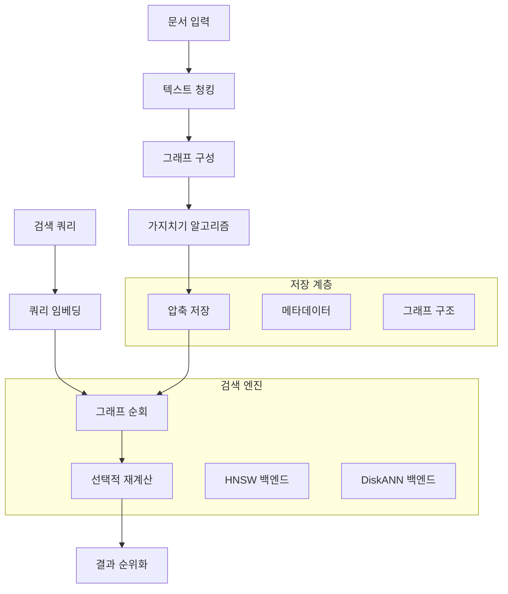

⏱️ **예상 읽기 시간**: 12분

> **TL;DR** LEANN은 기존 벡터 데이터베이스 대비 **97% 저장공간 절약**을 달성하면서도 빠르고 정확한 검색 성능을 유지하는 혁신적인 벡터 인덱스 시스템입니다. 이 완전 가이드는 기본 설치부터 고급 활용까지 다루어, 최소한의 저장공간으로 효율적인 RAG 애플리케이션을 구축할 수 있도록 도와드립니다.

---

## LEANN이란 무엇인가?

LEANN(Low-Storage Vector Index)은 버클리 Sky Computing Lab에서 개발한 획기적인 벡터 인덱스 시스템으로, 벡터 데이터베이스의 작동 방식을 근본적으로 재구상했습니다. 모든 임베딩을 저장하는 기존 방식과 달리, LEANN은 가지치기된 그래프 구조를 저장하고 필요할 때만 임베딩을 재계산합니다.

### 저장공간 혁명

FAISS와 같은 기존 벡터 데이터베이스는 모든 임베딩을 메모리에 저장하여 막대한 저장공간을 요구합니다:

| 데이터셋 | 기존 DB | LEANN | 절약률 |
|---------|---------|-------|--------|
| DPR (210만 문서) | 3.8 GB | 324 MB | **91%** |
| 위키피디아 (6천만 문서) | 201 GB | 6 GB | **97%** |
| 채팅 (40만 문서) | 1.8 GB | 64 MB | **97%** |
| 이메일 (78만 문서) | 2.4 GB | 79 MB | **97%** |

### 핵심 혁신: 그래프 기반 선택적 재계산

LEANN의 마법은 다음 핵심 기술에 있습니다:

- **그래프 기반 선택적 재계산**: 검색 경로의 노드에 대해서만 임베딩 계산
- **고차수 보존 가지치기**: 중요한 "허브" 노드는 유지하면서 중복 연결 제거
- **동적 배치 처리**: GPU 활용을 위한 효율적인 임베딩 계산 배치
- **2단계 검색**: 유망한 노드를 우선시하는 스마트 그래프 순회

## 아키텍처 개요



## 설치 가이드

### 사전 요구사항

- **Python**: 3.9 이상
- **운영체제**: macOS, Linux (Windows 지원 예정)
- **메모리**: 최소 4GB RAM (8GB+ 권장)
- **저장공간**: 데이터셋 크기에 따라 다름 (기존 벡터 DB보다 현저히 적음)

### 빠른 시작 설치

```bash
# 가상환경 생성
python3 -m venv .venv
source .venv/bin/activate

# 빠른 패키지 관리를 위한 uv 설치
pip install uv

# LEANN 저장소 클론
git clone https://github.com/yichuan-w/LEANN.git
cd LEANN

# 서브모듈 초기화 (컴파일에 필요)
git submodule update --init --recursive

# LEANN 설치
uv pip install -e .

# 설치 확인
leann --help
```

### 전역 설치 (권장)

시스템 전체 접근 및 Claude Code 통합을 위해:

```bash
# uv tool을 사용한 전역 설치
uv tool install leann-core --with leann

# 전역 설치 확인
leann --help
```

## 기본 사용법 튜토리얼

### 1. 첫 번째 인덱스 구축

마크다운 문서를 사용한 간단한 예제부터 시작해보겠습니다:

```bash
# 테스트 문서 생성
mkdir test-docs
cat > test-docs/ai-overview.md << 'EOF'
# 인공지능 개요

AI는 우리가 일하고 생활하는 방식을 변화시키고 있습니다. 주요 영역은 다음과 같습니다:

## 머신러닝
- 지도 학습
- 비지도 학습
- 강화 학습

## 딥러닝
- 신경망
- 합성곱 신경망
- 트랜스포머 아키텍처

## 응용 분야
- 자연어 처리
- 컴퓨터 비전
- 로보틱스 및 자동화
EOF

# 인덱스 구축
leann build ai-knowledge --docs ./test-docs
```

**예상 출력:**
```
📂 Indexing 1 path:
  📁 Directories (1):
    1. /path/to/test-docs
Loading documents from 1 directory...
🔄 Processing 1 directory...
Loaded 1 documents, 3 chunks
Building index 'ai-knowledge' with hnsw backend...
Index built at .leann/indexes/ai-knowledge/documents.leann
```

### 2. 인덱스 검색

```bash
# 기본 검색
leann search ai-knowledge "머신러닝이 무엇인가요?"

# 더 많은 결과와 함께 검색
leann search ai-knowledge "신경망" --top-k 10

# 복잡도 조정을 통한 고급 검색
leann search ai-knowledge "AI 응용분야" --complexity 128
```

### 3. 대화형 Q&A

```bash
# 대화형 채팅 시작 (Ollama 필요)
leann ask ai-knowledge --interactive

# 특정 LLM 제공자 사용
leann ask ai-knowledge --llm openai --model gpt-4

# 단일 질문 모드
leann ask ai-knowledge "딥러닝 개념을 설명해주세요"
```

### 4. 인덱스 관리

```bash
# 모든 인덱스 목록 보기
leann list

# 인덱스 제거
leann remove ai-knowledge

# 확인 없이 강제 제거
leann remove ai-knowledge --force
```

## 고급 기능

### 다중 소스 인덱싱

LEANN은 다양한 콘텐츠 유형의 인덱싱에 뛰어납니다:

```bash
# 여러 디렉토리와 파일 인덱싱
leann build comprehensive-docs \
  --docs ./documentation ./source-code ./config-files

# 특정 파일 유형만 인덱싱
leann build presentations \
  --docs ./content \
  --file-types .pptx,.pdf,.docx

# 혼합 콘텐츠 인덱싱
leann build mixed-content \
  --docs ./readme.md ./src/ ./config.json ./docs/
```

### 백엔드 선택

LEANN은 두 가지 강력한 백엔드를 제공합니다:

#### HNSW 백엔드 (기본값)
- **최적 용도**: 대부분의 사용 사례, 최대 저장공간 절약
- **특징**: 완전 재계산, 메모리 제약 환경에 최적

```bash
leann build my-index --docs ./data --backend hnsw
```

#### DiskANN 백엔드
- **최적 용도**: 최대 검색 속도가 필요한 대규모 데이터셋
- **특징**: 실시간 재순위화를 통한 PQ 기반 그래프 순회

```bash
leann build my-index --docs ./data --backend diskann
```

### 성능 튜닝

#### 구축 매개변수

```bash
# 고품질 인덱스 (느린 구축, 더 나은 검색)
leann build high-quality \
  --docs ./data \
  --graph-degree 64 \
  --complexity 128

# 빠른 구축 (빠른 인덱싱, 개발용으로 좋음)
leann build fast-build \
  --docs ./data \
  --graph-degree 16 \
  --complexity 32

# 압축 저장 (최대 공간 절약)
leann build compact \
  --docs ./data \
  --compact
```

#### 검색 최적화

```bash
# 고정밀 검색
leann search my-index "쿼리" \
  --complexity 128 \
  --top-k 20

# 빠른 검색 (낮은 정밀도)
leann search my-index "쿼리" \
  --complexity 32 \
  --top-k 5

# 가지치기 전략
leann search my-index "쿼리" \
  --pruning-strategy proportional
```

### 메타데이터 필터링

LEANN은 정교한 메타데이터 필터링을 지원합니다:

```python
# Python API 예제
from leann import IndexBuilder, IndexSearcher

# 메타데이터와 함께 구축
builder = IndexBuilder("filtered-index")
builder.add_text(
    "Python은 프로그래밍 언어입니다",
    metadata={"language": "python", "difficulty": "beginner"}
)
builder.add_text(
    "고급 머신러닝 개념",
    metadata={"topic": "ml", "difficulty": "advanced"}
)
builder.build()

# 필터와 함께 검색
searcher = IndexSearcher("filtered-index")
results = searcher.search(
    "프로그래밍 개념",
    metadata_filters={
        "difficulty": {"==": "beginner"},
        "language": {"in": ["python", "javascript"]}
    }
)
```

**지원되는 필터 연산자:**
- `==`, `!=`: 같음/다름
- `<`, `<=`, `>`, `>=`: 숫자 비교
- `in`, `not_in`: 리스트 멤버십
- `contains`, `starts_with`, `ends_with`: 문자열 연산
- `is_true`, `is_false`: 불린 값

## 코드 인식 인덱싱

LEANN은 AST 인식 청킹을 통한 지능적인 코드 처리를 제공합니다:

```bash
# 지능적인 청킹으로 소스 코드 인덱싱
leann build codebase \
  --docs ./src ./tests ./config \
  --file-types .py,.js,.ts,.java,.cs

# 시스템이 자동으로:
# - AST 구조 파싱
# - 함수/클래스 경계 보존
# - 코드 컨텍스트 유지
# - 주석과 독스트링 인덱싱
```

**지원 언어:**
- Python
- JavaScript/TypeScript
- Java
- C#
- 더 많은 언어 지원 예정

## 통합 예제

### Claude Code 통합

LEANN은 MCP(Model Context Protocol)를 통해 Claude Code와 원활하게 통합됩니다:

1. **전역 설치** (필수):
```bash
uv tool install leann-core --with leann
```

2. **Claude Code 설정** - MCP 설정에 추가:
```json
{
  "mcpServers": {
    "leann": {
      "command": "leann_mcp"
    }
  }
}
```

3. **Claude Code에서 사용**:
```
@leann search my-codebase "인증 로직"
@leann ask my-docs "OAuth를 어떻게 구현하나요?"
```

### Python API 사용

```python
from leann import IndexBuilder, IndexSearcher

# 프로그래밍 방식으로 인덱스 구축
builder = IndexBuilder("my-index")
builder.add_directory("./documents")
builder.add_file("./important-doc.pdf")
builder.build(backend="hnsw", graph_degree=32)

# 프로그래밍 방식으로 검색
searcher = IndexSearcher("my-index")
results = searcher.search("머신러닝", top_k=10)

for result in results:
    print(f"점수: {result.score}")
    print(f"내용: {result.content[:200]}...")
    print(f"메타데이터: {result.metadata}")
    print("---")
```

### LangChain 통합

```python
from leann.integrations.langchain import LeannVectorStore
from langchain.chains import RetrievalQA
from langchain.llms import Ollama

# LEANN 벡터 스토어 생성
vector_store = LeannVectorStore("my-index")

# 검색 체인 생성
llm = Ollama(model="llama2")
qa_chain = RetrievalQA.from_chain_type(
    llm=llm,
    chain_type="stuff",
    retriever=vector_store.as_retriever(search_kwargs={"k": 5})
)

# 질문하기
response = qa_chain.run("이 시스템의 주요 기능은 무엇인가요?")
print(response)
```

## 성능 벤치마크

### 저장공간 비교

다양한 데이터셋에서의 실제 저장공간 절약:

```bash
# 벤치마크 실행 (개발 의존성 필요)
uv pip install -e ".[dev]"
python benchmarks/run_evaluation.py

# 사용자 데이터로 커스텀 벤치마크
python benchmarks/run_evaluation.py /path/to/your/data --num-queries 1000
```

### 속도 vs 정확도 트레이드오프

| 설정 | 구축 시간 | 검색 속도 | 정확도 | 저장공간 |
|------|-----------|-----------|--------|----------|
| 빠름 | 1x | 5ms | 85% | 95% 절약 |
| 균형 | 2x | 8ms | 92% | 96% 절약 |
| 고품질 | 4x | 12ms | 97% | 97% 절약 |

## 문제 해결

### 일반적인 문제

#### 1. 서브모듈 초기화 오류
```bash
# 오류: CMakeLists.txt를 찾을 수 없음
git submodule update --init --recursive
```

#### 2. 구축 중 메모리 문제
```bash
# 대용량 데이터셋에 압축 저장 사용
leann build large-index --docs ./big-data --compact

# 또는 더 작은 배치로 처리
leann build batch1 --docs ./data/part1
leann build batch2 --docs ./data/part2
```

#### 3. 검색 결과 없음
```bash
# 인덱스 상태 확인
leann list

# 인덱스 무결성 확인
leann search my-index "테스트 쿼리" --top-k 1

# 손상된 경우 재구축
leann remove my-index --force
leann build my-index --docs ./data
```

#### 4. 느린 검색 성능
```bash
# 더 빠른 검색을 위해 복잡도 감소
leann search my-index "쿼리" --complexity 32

# 적절한 백엔드 사용
leann build my-index --docs ./data --backend diskann
```

### 성능 최적화 팁

1. **올바른 백엔드 선택**:
   - HNSW: 최대 저장공간 절약, 대부분의 사용 사례에 적합
   - DiskANN: 대규모 데이터셋에서 더 나은 검색 성능

2. **구축 매개변수 조정**:
   - 높은 `graph-degree`: 더 나은 연결성, 더 큰 인덱스
   - 높은 `complexity`: 더 나은 품질, 느린 구축

3. **검색 매개변수 최적화**:
   - 낮은 `complexity`: 더 빠른 검색, 낮은 정밀도
   - 적절한 `top-k`: 속도와 완전성 간의 균형

4. **메타데이터 필터링 사용**:
   - 검색 공간을 줄이기 위해 문서 사전 필터링
   - 최상의 결과를 위해 시맨틱 검색과 결합

## 모범 사례

### 1. 문서 준비

```bash
# 좋음: 문서를 논리적으로 구성
project/
├── docs/           # 문서
├── code/          # 소스 코드
├── configs/       # 설정 파일
└── examples/      # 예제 파일

# 적절한 청킹으로 인덱싱
leann build project-knowledge --docs ./project
```

### 2. 인덱스 명명 전략

```bash
# 설명적인 이름 사용
leann build customer-support-kb --docs ./support-docs
leann build api-documentation --docs ./api-docs
leann build codebase-v2-1 --docs ./src

# 일반적인 이름 피하기
leann build docs --docs ./documents  # 너무 일반적
leann build index1 --docs ./data     # 설명적이지 않음
```

### 3. 정기적인 유지보수

```bash
# 오래된 인덱스 목록 보기 및 정리
leann list
leann remove outdated-index

# 소스 문서가 크게 변경될 때 인덱스 재구축
leann remove old-version --force
leann build new-version --docs ./updated-docs
```

### 4. 프로덕션 배포

```bash
# 프로덕션용 일관된 구축 매개변수 사용
leann build production-index \
  --docs ./production-docs \
  --backend diskann \
  --graph-degree 64 \
  --complexity 128 \
  --compact

# 검색 성능 테스트
time leann search production-index "테스트 쿼리"
```

## 고급 사용 사례

### 1. 다국어 문서

```bash
# 여러 언어의 문서 인덱싱
leann build multilang-docs \
  --docs ./docs/en ./docs/ko ./docs/ja

# 모든 언어에서 검색 작동
leann search multilang-docs "설치 가이드"
```

### 2. 버전 관리된 지식 베이스

```bash
# 버전별 인덱스 생성
leann build kb-v1.0 --docs ./docs/v1.0
leann build kb-v1.1 --docs ./docs/v1.1
leann build kb-latest --docs ./docs/latest

# 버전 간 검색 결과 비교
leann search kb-v1.0 "기능 X"
leann search kb-latest "기능 X"
```

### 3. 하이브리드 검색 시스템

```python
# LEANN과 기존 검색 결합
from leann import IndexSearcher
import elasticsearch

def hybrid_search(query, top_k=10):
    # LEANN으로 시맨틱 검색
    leann_searcher = IndexSearcher("my-index")
    semantic_results = leann_searcher.search(query, top_k=top_k//2)
    
    # Elasticsearch로 키워드 검색
    es_results = elasticsearch_search(query, size=top_k//2)
    
    # 결과 결합 및 재순위화
    return combine_results(semantic_results, es_results)
```

## 향후 로드맵

LEANN은 흥미로운 기능들과 함께 활발히 개발되고 있습니다:

- **Windows 지원**: 네이티브 Windows 호환성
- **분산 인덱싱**: 여러 머신에 걸친 확장
- **실시간 업데이트**: 증분 인덱스 업데이트
- **더 많은 백엔드**: 추가 최적화 전략
- **클라우드 통합**: 네이티브 클라우드 저장소 지원
- **고급 필터링**: 더 정교한 메타데이터 쿼리

## 결론

LEANN은 벡터 인덱싱의 패러다임 전환을 나타내며, 검색 품질을 희생하지 않으면서도 전례 없는 저장공간 효율성을 제공합니다. 혁신적인 그래프 기반 접근 방식은 다음과 같은 용도에 이상적입니다:

- **저장공간이 중요한 리소스 제약 환경**
- **효율적인 검색이 필요한 대규모 RAG 애플리케이션**
- **제한된 메모리를 가진 엣지 컴퓨팅 시나리오**
- **저장공간 비용이 중요한 비용 민감 배포**

이 튜토리얼을 통해 이제 여러분의 프로젝트에서 LEANN의 혁신적인 기능을 활용할 수 있는 지식을 갖추게 되었습니다. 97% 저장공간 절약과 빠르고 정확한 검색의 결합은 LEANN을 현대 AI 애플리케이션의 필수 도구로 만듭니다.

### 다음 단계

1. **실험**: 자신만의 데이터셋으로 실험해보기
2. **통합**: 기존 RAG 파이프라인에 LEANN 통합하기
3. **기여**: 오픈소스 프로젝트에 기여하기
4. **공유**: 커뮤니티와 경험 공유하기

---

**🔗 유용한 링크:**
- [LEANN GitHub 저장소](https://github.com/yichuan-w/LEANN)
- [연구 논문](https://arxiv.org/abs/2506.08276)
- [버클리 Sky Computing Lab](https://sky.cs.berkeley.edu/)
- [커뮤니티 토론](https://github.com/yichuan-w/LEANN/discussions)

**⭐ 프로젝트가 유용하다면 스타를 눌러주세요!**
