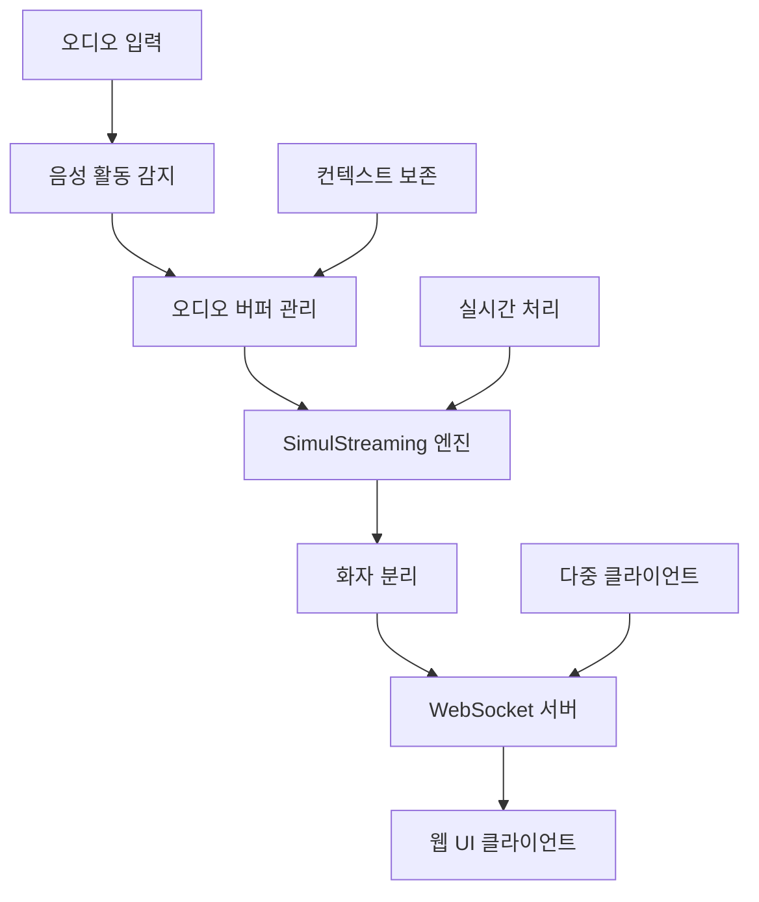

⏱️ **예상 읽기 시간**: 15분

## 서론

실시간 음성 인식 기술은 스트리밍 최적화 모델과 첨단 연구 성과의 등장으로 극적인 발전을 이루었습니다. **WhisperLiveKit**은 SimulStreaming(SOTA 2025), WhisperStreaming(SOTA 2023), 그리고 고급 화자 분리 시스템을 결합한 실시간 음성 전사 분야의 최첨단 기술을 대표합니다.

실시간 제약 조건에서 어려움을 겪는 전통적인 배치 처리 방식과 달리, WhisperLiveKit은 지능적 버퍼링, 점진적 처리, 음성 활동 감지를 활용하여 브라우저로 직접 초저지연 전사를 제공합니다.

이 포괄적인 가이드는 기본 설정부터 화자 식별 및 다중 사용자 지원과 같은 고급 기능까지, 프로덕션 급 실시간 음성 애플리케이션을 위한 WhisperLiveKit 구현 방법을 단계별로 안내합니다.

## 표준 Whisper 대비 WhisperLiveKit의 장점

### 실시간 처리의 도전 과제

표준 Whisper 모델은 완전한 발화를 위해 설계되었으며, 실시간 오디오 청크에는 적합하지 않습니다. 작은 세그먼트를 처리할 때 다음과 같은 문제가 발생합니다:

- **컨텍스트 손실**: 대화 흐름과 문장 경계 누락
- **단어 분할**: 음절 중간에서 단어 절단
- **정확도 저하**: 불완전한 오디오에서 전사 품질 하락
- **높은 지연시간**: 배치 처리로 인한 지연

### WhisperLiveKit의 혁신

WhisperLiveKit은 다음을 통해 이러한 문제를 해결합니다:

```python
# 전통적 접근법 (문제 발생)
def process_audio_chunk(chunk):
    return whisper.transcribe(chunk)  # 컨텍스트 손실, 품질 저하

# WhisperLiveKit 접근법 (최적화)
def process_streaming_audio(stream):
    # 컨텍스트 보존을 통한 지능적 버퍼링
    # 효율성을 위한 음성 활동 감지
    # 초저지연을 위한 SimulStreaming
    # LocalAgreement를 통한 점진적 처리
    return optimized_transcription
```

## 핵심 기술 및 아키텍처

### 최첨단 연구 통합

**SimulStreaming (SOTA 2025)**:
- AlignAtt 정책을 통한 초저지연 전사
- 최적 처리 타이밍을 위한 프레임 수준 어텐션 가이드
- 고급 빔 서치 최적화

**WhisperStreaming (SOTA 2023)**:
- 일관된 스트리밍 출력을 위한 LocalAgreement 정책
- 지능적 버퍼 관리 및 트리밍 전략

**고급 화자 분리**:
- 실시간 화자 식별을 위한 Streaming Sortformer (SOTA 2025)
- 프로덕션 환경을 위한 Diart (SOTA 2021) 통합

**엔터프라이즈급 VAD**:
- 정확한 음성 활동 감지를 위한 Silero VAD (2024)
- 무음 구간 동안 계산 오버헤드 감소

### 시스템 아키텍처



이 아키텍처는 지능적 리소스 관리와 음성 활동 감지를 통해 성능을 최적화하면서 다중 동시 사용자를 지원합니다.

## 설치 및 설정

### 사전 요구사항

**시스템 요구사항**:
- Python 3.8+
- FFmpeg (오디오 처리 필수)
- 4GB+ RAM (대형 모델의 경우 8GB+ 권장)
- 선택사항: 가속 처리를 위한 NVIDIA GPU

### FFmpeg 설치

```bash
# macOS
brew install ffmpeg

# Ubuntu/Debian
sudo apt install ffmpeg

# Windows
# https://ffmpeg.org/download.html에서 다운로드 후 PATH에 추가
```

### WhisperLiveKit 설치

```bash
# 격리된 환경 생성
python3 -m venv whisperlivekit-env
source whisperlivekit-env/bin/activate  # Windows: whisperlivekit-env\Scripts\activate

# WhisperLiveKit 설치
pip install whisperlivekit

# 설치 확인
whisperlivekit-server --help
```

## 빠른 시작 가이드

### 기본 서버 실행

```bash
# 기본 설정으로 시작 (small 모델, 자동 언어 감지)
whisperlivekit-server --model base --language ko

# 서버가 http://localhost:8000에서 시작됨
# 웹 UI가 동일한 주소에서 자동으로 제공됨
```

### 설치 테스트

1. **서버 시작**:
```bash
whisperlivekit-server --model tiny --language ko --host localhost --port 8000
```

2. **브라우저 열기** 및 `http://localhost:8000`으로 이동

3. **마이크 권한 허용** (요청 시)

4. **말하기 시작** 후 실시간 전사 확인

### 검증 스크립트

```python
# test_whisperlivekit.py
import asyncio
import websockets
import json
import pyaudio
import wave

async def test_websocket_connection():
    """WhisperLiveKit 서버에 대한 WebSocket 연결 테스트"""
    uri = "ws://localhost:8000/ws"
    
    try:
        async with websockets.connect(uri) as websocket:
            print("✅ WebSocket 연결 성공")
            
            # 테스트 메시지 전송
            test_message = {
                "type": "audio_chunk",
                "data": "test_audio_data"
            }
            
            await websocket.send(json.dumps(test_message))
            response = await websocket.recv()
            print(f"📨 서버 응답: {response}")
            
    except Exception as e:
        print(f"❌ 연결 실패: {e}")

# 테스트 실행
asyncio.run(test_websocket_connection())
```

## 고급 설정

### 모델 선택 및 성능

```bash
# 초고속 처리 (낮은 정확도)
whisperlivekit-server --model tiny --language ko

# 균형잡힌 성능 (대부분의 사용 사례에 권장)
whisperlivekit-server --model base --language ko

# 높은 정확도 (더 많은 리소스 필요)
whisperlivekit-server --model large-v3 --language ko

# 자동 감지를 통한 다국어 지원
whisperlivekit-server --model base --language auto
```

### 백엔드 선택

```bash
# SimulStreaming (SOTA 2025) - 초저지연
whisperlivekit-server --backend simulstreaming --model base

# Faster-Whisper - 최적화된 성능
whisperlivekit-server --backend faster-whisper --model base

# WhisperStreaming - LocalAgreement 정책
whisperlivekit-server --backend whisper_timestamped --model base
```

### SimulStreaming 고급 설정

```bash
# 지연시간 vs 정확도 미세 조정
whisperlivekit-server \
  --backend simulstreaming \
  --model base \
  --frame-threshold 25 \
  --beams 1 \
  --audio-max-len 30.0 \
  --never-fire
```

**주요 매개변수**:
- `--frame-threshold`: 낮음 = 빠름, 높음 = 정확함 (기본값: 25)
- `--beams`: 빔 서치 빔 수 (1 = 그리디, >1 = 빔 서치)
- `--audio-max-len`: 최대 오디오 버퍼 길이(초)
- `--never-fire`: 불완전한 단어를 절대 자르지 않음

## 화자 분리 설정

### 기본 화자 식별

```bash
# Sortformer(SOTA 2025)를 사용한 화자 분리 활성화
whisperlivekit-server \
  --model base \
  --language ko \
  --diarization \
  --diarization-backend sortformer
```

### Diart를 사용한 고급 분리

```bash
# 사용자 정의 모델을 사용한 Diart 백엔드
whisperlivekit-server \
  --model base \
  --language ko \
  --diarization \
  --diarization-backend diart \
  --segmentation-model pyannote/segmentation-3.0 \
  --embedding-model speechbrain/spkrec-ecapa-voxceleb
```

### Pyannote를 위한 Hugging Face 인증

```bash
# pyannote.audio 모델에 필요
pip install huggingface_hub
huggingface-cli login

# 필요한 모델에 대한 사용자 조건 수락:
# 1. pyannote/segmentation
# 2. pyannote/segmentation-3.0  
# 3. pyannote/embedding
```

## 프로덕션 배포

### Docker 배포

**GPU 가속 컨테이너**:
```dockerfile
# Dockerfile
FROM nvidia/cuda:11.8-runtime-ubuntu20.04

RUN apt-get update && apt-get install -y \
    python3 python3-pip ffmpeg \
    && rm -rf /var/lib/apt/lists/*

RUN pip install whisperlivekit

EXPOSE 8000

CMD ["whisperlivekit-server", "--model", "base", "--language", "ko", "--host", "0.0.0.0"]
```

```bash
# 빌드 및 실행
docker build -t whisperlivekit .
docker run --gpus all -p 8000:8000 whisperlivekit
```

**CPU 전용 컨테이너**:
```bash
# 미리 빌드된 CPU 이미지 사용
docker run -p 8000:8000 whisperlivekit/cpu:latest
```

### 프로덕션 서버 설정

```bash
# 프로덕션 준비 설정
whisperlivekit-server \
  --model base \
  --language ko \
  --host 0.0.0.0 \
  --port 8000 \
  --ssl-certfile /path/to/cert.pem \
  --ssl-keyfile /path/to/key.pem \
  --diarization \
  --preloaded_model_count 4 \
  --min-chunk-size 1.0 \
  --buffer_trimming sentence
```

### Nginx를 사용한 로드 밸런싱

```nginx
# /etc/nginx/sites-available/whisperlivekit
upstream whisperlivekit_backend {
    server 127.0.0.1:8000;
    server 127.0.0.1:8001;
    server 127.0.0.1:8002;
    server 127.0.0.1:8003;
}

server {
    listen 80;
    server_name your-domain.com;

    location / {
        proxy_pass http://whisperlivekit_backend;
        proxy_set_header Upgrade $http_upgrade;
        proxy_set_header Connection "upgrade";
        proxy_set_header Host $host;
        proxy_set_header X-Real-IP $remote_addr;
        proxy_set_header X-Forwarded-For $proxy_add_x_forwarded_for;
    }
}
```

## 사용자 정의 웹 통합

### 기본 WebSocket 클라이언트

```javascript
// whisperlivekit-client.js
class WhisperLiveKitClient {
    constructor(serverUrl = 'ws://localhost:8000/ws') {
        this.serverUrl = serverUrl;
        this.websocket = null;
        this.mediaRecorder = null;
        this.audioContext = null;
    }

    async connect() {
        try {
            this.websocket = new WebSocket(this.serverUrl);
            
            this.websocket.onopen = () => {
                console.log('✅ WhisperLiveKit에 연결됨');
                this.startAudioCapture();
            };

            this.websocket.onmessage = (event) => {
                const data = JSON.parse(event.data);
                this.handleTranscription(data);
            };

            this.websocket.onerror = (error) => {
                console.error('❌ WebSocket 오류:', error);
            };

        } catch (error) {
            console.error('연결 실패:', error);
        }
    }

    async startAudioCapture() {
        try {
            const stream = await navigator.mediaDevices.getUserMedia({ 
                audio: {
                    sampleRate: 16000,
                    channelCount: 1,
                    echoCancellation: true,
                    noiseSuppression: true
                } 
            });

            this.audioContext = new AudioContext({ sampleRate: 16000 });
            const source = this.audioContext.createMediaStreamSource(stream);
            
            // 실시간 오디오 처리
            this.processAudioStream(source);

        } catch (error) {
            console.error('마이크 접근 거부됨:', error);
        }
    }

    processAudioStream(source) {
        const processor = this.audioContext.createScriptProcessor(4096, 1, 1);
        
        processor.onaudioprocess = (event) => {
            const audioData = event.inputBuffer.getChannelData(0);
            
            // 16비트 PCM으로 변환
            const pcmData = new Int16Array(audioData.length);
            for (let i = 0; i < audioData.length; i++) {
                pcmData[i] = Math.max(-32768, Math.min(32767, audioData[i] * 32768));
            }

            // 서버로 전송
            if (this.websocket && this.websocket.readyState === WebSocket.OPEN) {
                this.websocket.send(pcmData.buffer);
            }
        };

        source.connect(processor);
        processor.connect(this.audioContext.destination);
    }

    handleTranscription(data) {
        if (data.type === 'transcription') {
            this.displayTranscription(data.text, data.speaker);
        }
    }

    displayTranscription(text, speaker = null) {
        const transcriptionDiv = document.getElementById('transcription');
        const timestamp = new Date().toLocaleTimeString();
        
        const entry = document.createElement('div');
        entry.className = 'transcription-entry';
        entry.innerHTML = `
            <span class="timestamp">${timestamp}</span>
            ${speaker ? `<span class="speaker">화자 ${speaker}:</span>` : ''}
            <span class="text">${text}</span>
        `;
        
        transcriptionDiv.appendChild(entry);
        transcriptionDiv.scrollTop = transcriptionDiv.scrollHeight;
    }
}

// 사용법
const client = new WhisperLiveKitClient();
client.connect();
```

### React 통합

```jsx
// WhisperLiveKitComponent.jsx
import React, { useState, useEffect, useRef } from 'react';

const WhisperLiveKitComponent = () => {
    const [transcriptions, setTranscriptions] = useState([]);
    const [isConnected, setIsConnected] = useState(false);
    const [isRecording, setIsRecording] = useState(false);
    const websocketRef = useRef(null);
    const mediaRecorderRef = useRef(null);

    useEffect(() => {
        connectToServer();
        return () => {
            if (websocketRef.current) {
                websocketRef.current.close();
            }
        };
    }, []);

    const connectToServer = () => {
        const ws = new WebSocket('ws://localhost:8000/ws');
        
        ws.onopen = () => {
            setIsConnected(true);
            console.log('WhisperLiveKit에 연결됨');
        };

        ws.onmessage = (event) => {
            const data = JSON.parse(event.data);
            if (data.type === 'transcription') {
                setTranscriptions(prev => [...prev, {
                    id: Date.now(),
                    text: data.text,
                    speaker: data.speaker,
                    timestamp: new Date().toLocaleTimeString()
                }]);
            }
        };

        ws.onclose = () => {
            setIsConnected(false);
            console.log('WhisperLiveKit 연결 해제됨');
        };

        websocketRef.current = ws;
    };

    const startRecording = async () => {
        try {
            const stream = await navigator.mediaDevices.getUserMedia({ 
                audio: {
                    sampleRate: 16000,
                    channelCount: 1,
                    echoCancellation: true,
                    noiseSuppression: true
                }
            });

            const mediaRecorder = new MediaRecorder(stream, {
                mimeType: 'audio/webm;codecs=opus'
            });

            mediaRecorder.ondataavailable = (event) => {
                if (event.data.size > 0 && websocketRef.current?.readyState === WebSocket.OPEN) {
                    websocketRef.current.send(event.data);
                }
            };

            mediaRecorder.start(100); // 100ms마다 데이터 전송
            mediaRecorderRef.current = mediaRecorder;
            setIsRecording(true);

        } catch (error) {
            console.error('녹음 시작 실패:', error);
        }
    };

    const stopRecording = () => {
        if (mediaRecorderRef.current) {
            mediaRecorderRef.current.stop();
            mediaRecorderRef.current = null;
            setIsRecording(false);
        }
    };

    return (
        <div className="whisperlivekit-container">
            <div className="controls">
                <div className={`status ${isConnected ? 'connected' : 'disconnected'}`}>
                    {isConnected ? '🟢 연결됨' : '🔴 연결 해제됨'}
                </div>
                
                <button 
                    onClick={isRecording ? stopRecording : startRecording}
                    disabled={!isConnected}
                    className={`record-button ${isRecording ? 'recording' : ''}`}
                >
                    {isRecording ? '⏹️ 녹음 중지' : '🎤 녹음 시작'}
                </button>
            </div>

            <div className="transcriptions">
                <h3>실시간 전사</h3>
                <div className="transcription-list">
                    {transcriptions.map(item => (
                        <div key={item.id} className="transcription-item">
                            <span className="timestamp">{item.timestamp}</span>
                            {item.speaker && <span className="speaker">화자 {item.speaker}:</span>}
                            <span className="text">{item.text}</span>
                        </div>
                    ))}
                </div>
            </div>
        </div>
    );
};

export default WhisperLiveKitComponent;
```

## 성능 최적화

### 모델 선택 전략

```python
# performance_config.py
PERFORMANCE_CONFIGS = {
    'ultra_fast': {
        'model': 'tiny',
        'backend': 'simulstreaming',
        'frame_threshold': 15,
        'beams': 1,
        'min_chunk_size': 0.5
    },
    'balanced': {
        'model': 'base',
        'backend': 'simulstreaming', 
        'frame_threshold': 25,
        'beams': 1,
        'min_chunk_size': 1.0
    },
    'high_accuracy': {
        'model': 'large-v3',
        'backend': 'faster-whisper',
        'beams': 5,
        'min_chunk_size': 2.0
    }
}

def get_optimal_config(use_case):
    """사용 사례에 따른 최적 설정 선택"""
    if use_case == 'live_streaming':
        return PERFORMANCE_CONFIGS['ultra_fast']
    elif use_case == 'meeting_transcription':
        return PERFORMANCE_CONFIGS['balanced']
    elif use_case == 'legal_documentation':
        return PERFORMANCE_CONFIGS['high_accuracy']
```

### 리소스 관리

```bash
# 높은 동시성을 위한 다중 인스턴스 배포
# 인스턴스 1: 초고속 처리
whisperlivekit-server --model tiny --port 8001 --preloaded_model_count 2

# 인스턴스 2: 균형잡힌 처리  
whisperlivekit-server --model base --port 8002 --preloaded_model_count 2

# 인스턴스 3: 고정확도 처리
whisperlivekit-server --model large-v3 --port 8003 --preloaded_model_count 1
```

## 문제 해결 가이드

### 일반적인 문제 및 해결책

**1. 서버가 시작되지 않음**
```bash
# FFmpeg 설치 확인
ffmpeg -version

# Python 환경 확인
python -c "import whisperlivekit; print('✅ 설치 완료')"

# 포트 사용 가능성 확인
lsof -i :8000
```

**2. 전사 품질 저하**
```bash
# 모델 크기 증가
whisperlivekit-server --model base  # tiny 대신

# 청크 크기 조정
whisperlivekit-server --min-chunk-size 2.0

# 신뢰도 검증 활성화
whisperlivekit-server --confidence-validation
```

**3. 높은 지연시간 문제**
```bash
# SimulStreaming 백엔드 사용
whisperlivekit-server --backend simulstreaming --frame-threshold 15

# 오디오 버퍼 감소
whisperlivekit-server --audio-max-len 15.0

# VAD 최적화 활성화
whisperlivekit-server --vac-chunk-size 0.5
```

**4. WebSocket 연결 문제**
```javascript
// 연결 재시도 로직 추가
class RobustWhisperClient {
    constructor(serverUrl) {
        this.serverUrl = serverUrl;
        this.reconnectAttempts = 0;
        this.maxReconnectAttempts = 5;
    }

    connect() {
        this.websocket = new WebSocket(this.serverUrl);
        
        this.websocket.onclose = () => {
            if (this.reconnectAttempts < this.maxReconnectAttempts) {
                setTimeout(() => {
                    this.reconnectAttempts++;
                    this.connect();
                }, 1000 * this.reconnectAttempts);
            }
        };
    }
}
```

### 성능 모니터링

```python
# monitoring.py
import psutil
import time
import requests

def monitor_whisperlivekit_performance():
    """WhisperLiveKit 서버 성능 모니터링"""
    while True:
        try:
            # 서버 상태 확인
            response = requests.get('http://localhost:8000/health', timeout=5)
            
            # 시스템 리소스 모니터링
            cpu_percent = psutil.cpu_percent(interval=1)
            memory_percent = psutil.virtual_memory().percent
            
            print(f"🖥️  CPU: {cpu_percent}% | 💾 메모리: {memory_percent}%")
            
            if cpu_percent > 80:
                print("⚠️  높은 CPU 사용량 감지")
            
            if memory_percent > 80:
                print("⚠️  높은 메모리 사용량 감지")
                
        except Exception as e:
            print(f"❌ 상태 확인 실패: {e}")
        
        time.sleep(10)

if __name__ == "__main__":
    monitor_whisperlivekit_performance()
```

## 실제 사용 사례

### 1. 실시간 회의 전사

```python
# meeting_transcriber.py
import asyncio
import websockets
import json
from datetime import datetime

class MeetingTranscriber:
    def __init__(self):
        self.transcriptions = []
        self.meeting_id = datetime.now().strftime("%Y%m%d_%H%M%S")
    
    async def start_meeting_transcription(self):
        uri = "ws://localhost:8000/ws"
        
        async with websockets.connect(uri) as websocket:
            print(f"📝 회의 전사 시작: {self.meeting_id}")
            
            async for message in websocket:
                data = json.loads(message)
                
                if data['type'] == 'transcription':
                    entry = {
                        'timestamp': datetime.now().isoformat(),
                        'speaker': data.get('speaker', '알 수 없음'),
                        'text': data['text']
                    }
                    
                    self.transcriptions.append(entry)
                    print(f"[{entry['timestamp']}] 화자 {entry['speaker']}: {entry['text']}")
    
    def export_meeting_notes(self):
        """회의 전사를 파일로 내보내기"""
        filename = f"meeting_{self.meeting_id}.json"
        with open(filename, 'w', encoding='utf-8') as f:
            json.dump(self.transcriptions, f, indent=2, ensure_ascii=False)
        print(f"📄 회의록이 {filename}으로 내보내짐")

# 사용법
transcriber = MeetingTranscriber()
asyncio.run(transcriber.start_meeting_transcription())
```

### 2. 고객 서비스 통화 분석

```python
# call_analyzer.py
import re
from collections import Counter

class CallAnalyzer:
    def __init__(self):
        self.sentiment_keywords = {
            'positive': ['훌륭한', '좋은', '만족', '행복한', '감사'],
            'negative': ['끔찍한', '나쁜', '실망', '화난', '불만'],
            'neutral': ['괜찮은', '보통', '평균적인', '일반적인']
        }
    
    def analyze_call_transcription(self, transcriptions):
        """고객 서비스 통화 분석을 위한 인사이트"""
        analysis = {
            'total_duration': len(transcriptions),
            'speaker_distribution': Counter(),
            'sentiment_analysis': {'positive': 0, 'negative': 0, 'neutral': 0},
            'key_topics': [],
            'action_items': []
        }
        
        for entry in transcriptions:
            speaker = entry['speaker']
            text = entry['text'].lower()
            
            # 화자 분포
            analysis['speaker_distribution'][speaker] += 1
            
            # 감정 분석
            for sentiment, keywords in self.sentiment_keywords.items():
                if any(keyword in text for keyword in keywords):
                    analysis['sentiment_analysis'][sentiment] += 1
            
            # 액션 아이템 추출
            if any(phrase in text for phrase in ['후속 조치', '전송하겠습니다', '다시 연락']):
                analysis['action_items'].append(entry)
        
        return analysis
    
    def generate_call_summary(self, analysis):
        """통화 요약 보고서 생성"""
        summary = f"""
        📞 통화 분석 요약
        ================
        총 상호작용: {analysis['total_duration']}
        
        화자 분포:
        {dict(analysis['speaker_distribution'])}
        
        감정 분석:
        - 긍정적: {analysis['sentiment_analysis']['positive']}
        - 부정적: {analysis['sentiment_analysis']['negative']}  
        - 중립적: {analysis['sentiment_analysis']['neutral']}
        
        액션 아이템: {len(analysis['action_items'])}개
        """
        
        return summary
```

### 3. 접근성 통합

```javascript
// accessibility_integration.js
class AccessibilityTranscriber {
    constructor() {
        this.isHighContrast = false;
        this.fontSize = 'medium';
        this.speechRate = 1.0;
    }

    setupAccessibilityFeatures() {
        // 고대비 모드
        this.addHighContrastToggle();
        
        // 글꼴 크기 조절
        this.addFontSizeControls();
        
        // 전사 내용 음성 읽기
        this.addTextToSpeech();
        
        // 키보드 탐색
        this.addKeyboardShortcuts();
    }

    addHighContrastToggle() {
        const toggle = document.createElement('button');
        toggle.textContent = '🎨 고대비 모드';
        toggle.onclick = () => {
            this.isHighContrast = !this.isHighContrast;
            document.body.classList.toggle('high-contrast', this.isHighContrast);
        };
        document.getElementById('accessibility-controls').appendChild(toggle);
    }

    addTextToSpeech() {
        const speakButton = document.createElement('button');
        speakButton.textContent = '🔊 음성 읽기';
        speakButton.onclick = () => {
            const transcriptionText = document.getElementById('transcription').textContent;
            const utterance = new SpeechSynthesisUtterance(transcriptionText);
            utterance.rate = this.speechRate;
            utterance.lang = 'ko-KR';
            speechSynthesis.speak(utterance);
        };
        document.getElementById('accessibility-controls').appendChild(speakButton);
    }

    addKeyboardShortcuts() {
        document.addEventListener('keydown', (event) => {
            // Ctrl+R: 녹음 시작/중지
            if (event.ctrlKey && event.key === 'r') {
                event.preventDefault();
                this.toggleRecording();
            }
            
            // Ctrl+S: 전사 내용 저장
            if (event.ctrlKey && event.key === 's') {
                event.preventDefault();
                this.saveTranscription();
            }
            
            // Ctrl+Plus: 글꼴 크기 증가
            if (event.ctrlKey && event.key === '=') {
                event.preventDefault();
                this.increaseFontSize();
            }
        });
    }
}
```

## 고급 기능 및 사용자 정의

### 사용자 정의 언어 모델

```python
# custom_model_integration.py
from whisperlivekit import WhisperLiveKitServer

class CustomWhisperServer(WhisperLiveKitServer):
    def __init__(self, custom_model_path):
        super().__init__()
        self.custom_model_path = custom_model_path
    
    def load_custom_model(self):
        """도메인별 파인튜닝된 모델 로드"""
        # 사용자 정의 모델 로딩 구현
        pass
    
    def apply_domain_specific_processing(self, transcription):
        """도메인별 후처리 적용"""
        # 의료 용어 교정
        medical_corrections = {
            '심장마비': '심근경색',
            '고혈압': '고혈압증'
        }
        
        for term, correction in medical_corrections.items():
            transcription = transcription.replace(term, correction)
        
        return transcription
```

### 외부 서비스 통합

```python
# external_integrations.py
import requests
import json

class ExternalServiceIntegrator:
    def __init__(self):
        self.slack_webhook = "YOUR_SLACK_WEBHOOK_URL"
        self.teams_webhook = "YOUR_TEAMS_WEBHOOK_URL"
    
    async def send_to_slack(self, transcription_data):
        """Slack 채널로 전사 내용 전송"""
        message = {
            "text": f"🎤 새로운 전사 내용",
            "attachments": [{
                "color": "good",
                "fields": [{
                    "title": "화자",
                    "value": transcription_data.get('speaker', '알 수 없음'),
                    "short": True
                }, {
                    "title": "내용",
                    "value": transcription_data['text'],
                    "short": False
                }]
            }]
        }
        
        response = requests.post(self.slack_webhook, json=message)
        return response.status_code == 200
    
    async def save_to_database(self, transcription_data):
        """데이터베이스에 전사 내용 저장"""
        # 데이터베이스 통합 로직
        pass
    
    async def trigger_workflow(self, transcription_data):
        """전사 내용 기반 자동화 워크플로우 트리거"""
        # 워크플로우 자동화 로직
        pass
```

## 결론

WhisperLiveKit은 최첨단 연구와 실용적인 프로덕션 준비 기능을 결합한 실시간 음성 인식 기술의 중요한 발전을 나타냅니다. 이 포괄적인 가이드를 통해 다음을 학습했습니다:

### 주요 성과

1. **실시간 음성 처리 마스터**: 배치와 스트리밍 음성 인식의 근본적인 차이점 이해
2. **프로덕션 시스템 구현**: 확장 가능한 다중 사용자 음성 전사 서비스 배포
3. **고급 기능 통합**: 화자 분리, 음성 활동 감지, 사용자 정의 백엔드 활용
4. **성능 최적화**: 최적의 지연시간과 정확도 균형을 위한 시스템 설정
5. **실제 애플리케이션**: 회의 전사기, 접근성 도구, 고객 서비스 분석기 구축

### 기술적 하이라이트

- **초저지연**: 프레임 수준 어텐션 가이드를 통한 SimulStreaming 백엔드
- **엔터프라이즈급 기능**: 다중 사용자 지원, 화자 식별, SSL/TLS 보안
- **유연한 아키텍처**: 웹 UI 통합을 통한 WebSocket 기반 실시간 통신
- **프로덕션 준비**: Docker 배포, 로드 밸런싱, 모니터링, 오류 처리

### 다음 단계

다음 고급 주제들을 탐색해보세요:

- **사용자 정의 모델 파인튜닝**: 도메인별 용어에 맞는 모델 적응
- **멀티모달 통합**: 포괄적인 회의 분석을 위한 비디오 처리와 결합
- **엣지 배포**: 모바일 및 IoT 디바이스 최적화
- **고급 분석**: 감정 분석 및 대화 인텔리전스 구현

WhisperLiveKit의 최첨단 연구와 실용적 구현의 결합은 차세대 음성 지원 애플리케이션 구축을 위한 이상적인 선택입니다. 접근성 도구, 회의 전사 시스템, 고객 서비스 분석 등 어떤 것을 개발하든, WhisperLiveKit은 안정적이고 확장 가능한 실시간 음성 인식의 기반을 제공합니다.

---

**관련 리소스**:
- [WhisperLiveKit GitHub 저장소](https://github.com/QuentinFuxa/WhisperLiveKit)
- [SimulStreaming 연구 논문](https://arxiv.org/abs/2406.03049)
- [Pyannote.audio 문서](https://github.com/pyannote/pyannote-audio)
- [FastAPI WebSocket 가이드](https://fastapi.tiangolo.com/advanced/websockets/)
