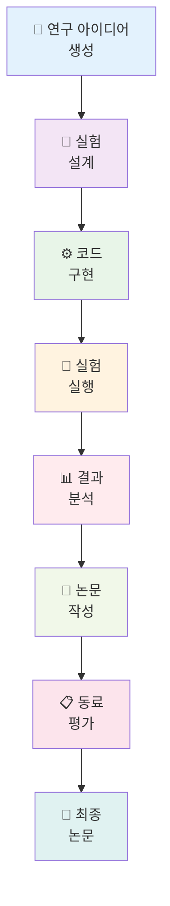

⏱️ **예상 읽기 시간**: 18분

## 서론

잠들어 있는 동안에도 끊임없이 논문을 생성하고, 실험을 수행하며, 과학적 발견의 경계를 넓혀가는 지칠 줄 모르는 AI 연구자가 있다고 상상해보세요. **SakanaAI의 AI Scientist**와 로컬 LLM 인프라를 활용하면, 이는 더 이상 공상과학이 아닌 오늘 당장 구현할 수 있는 현실입니다.

이 종합 가이드에서는 다음을 활용한 자동화된 연구 파이프라인 구축 방법을 안내합니다:
- **SakanaAI의 AI Scientist**: 완전 자동화된 과학적 발견을 위한 세계 최초의 시스템
- **OrbStack Docker**: 원활한 배포를 위한 경량화된 컨테이너화
- **Ollama & LM Studio**: 비용 효율적이고 프라이빗한 연구를 위한 로컬 LLM 추론
- **큐 관리**: 지능적인 작업 스케줄링을 통한 지속적 운영

이 튜토리얼을 마치면, 지속적인 인간의 개입 없이도 여러 도메인에서 과학 논문을 생성할 수 있는 견고하고 자립적인 연구 환경을 갖추게 됩니다.

## AI Scientist 이해하기

### AI Scientist의 혁신적인 특징

[SakanaAI의 AI Scientist](https://github.com/SakanaAI/AI-Scientist)는 자동화된 연구의 패러다임 변화를 나타냅니다. 연구자를 돕는 기존의 AI 도구와 달리, 이 시스템은 **전체 연구 프로젝트를 자율적으로 수행**합니다:

- **종단간 자동화**: 아이디어 생성부터 논문 작성 및 동료 평가까지
- **다중 템플릿 지원**: NanoGPT, 2D Diffusion, Grokking 연구 도메인
- **자동화된 실험**: 실험을 설계하고, 실행하며, 분석
- **LaTeX 논문 생성**: 출판 준비가 완료된 학술 논문 제작
- **동료 평가 시스템**: 품질 평가를 위한 내장 평가 메커니즘

### 시스템 아키텍처 개요



## 사전 요구사항 및 환경 설정

### 시스템 요구사항

```bash
# 최소 하드웨어 요구사항
- 메모리: 16GB (대형 모델의 경우 32GB 권장)
- 저장 공간: 50GB 여유 공간
- CPU: 8+ 코어 (Apple Silicon 또는 x86_64)
- GPU: 선택사항이지만 권장 (NVIDIA RTX 3080+ 또는 Apple M-series)

# 소프트웨어 의존성
- macOS 13+ 또는 Linux Ubuntu 20.04+
- OrbStack 또는 Docker Desktop
- Python 3.8+
- Git
```

### OrbStack 설치

OrbStack은 특히 macOS에서 Docker Desktop보다 우수한 성능을 제공합니다:

```bash
# Homebrew를 통한 OrbStack 설치
brew install orbstack

# OrbStack 서비스 시작
orbstack start

# 설치 확인
orbstack --version
```

### Ollama 설정

Ollama는 우수한 로컬 LLM 추론 솔루션을 제공합니다:

```bash
# Ollama 설치
curl -fsSL https://ollama.ai/install.sh | sh

# Ollama 서비스 시작
ollama serve

# 연구용 권장 모델 다운로드
ollama pull llama2:70b          # 대형 컨텍스트 모델
ollama pull codellama:34b       # 코드 생성
ollama pull mistral:7b          # 빠른 추론
ollama pull deepseek-coder:33b  # 고급 코딩

# 설치 확인
ollama list
```

### LM Studio 대안 설정

GUI 기반 모델 관리를 위해:

```bash
# https://lmstudio.ai/에서 LM Studio 다운로드
# API 서버 설치 및 구성
# 기본 API 엔드포인트: http://localhost:1234/v1
```

## AI Scientist 설치 및 구성

### 저장소 복제 및 설정

```bash
# AI Scientist 저장소 복제
git clone https://github.com/SakanaAI/AI-Scientist.git
cd AI-Scientist

# 설정을 위한 전용 디렉토리 생성
mkdir -p ~/ai-research-lab
cd ~/ai-research-lab

# AI Scientist 파일 복사
cp -r /path/to/AI-Scientist/* .
```

### Docker 환경 구성

포괄적인 Docker 설정 생성:

```dockerfile
# 로컬 LLM 지원을 위한 AI Scientist Dockerfile
FROM python:3.9-slim

# 시스템 의존성 설치
RUN apt-get update && apt-get install -y \
    git \
    wget \
    curl \
    build-essential \
    texlive-full \
    pandoc \
    && rm -rf /var/lib/apt/lists/*

# 작업 디렉토리 설정
WORKDIR /app

# 요구사항 복사 및 Python 의존성 설치
COPY requirements.txt .
RUN pip install --no-cache-dir -r requirements.txt

# 향상된 기능을 위한 추가 패키지 설치
RUN pip install \
    ollama \
    openai \
    anthropic \
    tiktoken \
    matplotlib \
    seaborn \
    jupyter \
    notebook

# AI Scientist 코드 복사
COPY . .

# 필요한 디렉토리 생성
RUN mkdir -p /app/results /app/logs /app/queue

# 환경 변수 설정
ENV PYTHONPATH=/app
ENV OLLAMA_HOST=host.docker.internal:11434
ENV LM_STUDIO_BASE_URL=http://host.docker.internal:1234/v1

# Jupyter 및 모니터링용 포트 노출
EXPOSE 8888 8080

# 시작 스크립트 생성
COPY scripts/startup.sh /startup.sh
RUN chmod +x /startup.sh

CMD ["/startup.sh"]
```

### 완전한 스택을 위한 Docker Compose

```yaml
# docker-compose.yml
version: '3.8'

services:
  ai-scientist:
    build: .
    container_name: ai-scientist-main
    volumes:
      - ./results:/app/results
      - ./logs:/app/logs
      - ./queue:/app/queue
      - ./templates:/app/templates
    ports:
      - "8888:8888"  # Jupyter
      - "8080:8080"  # 모니터링 대시보드
    environment:
      - OLLAMA_HOST=host.docker.internal:11434
      - LM_STUDIO_BASE_URL=http://host.docker.internal:1234/v1
      - OPENAI_API_KEY=${OPENAI_API_KEY}
      - ANTHROPIC_API_KEY=${ANTHROPIC_API_KEY}
    depends_on:
      - redis
    networks:
      - ai-research-net

  redis:
    image: redis:7-alpine
    container_name: ai-scientist-redis
    ports:
      - "6379:6379"
    volumes:
      - redis_data:/data
    networks:
      - ai-research-net

  queue-manager:
    build: .
    container_name: ai-scientist-queue
    command: python scripts/queue_manager.py
    volumes:
      - ./queue:/app/queue
      - ./logs:/app/logs
    depends_on:
      - redis
      - ai-scientist
    networks:
      - ai-research-net

  monitoring:
    build: .
    container_name: ai-scientist-monitor
    command: python scripts/monitoring_dashboard.py
    ports:
      - "8081:8081"
    volumes:
      - ./logs:/app/logs
      - ./results:/app/results
    networks:
      - ai-research-net

volumes:
  redis_data:

networks:
  ai-research-net:
    driver: bridge
```

## 로컬 LLM 통합

### Ollama API 통합

Ollama용 사용자 정의 LLM 클라이언트 생성:

```python
# scripts/ollama_client.py
import requests
import json
from typing import Dict, List, Optional
import logging

class OllamaClient:
    def __init__(self, base_url: str = "http://localhost:11434"):
        self.base_url = base_url
        self.logger = logging.getLogger(__name__)
    
    def generate(self, 
                model: str,
                prompt: str,
                temperature: float = 0.7,
                max_tokens: int = 4000,
                **kwargs) -> str:
        """Ollama API를 사용하여 텍스트 생성"""
        try:
            payload = {
                "model": model,
                "prompt": prompt,
                "stream": False,
                "options": {
                    "temperature": temperature,
                    "num_predict": max_tokens,
                    **kwargs
                }
            }
            
            response = requests.post(
                f"{self.base_url}/api/generate",
                json=payload,
                timeout=300
            )
            response.raise_for_status()
            
            result = response.json()
            return result.get("response", "")
            
        except Exception as e:
            self.logger.error(f"Ollama 생성 오류: {e}")
            raise
    
    def list_models(self) -> List[str]:
        """사용 가능한 모델 목록"""
        try:
            response = requests.get(f"{self.base_url}/api/tags")
            response.raise_for_status()
            
            models = response.json().get("models", [])
            return [model["name"] for model in models]
            
        except Exception as e:
            self.logger.error(f"모델 목록 조회 오류: {e}")
            return []
    
    def chat_completion(self,
                       model: str,
                       messages: List[Dict],
                       temperature: float = 0.7,
                       max_tokens: int = 4000) -> str:
        """OpenAI 호환 채팅 완성"""
        try:
            # 메시지를 단일 프롬프트로 변환
            prompt = self._messages_to_prompt(messages)
            return self.generate(model, prompt, temperature, max_tokens)
            
        except Exception as e:
            self.logger.error(f"채팅 완성 오류: {e}")
            raise
    
    def _messages_to_prompt(self, messages: List[Dict]) -> str:
        """OpenAI 메시지 형식을 프롬프트로 변환"""
        prompt_parts = []
        
        for message in messages:
            role = message.get("role", "user")
            content = message.get("content", "")
            
            if role == "system":
                prompt_parts.append(f"시스템: {content}")
            elif role == "user":
                prompt_parts.append(f"사용자: {content}")
            elif role == "assistant":
                prompt_parts.append(f"어시스턴트: {content}")
        
        prompt_parts.append("어시스턴트:")
        return "\n\n".join(prompt_parts)

# 클라이언트 테스트
if __name__ == "__main__":
    client = OllamaClient()
    print("사용 가능한 모델:", client.list_models())
    
    test_response = client.generate(
        model="llama2:7b",
        prompt="양자 컴퓨팅을 간단한 용어로 설명해주세요."
    )
    print("테스트 응답:", test_response[:200] + "...")
```

### LM Studio 통합

```python
# scripts/lm_studio_client.py
import openai
from typing import Dict, List
import logging

class LMStudioClient:
    def __init__(self, base_url: str = "http://localhost:1234/v1"):
        self.client = openai.OpenAI(
            base_url=base_url,
            api_key="lm-studio"  # 필수이지만 무시됨
        )
        self.logger = logging.getLogger(__name__)
    
    def generate(self, 
                model: str,
                prompt: str,
                temperature: float = 0.7,
                max_tokens: int = 4000,
                **kwargs) -> str:
        """LM Studio API를 사용하여 텍스트 생성"""
        try:
            messages = [{"role": "user", "content": prompt}]
            
            response = self.client.chat.completions.create(
                model=model,
                messages=messages,
                temperature=temperature,
                max_tokens=max_tokens,
                **kwargs
            )
            
            return response.choices[0].message.content
            
        except Exception as e:
            self.logger.error(f"LM Studio 생성 오류: {e}")
            raise
    
    def chat_completion(self,
                       model: str,
                       messages: List[Dict],
                       temperature: float = 0.7,
                       max_tokens: int = 4000) -> str:
        """직접 채팅 완성"""
        try:
            response = self.client.chat.completions.create(
                model=model,
                messages=messages,
                temperature=temperature,
                max_tokens=max_tokens
            )
            
            return response.choices[0].message.content
            
        except Exception as e:
            self.logger.error(f"채팅 완성 오류: {e}")
            raise
    
    def list_models(self) -> List[str]:
        """사용 가능한 모델 목록"""
        try:
            models = self.client.models.list()
            return [model.id for model in models.data]
            
        except Exception as e:
            self.logger.error(f"모델 목록 조회 오류: {e}")
            return []

# 클라이언트 테스트
if __name__ == "__main__":
    client = LMStudioClient()
    print("사용 가능한 모델:", client.list_models())
    
    test_response = client.generate(
        model="local-model",
        prompt="기계 학습을 간단한 용어로 설명해주세요."
    )
    print("테스트 응답:", test_response[:200] + "...")
```

## 큐 관리 시스템

### Redis 기반 큐 구현

```python
# scripts/queue_manager.py
import redis
import json
import time
import logging
from datetime import datetime, timedelta
from typing import Dict, List, Optional, Any
from dataclasses import dataclass, asdict
from enum import Enum

class TaskStatus(Enum):
    PENDING = "pending"
    RUNNING = "running"
    COMPLETED = "completed"
    FAILED = "failed"
    CANCELLED = "cancelled"

@dataclass
class ResearchTask:
    id: str
    template: str
    model: str
    num_ideas: int
    priority: int = 1
    created_at: datetime = None
    started_at: datetime = None
    completed_at: datetime = None
    status: TaskStatus = TaskStatus.PENDING
    progress: int = 0
    error_message: str = ""
    results_path: str = ""
    
    def __post_init__(self):
        if self.created_at is None:
            self.created_at = datetime.now()

class QueueManager:
    def __init__(self, redis_host: str = "localhost", redis_port: int = 6379):
        self.redis_client = redis.Redis(
            host=redis_host, 
            port=redis_port, 
            decode_responses=True
        )
        self.logger = logging.getLogger(__name__)
        
        # 큐 키
        self.pending_queue = "ai_scientist:pending"
        self.running_queue = "ai_scientist:running"
        self.completed_queue = "ai_scientist:completed"
        self.failed_queue = "ai_scientist:failed"
        self.task_data = "ai_scientist:tasks"
    
    def add_task(self, task: ResearchTask) -> str:
        """새로운 연구 작업을 큐에 추가"""
        try:
            # 작업 데이터 저장
            task_json = json.dumps(asdict(task), default=str)
            self.redis_client.hset(self.task_data, task.id, task_json)
            
            # 우선순위로 대기 큐에 추가
            self.redis_client.zadd(
                self.pending_queue, 
                {task.id: task.priority}
            )
            
            self.logger.info(f"작업 {task.id} 큐에 추가됨")
            return task.id
            
        except Exception as e:
            self.logger.error(f"작업 추가 오류: {e}")
            raise
    
    def get_next_task(self) -> Optional[ResearchTask]:
        """다음 최고 우선순위 작업 가져오기"""
        try:
            # 최고 우선순위 작업 가져오기
            task_ids = self.redis_client.zrevrange(
                self.pending_queue, 0, 0
            )
            
            if not task_ids:
                return None
            
            task_id = task_ids[0]
            
            # 실행 큐로 이동
            self.redis_client.zrem(self.pending_queue, task_id)
            self.redis_client.sadd(self.running_queue, task_id)
            
            # 작업 데이터 가져오기
            task_data = self.redis_client.hget(self.task_data, task_id)
            if not task_data:
                return None
            
            task_dict = json.loads(task_data)
            task = ResearchTask(**task_dict)
            task.status = TaskStatus.RUNNING
            task.started_at = datetime.now()
            
            # 작업 업데이트
            self.update_task(task)
            
            return task
            
        except Exception as e:
            self.logger.error(f"다음 작업 가져오기 오류: {e}")
            return None
    
    def update_task(self, task: ResearchTask):
        """작업 상태 및 데이터 업데이트"""
        try:
            task_json = json.dumps(asdict(task), default=str)
            self.redis_client.hset(self.task_data, task.id, task_json)
            
        except Exception as e:
            self.logger.error(f"작업 업데이트 오류: {e}")
    
    def complete_task(self, task_id: str, results_path: str = ""):
        """작업을 완료로 표시"""
        try:
            task = self.get_task(task_id)
            if not task:
                return
            
            # 완료 큐로 이동
            self.redis_client.srem(self.running_queue, task_id)
            self.redis_client.sadd(self.completed_queue, task_id)
            
            # 작업 업데이트
            task.status = TaskStatus.COMPLETED
            task.completed_at = datetime.now()
            task.progress = 100
            task.results_path = results_path
            
            self.update_task(task)
            self.logger.info(f"작업 {task_id} 완료됨")
            
        except Exception as e:
            self.logger.error(f"작업 완료 오류: {e}")
    
    def fail_task(self, task_id: str, error_message: str = ""):
        """작업을 실패로 표시"""
        try:
            task = self.get_task(task_id)
            if not task:
                return
            
            # 실패 큐로 이동
            self.redis_client.srem(self.running_queue, task_id)
            self.redis_client.sadd(self.failed_queue, task_id)
            
            # 작업 업데이트
            task.status = TaskStatus.FAILED
            task.completed_at = datetime.now()
            task.error_message = error_message
            
            self.update_task(task)
            self.logger.error(f"작업 {task_id} 실패: {error_message}")
            
        except Exception as e:
            self.logger.error(f"작업 실패 처리 오류: {e}")
    
    def get_task(self, task_id: str) -> Optional[ResearchTask]:
        """ID로 작업 가져오기"""
        try:
            task_data = self.redis_client.hget(self.task_data, task_id)
            if not task_data:
                return None
            
            task_dict = json.loads(task_data)
            return ResearchTask(**task_dict)
            
        except Exception as e:
            self.logger.error(f"작업 가져오기 오류: {e}")
            return None
    
    def get_queue_stats(self) -> Dict[str, int]:
        """큐 통계 가져오기"""
        try:
            return {
                "pending": self.redis_client.zcard(self.pending_queue),
                "running": self.redis_client.scard(self.running_queue),
                "completed": self.redis_client.scard(self.completed_queue),
                "failed": self.redis_client.scard(self.failed_queue)
            }
            
        except Exception as e:
            self.logger.error(f"큐 통계 조회 오류: {e}")
            return {}
    
    def list_tasks(self, status: TaskStatus = None) -> List[ResearchTask]:
        """상태별 작업 목록"""
        try:
            if status == TaskStatus.PENDING:
                task_ids = self.redis_client.zrevrange(self.pending_queue, 0, -1)
            elif status == TaskStatus.RUNNING:
                task_ids = list(self.redis_client.smembers(self.running_queue))
            elif status == TaskStatus.COMPLETED:
                task_ids = list(self.redis_client.smembers(self.completed_queue))
            elif status == TaskStatus.FAILED:
                task_ids = list(self.redis_client.smembers(self.failed_queue))
            else:
                # 모든 작업 가져오기
                task_ids = list(self.redis_client.hkeys(self.task_data))
            
            tasks = []
            for task_id in task_ids:
                task = self.get_task(task_id)
                if task:
                    tasks.append(task)
            
            return tasks
            
        except Exception as e:
            self.logger.error(f"작업 목록 조회 오류: {e}")
            return []

# 워커 프로세스
class ResearchWorker:
    def __init__(self, queue_manager: QueueManager):
        self.queue_manager = queue_manager
        self.logger = logging.getLogger(__name__)
        self.running = False
    
    def start(self):
        """워커 프로세스 시작"""
        self.running = True
        self.logger.info("연구 워커가 시작되었습니다")
        
        while self.running:
            try:
                task = self.queue_manager.get_next_task()
                
                if task:
                    self.logger.info(f"작업 처리 중: {task.id}")
                    self.process_task(task)
                else:
                    # 사용 가능한 작업이 없음, 대기
                    time.sleep(10)
                    
            except KeyboardInterrupt:
                self.logger.info("워커가 중단되었습니다")
                break
            except Exception as e:
                self.logger.error(f"워커 오류: {e}")
                time.sleep(30)
    
    def process_task(self, task: ResearchTask):
        """연구 작업 처리"""
        try:
            # AI Scientist 모듈 가져오기
            import subprocess
            import os
            
            # 명령 준비
            cmd = [
                "python", "launch_scientist.py",
                "--model", task.model,
                "--experiment", task.template,
                "--num-ideas", str(task.num_ideas),
                "--out-dir", f"results/{task.id}"
            ]
            
            # 진행률 업데이트
            task.progress = 10
            self.queue_manager.update_task(task)
            
            # AI Scientist 실행
            result = subprocess.run(
                cmd,
                capture_output=True,
                text=True,
                timeout=3600  # 1시간 타임아웃
            )
            
            if result.returncode == 0:
                # 성공
                results_path = f"results/{task.id}"
                self.queue_manager.complete_task(task.id, results_path)
                self.logger.info(f"작업 {task.id}이 성공적으로 완료되었습니다")
            else:
                # 실패
                error_msg = result.stderr or "알 수 없는 오류"
                self.queue_manager.fail_task(task.id, error_msg)
                self.logger.error(f"작업 {task.id} 실패: {error_msg}")
                
        except subprocess.TimeoutExpired:
            self.queue_manager.fail_task(task.id, "작업 타임아웃")
        except Exception as e:
            self.queue_manager.fail_task(task.id, str(e))
    
    def stop(self):
        """워커 프로세스 중지"""
        self.running = False
        self.logger.info("연구 워커가 중지되었습니다")

# 메인 실행
if __name__ == "__main__":
    logging.basicConfig(level=logging.INFO)
    
    # 큐 매니저 초기화
    queue_manager = QueueManager()
    
    # 워커 생성 및 시작
    worker = ResearchWorker(queue_manager)
    
    try:
        worker.start()
    except KeyboardInterrupt:
        worker.stop()
```

## 모니터링 및 관리

### 실시간 대시보드

```python
# scripts/monitoring_dashboard.py
import streamlit as st
import plotly.express as px
import plotly.graph_objects as go
import pandas as pd
import time
from datetime import datetime, timedelta
from queue_manager import QueueManager, TaskStatus

st.set_page_config(
    page_title="AI Scientist 대시보드",
    page_icon="🧑‍🔬",
    layout="wide"
)

class MonitoringDashboard:
    def __init__(self):
        self.queue_manager = QueueManager()
    
    def render_header(self):
        """대시보드 헤더 렌더링"""
        st.title("🧑‍🔬 AI Scientist 연구 대시보드")
        st.markdown("자동화된 연구 파이프라인의 실시간 모니터링")
        
        # 새로 고침 버튼
        if st.button("🔄 새로 고침", key="refresh"):
            st.rerun()
    
    def render_queue_stats(self):
        """큐 통계 렌더링"""
        stats = self.queue_manager.get_queue_stats()
        
        col1, col2, col3, col4 = st.columns(4)
        
        with col1:
            st.metric("⏳ 대기 중", stats.get("pending", 0))
        
        with col2:
            st.metric("🔄 실행 중", stats.get("running", 0))
        
        with col3:
            st.metric("✅ 완료", stats.get("completed", 0))
        
        with col4:
            st.metric("❌ 실패", stats.get("failed", 0))
    
    def render_task_timeline(self):
        """작업 타임라인 차트 렌더링"""
        st.subheader("📊 작업 타임라인")
        
        # 모든 작업 가져오기
        all_tasks = self.queue_manager.list_tasks()
        
        if not all_tasks:
            st.info("작업을 찾을 수 없습니다")
            return
        
        # 타임라인용 데이터 준비
        timeline_data = []
        for task in all_tasks:
            timeline_data.append({
                "작업 ID": task.id[:8],
                "템플릿": task.template,
                "모델": task.model,
                "상태": task.status.value,
                "생성됨": task.created_at,
                "시작됨": task.started_at,
                "완료됨": task.completed_at,
                "소요 시간": self._calculate_duration(task)
            })
        
        df = pd.DataFrame(timeline_data)
        
        # 상태 분포 파이 차트
        col1, col2 = st.columns(2)
        
        with col1:
            status_counts = df["상태"].value_counts()
            fig_pie = px.pie(
                values=status_counts.values,
                names=status_counts.index,
                title="작업 상태 분포"
            )
            st.plotly_chart(fig_pie, use_container_width=True)
        
        with col2:
            # 소요 시간 히스토그램
            completed_tasks = df[df["상태"] == "completed"]
            if not completed_tasks.empty:
                fig_hist = px.histogram(
                    completed_tasks,
                    x="소요 시간",
                    title="작업 소요 시간 분포 (분)",
                    nbins=20
                )
                st.plotly_chart(fig_hist, use_container_width=True)
            else:
                st.info("아직 완료된 작업이 없습니다")
    
    def render_task_list(self):
        """상세 작업 목록 렌더링"""
        st.subheader("📋 작업 세부 정보")
        
        # 상태 필터
        status_filter = st.selectbox(
            "상태별 필터",
            ["전체", "pending", "running", "completed", "failed"]
        )
        
        # 필터링된 작업 가져오기
        if status_filter == "전체":
            tasks = self.queue_manager.list_tasks()
        else:
            tasks = self.queue_manager.list_tasks(TaskStatus(status_filter))
        
        if not tasks:
            st.info(f"{status_filter} 작업을 찾을 수 없습니다")
            return
        
        # 작업 테이블 생성
        task_data = []
        for task in tasks:
            task_data.append({
                "ID": task.id[:8] + "...",
                "템플릿": task.template,
                "모델": task.model,
                "아이디어": task.num_ideas,
                "상태": task.status.value.title(),
                "진행률": f"{task.progress}%",
                "생성됨": task.created_at.strftime("%Y-%m-%d %H:%M") if task.created_at else "N/A",
                "소요 시간": self._calculate_duration(task),
                "오류": task.error_message[:50] + "..." if len(task.error_message) > 50 else task.error_message
            })
        
        df = pd.DataFrame(task_data)
        st.dataframe(df, use_container_width=True)
    
    def render_resource_usage(self):
        """자원 사용량 메트릭 렌더링"""
        st.subheader("💻 자원 사용량")
        
        # 실제 시스템 메트릭에 연결해야 함
        # 데모 목적으로 플레이스홀더 데이터 표시
        col1, col2, col3 = st.columns(3)
        
        with col1:
            # CPU 사용량 시뮬레이션
            cpu_usage = 65  # 실제 모니터링에서 가져와야 함
            fig_cpu = go.Figure(go.Indicator(
                mode="gauge+number",
                value=cpu_usage,
                domain={'x': [0, 1], 'y': [0, 1]},
                title={'text': "CPU 사용량 %"},
                gauge={'axis': {'range': [None, 100]},
                       'bar': {'color': "darkblue"},
                       'steps': [
                           {'range': [0, 50], 'color': "lightgray"},
                           {'range': [50, 80], 'color': "yellow"},
                           {'range': [80, 100], 'color': "red"}
                       ]}
            ))
            fig_cpu.update_layout(height=250)
            st.plotly_chart(fig_cpu, use_container_width=True)
        
        with col2:
            # 메모리 사용량 시뮬레이션
            mem_usage = 78
            fig_mem = go.Figure(go.Indicator(
                mode="gauge+number",
                value=mem_usage,
                domain={'x': [0, 1], 'y': [0, 1]},
                title={'text': "메모리 사용량 %"},
                gauge={'axis': {'range': [None, 100]},
                       'bar': {'color': "darkgreen"},
                       'steps': [
                           {'range': [0, 50], 'color': "lightgray"},
                           {'range': [50, 80], 'color': "yellow"},
                           {'range': [80, 100], 'color': "red"}
                       ]}
            ))
            fig_mem.update_layout(height=250)
            st.plotly_chart(fig_mem, use_container_width=True)
        
        with col3:
            # GPU 사용량 시뮬레이션 (사용 가능한 경우)
            gpu_usage = 45
            fig_gpu = go.Figure(go.Indicator(
                mode="gauge+number",
                value=gpu_usage,
                domain={'x': [0, 1], 'y': [0, 1]},
                title={'text': "GPU 사용량 %"},
                gauge={'axis': {'range': [None, 100]},
                       'bar': {'color': "darkred"},
                       'steps': [
                           {'range': [0, 50], 'color': "lightgray"},
                           {'range': [50, 80], 'color': "yellow"},
                           {'range': [80, 100], 'color': "red"}
                       ]}
            ))
            fig_gpu.update_layout(height=250)
            st.plotly_chart(fig_gpu, use_container_width=True)
    
    def render_logs(self):
        """최근 로그 렌더링"""
        st.subheader("📜 최근 로그")
        
        # 실제 로그 파일에서 읽어와야 함
        # 데모 목적으로 플레이스홀더 표시
        log_entries = [
            "2025-09-02 14:30:15 - INFO - 작업 12345678 처리 시작",
            "2025-09-02 14:28:42 - INFO - Ollama 모델 llama2:70b 성공적으로 로드됨",
            "2025-09-02 14:25:10 - INFO - 새 작업이 큐에 추가됨: nanoGPT_lite",
            "2025-09-02 14:22:33 - INFO - 작업 87654321 성공적으로 완료됨",
            "2025-09-02 14:20:15 - ERROR - 작업 11111111 실패: 연결 타임아웃"
        ]
        
        for entry in log_entries:
            level = "INFO" if "INFO" in entry else "ERROR" if "ERROR" in entry else "WARNING"
            if level == "INFO":
                st.info(entry)
            elif level == "ERROR":
                st.error(entry)
            else:
                st.warning(entry)
    
    def _calculate_duration(self, task) -> str:
        """작업 소요 시간 계산"""
        if task.completed_at and task.started_at:
            duration = task.completed_at - task.started_at
            return f"{duration.total_seconds() / 60:.1f} 분"
        elif task.started_at:
            duration = datetime.now() - task.started_at
            return f"{duration.total_seconds() / 60:.1f} 분 (진행 중)"
        else:
            return "시작되지 않음"
    
    def run(self):
        """대시보드 실행"""
        self.render_header()
        
        # 30초마다 자동 새로 고침
        if "last_refresh" not in st.session_state:
            st.session_state.last_refresh = time.time()
        
        if time.time() - st.session_state.last_refresh > 30:
            st.session_state.last_refresh = time.time()
            st.rerun()
        
        # 메인 콘텐츠
        self.render_queue_stats()
        st.divider()
        
        self.render_task_timeline()
        st.divider()
        
        self.render_task_list()
        st.divider()
        
        self.render_resource_usage()
        st.divider()
        
        self.render_logs()

# 대시보드 실행
if __name__ == "__main__":
    dashboard = MonitoringDashboard()
    dashboard.run()
```

## 실용적 구현 예제

### 예제 1: 24/7 다중 템플릿 연구

```bash
#!/bin/bash
# scripts/deploy_ai_scientist_24_7.sh

echo "🚀 AI Scientist 24/7 연구 파이프라인 배포 중"

# 환경 변수 설정
export OLLAMA_HOST="localhost:11434"
export LM_STUDIO_BASE_URL="http://localhost:1234/v1"

# OrbStack 시작
echo "OrbStack 시작 중..."
orbstack start

# Ollama 시작
echo "Ollama 시작 중..."
ollama serve &
OLLAMA_PID=$!

# Ollama가 준비될 때까지 대기
echo "Ollama 준비 대기 중..."
sleep 10

# 필요한 모델이 없으면 다운로드
echo "모델 사용 가능 확인 중..."
ollama pull llama2:70b &
ollama pull codellama:34b &
ollama pull mistral:7b &
ollama pull deepseek-coder:33b &
wait

# Docker Compose 스택 시작
echo "AI Scientist 스택 시작 중..."
cd ~/ai-research-lab
docker-compose up -d

# 서비스가 준비될 때까지 대기
echo "서비스 초기화 대기 중..."
sleep 30

# 초기 연구 배치 제출
echo "초기 연구 작업 제출 중..."
python scripts/task_submitter.py --batch

# 지능형 스케줄러 시작
echo "지능형 스케줄러 시작 중..."
python scripts/intelligent_scheduler.py &
SCHEDULER_PID=$!

# 자원 모니터링 시작
echo "자원 모니터링 시작 중..."
python scripts/resource_monitor.py &
MONITOR_PID=$!

echo "✅ AI Scientist 24/7 파이프라인이 성공적으로 배포되었습니다!"
echo ""
echo "🌐 접근 포인트:"
echo "  - 모니터링 대시보드: http://localhost:8081"
echo "  - Jupyter 노트북: http://localhost:8888"
echo "  - 큐 통계: 로그 또는 대시보드 참조"
echo ""
echo "📊 모니터링 방법:"
echo "  docker-compose logs -f"
echo "  tail -f logs/scheduler.log"
echo "  tail -f logs/resource_monitor.log"
echo ""
echo "🛑 중지 방법:"
echo "  docker-compose down"
echo "  kill $OLLAMA_PID $SCHEDULER_PID $MONITOR_PID"

# 정리를 위한 PID 저장
echo "$OLLAMA_PID $SCHEDULER_PID $MONITOR_PID" > .ai_scientist_pids

echo "파이프라인이 24/7 실행 중입니다. 중지하려면 Ctrl+C를 누르세요."

# 인터럽트 대기
trap 'echo "AI Scientist 파이프라인 중지 중..."; docker-compose down; kill $OLLAMA_PID $SCHEDULER_PID $MONITOR_PID; exit' INT
while true; do sleep 1; done
```

### 예제 2: 주말 연구 마라톤

```python
# scripts/weekend_research_marathon.py
"""
주말 연구 마라톤
주말 동안 포괄적인 연구 실험을 자동으로 실행
"""

import schedule
import time
import logging
from datetime import datetime, timedelta
from task_submitter import TaskSubmitter
from queue_manager import QueueManager

class WeekendMarathon:
    def __init__(self):
        self.submitter = TaskSubmitter()
        self.queue_manager = QueueManager()
        self.logger = logging.getLogger(__name__)
        
        # 마라톤 구성
        self.marathon_templates = [
            "nanoGPT_lite",
            "2d_diffusion", 
            "grokking"
        ]
        
        self.marathon_models = [
            "llama2:70b",      # 대형 컨텍스트
            "codellama:34b",   # 코드 전문가
            "mistral:7b",      # 빠른 추론
            "deepseek-coder:33b"  # 고급 코딩
        ]
        
        # 연구 강도 레벨
        self.research_intensity = {
            "light": {"ideas_per_task": 2, "parallel_tasks": 2},
            "medium": {"ideas_per_task": 3, "parallel_tasks": 3},
            "heavy": {"ideas_per_task": 5, "parallel_tasks": 4},
            "extreme": {"ideas_per_task": 8, "parallel_tasks": 6}
        }
    
    def friday_evening_prep(self):
        """금요일 저녁 준비"""
        self.logger.info("🎯 금요일 저녁: 주말 마라톤 준비")
        
        # 초기 무거운 배치 제출
        task_ids = self.submitter.submit_research_batch(
            templates=self.marathon_templates,
            models=self.marathon_models[:2],  # 2개 모델로 시작
            ideas_per_task=5,
            priority=3
        )
        
        self.logger.info(f"📝 금요일 준비 작업 {len(task_ids)}개 제출됨")
    
    def saturday_morning_boost(self):
        """토요일 아침 연구 부스트"""
        self.logger.info("🌅 토요일 아침: 연구 파이프라인 부스팅")
        
        # 무거운 강도 연구
        intensity = self.research_intensity["heavy"]
        
        task_ids = self.submitter.submit_research_batch(
            templates=self.marathon_templates,
            models=self.marathon_models,  # 모든 모델
            ideas_per_task=intensity["ideas_per_task"],
            priority=3
        )
        
        self.logger.info(f"🚀 토요일 부스트: {len(task_ids)}개 작업 제출됨")
    
    def saturday_evening_deep_dive(self):
        """토요일 저녁 심화 연구"""
        self.logger.info("🌙 토요일 저녁: 심화 연구 다이빙")
        
        # 강력한 모델로 가장 복잡한 템플릿에 집중
        task_ids = self.submitter.submit_research_batch(
            templates=["grokking"],  # 가장 복잡함
            models=["llama2:70b", "deepseek-coder:33b"],
            ideas_per_task=8,  # 많은 아이디어
            priority=4  # 최고 우선순위
        )
        
        self.logger.info(f"🧠 심화 다이빙: {len(task_ids)}개 복잡한 작업")
    
    def sunday_comprehensive_sweep(self):
        """일요일 포괄적 연구 스윕"""
        self.logger.info("🔄 일요일: 포괄적 연구 스윕")
        
        # 모든 템플릿에서 극한 강도
        intensity = self.research_intensity["extreme"]
        
        task_ids = self.submitter.submit_research_batch(
            templates=self.marathon_templates,
            models=self.marathon_models,
            ideas_per_task=intensity["ideas_per_task"],
            priority=3
        )
        
        self.logger.info(f"🌊 일요일 스윕: {len(task_ids)}개 작업")
    
    def sunday_evening_wind_down(self):
        """일요일 저녁 마무리"""
        self.logger.info("🌅 일요일 저녁: 마라톤 마무리")
        
        # 월요일 준비를 위한 가벼운 강도
        intensity = self.research_intensity["light"]
        
        task_ids = self.submitter.submit_research_batch(
            templates=self.marathon_templates[:1],  # 한 템플릿만
            models=self.marathon_models[:2],        # 빠른 모델들
            ideas_per_task=intensity["ideas_per_task"],
            priority=2
        )
        
        self.logger.info(f"🌙 마무리: {len(task_ids)}개 최종 작업")
        
        # 주말 보고서 생성
        self.generate_weekend_report()
    
    def generate_weekend_report(self):
        """포괄적인 주말 연구 보고서 생성"""
        try:
            # 주말 작업 (금요일 오후 6시 ~ 일요일 오후 11시)
            friday_start = datetime.now().replace(
                hour=18, minute=0, second=0, microsecond=0
            ) - timedelta(days=2)  # 지난 금요일
            
            sunday_end = datetime.now().replace(
                hour=23, minute=0, second=0, microsecond=0
            )
            
            # 작업 통계 가져오기
            all_tasks = self.queue_manager.list_tasks()
            weekend_tasks = [
                task for task in all_tasks
                if task.created_at and friday_start <= task.created_at <= sunday_end
            ]
            
            # 보고서 생성
            report = {
                "주말_기간": f"{friday_start.strftime('%Y-%m-%d %H:%M')} ~ {sunday_end.strftime('%Y-%m-%d %H:%M')}",
                "총_작업": len(weekend_tasks),
                "완료된_작업": len([t for t in weekend_tasks if t.status.value == "completed"]),
                "실패한_작업": len([t for t in weekend_tasks if t.status.value == "failed"]),
                "총_생성된_아이디어": sum(t.num_ideas for t in weekend_tasks),
                "사용된_템플릿": list(set(t.template for t in weekend_tasks)),
                "사용된_모델": list(set(t.model for t in weekend_tasks))
            }
            
            # 보고서 로그
            self.logger.info("📊 주말 연구 마라톤 보고서:")
            for key, value in report.items():
                self.logger.info(f"  {key}: {value}")
            
            # 파일에 보고서 저장
            with open(f"reports/weekend_marathon_{datetime.now().strftime('%Y%m%d')}.json", "w") as f:
                import json
                json.dump(report, f, indent=2, default=str, ensure_ascii=False)
                
        except Exception as e:
            self.logger.error(f"주말 보고서 생성 오류: {e}")
    
    def setup_marathon_schedule(self):
        """주말 마라톤 스케줄 설정"""
        # 금요일 저녁 준비
        schedule.every().friday.at("18:00").do(self.friday_evening_prep)
        
        # 토요일 스케줄
        schedule.every().saturday.at("08:00").do(self.saturday_morning_boost)
        schedule.every().saturday.at("20:00").do(self.saturday_evening_deep_dive)
        
        # 일요일 스케줄
        schedule.every().sunday.at("10:00").do(self.sunday_comprehensive_sweep)
        schedule.every().sunday.at("22:00").do(self.sunday_evening_wind_down)
        
        self.logger.info("🗓️ 주말 마라톤 스케줄 구성됨")
    
    def run_marathon(self):
        """주말 마라톤 스케줄러 실행"""
        self.setup_marathon_schedule()
        
        self.logger.info("🏃‍♂️ 주말 연구 마라톤 시작됨")
        self.logger.info("스케줄:")
        self.logger.info("  금요일 18:00 - 준비")
        self.logger.info("  토요일 08:00 - 아침 부스트")
        self.logger.info("  토요일 20:00 - 심화 다이빙")
        self.logger.info("  일요일 10:00 - 포괄적 스윕")
        self.logger.info("  일요일 22:00 - 마무리")
        
        while True:
            try:
                schedule.run_pending()
                time.sleep(60)
                
            except KeyboardInterrupt:
                self.logger.info("사용자에 의해 주말 마라톤 중지됨")
                break
            except Exception as e:
                self.logger.error(f"마라톤 오류: {e}")
                time.sleep(300)

# 독립적인 주말 킥오프
def manual_weekend_kickoff():
    """수동으로 주말 연구 마라톤 시작"""
    marathon = WeekendMarathon()
    
    print("🏁 주말 연구 마라톤 지금 시작!")
    
    # 모든 마라톤 단계를 즉시 실행
    marathon.friday_evening_prep()
    time.sleep(60)
    
    marathon.saturday_morning_boost()
    time.sleep(60)
    
    marathon.saturday_evening_deep_dive()
    time.sleep(60)
    
    marathon.sunday_comprehensive_sweep()
    
    print("✅ 주말 마라톤 작업 제출 완료!")
    print("진행 상황 모니터링: http://localhost:8081")

if __name__ == "__main__":
    import sys
    
    logging.basicConfig(
        level=logging.INFO,
        format='%(asctime)s - %(name)s - %(levelname)s - %(message)s',
        handlers=[
            logging.FileHandler('logs/weekend_marathon.log'),
            logging.StreamHandler()
        ]
    )
    
    if len(sys.argv) > 1 and sys.argv[1] == "--kickoff":
        manual_weekend_kickoff()
    else:
        marathon = WeekendMarathon()
        try:
            marathon.run_marathon()
        except KeyboardInterrupt:
            print("주말 마라톤 스케줄러 중지됨")
```

### 예제 3: 적응형 연구 큐

```python
# scripts/adaptive_research_queue.py
"""
적응형 연구 큐
시스템 성능, 하루 중 시간, 연구 도메인 선호도에 따라
연구 작업을 지능적으로 관리
"""

import time
import json
import logging
from datetime import datetime, timedelta
from typing import Dict, List, Tuple
from queue_manager import QueueManager, ResearchTask, TaskStatus
from task_submitter import TaskSubmitter

class AdaptiveResearchQueue:
    def __init__(self):
        self.queue_manager = QueueManager()
        self.submitter = TaskSubmitter()
        self.logger = logging.getLogger(__name__)
        
        # 연구 도메인 구성
        self.domain_configs = {
            "nanoGPT_lite": {
                "복잡도": "중간",
                "자원_집약도": "높음",
                "평균_소요시간": 120,  # 분
                "성공률": 0.85,
                "선호_모델": ["codellama:34b", "deepseek-coder:33b"]
            },
            "2d_diffusion": {
                "복잡도": "높음", 
                "자원_집약도": "매우_높음",
                "평균_소요시간": 180,
                "성공률": 0.75,
                "선호_모델": ["llama2:70b", "mistral:7b"]
            },
            "grokking": {
                "복잡도": "매우_높음",
                "자원_집약도": "중간",
                "평균_소요시간": 200,
                "성공률": 0.70,
                "선호_모델": ["llama2:70b", "deepseek-coder:33b"]
            }
        }
        
        # 성능 임계값
        self.performance_thresholds = {
            "cpu_high": 80,
            "memory_high": 85,
            "cpu_critical": 95,
            "memory_critical": 95
        }
        
        # 적응형 매개변수
        self.adaptation_history = []
        self.performance_history = []
    
    def analyze_system_performance(self) -> Dict:
        """현재 시스템 성능 및 용량 분석"""
        try:
            # 실제 구현에서는 시스템 메트릭을 가져와야 함
            # 여기서는 시뮬레이션된 데이터 사용
            import random
            
            cpu_usage = random.uniform(30, 90)
            memory_usage = random.uniform(40, 85)
            
            # 용량 레벨 결정
            if (cpu_usage > self.performance_thresholds["cpu_critical"] or 
                memory_usage > self.performance_thresholds["memory_critical"]):
                capacity_level = "critical"
                recommended_concurrency = 1
            elif (cpu_usage > self.performance_thresholds["cpu_high"] or 
                  memory_usage > self.performance_thresholds["memory_high"]):
                capacity_level = "high"
                recommended_concurrency = 2
            elif cpu_usage > 50 or memory_usage > 50:
                capacity_level = "medium"
                recommended_concurrency = 3
            else:
                capacity_level = "low"
                recommended_concurrency = 4
            
            analysis = {
                "cpu_usage": cpu_usage,
                "memory_usage": memory_usage,
                "capacity_level": capacity_level,
                "recommended_concurrency": recommended_concurrency,
                "timestamp": datetime.now().isoformat()
            }
            
            # 히스토리에 저장
            self.performance_history.append(analysis)
            
            # 최근 24시간만 유지
            cutoff = datetime.now() - timedelta(hours=24)
            self.performance_history = [
                p for p in self.performance_history
                if datetime.fromisoformat(p["timestamp"]) > cutoff
            ]
            
            return analysis
            
        except Exception as e:
            self.logger.error(f"시스템 성능 분석 오류: {e}")
            return {
                "cpu_usage": 50,
                "memory_usage": 50,
                "capacity_level": "medium",
                "recommended_concurrency": 2
            }
    
    def get_optimal_research_mix(self, performance: Dict) -> List[Dict]:
        """성능에 따른 최적 연구 작업 믹스 결정"""
        capacity_level = performance["capacity_level"]
        current_hour = datetime.now().hour
        
        # 시간 기반 선호도
        if 22 <= current_hour or current_hour <= 6:
            # 야간 시간: 복잡하고 장시간 실행되는 작업 선호
            time_preference = "complex"
        elif 9 <= current_hour <= 17:
            # 업무 시간: 빠르고 가벼운 작업 선호
            time_preference = "light"
        else:
            # 저녁: 균형 잡힌 접근
            time_preference = "balanced"
        
        # 용량 기반 조정
        if capacity_level == "critical":
            # 가벼운 작업만
            return self._get_light_task_mix()
        elif capacity_level == "high":
            # 중간 복잡도 작업
            return self._get_medium_task_mix(time_preference)
        elif capacity_level == "medium":
            # 균형 잡힌 믹스
            return self._get_balanced_task_mix(time_preference)
        else:
            # 낮은 사용량: 무거운 작업 실행 가능
            return self._get_heavy_task_mix(time_preference)
    
    def _get_light_task_mix(self) -> List[Dict]:
        """가벼운 계산 부하 작업 믹스"""
        return [
            {
                "template": "nanoGPT_lite",
                "model": "mistral:7b",
                "num_ideas": 2,
                "priority": 1
            }
        ]
    
    def _get_medium_task_mix(self, time_preference: str) -> List[Dict]:
        """중간 계산 부하 작업 믹스"""
        if time_preference == "light":
            return [
                {
                    "template": "nanoGPT_lite",
                    "model": "mistral:7b",
                    "num_ideas": 3,
                    "priority": 2
                },
                {
                    "template": "2d_diffusion",
                    "model": "mistral:7b",
                    "num_ideas": 2,
                    "priority": 1
                }
            ]
        else:
            return [
                {
                    "template": "nanoGPT_lite",
                    "model": "codellama:34b",
                    "num_ideas": 3,
                    "priority": 2
                },
                {
                    "template": "grokking",
                    "model": "llama2:70b",
                    "num_ideas": 2,
                    "priority": 2
                }
            ]
    
    def _get_balanced_task_mix(self, time_preference: str) -> List[Dict]:
        """균형 잡힌 계산 부하 작업 믹스"""
        if time_preference == "complex":
            return [
                {
                    "template": "grokking",
                    "model": "llama2:70b",
                    "num_ideas": 4,
                    "priority": 3
                },
                {
                    "template": "2d_diffusion",
                    "model": "deepseek-coder:33b",
                    "num_ideas": 3,
                    "priority": 2
                },
                {
                    "template": "nanoGPT_lite",
                    "model": "codellama:34b",
                    "num_ideas": 3,
                    "priority": 2
                }
            ]
        else:
            return [
                {
                    "template": "nanoGPT_lite",
                    "model": "codellama:34b",
                    "num_ideas": 3,
                    "priority": 2
                },
                {
                    "template": "2d_diffusion",
                    "model": "mistral:7b",
                    "num_ideas": 3,
                    "priority": 2
                }
            ]
    
    def _get_heavy_task_mix(self, time_preference: str) -> List[Dict]:
        """무거운 계산 부하 작업 믹스"""
        return [
            {
                "template": "grokking",
                "model": "llama2:70b",
                "num_ideas": 6,
                "priority": 3
            },
            {
                "template": "2d_diffusion",
                "model": "deepseek-coder:33b",
                "num_ideas": 5,
                "priority": 3
            },
            {
                "template": "nanoGPT_lite",
                "model": "codellama:34b",
                "num_ideas": 4,
                "priority": 2
            },
            {
                "template": "grokking",
                "model": "deepseek-coder:33b",
                "num_ideas": 4,
                "priority": 2
            }
        ]
    
    def should_add_tasks(self, performance: Dict) -> bool:
        """새 작업을 추가해야 하는지 결정"""
        stats = self.queue_manager.get_queue_stats()
        
        running_tasks = stats.get("running", 0)
        pending_tasks = stats.get("pending", 0)
        
        # 시스템이 스트레스를 받으면 작업 추가 안 함
        if performance["capacity_level"] == "critical":
            return False
        
        # 권장 동시성에 따라 작업 추가
        recommended_concurrency = performance["recommended_concurrency"]
        total_active = running_tasks + pending_tasks
        
        return total_active < recommended_concurrency
    
    def adaptive_task_submission(self):
        """현재 조건에 따라 적응적으로 작업 제출"""
        try:
            # 시스템 성능 분석
            performance = self.analyze_system_performance()
            
            self.logger.info(
                f"시스템 분석: CPU {performance['cpu_usage']:.1f}%, "
                f"메모리 {performance['memory_usage']:.1f}%, "
                f"용량: {performance['capacity_level']}"
            )
            
            # 작업을 추가해야 하는지 확인
            if not self.should_add_tasks(performance):
                self.logger.info("시스템이 바쁘거나 큐가 가득 참, 작업 추가 건너뜀")
                return
            
            # 최적 작업 믹스 가져오기
            task_mix = self.get_optimal_research_mix(performance)
            
            # 작업 제출
            submitted_tasks = []
            for task_config in task_mix:
                task_id = self._submit_single_task(task_config)
                if task_id:
                    submitted_tasks.append(task_id)
            
            # 적응 기록
            adaptation_record = {
                "timestamp": datetime.now().isoformat(),
                "performance": performance,
                "task_mix": task_mix,
                "submitted_tasks": len(submitted_tasks)
            }
            
            self.adaptation_history.append(adaptation_record)
            
            self.logger.info(
                f"적응형 제출: {performance['capacity_level']} 용량 시스템을 위한 "
                f"{len(submitted_tasks)}개 작업"
            )
            
        except Exception as e:
            self.logger.error(f"적응형 작업 제출 오류: {e}")
    
    def _submit_single_task(self, task_config: Dict) -> str:
        """구성에 따라 단일 작업 제출"""
        try:
            import uuid
            
            task_id = str(uuid.uuid4())
            task = ResearchTask(
                id=task_id,
                template=task_config["template"],
                model=task_config["model"],
                num_ideas=task_config["num_ideas"],
                priority=task_config["priority"]
            )
            
            self.queue_manager.add_task(task)
            return task_id
            
        except Exception as e:
            self.logger.error(f"작업 제출 오류: {e}")
            return None
    
    def run_adaptive_queue(self, check_interval: int = 300):
        """적응형 큐 관리 시스템 실행"""
        self.logger.info(f"🧠 적응형 연구 큐 시작 ({check_interval}초마다 확인)")
        
        while True:
            try:
                # 적응형 작업 제출 수행
                self.adaptive_task_submission()
                
                # 주기적 보고서 생성
                if len(self.adaptation_history) % 12 == 0:  # 12번의 적응마다
                    report = self.generate_adaptation_report()
                    self.logger.info(f"📊 적응 보고서: {report}")
                
                # 다음 확인까지 대기
                time.sleep(check_interval)
                
            except KeyboardInterrupt:
                self.logger.info("사용자에 의해 적응형 큐 중지됨")
                break
            except Exception as e:
                self.logger.error(f"적응형 큐 오류: {e}")
                time.sleep(60)
    
    def generate_adaptation_report(self) -> Dict:
        """적응 성능에 대한 보고서 생성"""
        try:
            if not self.adaptation_history:
                return {"error": "적응 히스토리가 없습니다"}
            
            # 적응 통계 계산
            recent_adaptations = self.adaptation_history[-24:]  # 최근 24번의 적응
            
            capacity_distribution = {}
            task_distribution = {}
            
            for adaptation in recent_adaptations:
                capacity = adaptation["performance"]["capacity_level"]
                capacity_distribution[capacity] = capacity_distribution.get(capacity, 0) + 1
                
                for task in adaptation["task_mix"]:
                    template = task["template"]
                    task_distribution[template] = task_distribution.get(template, 0) + 1
            
            # 성능 트렌드
            avg_cpu = sum(a["performance"]["cpu_usage"] for a in recent_adaptations) / len(recent_adaptations)
            avg_memory = sum(a["performance"]["memory_usage"] for a in recent_adaptations) / len(recent_adaptations)
            
            report = {
                "분석_기간": f"최근 {len(recent_adaptations)}번의 적응",
                "평균_성능": {
                    "cpu_사용량": round(avg_cpu, 1),
                    "메모리_사용량": round(avg_memory, 1)
                },
                "용량_분포": capacity_distribution,
                "작업_템플릿_분포": task_distribution,
                "총_제출된_작업": sum(a["submitted_tasks"] for a in recent_adaptations),
                "적응_빈도": len(recent_adaptations)
            }
            
            return report
            
        except Exception as e:
            self.logger.error(f"적응 보고서 생성 오류: {e}")
            return {"error": str(e)}

if __name__ == "__main__":
    logging.basicConfig(
        level=logging.INFO,
        format='%(asctime)s - %(name)s - %(levelname)s - %(message)s',
        handlers=[
            logging.FileHandler('logs/adaptive_queue.log'),
            logging.StreamHandler()
        ]
    )
    
    adaptive_queue = AdaptiveResearchQueue()
    
    try:
        adaptive_queue.run_adaptive_queue(check_interval=300)  # 5분마다 확인
    except KeyboardInterrupt:
        print("적응형 연구 큐가 중지되었습니다")
```

## 문제 해결 및 최적화

### 일반적인 문제 및 해결책

#### 문제 1: Ollama 연결 실패

```bash
# Ollama 연결성 디버그
curl http://localhost:11434/api/tags

# Ollama 로그 확인
journalctl -u ollama --follow

# Ollama 서비스 재시작
sudo systemctl restart ollama

# 대안: 수동 재시작
pkill ollama
ollama serve
```

#### 문제 2: Docker 메모리 문제

```yaml
# docker-compose.override.yml
version: '3.8'

services:
  ai-scientist:
    deploy:
      resources:
        limits:
          memory: 16G
          cpus: '8'
        reservations:
          memory: 8G
          cpus: '4'
    environment:
      - MALLOC_ARENA_MAX=2
      - PYTHONHASHSEED=0
```

#### 문제 3: 큐 정체 작업

```python
# scripts/queue_recovery.py
from queue_manager import QueueManager, TaskStatus
from datetime import datetime, timedelta

def recover_stuck_tasks():
    """너무 오래 실행된 작업 복구"""
    queue_manager = QueueManager()
    
    # 4시간 이상 실행된 작업 찾기
    cutoff_time = datetime.now() - timedelta(hours=4)
    running_tasks = queue_manager.list_tasks(TaskStatus.RUNNING)
    
    stuck_tasks = [
        task for task in running_tasks
        if task.started_at and task.started_at < cutoff_time
    ]
    
    for task in stuck_tasks:
        print(f"정체된 작업 복구 중: {task.id}")
        queue_manager.fail_task(
            task.id, 
            "작업 타임아웃 - 자동 복구됨"
        )
    
    print(f"{len(stuck_tasks)}개의 정체된 작업을 복구했습니다")

if __name__ == "__main__":
    recover_stuck_tasks()
```

### 성능 최적화 팁

1. **모델 선택 전략**:
   ```python
   # 초기 실험에는 작은 모델 사용
   quick_models = ["mistral:7b", "llama2:13b"]
   
   # 최종 검증에는 큰 모델 사용
   powerful_models = ["llama2:70b", "deepseek-coder:33b"]
   ```

2. **자원 관리**:
   ```bash
   # 시스템 용량에 따라 동시 작업 제한
   export MAX_CONCURRENT_TASKS=2
   
   # 임시 파일용 빠른 스토리지 사용
   export TMPDIR=/tmp/ai-scientist-fast
   mkdir -p $TMPDIR
   ```

3. **네트워크 최적화**:
   ```bash
   # 빠른 해상도를 위한 로컬 DNS 사용
   echo "127.0.0.1 host.docker.internal" >> /etc/hosts
   
   # Docker 네트워킹 최적화
   docker network create --driver bridge ai-research-net
   ```

## 결론

이 종합 가이드는 SakanaAI의 AI Scientist를 사용하여 정교하고 자동화된 연구 파이프라인을 설정하는 데 필요한 모든 것을 제공합니다. 로컬 LLM, 지능적 큐 관리, 적응형 자원 할당의 조합은 24시간 연속적으로 연구를 수행할 수 있는 강력한 시스템을 만듭니다.

### 달성된 주요 이점

1. **24/7 연구 운영**: 인간의 개입 없이 지속적인 과학적 발견
2. **비용 효율성**: 로컬 LLM 추론으로 대규모 연구에서 API 비용 제거
3. **적응형 지능**: 시스템이 성능 조건에 자동으로 조정
4. **포괄적 모니터링**: 연구 진행 상황과 시스템 상태에 대한 실시간 가시성
5. **확장 가능한 아키텍처**: 새로운 연구 도메인을 수용하도록 쉽게 확장

### 다음 단계

1. **템플릿 확장**: 특정 도메인을 위한 사용자 정의 연구 템플릿 생성
2. **모델 미세 조정**: 연구 데이터에서 로컬 모델을 미세 조정하여 더 나은 결과 얻기
3. **통합 강화**: 외부 데이터베이스 및 연구 API와 연결
4. **협업 기능**: 다중 사용자 지원 및 연구 팀 협업 추가
5. **출판 파이프라인**: 논문 제출 및 검토 프로세스 자동화

자동화된 과학 연구의 미래가 여기에 있으며, 이 설정으로 여러분은 이 기술 혁신의 최전선에 서게 됩니다. 오늘부터 연구 마라톤을 시작하고 잠들어 있는 동안 AI가 인간 지식의 경계를 넓혀가도록 하세요! 🧑‍🔬🚀
