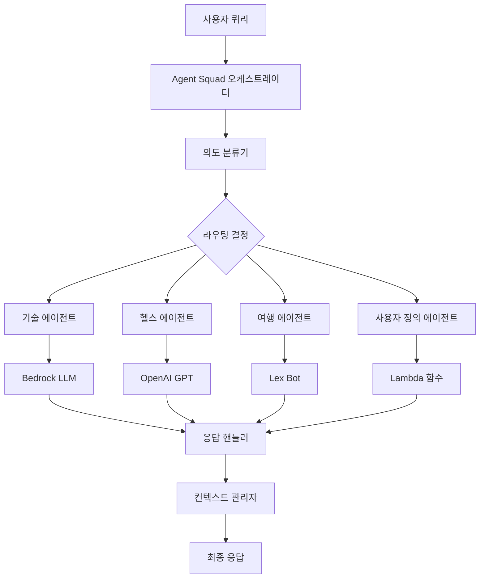

⏱️ **예상 읽기 시간**: 15분

## Agent Squad 소개

AWS Labs의 **Agent Squad**(이전 Multi-Agent Orchestrator)는 복잡한 대화를 처리하기 위해 여러 AI 에이전트를 오케스트레이션하는 유연하고 경량화된 오픈소스 프레임워크입니다. GitHub에서 6.6천 개 이상의 스타를 받으며 성장하는 커뮤니티 지원을 받고 있어, 멀티 에이전트 AI 시스템의 중요한 발전을 나타냅니다.

### Agent Squad의 특별함

Agent Squad는 AI 애플리케이션에서 지능적인 대화 라우팅에 대한 증가하는 요구를 해결합니다. 단일 AI 에이전트가 모든 쿼리를 처리하는 대신, 컨텍스트와 의도를 기반으로 전문화된 에이전트에게 대화를 지능적으로 분배합니다.

## 주요 기능과 특징

### 🧠 지능적 의도 분류
프레임워크는 다음을 기반으로 가장 적합한 에이전트로 쿼리를 동적으로 라우팅합니다:
- **컨텍스트 분석**: 대화 흐름과 히스토리 이해
- **콘텐츠 평가**: 쿼리 의미론과 의도 분석
- **에이전트 전문화**: 쿼리를 에이전트 전문 분야와 매칭

### 🔤 이중 언어 지원
**Python**과 **TypeScript** 모두에서 완전 구현:
- 언어 간 동일한 기능
- 언어별 최적화
- 기존 코드베이스와의 원활한 통합

### 🌊 유연한 응답 처리
스트리밍 및 비스트리밍 응답 모두 지원:
- **실시간 스트리밍**: 대화형 대화용
- **배치 처리**: 분석 작업용
- **혼합 모드 지원**: 서로 다른 에이전트가 다른 응답 유형 사용 가능

### 📚 컨텍스트 관리
정교한 대화 컨텍스트 처리:
- **에이전트 간 메모리**: 에이전트 전환 시 컨텍스트 유지
- **세션 지속성**: 대화 히스토리 기억
- **컨텍스트 상속**: 에이전트 간 관련 정보 전달

## 아키텍처 개요



아키텍처는 다음으로 구성됩니다:
1. **오케스트레이터**: 중앙 라우팅 및 관리
2. **분류기**: 의도 감지 및 에이전트 선택
3. **에이전트**: 전문화된 AI 컴포넌트
4. **컨텍스트 관리자**: 메모리 및 상태 관리
5. **응답 핸들러**: 출력 처리 및 포맷팅

## 설치 및 설정

### Python 설치

Agent Squad는 통합 요구사항에 따른 모듈형 설치 옵션을 제공합니다:

```bash
# 기본 AWS 통합 (가장 일반적)
pip install "agent-squad[aws]"

# OpenAI 통합
pip install "agent-squad[openai]"

# Anthropic 통합
pip install "agent-squad[anthropic]"

# 모든 통합을 포함한 전체 설치
pip install "agent-squad[all]"
```

### 환경 설정

격리를 위한 가상 환경 생성:

```bash
# 가상 환경 생성
python -m venv agent-squad-env
source agent-squad-env/bin/activate  # Windows에서는: agent-squad-env\Scripts\activate

# AWS 지원과 함께 설치
pip install "agent-squad[aws]"
```

### TypeScript/Node.js 설치

```bash
# 새 프로젝트 초기화
npm init -y

# Agent Squad 설치
npm install @awslabs/agent-squad

# AWS SDK 설치 (AWS 통합 사용 시)
npm install @aws-sdk/client-bedrock-runtime
```

## 기본 구현 튜토리얼

### Python 구현

전문화된 에이전트로 기본 멀티 에이전트 시스템을 만들어보겠습니다:

```python
import sys
import asyncio
from agent_squad.orchestrator import AgentSquad
from agent_squad.agents import BedrockLLMAgent, BedrockLLMAgentOptions, AgentStreamResponse

class AgentSquadTutorial:
    def __init__(self):
        # 오케스트레이터 초기화
        self.orchestrator = AgentSquad()
        
        # 에이전트 설정
        self._setup_agents()
    
    def _setup_agents(self):
        """다양한 도메인을 위한 전문화된 에이전트 설정"""
        
        # 기술 전문 에이전트
        tech_agent = BedrockLLMAgent(BedrockLLMAgentOptions(
            name="기술 전문가",
            streaming=True,
            description="""소프트웨어 개발, 클라우드 컴퓨팅, AI/ML, 
                         사이버보안, 블록체인, 신기술 혁신 전문가입니다. 
                         기술 가이드, 아키텍처 조언, 기술 솔루션의 
                         비용 분석을 제공합니다.""",
            model_id="anthropic.claude-3-sonnet-20240229-v1:0",
        ))
        
        # 건강 및 웰빙 에이전트
        health_agent = BedrockLLMAgent(BedrockLLMAgentOptions(
            name="건강 및 웰빙 전문가",
            streaming=True,
            description="""건강, 웰빙, 영양, 피트니스, 정신건강, 
                         의료 정보 전문가입니다. 증거 기반의 
                         건강 가이드와 웰빙 팁을 제공합니다.""",
            model_id="anthropic.claude-3-sonnet-20240229-v1:0",
        ))
        
        # 비즈니스 및 금융 에이전트
        business_agent = BedrockLLMAgent(BedrockLLMAgentOptions(
            name="비즈니스 및 금융 전문가",
            streaming=True,
            description="""비즈니스 전략, 재무 계획, 시장 분석, 
                         창업, 비즈니스 운영 전문가입니다. 
                         전략적 비즈니스 인사이트를 제공합니다.""",
            model_id="anthropic.claude-3-sonnet-20240229-v1:0",
        ))
        
        # 오케스트레이터에 에이전트 추가
        self.orchestrator.add_agent(tech_agent)
        self.orchestrator.add_agent(health_agent)
        self.orchestrator.add_agent(business_agent)
    
    async def process_query(self, user_input, user_id="user123", session_id="session456"):
        """에이전트 스쿼드를 통해 사용자 쿼리 처리"""
        
        try:
            # 적절한 에이전트로 요청 라우팅
            response = await self.orchestrator.route_request(
                user_input=user_input,
                user_id=user_id,
                session_id=session_id,
                additional_params={},
                streaming=True
            )
            
            # 응답 처리
            await self._handle_response(response)
            
        except Exception as e:
            print(f"쿼리 처리 중 오류: {e}")
    
    async def _handle_response(self, response):
        """스트리밍 및 비스트리밍 응답 모두 처리"""
        
        if response.streaming:
            print("\n🤖 **스트리밍 응답**\n")
            
            # 메타데이터 표시
            self._print_metadata(response.metadata)
            
            print("\n📝 **응답:**")
            
            # 콘텐츠 스트리밍
            async for chunk in response.output:
                if isinstance(chunk, AgentStreamResponse):
                    print(chunk.text, end='', flush=True)
                else:
                    print(f"예상치 못한 청크 타입: {type(chunk)}", file=sys.stderr)
            
            print("\n")  # 스트리밍 후 새 줄
            
        else:
            # 비스트리밍 응답 처리
            print("\n🤖 **응답**\n")
            self._print_metadata(response.metadata)
            print(f"\n📝 **응답:** {response.output.content}")
    
    def _print_metadata(self, metadata):
        """형식화된 방식으로 응답 메타데이터 출력"""
        print(f"🎯 **에이전트:** {metadata.agent_name} (ID: {metadata.agent_id})")
        print(f"👤 **사용자:** {metadata.user_id}")
        print(f"🔗 **세션:** {metadata.session_id}")
        print(f"❓ **쿼리:** {metadata.user_input}")
        if metadata.additional_params:
            print(f"⚙️ **매개변수:** {metadata.additional_params}")

# 사용 예제 및 테스트
async def main():
    """Agent Squad 기능을 시연하는 메인 함수"""
    
    # 튜토리얼 시스템 초기화
    agent_system = AgentSquadTutorial()
    
    # 다양한 도메인에 대한 테스트 쿼리
    test_queries = [
        "마이크로서비스 아키텍처 구현의 모범 사례는 무엇인가요?",
        "식단과 운동을 통해 심혈관 건강을 개선하려면 어떻게 해야 하나요?",
        "기술 스타트업을 위한 사업 계획을 세울 때 고려해야 할 사항은 무엇인가요?",
        "Docker 컨테이너와 가상 머신의 차이점을 설명해주세요",
        "바쁜 직장인을 위한 효과적인 스트레스 관리 기법은 무엇인가요?"
    ]
    
    print("🚀 **Agent Squad 튜토리얼 데모**\n")
    print("=" * 50)
    
    for i, query in enumerate(test_queries, 1):
        print(f"\n**테스트 쿼리 {i}:**")
        print("-" * 30)
        await agent_system.process_query(query)
        print("=" * 50)

if __name__ == "__main__":
    asyncio.run(main())
```

### TypeScript 구현

동등한 TypeScript 구현은 다음과 같습니다:

```typescript
import { AgentSquad } from '@awslabs/agent-squad';
import { BedrockLLMAgent, BedrockLLMAgentOptions } from '@awslabs/agent-squad';

class AgentSquadTutorial {
    private orchestrator: AgentSquad;
    
    constructor() {
        this.orchestrator = new AgentSquad();
        this.setupAgents();
    }
    
    private setupAgents(): void {
        // 기술 전문가 에이전트
        const techAgent = new BedrockLLMAgent({
            name: '기술 전문가',
            streaming: true,
            description: `소프트웨어 개발, 클라우드 컴퓨팅, AI/ML, 
                         사이버보안, 블록체인, 신기술 전문가입니다.`,
            modelId: 'anthropic.claude-3-sonnet-20240229-v1:0',
        } as BedrockLLMAgentOptions);
        
        // 건강 및 웰빙 에이전트
        const healthAgent = new BedrockLLMAgent({
            name: '건강 및 웰빙 전문가',
            streaming: true,
            description: `건강, 웰빙, 영양, 피트니스, 정신건강, 
                         의료 정보 전문가입니다.`,
            modelId: 'anthropic.claude-3-sonnet-20240229-v1:0',
        } as BedrockLLMAgentOptions);
        
        // 오케스트레이터에 에이전트 추가
        this.orchestrator.addAgent(techAgent);
        this.orchestrator.addAgent(healthAgent);
    }
    
    async processQuery(
        userInput: string, 
        userId: string = 'user123', 
        sessionId: string = 'session456'
    ): Promise<void> {
        try {
            const response = await this.orchestrator.routeRequest(
                userInput,
                userId,
                sessionId,
                {},
                true
            );
            
            await this.handleResponse(response);
            
        } catch (error) {
            console.error('쿼리 처리 중 오류:', error);
        }
    }
    
    private async handleResponse(response: any): Promise<void> {
        if (response.streaming) {
            console.log('\n🤖 **스트리밍 응답**\n');
            
            // 메타데이터 표시
            this.printMetadata(response.metadata);
            
            console.log('\n📝 **응답:**');
            
            // 스트리밍 응답 처리
            for await (const chunk of response.output) {
                if (chunk.text) {
                    process.stdout.write(chunk.text);
                }
            }
            
            console.log('\n');
            
        } else {
            console.log('\n🤖 **응답**\n');
            this.printMetadata(response.metadata);
            console.log(`\n📝 **응답:** ${response.output.content}`);
        }
    }
    
    private printMetadata(metadata: any): void {
        console.log(`🎯 **에이전트:** ${metadata.agentName} (ID: ${metadata.agentId})`);
        console.log(`👤 **사용자:** ${metadata.userId}`);
        console.log(`🔗 **세션:** ${metadata.sessionId}`);
        console.log(`❓ **쿼리:** ${metadata.userInput}`);
    }
}

// 사용 예제
async function main() {
    const agentSystem = new AgentSquadTutorial();
    
    const testQueries = [
        "클라우드 컴퓨팅의 최신 트렌드는 무엇인가요?",
        "재택근무하면서 정신건강을 어떻게 유지할 수 있나요?"
    ];
    
    console.log('🚀 **Agent Squad 튜토리얼 데모 (TypeScript)**\n');
    
    for (const query of testQueries) {
        await agentSystem.processQuery(query);
        console.log('='.repeat(50));
    }
}

main().catch(console.error);
```

## 고급 설정

### 사용자 정의 에이전트 생성

기본 에이전트 클래스를 확장하여 사용자 정의 에이전트를 생성할 수 있습니다:

```python
from agent_squad.agents import Agent, AgentOptions
from typing import Optional, Dict, Any

class CustomDatabaseAgent(Agent):
    def __init__(self, options: AgentOptions):
        super().__init__(options)
        # 데이터베이스 연결, 도구 등 초기화
        
    async def process_request(
        self, 
        input_text: str, 
        user_id: str, 
        session_id: str, 
        chat_history: list,
        additional_params: Optional[Dict[str, Any]] = None
    ):
        # 사용자 정의 처리 로직
        # 데이터베이스 쿼리, 계산 수행 등
        
        # 구조화된 응답 반환
        return {
            "content": "데이터베이스 쿼리 결과...",
            "metadata": {
                "query_time": "0.5초",
                "records_found": 42
            }
        }
```

### 고급 오케스트레이터 설정

```python
from agent_squad.orchestrator import AgentSquad
from agent_squad.classifiers import BedrockClassifier, BedrockClassifierOptions

# 사용자 정의 분류기를 사용한 오케스트레이터 생성
classifier = BedrockClassifier(BedrockClassifierOptions(
    model_id="anthropic.claude-3-haiku-20240307-v1:0",
    inference_config={
        "maxTokens": 1000,
        "temperature": 0.1
    }
))

orchestrator = AgentSquad(
    classifier=classifier,
    logger=custom_logger,
    config={
        "LOG_AGENT_CHAT": True,
        "LOG_CLASSIFIER_CHAT": True,
        "LOG_CLASSIFIER_RAW_OUTPUT": True,
        "LOG_CLASSIFIER_OUTPUT": True,
        "LOG_EXECUTION_TIMES": True,
        "MAX_RETRIES": 3,
        "USE_DEFAULT_AGENT_IF_NONE_IDENTIFIED": True,
        "MAX_TOKENS": 1000,
        "TEMPERATURE": 0.1
    }
)
```

## 실제 사용 사례 및 예제

### 고객 서비스 자동화

```python
async def setup_customer_service_agents():
    """전문화된 고객 서비스 에이전트 설정"""
    
    orchestrator = AgentSquad()
    
    # 기술 지원 에이전트
    tech_support = BedrockLLMAgent(BedrockLLMAgentOptions(
        name="기술 지원",
        description="기술적 문제, 문제 해결, 제품 지원을 처리합니다",
        model_id="anthropic.claude-3-sonnet-20240229-v1:0",
    ))
    
    # 청구 및 계정 에이전트
    billing_agent = BedrockLLMAgent(BedrockLLMAgentOptions(
        name="청구 지원",
        description="청구 문의, 계정 관리, 결제 문제를 처리합니다",
        model_id="anthropic.claude-3-sonnet-20240229-v1:0",
    ))
    
    # 일반 정보 에이전트
    info_agent = BedrockLLMAgent(BedrockLLMAgentOptions(
        name="정보 에이전트",
        description="일반적인 회사 정보, 정책, 기본 문의를 제공합니다",
        model_id="anthropic.claude-3-sonnet-20240229-v1:0",
    ))
    
    orchestrator.add_agent(tech_support)
    orchestrator.add_agent(billing_agent)
    orchestrator.add_agent(info_agent)
    
    return orchestrator
```

### 교육 플랫폼

```python
async def setup_educational_agents():
    """다양한 학문 분야를 위한 에이전트 설정"""
    
    orchestrator = AgentSquad()
    
    subjects = [
        ("수학", "수학, 미적분, 통계, 문제 해결 전문가"),
        ("과학", "물리학, 화학, 생물학, 과학적 개념 전문가"),
        ("문학", "문학 분석, 글쓰기, 언어 예술 전문가"),
        ("역사", "세계사, 역사 분석, 사회 연구 전문가")
    ]
    
    for name, description in subjects:
        agent = BedrockLLMAgent(BedrockLLMAgentOptions(
            name=f"{name} 튜터",
            description=description,
            model_id="anthropic.claude-3-sonnet-20240229-v1:0",
            streaming=True
        ))
        orchestrator.add_agent(agent)
    
    return orchestrator
```

## 성능 최적화

### 연결 풀링 및 캐싱

```python
from agent_squad.orchestrator import AgentSquad
import asyncio
from functools import lru_cache

class OptimizedAgentSquad:
    def __init__(self):
        self.orchestrator = AgentSquad()
        self._connection_pool = self._setup_connection_pool()
        self._setup_caching()
    
    def _setup_connection_pool(self):
        """더 나은 성능을 위한 연결 풀 설정"""
        # 다양한 서비스를 위한 연결 풀 설정
        return {
            'bedrock': self._create_bedrock_pool(),
            'openai': self._create_openai_pool(),
        }
    
    @lru_cache(maxsize=1000)
    def _cached_classification(self, query_hash: str):
        """유사한 쿼리에 대한 분류 결과 캐싱"""
        # 분류 결과 캐싱 구현
        pass
    
    async def batch_process_queries(self, queries: list):
        """여러 쿼리를 동시에 처리"""
        tasks = [
            self.orchestrator.route_request(query, f"user_{i}", f"session_{i}")
            for i, query in enumerate(queries)
        ]
        
        results = await asyncio.gather(*tasks, return_exceptions=True)
        return results
```

### 모니터링 및 로깅

```python
import logging
import time
from functools import wraps

class AgentSquadMonitor:
    def __init__(self, orchestrator):
        self.orchestrator = orchestrator
        self.logger = logging.getLogger('agent_squad_monitor')
        self._setup_monitoring()
    
    def _setup_monitoring(self):
        """포괄적인 모니터링 설정"""
        self.metrics = {
            'total_requests': 0,
            'successful_requests': 0,
            'failed_requests': 0,
            'average_response_time': 0,
            'agent_usage': {}
        }
    
    def monitor_request(self, func):
        """요청 성능을 모니터링하는 데코레이터"""
        @wraps(func)
        async def wrapper(*args, **kwargs):
            start_time = time.time()
            self.metrics['total_requests'] += 1
            
            try:
                result = await func(*args, **kwargs)
                self.metrics['successful_requests'] += 1
                
                # 에이전트 사용량 추적
                agent_name = result.metadata.agent_name
                self.metrics['agent_usage'][agent_name] = \
                    self.metrics['agent_usage'].get(agent_name, 0) + 1
                
                return result
                
            except Exception as e:
                self.metrics['failed_requests'] += 1
                self.logger.error(f"요청 실패: {e}")
                raise
                
            finally:
                # 평균 응답 시간 업데이트
                response_time = time.time() - start_time
                self._update_average_response_time(response_time)
        
        return wrapper
    
    def _update_average_response_time(self, response_time):
        """응답 시간의 실행 평균 업데이트"""
        current_avg = self.metrics['average_response_time']
        total_requests = self.metrics['total_requests']
        
        self.metrics['average_response_time'] = \
            (current_avg * (total_requests - 1) + response_time) / total_requests
    
    def get_performance_report(self):
        """성능 보고서 생성"""
        return {
            'summary': self.metrics,
            'success_rate': self.metrics['successful_requests'] / self.metrics['total_requests'] * 100,
            'most_used_agent': max(self.metrics['agent_usage'], 
                                 key=self.metrics['agent_usage'].get) if self.metrics['agent_usage'] else None
        }
```

## 배포 전략

### AWS Lambda 배포

```python
import json
import asyncio
from agent_squad.orchestrator import AgentSquad
from agent_squad.agents import BedrockLLMAgent, BedrockLLMAgentOptions

# Lambda 컨테이너 재사용을 위한 글로벌 오케스트레이터 인스턴스
orchestrator = None

def lambda_handler(event, context):
    """Agent Squad를 위한 AWS Lambda 핸들러"""
    
    global orchestrator
    
    # 콜드 스타트 시 오케스트레이터 초기화
    if orchestrator is None:
        orchestrator = setup_orchestrator()
    
    # 요청 데이터 추출
    body = json.loads(event['body'])
    user_input = body['message']
    user_id = body.get('user_id', 'anonymous')
    session_id = body.get('session_id', 'default')
    
    # 요청 처리
    loop = asyncio.new_event_loop()
    asyncio.set_event_loop(loop)
    
    try:
        response = loop.run_until_complete(
            orchestrator.route_request(user_input, user_id, session_id)
        )
        
        return {
            'statusCode': 200,
            'headers': {
                'Content-Type': 'application/json',
                'Access-Control-Allow-Origin': '*'
            },
            'body': json.dumps({
                'response': response.output.content,
                'agent': response.metadata.agent_name,
                'success': True
            })
        }
        
    except Exception as e:
        return {
            'statusCode': 500,
            'body': json.dumps({
                'error': str(e),
                'success': False
            })
        }
    
    finally:
        loop.close()

def setup_orchestrator():
    """프로덕션 설정으로 오케스트레이터 설정"""
    squad = AgentSquad()
    
    # 프로덕션 에이전트 추가
    tech_agent = BedrockLLMAgent(BedrockLLMAgentOptions(
        name="프로덕션 기술 에이전트",
        description="프로덕션 준비된 기술 지원 에이전트",
        model_id="anthropic.claude-3-sonnet-20240229-v1:0",
    ))
    
    squad.add_agent(tech_agent)
    return squad
```

### Docker 배포

```dockerfile
# Agent Squad 애플리케이션을 위한 Dockerfile
FROM python:3.11-slim

WORKDIR /app

# 시스템 의존성 설치
RUN apt-get update && apt-get install -y \
    gcc \
    && rm -rf /var/lib/apt/lists/*

# requirements를 복사하고 Python 의존성 설치
COPY requirements.txt .
RUN pip install --no-cache-dir -r requirements.txt

# 애플리케이션 코드 복사
COPY . .

# 포트 노출
EXPOSE 8000

# 환경 변수 설정
ENV PYTHONPATH=/app
ENV AWS_DEFAULT_REGION=us-east-1

# 애플리케이션 실행
CMD ["uvicorn", "main:app", "--host", "0.0.0.0", "--port", "8000"]
```

## 모범 사례 및 팁

### 1. 에이전트 설계 원칙

- **단일 책임**: 각 에이전트는 명확하게 정의된 도메인을 가져야 함
- **명확한 설명**: 더 나은 라우팅을 위해 상세한 에이전트 설명 작성
- **성능 최적화**: 다양한 작업에 적절한 모델 크기 사용
- **오류 처리**: 견고한 오류 처리 및 폴백 메커니즘 구현

### 2. 컨텍스트 관리

```python
# 효과적인 컨텍스트 관리
async def manage_conversation_context(orchestrator, user_id, session_id):
    """컨텍스트 관리 모범 사례"""
    
    # 중요한 컨텍스트 정보 저장
    context = {
        'user_preferences': get_user_preferences(user_id),
        'conversation_history': get_conversation_history(session_id),
        'current_task': 'information_gathering'
    }
    
    # additional_params를 통해 컨텍스트 전달
    response = await orchestrator.route_request(
        user_input="이전 대화를 계속해주세요",
        user_id=user_id,
        session_id=session_id,
        additional_params=context
    )
    
    return response
```

### 3. 보안 고려사항

```python
# 입력 검증 및 살균화
def validate_input(user_input: str) -> bool:
    """보안을 위한 사용자 입력 검증"""
    
    # 악성 콘텐츠 확인
    forbidden_patterns = [
        r'<script.*?</script>',
        r'javascript:',
        r'on\w+\s*='
    ]
    
    import re
    for pattern in forbidden_patterns:
        if re.search(pattern, user_input, re.IGNORECASE):
            return False
    
    # 입력 길이 확인
    if len(user_input) > 10000:
        return False
    
    return True

# 속도 제한 구현
from collections import defaultdict
import time

class RateLimiter:
    def __init__(self, max_requests=100, time_window=3600):
        self.max_requests = max_requests
        self.time_window = time_window
        self.requests = defaultdict(list)
    
    def is_allowed(self, user_id: str) -> bool:
        now = time.time()
        user_requests = self.requests[user_id]
        
        # 오래된 요청 제거
        self.requests[user_id] = [
            req_time for req_time in user_requests 
            if now - req_time < self.time_window
        ]
        
        # 제한 미만인지 확인
        if len(self.requests[user_id]) < self.max_requests:
            self.requests[user_id].append(now)
            return True
        
        return False
```

## 문제 해결 가이드

### 일반적인 문제 및 해결책

1. **에이전트 선택 문제**
   ```python
   # 에이전트 선택 디버그
   orchestrator.config['LOG_CLASSIFIER_OUTPUT'] = True
   orchestrator.config['LOG_CLASSIFIER_RAW_OUTPUT'] = True
   ```

2. **큰 컨텍스트로 인한 메모리 문제**
   ```python
   # 컨텍스트 절단 구현
   def truncate_context(context, max_length=8000):
       if len(context) > max_length:
           return context[-max_length:]
       return context
   ```

3. **성능 병목 현상**
   ```python
   # 비동기 처리 구현
   import asyncio
   
   async def process_multiple_requests(requests):
       tasks = [process_single_request(req) for req in requests]
       return await asyncio.gather(*tasks)
   ```

## 구현 테스트

포괄적인 테스트 스위트 생성:

```python
import pytest
import asyncio
from agent_squad.orchestrator import AgentSquad

class TestAgentSquad:
    @pytest.fixture
    async def orchestrator(self):
        """테스트 오케스트레이터 설정"""
        squad = AgentSquad()
        # 테스트 에이전트 추가
        return squad
    
    @pytest.mark.asyncio
    async def test_tech_query_routing(self, orchestrator):
        """기술 쿼리가 기술 에이전트로 라우팅되는지 테스트"""
        response = await orchestrator.route_request(
            "Docker 컨테이너를 어떻게 배포하나요?",
            "test_user",
            "test_session"
        )
        
        assert "tech" in response.metadata.agent_name.lower()
    
    @pytest.mark.asyncio
    async def test_streaming_response(self, orchestrator):
        """스트리밍 기능 테스트"""
        response = await orchestrator.route_request(
            "머신러닝 설명해주세요",
            "test_user",
            "test_session",
            streaming=True
        )
        
        assert response.streaming is True
        
        # 스트리밍된 콘텐츠 수집
        content = ""
        async for chunk in response.output:
            content += chunk.text
        
        assert len(content) > 0
```

## 결론

Agent Squad는 멀티 에이전트 AI 시스템의 강력한 진화를 나타내며, 다음을 제공합니다:

- 더 나은 사용자 경험을 위한 **지능적 라우팅**
- 다양한 AI 공급자를 지원하는 **유연한 아키텍처**
- 엔터프라이즈 배포를 위한 **프로덕션 준비 기능**
- **강력한 커뮤니티 지원**과 활발한 개발

프레임워크의 이중 언어 지원(Python/TypeScript)과 모듈형 설계는 프로토타이핑과 프로덕션 배포 모두에 탁월한 선택이 됩니다. 고객 서비스 시스템, 교육 플랫폼, 또는 복잡한 대화형 AI 애플리케이션을 구축하든, Agent Squad는 정교한 멀티 에이전트 오케스트레이션을 위한 기반을 제공합니다.

### 다음 단계

1. 기본 구현을 **실험**해보세요
2. 특정 사용 사례에 맞게 **에이전트를 사용자 정의**하세요
3. **모니터링**과 성능 최적화를 구현하세요
4. 선호하는 클라우드 플랫폼에 **배포**하세요
5. 오픈소스 커뮤니티에 **기여**하세요

고급 기능과 엔터프라이즈 지원을 위해서는 [공식 문서](https://awslabs.github.io/agent-squad/)를 탐색하고 성장하는 Agent Squad 개발자 커뮤니티에 참여하세요.

---

*이 튜토리얼은 AWS Agent Squad 작업을 위한 포괄적인 기반을 제공합니다. 프레임워크가 계속 발전함에 따라 공식 저장소와 문서를 통해 최신 기능과 모범 사례를 계속 업데이트하세요.*
