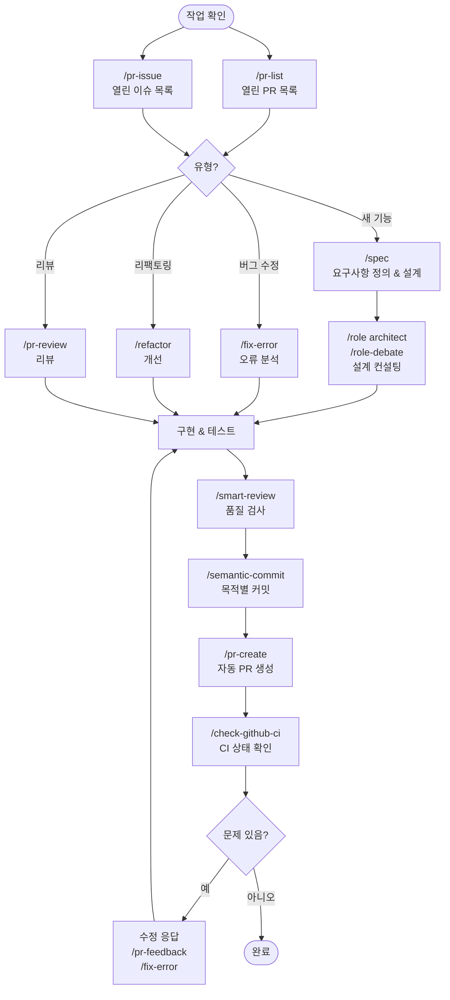

⏱️ **예상 읽기 시간**: 18분

## 서론

[Claude Code Cookbook](https://github.com/foreveryh/claude-code-cookbook)은 AI 기반 기능으로 개발 워크플로우를 혁신하도록 설계된 60개 이상의 명령어, 전문 역할, 자동화 훅의 획기적인 컬렉션입니다. 이 포괄적인 도구 키트는 개발자가 코드와 상호작용하고, 프로젝트를 관리하며, 지능적인 자동화를 통해 협업하는 방식을 완전히 변화시킵니다.

AI가 소프트웨어 개발을 재편하고 있는 시대에, Claude Code Cookbook은 고급 AI 기능과 일상적인 개발 작업 사이의 격차를 해소하는 실용적이고 검증된 솔루션으로 돋보입니다. 복잡한 리팩토링 처리, GitHub 워크플로우 관리, 철저한 코드 리뷰 수행 등 어떤 작업이든, 이 도구 키트는 개발 과정에서 AI를 활용하기 위한 구조화되고 신뢰할 수 있는 패턴을 제공합니다.

## Claude Code Cookbook이란?

### 개요

Claude Code Cookbook은 소프트웨어 개발을 위한 Claude Code의 기능을 향상시키도록 설계된 명령어, 역할, 자동화 스크립트의 큐레이션된 컬렉션입니다. 원래 wasabeef의 저장소에서 포크되어 커뮤니티에 의해 개선된 이 도구는 AI를 개발 워크플로우에 통합하는 체계적인 접근 방식을 제공합니다.

### 주요 구성 요소

이 도구 키트는 세 가지 주요 구성 요소로 이루어져 있습니다:

1. **명령어**: 특정 개발 작업을 위한 60개 이상의 전문 명령어
2. **역할**: 전문적인 관점과 분석을 제공하는 전문가 페르소나
3. **훅**: 개발 워크플로우에 원활하게 통합되는 자동화 스크립트

### 핵심 철학

이 쿡북은 "구조화된 AI 지원"의 원칙을 따릅니다. 일반적인 프롬프트 대신, 일반적인 개발 시나리오에 대해 일관되고 고품질의 결과를 생성하는 특정하고 상황에 맞는 명령어를 제공합니다.

## 명령어 카테고리 및 사용법

### 1. GitHub 워크플로우 명령어

이 쿡북은 일반적인 Git 작업을 간소화하는 명령어로 GitHub 워크플로우 자동화에 탁월합니다:

#### Pull Request 관리
```bash
# 열린 PR 목록 및 우선순위 지정
/pr-list

# 자동 분석으로 PR 생성
/pr-create

# 포괄적인 PR 리뷰
/pr-review

# PR 내용 자동 업데이트
/pr-auto-update

# 품질 검증으로 PR 자동 병합
/pr-merge
```

#### 이슈 관리
```bash
# 우선순위가 지정된 이슈 표시
/pr-issue

# 상세한 버그 리포트 생성
/bug-report

# 포괄적인 기능 명세서 작성
/feature-request
```

#### 고급 Git 작업
```bash
# 의미 있는 단위로 시맨틱 커밋
/semantic-commit

# CI/CD 상태 확인
/check-github-ci

# 병합 충돌 지능적 처리
/merge-conflict
```

### 2. 코드 품질 및 분석 명령어

이 명령어들은 코드 품질 유지 및 개선에 중점을 둡니다:

#### 코드 리뷰 및 분석
```bash
# 고급 코드 품질 리뷰
/smart-review

# 안전한 단계별 리팩토링
/refactor

# 기술 부채 분석
/tech-debt

# 포괄적인 오류 분석
/fix-error
```

#### 아키텍처 및 설계
```bash
# 상세한 명세서 작성
/spec

# 포괄적인 문서 생성
/generate-docs

# 성능 최적화 분석
/optimize
```

### 3. 개발 워크플로우 명령어

일상적인 개발 활동을 향상시키는 명령어들:

#### 프로젝트 관리
```bash
# 구현 계획 작성
/plan

# 실행 진행상황 추적
/show-plan

# 다국어 문서 업데이트
/update-doc-string
```

#### 의존성 관리
```bash
# 안전한 Flutter 의존성 업데이트
/update-flutter-deps

# Node.js 의존성 관리
/update-node-deps

# Rust 의존성 업데이트
/update-rust-deps
```

## 역할 기반 전문가 분석

### 사용 가능한 역할

이 쿡북에는 전문가 관점을 제공하는 특화된 역할들이 포함되어 있습니다:

| 역할 | 전문 분야 | 사용 사례 |
|------|-----------|-----------|
| `/role analyzer` | 시스템 분석 전문가 | 아키텍처 리뷰, 시스템 설계 |
| `/role architect` | 소프트웨어 아키텍처 | 디자인 패턴, 확장성 |
| `/role frontend` | UI/UX 및 성능 | 프론트엔드 최적화, 사용자 경험 |
| `/role mobile` | iOS/Android 개발 | 모바일 모범 사례, 플랫폼별 조언 |
| `/role performance` | 성능 최적화 | 속도 및 메모리 개선 |
| `/role qa` | 품질 보증 | 테스트 계획, 품질 지표 |
| `/role reviewer` | 코드 리뷰 전문가 | 코드 품질, 유지보수성 |
| `/role security` | 보안 전문가 | 취약점 평가, 보안 모범 사례 |

### 서브 에이전트 실행

역할들은 병렬 분석을 위해 독립적인 서브 에이전트로 실행될 수 있습니다:

```bash
# 일반 모드 (메인 컨텍스트에서 실행)
/role security
"이 프로젝트의 보안 검사"

# 서브 에이전트 모드 (독립적인 컨텍스트에서 실행)
/role security --agent
"프로젝트의 포괄적인 보안 감사 수행"

# 여러 역할과의 병렬 분석
/multi-role security,performance --agent
"시스템의 보안과 성능을 포괄적으로 분석"
```

### 역할 토론 기능

`/role-debate` 명령어는 여러 전문가 관점의 협업을 가능하게 합니다:

```bash
/role-debate
"이 프로젝트에 마이크로서비스 아키텍처와 모놀리식 아키텍처 중 어느 것을 사용해야 할까요?"
```

이 명령어는 서로 다른 역할 간의 토론을 조율하여 여러 전문가 관점에서 균형 잡힌 분석을 제공합니다.

## 자동화 훅

### 개발 자동화

이 쿡북에는 일반적인 개발 작업을 자동화하는 정교한 훅들이 포함되어 있습니다:

#### 파일 관리 훅
- **preserve-file-permissions.sh**: 편집 중 파일 권한 유지
- **ja-space-format.sh**: 일본어 텍스트 간격 자동 포맷
- **auto-comment.sh**: 새 파일 생성 시 문서화 촉구

#### 안전성 및 품질 훅
- **deny-check.sh**: 위험한 명령어 실행 방지
- **check-ai-commit.sh**: 커밋 메시지 품질 검증
- **check-continue.sh**: 지속 가능한 작업 식별

#### 알림 훅
- **notify-waiting**: 사용자 확인을 위한 macOS 알림
- **osascript**: 완료 알림

### 훅 구성

훅은 `settings.json`에서 구성되며 특정 지점에서 자동으로 실행됩니다:

- **PreToolUse**: 도구 작업 전 실행
- **PostToolUse**: 도구 작업 후 실행
- **Notification**: 사용자 알림 처리
- **Stop**: 작업 완료 시 실행

## 고급 기능

### 다국어 지원

이 쿡북은 여러 언어로 포괄적인 문서화를 지원합니다:

```bash
# 여러 언어로 문서 문자열 업데이트
/update-doc-string

# Dart 특화 문서 관리
/update-dart-doc
```

### 검색 및 분석

포괄적인 코드 분석을 위한 고급 검색 기능:

```bash
# 웹 검색 통합
/search-gemini

# 복잡한 문제를 위한 순차적 사고
/sequential-thinking

# 초구조화된 사고 과정
/ultrathink
```

### AI 글쓰기 향상

AI 생성 콘텐츠 개선을 위한 도구:

```bash
# AI 생성 텍스트 패턴 감지 및 수정
/style-ai-writing

# 전문 에이전트에게 작업 위임
/task
```

## 개발 워크플로우 통합

### 일반적인 개발 흐름

이 쿡북은 간소화된 개발 워크플로우를 가능하게 합니다:



### 모범 사례

1. **계획으로 시작**: 기능 계획에는 `/spec`, 추적에는 `/show-plan` 사용
2. **역할 활용**: 도메인별 분석에 전문 역할 사용
3. **리뷰 자동화**: 워크플로우에 `/smart-review`와 `/pr-review` 통합
4. **품질 유지**: 일관된 코드 품질과 안전성을 위해 훅 사용
5. **병렬 분석**: 포괄적인 다관점 분석을 위해 서브 에이전트 활용

## 설치 및 설정

### 전제 조건

- Claude Code (최신 버전)
- 적절한 권한으로 구성된 Git
- Node.js (특정 의존성 관리 명령어용)

### 설치 단계

1. **저장소 클론**:
```bash
git clone https://github.com/foreveryh/claude-code-cookbook.git
cd claude-code-cookbook
```

2. **Claude Code 구성**:
Claude Code 구성에 쿡북 명령어 추가:
```json
{
  "commands_directory": "./commands",
  "roles_directory": "./agents/roles",
  "hooks_directory": "./.claude/hooks"
}
```

3. **훅 설정**:
`settings.json`에서 자동 훅 구성:
```json
{
  "hooks": {
    "PreToolUse": ["deny-check.sh", "preserve-file-permissions.sh"],
    "PostToolUse": ["auto-comment.sh", "ja-space-format.sh"],
    "Notification": ["notify-waiting"],
    "Stop": ["check-continue.sh"]
  }
}
```

### 검증

다음을 실행하여 설치를 테스트하십시오:
```bash
/role-help  # 사용 가능한 역할 목록 표시
/pr-list    # 현재 PR 표시 (git 저장소에 있는 경우)
```

## 사용 사례 및 예제

### 1. 포괄적인 코드 리뷰

시나리오: 여러 구성 요소가 있는 복잡한 풀 리퀘스트 리뷰.

```bash
# 1단계: PR 개요 가져오기
/pr-list

# 2단계: 다중 역할 분석
/multi-role security,performance,reviewer --agent
"보안 취약점, 성능 문제, 코드 품질에 대해 PR #123 분석"

# 3단계: 상세 리뷰
/pr-review

# 4단계: 구조화된 피드백 제공
/pr-feedback
```

### 2. 기능 개발 워크플로우

시나리오: OAuth 통합을 포함한 새로운 사용자 인증 시스템 개발.

```bash
# 1단계: 명세서 작성
/spec
"OAuth 통합을 포함한 사용자 인증 시스템"

# 2단계: 아키텍처 컨설팅
/role-debate
"우리 사용 사례에 OAuth vs JWT vs 세션 기반 인증"

# 3단계: 구현 계획
/plan

# 4단계: 진행상황 추적
/show-plan

# 5단계: 품질 보증
/role qa --agent
"인증 시스템을 위한 포괄적인 테스트 전략 작성"
```

### 3. 기술 부채 관리

시나리오: 레거시 코드베이스에서 축적된 기술 부채 해결.

```bash
# 1단계: 기술 부채 분석
/tech-debt

# 2단계: 개선사항 우선순위 지정
/role architect --agent
"우선순위가 지정된 기술 부채 감소 계획 작성"

# 3단계: 안전한 리팩토링
/refactor

# 4단계: 변경사항 검증
/smart-review
```

## 고급 구성

### 사용자 정의 명령어

템플릿 구조를 따라 사용자 정의 명령어로 쿡북을 확장할 수 있습니다:

```markdown
# 사용자 정의 명령어 템플릿
## 목적
명령어가 수행하는 작업에 대한 간단한 설명

## 사용법
/custom-command [매개변수]

## 구현
상세한 구현 로직
```

### 환경별 훅

서로 다른 개발 환경에 대한 훅 구성:

```bash
# 개발 환경
export CLAUDE_ENV="development"

# 프로덕션 안전 훅
export CLAUDE_ENV="production"
```

### 다중 프로젝트 구성

여러 프로젝트에서 작업하는 팀을 위한 구성:

```json
{
  "projects": {
    "project1": {
      "commands": ["./project1-commands"],
      "roles": ["./project1-roles"]
    },
    "project2": {
      "commands": ["./project2-commands"],
      "roles": ["./project2-roles"]
    }
  }
}
```

## 성능 및 최적화

### 명령어 실행 최적화

1. **병렬 실행**: 독립적인 분석에 서브 에이전트 사용
2. **컨텍스트 관리**: 명령어에 적절한 컨텍스트 범위 유지
3. **캐싱**: 반복 작업에 Claude Code의 내장 캐싱 활용

### 메모리 및 리소스 관리

- **토큰 최적화**: 명령어가 토큰을 효율적으로 사용하도록 설계
- **컨텍스트 보존**: 훅이 작업 간 컨텍스트 유지
- **리소스 정리**: 임시 리소스의 자동 정리

## 문제 해결

### 일반적인 문제

1. **명령어를 찾을 수 없음**: 적절한 설치 및 구성 확인
2. **권한 오류**: 파일 권한 및 Git 구성 확인
3. **훅 실패**: 훅 스크립트에 실행 권한이 있는지 확인

### 디버그 모드

상세한 실행 정보를 위해 디버그 모드 활성화:
```bash
export CLAUDE_DEBUG=true
```

### 커뮤니티 지원

- **GitHub 이슈**: 버그 및 기능 요청 신고
- **문서**: 저장소에서 포괄적인 문서 제공
- **커뮤니티**: 지원 및 기여를 위한 활발한 커뮤니티

## 보안 고려사항

### 안전한 명령어 실행

이 쿡북에는 여러 보안 기능이 포함되어 있습니다:

- **명령어 검증**: `deny-check.sh`가 위험한 작업 방지
- **권한 보존**: 원본 파일 권한 유지
- **감사 추적**: 모든 작업의 포괄적인 로깅

### 모범 사례

1. **명령어 검토**: 실행 전 생성된 명령어 항상 검토
2. **훅 사용**: 환경에 안전 훅 구현
3. **접근 제어**: 팀 사용을 위한 적절한 접근 제어 구성
4. **정기 업데이트**: 보안 패치를 위해 쿡북을 최신 상태로 유지

## 향후 발전

### 로드맵

Claude Code Cookbook은 다음과 함께 계속 발전하고 있습니다:

- **새로운 명령어**: 커뮤니티 요청 명령어의 정기적 추가
- **향상된 역할**: 더 전문화된 전문가 역할
- **통합 개선**: 더 나은 IDE 및 플랫폼 통합
- **성능 최적화**: 속도와 효율성을 위한 지속적인 최적화

### 커뮤니티 기여

이 프로젝트는 기여를 환영합니다:

- **명령어 개발**: 특정 사용 사례를 위한 새로운 명령어 생성
- **역할 향상**: 전문화된 전문가 역할 개발
- **문서**: 문서 개선 및 번역
- **버그 수정**: 문제 해결 및 안정성 개선

## 결론

Claude Code Cookbook은 AI 기반 개발 도구에서 중요한 발전을 나타냅니다. 일반적인 개발 작업에 대한 구조화되고 신뢰할 수 있는 패턴을 제공함으로써, 개발자가 코드 품질과 개발 모범 사례를 유지하면서 AI의 모든 힘을 활용할 수 있게 합니다.

생산성을 향상시키려는 개별 개발자든, AI 지원 개발 관행을 표준화하려는 팀이든, 이 쿡북은 성공에 필요한 도구와 패턴을 제공합니다. 포괄적인 명령어 세트, 전문가 역할, 자동화 훅은 AI가 인간의 전문성을 대체하는 것이 아니라 보강하는 개발 환경을 만듭니다.

소프트웨어 개발의 미래는 인간의 창의성과 AI 기능 간의 지능적인 협업에 있습니다. Claude Code Cookbook은 이러한 협업을 위한 프레임워크를 제공하여 AI 지원이 강력할 뿐만 아니라 신뢰할 수 있고, 안전하며, 소프트웨어 엔지니어링 모범 사례와 일치하도록 보장합니다.

오늘 쿡북 탐색을 시작하여 구조화된 AI 지원의 힘으로 개발 워크플로우를 변화시키십시오. 이러한 패턴을 학습하는 데 투자한 시간은 생산성 향상, 코드 품질 개선, 개발 팀 전반의 협업 강화로 보상받을 것입니다.

---

*개발 워크플로우를 혁신할 준비가 되셨나요? [Claude Code Cookbook](https://github.com/foreveryh/claude-code-cookbook)을 클론하고 오늘부터 AI 기반 개발의 미래를 경험해보세요.*
