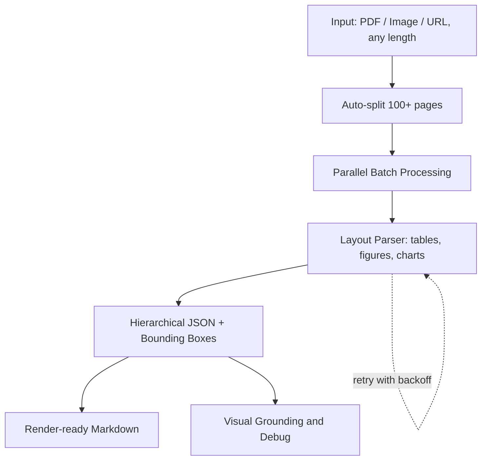

⏱️ **예상 읽기 시간**: 12분

## 소개

오늘날 데이터 중심 세상에서 PDF, 이미지, 차트와 같은 복잡한 문서에서 구조화된 정보를 추출하는 것은 기업과 개발자들에게 중요한 과제입니다. 기존의 OCR 솔루션들은 시각적으로 복잡한 레이아웃, 표, 혼합 콘텐츠 유형을 처리하는 데 어려움을 겪는 경우가 많습니다. 바로 이런 문제를 해결하기 위해 **LandingAI의 Agentic Document Extraction** 라이브러리가 등장했습니다.

Agentic Document Extraction API는 고급 AI를 활용하여 시각적으로 복잡한 문서에서 구조화된 데이터를 추출하고 정확한 요소 위치와 함께 계층적 JSON을 반환하는 강력한 Python 라이브러리입니다. 금융 보고서, 연구 논문, 다중 페이지 기술 문서 등을 다루든 상관없이, 이 라이브러리는 엔터프라이즈급 문서 처리 기능을 제공합니다.

## Agentic Document Extraction이란?

LandingAI의 Agentic Document Extraction은 다음과 같은 기능에 뛰어난 AI 기반 문서 처리 라이브러리입니다:

- **복잡한 레이아웃 이해**: 표, 그림, 차트, 혼합 콘텐츠 레이아웃 처리
- **긴 문서 지원**: 단일 호출로 100페이지 이상의 PDF 처리
- **구조화된 출력**: 정확한 요소 위치와 함께 계층적 JSON 반환
- **시각적 그라운딩**: 추출된 콘텐츠에 대한 바운딩 박스 정보 제공
- **배치 처리**: 병렬 처리로 여러 문서 동시 처리

**그림 1. Agentic Document Extraction 처리 파이프라인.**



### 주요 기능

- 📦 **간단한 설치**: 추가 종속성 없이 pip 한 줄로 설치
- 🗂️ **범용 파일 지원**: 모든 길이의 PDF, 이미지, URL
- 📚 **엔터프라이즈 규모**: 1000페이지 이상 문서의 자동 분할 및 병렬 처리
- 🧩 **구조화된 출력**: 계층적 JSON과 렌더링 준비된 마크다운
- 👁️ **시각적 디버깅**: 바운딩 박스 스니펫과 전체 페이지 시각화
- 🏃 **병렬 처리**: 스레드 관리가 포함된 구성 가능한 배치 처리
- 🔄 **복원력**: API 오류에 대한 지수 백오프 자동 재시도
- ⚙️ **유연한 구성**: 프로덕션 배포를 위한 환경 기반 설정

## 전제 조건 및 설정

### 시스템 요구사항

- Python 3.9, 3.10, 3.11, 또는 3.12
- LandingAI API 키 ([LandingAI](https://landing.ai/)에서 획득)
- API 호출을 위한 인터넷 연결

### 설치

pip를 사용한 설치 과정은 간단합니다:

```bash
# agentic-doc 라이브러리 설치
pip install agentic-doc

# 설치 확인
python -c "import agentic_doc; print('설치 성공!')"
```

### API 키 구성

LandingAI API 키를 획득한 후, 환경 변수로 구성합니다:

```bash
# 환경 변수로 API 키 설정
export VISION_AGENT_API_KEY=your-api-key-here

# 또는 프로젝트 디렉토리에 .env 파일 생성
echo "VISION_AGENT_API_KEY=your-api-key-here" > .env
```

프로덕션 환경에서는 일반 텍스트 환경 변수보다는 보안 비밀 관리 시스템 사용을 고려하세요.

## 기본 사용 예제

### 간단한 문서 파싱

가장 기본적인 사용법인 단일 문서 파싱부터 시작해보겠습니다:

```python
from agentic_doc.parse import parse

# 로컬 PDF 파일 파싱
results = parse("path/to/your/document.pdf")

# URL에서 파싱
results = parse("https://example.com/document.pdf")

# 이미지 파싱
results = parse("path/to/your/image.jpg")

# 파싱된 콘텐츠 접근
parsed_doc = results[0]
print(f"문서 제목: {parsed_doc.title}")
print(f"청크 수: {len(parsed_doc.chunks)}")
print(f"마크다운 콘텐츠: {parsed_doc.markdown}")
```

### 결과 구조 이해하기

라이브러리는 다음과 같은 주요 구성 요소를 가진 구조화된 결과를 반환합니다:

```python
from agentic_doc.parse import parse

results = parse("document.pdf")
parsed_doc = results[0]

# 문서 메타데이터
print(f"제목: {parsed_doc.title}")
print(f"페이지 수: {parsed_doc.page_count}")
print(f"처리 시간: {parsed_doc.processing_time}")

# 콘텐츠 청크 반복
for i, chunk in enumerate(parsed_doc.chunks):
    print(f"청크 {i}:")
    print(f"  유형: {chunk.chunk_type}")
    print(f"  콘텐츠: {chunk.content[:100]}...")  # 첫 100자
    print(f"  페이지: {chunk.page}")
    print(f"  바운딩 박스: {chunk.grounding[0].bbox if chunk.grounding else 'N/A'}")
    print("---")

# 전체 마크다운 표현 가져오기
markdown_content = parsed_doc.markdown
print("마크다운으로 된 전체 문서:")
print(markdown_content)
```

## 고급 기능

### 대용량 PDF 파일 처리

라이브러리의 뛰어난 기능 중 하나는 대용량 문서를 자동으로 처리하는 능력입니다:

```python
from agentic_doc.parse import parse

# 라이브러리가 대용량 PDF를 자동으로 처리합니다
# 관리 가능한 청크로 분할하고 병렬로 처리합니다
results = parse("very-large-document.pdf")

parsed_doc = results[0]
print(f"{parsed_doc.page_count}페이지를 성공적으로 처리했습니다")

# 처리 오류 확인
if parsed_doc.errors:
    print("처리 오류가 발생했습니다:")
    for error in parsed_doc.errors:
        print(f"  페이지 {error.page}: {error.message}")
```

### 여러 문서 배치 처리

구성 가능한 병렬성으로 여러 문서를 동시에 처리합니다:

```python
from agentic_doc.parse import parse

# 여러 문서를 배치로 처리
document_paths = [
    "document1.pdf",
    "document2.pdf", 
    "https://example.com/document3.pdf",
    "image.jpg"
]

# 기본 설정으로 배치 처리
results = parse(document_paths)

# 결과 처리
for i, parsed_doc in enumerate(results):
    print(f"문서 {i+1}: {parsed_doc.title}")
    print(f"  페이지: {parsed_doc.page_count}")
    print(f"  청크: {len(parsed_doc.chunks)}")
    
    # 오류 확인
    if parsed_doc.errors:
        print(f"  오류: {len(parsed_doc.errors)}")
```

### 시각적 그라운딩 및 디버깅

콘텐츠가 발견된 시각적 영역을 추출하고 저장합니다:

```python
from agentic_doc.parse import parse

# 문서 파싱 및 그라운딩 이미지 저장
results = parse(
    "document.pdf",
    grounding_save_dir="./grounding_images"
)

parsed_doc = results[0]

# 저장된 그라운딩 이미지 경로 출력
for chunk in parsed_doc.chunks:
    for grounding in chunk.grounding:
        if grounding.image_path:
            print(f"그라운딩이 저장됨: {grounding.image_path}")
```

### 문서 시각화

추출 결과를 보여주는 주석이 달린 시각화를 생성합니다:

```python
from agentic_doc.parse import parse
from agentic_doc.utils import viz_parsed_document
from agentic_doc.config import VisualizationConfig
from agentic_doc.schema import ChunkType

# 문서 파싱
results = parse("document.pdf")
parsed_doc = results[0]

# 기본 설정으로 시각화 생성
images = viz_parsed_document(
    "document.pdf",
    parsed_doc,
    output_dir="./visualizations"
)

# 시각화 모양 사용자 정의
viz_config = VisualizationConfig(
    thickness=3,  # 더 두꺼운 바운딩 박스
    text_bg_opacity=0.9,  # 더 불투명한 텍스트 배경
    font_scale=0.8,  # 더 큰 텍스트
    color_map={
        ChunkType.TITLE: (255, 0, 0),    # 제목은 빨간색
        ChunkType.TEXT: (0, 255, 0),     # 텍스트는 녹색
        ChunkType.TABLE: (0, 0, 255),    # 표는 파란색
    }
)

# 사용자 정의 시각화 생성
custom_images = viz_parsed_document(
    "document.pdf",
    parsed_doc,
    output_dir="./custom_visualizations",
    viz_config=viz_config
)

print(f"{len(custom_images)}개의 시각화 이미지를 생성했습니다")
```

## 구성 및 최적화

### 환경 구성

라이브러리 동작을 사용자 정의하기 위한 `.env` 파일을 생성합니다:

```bash
# .env 파일 구성
VISION_AGENT_API_KEY=your-api-key-here

# 병렬성 설정
BATCH_SIZE=4          # 병렬로 처리할 파일 수
MAX_WORKERS=5         # 대용량 문서 처리를 위한 파일당 스레드 수

# 재시도 구성
MAX_RETRIES=100       # 최대 재시도 횟수
MAX_RETRY_WAIT_TIME=60  # 재시도당 최대 대기 시간(초)

# 로깅 구성
RETRY_LOGGING_STYLE=log_msg  # 옵션: log_msg, inline_block, none
```

### 성능 최적화

```python
import os
from agentic_doc.parse import parse

# 프로그래밍 방식으로 성능 설정 구성
os.environ['BATCH_SIZE'] = '6'
os.environ['MAX_WORKERS'] = '8'
os.environ['MAX_RETRIES'] = '50'

# 최적화된 설정으로 문서 처리
results = parse(["doc1.pdf", "doc2.pdf", "doc3.pdf"])
```

### 고급 파싱 옵션

```python
from agentic_doc.parse import parse

# 사용자 정의 옵션으로 고급 파싱
results = parse(
    "document.pdf",
    include_marginalia=False,        # 헤더/푸터 제외
    include_metadata_in_markdown=False,  # 깔끔한 마크다운 출력
    grounding_save_dir="./groundings"    # 시각적 그라운딩 저장
)

parsed_doc = results[0]
print(f"깔끔한 콘텐츠 추출됨: {len(parsed_doc.chunks)}개 청크")
```

## 오류 처리 및 문제 해결

### 강력한 오류 처리

```python
from agentic_doc.parse import parse
import logging

# 상세한 로깅 활성화
logging.basicConfig(level=logging.INFO)

try:
    results = parse("problematic-document.pdf")
    parsed_doc = results[0]
    
    # 파싱 오류 확인
    if parsed_doc.errors:
        print("문서가 오류와 함께 처리되었습니다:")
        for error in parsed_doc.errors:
            print(f"  페이지 {error.page}: {error.error_code} - {error.message}")
    else:
        print("문서가 성공적으로 처리되었습니다!")
        
except Exception as e:
    print(f"문서 처리 실패: {e}")
    # API 키 문제, 네트워크 문제 등 처리
```

### 일반적인 문제 및 해결책

```python
# 속도 제한을 우아하게 처리
import os
from agentic_doc.parse import parse

# 속도 제한된 계정을 위한 병렬성 감소
os.environ['BATCH_SIZE'] = '1'
os.environ['MAX_WORKERS'] = '2'
os.environ['RETRY_LOGGING_STYLE'] = 'inline_block'

try:
    results = parse("large-document.pdf")
    print("처리가 성공적으로 완료되었습니다")
except Exception as e:
    if "rate limit" in str(e).lower():
        print("속도 제한 초과. BATCH_SIZE와 MAX_WORKERS 감소를 고려하세요")
    elif "api key" in str(e).lower():
        print("API 키 문제. VISION_AGENT_API_KEY 환경 변수를 확인하세요")
    else:
        print(f"예상치 못한 오류: {e}")
```

## 실제 사용 사례

### 금융 문서 처리

```python
from agentic_doc.parse import parse
import json

def process_financial_reports(report_paths):
    """금융 보고서를 처리하고 주요 정보를 추출합니다."""
    results = parse(report_paths)
    
    financial_data = []
    for i, parsed_doc in enumerate(results):
        doc_data = {
            'filename': report_paths[i],
            'title': parsed_doc.title,
            'page_count': parsed_doc.page_count,
            'tables': [],
            'key_figures': []
        }
        
        # 표와 수치 데이터 추출
        for chunk in parsed_doc.chunks:
            if chunk.chunk_type.name == 'TABLE':
                doc_data['tables'].append(chunk.content)
            elif any(keyword in chunk.content.lower() 
                    for keyword in ['매출', '수익', '손실', '원', '%']):
                doc_data['key_figures'].append(chunk.content)
        
        financial_data.append(doc_data)
    
    return financial_data

# 분기별 보고서 처리
reports = ['q1_report.pdf', 'q2_report.pdf', 'q3_report.pdf']
financial_analysis = process_financial_reports(reports)

# 구조화된 데이터 저장
with open('financial_analysis.json', 'w', encoding='utf-8') as f:
    json.dump(financial_analysis, f, indent=2, ensure_ascii=False)
```

### 연구 논문 분석

```python
from agentic_doc.parse import parse
import re

def analyze_research_papers(paper_urls):
    """연구 논문을 분석하고 초록, 결론을 추출합니다."""
    results = parse(paper_urls)
    
    analysis = []
    for i, parsed_doc in enumerate(results):
        paper_analysis = {
            'url': paper_urls[i],
            'title': parsed_doc.title,
            'abstract': None,
            'conclusion': None,
            'references_count': 0,
            'figures_count': 0
        }
        
        for chunk in parsed_doc.chunks:
            content_lower = chunk.content.lower()
            
            # 초록 추출
            if 'abstract' in content_lower and not paper_analysis['abstract']:
                paper_analysis['abstract'] = chunk.content
            
            # 결론 추출
            if any(word in content_lower for word in ['conclusion', 'summary', 'findings']):
                paper_analysis['conclusion'] = chunk.content
            
            # 참고문헌과 그림 수 계산
            if 'reference' in content_lower or 'bibliography' in content_lower:
                paper_analysis['references_count'] += len(re.findall(r'\[\d+\]', chunk.content))
            
            if chunk.chunk_type.name in ['FIGURE', 'IMAGE']:
                paper_analysis['figures_count'] += 1
        
        analysis.append(paper_analysis)
    
    return analysis

# 연구 논문 분석
paper_urls = [
    'https://arxiv.org/pdf/2301.00001.pdf',
    'https://arxiv.org/pdf/2301.00002.pdf'
]

research_analysis = analyze_research_papers(paper_urls)
for paper in research_analysis:
    print(f"제목: {paper['title']}")
    print(f"그림: {paper['figures_count']}")
    print(f"참고문헌: {paper['references_count']}")
    print("---")
```

## 모범 사례 및 팁

### 성능 최적화

1. **배치 처리**: 더 나은 처리량을 위해 여러 문서를 함께 처리
2. **병렬 구성**: API 제한에 따라 `BATCH_SIZE`와 `MAX_WORKERS` 조정
3. **오류 처리**: 결과에서 처리 오류를 항상 확인
4. **리소스 관리**: 디버깅이 필요한 경우에만 그라운딩 이미지 사용

### 프로덕션 배포

```python
import os
from agentic_doc.parse import parse
import logging

# 프로덕션 구성
def setup_production_config():
    """프로덕션 사용을 위한 라이브러리 구성."""
    os.environ['BATCH_SIZE'] = '2'  # 안정성을 위한 보수적 설정
    os.environ['MAX_WORKERS'] = '3'
    os.environ['MAX_RETRIES'] = '10'
    os.environ['RETRY_LOGGING_STYLE'] = 'none'  # 로그 노이즈 감소
    
    # 로깅 설정
    logging.basicConfig(
        level=logging.WARNING,
        format='%(asctime)s - %(levelname)s - %(message)s'
    )

def process_documents_safely(document_paths):
    """포괄적인 오류 처리로 문서를 안전하게 처리합니다."""
    setup_production_config()
    
    successful_results = []
    failed_documents = []
    
    try:
        results = parse(document_paths)
        
        for i, result in enumerate(results):
            if result.errors:
                failed_documents.append({
                    'path': document_paths[i],
                    'errors': result.errors
                })
            else:
                successful_results.append(result)
                
    except Exception as e:
        logging.error(f"배치 처리 실패: {e}")
        return None, document_paths
    
    return successful_results, failed_documents

# 프로덕션에서 사용
documents = ['doc1.pdf', 'doc2.pdf', 'doc3.pdf']
success, failures = process_documents_safely(documents)

if success:
    print(f"{len(success)}개 문서를 성공적으로 처리했습니다")
if failures:
    print(f"{len(failures)}개 문서 처리에 실패했습니다")
```

## 결론

LandingAI의 Agentic Document Extraction 라이브러리는 AI 기반 문서 처리 분야에서 중요한 발전을 나타냅니다. 복잡한 레이아웃을 처리하고, 대용량 문서를 처리하며, 시각적 그라운딩과 함께 구조화된 출력을 제공하는 능력은 현대 데이터 추출 워크플로우에서 귀중한 도구가 됩니다.

### 주요 요점

- **엔터프라이즈 준비**: 자동 스케일링으로 모든 크기의 문서 처리
- **AI 기반**: 복잡한 문서 레이아웃의 고급 이해
- **개발자 친화적**: 강력한 구성 옵션을 가진 간단한 API
- **프로덕션 준비**: 내장된 재시도 메커니즘과 오류 처리
- **유연한 출력**: 구조화된 JSON과 마크다운 형식

### 다음 단계

1. **실험**: 자신의 문서로 라이브러리를 시도해보세요
2. **최적화**: 특정 사용 사례에 맞게 구성을 미세 조정하세요
3. **통합**: 기존 워크플로우에 라이브러리를 구축하세요
4. **확장**: 프로덕션 워크로드를 위한 배치 처리를 활용하세요

문서 처리의 미래가 여기에 있으며, LandingAI의 Agentic Document Extraction을 통해 가장 복잡한 문서 처리 과제도 자신 있게 처리할 수 있는 장비를 갖추게 되었습니다.

---

**리소스:**
- [LandingAI Agentic Document Extraction GitHub](https://github.com/landing-ai/agentic-doc)
- [공식 문서](https://landing.ai/agentic-document-extraction)
- [API 문서](https://landing.ai/docs)
- [API 키 받기](https://landing.ai/)

*즐거운 문서 처리 되세요! 🚀*
