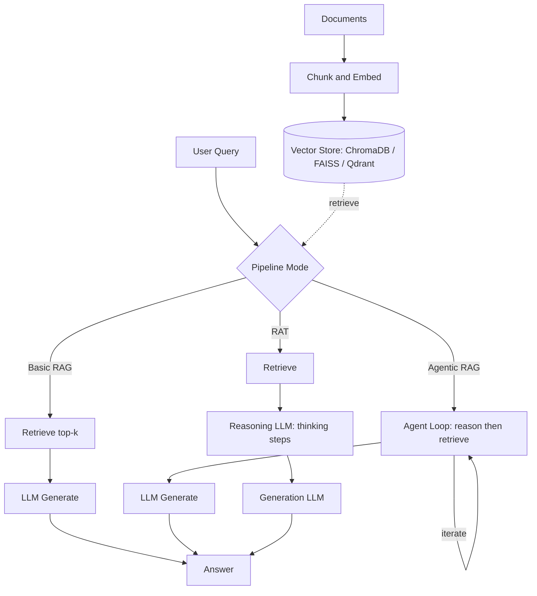

⏱️ **예상 읽기 시간**: 15분

## 소개

**RAGLight**는 **검색 증강 생성(Retrieval-Augmented Generation, RAG)** 구현을 간소화하도록 설계된 경량 모듈형 Python 프레임워크입니다. 문서 검색과 대규모 언어 모델(Large Language Model, LLM)을 결합하여, 사용자의 문서와 지식 베이스를 기반으로 질문에 답할 수 있는 컨텍스트 인식 AI 시스템을 구축할 수 있습니다.

이 종합 튜토리얼에서는 다음을 학습합니다:

- 다양한 LLM 제공자(Ollama, OpenAI, Mistral)와 RAGLight 설정
- 문서 기반 질의응답을 위한 기본 RAG 파이프라인 구축
- 다단계 추론 작업을 위한 Agentic RAG 구현
- 향상된 추론을 위한 RAT(Retrieval-Augmented Thinking) 사용
- MCP(Model Context Protocol)를 사용한 외부 도구 통합

### RAGLight의 특별한 점

RAGLight의 장점:

- **모듈형 아키텍처**: LLM, 임베딩, 벡터 스토어를 쉽게 교체 가능
- **다중 제공자 지원**: Ollama, OpenAI, Mistral, LMStudio, vLLM, Google AI
- **고급 파이프라인**: 기본 RAG, Agentic RAG, 추론 레이어가 있는 RAT
- **MCP 통합**: 외부 도구 및 데이터 소스를 원활하게 연결
- **유연한 구성**: RAG 파이프라인의 모든 측면을 커스터마이징 가능

## 사전 요구사항

이 튜토리얼을 시작하기 전에 다음을 준비하세요:

### 1. Python 환경

```bash
# Python 버전 확인 (3.8 이상 필요)
python3 --version

# 가상 환경 생성 (권장)
python3 -m venv raglight-env
source raglight-env/bin/activate  # macOS/Linux
# raglight-env\Scripts\activate  # Windows
```

### 2. Ollama 설치 (로컬 LLM용)

```bash
# macOS
brew install ollama

# 또는 https://ollama.ai/download 에서 다운로드

# Ollama 서비스 시작
ollama serve

# 모델 다운로드 (새 터미널에서)
ollama pull llama3.2:3b
```

**대안**: 클라우드 기반 LLM을 선호하는 경우 OpenAI 또는 Mistral API를 사용하세요.

### 3. RAGLight 설치

```bash
pip install raglight
```

## 설치 및 설정

### 환경 구성

API 키를 저장할 `.env` 파일을 생성하세요 (클라우드 제공자 사용 시):

```bash
# .env 파일
OPENAI_API_KEY=your_openai_key_here
MISTRAL_API_KEY=your_mistral_key_here
```

### 프로젝트 구조

프로젝트 디렉토리를 설정하세요:

```bash
mkdir raglight-tutorial
cd raglight-tutorial
mkdir data
mkdir knowledge_base
```

### 샘플 데이터 생성

테스트용 샘플 문서를 생성하세요:

```bash
# data/document1.txt
cat > data/document1.txt << 'EOF'
RAGLight는 검색 증강 생성을 위한 모듈형 Python 프레임워크입니다.
Ollama, OpenAI, Mistral을 포함한 여러 LLM 제공자를 지원합니다.
주요 기능으로 ChromaDB 및 FAISS와의 유연한 벡터 스토어 통합이 있습니다.
EOF

# data/document2.txt
cat > data/document2.txt << 'EOF'
Agentic RAG는 자율적인 에이전트를 통합하여 전통적인 RAG를 확장합니다.
이러한 에이전트는 다단계 추론과 동적 정보 검색을 수행할 수 있습니다.
사용 사례에는 복잡한 질의응답과 연구 보조가 포함됩니다.
EOF

# data/document3.txt
cat > data/document3.txt << 'EOF'
RAT(Retrieval-Augmented Thinking)는 특화된 추론 레이어를 추가합니다.
추론 LLM을 사용하여 응답 품질과 분석 깊이를 향상시킵니다.
RAT는 깊은 사고와 다중 홉 추론이 필요한 작업에 이상적입니다.
EOF
```

## 기본 RAG 파이프라인

### RAG 아키텍처 이해

기본 RAG 파이프라인은 세 가지 주요 구성 요소로 이루어집니다:

1. **문서 수집(Document Ingestion)**: 문서를 청크로 분할하고 임베딩으로 변환
2. **벡터 저장(Vector Storage)**: 임베딩을 벡터 데이터베이스(ChromaDB, FAISS 등)에 저장
3. **검색 및 생성(Retrieval & Generation)**: 쿼리 시 관련 문서를 검색하여 LLM에 전달

**그림 1. RAGLight 파이프라인 아키텍처 (기본 RAG · Agentic RAG · RAT).**



### 구현

기본 RAG 파이프라인의 완전한 예제입니다:

```python
#!/usr/bin/env python3
"""RAGLight를 사용한 기본 RAG 파이프라인"""

from raglight.rag.simple_rag_api import RAGPipeline
from raglight.config.rag_config import RAGConfig
from raglight.config.vector_store_config import VectorStoreConfig
from raglight.config.settings import Settings
from raglight.models.data_source_model import FolderSource
from dotenv import load_dotenv

# 환경 변수 로드
load_dotenv()

# 로깅 설정
Settings.setup_logging()

# 벡터 스토어 구성
vector_store_config = VectorStoreConfig(
    embedding_model=Settings.DEFAULT_EMBEDDINGS_MODEL,
    api_base=Settings.DEFAULT_OLLAMA_CLIENT,
    provider=Settings.HUGGINGFACE,
    database=Settings.CHROMA,
    persist_directory="./chroma_db",
    collection_name="my_knowledge_base"
)

# RAG 구성
config = RAGConfig(
    llm="llama3.2:3b",  # Ollama 모델
    k=5,  # 검색할 문서 수
    provider=Settings.OLLAMA,
    system_prompt=Settings.DEFAULT_SYSTEM_PROMPT,
    knowledge_base=[FolderSource(path="./data")]
)

# 파이프라인 초기화 및 구축
print("RAG 파이프라인 초기화 중...")
pipeline = RAGPipeline(config, vector_store_config)

print("지식 베이스 구축 중...")
pipeline.build()

# 파이프라인에 쿼리
query = "RAGLight의 주요 기능은 무엇인가요?"
print(f"\n쿼리: {query}")

response = pipeline.generate(query)
print(f"\n응답:\n{response}")
```

### 주요 구성 옵션

**벡터 스토어 옵션:**
- `database`: CHROMA, FAISS, 또는 QDRANT
- `provider`: 임베딩을 위한 HUGGINGFACE, OLLAMA, 또는 OPENAI
- `persist_directory`: 벡터 데이터베이스를 저장할 위치

**RAG 옵션:**
- `llm`: 모델 이름 (예: "llama3.2:3b", "gpt-4", "mistral-large-2411")
- `k`: 검색할 관련 문서 수
- `provider`: OLLAMA, OPENAI, MISTRAL, LMSTUDIO, GOOGLE

### 다양한 LLM 제공자 사용

**OpenAI:**
```python
config = RAGConfig(
    llm="gpt-4",
    k=5,
    provider=Settings.OPENAI,
    api_key=Settings.OPENAI_API_KEY,
    knowledge_base=[FolderSource(path="./data")]
)
```

**Mistral:**
```python
config = RAGConfig(
    llm="mistral-large-2411",
    k=5,
    provider=Settings.MISTRAL,
    api_key=Settings.MISTRAL_API_KEY,
    knowledge_base=[FolderSource(path="./data")]
)
```

## Agentic RAG 파이프라인

### Agentic RAG란?

Agentic RAG는 다음 기능을 수행할 수 있는 자율적인 에이전트(Agent)를 통합하여 전통적인 RAG를 확장합니다:

- 다단계 추론 수행
- 추가 정보 검색 시점 결정
- 여러 검색-생성 사이클을 통한 반복
- 여러 데이터 소스가 필요한 복잡한 질문 처리

### 구현

```python
"""RAGLight를 사용한 Agentic RAG 파이프라인"""

from raglight.rag.simple_agentic_rag_api import AgenticRAGPipeline
from raglight.config.agentic_rag_config import AgenticRAGConfig
from raglight.config.vector_store_config import VectorStoreConfig
from raglight.config.settings import Settings
from raglight.models.data_source_model import FolderSource
from dotenv import load_dotenv

load_dotenv()
Settings.setup_logging()

# 벡터 스토어 구성
vector_store_config = VectorStoreConfig(
    embedding_model=Settings.DEFAULT_EMBEDDINGS_MODEL,
    api_base=Settings.DEFAULT_OLLAMA_CLIENT,
    provider=Settings.HUGGINGFACE,
    database=Settings.CHROMA,
    persist_directory="./agentic_chroma_db",
    collection_name="agentic_knowledge_base"
)

# Agentic RAG 구성
config = AgenticRAGConfig(
    provider=Settings.MISTRAL,
    model="mistral-large-2411",
    k=10,
    system_prompt=Settings.DEFAULT_AGENT_PROMPT,
    max_steps=4,  # 최대 추론 단계
    api_key=Settings.MISTRAL_API_KEY,
    knowledge_base=[FolderSource(path="./data")]
)

# 초기화 및 구축
print("Agentic RAG 파이프라인 초기화 중...")
agentic_rag = AgenticRAGPipeline(config, vector_store_config)

print("지식 베이스 구축 중...")
agentic_rag.build()

# 여러 단계가 필요한 복잡한 쿼리
query = """
기본 RAG와 Agentic RAG의 기능을 비교하세요.
Agentic RAG가 더 유리한 구체적인 사용 사례는 무엇인가요?
"""

print(f"\n쿼리: {query}")
response = agentic_rag.generate(query)
print(f"\n응답:\n{response}")
```

### Agentic RAG의 주요 기능

**max_steps**: 에이전트가 수행할 수 있는 추론 반복 횟수 제어
```python
# 간단한 쿼리: 적은 단계 필요
config = AgenticRAGConfig(max_steps=2, ...)

# 복잡한 분석: 더 많은 단계 허용
config = AgenticRAGConfig(max_steps=10, ...)
```

**커스텀 에이전트 프롬프트**: 에이전트의 동작 맞춤화
```python
custom_agent_prompt = """
당신은 연구 보조입니다. 질문에 답할 때:
1. 복잡한 쿼리를 하위 질문으로 분해
2. 각 하위 질문에 대한 관련 정보 검색
3. 발견 사항을 종합하여 포괄적인 답변 작성
4. 가능한 경우 출처 인용
"""

config = AgenticRAGConfig(
    system_prompt=custom_agent_prompt,
    ...
)
```

## RAT (검색 증강 사고)

### RAT 이해하기

RAT는 RAG 파이프라인에 특화된 추론 레이어를 추가합니다:

1. **검색(Retrieval)**: 관련 문서 가져오기
2. **추론(Reasoning)**: 추론 LLM을 사용하여 검색된 내용 분석
3. **사고(Thinking)**: 중간 추론 단계 생성
4. **생성(Generation)**: 향상된 컨텍스트로 최종 답변 생성

### 구현

```python
"""RAGLight를 사용한 RAT 파이프라인"""

from raglight.rat.simple_rat_api import RATPipeline
from raglight.config.rat_config import RATConfig
from raglight.config.vector_store_config import VectorStoreConfig
from raglight.config.settings import Settings
from raglight.models.data_source_model import FolderSource

Settings.setup_logging()

# 벡터 스토어 구성
vector_store_config = VectorStoreConfig(
    embedding_model=Settings.DEFAULT_EMBEDDINGS_MODEL,
    api_base=Settings.DEFAULT_OLLAMA_CLIENT,
    provider=Settings.HUGGINGFACE,
    database=Settings.CHROMA,
    persist_directory="./rat_chroma_db",
    collection_name="rat_knowledge_base"
)

# RAT 구성
config = RATConfig(
    cross_encoder_model=Settings.DEFAULT_CROSS_ENCODER_MODEL,
    llm="llama3.2:3b",
    k=Settings.DEFAULT_K,
    provider=Settings.OLLAMA,
    system_prompt=Settings.DEFAULT_SYSTEM_PROMPT,
    reasoning_llm=Settings.DEFAULT_REASONING_LLM,
    reflection=3,  # 추론 반복 횟수
    knowledge_base=[FolderSource(path="./data")]
)

# 초기화 및 구축
print("RAT 파이프라인 초기화 중...")
pipeline = RATPipeline(config, vector_store_config)

print("지식 베이스 구축 중...")
pipeline.build()

# 깊은 추론이 필요한 쿼리
query = """
RAG, Agentic RAG, RAT의 아키텍처 차이를 분석하세요.
복잡성, 성능, 출력 품질 측면에서 각각의 트레이드오프는 무엇인가요?
"""

print(f"\n쿼리: {query}")
response = pipeline.generate(query)
print(f"\n응답:\n{response}")
```

### RAT 구성 옵션

**reflection**: 추론 반복 횟수
```python
# 빠른 추론
config = RATConfig(reflection=1, ...)

# 깊은 분석적 사고
config = RATConfig(reflection=5, ...)
```

**cross_encoder_model**: 더 나은 검색을 위한 리랭킹 모델
```python
config = RATConfig(
    cross_encoder_model="cross-encoder/ms-marco-MiniLM-L-12-v2",
    ...
)
```

## MCP 통합

### MCP란?

Model Context Protocol(MCP)을 사용하면 RAG 파이프라인이 외부 도구 및 서비스와 상호 작용할 수 있습니다. 다음이 가능합니다:

- 웹 검색 통합
- 데이터베이스 쿼리
- 외부 서비스에 대한 API 호출
- 코드 실행 환경
- 커스텀 도구 통합

### MCP 서버 설정

먼저 MCP 서버를 구성하세요(MCPClient 사용 예제):

```python
"""MCP 서버 구성"""

from raglight.rag.simple_agentic_rag_api import AgenticRAGPipeline
from raglight.config.agentic_rag_config import AgenticRAGConfig
from raglight.config.settings import Settings

# MCP 서버 URL 구성
config = AgenticRAGConfig(
    provider=Settings.OPENAI,
    model="gpt-4o",
    k=10,
    mcp_config=[
        {"url": "http://127.0.0.1:8001/sse"}  # MCP 서버 URL
    ],
    system_prompt=Settings.DEFAULT_AGENT_PROMPT,
    max_steps=4,
    api_key=Settings.OPENAI_API_KEY
)

# MCP로 초기화
pipeline = AgenticRAGPipeline(config, vector_store_config)
pipeline.build()

# 이제 에이전트가 외부 도구를 사용할 수 있습니다
query = "RAG 프레임워크에 대한 최근 업데이트를 웹에서 검색하고 요약하세요"
response = pipeline.generate(query)
```

### MCP 사용 사례

**웹 검색 통합:**
```python
# 에이전트가 웹 결과를 검색하고 통합 가능
query = "2024년 RAG 기술의 최신 발전 사항은 무엇인가요?"
```

**데이터베이스 쿼리:**
```python
# 에이전트가 실시간 데이터를 위해 데이터베이스 쿼리 가능
query = "데이터베이스에서 사용자 통계를 검색하고 추세를 분석하세요"
```

**API 통합:**
```python
# 에이전트가 외부 API 호출 가능
query = "날씨 API를 확인하고 예보를 기반으로 활동을 추천하세요"
```

## 성능 비교

### 파이프라인 특성

| 파이프라인 타입 | 복잡도 | 응답 시간 | 사용 사례 |
|--------------|--------|----------|----------|
| **기본 RAG** | 낮음 | 빠름 (< 5초) | 간단한 Q&A, 문서 조회 |
| **Agentic RAG** | 중간 | 보통 (5-15초) | 다단계 추론, 연구 |
| **RAT** | 높음 | 느림 (15-30초) | 깊은 분석, 복잡한 추론 |
| **RAG + MCP** | 가변적 | 도구에 따라 다름 | 외부 도구 통합 |

### 올바른 파이프라인 선택

**기본 RAG를 사용하는 경우:**
- 빠른 응답이 필요할 때
- 질문이 간단할 때
- 단일 문서 조회로 충분할 때

**Agentic RAG를 사용하는 경우:**
- 질문에 여러 단계가 필요할 때
- 동적 검색이 필요할 때
- 작업에 연구 또는 탐색이 포함될 때

**RAT를 사용하는 경우:**
- 깊은 분석적 사고가 필요할 때
- 속도보다 품질이 중요할 때
- 복잡한 다중 홉 추론이 필요할 때

**MCP 통합을 사용하는 경우:**
- 실시간 외부 데이터가 필요할 때
- 작업에 도구 사용이 필요할 때
- 동적 정보가 필수적일 때

## 모범 사례

### 1. 문서 준비

**청크 크기 최적화:**
```python
# 기술 문서의 경우
chunk_size = 512

# 내러티브 콘텐츠의 경우
chunk_size = 1024
```

**폴더 구성:**
```
knowledge_base/
├── technical_docs/
├── user_manuals/
├── api_reference/
└── faq/
```

### 2. 벡터 스토어 관리

**영구 저장:**
```python
# 프로덕션에서는 항상 영구 저장소 사용
vector_store_config = VectorStoreConfig(
    persist_directory="./prod_vectordb",
    collection_name="production_kb"
)
```

**컬렉션 구성:**
```python
# 다양한 도메인에 대해 별도 컬렉션 사용
collections = {
    "technical": "tech_docs_collection",
    "business": "business_docs_collection",
    "general": "general_knowledge_collection"
}
```

### 3. LLM 선택

**개발:**
```python
# 개발용 로컬 모델 사용
config = RAGConfig(
    llm="llama3.2:3b",
    provider=Settings.OLLAMA
)
```

**프로덕션:**
```python
# 프로덕션용 강력한 모델 사용
config = RAGConfig(
    llm="gpt-4",
    provider=Settings.OPENAI
)
```

### 4. 오류 처리

```python
"""견고한 오류 처리를 포함한 RAG 파이프라인"""

try:
    pipeline = RAGPipeline(config, vector_store_config)
    pipeline.build()
    response = pipeline.generate(query)
except Exception as e:
    print(f"파이프라인 오류: {e}")
    # RAG 없이 기본 LLM으로 폴백
    response = fallback_generate(query)
```

### 5. 무시 폴더 구성

코드 저장소를 인덱싱할 때 불필요한 디렉토리를 제외하세요:

```python
# 커스텀 무시 폴더
custom_ignore_folders = [
    ".venv",
    "venv",
    "node_modules",
    "__pycache__",
    ".git",
    "build",
    "dist",
    "my_custom_folder_to_ignore"
]

config = AgenticRAGConfig(
    ignore_folders=custom_ignore_folders,
    ...
)
```

### 6. 모니터링 및 로깅

```python
"""상세 로깅 활성화"""

import logging

# 로깅 레벨 구성
logging.basicConfig(level=logging.INFO)

# 또는 RAGLight의 설정 사용
Settings.setup_logging()

# 성능 모니터링
import time

start_time = time.time()
response = pipeline.generate(query)
elapsed_time = time.time() - start_time

print(f"쿼리 처리 시간: {elapsed_time:.2f}초")
```

## 고급 커스터마이징

### 커스텀 파이프라인 빌더

```python
"""빌더 패턴을 사용한 커스텀 RAG 파이프라인"""

from raglight.rag.builder import Builder
from raglight.config.settings import Settings

# 커스텀 파이프라인 구축
rag = Builder() \
    .with_embeddings(
        Settings.HUGGINGFACE,
        model_name=Settings.DEFAULT_EMBEDDINGS_MODEL
    ) \
    .with_vector_store(
        Settings.CHROMA,
        persist_directory="./custom_db",
        collection_name="custom_collection"
    ) \
    .with_llm(
        Settings.OLLAMA,
        model_name="llama3.2:3b",
        system_prompt_file="./custom_prompt.txt",
        provider=Settings.OLLAMA
    ) \
    .build_rag(k=5)

# 문서 수집
rag.vector_store.ingest(data_path='./data')

# 쿼리
response = rag.generate("여기에 질문을 입력하세요")
```

### 코드 저장소 인덱싱

```python
"""코드 저장소 인덱싱"""

# 시그니처 추출로 코드 인덱싱
rag.vector_store.ingest(repos_path=['./repo1', './repo2'])

# 코드 검색
code_results = rag.vector_store.similarity_search("인증 로직")

# 클래스 시그니처 검색
class_results = rag.vector_store.similarity_search_class("User 클래스 정의")
```

### GitHub 저장소 통합

```python
"""GitHub 저장소 직접 인덱싱"""

from raglight.models.data_source_model import GitHubSource

knowledge_base = [
    GitHubSource(url="https://github.com/Bessouat40/RAGLight"),
    GitHubSource(url="https://github.com/your-org/your-repo")
]

config = RAGConfig(
    knowledge_base=knowledge_base,
    ...
)
```

## Docker 배포

### Dockerfile 예제

```dockerfile
FROM python:3.10-slim

WORKDIR /app

# 의존성 설치
COPY requirements.txt .
RUN pip install --no-cache-dir -r requirements.txt

# 애플리케이션 복사
COPY . .

# Ollama/LMStudio를 위한 호스트 매핑 추가
# 실행: docker run --add-host=host.docker.internal:host-gateway your-image

CMD ["python", "app.py"]
```

### 빌드 및 실행

```bash
# 이미지 빌드
docker build -t raglight-app .

# 호스트 네트워크 액세스로 실행 (Ollama용)
docker run --add-host=host.docker.internal:host-gateway raglight-app
```

## 문제 해결

### 일반적인 문제

**1. Ollama 연결 오류:**
```python
# Ollama가 실행 중인지 확인
# macOS/Linux:
ollama serve

# 필요시 API 베이스 업데이트
vector_store_config = VectorStoreConfig(
    api_base="http://localhost:11434",  # 기본 Ollama URL
    ...
)
```

**2. 메모리 문제:**
```python
# 청크 크기와 k 값 줄이기
config = RAGConfig(
    k=3,  # 더 적은 문서 검색
    ...
)
```

**3. 느린 성능:**
```python
# 더 작은 임베딩 모델 사용
vector_store_config = VectorStoreConfig(
    embedding_model="all-MiniLM-L6-v2",  # 더 작고 빠른 모델
    ...
)
```

**4. 벡터 스토어 오류:**
```bash
# 지우고 재구축
rm -rf ./chroma_db
python rebuild_kb.py
```

## 결론

RAGLight는 검색 증강 생성 시스템을 구축하기 위한 강력하고 유연한 프레임워크를 제공합니다. 간단한 문서 Q&A부터 외부 도구 통합이 포함된 복잡한 에이전트 워크플로우까지, RAGLight의 모듈형 아키텍처를 통해 쉽게 구축하고 확장할 수 있습니다.

### 핵심 요점

- **간단하게 시작**: 기본 RAG로 시작하여 필요에 따라 Agentic RAG 또는 RAT로 업그레이드
- **현명하게 선택**: 사용 사례와 성능 요구 사항에 따라 올바른 파이프라인 선택
- **광범위하게 커스터마이징**: RAGLight의 모듈형 설계를 통해 완전한 커스터마이징 가능
- **점진적으로 확장**: Ollama로 로컬에서 시작한 후 프로덕션을 위해 클라우드 제공자로 이동

### 다음 단계

1. **실험**: 다양한 LLM 제공자와 벡터 스토어 시도
2. **최적화**: k 값, 청크 크기, 모델 선택 조정
3. **통합**: 외부 도구 액세스를 위한 MCP 서버 추가
4. **배포**: 프로덕션 배포를 위해 Docker로 컨테이너화

### 참고 자료

- **RAGLight GitHub**: [https://github.com/Bessouat40/RAGLight](https://github.com/Bessouat40/RAGLight)
- **PyPI 패키지**: [https://pypi.org/project/raglight/](https://pypi.org/project/raglight/)
- **Ollama**: [https://ollama.ai](https://ollama.ai)
- **ChromaDB**: [https://www.trychroma.com](https://www.trychroma.com)
- **MCP 프로토콜**: "Model Context Protocol" 문서 검색

RAGLight로 즐거운 개발 되세요! 🚀

