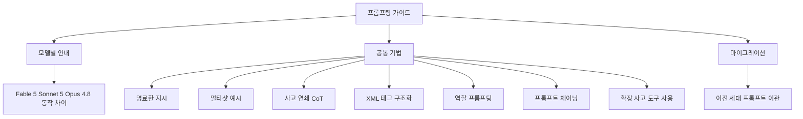

*명료한 지시와 구조가 모여 예측 가능한 출력으로 수렴하는 프롬프팅의 원리를 형상화했습니다.*

## 개요

프롬프트를 잘 쓰는 일은 여전히 모델을 잘 쓰는 일의 8할입니다. 모델이 강해질수록 느슨한 지시도 어느 정도 따라오지만, 산출물의 형태와 품질을 안정적으로 뽑아내려면 여전히 명료한 계약이 필요합니다.

Anthropic은 최신 모델을 대상으로 한 프롬프팅 베스트 프랙티스를 공식 문서로 정리해 두고 있습니다. 이 가이드는 Claude Fable 5, Claude Sonnet 5, Claude Opus 4.8을 비롯한 현행 모델을 함께 다루며, 모델별로 어디서 동작이 갈리는지, 모든 모델에 공통으로 통하는 기법이 무엇인지, 이전 세대에서 넘어올 때 무엇을 고쳐야 하는지를 나눠 설명합니다. 이 글에서는 그 구조와 핵심 기법을 정리하고, ThakiCloud가 에이전트 플랫폼 Paxis에서 프롬프트를 즉흥이 아니라 계약으로 다루는 방식과 연결해 봅니다.

## 이 가이드는 무엇인가

Anthropic의 프롬프팅 문서는 크게 세 부분으로 짜여 있습니다.

첫째는 모델별 안내입니다. Fable 5, Sonnet 5, Opus 4.8이 서로 다르게 반응하는 지점을 먼저 짚어, 같은 프롬프트라도 모델에 따라 조정이 필요할 수 있음을 알려 줍니다. 둘째는 모든 현행 모델에 공통으로 적용되는 기법입니다. 일반 원칙부터 출력 포맷팅, 도구 사용, 사고(thinking), 에이전트 시스템 설계까지 폭넓게 다룹니다. 셋째는 마이그레이션 고려 사항으로, 이전 세대에서 넘어온 프롬프트를 어떻게 손봐야 하는지를 안내합니다.

이 세 갈래 구조를 그림으로 옮기면 다음과 같습니다.

문서와 별개로 Anthropic은 9개 장으로 구성된 인터랙티브 프롬프트 엔지니어링 튜토리얼도 공개하고 있어, 예제와 연습을 직접 실행하며 익힐 수 있습니다.

## 핵심 기법 정리

가이드가 강조하는 기법은 화려한 트릭이 아니라 기본기의 반복입니다. 실무에서 효과 순으로 정리하면 다음과 같습니다.

명료한 지시가 첫째입니다. 무엇을 할지, 어떤 형태로 내놓을지, 무엇을 평가 기준으로 삼을지를 구체적으로 적습니다. "도와줘" 같은 모호한 요청 대신 동작 하나에 결과물 하나를 지정합니다. 산출물의 형태를 명시하는 것만으로도 품질이 가장 크게 올라갑니다.

멀티샷 예시가 둘째입니다. 원하는 어조와 형식을 두세 개의 예로 보여 주면 모델이 그 리듬을 따라옵니다. 특히 출력 포맷이 까다로울 때, 말로 설명하기보다 예시 하나를 붙이는 편이 훨씬 정확합니다.

사고 연쇄(chain of thought)가 셋째입니다. 답을 내기 전에 단계적으로 생각하도록 요청하면 복잡한 추론의 정확도가 올라갑니다. 다만 사고에는 토큰 비용이 따르므로, 정말 추론이 필요한 작업에만 씁니다.

XML 태그를 이용한 구조화가 넷째입니다. 지시, 맥락, 예시, 입력 데이터를 태그로 구분하면 모델이 각 부분의 역할을 헷갈리지 않습니다. 긴 컨텍스트를 다룰 때 특히 효과가 큽니다.

역할 프롬프팅이 다섯째입니다. 모델에게 특정 관점이나 전문가 역할을 부여하면 그 맥락에 맞는 어휘와 판단이 나옵니다. 리뷰, 감사, 특정 도메인 분석에 유용합니다.

프롬프트 체이닝이 여섯째입니다. 하나의 큰 요청을 여러 단계로 쪼개 각 단계의 출력을 다음 단계의 입력으로 넘기면, 한 번에 모든 것을 요구할 때보다 각 단계의 품질이 안정됩니다.

마지막으로 확장 사고와 도구 사용, 에이전트 시스템 설계가 있습니다. 확장 사고는 내부 추론에 예산을 배분하는 기능이고, 도구 사용과 에이전트 설계는 모델이 외부 도구를 호출하고 결과를 다시 받아 다음 행동을 정하는 루프를 다룹니다. 이 부분이 최신 가이드에서 비중이 커진 영역입니다.

## ThakiCloud 제품 적용 시사점

이 가이드가 우리에게 실용적인 이유는, ThakiCloud의 에이전트 플랫폼 Paxis가 프롬프트를 정확히 이 방식으로 다루기 때문입니다. Paxis는 ai-platform 위에서 도는 Agent-Native Cloud 제어 평면으로, 스킬과 도구, 정책, 감사 로그를 일급 리소스로 관리합니다. 그 안에서 프롬프트는 매번 새로 짜는 즉흥물이 아니라, 스킬에 패키징되어 버전 관리되는 계약입니다.

가이드의 첫째 기법인 명료한 지시는 Paxis의 스킬 하니스 설계 원칙과 그대로 겹칩니다. 능력은 얇은 하니스가 아니라 두터운 스킬에 쌓고, 각 스킬은 입력과 처리, 출력, 실패 복구까지를 명시적으로 규정합니다. 산출물의 형태와 평가 기준을 코드가 소유하게 만들면, 모델은 내용 생성에만 집중하고 포맷은 흔들리지 않습니다.

XML 구조화와 프롬프트 체이닝은 DAG 멀티에이전트 오케스트레이션과 맞닿아 있습니다. Paxis는 960개가 넘는 스킬을 BM25로 선택해 격리된 샌드박스에서 실행하는데, 큰 작업을 단계로 쪼개 각 단계의 출력을 다음으로 넘기는 체이닝은 이 오케스트레이션의 기본 문법입니다. 각 단계를 독립된 스킬로 두면 실패한 단계만 다시 돌릴 수 있어 회복 정밀도가 올라갑니다.

역할 프롬프팅과 도구 사용은 정책 게이트, 감사 로그와 결합됩니다. 특정 역할을 부여한 서브에이전트가 도구를 호출하고 결과를 받아 다음 행동을 정하는 루프는, 모든 행동이 정책 게이트와 감사 로그를 통과할 때 비로소 안전하게 자율화됩니다. 가이드가 강조하는 에이전트 시스템 설계가 우리에게는 곧 감사 가능한 자율 실행의 문제로 번역됩니다.

정리하면, 좋은 프롬프팅의 원칙과 견고한 에이전트 플랫폼의 설계 원칙은 사실상 같은 곳을 가리킵니다. 자유도를 줄이고 검증된 골격에 내용을 채워 평균 품질을 올리는 것. 이 가이드는 그 원칙을 프롬프트 수준에서, Paxis는 플랫폼 수준에서 실천합니다.

## 한계 및 반론

이 가이드에도 유의할 점이 있습니다. 첫째, 모델별 안내는 시간이 지나면 낡습니다. 모델이 새로 나오거나 업데이트되면 어제 통하던 프롬프트가 오늘은 다르게 반응할 수 있으므로, 가이드를 도그마가 아니라 현재 시점의 스냅샷으로 읽어야 합니다.

둘째, 기법을 많이 안다고 좋은 프롬프트가 나오는 것은 아닙니다. XML 태그와 사고 연쇄, 역할 프롬프팅을 한꺼번에 쌓으면 오히려 지시가 무거워지고 토큰만 늘 수 있습니다. 각 기법은 언제 쓰지 않을지를 아는 것이 언제 쓸지를 아는 것만큼 중요합니다.

셋째, 확장 사고는 공짜가 아닙니다. 사고 토큰은 비용이며, 모든 작업에 최대 사고를 켜는 것은 낭비입니다. 앞서 다룬 모델 라우팅 관점과 마찬가지로, 사고 예산도 작업 난도에 맞춰 배분해야 합니다.

결론적으로 이 가이드의 가치는 새로운 마법을 알려 주는 데 있지 않습니다. 기본기를 언제 어떻게 조합하는지에 대한 판단을 벼리는 데 있습니다. 그리고 그 판단을 매번 다시 하지 않도록 스킬과 정책으로 굳히는 것이 플랫폼의 몫입니다.

## 출처

- "Prompting best practices", Claude Platform Docs: [platform.claude.com/docs/en/build-with-claude/prompt-engineering/claude-prompting-best-practices](https://platform.claude.com/docs/en/build-with-claude/prompt-engineering/claude-prompting-best-practices)
- "Prompt engineering overview", Anthropic Docs: [docs.anthropic.com/en/docs/build-with-claude/prompt-engineering/overview](https://docs.anthropic.com/en/docs/build-with-claude/prompt-engineering/overview)
- "Anthropic's Interactive Prompt Engineering Tutorial", GitHub: [github.com/anthropics/prompt-eng-interactive-tutorial](https://github.com/anthropics/prompt-eng-interactive-tutorial)
