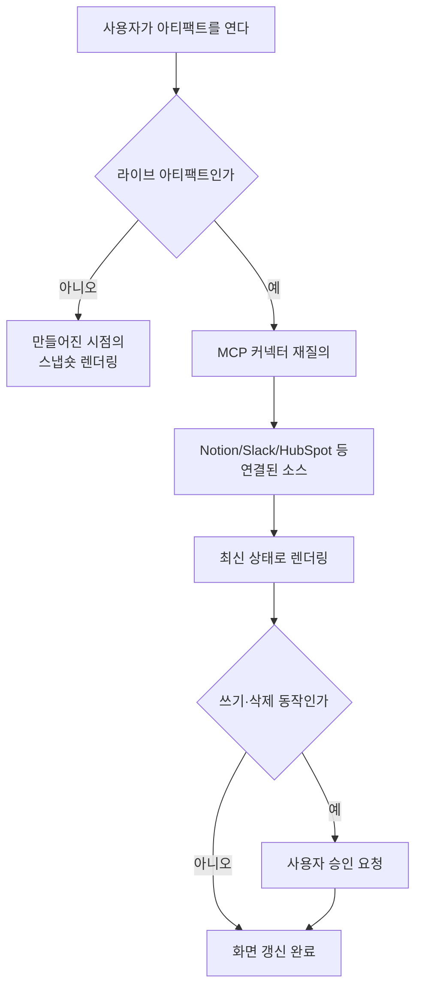

지금까지 Claude Code의 아티팩트는 세션의 작업 결과를 붙잡아 하나의 공유 가능한 웹 페이지로 굳혀
주는 도구였습니다. 풀 리퀘스트 설명, 인시던트 정리, 체크리스트처럼 만들어진 순간의 상태를 그대로
보존하는 정적 산출물이었습니다. 이번 업데이트로 아티팩트는 한 단계 넘어섭니다. 아티팩트가 이제
**MCP 커넥터를 직접 호출**해 데이터를 가져오고 동작까지 수행합니다. 즉, 만들어진 시점에 박제된
페이지가 아니라 **열 때마다 커넥터를 다시 질의해 최신 상태를 보여 주는 살아 있는 앱**이 됩니다.
이 글을 읽는 대상은 반복되는 내부 대시보드와 운영 도구를 코드로 짜는 데 지친 개발자입니다. 결론부터
말하면, 이제 그 대시보드의 상당수를 프런트엔드 배포 없이 아티팩트 하나로 대체할 수 있습니다.

## 개요

핵심 변화는 아티팩트가 "읽기 전용 결과물"에서 "실행 가능한 클라이언트"로 바뀌었다는 점입니다.
예전 아티팩트가 데이터의 스냅숏을 렌더링했다면, 라이브 아티팩트는 커넥터를 통해 실제 소스에
질의를 던집니다. 이 차이가 만드는 활용처는 분명합니다. CRM 파이프라인 현황판, 프로젝트 트래커,
아침 브리핑, 주간 지표 보드처럼 **원본 데이터가 계속 바뀌는** 화면이 여기에 딱 맞습니다. 열 때마다
새로 긁어 오므로, 사람이 새로고침을 누르거나 별도 백엔드가 크론으로 데이터를 밀어 넣을 필요가
없습니다.

MCP는 이 그림에서 배관 역할을 합니다. MCP는 Claude가 채팅 바깥의 도구와 대화하도록 하는 개방형
표준 프로토콜이고, 커넥터는 그 위에 Anthropic이나 파트너가 얹은 원클릭 설치 통합입니다. 아티팩트가
커넥터를 호출한다는 말은, 결국 아티팩트가 MCP 서버에 연결된 외부 시스템의 데이터를 직접 읽고
쓸 수 있게 됐다는 뜻입니다.

## Claude Code 아티팩트와 MCP 커넥터는 무엇인가

아티팩트부터 정리합니다. 아티팩트는 Claude Code 세션의 작업을 살아 있는 공유 가능한 시각 페이지로
바꿉니다. 주석이 달린 diff가 붙은 풀 리퀘스트 설명, 세션 데이터로 조립한 대시보드, 조사가 진행되며
채워지는 타임라인이 모두 아티팩트가 될 수 있습니다. 라이브 아티팩트는 여기서 한 발 더 나가, 스스로
새로고침되는 도구입니다. 열 때마다 연결된 커넥터를 다시 질의해 현재 상태를 보여 줍니다.

커넥터는 MCP 서버 위에 얹은 통합 계층입니다. 라이브러리 커넥터는 Customize 화면의 Connectors
섹션에서 한 번의 클릭과 OAuth 로그인으로 붙습니다. Notion, Gmail, Slack, HubSpot, Linear, Canva,
Atlassian, Microsoft 365 같은 것들이 여기에 있습니다. 커넥터 디렉터리에는 파일, 이메일, 프로젝트
관리, 분석, 디자인, 세일즈, 개발 도구를 아우르는 375개 이상의 통합이 올라와 있습니다.

아래 다이어그램이 정적 아티팩트와 라이브 아티팩트의 데이터 흐름 차이를 보여 줍니다.



## 어떻게 작동하는가

작동 원리는 세 개의 규칙으로 요약됩니다.

첫째, **열 때마다 다시 질의합니다.** 라이브 아티팩트는 Cowork 사이드바의 별도 탭에 살면서, 열릴
때마다 커넥터를 재질의해 현재 상태를 그립니다. 하나의 커넥터만 쓸 수도 있고 여러 커넥터를 엮어
하나의 화면으로 합칠 수도 있습니다. 여러 소스를 봉합한 통합 대시보드가 여기서 나옵니다.

둘째, **쓰기와 삭제에는 승인 게이트가 붙습니다.** 커넥터가 단순히 데이터를 읽어 오는 데 그치지
않고 연결된 소스의 데이터를 실제로 바꾸는 동작을 수행할 때는, Claude가 먼저 사용자에게 승인을
요청하도록 되어 있습니다. 자동화가 조용히 원본을 건드리는 사고를 막는 안전장치입니다. 도구를
설정할 때 Write와 Delete 계열 도구에 승인이 걸려 있는지 확인하는 것이 첫 번째 점검 항목입니다.

셋째, **접근 범위는 개인에게 묶입니다.** Team이나 Enterprise 조직에서는 소유자만 커넥터를 조직에
추가할 수 있고, 실제 연결과 활성화는 사용자가 개별적으로 합니다. 그래서 Claude는 그 사용자가
원래 접근 권한을 가진 도구와 데이터에만 접근합니다. 공유된 아티팩트를 팀원이 사용할 때, 생성자에게
추가 비용이 발생하지 않는다는 점도 Team과 Enterprise 플랜의 특징입니다.

기업 관리 관점에서는 커넥터를 조직 차원에서 프로비저닝하는 흐름도 추가됐습니다. 관리자가 Okta 같은
아이덴티티 공급자를 통해 커넥터를 한 번 등록해 두면, 사용자는 첫 로그인에서 별도 설정 없이 커넥터
접근을 얻습니다. 인증은 조직 차원에서 중앙 집중적으로 구성되고, 이 권한은 Claude 채팅과 Claude
Code, Cowork에 걸쳐 공유됩니다.

## 실제 구성 예시

Claude Code에서 MCP 서버를 붙이는 것은 커맨드 한 줄과 설정 파일 한 개로 끝납니다. 다음은
로컬 MCP 서버를 추가하는 실제 명령입니다.

```bash
# MCP 서버를 Claude Code에 등록
claude mcp add my-metrics --command "python3" --args "servers/metrics_mcp.py"

# 등록된 서버 확인
claude mcp list
```

프로젝트에 붙는 MCP 서버는 리포지토리 루트의 `.mcp.json`에 선언해 팀과 공유할 수 있습니다.
구조는 다음과 같습니다.

```json
{
  "mcpServers": {
    "my-metrics": {
      "command": "python3",
      "args": ["servers/metrics_mcp.py"],
      "env": { "METRICS_DB_URL": "postgres://..." }
    }
  }
}
```

원격 커넥터를 붙일 때는 remote MCP 엔드포인트와 OAuth 흐름을 사용합니다. 라이브러리 커넥터는
UI에서 Customize의 Connectors 섹션에 들어가 더하기 버튼을 누르고 연결할 애플리케이션을 검색하는
것으로 끝납니다. 아티팩트 안에서는 이렇게 붙은 커넥터를 마치 함수처럼 호출해 데이터를 가져오고,
그 결과를 대시보드 컴포넌트로 렌더링합니다. 우리가 짜 넣어야 할 것은 프런트엔드 배포 파이프라인이
아니라, 어떤 커넥터를 어떤 순서로 질의해 무엇을 그릴지에 대한 자연어 지시뿐입니다.

## ThakiCloud 제품 적용 시사점

이 기능은 우리가 Paxis에서 오래 다뤄 온 문제의 소비자용 버전입니다. Paxis는 ThakiCloud의
Agent-Native Cloud로, 스킬과 도구와 정책을 일급 리소스로 다룹니다. 그 도구 계층의 핵심 중 하나가
**MCP 커넥터를 OAuth 자동 재연결과 함께 관리**하는 배관입니다. 아티팩트가 커넥터를 호출한다는
Anthropic의 이번 변화는, 에이전트가 외부 시스템과 대화하려면 커넥터를 일급 리소스로 승격시켜야
한다는 우리 설계 방향과 정확히 같은 지점을 가리킵니다.

우리가 특히 눈여겨보는 대목은 **승인 게이트와 접근 범위**입니다. 라이브 아티팩트가 쓰기·삭제
동작에 승인을 요구하고 접근을 개인 권한에 묶는 방식은, Paxis가 모든 에이전트 행동을 정책 게이트와
감사 로그로 통과시키는 규율과 같은 문제 의식에서 나옵니다. 커넥터가 강력해질수록, 그 커넥터가
무엇을 언제 건드렸는지 기록하고 위험한 동작을 사람 승인 뒤로 미루는 통제 평면이 함께 강해져야
합니다. 아티팩트가 라이브 앱이 되는 순간, 대시보드 하나가 곧 프로덕션 데이터를 향한 실행 경로가
되기 때문입니다.

인프라 관점에서 ai-platform은 이런 라이브 아티팩트가 질의하는 MCP 서버들을 K8s 위에서 안정적으로
서빙하는 층을 담당합니다. 내부 지표 MCP, 배포 상태 MCP, 비용 MCP처럼 팀이 자주 보는 데이터를
MCP 서버로 노출해 두면, 개발자는 프런트엔드를 한 줄도 짜지 않고 라이브 아티팩트로 각자의
운영 대시보드를 조립할 수 있습니다. 저비용으로 안정적으로 서빙되는 MCP 백엔드가 에이전트 경제성을
만든다는 점에서, ai-platform의 서빙 층과 Paxis의 커넥터 층은 한 몸으로 움직입니다.

## 한계 및 반론

몇 가지는 도입 전에 분명히 해야 합니다.

첫째, 이 기능의 상당 부분은 Team과 Enterprise 플랜, 그리고 Cowork 환경에 묶여 있습니다. 라이브
아티팩트와 조직 관리 커넥터는 개인 플랜에서 그대로 재현되지 않으므로, 조직 단위 도입을 전제로
가치를 계산해야 합니다.

둘째, 라이브 아티팩트가 열 때마다 커넥터를 재질의한다는 것은 곧 매 열람이 외부 시스템에 요청을
발생시킨다는 뜻입니다. 무거운 질의를 담은 대시보드를 여럿이 자주 연다면, 원본 시스템의 레이트
리밋과 비용을 함께 봐야 합니다. 정적 스냅숏이 더 나은 화면도 여전히 존재합니다.

셋째, 승인 게이트는 강력하지만 만능이 아닙니다. 읽기 전용으로 보이는 질의가 실제로는 민감한
데이터를 아티팩트라는 공유 가능한 표면으로 끌어올 수 있습니다. 무엇을 공유 아티팩트에 노출할지에
대한 조직 정책이 승인 게이트보다 먼저 서야 합니다. 편리함이 커질수록 그 편리함이 우회하는 통제가
무엇인지 되묻는 것이 이 기능을 안전하게 쓰는 방법입니다.

## 출처

- Claude Code now supports artifacts, Anthropic: [claude.com/blog/artifacts-in-claude-code](https://claude.com/blog/artifacts-in-claude-code)
- Connect Claude Code to tools via MCP, Claude Code Docs: [code.claude.com/docs/en/mcp](https://code.claude.com/docs/en/mcp)
- Get started with custom connectors using remote MCP, Claude Help Center: [support.claude.com/en/articles/11175166](https://support.claude.com/en/articles/11175166)
- Anthropic Claude Code Artifacts update, VentureBeat: [venturebeat.com/data/anthropics-claude-code-artifacts-update-brings-live-shared-dashboards-and-interactive-workspaces-to-enterprises](https://venturebeat.com/data/anthropics-claude-code-artifacts-update-brings-live-shared-dashboards-and-interactive-workspaces-to-enterprises)
