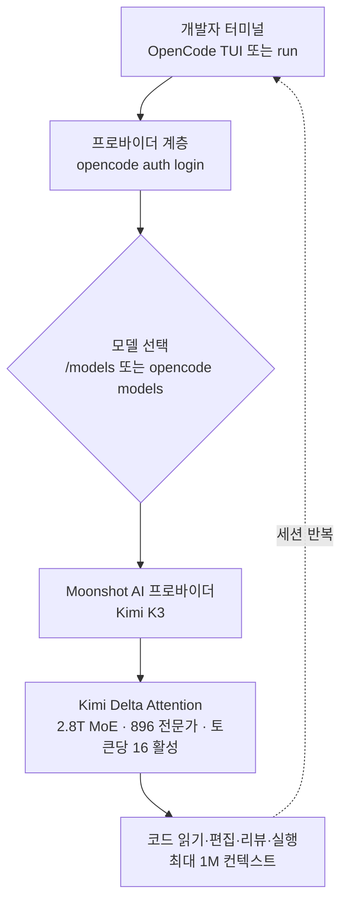

지난 며칠 사이 개발자 타임라인은 "Kimi K3로 코딩하는 법"이라는 스레드로 뒤덮였습니다. 반응은
대체로 두 갈래였습니다. 하나는 벤치마크가 실제로 좋다는 것이고, 다른 하나는 그 모델을 특정
회사의 닫힌 도구가 아니라 내 터미널에서 내가 고른 에이전트로 돌릴 수 있다는 것이었습니다. 이 글은
두 번째 갈래를 다룹니다. 이 글을 읽는 대상은 코딩 에이전트를 특정 벤더의 GUI에 묶어 두기보다,
오픈소스 도구에 원하는 모델을 갈아 끼우며 쓰고 싶은 개발자입니다. 결론부터 말하면, 오픈소스 터미널
에이전트 OpenCode에 Moonshot AI의 Kimi K3를 프로바이더로 붙이면 특정 IDE에 종속되지 않고도 2.8조
파라미터급 모델로 코딩할 수 있습니다.

## 개요

Moonshot AI는 2026년 7월 16일 Kimi K3를 공개했습니다. 회사 발표 기준으로 총 2.8조 파라미터의
Mixture-of-Experts 모델이며, 지금까지 나온 오픈 웨이트 모델 중 가장 큰 축에 듭니다. 흥미로운 점은
성능 지표만이 아닙니다. 이 모델은 프로프라이어터리 챗봇 안에만 갇혀 있지 않고, 터미널에서 도는
오픈소스 코딩 에이전트에 프로바이더로 연결됩니다. 즉 "어떤 IDE를 쓰느냐"와 "어떤 모델로 코딩하느냐"를
분리할 수 있게 됐습니다.

ThakiCloud 관점에서 이 조합은 두 가지 이유로 눈여겨볼 만합니다. 첫째, 코딩 에이전트가 벤더 종속을
벗어나 모델을 자유롭게 교체할 수 있다는 것은 에이전트 플랫폼 설계의 핵심 전제와 맞닿아 있습니다.
둘째, 2.8조 파라미터 오픈 웨이트 모델은 결국 누군가가 실제 GPU 위에서 서빙해야 하며, 그 서빙 비용과
온프렘 요구가 곧 인프라 사업의 질문으로 돌아옵니다. 이 글에서는 먼저 도구를 직접 설치해 연결 흐름을
확인하고, 그다음 이 두 관점을 정리합니다.

## 이 도구는 무엇인가

OpenCode는 터미널에서 도는 오픈소스 코딩 에이전트입니다. 코드베이스의 파일을 읽고, 구조를 설명하고,
코드를 편집하고, 변경을 리뷰하고, 연결된 LLM 프로바이더를 통해 작업을 실행합니다. 특정 모델에 묶이지
않고 프로바이더를 갈아 끼우는 구조라, 같은 워크플로 위에서 모델만 바꿔 가며 쓸 수 있습니다.

Kimi K3는 그 프로바이더 자리에 들어가는 모델입니다. Moonshot AI 발표 기준 핵심 사양은 다음과
같습니다. 총 2.8조 파라미터의 MoE 구조로, 896개의 전문가(expert) 중 토큰당 16개가 활성화됩니다.
어텐션은 Kimi Delta Attention(KDA)이라는 하이브리드 선형 어텐션 방식을 씁니다. 여기에 잔차 연결을
대체하는 Attention Residuals 기법, 네이티브 비전 이해, 그리고 최대 100만 토큰 컨텍스트를 갖췄습니다.
전체 모델 가중치는 2026년 7월 27일 공개 예정입니다.

두 도구가 연결되는 흐름을 그림으로 보면 다음과 같습니다.



기존 접근과의 차이는 명확합니다. 벤더가 제공하는 GUI 에이전트를 쓰면 모델과 도구가 한 묶음으로 딸려
옵니다. 반면 OpenCode 같은 오픈소스 에이전트는 도구를 고정한 채 프로바이더만 교체합니다. 어제는
자체 호스팅 모델, 오늘은 Kimi K3, 내일은 또 다른 모델을 같은 명령 인터페이스로 쓸 수 있습니다.

## 설치 및 통합

실제 설치와 연결 흐름을 격리된 샌드박스에서 직접 확인했습니다. 아래 명령과 버전은 재현 과정에서
캡처한 실제 값입니다.

먼저 OpenCode를 설치합니다. npm 전역 설치로 바로 잡혔습니다.

```bash
npm install -g opencode-ai
opencode --version
# 1.18.3
```

설치된 CLI가 제공하는 명령 표면을 확인했습니다. TUI 실행부터 헤드리스 실행, 프로바이더 관리,
모델 조회, MCP 서버 관리까지 코딩 에이전트가 필요로 하는 명령이 갖춰져 있습니다.

```bash
opencode --help
# opencode [project]        start opencode tui              [default]
# opencode run [message..]  run opencode with a message
# opencode providers        manage AI providers and credentials   [aliases: auth]
# opencode models [provider]  list all available models
# opencode mcp              manage MCP (Model Context Protocol) servers
# opencode agent            manage agents
# opencode serve            starts a headless opencode server
```

프로바이더 인증은 `opencode auth` 하위 명령이 담당합니다.

```bash
opencode auth --help
# opencode auth list    list providers and credentials   [aliases: ls]
# opencode auth login   log in to a provider
# opencode auth logout  log out from a configured provider
```

Kimi K3를 붙이는 순서는 다음과 같습니다. Moonshot AI 공식 OpenCode 가이드 기준입니다.

1. Kimi 오픈 플랫폼에서 API 키를 발급받아 안전하게 보관합니다.
2. `opencode auth login`을 실행하고 프로바이더로 **Moonshot AI**를 선택한 뒤 API 키를 입력합니다.
3. OpenCode 안에서 `/models`(또는 셸에서 `opencode models moonshotai`)로 **Kimi K3**를 선택합니다.
4. 낮은 위험의 작업으로 연결을 검증합니다.

```bash
opencode run "이 프로젝트의 폴더 구조를 설명하고 먼저 읽어야 할 파일 세 개를 추천해 줘."
```

한 가지 확인해 둘 사실이 있습니다. 설치 직후 기본 모델 카탈로그에는 Moonshot 프로바이더가 잡혀
있지 않았습니다. 재현 중 `opencode models`를 Moonshot/Kimi로 필터링하면 결과가 비어 있었고, 이는
프로바이더를 `auth login`으로 명시적으로 추가해야 카탈로그에 노출된다는 뜻입니다. 즉 위 2번 단계는
선택이 아니라 필수입니다.

## 실제 실험 결과

이번 재현에서 직접 캡처한 값과, 모델 자체의 공개 지표를 구분해 정리합니다. 도구 설치와 연결 흐름은
직접 확인한 실측값이고, 벤치마크 점수는 Moonshot과 제3자(Artificial Analysis)가 공개한 보고값입니다.

직접 확인한 실측 결과는 다음과 같습니다.

- OpenCode 설치 성공, 버전 1.18.3(npm `opencode-ai`, 종료 코드 0).
- CLI가 프로바이더 인증(`auth`), 모델 조회(`models`), 헤드리스 실행(`run`), MCP 관리(`mcp`),
  에이전트 관리(`agent`)를 모두 제공함을 확인.
- 설치 직후 기본 카탈로그에 Moonshot 프로바이더 미포함 → `auth login`으로 명시 추가 필요.

라이브 Kimi K3 추론까지는 실행하지 않았습니다. Kimi K3 호출에는 잔액이 있는 유료 API 키가 필요하고
(신규 가입 검증으로 받은 바우처는 K3에 사용할 수 없습니다), 이번 재현 환경에는 해당 키가 없었습니다.
그래서 "설치와 연결 흐름은 실측, 실제 코드 생성 품질은 공개 지표 인용"으로 선을 긋습니다. 없는 수치를
지어내지 않습니다.

모델의 공개 벤치마크는 다음과 같습니다. 아래 점수는 Artificial Analysis가 공개한 보고값 기준이며,
가중치가 아직 완전 공개되지 않아 독립 재현으로는 검증되지 않았음을 함께 밝힙니다.

| 벤치마크 | Kimi K3 | 순위 | 상위/비교 모델 |
|---|---|---|---|
| GDPval-AA v2 | 1,687 | 3위 | Fable 5 Max 1,815 · GPT-5.6 Sol Max 1,747.8 · (Opus 4.8 1,600) |
| AA-Briefcase | 1,527 | 2위 | Fable 5 Max 1,587 · GPT-5.6 Sol Max 1,495 |

숫자를 그대로 읽으면, Kimi K3는 최상위 프런티어 모델 바로 아래 구간에 자리합니다. 특히 장기 지식
노동을 측정한다는 AA-Briefcase에서 2위를 기록했다는 점은, 코딩처럼 여러 단계를 오가는 에이전트
작업에서 쓸 만하다는 신호로 해석할 수 있습니다. 다만 이는 보고값이며, 실제 코딩 워크플로에서의
체감은 각자의 코드베이스로 검증하는 편이 정확합니다.

## ThakiCloud 제품 적용 시사점

이 조합은 ThakiCloud의 두 제품 렌즈 모두와 맞닿습니다. 하나는 에이전트 플랫폼 관점, 다른 하나는
인프라 서빙 관점입니다.

**Paxis 렌즈(에이전트·도구·모델 교체).** Paxis는 ThakiCloud의 Agent-Native Cloud 제어 평면으로,
Skills·Tools·Policies·Audit Logs를 일급 리소스로 다룹니다. OpenCode가 보여 주는 "도구는 고정하고
프로바이더만 교체한다"는 구조는 Paxis의 설계 철학과 정확히 겹칩니다. Paxis에서 코딩 에이전트는
960개가 넘는 스킬을 BM25로 선택해 격리된 샌드박스에서 실행하고, 모든 행동을 정책 게이트와 감사
로그로 통과시킵니다. 여기에 Kimi K3 같은 오픈 웨이트 모델을 프로바이더로 붙이면, 에이전트의 두뇌를
비용과 성능에 따라 갈아 끼우면서도 실행 격리와 감사 체계는 그대로 유지할 수 있습니다. 또한 OpenCode가
MCP 서버 관리(`opencode mcp`)를 내장하고 있다는 점은, MCP 커넥터를 일급 리소스로 다루는 Paxis의
접근과 자연스럽게 연결됩니다.

**ai-platform 렌즈(2.8T 모델 서빙).** 오픈 웨이트라는 말은 결국 누군가가 이 모델을 실제 GPU 위에서
서빙해야 한다는 뜻입니다. 2.8조 파라미터 MoE는 토큰당 16개 전문가만 활성화되므로 활성 파라미터는
전체보다 훨씬 작지만, 896개 전문가 전체를 메모리에 올려야 하는 구조라 온프렘 서빙의 문턱은 낮지
않습니다. 여기서 ThakiCloud의 ai-platform이 답하는 질문이 등장합니다. K8s와 Kueue 기반 GPU 스케줄링,
vLLM/SGLang 서빙, 그리고 양자화를 통한 메모리 절감이 결합될 때 이런 대형 오픈 모델을 멀티테넌트
환경에서 경제적으로 돌릴 수 있습니다. 가중치가 7월 27일 공개되면, 자체 호스팅 대비 API 호출의 비용
곡선을 실제로 비교해 볼 수 있습니다. 낮은 서빙 비용은 곧 에이전트 경제성으로 이어지고, 이는 다시
Paxis 위에서 도는 에이전트의 단가를 낮춥니다. 두 렌즈가 한 방향을 가리키는 셈입니다.

## 한계 및 반론

몇 가지 냉정한 반론을 함께 적습니다.

첫째, 벤치마크 점수와 실제 코딩 체감은 다릅니다. AA-Briefcase 2위가 곧 "내 코드베이스에서 최고"를
보장하지 않습니다. 리더보드 상위 모델이 특정 언어나 프레임워크, 사내 컨벤션에서 오히려 약할 수
있으므로, 도입 판단은 자신의 실제 작업으로 검증해야 합니다.

둘째, 이 글의 실측은 도구 설치와 연결 흐름까지입니다. 라이브 Kimi K3 추론은 유료 API 키 제약으로
실행하지 못했습니다. 실제 생성 품질, 지연 시간, 토큰 비용은 각자의 키로 직접 재 봐야 하는 영역으로
남습니다.

셋째, "오픈 웨이트"가 곧 "공짜"나 "쉬운 운영"을 의미하지는 않습니다. 가중치가 공개돼도 2.8T MoE를
안정적으로 서빙하려면 상당한 GPU 자원과 운영 역량이 필요합니다. 자체 호스팅과 API 호출 사이의
손익분기는 사용량과 지연 요구에 따라 갈립니다.

넷째, Kimi K3 API에는 잔액이 필요하며 신규 바우처로는 K3를 쓸 수 없습니다. 무료로 최상위 모델을
무제한 쓴다는 기대는 접어야 합니다. 그럼에도 도구와 모델을 분리해 선택할 수 있다는 구조적 자유는,
특정 벤더에 묶이는 것보다 장기적으로 유리한 위치입니다.

## 출처

- VentureBeat, "China's Moonshot AI releases Kimi K3, the largest open-source model ever"
- MarkTechPost, "Moonshot AI Releases Kimi K3: A 2.8 Trillion Parameter Open MoE Model With Kimi Delta Attention and 1M Context" (2026-07-16)
- Fortune, "Moonshot's Kimi K3 pushes Chinese AI into Fable-level territory" (2026-07-16)
- Kimi API Platform, "Use Kimi Models in OpenCode" (platform.kimi.ai)
- OpenCode 1.18.3 (`npm install -g opencode-ai`): 본문 명령과 버전은 직접 재현 캡처값
