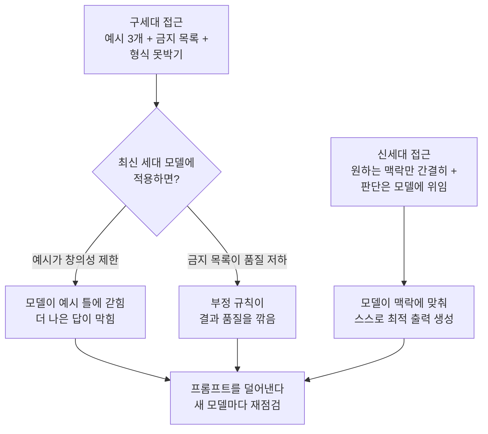

시스템 프롬프트를 직접 쓰고 관리하는 개발자라면, 프롬프트에 예시와 규칙을 더 넣을수록 결과가 좋아진다는 감각을 한 번쯤 가지셨을 겁니다. 그런데 Anthropic이 최근 공개한 방향은 그 감각을 정면으로 뒤집습니다. 결론부터 말씀드리면, 모델이 충분히 똑똑해지면 예시와 금지 규칙은 도움이 아니라 오히려 성능을 깎는 족쇄가 되고, 그래서 프롬프트를 늘리는 것이 아니라 덜어내는 것이 새로운 베스트 프랙티스입니다. Anthropic은 이 원칙을 자기 제품에 그대로 적용해 Claude Code의 시스템 프롬프트를 80% 넘게 줄였습니다. 이 글은 왜 그런 일이 벌어졌는지, 그리고 우리가 프롬프트를 어떻게 다시 써야 하는지 정리합니다.

## 왜 읽어야 하나

이 글은 시스템 프롬프트를 설계하고 유지하는 개발자, 그리고 에이전트 하네스를 운영하는 플랫폼 담당자를 대상으로 합니다. 핵심 결론은 이렇습니다. 최신 세대 모델을 상대할 때는 예시를 붙이고 "이것도 하지 말고 저것도 하지 마라" 목록을 늘리는 대신, 원하는 결과의 맥락만 간결하게 전달하고 나머지는 모델의 판단에 맡기는 편이 더 좋은 결과를 냅니다. 이 사실을 알면 새 모델이 나올 때마다 프롬프트를 물려받아 계속 덧대는 습관을 멈추고, 오히려 프롬프트를 잘라내는 작업을 정기 점검 항목으로 삼게 됩니다.

## 개요

지난 몇 년 동안 프롬프트 엔지니어링의 상식은 "구체적으로, 많이"였습니다. 원하는 출력의 예시를 두세 개 붙이고, 하지 말아야 할 것을 목록으로 나열하고, 형식을 못 박는 것이 안정적인 결과를 얻는 길이라고 여겨졌습니다. 실제로 이전 세대 모델에서는 이 방식이 잘 통했습니다. 모델이 스스로 채우지 못하는 빈틈을 사람이 예시와 규칙으로 메워 주는 셈이었기 때문입니다.

그런데 모델이 세대를 거듭하며 똑똑해지자 그 빈틈이 줄어들었습니다. Anthropic은 최신 세대 모델을 대상으로 Claude Code의 시스템 프롬프트를 80% 넘게 덜어냈고, 코딩 평가에서 측정 가능한 성능 저하가 없었다고 밝혔습니다. 예시와 규칙을 대거 걷어냈는데도 결과가 나빠지지 않았다는 것입니다. 오히려 어떤 경우에는 예시가 모델을 특정 틀에 가두어 더 나은 답을 막고 있었다는 진단이 뒤따랐습니다.

## 왜 예시가 족쇄가 되는가

Anthropic 쪽 설명의 핵심은 간단합니다. 모델이 똑똑해질수록 더 적은 지시, 더 적은 제약, 더 적은 예시를 필요로 한다는 것입니다. 예시를 붙이면 모델은 그 예시를 "이런 모양을 원하는구나"로 해석하고 그 모양에 자기를 맞춥니다. 문제는 최신 모델이 그 예시보다 더 창의적일 때 생깁니다. 예시가 오히려 모델의 더 나은 답을 끌어내리는 천장이 되는 것입니다.

금지 규칙도 비슷한 함정을 갖습니다. "이것 하지 마라, 저것 하지 마라"를 길게 나열하면 최신 모델에서는 결과 품질이 오히려 떨어질 수 있습니다. Anthropic은 이제 딱딱한 금지 규칙으로 모델을 막기보다, 맥락을 통해 원하는 방향으로 이끄는 방식을 택한다고 밝혔습니다. 규칙으로 벽을 세우는 대신, 무엇을 원하는지의 맥락을 주고 모델이 그 안에서 판단하게 하는 것입니다.

그래서 새 모델이 나오면 프롬프트를 늘릴 것이 아니라 오히려 잘라내라는 조언이 따라옵니다. 이전 모델을 위해 쌓아 둔 예시와 규칙 중 상당수는 새 모델에게는 불필요한 짐이거나, 심하면 성능을 깎는 족쇄일 수 있기 때문입니다.

## 그렇다고 모든 규칙을 버리라는 뜻은 아닙니다

여기서 중요한 균형을 짚고 넘어가야 합니다. 이 조언은 가장 강력한 최신 세대 모델을 상대할 때의 이야기입니다. 더 저렴한 모델 등급이나, 매 호출마다 출력 형식이 정확히 같아야 하는 배치 작업에서는 이야기가 다릅니다. 형식이 흔들리면 안 되는 스케줄 산출물, 예를 들어 매일 같은 모양으로 나와야 하는 리포트나 JSON 계약에서는 여전히 결정론적 골격이 필요합니다.

ThakiCloud 내부에서도 이 두 축을 분리해서 다룹니다. 콘텐츠의 창의성이 산출물인 작업에서는 강한 모델에게 맥락만 주고 자유도를 넓히지만, 숫자와 열거값과 렌더링 형식은 모델이 아니라 결정론적 코드가 소유하도록 강제합니다. 다시 말해, 예시를 걷어내라는 조언과 형식을 코드로 고정하라는 규율은 서로 충돌하지 않습니다. 전자는 판단과 창작의 영역이고, 후자는 형식과 집계의 영역입니다. 두 영역을 구분하지 않고 하나의 프롬프트에 뭉뚱그리면, 강한 모델에게는 예시가 족쇄가 되고 약한 모델에게는 형식이 흔들리는 최악의 조합이 나옵니다.

## ThakiCloud 제품 적용 시사점

이 논의는 저희 Paxis 관점에서 곧바로 실무로 이어집니다. Paxis는 ThakiCloud의 Agent-Native Cloud로, Skills와 Tools, Policies를 일급 리소스로 다루는 제어 평면입니다. 960개가 넘는 스킬을 BM25로 선택해 격리된 샌드박스에서 실행합니다. 여기서 각 스킬의 명세와 시스템 프롬프트가 바로 이 글이 말하는 컨텍스트 엔지니어링의 대상입니다.

이 글의 교훈을 Paxis 스킬 하네스에 옮기면 두 가지 실천이 나옵니다. 첫째, 강한 모델을 상대하는 스킬에서는 예시와 금지 목록을 최소화하고, 원하는 결과의 맥락과 경계만 간결하게 남깁니다. 얇은 하네스에 두꺼운 지식을 쌓되, 그 지식이 예시 나열이 아니라 실패에서 뽑아낸 판단 기준이 되도록 하는 것입니다. 둘째, 새 모델을 도입할 때 스킬 명세를 자동으로 물려받아 계속 덧대지 않고, 오히려 불필요해진 예시와 규칙을 덜어내는 점검을 함께 돌립니다. Anthropic이 새 모델마다 프롬프트를 트리밍하라고 조언한 것과 같은 맥락입니다.

인프라 관점의 ai-platform 렌즈에서도 이득이 있습니다. 시스템 프롬프트가 짧아지면 매 호출의 입력 토큰이 줄고, 이는 K8s 기반 멀티테넌트 서빙 환경에서 그대로 비용 절감으로 이어집니다. 프롬프트를 덜어내는 일은 품질과 비용을 동시에 개선하는 드문 작업입니다.

## 한계 및 반론

이 조언을 무비판적으로 받아들이면 위험합니다. 첫째, "예시를 빼라"는 강력한 최신 모델에 한정된 이야기이며, 능력이 낮은 모델이나 형식이 엄격해야 하는 작업에는 그대로 적용되지 않습니다. 둘째, 예시를 걷어낸 뒤 실제로 성능이 유지되는지는 반드시 평가로 확인해야 합니다. Anthropic이 코딩 평가에서 저하가 없었다고 밝힌 것도 측정을 거친 결과이지 직관만으로 내린 결정이 아닙니다. 프롬프트를 줄이면서 평가를 생략하면, 눈에 안 보이는 품질 저하를 놓칠 수 있습니다. 셋째, 이 방향은 특정 모델 계열의 특성에 기댄 조언이므로, 다른 벤더의 모델이나 오픈웨이트 모델에서도 같은 폭으로 통한다고 단정할 수 없습니다.

## 정리

컨텍스트 엔지니어링의 새 규칙을 한 문장으로 줄이면 이렇습니다. 최신 모델을 상대할 때는 프롬프트를 늘려 채우려 하지 말고, 덜어내서 모델의 판단에 맡기십시오. 예시와 금지 목록은 이전 세대에서는 안전장치였지만, 지금 세대에서는 더 나은 답을 막는 천장이 될 수 있습니다. 다만 이 조언은 강한 모델과 창작의 영역에 한정되며, 형식이 흔들리면 안 되는 작업에서는 여전히 결정론적 골격이 필요합니다. 다음에 새 모델을 도입하실 때, 프롬프트에 무엇을 더 넣을지 고민하기 전에 무엇을 뺄 수 있는지부터 점검해 보시길 권합니다. 그리고 뺀 뒤에는 반드시 평가로 확인하십시오. 그것이 이 변화를 안전하게 자기 것으로 만드는 방법입니다.

## 출처

- The new rules of context engineering for Claude 5 generation models, Anthropic (<https://claude.com/blog/the-new-rules-of-context-engineering-for-claude-5-generation-models>)
- A Fireside Chat with Cat and Thariq from the Claude Code team, Simon Willison (<https://simonwillison.net/2026/Jul/21/cat-and-thariq/>)
