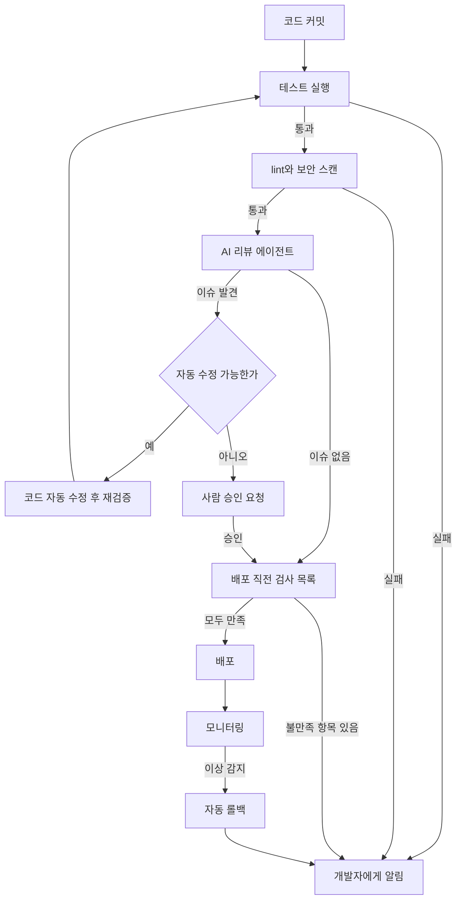

혼자 개발하면서 매일 배포까지 해야 한다면, 이 글이 그 시간을 줄이는 데 도움이 됩니다. 리뷰해 줄 동료가 없는 상황에서 테스트와 코드 리뷰와 배포 판정을 AI 에이전트에게 맡기려면 무엇을 어떤 순서로 설정해야 하는지, 실제 워크플로 설정과 함께 보여드립니다.

전통적인 CI/CD는 파이프라인이 자동으로 돌아가더라도 판정은 결국 사람이 합니다. 로그를 읽고, 빨간 불이 들어오면 원인을 찾고, 테스트가 통과하면 손으로 배포 버튼을 누릅니다. 이 판정 과정 자체를 AI 에이전트에게 넘기면, 하루 열두 번 배포해도 확인 시간이 늘어나지 않습니다.

혼자 만드는 파이프라인일수록 손으로 짠 판단 기준이 사람마다, 심지어 그날그날 기분에 따라 흔들리기 쉽습니다. 오늘은 테스트 실패를 무시하고 넘어갔다가 다음 주에는 같은 실패에서 반나절을 붙잡고 있는 식입니다. 이 글에서 다루는 순서는 그 흔들림을 줄이는 데 초점을 맞춥니다. 판정 기준을 코드보다 먼저 문서로 고정하고, 그 문서를 사람과 AI 에이전트가 함께 참조하게 하고, 배포 뒤에도 이상 신호를 스스로 잡아내는 조건을 걸어 두는 순서입니다. 아래 설정 파일들은 그대로 복사해서 시작하신 뒤 프로젝트 사정에 맞게 값만 바꾸시면 됩니다.

## 게이트부터 정의합니다

파이프라인을 짜기 전에 먼저 결정할 것이 있습니다. 어떤 조건을 만족해야 배포 후보가 되는지를 코드보다 먼저 문서로 확정하는 작업입니다. 이 조건을 게이트라고 부르며, 게이트가 없으면 AI 에이전트에게 검증을 맡겨도 무엇을 기준으로 통과와 실패를 가를지 정할 수 없습니다.

게이트를 세울 때는 사람이 읽어도 되고 도구가 파싱해도 되는 형태로 적어 둡니다. 아래는 실제로 쓸 수 있는 게이트 정의 예시입니다. 프로젝트 루트에 `.github/deploy-gate.yml` 같은 파일로 두고, 파이프라인과 AI 리뷰 에이전트가 같은 파일을 참조하게 합니다.

```yaml
# .github/deploy-gate.yml
gate:
  test_coverage_min: 70          # 퍼센트 단위, 이 값 미만이면 실패
  lint_errors_max: 0             # linter 오류 허용 개수
  security_high_vuln_max: 0      # 높음 우선순위 취약점 허용 개수
  build_must_pass: true
checklist:
  - id: db_migration_rollback
    label: "DB 마이그레이션이 있다면 롤백 스크립트가 존재하는지"
  - id: env_var_sync
    label: "새로 추가된 환경 변수가 배포 환경에 반영되었는지"
  - id: api_docs_match
    label: "API 문서가 실제 응답 스키마와 일치하는지"
  - id: dependency_scan
    label: "의존성이 바뀌었다면 취약점 스캔을 통과했는지"
```

이 파일의 값 자체가 정답은 아닙니다. 커버리지 70퍼센트나 취약점 0개는 예시 기준이므로 프로젝트 성격에 맞게 조정하시면 됩니다. 중요한 것은 숫자가 아니라, 게이트 조건이 파이프라인 코드와 분리된 하나의 파일에 있고 사람과 AI 에이전트가 같은 파일을 본다는 점입니다. 조건을 바꾸고 싶으면 이 파일만 고치면 되고, 파이프라인 스크립트를 뒤질 필요가 없습니다.

게이트를 나중에 붙이면 순서가 뒤집힙니다. 파이프라인부터 짜고 나서 무엇을 검증할지 고민하면, 이미 돌아가는 스크립트에 조건을 끼워 맞추느라 검증이 느슨해지기 쉽습니다. 먼저 통과 조건을 정하고 그 조건에 맞춰 각 단계를 채워 넣는 순서를 지키면, 뒤에 나올 워크플로 파일도 그저 이 게이트 파일을 읽고 실행하는 얇은 층으로 남습니다. checklist 항목도 마찬가지로, 처음에는 두세 개만 적어 두고 배포하다가 놓친 것이 생길 때마다 항목을 추가하는 방식이 현실적입니다. 처음부터 완벽한 목록을 만들려고 하면 시작이 늦어질 뿐입니다.

## 워크플로에 게이트를 붙입니다

GitHub Actions를 쓴다면 게이트 파일을 실제 워크플로에 연결하는 단계가 다음입니다. 아래 구성은 커밋이 푸시되면 테스트와 lint를 먼저 돌리고, 두 단계를 통과한 뒤에만 AI 리뷰 단계로 넘어가는 형태입니다. AI 리뷰 단계의 실제 호출부는 여러분이 쓰는 리뷰 도구에 맞춰 채워 넣으시면 됩니다.

```yaml
# .github/workflows/deploy.yml
name: ai-native-deploy

on:
  push:
    branches: [main]

jobs:
  verify:
    runs-on: ubuntu-latest
    steps:
      - uses: actions/checkout@v4

      - name: 테스트 실행
        run: |
          pip install -r requirements.txt
          pytest --cov=. --cov-report=xml --cov-fail-under=70

      - name: lint 실행
        run: |
          pip install ruff
          ruff check . --exit-non-zero-on-fix

      - name: 보안 스캔
        run: |
          pip install pip-audit
          pip-audit --strict

  ai-review:
    needs: verify
    runs-on: ubuntu-latest
    steps:
      - uses: actions/checkout@v4
      - name: 게이트 파일 기준 AI 리뷰 실행
        run: |
          echo "여기서 .github/deploy-gate.yml의 checklist 항목을 순회하며"
          echo "AI 리뷰 에이전트를 호출하고 결과를 job summary에 남깁니다"

  deploy:
    needs: ai-review
    runs-on: ubuntu-latest
    steps:
      - uses: actions/checkout@v4
      - name: 배포
        run: echo "여기서 실제 배포 스크립트를 실행합니다"
```

`verify` 잡이 실패하면 `ai-review`도 `deploy`도 실행되지 않습니다. `needs` 키워드로 잡 사이에 순서와 의존성을 걸어 두면, 테스트가 깨진 코드가 AI 리뷰까지 도달하는 낭비를 막을 수 있습니다. 비용이 싼 검사를 앞에 두고 비용이 비싼 검사를 뒤에 두는 순서 자체가 설계입니다. 테스트와 lint는 몇 초면 끝나지만 AI 리뷰 호출은 시간도 걸리고 비용도 듭니다.

이 순서를 한 단계 더 세밀하게 나눌 수도 있습니다. `verify` 잡 안에서도 결정론적인 도구, 즉 테스트 러너와 linter와 보안 스캐너의 결과만으로 통과와 실패를 가르고, 코드 복잡도나 커버리지 같은 수치 지표가 특정 임계치를 넘었을 때만 별도의 판정 에이전트를 호출하는 식입니다. 이렇게 두 단계로 나눠 두면 대부분의 커밋은 결정론적 검사만 거치고 끝나고, 정말 애매한 경우에만 더 비싼 판정 단계로 넘어갑니다. 매 커밋마다 무거운 판정을 전부 돌리는 것보다 이쪽이 시간과 비용 모두에서 유리합니다.

또한 `ai-review` 잡의 로그를 남길 때는 단순히 통과와 실패만 적지 말고, 무엇을 검토했고 어떤 근거로 그렇게 판단했는지까지 job summary나 PR 코멘트에 함께 남겨 두시길 권합니다. 나중에 파이프라인이 왜 특정 커밋을 통과시켰는지, 혹은 왜 막았는지를 되짚어야 할 때 이 기록이 유일한 단서가 됩니다. 기록이 없으면 같은 문제가 반복돼도 원인을 다시 처음부터 찾아야 합니다.

전체 흐름을 그림으로 보면 아래와 같습니다.



왼쪽에서 시작해 오른쪽 아래로 갈수록 검증 비용이 늘어납니다. 테스트에서 걸러지면 몇 초를 잃지만, 배포까지 갔다가 롤백되면 사용자에게도 영향이 갑니다. 검증 순서를 이렇게 배치하는 이유가 여기에 있습니다.

## AI 리뷰 에이전트에게 프로젝트 맥락을 줍니다

AI 리뷰 도구를 그냥 붙이기만 하면 "이 함수가 너무 깁니다" 수준의 일반론만 돌아옵니다. 프로젝트에 특화된 피드백을 받으려면 도메인 용어와 민감한 함수 목록, 프로젝트 고유의 규칙을 리뷰 에이전트에게 미리 알려주는 설정 파일이 필요합니다.

```yaml
# .github/ai-review-context.yml
domain_terms:
  ps: "payment_status. 결제 상태를 뜻하며 값은 pending / paid / refunded 중 하나입니다"
  ttl: "token time-to-live. 초 단위 만료 시간입니다"

sensitive_functions:
  - path: "src/payments/*.py"
    reason: "결제 처리 코드는 변경 시 보안 리뷰를 반드시 거칩니다"
  - path: "src/auth/*.py"
    reason: "인증 로직 변경은 세션 무효화 여부를 함께 확인합니다"

custom_rules:
  - id: api-error-shape
    description: "API 에러 응답은 반드시 error.code와 error.message 두 필드를 포함합니다"
  - id: no-print-in-handler
    description: "요청 핸들러에서 print 대신 정의된 로거를 사용합니다"
```

이 파일이 있으면 AI 리뷰 에이전트가 변수명 `ps`를 봤을 때 그것이 `payment_status`의 줄임말이라는 것을 알고 리뷰합니다. `src/payments/` 아래 파일이 바뀌면 자동으로 더 꼼꼼한 검토 경로를 타게 할 수도 있습니다. 이 세 항목, 즉 도메인 용어와 민감한 함수 목록과 커스텀 규칙만 채워도 리뷰 품질이 눈에 띄게 달라집니다.

리뷰 결과를 코드에 자동으로 반영할지도 미리 정해 두어야 합니다. 판단 기준은 단순합니다. 포맷팅처럼 규칙만 따르면 되는 문제는 자동으로 고치고, 보안이나 비즈니스 로직처럼 의도를 파악해야 하는 문제는 사람이 승인하게 합니다. 위 워크플로 예시에서 `E`(자동 수정 가능한가) 분기가 이 기준을 그대로 반영한 것입니다.

이 기준을 처음 세울 때는 자동 수정 목록을 아주 짧게 시작하시길 권합니다. 예를 들어 포맷팅 규칙 위반 하나만 자동 수정 대상으로 두고, 인터페이스 변경에 따른 테스트 스텁 갱신처럼 조금 더 복잡한 항목은 나중에 신뢰가 쌓인 뒤에 옮기는 식입니다. 반대로 결제나 인증처럼 `sensitive_functions`에 등록된 경로는 아무리 사소해 보이는 변경이라도 자동 반영 대상에서 제외해 두는 편이 안전합니다. 범위를 넓히는 것은 언제든 할 수 있지만, 잘못 자동 반영된 변경을 되돌리는 비용은 그보다 훨씬 큽니다.

## 배포 후 이상을 잡아내는 롤백 조건

배포가 끝났다고 검증이 끝나는 것은 아닙니다. 1인 개발자는 배포 직후에 모니터링 화면을 계속 지켜볼 여유가 없으므로, 롤백 조건을 코드로 정의해 두고 조건이 맞으면 사람 없이도 되돌아가게 만드는 편이 안전합니다.

```yaml
# .github/rollback-triggers.yml
triggers:
  - id: error-rate-spike
    condition: "http_5xx_rate > baseline_5xx_rate * 3"
    window_minutes: 5
  - id: latency-spike
    condition: "p95_latency_ms > baseline_p95_latency_ms * 5"
    window_minutes: 5
  - id: payment-failure-spike
    condition: "payment_failure_rate > baseline_payment_failure_rate * 2"
    window_minutes: 10
on_trigger:
  action: rollback_to_previous_deploy
  notify:
    - channel: slack
      target: "#deploy-alerts"
    - channel: email
```

기준값을 절대치가 아니라 평소 대비 배수로 잡은 이유가 있습니다. 트래픽이 원래 적은 새벽 시간대와 트래픽이 몰리는 시간대의 정상 범위가 다르기 때문에, 고정된 숫자보다 평소 대비 배수가 오탐을 줄입니다. 롤백이 실행되면 그것으로 끝내지 말고 알림 채널에 무엇이 문제였는지, 언제 롤백되었는지, 롤백 후 상태가 어떤지를 함께 보내야 다음 조치를 빠르게 잡을 수 있습니다.

롤백 후에는 원인을 고치고 그 수정을 테스트에 반영하는 순서를 지킵니다. 롤백 조건에 걸렸던 상황을 재현하는 테스트 케이스를 하나 추가해 두면, 같은 원인으로 다시 배포가 굴러떨어지는 일을 막을 수 있습니다.

기준값을 처음 잡을 때는 지난 배포 몇 번의 평균값을 `baseline`으로 넣어 두고, 운영하면서 오탐이 잦으면 배수를 조금씩 올리는 방식이 무난합니다. 처음부터 완벽한 배수를 찾으려 하면 시간만 걸립니다. 그리고 롤백이 한 번 실행될 때마다 `id`와 트리거 시각과 이전 배포 버전을 별도 기록으로 남겨 두시길 권합니다. 몇 달 뒤 같은 트리거가 반복해서 걸린다면, 그것은 코드 문제가 아니라 트리거 기준 자체가 그 엔드포인트 특성과 맞지 않는다는 신호일 수 있습니다.

## 도구는 이미 충분합니다

이 구성을 위해 새로운 도구를 여러 개 사들일 필요는 없습니다. 아래는 1인 개발자 예산에 맞는 조합입니다.

| 목적 | 도구 | 비용 |
|---|---|---|
| 코드 저장소 | GitHub | 무료 |
| CI/CD 파이프라인 | GitHub Actions | 무료(시간 제약 있음) |
| 테스트 자동화 | pytest, unittest | 무료 |
| 보안 스캐닝 | pip-audit, Dependabot | 무료 |
| 배포 | Vercel, Railway | 무료 구간 있음 |

핵심은 도구를 더 사는 것이 아니라, 위에서 다룬 세 개의 설정 파일, 즉 배포 게이트와 리뷰 맥락과 롤백 조건을 저장소에 실제로 만들어 두는 일입니다. 도구만 도입하고 이 파일들이 없으면 AI 에이전트는 무엇을 기준으로 판단해야 할지 모른 채 일반적인 답만 내놓습니다. 처음부터 전부 자동화하려 하지 마시고, 게이트 파일 하나를 먼저 만들어 테스트와 lint 단계에 연결하는 것부터 시작하시길 권합니다. 그 하나가 자리 잡으면 리뷰 맥락 파일과 롤백 조건 파일을 순서대로 얹으시면 됩니다.

순서를 이렇게 잡는 이유는 실패했을 때 되돌리기 쉬운 것부터 시작하기 위해서입니다. 게이트 파일 하나만 있어도 테스트와 lint를 통과한 것만 배포된다는 최소한의 안전망은 확보됩니다. 여기에 리뷰 맥락 파일을 더하면 AI가 프로젝트 고유의 규칙을 알아보기 시작하고, 마지막으로 롤백 조건까지 걸어 두면 배포 이후까지 자동으로 관리되는 상태가 됩니다. 세 파일을 한꺼번에 만들려고 하다 실패하는 것보다, 하나씩 붙이면서 각 단계가 실제로 잘 작동하는지 며칠 지켜보는 편이 결국 더 빠르게 안정된 파이프라인에 도달합니다. 저장소 하나에서 이 구성이 안정되면, 다른 프로젝트에는 세 파일을 그대로 복사하고 값만 바꿔서 재사용할 수 있습니다.

## ThakiCloud 관점에서

저희는 고객사 온프렘 환경에 K8s 기반 AI 플랫폼을 서빙하면서, 위와 같은 게이트와 검사 목록이 애플리케이션 코드 안이 아니라 플랫폼 쪽 표준으로 자리 잡아야 여러 팀에 걸쳐 일관되게 지켜진다는 것을 확인해 왔습니다. 팀마다 각자의 저장소에 게이트 파일을 따로 정의하면 프로젝트 수만큼 기준이 갈라지고, 어느 저장소는 커버리지 기준이 있고 어느 저장소는 없는 상태가 됩니다. 배포 게이트와 롤백 트리거를 조직 공통 템플릿으로 두고 각 저장소가 값만 오버라이드하게 하는 구성이 실제로 운영에 더 잘 맞았습니다. 1인 개발자 한 명이 여러 프로젝트를 동시에 굴릴 때도 같은 원칙이 그대로 적용됩니다.

이 글은 저희가 정리한 전자책 『1인 개발자를 위한 AI 네이티브 CI/CD』의 내용을 실습 가능한 형태로 다시 쓴 것입니다.

## 챕터 삽화


