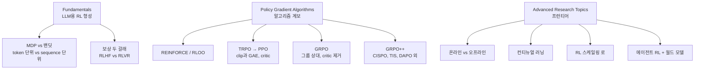

## 왜 읽어야 하나

LLM 포스트트레닝(강화학습 단계)을 돌리거나 돌릴 예정인 ML 엔지니어, 그리고 "왜 reasoning 모델은 RLVR로, alignment 모델은 RLHF로 학습하나"를 알고 싶은 데이터 과학자라면 이 가이드를 읽어야 합니다. 결은 먼저입니다. LLM 강화학습의 알고리즘 계보(REINFORCE → PPO → GRPO → GRPO++ 변종)와 프런티어 주제(온·오프라인, 스케일링 로, 컨티뉴얼 러닝, 에이전트 RL)를 first principles부터 한 자료로 훑을 수 있는 현재 가장 체계적인 입문이 Cameron Wolfe의 이 글입니다. 논문 원본을 개별적으로 읽는 대신 지도부터 잡고 필요한 섹션만 깊게 파고들기 위한 것입니다.

## 개요

Cameron R. Wolfe(Ph.D., Netflix Research)의 Substack Deep (Learning) Focus에서 2026년 8월 24일 공개된 "Reinforcement Learning for LLMs: The Complete Guide"는 서브제목 그대로, "LLM 연구에서 RL의 발전을 first principles부터 현대 연구의 프런티어까지 추적하는" 단일 standalone 자료입니다. 외부 리소스와 저자 자신의 과거 글을 종합한 통합본이면서 각 섹션마다 깊이를 원할 때 갈 수 있는 deep dive 링크를 제공합니다.

가이드가 전제하는 RL의 위치는 분명합니다. 초기 instruction following 모델 생성, alignment와 안전성, 복잡한 reasoning 문제 해결까지, LLM 역사에서 RL이 decisive 역할을 해왔고 지금 가장 뜨거운 문제들(reasoning, knowledge work, agents, token 효율, reliability)도 모두 RL로 다루어지고 있다는 것입니다. 이 글의 주제는 "RL이 왜 LLM에서 중요한가"가 아니라 "중요해진 그 RL을, 어떤 알고리즘을, 어떤 설계 결정과 함께 사용하는가"를 한 지도에 올리는 것입니다.

## 가이드의 구조

전체는 세 큰 축으로 나뉩니다.

### Fundamentals: 형성부터 보상의 두 갈래까지

LLM은 토큰별 확률과 전체 completion 확률을 모두 계산할 수 있으므로, RL은 MDP로든 밴딧으로든 형성할 수 있습니다. 둘 다 실무에서 쓰입니다. REINFORCE나 RLOO는 보통 밴딧 형성이고 PPO는 MDP 형성입니다. 이 구분이 중요한 이유는 보상과 크레딧 할당(credit assignment)의 단위가 달라지기 때문입니다. MDP는 token 단위로 상태·행동·보상을 다루고 밴딧은 completion 단위로 결과를 다룹니다.

보상이 어디서 나오느냐는 두 갈래로 나뉩니다. RLHF(Reinforcement Learning from Human Feedback)는 prompt와 chosen·rejected completion 쌍으로 된 선호 데이터에서 reward model을 훈련하고 그 모델의 점수로 RL을 돌립니다. RLVR(Reinforcement Learning with Verifiable Rewards)는 규칙 기반 또는 결정적 검증기(정답 여부, 테스트 통과 등)의 신호를 그대로 보상으로 씁니다. reasoning 모델의 post-training이 RLVR 쪽으로 이동한 것은, 검증 가능한 보상이 선호 모델보다 편이 적고 스케일하기 쉽다는 판단에서입니다.

### Policy Gradient: REINFORCE에서 GRPO까지

알고리즘 계보는 "정책 기울기를 어떻게 안정적으로 추정하나"의 연대기입니다.

- **REINFORCE / RLOO**: 가장 단순한 정책 기울기. RLOO는 같은 prompt의 다른 샘플 평균을 baseline으로 삼아 분산을 줄입니다.
- **TRPO → PPO**: 큰 업데이트가 성능을 깨는 것을 막기 위해 신뢰 영역(KL 제약)을 두고 TRPO의 제약 문제를 PPO가 clip으로 단순화했습니다. LLM PPO 구현은 보통 GAE(Generalized Advantage Estimation)로 advantage를 추정하는데, TD residual을 γ·λ 가중으로 누적하는 구조입니다. critic(가치 모델)이 토큰별 value를 예측하고 그것이 advantage와 critic 훈련용 return을 만듭니다.
- **GRPO**: 같은 prompt에서 그룹으로 여러 completion을 샘플링하고 그룹 내 보상의 상대적 위치(평균·표준화)로 advantage를 만들어 critic 자체를 제거한 설계입니다. 가치 모델을 한 개 덜 돌리는 것만으로도 훈련 파이프라인의 비용과 복잡성이 크게 줄어, LLM RL의 기본값이 되었습니다.
- **GRPO++ (변종)**: 계보 위층의 미세 조정입니다. CISPO는 PPO·GRPO와 같은 importance ratio를 쓰되, ratio가 허용 범위를 벗어났을 때 그 기여를 없애는 clipping 대신 ratio를 clip해서 stop-gradient 중요도 가중으로 씁니다. 토큰 기여의 크기를 조절하는 방식이라는 차이가 있습니다. TIS는 ratio의 용도가 다릅니다. 훈련 엔진과 추론 엔진의 시스템적 불일치를 보정하는 데 씁니다. DAPO는 로스 집계와 overlong 처리를 고칩니다. 원본 GRPO의 "sequence별 평균 → batch 평균" 집계는 긴 sequence의 토큰이 그래디언트에 상대적으로 덜 기여하는 미세한 편향을 만들는데, DAPO는 batch 전체 토큰의 단순 평균으로 교정합니다. maxlen 초과 completion에는 하드 페널티 대신 점진적으로 커지는 soft 길이 페널티와, 신뢰할 수 없는 reward 신호를 가진 cut-off 샘플의 PG 로스 배제를 둡니다.

### Advanced: 프런티어 네 주제

온라인 vs 오프라인은 "얼마나 자주 새 데이터를 샘플링하느냐"의 문제인데, 완전한 이분법이 아닙니다. on-policy 데이터는 consistently 성능에 긍정적인 효과를 보였고 특히 초기 정책에서 높은 보상을 받을 response가 희소한 어려운 설정에서는 능동적인 탐색이 필요합니다. 다만 온라인의 이점은 주기적으로 on-policy 샘플로 훈련 데이터를 갱신하는 semi-online으로 상당 부분 회복될 수 있고 비동기 RL 인프라에서는 부분적으로 off-policy인 rollout(정책 업데이트가 몇 번 지나간 뒤 끝나는 오래된 rollout)을 다루는 문제가 남습니다. 공통 결론은 "fresh한 on-policy 데이터가 좋은 결과의 필수 재료"라는 것입니다.

컨티뉴얼 러닝은 on-policy RL의 또 다른 강점입니다. on-policy 업데이트는 현재 모델의 plausible behavior 근처에 머물기 때문에 초기 모델 대비 분포 이동(KL로 측정)이 작고 이것이 forgetting 감소와 강하게 상관합니다. SFT는 새 태스크는 잘 배우되 기존 태스크를 서서히 잃는 반면, 순차 RL은 replay buffer나 정규화 없이도 multi-task 훈련에 거의 도달합니다. Nemotron-Cascade가 바로 이런 순차 RL 파이프라인의 실례입니다.

RL 스케일링 로는 pretraining보다 "messy"합니다. pretraining이 held-out cross-entropy로 매끈하게 스케일하면, RL은 downstream reward·accuracy처럼 앱마다 다른 지표를 쓰다 보니 보편 로가 어렵습니다. 다만 RL 성능도 compute와 예측 가능하게 스케일한다는 점은 확인됐고 초기 훈련 단계로 큰 스케일 성능을 외삽해 레시피를 빨리 걸러낼 수 있으며 step 수 외에도 batch size·데이터 재사용·rollout 계산량(프롬프트당 샘플 수)이 성능 레버로 확인됩니다.

에이전트 RL과 월드 모델은 이 지도의 가장 끝단입니다. reasoning에서 knowledge work·에이전트·token 효율·reliability로 이어지는 현재 연구의 축을, 저자가 각기 deep dive로 연결해 줍니다.

## ThakiCloud 제품 적용 시사점

**Maxis 렌즈.** Maxis의 RL 파인튜닝 파이프라인 문서가 "어느 알고리즘을 왜 쓰나"를 설명해야 한다면, 이 가이드의 정책 기울기 섹션이 그 골격입니다. GRPO의 critic 제거가 실제로 파이프라인 비용을 얼마나 줄이는지, DAPO의 로스 집계 교정이 어떤 편향을 제거하는지, CISPO와 TIS가 같은 importance ratio를 어떻게 다른 용도로 쓰는지까지, 비교의 기준점을 한 곳에서 가져올 수 있습니다. 특히 "훈련 엔진 vs 추론 엔진 불일치(TIS)" 주제는 서빙 엔진과 훈련 엔진이 다른 MLOps 환경에서 실제 마주치는 문제입니다.

**Paxis 렌즈.** 에이전트 RL + 컨티뉴얼 러닝 단편은 Paxis 자가진화 루프의 설계 참고자료로 쓰입니다. on-policy 데이터가 forgetting을 억제한다는 발견은, 스킬·정책을 순차적으로 추가하는 에이전트 시스템에서 "새 능력을 배우며 기존 능력을 유지"하는 문제와 정면으로 겹칩니다.

**주의점.** 이 글은 primary research가 아니라 통합 가이드입니다. 각 섹션의 deep dive 링크(PPO for LLMs, GRPO++ tricks, RL scaling laws, online RL)와 거기서 인용되는 원본 논문이 사실의 정본입니다. 구현 레벨 코드(GAE 스니펫 등)가 일부 포함되지만, 파이프라인을 직접 짤 때의 레퍼런스로 쓰려면 trl·verl 같은 프레임워크 문서와 함께 봐야 합니다.

## 한계 및 반론

첫째, 통합본의 깊이 한계입니다. Sutton & Barto나 The RLHF Book 같은 전용 교재에 비해 수학적 유도보다 개념·구조 이해에 초점이 맞춰져 있습니다. 알고리즘을 유도부터 다시 짚어야 하는 독자에게는 보완 자료가 필요합니다.

둘째, 이동하는 분야에 대한 스냅샷입니다. GRPO++ 변종(CISPO, TIS, DAPO 등)은 발표 시점 기준으로 정리되어 있고 가이드 공개일(2026-08-24) 이후의 새 변종은 포함되지 않습니다. 프런티어 주제는 "지금 지도"로 쓰고 세부 수치는 원본을 대조해야 합니다.

셋째, Substack 형식의 제약입니다. 본문은 무료 공개이나 저자의 다른 deep dive 일부는 유료 구독과 연결되어 있고 이미지 기반 서술이 많아 텍스트만 원한다는 독자에게는 원본 링크를 따라가는 노력이 필요합니다.

## 정리

LLM 강화학습을 "논문 단편"으로만 익혀온 사람에게, 이 가이드는알고리즘 계보와 설계 결정이 한 장의 지도 위에 놓인 상태입니다. 기억할 뼈대는 네 개입니다. RL은 MDP·밴딧 둘 다로 형성되고 보상은 RLHF·RLVR 두 갈래입니다. 알고리즘 계보는 REINFORCE → PPO → GRPO로 이어지고 GRPO는 그룹 상대 보상으로 critic을 제거한 것이 핵심입니다. 그 위층의 변종(CISPO·TIS·DAPO)은 ratio와 로스 집계의 용도를 세분화합니다.

다음 행동은 단순합니다. 지금 돌리거나 준비 중인 RL 설정(알고리즘, 보상 유형, 온·오프라인, critic 유무)을 이 지도 위에 하나씩 올려봅니다. 어디에 앉아 있는지 확인하는 것 자체가, "왜 GRPO인가" "TIS가 필요하냐" 같은 판단을 내릴 수 있는 출발점입니다.

---

*출처: [Cameron R. Wolfe, "Reinforcement Learning for LLMs: The Complete Guide"](https://cameronrwolfe.substack.com/p/llm-rl), Deep (Learning) Focus, 2026-08-24. 저자 사이트 [cameronrwolfe.me](https://cameronrwolfe.me/). 본 가이드의 서술은 원문(Substack)에서 직접 확인한 내용을 바탕으로 했습니다.*

## 관련 슬라이드

본문 내용을 NotebookLM(`cinematic_infographic` 스타일)으로 요약한 슬라이드입니다.

