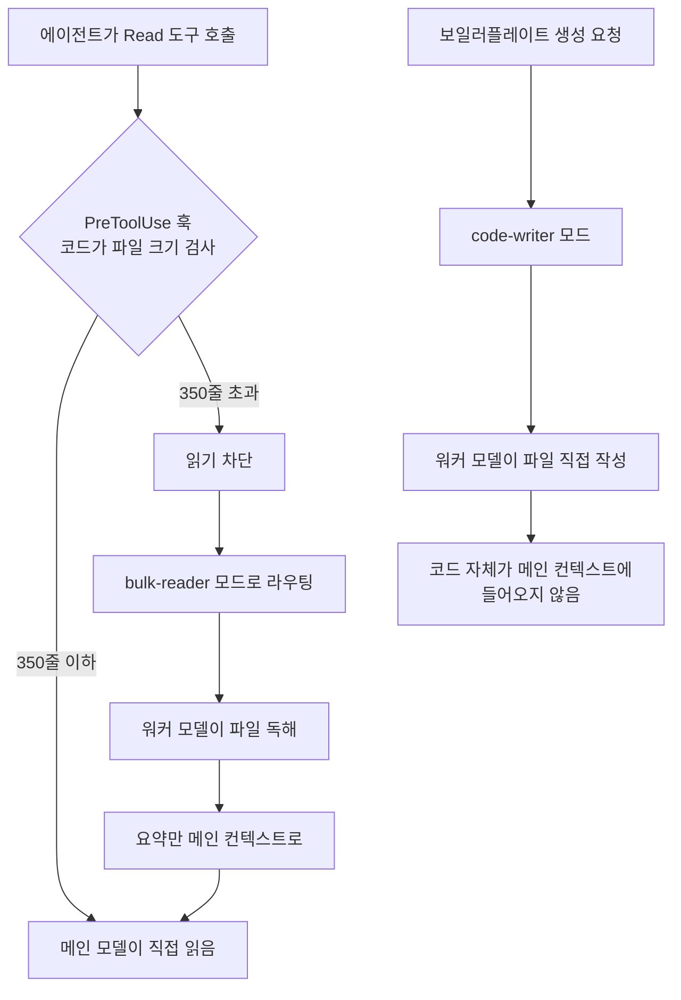

*같은 읽기 요청도 파일 크기에 따라 갈림길이 다릅니다. 그 판정을 모델이 아니라 코드가 하는 것, 그것이 shunt의 핵심입니다.*

## 왜 읽어야 하나

Claude Code나 비슷한 AI 코딩 에이전트를 매일 쓰고 토큰 비용이 눈에 보이기 시작하신 분을 위한 글입니다. 핵심 결론을 먼저 말합니다. Spotify가 공개한 shunt의 훅 기반 라우팅 패턴은 그대로 따라 할 가치가 있습니다. 다만 그 기사에 있는 "90% 절감"은 그들 환경의 숫자일 뿐입니다. 같은 패턴을 우리 자신의 세션 1,099개 트랜스크립트로 재보니 기본 threshold(350줄)에서는 Read 바이트의 14%만 오프로드됐고 read 분포 중앙값은 158줄이었습니다. 숫자보다 중요한 것은 라우팅 판정을 모델이 아니라 결정론 코드가 한다는 점입니다.

## 개요

2026년 9월 7일, 스페인 개발자 midudev의 X 트윗 하나가 화제였습니다. "Spotify가 Claude Code의 토큰을 90% 깎았다. 어떻게? 내부의 지능형 라우터로"라는 것이었습니다. 원출처는 [Spotify 엔지니어링 블로그의 Portal 후기](https://engineering.atspotify.com/2026/9/portal-by-spotify-cut-my-claude-code-token-usage-by-90)이고 본체는 [spotify/portal-ai-plugins 저장소](https://github.com/spotify/portal-ai-plugins)의 shunt 플러그인입니다.

shunt는 Claude Code 전용 플러그인으로, Claude Code의 PreToolUse 훅을 써서 파일 읽기 요청이 도착했을 때 파일 크기를 검사합니다. 기본값 350줄을 넘으면 그 읽기를 차단하고 Portal의 싼 워커 모델이 도는 AiKA 모드(agents that run on ephemeral runtimes)로 보냅니다. bulk-reader 모드가 대신 파일을 읽고 요약만 메인 컨텍스트로 돌려보내는 식입니다. 또 다른 모드 code-writer는 보일러플레이트 코드를 워커 모델이 직접 파일에 쓰게 해서, 그 코드가 아예 메인 모델 컨텍스트에 들어오지 않게 합니다.

블로그에 따르면 Java 모노레포 테스트에서 bulk-read 시나리오의 토큰 평균 90% 절감입니다. dev.to의 [분석 글](https://dev.to/jamilxt/spotify-cut-claude-code-token-usage-by-90-percent-the-pattern-works-in-any-ai-agent-2i4b)이 지적한 대로 워커 모델도 토큰을 쓰기 "공짜"는 아닙니다. frontier 모델이 I/O 업무에 소모되던 몫이 싼 모델로 이동한 것입니다.

Portal 배경을 정리하면, Portal은 Spotify가 개발자 플랫폼으로 운영 중인 서비스이고 그 뿌리는 오픈소스 개발자 포털 프레임워크 Backstage입니다. shunt는 Portal의 AiKA 모드를 실행체로 삼기 때문에, AiKA 모드는 임시 런타임 위에 도는 선언형 에이전트로 생각하면 됩니다. 개발자가 모델·지시·도구를 지정하고 인프라 운영은 Portal이 맡는 구조입니다.

## 이 기술/도구는 무엇인가

shunt의 구조를 한 장으로 그리면 아래처럼 됩니다.



여기서 주목할 부분은 "지능형"이라는 수식어가 붙는 지점입니다. 라우팅 판정(크기 검사, 모드로 넘김)은 모델이 하지 않습니다. PreToolUse 훅은 셸 스크립트 레벨의 결정론 코드이고 모델이 참여하는 것은 파일 내용을 읽고 요약하는 bulk-reader 단계뿐입니다. 비용이 비싼 모델의 몫은 "판단"이고 싼 모델의 몫은 "I/O"입니다. 그 경계를 코드 한 줄로 긋는 것이 전부입니다.

메커니즘을 한 박자 늦춰 보면, Claude Code의 PreToolUse 훅은 도구 호출이 실행되기 전에 입력을 JSON으로 전달받고 allow/deny 판정을 돌려 보낼 수 있는 지점입니다. shunt는 이 지점에 파일 크기 검사를 두고 임계 초과 읽기를 deny한 뒤 에이전트에게 "대신 bulk-reader 모드를 써라"는 지시를 남깁니다. 모델의 의사가 개입하는 순간이 없습니다. 에이전트가 지시를 따라 워커 모드를 호출하고 워커가 파일을 읽은 뒤 요약만 원 컨텍스트로 돌아오는 구조입니다.

전제 조건이 있습니다. shunt는 Portal 인스턴스 인증이 필요하고(플러그인이 Portal CLI를 호출하기 때문), 현재 Claude Code 전용입니다. 즉 Spotify Portal를 쓰는 팀에게만 처음부터 끝까지 통하는 도구입니다. 하지만 패턴 자체는 Portal 없이도 재현 가능하고 그것이 이번 실험의 출발점입니다.

## 설치 및 통합

### shunt 설치 (Portal 사용자)

원문 문서 기준으로, Claude Code에 Portal AI 플러그인 마켓플레이스를 추가하고 portal과 shunt 두 플러그인을 설치한 뒤 Portal CLI로 인증하면 됩니다.

### 우리 재현: 패턴을 우리의 트랜스크립트로 검증

shunt의 실질은 "350줄을 넘는 Read 결과를 싼 모델로 돌리면 얼마를 아끼나"입니다. 이 질문은 설치하지 않고도 답할 수 있습니다. Claude Code는 모든 세션을 `~/.claude/projects/` 아래 JSONL 트랜스크립트로 남기는데, 이 안에 Read tool_use와 그 tool_result, 그리고 요청별 usage(input_tokens, cache_read_input_tokens)가 그대로 들어 있습니다.

14일치 트랜스크립트에서 Read 결과를 짝지어 줄 수와 바이트를 세고 shunt의 threshold sweep를 돌려 본 스크립트입니다.

```python
# shunt_sim.py (전문은 outputs/blog-impl/spotify-shunt-token-routing/)
# 핵심: Read tool_use id -> tool_result 짝짓기, (줄수, 문자수) 수집
pending_read = set()
for rec in transcript:
    if rec.type == "assistant":
        for b in rec.message.content:
            if b.type == "tool_use" and b.name == "Read":
                pending_read.add(b.id)
        usage = rec.message.usage   # input_tokens, cache_read_input_tokens
    elif rec.type == "user":
        for b in rec.message.content:
            if b.type == "tool_result" and b.tool_use_id in pending_read:
                text = result_text(b.content)
                pairs.append((text.count("\n") + 1, len(text)))

# threshold sweep: T줄 초과 결과의 바이트 점유율
for T in (100, 350, 1000):
    off = sum(ch for ln, ch in pairs if ln > T)
    print(f"T={T}: {100*off/total_chars:.1f}% of Read chars offloadable")
```

실행은 샌드박스 워크트리에서 했고 로그는 `run-2.log`에 보존돼 있습니다.

## 실제 실험 결과

우리의 최근 14일치 세션(트랜스크립트 1,099개)에서 나온 숫자입니다.

| 지표 | 값 |
|---|---|
| usage 있는 요청 수 | 39,681 |
| input_tokens 합 (요청당 누적) | 7,725,096,590 |
| cache_read 합 | 3,652,655,545 |
| Read tool_use | 1,446회 |
| Agent/Task tool_use | 102회 |
| 짝지은 Read 결과 | 1,383개 |
| Read 결과 줄 수 p50 / p90 / max | 158 / 180 / 1,018 |

Read 결과의 크기 분포를 shunt의 350줄 기준으로 끊으면 이렇게 됩니다.

| 줄 수 구간 | 개수 | 문자수(추정 토큰의 1/3.5) |
|---|---|---|
| 0-100 | 549 | 1,464,181 |
| 101-350 | 774 | 6,693,269 |
| 351-1000 | 59 | 1,275,486 |
| 1000 초과 | 1 | 49,255 |

그림으로 보면 더 선명합니다.


*(a) 14일치 Read 결과의 줄 수 분포. 바이트의 70.6%가 101-350줄 구간입니다. (b) shunt threshold를 100/350/1000줄로 sweep한 오프로드 가능 비중.*

여기에 하나 더. 같은 기간 Agent/Task 도구 호출은 102회, 직접 Read는 1,446회였습니다. 우리의 하네스는 이미 탐색·파일읽기 작업을 서브에이전트로 밀어내는 세션 경계 라우팅을 하고 있고, shunt가 채우려는 도구 경계 라우팅과는 다른 축입니다. 두 축이 겹치는 부분이 있으니, "90%"를 그대로 이식하기보다 각 축이 담당하는 read 크기를 먼저 구분하는 것이 순서입니다.

핵심 숫자 세 개를 꼽겠습니다.

첫째, **threshold 350줄에서는 Read 바이트의 14.0%만 오프로드**됩니다. shunt의 기본값이 Spotify의 Java 모노레포에는 맞았을 수 있지만, 우리의 읽기 습관에는 맞지 않습니다. 우리의 read 바이트의 70.6%는 101-350줄 구간, 즉 기본 threshold 한 걸음 아래에 몰려 있습니다.

둘째, **threshold 100줄로 내리면 84.6%로 뛴다**는 사실입니다. sweep 결과 T=100에서 84.6%, T=350에서 14.0%, T=1000에서 0.5%였습니다. 이 패턴의 효과는 threshold 하나만으로 짐작할 수 없고 read 분포를 재봐야 아는 것입니다.

셋째, **Read 자체가 총 입력 트래픽의 0.02%라는 것**입니다. 추정 Read 토큰(약 270만)을 요청별 input_tokens와 cache_read 합(약 113억)으로 나누면 0.02%입니다. 우리의 토큰 비용을 지배하는 것은 매 요청마다 다시 전송되는 상주 컨텍스트, 즉 cache_read 축입니다. shunt가 토큰을 "90%" 깎든 "14%" 깎든, 그 90%나 14%는 Read 바이트 내부의 비율입니다. 전체 장부 안의 위치를 모르면 절감률을 과대평가합니다.

## ThakiCloud 제품 적용 시사점

이 패턴은 Paxis가 매일 하고 있는 일의 축소판입니다.

Paxis에서는 에이전트 워크플로의 라우팅을 모델 재량이 아닌 결정론 코드가 소유하도록 설계합니다. 960+ 스킬에 대한 BM25 선택, 권한 스코프, 병렬 실행 조율 전부 코드 소유입니다. shunt의 "훅이 크기 검사해서 모드로 보낸다"는 구조와 같은 원칙입니다. 모델은 내용을 만들고 경계는 코드가 긋습니다.

ai-platform 관점에서도 친숙합니다. 우리 함대는 이미 "비싼 모델은 판단, 싼 모델은 노동" 라우팅을 세 층에서 하고 있습니다.

| 층 | 우리 구현 | shunt 대응 |
|---|---|---|
| 세션 경계 | subagent-model-routing (읽기/탐색=haiku, 구현=sonnet) | bulk-reader로 위임 |
| 스케줄 경계 | skill_model_policy (sonnet 시작, 연속 실패 시 opus 승격) | code-writer로 위임 |
| 엔진 경계 | 사내 Qwen 게이트웨이 (무인 러너 31개) | 워커 모델 그 자체 |
| 도구 경계 | (미배선) | **PreToolUse 훅 = shunt** |

shunt가 채우는 것은 넷째 줄, 도구 경계입니다. Agent 도구로 위임하면 워커가 자기 컨텍스트를 갖기 때문에(우리 실측: 워커 상주 컨텍스트 ~200k) 매 위임이 고정비를 냅니다. 반면 훅 라우팅은 별도 세션을 뜨지 않고 API 호출 하나만으로 넘기므로, 고정비가 낮은 대신 위임 대상이 "읽기/요약" 정도로만 제한됩니다. 두 방식은 경쟁 관계가 아닙니다. read 크기에 따른 비용-수익 곡선 위에서 서로 다른 지점에 서 있는 것입니다.

Portal 없이 이 패턴을 쓰려면 최소 구현은 단순합니다. PreToolUse 훅에서 Read 대상 파일의 줄 수를 세고 임계 초과 시 차단 후 싼 모델 API 한 번으로 요약을 돌려 tool_result로 주입하는 것입니다. 100줄 내외의 스크립트입니다. 다만 위의 교훈을 기억하면 임계값은 350에서 시작하지 말고 **자신의 read 분포를 먼저 재고** 시작해야 합니다.

## 한계 및 반론

첫째, 90%는 시나리오 숫자입니다. Spotify 블로그의 90%는 bulk-read 시나리오의 평균 절감이고 dev.to 분석 글도 워커 모델의 소모를 빼면 순절감이 줄어든다고 말합니다. 전체 세션 비용의 90%가 줄어든다는 뜻은 아닙니다.

둘째, 훅은 모든 Read에 왕복을 하나 씁니다. 파일 크기를 세기 위한 스텝이 매 읽기마다 붙으니, read가 짧고 빈번한 워크로드에서는 이 고정비가 오프로드 이득을 갉을 수 있습니다. 우리의 p50=158줄 분포에서 T=100 sweep이 84.6%를 보여준 것은 read 바이트 기준이며 훅 왕복 비용은 그 계산에 들어 있지 않습니다.

셋째, shunt는 Portal 인증을 전제로 합니다. Portal이 없는 팀은 플러그인 자체가 돌지 않습니다. 패턴만 가져와야 하는 상황입니다. "설치하고 끝"의 도구가 아닙니다. "패턴과 전제 조건"으로 읽어야 합니다.

넷째, 우리의 측정에는 근사가 있습니다. 문자수를 토큰으로 환산하는 계수(1/3.5)는 추정이고 tool_result의 줄 수는 cat -n 포맷 기준이라 실제 파일 줄 수와 미세하게 다릅니다. 방향과 비율은 신뢰할 수 있지만 절대값은 아닙니다.

다섯째, 싼 모델로 읽기를 돌리면 그 읽기에서 필요한 이해 품질도 함께 내려갑니다. 350줄을 넘는 파일의 맥락 중 5줄이 핵심이면, 워커의 요약이 그 5줄을 놓치는 순간 메인 모델은 못 본 채 판단합니다. threshold는 비용 절감 라인이 아니라 품질 경계선이기도 합니다.

## 정리

Spotify의 shunt가 보여준 것은 "90%"가 아니라, 토큰 라우팅의 판정을 모델 밖의 코드로 빼는 방법입니다. 같은 패턴을 우리의 14일치 트랜스크립트로 재보니 기본 threshold 350줄에서는 Read 바이트의 14%만 오프로드되고 read 분포 중앙값은 158줄이었습니다. threshold 100줄로 내리면 84.6%가 되지만, Read 전체가 총 입력 트래픽의 0.02%라는 사실은 변하지 않습니다.

다음 행동은 두 가지입니다. 첫째, shunt를 쓰든 훅을 직접 쓰든 threshold는 자기 워크로드의 read 분포를 재고 정하세요. 350은 Spotify의 답입니다. 당신의 답은 아닙니다. 둘째, 총장부의 지배항은 컨텍스트 재전송(cache_read) 축입니다. Read 절감 전에 그 축부터 보세요. shunt의 패턴이 우리에게 준 가장 큰 교훈은 숫자를 모방하기 전에 그 숫자가 전체의 몇 %였는지를 확인하게 된 것입니다.

---

**출처**

- midudev X 트윗 (2026-09-07): <https://x.com/hjguyhan/status/2097084562996449507>
- Spotify Engineering: Portal by Spotify cut my Claude Code token usage by 90% (2026-09): <https://engineering.atspotify.com/2026/9/portal-by-spotify-cut-my-claude-code-token-usage-by-90>
- GitHub: spotify/portal-ai-plugins (shunt): <https://github.com/spotify/portal-ai-plugins>
- dev.to: Spotify cut Claude Code token usage by 90%: the pattern works in any AI agent: <https://dev.to/jamilxt/spotify-cut-claude-code-token-usage-by-90-percent-the-pattern-works-in-any-ai-agent-2i4b>
