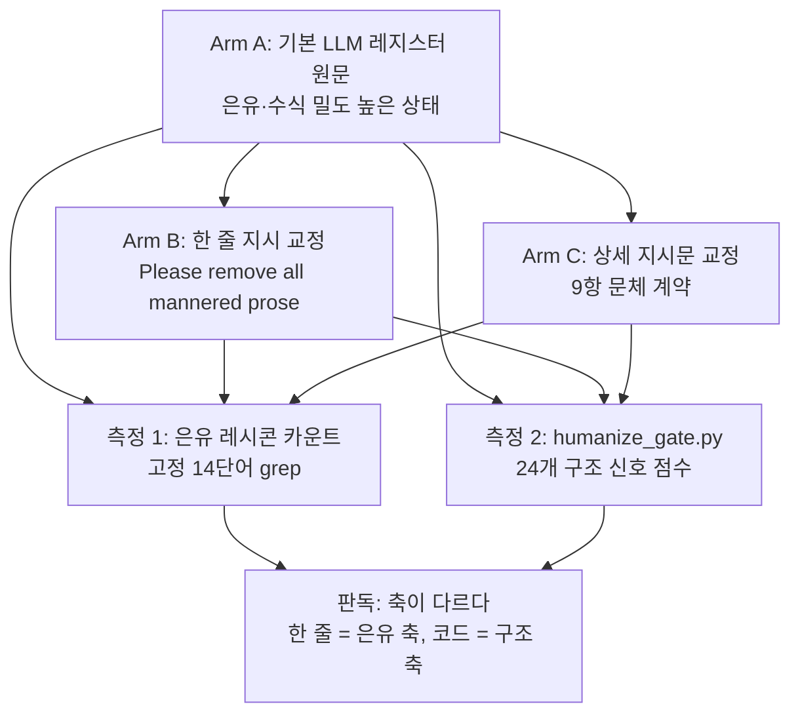

## 왜 읽어야 하나

LLM으로 블로그·백서·보고서를 뽑는 팀이라면, "AI 티" 제거에 얼마를 쓰는지부터 정할 차례입니다. 이 글은 비용이 한 줄인지, 상세 지시문인지, 코드 게이트인지 실험 숫자로 갈라 놓은 것입니다.

핵심 결론을 먼저 단정합니다. Anthropic이 Fable 5.1 프롬팅 가이드에 올린 "Please remove all mannered prose" 한 줄 지시는 은유와 수식의 축, 즉 mannered prose 본래를 정확히 제거합니다. 다만 쉼표 리듬·명사화 같은 구조 티까지 한 줄이 다지는 것은 아닙니다. 3라운드 교정 실험 실측으로, 한 줄이 은유 28건을 0으로 만들고 구조 티 신호는 15건에서 5건으로 줄었습니다. 축이 다르다는 뜻이고 그래서, 한 줄과 결정론 코드의 분업이 이 글의 결론입니다.


*글의 핵심 개념을 형상화한 이미지입니다.*

## 개요

LLM 산출물의 품질 논의에서 "AI 티" 제거는 대부분 프롬프트 문장으로 처리됩니다. 자연스럽게 써 주세요, AI답지 않게 써 주세요 같은 부탁입니다. 문장 부탁이 실제로 무엇까지 제거하는지는 체감으로만 쌓여 온 부분이 많습니다. 이번 실험의 출발점은 두 가지입니다. 하나는 Anthropic이 한 줄 지시를 공식 문서에 올렸다는 사실이고 다른 하나는 우리 파이프라인이 이미 코드 게이트로 구조 티를 재고 있다는 사실입니다. 둘의 경계를 재면 질문이 바뀝니다. "한 줄이면 되는가"에서 "한 줄로 무엇을 대신할 수 있는가"로.

mannered prose가 무엇인지부터 짚습니다. Anthropic의 가이드와 이후의 서드파티 분석이 주는 정의는 같습니다. 직설 서술 대신 은유와 수식을 쓰는 문체로, 문장이 아이디어를 전달하기보다 저자를 보여 주려 할 때 생깁니다. "혁신의 파도", "돌려볼 가치가 있는 다이얼", "미래로 나아가는 첫 걸음" 같은 표현이 대표입니다. 이런 표현은 한두 개는 살아있는 문장이지만, 논설과 리포트에 겹겹이 쌓이면 부정확해지고 독자의 노력을 키웁니다.

## 이 기술은 무엇인가

Anthropic은 platform.claude.com의 Fable 5.1 프롬팅 가이드에서 "writing density"를 모델 특성으로 다루며, 문체 제어 수칙으로 "Please remove all mannered prose" 한 줄을 권고합니다. 트윗이 든 예시는 "변화할 가치가 있는 매개변수"를 "돌려볼 다이얼"로 쓰지 말라는 식입니다. 같은 기법이 paddo.dev의 "a dial worth turning", willfrancis.com의 "How to stop Claude writing like an AI" 등 여러 독립 분석으로 확산됐고 제목들이 바로 문서의 예시 문장입니다.

한 줄 지시의 사용법은 세 갈래입니다. 첫째, 요청 단위 사용자 메시지. 이번 답안만 고치고 싶은 상황에 맞습니다. 둘째, 시스템 프롬프트 상시 배선. 해당 세션의 모든 산출물에 적용됩니다. 셋째, 글쓰기 전용 프로젝트 폴더의 CLAUDE.md. 트윗의 실전 팁이 이것인데, 한 번 박으면 그 폴더에서 열리는 모든 세션이 그 문체를 기본값으로 갑니다.

```markdown
<!-- 글쓰기 전용 프로젝트의 CLAUDE.md -->
## 문체 계약
- 모든 산출물은 "Please remove all mannered prose" 지시를 적용합니다.
- 은유·수식 대신 직설 서술을 사용합니다.
- 3단 나열과 대구는 각 한 번만 남깁니다.
```

세 갈래의 차이는 적용 범주일 뿐입니다. 지시 문장 자체는 어디서나 동일해 사용법이 단순합니다. 문서가 한 줄을 권고하는 이유이기도 합니다.

## 설치 및 통합

우리는 이 지시를 기존 파이프라인의 한 계층으로 배선했습니다. 우리 문서 생성 라인의 구조는 이미 2층 방어입니다. 모델 쪽에 humanizer 지시(상세 문체 계약)를 넣고, 출력을 결정론 코드인 `humanize_gate.py`가 재는 구조입니다. 게이트는 im-not-ai 엔진의 한국어 AI 티 70패턴 taxonomy를 우리 코퍼스 임계값으로 보정해, 쉼표 리듬·명사화·대명사 밀도 같은 구조 신호 24개를 점수로 냅니다.

이번 실험은 이 2층 구조 사이에 "한 줄"이 들어가면 무엇을 바꾸는지 재는 것입니다. 실험 설계는 3라운드, 3arm입니다.

- R1~R3은 GPU 서빙 비용 효율, 추론 엔진 선택, 멀티테넌트 GPU 격리라는 세 주제입니다. 세 주제 모두 우리 플랫폼 문서가 실제로 다루는 내용이라, 실험 텍스트가 곧 제품 문서의 재료가 됩니다.
- Arm A는 각 주제의 기본 LLM 레지스터 원문입니다. 은유와 수식 밀도를 전형적인 AI 문체로 제어 생성한 상태이고, "AI 티가 있는 글"의 기준선입니다.
- Arm B는 Arm A를 한 줄 지시("Please remove all mannered prose")만으로 교정한 것입니다. 다른 지시를 주지 않았습니다.
- Arm C는 Arm A를 9항의 상세 지시문(은유 제거, 수사적 질문 금지, 3단 나열 1회, 대구 1회, throat-clearing 문두 삭제, 모호한 강조부사 삭제, 합니다체 종결, 대시 금지, 사실·순서 유지)으로 교정한 것입니다. 우리 humanizer가 쓰는 스타일의 지시문입니다.

측정 축은 두 개입니다. 하나는 은유 레시콘 카운트입니다. D-14(생성형 은유) 가족 사전에서 청사진·주춧돌·문턱·조수·다이얼·발판·지평·파도·조류·기틀·토대·등대·수문장·닻 14단어를 고정 집합으로 놓고 grep으로 셉니다. 이 축은 코드 게이트의 24신호에 들어 있지 않아, 한 줄 지시가 겨냥하는 "mannered prose 본래"에 가장 가까운 측정입니다. 다른 하나는 `humanize_gate.py score`의 JSON 출력으로, 겨냥된 구조 신호(target) 수와 위험 밴드를 셉니다.



*3라운드 실험의 파이프라인입니다. 같은 원문이 한 줄과 상세 지시로 갈라지고 두 측정 축에서 다시 합쳐집니다.*

## 실제 실험 결과

숫자를 전부 냅니다. 실험 로그는 `outputs/blog-impl/mannered-prose-one-liner/run-1.log`에 있으며, 아래 표는 실험 로그에서 가져온 값입니다.

| 라운드 | Arm | 글자 수 | 은유 레시콘 | 게이트 target (C-11 제외) | 위험 밴드 |
|---|---|---|---|---|---|
| R1 GPU 서빙 비용 | A | 686 | 11 | 5 | low |
| R1 | B (한 줄) | 504 | 0 | 1 | low |
| R1 | C (상세) | 445 | 0 | 1 | low |
| R2 추론 엔진 선택 | A | 513 | 7 | 7 | medium |
| R2 | B | 315 | 0 | 2 | low |
| R2 | C | 285 | 0 | 1 | low |
| R3 멀티테넌트 격리 | A | 508 | 10 | 3 | low |
| R3 | B | 381 | 0 | 2 | low |
| R3 | C | 355 | 0 | 2 | low |
| 합계 | A | - | 28 | 15 | - |
| 합계 | B | - | 0 | 5 | - |
| 합계 | C | - | 0 | 4 | - |

은유 축부터 보면 결론이 선명합니다. Arm A의 28건이 Arm B와 Arm C에서 0으로 사라졌고 세 라운드 전부 같은 모양을 냅니다. 한 줄 지시는 은유와 수식이라는 본래 축에서 상세 지시와 같은 결과를 냅니다. 지시 한 줄이 "은유를 걷고 직설로 환원하라"는 9항의 핵심을 다 수행한 셈입니다.

구조 축은 모양이 다릅니다. 기본 레지스터의 15건이 Arm B에서 5건, Arm C에서 4건으로 줄었습니다. 양쪽 지시 모두 구조 티를 함께 줄였고 수식을 걷는 과정에서 문장 자체가 단순해지기 때문입니다. 한 줄은 은유를 빼되 문장의 쉼표 리듬은 그대로 두고 상세 지시가 리듬까지 다진 것입니다. R1에서 Arm B의 쉼표 비율 신호(C-11) excess가 3.20인 데 비해 Arm C는 0.34였습니다. R2·R3에서는 C-11 값이 arm마다 3.20으로 같아, 이 차이는 R1에만 의미를 가집니다.

여기서 측정 캐비엇을 한 가지 짚습니다. C-11은 연결어미 경위 대비 쉼표의 비율로, 분모가 작은 300~700자 샘플에서는 이산 값으로 포화합니다. 이번 실험에서는 9개 텍스트 중 5개가 동일한 값(12.1933)에 앉았고 그래서, 표에서는 C-11을 target 합계에서 제외했습니다. 짧은 샘플의 C-11 차이는 arm 간 비교로 읽지 마십시오.

실험의 성격도 정직하게 남깁니다. 세 arm 모두 같은 모델(Claude Opus 5)이 제어 조건대로 생성·교정했습니다. 이 실험이 잰 것은 모델의 지시 순응이며, 크로스모델 비교가 아닙니다. Arm A는 전형적인 AI 레지스터로 제어 재현한 기준선입니다. 은유 카운트는 D-14 정본(가족 판정, 관통 은유 규칙)의 부분집합이라 하한 추정입니다. 각 arm은 라운드당 n=1이라, 통계 평균은 기대하지 마십시오.

## ThakiCloud 제품 적용 시사점

이 실험은 우리 문서 생성 파이프라인의 계층 설계에 바로 붙습니다. Paxis는 ThakiCloud의 Agent-Native Cloud로, 보고서·블로그·백서 같은 문서 산출 스킬이 그 위에 돕니다. 해당 스킬들이 쓰는 문체 계약은 지금까지 "상세 지시 + 코드 게이트" 2층이었습니다. 이번 실험이 밝힌 것은, 2층 사이에 한 줄 지시를 넣는 것이 은유 축의 빈자리를 채운다는 점입니다. 코드 게이트의 24개 구조 신호에는 생성형 은유(D-14)가 없고, 이 축은 상류 엔진에서도 질적 규칙으로 운영돼 왔습니다. 한 줄 지시는 이 맹점을 프롬프트 비용 한 줄로 덮습니다.

그래서 우리 라인의 권장 조합은 이렇게 바뀝니다. 상시에 한 줄 지시(mannered prose 축)를 넣고, 산출 스킬의 상세 지시(구조 축)를 유지하며 `humanize_gate.py`로 출력을 재는 것입니다. 셋의 역할이 달라서 겹치지 않습니다. 한 줄은 은유를 걷고, 상세 지시는 리듬을 다지며, 코드는 남은 것을 재서 "AI 티가 줄었다"는 자기보고를 숫자로 바꿉니다.

ai-platform 쪽에서는 서빙 관점이 붙습니다. 한 줄 교정은 원문을 다시 쓰는 단일 LLM 요청이라, 백서나 블로그 한 편당 리라이트 호출 한 번입니다. 우리 인퍼런스 서빙 환경에서 이 정도 요청은 초 단위이고, 결과 검증을 결정론 코드가 하므로 GPU 시간을 거의 쓰지 않습니다. 문체 품질을 "모델을 바꾸는 것"이 아니라 "지시 한 줄 + 코드 게이트"로 잡으면, 서빙 비용을 건드리지 않는 개선입니다.

## 한계 및 반론

가장 강한 반론부터 놓습니다. "한 줄이 이 정도면 상세 지시가 불필요하지 않으냐"는 질문입니다. 이번 숫자로는 반박이 어렵지 않습니다. 은유 축에서 한 줄은 상세와 동일하고 구조 축의 5건 대 4건도 같은 크기입니다. 단, R1의 C-11(3.20 대 0.34)은 상세 지시 쪽이 확실히 다졌다는 증거입니다. 쉼표 리듬이 중요한 긴 산문에서는 이 차이가 커질 수 있고, 그래서 우리는 한 줄로 상세 지시를 폐기하지 않습니다.

두 번째 반론은 "기존 humanizer 스킬이 하는 것과 무엇이 다르냐"입니다. 방향은 동일합니다. 차이는 두 가집니다. 첫째, Anthropic의 한 줄이 이제 벤더 공식 문서에 등재된 수칙이라는 점입니다. 우리가 만든 지시가 아니라 모델 제공자가 권고하는 문체 계약이 됐고 다른 모델로 넘어갈 때의 호환 근거가 됩니다. 둘째, 이번 실험이 한 줄의 커버리지를 축별로 측정한 점입니다. 한 줄이 무엇을 지우고 무엇을 남기는지가 숫자로 남으면, "AI 티를 줄였습니다"라는 자기보고 대신 게이트 판정을 쓸 근거가 됩니다.

실험 자체의 한계도 반복합니다. 같은 모델 순응 측정, 짧은 샘플, n=1, 레시콘 하한. 이 실험이 밝힌 것은 한 줄 지시의 축별 커버리지이지, "한 줄이면 충분하다"는 증명이 아닙니다. 충분한지는, 각 팀의 산출물에서 게이트가 남는 구조 신호를 얼마나 재느냐에 따라 다릅니다.

## 정리

LLM 글을 뽑는 팀이라면 오늘 한 가지만 하면 됩니다. "Please remove all mannered prose"를 상시 지시에 넣으면 됩니다. 비용은 프롬프트 한 줄입니다. 은유와 수식의 축은 그 한 줄에 28건에서 0으로 사라진다는 것을 우리는 재 봤습니다. 한 가지를 더 하려면, 남은 것을 코드로 재라는 것입니다. 쉼표 리듬 같은 구조 티는 게이트의 몫입니다. 게이트가 자기보고를 숫자로 바꿔 줍니다. 한 줄이 지우고, 코드가 남는 것을 재는 것이 이번 실험의 전부입니다.

## 출처

- Anthropic, "Prompting Claude Fable 5.1" 가이드: https://platform.claude.com/docs/en/build-with-claude/prompt-engineering/prompting-claude-fable-5-1
- 원본 트윗 (RT @yulmu_coffee, via @hjguyhan): https://x.com/hjguyhan/status/2097807825657618937
- 서드파티 분석: https://paddo.dev/blog/a-dial-worth-turning/ · https://willfrancis.com/how-to-stop-claude-writing-like-an-ai/ · https://academy.dair.ai/resources/write-better-with-claude-fable-5-1
- 실험 원장(내부): `outputs/blog-impl/mannered-prose-one-liner/run-1.log`
