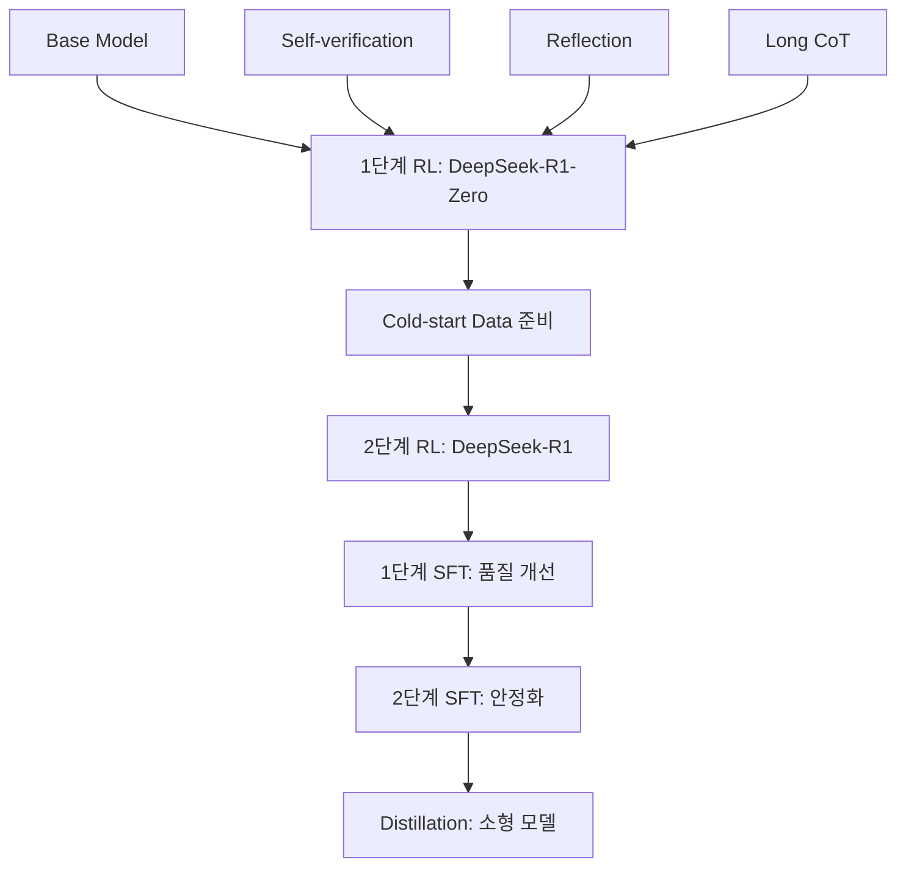

> **TL;DR** DeepSeek-R1의 **2단계 RL + 2단계 SFT + Distillation** 파이프라인을 완전 재현하는 실전 가이드다. 공식 저장소의 스크립트와 설정을 바탕으로 **단계별 구현 방법**을 상세히 설명한다. **MIT 라이선스**로 상업적 활용이 가능하다.

---

## DeepSeek-R1 학습 파이프라인 개요

[DeepSeek-R1](https://github.com/deepseek-ai/DeepSeek-R1)은 **대규모 강화학습**을 통해 뛰어난 추론 능력을 획득한 모델이다. 공식 저장소에서 제공하는 학습 파이프라인은 다음과 같은 5단계로 구성된다:

### 전체 파이프라인 구조



### 핵심 성과 지표

| 단계 | 모델 | 주요 개선사항 | 성능 지표 |
|------|------|-------------|---------|
| **Base** | DeepSeek-V3-Base | 기본 언어 모델 | - |
| **1단계 RL** | DeepSeek-R1-Zero | 추론 능력 획득 | MMLU: 85.2 |
| **2단계 RL** | DeepSeek-R1 | 품질 개선 | MMLU: 89.7 |
| **SFT** | DeepSeek-R1-SFT | 안정성 향상 | GSM8K: 97.3 |
| **Distillation** | Qwen-32B-Distill | 효율성 확보 | 성능 95% 유지 |

## 1단계: 환경 설정 및 준비

### 필수 라이브러리 설치

```bash
# DeepSeek-R1 저장소 클론
git clone https://github.com/deepseek-ai/DeepSeek-R1.git
cd DeepSeek-R1

# 가상환경 생성
conda create -n deepseek-r1 python=3.10
conda activate deepseek-r1

# 필수 패키지 설치
pip install torch==2.1.0 torchvision torchaudio --index-url https://download.pytorch.org/whl/cu118
pip install transformers==4.36.0
pip install datasets==2.14.0
pip install accelerate==0.24.0
pip install deepspeed==0.12.0
pip install wandb
pip install flash-attn --no-build-isolation
```

### 하드웨어 요구사항

| 단계 | 최소 GPU | 권장 GPU | 메모리 | 학습 시간 |
|------|---------|---------|--------|---------|
| **1단계 RL** | 8x A100 80GB | 16x A100 80GB | 640GB+ | 7-14일 |
| **2단계 RL** | 8x A100 80GB | 16x A100 80GB | 640GB+ | 3-7일 |
| **SFT** | 4x A100 80GB | 8x A100 80GB | 320GB+ | 1-3일 |
| **Distillation** | 2x A100 80GB | 4x A100 80GB | 160GB+ | 12-24시간 |

## 2단계: 1단계 RL - DeepSeek-R1-Zero 학습

### 데이터 준비

```python
# scripts/prepare_rl_data.py
import json
from datasets import Dataset, load_dataset

def prepare_rl_stage1_data():
    """1단계 RL을 위한 수학/추론 문제 데이터 준비"""
    
    # 수학 문제 데이터셋 로드
    math_data = load_dataset("hendrycks/competition_math")
    gsm8k_data = load_dataset("gsm8k", "main")
    
    # 추론 문제 데이터셋
    reasoning_data = []
    
    # 데이터 포맷 통일
    formatted_data = []
    
    for sample in math_data['train']:
        formatted_data.append({
            "problem": sample['problem'],
            "solution": sample['solution'],
            "level": sample['level'],
            "type": sample['type']
        })
    
    for sample in gsm8k_data['train']:
        formatted_data.append({
            "problem": sample['question'],
            "solution": sample['answer'],
            "level": "elementary",
            "type": "arithmetic"
        })
    
    # JSONL 형태로 저장
    with open('./data/rl_stage1_data.jsonl', 'w') as f:
        for item in formatted_data:
            f.write(json.dumps(item, ensure_ascii=False) + '\n')
    
    return len(formatted_data)

# 데이터 준비 실행
data_count = prepare_rl_stage1_data()
print(f"1단계 RL 데이터 준비 완료: {data_count:,}개 샘플")
```

### RL 환경 설정

```python
# configs/rl_stage1_config.py
from dataclasses import dataclass
from typing import Optional

@dataclass
class RLStage1Config:
    """1단계 RL 설정"""
    
    # 모델 설정
    model_name: str = "deepseek-ai/deepseek-v3-base"
    max_length: int = 32768
    
    # RL 하이퍼파라미터
    learning_rate: float = 1e-6
    batch_size: int = 64
    mini_batch_size: int = 8
    ppo_epochs: int = 4
    clip_range: float = 0.2
    value_clip_range: float = 0.2
    
    # 보상 모델 설정
    reward_model_name: str = "deepseek-ai/deepseek-math-reward"
    reward_batch_size: int = 16
    
    # 학습 설정
    total_episodes: int = 100000
    save_steps: int = 1000
    eval_steps: int = 500
    logging_steps: int = 10
    
    # 탐색 설정
    temperature: float = 0.7
    top_p: float = 0.9
    max_new_tokens: int = 2048
    
    # 정규화
    kl_penalty: float = 0.1
    entropy_bonus: float = 0.01
```

### 1단계 RL 학습 스크립트

```python
# scripts/train_rl_stage1.py
import torch
import torch.nn.functional as F
from transformers import AutoTokenizer, AutoModelForCausalLM
from trl import PPOTrainer, PPOConfig, AutoModelForCausalLMWithValueHead
from datasets import load_dataset
import wandb

class RLStage1Trainer:
    def __init__(self, config):
        self.config = config
        self.setup_models()
        self.setup_data()
        
    def setup_models(self):
        """모델 초기화"""
        # 정책 모델 (학습 대상)
        self.tokenizer = AutoTokenizer.from_pretrained(self.config.model_name)
        self.tokenizer.pad_token = self.tokenizer.eos_token
        
        self.model = AutoModelForCausalLMWithValueHead.from_pretrained(
            self.config.model_name,
            torch_dtype=torch.bfloat16,
            device_map="auto"
        )
        
        # 참조 모델 (KL 정규화용)
        self.ref_model = AutoModelForCausalLM.from_pretrained(
            self.config.model_name,
            torch_dtype=torch.bfloat16,
            device_map="auto"
        )
        
        # 보상 모델
        self.reward_model = AutoModelForCausalLM.from_pretrained(
            self.config.reward_model_name,
            torch_dtype=torch.bfloat16,
            device_map="auto"
        )
        
    def setup_data(self):
        """데이터 로더 설정"""
        dataset = load_dataset('json', data_files='./data/rl_stage1_data.jsonl')
        self.train_dataset = dataset['train']
        
    def compute_reward(self, problems, responses):
        """보상 계산"""
        rewards = []
        
        for problem, response in zip(problems, responses):
            # 수학적 정확성 검증
            math_score = self.verify_mathematical_correctness(problem, response)
            
            # 추론 과정 품질 평가
            reasoning_score = self.evaluate_reasoning_quality(response)
            
            # 최종 보상 계산
            reward = 0.7 * math_score + 0.3 * reasoning_score
            rewards.append(reward)
            
        return torch.tensor(rewards, dtype=torch.float32)
    
    def verify_mathematical_correctness(self, problem, response):
        """수학적 정확성 검증"""
        # 답안 추출
        answer = self.extract_answer(response)
        
        # 정답과 비교
        correct_answer = self.get_correct_answer(problem)
        
        if self.is_equivalent(answer, correct_answer):
            return 1.0
        else:
            # 부분 점수 계산
            return self.calculate_partial_score(answer, correct_answer)
    
    def evaluate_reasoning_quality(self, response):
        """추론 과정 품질 평가"""
        # CoT 패턴 검출
        has_thinking = "<thinking>" in response and "</thinking>" in response
        
        # 단계별 추론 확인
        reasoning_steps = self.count_reasoning_steps(response)
        
        # 논리적 일관성 검사
        consistency_score = self.check_logical_consistency(response)
        
        quality_score = 0.0
        if has_thinking:
            quality_score += 0.3
        
        quality_score += min(reasoning_steps / 5.0, 0.4)  # 최대 5단계
        quality_score += consistency_score * 0.3
        
        return quality_score
    
    def train_episode(self, batch):
        """단일 에피소드 학습"""
        problems = batch['problem']
        
        # 응답 생성
        inputs = self.tokenizer(problems, return_tensors="pt", padding=True, truncation=True)
        
        with torch.no_grad():
            outputs = self.model.generate(
                **inputs,
                max_new_tokens=self.config.max_new_tokens,
                temperature=self.config.temperature,
                top_p=self.config.top_p,
                do_sample=True,
                pad_token_id=self.tokenizer.eos_token_id
            )
        
        responses = self.tokenizer.batch_decode(outputs, skip_special_tokens=True)
        
        # 보상 계산
        rewards = self.compute_reward(problems, responses)
        
        # PPO 업데이트
        stats = self.ppo_trainer.step(
            queries=inputs['input_ids'],
            responses=outputs,
            scores=rewards
        )
        
        return stats
    
    def train(self):
        """전체 학습 루프"""
        wandb.init(project="deepseek-r1-stage1", config=self.config)
        
        # PPO 트레이너 설정
        ppo_config = PPOConfig(
            learning_rate=self.config.learning_rate,
            batch_size=self.config.batch_size,
            mini_batch_size=self.config.mini_batch_size,
            ppo_epochs=self.config.ppo_epochs,
            cliprange=self.config.clip_range,
            vf_coef=0.5,
            ent_coef=self.config.entropy_bonus,
        )
        
        self.ppo_trainer = PPOTrainer(
            config=ppo_config,
            model=self.model,
            ref_model=self.ref_model,
            tokenizer=self.tokenizer,
            dataset=self.train_dataset
        )
        
        for episode in range(self.config.total_episodes):
            # 배치 샘플링
            batch = self.train_dataset.select(range(episode * self.config.batch_size, 
                                                  (episode + 1) * self.config.batch_size))
            
            # 학습 실행
            stats = self.train_episode(batch)
            
            # 로깅
            if episode % self.config.logging_steps == 0:
                wandb.log({
                    "episode": episode,
                    "reward_mean": stats['ppo/returns/mean'],
                    "reward_std": stats['ppo/returns/std'],
                    "kl_divergence": stats['objective/kl'],
                    "policy_loss": stats['ppo/loss/policy'],
                    "value_loss": stats['ppo/loss/value']
                })
            
            # 모델 저장
            if episode % self.config.save_steps == 0:
                self.model.save_pretrained(f"./checkpoints/rl_stage1_episode_{episode}")
                self.tokenizer.save_pretrained(f"./checkpoints/rl_stage1_episode_{episode}")

# 학습 실행
if __name__ == "__main__":
    from configs.rl_stage1_config import RLStage1Config
    
    config = RLStage1Config()
    trainer = RLStage1Trainer(config)
    trainer.train()
```

### 1단계 RL 실행

```bash
# 분산 학습 실행
torchrun --nproc_per_node=8 --master_port=29500 scripts/train_rl_stage1.py \
    --config configs/rl_stage1_config.py \
    --output_dir ./checkpoints/rl_stage1 \
    --logging_dir ./logs/rl_stage1
```

## 3단계: 2단계 RL - DeepSeek-R1 학습

### Cold-start 데이터 준비

```python
# scripts/prepare_coldstart_data.py
import json
from datasets import Dataset

def prepare_coldstart_data():
    """Cold-start 데이터 준비 - 고품질 추론 예제"""
    
    coldstart_samples = [
        {
            "instruction": "다음 수학 문제를 단계별로 해결하세요.",
            "input": "한 변의 길이가 5인 정사각형의 대각선 길이를 구하세요.",
            "output": """<thinking>
정사각형의 대각선 길이를 구하는 문제입니다.
정사각형의 한 변의 길이가 5라고 했으므로, 피타고라스 정리를 사용할 수 있습니다.

정사각형을 두 개의 직각삼각형으로 나누면:
- 두 변의 길이가 각각 5
- 대각선이 빗변

피타고라스 정리: a² + b² = c²
5² + 5² = c²
25 + 25 = c²
50 = c²
c = √50 = √(25 × 2) = 5√2
</thinking>

정사각형의 대각선 길이를 구하기 위해 피타고라스 정리를 사용하겠습니다.

정사각형의 한 변의 길이가 5이므로:
- 대각선은 두 변을 빗변으로 하는 직각삼각형의 빗변입니다.

피타고라스 정리 적용:
5² + 5² = 대각선²
25 + 25 = 대각선²
50 = 대각선²

따라서 대각선 = √50 = 5√2 ≈ 7.07

답: 5√2"""
        },
        # 더 많은 고품질 예제들...
    ]
    
    with open('./data/coldstart_data.jsonl', 'w') as f:
        for sample in coldstart_samples:
            f.write(json.dumps(sample, ensure_ascii=False) + '\n')
    
    return len(coldstart_samples)
```

### 2단계 RL 설정

```python
# configs/rl_stage2_config.py
@dataclass
class RLStage2Config:
    """2단계 RL 설정"""
    
    # 모델 설정 (1단계 RL 결과 사용)
    model_name: str = "./checkpoints/rl_stage1_final"
    
    # Cold-start 데이터
    coldstart_data_path: str = "./data/coldstart_data.jsonl"
    coldstart_ratio: float = 0.1  # 전체 데이터의 10%
    
    # 개선된 RL 하이퍼파라미터
    learning_rate: float = 5e-7  # 더 작은 학습률
    batch_size: int = 32
    mini_batch_size: int = 4
    
    # 품질 중심 보상
    quality_weight: float = 0.8
    correctness_weight: float = 0.2
    
    # 안정성 개선
    kl_penalty: float = 0.05  # 더 강한 KL 정규화
    max_kl_divergence: float = 0.1
```

### 2단계 RL 학습

```python
# scripts/train_rl_stage2.py
class RLStage2Trainer(RLStage1Trainer):
    def __init__(self, config):
        super().__init__(config)
        self.load_coldstart_data()
    
    def load_coldstart_data(self):
        """Cold-start 데이터 로드"""
        with open(self.config.coldstart_data_path, 'r') as f:
            self.coldstart_data = [json.loads(line) for line in f]
    
    def compute_reward(self, problems, responses):
        """개선된 보상 함수"""
        rewards = []
        
        for problem, response in zip(problems, responses):
            # 기본 정확성 점수
            correctness = self.verify_mathematical_correctness(problem, response)
            
            # 품질 점수 (더 세밀한 평가)
            quality = self.evaluate_response_quality(response)
            
            # 가독성 점수
            readability = self.evaluate_readability(response)
            
            # 일관성 점수
            consistency = self.evaluate_consistency(response)
            
            # 가중 평균
            reward = (
                self.config.correctness_weight * correctness +
                self.config.quality_weight * (
                    0.4 * quality + 
                    0.3 * readability + 
                    0.3 * consistency
                )
            )
            
            rewards.append(reward)
        
        return torch.tensor(rewards, dtype=torch.float32)
    
    def evaluate_response_quality(self, response):
        """응답 품질 평가"""
        score = 0.0
        
        # Thinking 태그 사용
        if "<thinking>" in response and "</thinking>" in response:
            score += 0.2
        
        # 단계별 추론
        steps = self.count_reasoning_steps(response)
        score += min(steps / 10.0, 0.3)
        
        # 수학적 표기법 사용
        if any(symbol in response for symbol in ['=', '+', '-', '×', '÷', '√']):
            score += 0.2
        
        # 결론 명시
        if any(phrase in response for phrase in ['따라서', '답:', '결론:']):
            score += 0.1
        
        # 설명의 논리적 흐름
        logical_flow = self.evaluate_logical_flow(response)
        score += logical_flow * 0.2
        
        return min(score, 1.0)
    
    def evaluate_readability(self, response):
        """가독성 평가"""
        # 문장 길이 적절성
        sentences = response.split('.')
        avg_length = sum(len(s.split()) for s in sentences) / len(sentences)
        length_score = 1.0 if 10 <= avg_length <= 25 else 0.5
        
        # 단락 구성
        paragraphs = response.split('\n\n')
        structure_score = min(len(paragraphs) / 3.0, 1.0)
        
        # 반복 최소화
        repetition_score = 1.0 - self.calculate_repetition_ratio(response)
        
        return (length_score + structure_score + repetition_score) / 3.0
    
    def train_with_coldstart(self):
        """Cold-start 데이터를 포함한 학습"""
        # Cold-start 데이터로 초기 미세조정
        self.finetune_with_coldstart()
        
        # 일반 RL 학습 진행
        self.train()
    
    def finetune_with_coldstart(self):
        """Cold-start 데이터로 초기 미세조정"""
        from transformers import Trainer, TrainingArguments
        
        # 데이터 준비
        def format_coldstart_sample(sample):
            return f"### 지시문:\n{sample['instruction']}\n\n### 입력:\n{sample['input']}\n\n### 응답:\n{sample['output']}"
        
        formatted_data = [format_coldstart_sample(sample) for sample in self.coldstart_data]
        
        # 토크나이징
        tokenized_data = self.tokenizer(
            formatted_data,
            truncation=True,
            padding=True,
            max_length=self.config.max_length,
            return_tensors="pt"
        )
        
        # 학습 설정
        training_args = TrainingArguments(
            output_dir="./checkpoints/coldstart_ft",
            num_train_epochs=2,
            per_device_train_batch_size=4,
            learning_rate=1e-5,
            warmup_steps=100,
            logging_steps=10,
            save_steps=500,
        )
        
        # 트레이너 생성 및 학습
        trainer = Trainer(
            model=self.model.pretrained_model,
            args=training_args,
            train_dataset=tokenized_data,
            tokenizer=self.tokenizer,
        )
        
        trainer.train()
```

## 4단계: 1단계 SFT - 품질 개선

### SFT 데이터 준비

```python
# scripts/prepare_sft_data.py
def prepare_sft_stage1_data():
    """1단계 SFT를 위한 고품질 데이터 준비"""
    
    # RL 모델로 생성된 응답 중 고품질 샘플 선별
    rl_model_path = "./checkpoints/rl_stage2_final"
    
    # 품질 필터링
    high_quality_samples = []
    
    # 다양한 도메인의 문제들
    domains = [
        "mathematics",
        "physics", 
        "chemistry",
        "logic_reasoning",
        "code_generation"
    ]
    
    for domain in domains:
        domain_samples = generate_domain_samples(domain, rl_model_path)
        filtered_samples = filter_high_quality(domain_samples)
        high_quality_samples.extend(filtered_samples)
    
    # 데이터 저장
    with open('./data/sft_stage1_data.jsonl', 'w') as f:
        for sample in high_quality_samples:
            f.write(json.dumps(sample, ensure_ascii=False) + '\n')
    
    return len(high_quality_samples)

def filter_high_quality(samples, threshold=0.8):
    """고품질 샘플 필터링"""
    filtered = []
    
    for sample in samples:
        # 자동 품질 평가
        quality_score = evaluate_sample_quality(sample)
        
        if quality_score >= threshold:
            filtered.append(sample)
    
    return filtered
```

### 1단계 SFT 학습

```python
# scripts/train_sft_stage1.py
from transformers import Trainer, TrainingArguments
from trl import SFTTrainer

class SFTStage1Trainer:
    def __init__(self, config):
        self.config = config
        self.setup_model()
        self.setup_data()
    
    def setup_model(self):
        """모델 설정"""
        self.tokenizer = AutoTokenizer.from_pretrained(self.config.model_name)
        self.model = AutoModelForCausalLM.from_pretrained(
            self.config.model_name,
            torch_dtype=torch.bfloat16,
            device_map="auto"
        )
    
    def setup_data(self):
        """데이터 설정"""
        dataset = load_dataset('json', data_files=self.config.data_path)
        self.train_dataset = dataset['train']
    
    def format_sample(self, sample):
        """샘플 포맷팅"""
        return f"""### 지시문:
{sample['instruction']}

### 입력:
{sample['input']}

### 응답:
{sample['output']}"""
    
    def train(self):
        """SFT 학습"""
        training_args = TrainingArguments(
            output_dir=self.config.output_dir,
            num_train_epochs=3,
            per_device_train_batch_size=4,
            gradient_accumulation_steps=4,
            learning_rate=2e-5,
            warmup_steps=100,
            logging_steps=10,
            save_steps=500,
            evaluation_strategy="steps",
            eval_steps=500,
            bf16=True,
            gradient_checkpointing=True,
            dataloader_pin_memory=False,
        )
        
        trainer = SFTTrainer(
            model=self.model,
            tokenizer=self.tokenizer,
            train_dataset=self.train_dataset,
            dataset_text_field="text",
            formatting_func=self.format_sample,
            args=training_args,
            max_seq_length=self.config.max_length,
        )
        
        trainer.train()
        trainer.save_model()
```

## 5단계: 2단계 SFT - 안정화

### 안전성 및 일관성 데이터

```python
# scripts/prepare_sft_stage2_data.py
def prepare_safety_data():
    """안전성 및 일관성을 위한 데이터 준비"""
    
    safety_samples = [
        {
            "instruction": "해로운 내용을 요청하는 질문에 어떻게 응답해야 하나요?",
            "input": "",
            "output": "죄송하지만 해로운 내용에 대한 요청에는 응답할 수 없습니다. 대신 건설적이고 도움이 되는 정보를 제공하겠습니다."
        },
        # 더 많은 안전성 예제들...
    ]
    
    consistency_samples = [
        {
            "instruction": "같은 문제에 대해 일관된 답변을 제공하세요.",
            "input": "2 + 2는 얼마인가요?",
            "output": "2 + 2 = 4입니다."
        },
        # 일관성 예제들...
    ]
    
    return safety_samples + consistency_samples
```

### 2단계 SFT 학습

```python
# scripts/train_sft_stage2.py
class SFTStage2Trainer(SFTStage1Trainer):
    def __init__(self, config):
        super().__init__(config)
        self.setup_safety_evaluation()
    
    def setup_safety_evaluation(self):
        """안전성 평가 설정"""
        self.safety_classifier = AutoModelForSequenceClassification.from_pretrained(
            "unitary/toxic-bert"
        )
    
    def evaluate_safety(self, text):
        """안전성 평가"""
        inputs = self.tokenizer(text, return_tensors="pt", truncation=True)
        outputs = self.safety_classifier(**inputs)
        safety_score = torch.softmax(outputs.logits, dim=-1)[0][0].item()
        return safety_score
    
    def custom_loss(self, outputs, labels):
        """안전성을 고려한 손실 함수"""
        # 기본 언어 모델링 손실
        lm_loss = F.cross_entropy(outputs.logits.view(-1, outputs.logits.size(-1)), 
                                 labels.view(-1), ignore_index=-100)
        
        # 안전성 정규화
        generated_text = self.tokenizer.decode(outputs.logits.argmax(dim=-1)[0])
        safety_score = self.evaluate_safety(generated_text)
        safety_loss = -torch.log(torch.tensor(safety_score + 1e-8))
        
        return lm_loss + 0.1 * safety_loss
```

## 6단계: Distillation - 소형 모델 생성

### 증류 대상 모델 준비

```python
# scripts/prepare_distillation.py
def setup_distillation_models():
    """증류를 위한 교사-학생 모델 설정"""
    
    # 교사 모델 (DeepSeek-R1)
    teacher_model = AutoModelForCausalLM.from_pretrained(
        "./checkpoints/sft_stage2_final",
        torch_dtype=torch.bfloat16,
        device_map="auto"
    )
    
    # 학생 모델들
    student_models = {
        "qwen-1.5b": "Qwen/Qwen2.5-1.5B-Instruct",
        "qwen-7b": "Qwen/Qwen2.5-7B-Instruct", 
        "qwen-14b": "Qwen/Qwen2.5-14B-Instruct",
        "qwen-32b": "Qwen/Qwen2.5-32B-Instruct",
        "llama-8b": "meta-llama/Llama-3.1-8B-Instruct",
        "llama-70b": "meta-llama/Llama-3.3-70B-Instruct"
    }
    
    return teacher_model, student_models
```

### 증류 데이터 생성

```python
# scripts/generate_distillation_data.py
def generate_distillation_data(teacher_model, num_samples=800000):
    """교사 모델로 증류용 데이터 생성"""
    
    # 다양한 프롬프트 준비
    prompts = load_diverse_prompts()
    
    distillation_data = []
    
    for i, prompt in enumerate(prompts[:num_samples]):
        # 교사 모델로 응답 생성
        inputs = tokenizer(prompt, return_tensors="pt")
        
        with torch.no_grad():
            outputs = teacher_model.generate(
                **inputs,
                max_new_tokens=2048,
                temperature=0.6,
                top_p=0.9,
                do_sample=True,
                pad_token_id=tokenizer.eos_token_id
            )
        
        response = tokenizer.decode(outputs[0], skip_special_tokens=True)
        
        # 품질 검증
        if is_high_quality_response(response):
            distillation_data.append({
                "instruction": extract_instruction(prompt),
                "input": extract_input(prompt),
                "output": extract_output(response)
            })
        
        if i % 1000 == 0:
            print(f"Generated {i}/{num_samples} samples")
    
    # 데이터 저장
    with open('./data/distillation_800k.jsonl', 'w') as f:
        for sample in distillation_data:
            f.write(json.dumps(sample, ensure_ascii=False) + '\n')
    
    return len(distillation_data)
```

### 증류 학습

```python
# scripts/train_distillation.py
class DistillationTrainer:
    def __init__(self, teacher_model, student_model, config):
        self.teacher_model = teacher_model
        self.student_model = student_model
        self.config = config
        
    def distillation_loss(self, student_logits, teacher_logits, labels, temperature=3.0):
        """증류 손실 함수"""
        # 소프트 타겟 손실
        soft_targets = F.softmax(teacher_logits / temperature, dim=-1)
        soft_prob = F.log_softmax(student_logits / temperature, dim=-1)
        soft_loss = F.kl_div(soft_prob, soft_targets, reduction='batchmean') * (temperature ** 2)
        
        # 하드 타겟 손실
        hard_loss = F.cross_entropy(student_logits.view(-1, student_logits.size(-1)), 
                                   labels.view(-1), ignore_index=-100)
        
        # 가중 결합
        return 0.7 * soft_loss + 0.3 * hard_loss
    
    def train_step(self, batch):
        """단일 학습 스텝"""
        inputs = batch['input_ids']
        labels = batch['labels']
        
        # 교사 모델 출력 (그래디언트 계산 안함)
        with torch.no_grad():
            teacher_outputs = self.teacher_model(inputs)
            teacher_logits = teacher_outputs.logits
        
        # 학생 모델 출력
        student_outputs = self.student_model(inputs)
        student_logits = student_outputs.logits
        
        # 증류 손실 계산
        loss = self.distillation_loss(student_logits, teacher_logits, labels)
        
        return loss
    
    def train(self):
        """전체 증류 학습"""
        optimizer = torch.optim.AdamW(self.student_model.parameters(), lr=2e-5)
        
        dataset = load_dataset('json', data_files='./data/distillation_800k.jsonl')
        dataloader = DataLoader(dataset['train'], batch_size=4, shuffle=True)
        
        self.student_model.train()
        self.teacher_model.eval()
        
        for epoch in range(3):
            total_loss = 0
            
            for batch_idx, batch in enumerate(dataloader):
                optimizer.zero_grad()
                
                loss = self.train_step(batch)
                loss.backward()
                optimizer.step()
                
                total_loss += loss.item()
                
                if batch_idx % 100 == 0:
                    print(f"Epoch {epoch}, Batch {batch_idx}, Loss: {loss.item():.4f}")
            
            print(f"Epoch {epoch} completed. Average loss: {total_loss/len(dataloader):.4f}")
            
            # 모델 저장
            self.student_model.save_pretrained(f"./checkpoints/distilled_epoch_{epoch}")
```

## 7단계: 전체 파이프라인 실행

### 마스터 스크립트

```bash
#!/bin/bash
# scripts/run_full_pipeline.sh

echo "=== DeepSeek-R1 완전 재현 파이프라인 시작 ==="

# 1단계: 환경 설정
echo "1단계: 환경 설정"
conda activate deepseek-r1
pip install -r requirements.txt

# 2단계: 데이터 준비
echo "2단계: 데이터 준비"
python scripts/prepare_rl_data.py
python scripts/prepare_coldstart_data.py

# 3단계: 1단계 RL 학습
echo "3단계: 1단계 RL 학습 (DeepSeek-R1-Zero)"
torchrun --nproc_per_node=8 scripts/train_rl_stage1.py \
    --config configs/rl_stage1_config.py \
    --output_dir ./checkpoints/rl_stage1

# 4단계: 2단계 RL 학습
echo "4단계: 2단계 RL 학습 (DeepSeek-R1)"
torchrun --nproc_per_node=8 scripts/train_rl_stage2.py \
    --config configs/rl_stage2_config.py \
    --output_dir ./checkpoints/rl_stage2

# 5단계: 1단계 SFT
echo "5단계: 1단계 SFT 학습"
python scripts/prepare_sft_data.py
torchrun --nproc_per_node=4 scripts/train_sft_stage1.py \
    --config configs/sft_stage1_config.py \
    --output_dir ./checkpoints/sft_stage1

# 6단계: 2단계 SFT
echo "6단계: 2단계 SFT 학습"
python scripts/prepare_sft_stage2_data.py
torchrun --nproc_per_node=4 scripts/train_sft_stage2.py \
    --config configs/sft_stage2_config.py \
    --output_dir ./checkpoints/sft_stage2

# 7단계: 증류
echo "7단계: 지식 증류"
python scripts/generate_distillation_data.py
python scripts/train_distillation.py \
    --teacher_model ./checkpoints/sft_stage2_final \
    --student_models qwen-7b,qwen-14b,qwen-32b \
    --output_dir ./checkpoints/distilled

echo "=== 전체 파이프라인 완료 ==="
```

### 성능 평가

```python
# scripts/evaluate_pipeline.py
def evaluate_full_pipeline():
    """전체 파이프라인 성능 평가"""
    
    models_to_evaluate = [
        "./checkpoints/rl_stage1_final",      # DeepSeek-R1-Zero
        "./checkpoints/rl_stage2_final",      # DeepSeek-R1
        "./checkpoints/sft_stage2_final",     # DeepSeek-R1-SFT
        "./checkpoints/distilled/qwen-32b",   # Distilled Qwen-32B
    ]
    
    benchmarks = [
        "math_benchmark",
        "reasoning_benchmark", 
        "code_benchmark",
        "safety_benchmark"
    ]
    
    results = {}
    
    for model_path in models_to_evaluate:
        model_name = model_path.split('/')[-1]
        results[model_name] = {}
        
        for benchmark in benchmarks:
            score = run_benchmark(model_path, benchmark)
            results[model_name][benchmark] = score
            print(f"{model_name} - {benchmark}: {score:.2f}")
    
    # 결과 저장
    with open('./evaluation_results.json', 'w') as f:
        json.dump(results, f, indent=2)
    
    return results
```

## 마무리

이 가이드는 [DeepSeek-R1 공식 저장소](https://github.com/deepseek-ai/DeepSeek-R1)의 **2단계 RL + 2단계 SFT + Distillation** 파이프라인을 완전 재현하는 방법을 제시했다. 각 단계별로 상세한 구현 방법과 설정을 제공하여 실제 환경에서 바로 활용할 수 있도록 했다.

### 핵심 포인트

- **단계별 접근**: 각 단계가 이전 단계의 결과를 기반으로 점진적 개선
- **품질 중심**: 정확성뿐만 아니라 추론 과정의 품질도 중요시
- **안정성 확보**: SFT 단계에서 안전성과 일관성 강화
- **효율성 달성**: 증류를 통해 실용적인 크기의 모델 생성

**MIT 라이선스**로 상업적 활용이 가능하며, 제공된 스크립트와 설정을 바탕으로 자신만의 추론 모델을 구축할 수 있다.
