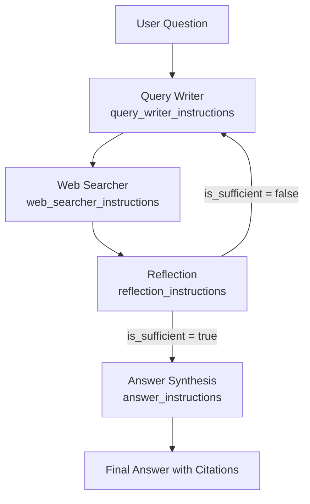

Google Gemini Fullstack LangGraph Quickstart 프로젝트의 핵심은 정교하게 설계된 4개의 프롬프트입니다. 각 프롬프트는 **검색 쿼리 생성 → 웹 연구 → 반성적 평가 → 최종 답변 합성**의 워크플로우에서 고유한 역할을 수행하며, 전체 에이전트의 품질과 신뢰성을 결정짓습니다. 이번 포스트에서는 `backend/src/agent/prompts.py`에 정의된 핵심 프롬프트들을 프롬프트 엔지니어링 관점에서 심층 분석합니다.

## 시리즈 개요

이 글은 **Gemini 연구 에이전트 시리즈**의 2편입니다:

- **1편**: [Google Gemini 2.5 + LangGraph로 구축하는 AI 연구 에이전트 - 풀스택 가이드](./2025-06-10-gemini-fullstack-langgraph-quickstart-guide)
- **2편**: LangGraph 에이전트 핵심 프롬프트 심층 분석 (현재 글)

## LangGraph 에이전트 워크플로우 복습

먼저 4개 프롬프트가 어떤 순서로 실행되는지 확인해보겠습니다:



각 노드는 특화된 프롬프트를 사용하여 **단일 책임 원칙**을 구현하며, 전체적으로 견고한 연구 파이프라인을 구성합니다.

## 1. Query Writer Instructions - 검색 쿼리 생성

### 프롬프트 역할과 위치

| 항목 | 내용 |
|------|------|
| **파일 위치** | `backend/src/agent/prompts.py` |
| **모델** | Gemini 2.5 Flash (지연 시간 최소화) |
| **그래프 노드** | Generate Queries |
| **임무** | 사용자 질문 → 웹 검색용 쿼리 리스트 변환 |

### 프롬프트 구조 분석

```python
query_writer_instructions = """
고도화된 다변화 웹 검색 쿼리를 생성하여 포괄적인 연구를 수행하세요.

지침:
- 가능하면 단일 주제에 집중하는 쿼리 작성
- 중복 방지 및 다양성 확보
- 최대 {number_queries}개 쿼리 생성
- 최신 정보 강조 (현재 날짜: {current_date})

JSON 형식으로 반환:

{{
  "queries": [
    {{
      "rationale": "쿼리 생성 이유",
      "query": "실제 검색어"
    }}
  ]
}}


예시:

{{
  "queries": [
    {{
      "rationale": "최신 성능 벤치마크 확인",
      "query": "GPT-4o vs Claude 3.5 performance benchmark 2025"
    }},
    {{
      "rationale": "실제 구현 사례 탐색",
      "query": "GPT-4o production implementation case studies"
    }}
  ]
}}


연구 주제: {research_topic}
"""
```

### 설계 원칙과 안전장치

#### 1. 단일 책임 원칙

```text
"고도화된 다변화 웹 검색 쿼리를 생성..."
→ 모델이 답변 작성이나 해석으로 산만해지지 않도록 범위 한정
```

#### 2. 비용 최적화

```text
"최대 {number_queries}개" + "중복 방지"
→ API 호출 수 통제로 비용 관리
```

#### 3. 시간 앵커링

```python
# 런타임 삽입 예시
current_date = datetime.now().strftime("%Y-%m-%d")
query_writer_instructions.format(
    number_queries=5,
    current_date=current_date,
    research_topic="AI 에이전트 최신 동향"
)
```

#### 4. 구조화된 출력

```json
{
  "queries": [
    {
      "rationale": "쿼리 생성 근거 설명",
      "query": "Google Search API에 전달할 실제 검색어"
    }
  ]
}
```

### 실행 플로우

1. **사용자 질문 수신**: React 채팅에서 백엔드로 POST 요청
2. **프롬프트 완성**: 플레이스홀더에 실제 값 삽입
3. **Gemini Flash 호출**: 빠른 응답을 위한 경량 모델 사용
4. **JSON 파싱**: `json.loads()`로 안전한 구조화 데이터 추출
5. **검증**: 쿼리 수, 중복 여부 확인
6. **다음 노드 전달**: Web Search 노드로 쿼리 리스트 전달

### 개선 아이디어

```python
# 1. 날짜 필터 강화
def enhance_queries_with_date_filter(queries: List[str], year: int = 2025) -> List[str]:
    """검색 쿼리에 날짜 연산자 자동 추가"""
    enhanced = []
    for query in queries:
        if "after:" not in query and "2024" not in query and "2025" not in query:
            enhanced.append(f"{query} after:{year-1}")
        else:
            enhanced.append(query)
    return enhanced

# 2. 임베딩 기반 중복 제거
from sentence_transformers import SentenceTransformer

def deduplicate_queries(queries: List[str], threshold: float = 0.8) -> List[str]:
    """의미적 유사도 기반 쿼리 중복 제거"""
    model = SentenceTransformer('all-MiniLM-L6-v2')
    embeddings = model.encode(queries)
    
    unique_queries = []
    for i, query in enumerate(queries):
        is_duplicate = False
        for j in range(i):
            similarity = cosine_similarity([embeddings[i]], [embeddings[j]])[0][0]
            if similarity > threshold:
                is_duplicate = True
                break
        
        if not is_duplicate:
            unique_queries.append(query)
    
    return unique_queries
```

## 2. Web Searcher Instructions - 웹 연구 수행

### 프롬프트 역할과 목표

| 항목 | 내용 |
|------|------|
| **임무** | 검색 쿼리 실행 + 신뢰할 수 있는 요약 생성 |
| **핵심 원칙** | 최신성, 다양성, 출처 추적, 허구 금지 |
| **출력 형태** | 검증 가능한 요약 텍스트 + 인용 메타데이터 |

### 프롬프트 구조 분석

```python
web_searcher_instructions = """
당신은 전문 웹 검색 에이전트입니다. 주어진 쿼리로 Google Search를 수행하고 신뢰할 수 있는 정보만을 요약합니다.

핵심 지침:
1. 최신성 확보: 현재 날짜는 {current_date}입니다
2. 다면적 탐색: 다양한 키워드와 연산자로 폭넓게 수집
3. 출처 추적: 사실 단위로 URL을 메모하여 인용 가능하게 함
4. 허구 금지: 검색 결과에서만 정보를 추출, 추측이나 상상 금지

검색 주제: {research_topic}

각 검색 결과에 대해 다음 형식으로 요약:
- 핵심 내용 (2-3 문장)
- 출처: [URL]
- 신뢰도: [높음/중간/낮음]
"""
```

### 실행 플로우와 안전장치

#### 1. 검색 실행

```python
def execute_web_search(query: str, current_date: str) -> SearchResult:
    """Google Search API 호출 및 결과 처리"""
    
    # 프롬프트 완성
    prompt = web_searcher_instructions.format(
        current_date=current_date,
        research_topic=query
    )
    
    # Gemini + Google Search API 조합
    response = gemini_model.generate_with_tools(
        prompt=prompt,
        tools=[google_search_tool],
        max_tokens=1024
    )
    
    return parse_search_results(response)
```

#### 2. 인용 추적 시스템

```python
def insert_citation_markers(text: str, citations: List[str]) -> str:
    """텍스트에 인용 마커 자동 삽입"""
    
    marked_text = text
    for i, citation in enumerate(citations):
        # URL을 짧은 형태로 변환
        short_url = resolve_url(citation)
        
        # 관련 문장에 마커 삽입
        marked_text = marked_text.replace(
            extract_fact_sentence(text, citation),
            f"{extract_fact_sentence(text, citation)} [{i+1}]"
        )
    
    return marked_text

def get_citations(search_results: List[SearchResult]) -> List[str]:
    """검색 결과에서 인용 URL 추출"""
    return [result.url for result in search_results if result.reliability >= 0.7]
```

#### 3. 신뢰도 평가

```python
class SourceReliabilityChecker:
    """소스 신뢰도 자동 평가"""
    
    TRUSTED_DOMAINS = [
        'nature.com', 'science.org', 'arxiv.org',
        'github.com', 'stackoverflow.com',
        'techcrunch.com', 'wired.com'
    ]
    
    def evaluate_reliability(self, url: str, content: str) -> float:
        """0.0-1.0 스케일로 신뢰도 평가"""
        score = 0.5  # 기본값
        
        # 도메인 기반 평가
        domain = extract_domain(url)
        if domain in self.TRUSTED_DOMAINS:
            score += 0.3
        
        # 내용 기반 평가
        if self.has_citations(content):
            score += 0.1
        if self.has_data_tables(content):
            score += 0.1
        if self.is_recent_publication(content):
            score += 0.1
            
        return min(score, 1.0)
```

### 토큰 최적화 전략

```python
def optimize_search_summary(results: List[SearchResult], max_tokens: int = 800) -> str:
    """토큰 제한 내에서 최적의 요약 생성"""
    
    # 신뢰도 순으로 정렬
    sorted_results = sorted(results, key=lambda x: x.reliability, reverse=True)
    
    summary_parts = []
    token_count = 0
    
    for result in sorted_results:
        # 각 결과의 토큰 수 추정
        result_tokens = estimate_tokens(result.summary)
        
        if token_count + result_tokens <= max_tokens:
            summary_parts.append(result.summary)
            token_count += result_tokens
        else:
            # 남은 공간에 맞춰 압축
            remaining_tokens = max_tokens - token_count
            compressed = compress_text(result.summary, remaining_tokens)
            summary_parts.append(compressed)
            break
    
    return "\n\n".join(summary_parts)
```

## 3. Reflection Instructions - 지식 격차 분석

### 프롬프트 설계 철학

Reflection 단계는 **"언제 검색을 멈출 것인가?"**를 결정하는 핵심 노드입니다. 비용 최적화와 정보 완성도 사이의 균형을 맞추는 것이 목표입니다.

### 프롬프트 구조

```python
reflection_instructions = """
당신은 전문 연구 분석가입니다. 수집된 웹 검색 요약을 검토하여 다음을 평가하세요:

1. 지식 공백 식별: 사용자 질문에 완전히 답하기 위해 부족한 정보는?
2. 충분성 판단: 현재 정보만으로 만족스러운 답변이 가능한가?
3. 후속 검색: 부족하다면 구체적인 추가 검색 쿼리 제안

특히 다음 요소들을 중점 확인:
- 최신 동향 및 트렌드
- 기술적 구현 세부사항
- 실제 사용 사례 및 벤치마크
- 한계점 및 주의사항

JSON 형식으로 응답:

{{
  "is_sufficient": true/false,
  "knowledge_gap": "부족한 정보 설명 (120자 이내)",
  "follow_up_queries": ["추가 검색어1", "추가 검색어2"]
}}


연구 주제: {research_topic}
수집된 요약: {summaries}
"""
```

### 판정 로직과 제어 흐름

#### 1. 이진 분기 시스템

```python
class ReflectionController:
    """반성 단계 제어 로직"""
    
    def __init__(self, max_iterations: int = 3):
        self.max_iterations = max_iterations
        self.current_iteration = 0
    
    def should_continue_search(self, reflection_result: dict) -> bool:
        """검색 지속 여부 결정"""
        
        # 최대 반복 횟수 체크
        if self.current_iteration >= self.max_iterations:
            return False
        
        # 충분성 플래그 체크
        if reflection_result.get("is_sufficient", False):
            return False
        
        # 후속 쿼리 존재 체크
        follow_ups = reflection_result.get("follow_up_queries", [])
        if not follow_ups:
            return False
        
        self.current_iteration += 1
        return True
```

#### 2. 지식 격차 유형화

```python
class KnowledgeGapAnalyzer:
    """지식 격차 유형별 분석"""
    
    GAP_TYPES = {
        "temporal": "시간적 정보 부족 (최신 동향, 업데이트)",
        "technical": "기술적 세부사항 부족 (구현, 아키텍처)",
        "comparative": "비교 분석 부족 (대안, 경쟁사)",
        "practical": "실용적 정보 부족 (사용법, 사례)"
    }
    
    def classify_gap(self, gap_description: str) -> str:
        """격차 유형 자동 분류"""
        for gap_type, description in self.GAP_TYPES.items():
            if any(keyword in gap_description.lower() 
                   for keyword in description.split()):
                return gap_type
        return "general"
    
    def generate_targeted_queries(self, gap_type: str, topic: str) -> List[str]:
        """격차 유형별 맞춤 쿼리 생성"""
        
        query_templates = {
            "temporal": [
                f"{topic} latest updates 2025",
                f"{topic} recent developments news"
            ],
            "technical": [
                f"{topic} technical documentation",
                f"{topic} implementation guide architecture"
            ],
            "comparative": [
                f"{topic} vs alternatives comparison",
                f"{topic} pros cons limitations"
            ],
            "practical": [
                f"{topic} tutorial how to use",
                f"{topic} real world examples case studies"
            ]
        }
        
        return query_templates.get(gap_type, [f"{topic} detailed information"])
```

### 품질 개선 전략

#### 1. 격차 설명 최적화

```python
def optimize_knowledge_gap_description(gap: str, max_chars: int = 120) -> str:
    """지식 격차 설명을 간결하게 최적화"""
    
    if len(gap) <= max_chars:
        return gap
    
    # 핵심 키워드 추출
    keywords = extract_key_terms(gap)
    
    # 중요도 순으로 재구성
    optimized = f"부족: {', '.join(keywords[:3])}"
    
    if len(optimized) <= max_chars:
        return optimized
    else:
        return optimized[:max_chars-3] + "..."
```

#### 2. 중복 쿼리 방지

```python
def deduplicate_follow_up_queries(
    new_queries: List[str], 
    previous_queries: List[str]
) -> List[str]:
    """이전 검색과 중복되지 않는 쿼리만 선별"""
    
    unique_queries = []
    
    for query in new_queries:
        # 임베딩 기반 유사도 체크
        if not is_similar_to_previous(query, previous_queries, threshold=0.8):
            unique_queries.append(query)
    
    return unique_queries[:3]  # 최대 3개로 제한
```

## 4. Answer Instructions - 최종 답변 합성

### 프롬프트의 최종 목표

Answer Synthesis는 수집된 모든 정보를 **고품질 최종 답변**으로 변환하는 단계입니다. 가장 중요한 요구사항은 **인용 무결성**과 **사용자 경험 최적화**입니다.

### 프롬프트 구조

```python
answer_instructions = """
수집된 연구 자료를 바탕으로 고품질 최종 답변을 생성하세요.

현재 날짜: {current_date}

중요 지침:
1. 메타 정보 은폐: 파이프라인 내부 구조를 언급하지 마세요
2. 인용 필수: 모든 사실에 대해 MUST include citations
3. 자료 범위: 제공된 요약 정보에만 기반하여 작성
4. 답변 구조: 서론 - 본론 - 결론 형태로 체계적 구성

사용자 맥락: {research_topic}

수집된 요약:
{summaries}

답변 형식:
## 핵심 답변
[2-3 문단으로 요약된 핵심 내용]

## 상세 분석
[세부 사항과 기술적 내용]

## 주요 출처
[인용된 주요 소스 목록]

모든 사실 진술에 [1], [2] 형식의 인용 번호를 포함하세요.
"""
```

### 인용 시스템 구현

#### 1. 자동 인용 삽입

```python
class CitationManager:
    """인용 관리 시스템"""
    
    def __init__(self):
        self.citation_map = {}
        self.citation_counter = 1
    
    def add_citation(self, url: str, title: str = None) -> int:
        """새 인용 추가 및 번호 반환"""
        if url not in self.citation_map:
            self.citation_map[url] = {
                'number': self.citation_counter,
                'title': title or self.extract_title(url),
                'domain': self.extract_domain(url)
            }
            self.citation_counter += 1
        
        return self.citation_map[url]['number']
    
    def insert_citations_in_text(self, text: str, sources: List[dict]) -> str:
        """텍스트에 인용 마커 자동 삽입"""
        
        for source in sources:
            fact = source['fact']
            url = source['url']
            
            citation_num = self.add_citation(url)
            
            # 문장 끝에 인용 번호 삽입
            if fact in text:
                text = text.replace(fact, f"{fact} [{citation_num}]")
        
        return text
    
    def generate_bibliography(self) -> str:
        """참고문헌 목록 생성"""
        bibliography = "\n## 참고문헌\n\n"
        
        for url, info in sorted(self.citation_map.items(), 
                               key=lambda x: x[1]['number']):
            bibliography += f"[{info['number']}] {info['title']} - {info['domain']}\n"
        
        return bibliography
```

#### 2. 인용 품질 검증

```python
def validate_citation_integrity(answer: str, citations: List[str]) -> bool:
    """답변의 인용 무결성 검증"""
    
    # 인용 번호 패턴 추출
    citation_pattern = r'\[(\d+)\]'
    used_citations = re.findall(citation_pattern, answer)
    
    # 모든 인용이 유효한지 확인
    max_citation = len(citations)
    for citation_num in used_citations:
        if int(citation_num) > max_citation:
            return False
    
    # 중요한 사실에 인용이 있는지 확인
    important_claims = extract_factual_claims(answer)
    for claim in important_claims:
        if not has_nearby_citation(claim, answer):
            return False
    
    return True

def extract_factual_claims(text: str) -> List[str]:
    """사실적 주장 문장 추출"""
    # 숫자, 날짜, 통계가 포함된 문장 식별
    patterns = [
        r'.*\d+%.*',  # 퍼센티지
        r'.*\d{4}년.*',  # 연도
        r'.*\$\d+.*',  # 금액
        r'.*\d+배.*',  # 배수
    ]
    
    claims = []
    sentences = text.split('.')
    
    for sentence in sentences:
        for pattern in patterns:
            if re.search(pattern, sentence):
                claims.append(sentence.strip())
                break
    
    return claims
```

### 사용자 경험 최적화

#### 1. 메타 정보 은폐

```python
def sanitize_response(text: str) -> str:
    """응답에서 메타 정보 제거"""
    
    meta_phrases = [
        "파이프라인", "단계", "노드", "에이전트",
        "검색을 수행했", "분석을 완료했",
        "최종 단계", "종합하여"
    ]
    
    sanitized = text
    for phrase in meta_phrases:
        sanitized = re.sub(
            rf'[^.]*{phrase}[^.]*\.', 
            '', 
            sanitized, 
            flags=re.IGNORECASE
        )
    
    return sanitized.strip()
```

#### 2. 응답 구조화

```python
class AnswerFormatter:
    """답변 형식 최적화"""
    
    def format_structured_answer(
        self, 
        content: str, 
        citations: List[str]
    ) -> str:
        """구조화된 답변 포맷 생성"""
        
        sections = self.parse_content_sections(content)
        
        formatted = "## 핵심 요약\n\n"
        formatted += sections.get('summary', '') + "\n\n"
        
        formatted += "## 상세 분석\n\n"
        formatted += sections.get('details', '') + "\n\n"
        
        if sections.get('limitations'):
            formatted += "## 주의사항\n\n"
            formatted += sections.get('limitations', '') + "\n\n"
        
        # 참고문헌 추가
        formatted += self.generate_reference_section(citations)
        
        return formatted
    
    def parse_content_sections(self, content: str) -> dict:
        """내용을 섹션별로 분리"""
        # 키워드 기반 섹션 분류 로직
        pass
```

## 프롬프트 엔지니어링 핵심 인사이트

### 1. 단일 책임 원칙의 력

각 프롬프트가 **하나의 명확한 목적**만 수행하도록 설계된 것이 핵심 성공 요인입니다:

```python
# 잘못된 예: 하나의 프롬프트로 모든 것을 처리
bad_prompt = """
사용자 질문에 답하기 위해 검색하고, 결과를 분석하고, 최종 답변을 생성하세요.
"""

# 올바른 예: 단일 책임
query_prompt = "검색 쿼리만 생성하세요."
search_prompt = "검색만 수행하세요."
reflect_prompt = "결과만 평가하세요."
answer_prompt = "최종 답변만 작성하세요."
```

### 2. JSON 스키마의 중요성

모든 프롬프트가 **구조화된 JSON 출력**을 요구하는 이유:

- **파싱 오류 최소화**: `json.loads()` 실패 시 자동 재시도 가능
- **타입 안전성**: LangGraph 상태 관리의 견고성 확보
- **디버깅 용이성**: 각 단계의 출력을 명확히 추적 가능

### 3. 시간 앵커링 효과

모든 프롬프트에 `{current_date}` 삽입의 효과:

```python
# 시간 앵커 없는 경우
"AI 동향에 대해 검색하세요"
→ 2021년 기사까지 무차별 검색

# 시간 앵커 있는 경우  
"AI 동향에 대해 검색하세요 (현재: 2025-06-10)"
→ 최신 정보 우선 검색
```

### 4. 안전장치 중첩 설계

여러 계층의 안전장치로 품질 보장:

```text
Layer 1: 프롬프트 레벨 - "허구 금지", "인용 필수"
Layer 2: 파싱 레벨 - JSON 스키마 검증
Layer 3: 로직 레벨 - 중복 제거, 길이 제한
Layer 4: 사용자 레벨 - 메타 정보 은폐
```

## 실전 커스터마이징 가이드

### 1. 도메인 특화 프롬프트

```python
# 의료 분야 특화
medical_query_instructions = """
의료 정보 검색을 위한 쿼리를 생성하세요.

추가 지침:
- 동료 심사 논문 우선 검색
- FDA 승인 정보 포함
- 부작용 및 금기사항 확인

검색 도메인 우선순위:
1. PubMed, NEJM, Lancet
2. FDA, EMA 공식 자료
3. 의료진 가이드라인
"""

# 기술 분야 특화
tech_query_instructions = """
기술 정보 검색을 위한 쿼리를 생성하세요.

추가 지침:
- GitHub 저장소 및 문서 우선
- 최신 버전 정보 확인
- 실제 구현 사례 포함

검색 도메인 우선순위:
1. 공식 문서, GitHub
2. Stack Overflow, 기술 블로그
3. 벤치마크, 성능 테스트
"""
```

### 2. 언어별 최적화

```python
korean_prompts = {
    "query_writer": """
다양한 한국어 검색어를 생성하세요.
- 영문과 한글 키워드 모두 포함
- 한국 시장 특화 정보 고려
""",
    
    "web_searcher": """
한국어 웹사이트를 우선 검색하세요.
- 네이버, 다음 등 한국 포털 결과 포함
- 한국 기업, 정부 발표 자료 중요도 상향
"""
}
```

### 3. 응답 형식 커스터마이징

```python
def customize_answer_format(format_type: str) -> str:
    """사용 목적별 답변 형식 조정"""
    
    formats = {
        "executive_summary": """
## 핵심 요약 (1분 독서)
## 주요 수치 및 트렌드
## 비즈니스 임플리케이션
## 권장 액션 아이템
""",
        
        "technical_deep_dive": """
## 기술 개요
## 아키텍처 및 구현
## 성능 벤치마크
## 제한사항 및 주의사항
## 참고 자료
""",
        
        "comparison_analysis": """
## 비교 대상 개요
## 장단점 매트릭스
## 사용 시나리오별 권장사항
## 의사결정 가이드
"""
    }
    
    return formats.get(format_type, formats["executive_summary"])
```

## 성능 최적화 전략

### 1. 토큰 사용량 최적화

```python
class TokenOptimizer:
    """토큰 사용량 최적화"""
    
    def __init__(self, max_tokens_per_stage: dict):
        self.max_tokens = max_tokens_per_stage
    
    def optimize_summaries(self, summaries: List[str]) -> str:
        """요약 텍스트 토큰 최적화"""
        
        total_tokens = sum(estimate_tokens(s) for s in summaries)
        max_allowed = self.max_tokens.get('synthesis', 2000)
        
        if total_tokens <= max_allowed:
            return "\n\n".join(summaries)
        
        # 중요도 기반 압축
        compressed_summaries = []
        remaining_tokens = max_allowed
        
        for summary in sorted(summaries, key=self.calculate_importance, reverse=True):
            summary_tokens = estimate_tokens(summary)
            
            if summary_tokens <= remaining_tokens:
                compressed_summaries.append(summary)
                remaining_tokens -= summary_tokens
            else:
                # 남은 공간에 맞춰 압축
                compressed = self.compress_text(summary, remaining_tokens)
                compressed_summaries.append(compressed)
                break
        
        return "\n\n".join(compressed_summaries)
```

### 2. 캐싱 전략

```python
import hashlib
from functools import wraps

def cache_prompt_results(expiry_hours: int = 24):
    """프롬프트 결과 캐싱 데코레이터"""
    
    def decorator(func):
        @wraps(func)
        async def wrapper(prompt: str, *args, **kwargs):
            # 프롬프트 해시로 캐시 키 생성
            cache_key = f"prompt:{hashlib.md5(prompt.encode()).hexdigest()}"
            
            # 캐시 확인
            cached_result = await redis_client.get(cache_key)
            if cached_result:
                return json.loads(cached_result)
            
            # 실제 실행
            result = await func(prompt, *args, **kwargs)
            
            # 결과 캐싱
            await redis_client.setex(
                cache_key, 
                expiry_hours * 3600, 
                json.dumps(result)
            )
            
            return result
        return wrapper
    return decorator
```

## 결론

Gemini Fullstack LangGraph Quickstart의 4개 핵심 프롬프트는 **단일 책임, 구조화 출력, 안전장치 중첩, 시간 앵커링**이라는 프롬프트 엔지니어링의 모범 사례를 완벽하게 구현한 사례입니다.

### 핵심 교훈

1. **명확한 역할 분담**: 각 프롬프트가 하나의 기능만 담당
2. **JSON 스키마 활용**: 구조화된 출력으로 파이프라인 안정성 확보
3. **다층 안전장치**: 프롬프트-파싱-로직-UI 레벨의 중첩 보호
4. **컨텍스트 관리**: 시간, 도메인, 사용자 의도의 명시적 전달

### 실전 적용 가이드

- **도메인 특화**: 의료, 법률, 기술 등 분야별 프롬프트 커스터마이징
- **다국어 지원**: 언어별 검색 전략과 응답 형식 최적화
- **성능 최적화**: 토큰 사용량 관리와 캐싱 전략 구현
- **품질 관리**: 인용 무결성과 사실 정확성 검증 시스템

이러한 설계 원칙을 이해하고 적용하면, 신뢰할 수 있고 확장 가능한 AI 연구 에이전트를 구축할 수 있습니다.
