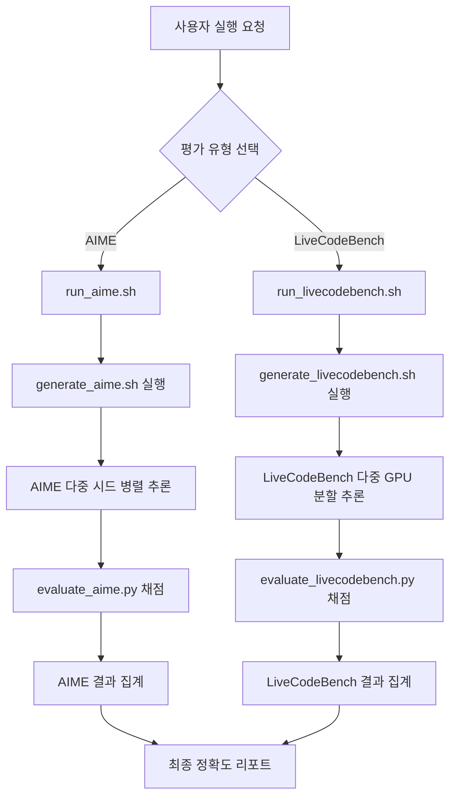
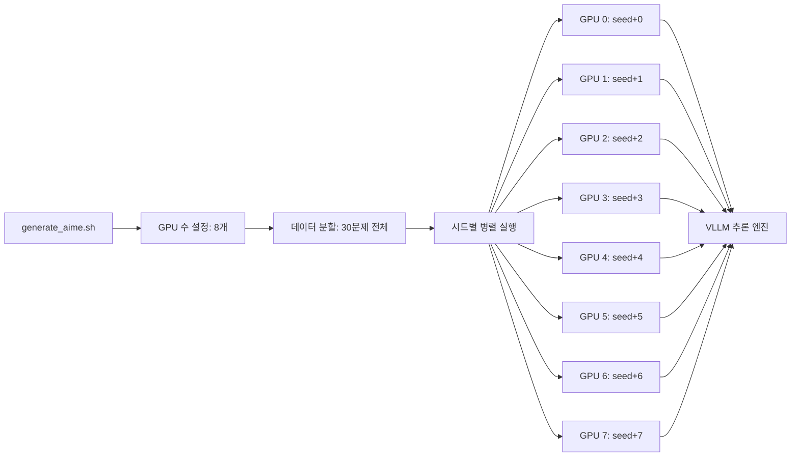
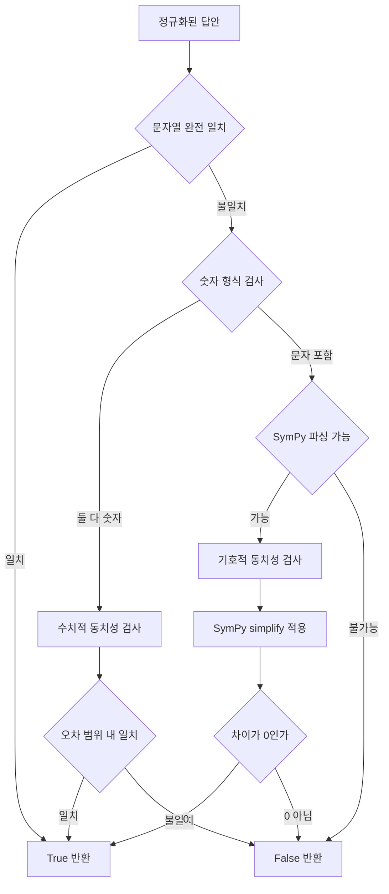
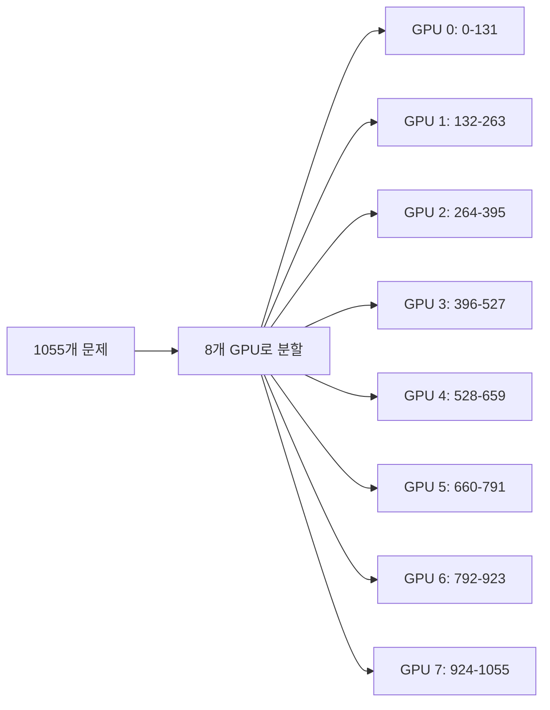
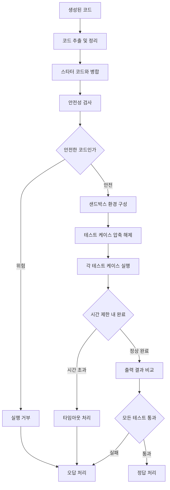
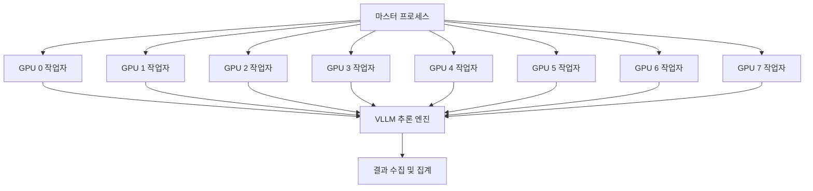

## 📋 문서 개요

본 문서는 **AceReason Evaluation Toolkit**의 전체 동작 과정을 단계별로 상세하게 분석한 자료입니다. 추론부터 채점까지의 전체 파이프라인과 각 컴포넌트의 역할, 채점 방식의 세부사항을 포함합니다.

---

## 🎯 시스템 개요

AceReason Evaluation Toolkit은 다음 두 가지 주요 평가를 수행합니다:

- **AIME (American Invitational Mathematics Examination)**: 고난도 수학 문제 추론 평가
- **LiveCodeBench**: 실시간 코딩 능력 평가

각 평가는 **생성(Generation) → 채점(Evaluation)** 의 2단계 파이프라인으로 구성됩니다.

---

## 🏗️ 전체 아키텍처 플로우



---

## 🔄 AIME 평가 프로세스 상세 분석

### Phase 1: 추론 생성 단계

#### 1.1 초기 설정 및 시드 분배

```bash
# run_aime.sh에서 모델별 시드 설정
if [ "$MODEL_NAME" == "nvidia/AceReason-Nemotron-7B" ]; then
    seed_list_aime24=(121 131 141 151 161 171 181 191)
    seed_list_aime25=(111 222 333 444 555 666 777 888)
    MODEL_TYPE="r1"
elif [ "$MODEL_NAME" == "nvidia/AceReason-Nemotron-14B" ]; then
    seed_list_aime24=(111 222 333 444 555 666 777 888)
    seed_list_aime25=(111 222 333 444 555 666 777 888)
    MODEL_TYPE="r1"
elif [ "$MODEL_NAME" == "nvidia/AceReason-Nemotron-1.1-7B" ]; then
    seed_list_aime24=(100 200 300 400 500 600 700 800)
    seed_list_aime25=(100 200 300 400 500 600 700 800)
    MODEL_TYPE="qwen"
fi
```

**핵심 특징:**

- **다중 시드**: 8개 서로 다른 시드로 통계적 신뢰성 확보
- **모델별 차별화**: 각 모델에 최적화된 시드 및 템플릿 적용
- **데이터셋 분리**: AIME 2024, AIME 2025 별도 평가

#### 1.2 병렬 추론 실행



**추론 파라미터:**

```bash
BSZ=30              # 배치 크기: 전체 문제 수
TOTAL=30            # 총 문제 수 (AIME)
GPUS=8              # GPU 수
OUT_SEQ_LEN=32768   # 최대 출력 시퀀스 길이
top_p=0.95          # Nucleus 샘플링
temperature=0.6     # 온도 매개변수
```

#### 1.3 모델별 템플릿 처리

**AceReason r1 모델 (7B, 14B)**:

```python
def apply_r1_template(problem):
    return f"""<|im_start|>user
{problem}
<|im_end|>
<|im_start|>assistant
<think>
{reasoning_process}
</think>

{final_answer}
<|im_end|>"""
```

**AceReason Qwen 모델 (1.1-7B)**:

```python
def apply_qwen_template(problem):
    return f"""<|im_start|>user
{problem}<|im_end|>
<|im_start|>assistant
{response}<|im_end|>"""
```

### Phase 2: 채점 및 평가 단계

#### 2.1 답안 추출 프로세스

```mermaid
graph TD
    A[모델 생성 텍스트] --> B[패턴 매칭 시도]
    B --> C{\\boxed{} 패턴}
    C -->|발견| D[LaTeX 박스 내용 추출]
    C -->|미발견| E{**답** 패턴}
    E -->|발견| F[강조 텍스트 추출]
    E -->|미발견| G{\\[...\\] 패턴}
    G -->|발견| H[수식 환경 추출]
    G -->|미발견| I{is \\(...\\) 패턴}
    I -->|발견| J[인라인 수식 추출]
    I -->|미발견| K[추출 실패]
    
    D --> L[답안 정규화]
    F --> L
    H --> L
    J --> L
```

**패턴 매칭 순서:**

1. `\\boxed{((?:[^{}]|\\{(?:[^{}]|\\{[^{}]*\\})*\\})*)}` - LaTeX boxed 형식
2. `\\*\\*(.*?)\\*\\*` - 마크다운 강조 형식
3. `\\\\\\[\\n(.*?)\\n\\\\\\]` - LaTeX 수식 환경
4. `is \\\\\\((.*?)\\\\\\)` - 인라인 수식
5. `\\\\\\[\\\\n(.*?)\\\\n\\\\\\]` - 대체 수식 환경

#### 2.2 답안 정규화 (math_answer_cleaning)

```python
def math_answer_cleaning(answer):
    # 1. \\text{} 래핑 제거
    extracted_content = is_completely_wrapped_by_text(answer)
    answer = extracted_content if extracted_content else answer
    
    # 2. 수학 표기 정규화
    answer = answer.replace(",\\!", "").replace("{,}", "").replace("\\$", "")
    answer = answer.replace("dfrac{", "frac{").replace("tfrac{", "frac{")
    answer = answer.replace("^\\circ", "").replace("^{\\circ}", "")
    
    # 3. 불필요한 텍스트 제거
    answer = answer.replace("\\quad", "")
    answer = re.sub(r'\\\\,\\\\text\\{.*?\\}', '', answer)
    answer = re.sub(r'\\\\text\\{.*?\\}', '', answer)
    
    # 4. 지수 표기 정규화
    answer = re.sub(r'([+-]?\\d*\\.?\\d+)[\\\\]times10\\^{([+-]?\\d+)}', r'\\1e\\2', answer)
    answer = re.sub(r'([+-]?\\d*\\.?\\d+)[\\\\]times10\\^([+-]?\\d+)', r'\\1e\\2', answer)
    
    # 5. 함수 표기 처리 (f(x)=ax+b → ax+b)
    func_pattern = r'^[a-zA-Z_]\\w*\\([a-zA-Z_]\\w*\\)$'
    if "=" in answer and (re.match(func_pattern, answer.split("=")[0]) or len(answer.split("=")[0])<=3):
        answer = answer.split("=", 1)[1]
    
    return answer.lower().replace(" ", "").replace("\\n", "").replace(",", "")
```

#### 2.3 수학적 동치성 검증



**수치적 동치성 검사:**

```python
def numeric_equal(prediction: float, reference: float):
    return isclose(prediction, reference, rel_tol=1e-4, abs_tol=1e-6)
```

**기호적 동치성 검사:**

```python
def symbolic_equal(a, b):
    try:
        # LaTeX → SymPy 변환
        expr_a = latex2sympy(a) if '\\' in a else parse_expr(a)
        expr_b = latex2sympy(b) if '\\' in b else parse_expr(b)
        
        # 차이가 0인지 확인
        return simplify(expr_a - expr_b) == 0
    except:
        return False
```

#### 2.4 다중 시드 결과 집계

```python
def get_answer_by_majority_voting(output_list):
    """다수결 투표로 최종 답안 결정"""
    extracted_answers = []
    for output in output_list:
        answer = extract_answer(output)
        if answer: extracted_answers.append(answer)
    
    if not extracted_answers:
        return None
    
    # 가장 빈번한 답안 선택
    counter = Counter(extracted_answers)
    return counter.most_common(1)[0][0]
```

---

## 🚀 LiveCodeBench 평가 프로세스 상세 분석

### Phase 1: 추론 생성 단계

#### 1.1 데이터 분할 및 병렬 처리

```bash
# generate_livecodebench.sh에서 데이터 분할
BSZ=132           # 배치 크기
TOTAL=1055        # 총 문제 수
GPUS=8            # GPU 수
chunk=$(( (TOTAL + GPUS - 1) / GPUS ))  # 132문제씩 분할

for (( gpu=0; gpu<GPUS; gpu++ )); do
  start=$(( gpu * chunk ))
  end=$(( start + chunk ))
  (( end > TOTAL )) && end=$TOTAL
  
  echo "GPU $gpu: processing [$start, $end)..."
  # inference.py 실행
done
```



#### 1.2 코드 생성 프로세스

**문제 구조:**

```json
{
    "question_id": "unique_identifier",
    "question_content": "문제 설명 및 요구사항",
    "starter_code": "def solution():\\n    pass",
    "private_test_cases": "base64_encoded_test_cases"
}
```

**생성된 코드 형식:**

````python
```python
def solution():
    # 모델이 생성한 솔루션 코드
    return result
```
````

### Phase 2: 코드 검증 및 채점

#### 2.1 코드 추출 프로세스

```python
def has_code(response):
    """생성된 응답에서 Python 코드 추출"""
    pattern = r"```python(?:[a-zA-Z0-9]*)\\n(.*?)```"
    matches = re.findall(pattern, response, re.DOTALL)
    return matches
```

#### 2.2 테스트 케이스 실행 파이프라인



#### 2.3 안전성 검증 (code_verifier.py)

```python
def is_safe_code(code):
    """코드 안전성 검사"""
    dangerous_patterns = [
        r'import\s+os',
        r'import\s+subprocess',
        r'import\s+sys',
        r'__import__',
        r'eval\s*\(',
        r'exec\s*\(',
        r'open\s*\(',
        r'file\s*\(',
        r'input\s*\(',
        r'raw_input\s*\('
    ]
    
    for pattern in dangerous_patterns:
        if re.search(pattern, code, re.IGNORECASE):
            return False
    return True
```

#### 2.4 다중 프로세스 테스트 실행

```python
def check_correctness(problem_to_check, timeout=5, debug=False):
    """안전한 멀티프로세싱으로 코드 실행"""
    manager = multiprocessing.Manager()
    result = manager.list()
    metadata_list = manager.list()
    
    total_timeout = (timeout + 1) * len(problem_to_check['input_output']) + 10
    p = multiprocessing.Process(
        target=_temp_run, 
        args=(problem_to_check, debug, result, metadata_list, timeout)
    )
    p.start()
    p.join(timeout=total_timeout + 1)
    
    if p.is_alive():
        p.kill()  # 강제 종료
    
    return bool(result and np.all(np.array(result[0]) > 0))
```

---

## 📊 채점 시스템 상세 분석

### AIME 채점 방식

#### 1. 패턴 기반 답안 추출

```python
patterns = [
    r"\\\\boxed\\{((?:[^{}]|\\{(?:[^{}]|\\{[^{}]*\\})*\\})*)}",  # LaTeX boxed
    r"\\*\\*(.*?)\\*\\*",                                        # 마크다운 강조
    r"\\\\\\[\\n(.*?)\\n\\\\\\]",                               # LaTeX 수식 환경
    r'is \\\\\\((.*?)\\\\\\)',                                  # 인라인 수식
    r"\\\\\\[\\\\n(.*?)\\\\n\\\\\\]"                            # 대체 수식 환경
]
```

#### 2. 다단계 정규화 처리

- **1단계**: LaTeX 명령어 정규화 (`\\dfrac` → `\\frac`)
- **2단계**: 단위 및 기호 제거 (`^\\circ`, `\\text{}`)
- **3단계**: 공백 및 구두점 정리
- **4단계**: 과학적 표기법 통합 (`\\times10^{n}` → `en`)
- **5단계**: 함수 표기 간소화 (`f(x)=y` → `y`)

#### 3. 동치성 검증 알고리즘

```python
def math_equal(prediction, reference):
    # 1차: 문자열 완전 일치
    if str(prediction).lower() == str(reference).lower():
        return True
    
    # 2차: 수치적 동치성 (상대오차 1e-4, 절대오차 1e-6)
    if is_digit(prediction) and is_digit(reference):
        return numeric_equal(parse_digits(prediction), parse_digits(reference))
    
    # 3차: 기호적 동치성 (SymPy를 통한 수학적 검증)
    try:
        expr1 = latex2sympy(prediction)
        expr2 = latex2sympy(reference)
        return simplify(expr1 - expr2) == 0
    except:
        return False
```

### LiveCodeBench 채점 방식

#### 1. 실행 기반 검증

```python
def run_test(problem, timeout=5):
    """실제 코드 실행을 통한 검증"""
    test_cases = problem['input_output']
    results = []
    
    for test_case in test_cases:
        try:
            # 사용자 함수 실행
            result = exec_with_timeout(
                problem['code'], 
                test_case['input'], 
                timeout
            )
            
            # 출력 비교
            if result == test_case['output']:
                results.append(1)  # 정답
            else:
                results.append(0)  # 오답
        except Exception:
            results.append(-1)  # 실행 오류
    
    return results
```

#### 2. 보안 샌드박스

- **프로세스 격리**: 각 코드 실행을 별도 프로세스에서 수행
- **시간 제한**: 테스트 케이스당 5초 제한
- **메모리 제한**: 과도한 메모리 사용 방지
- **파일 시스템 접근 차단**: 위험한 시스템 호출 차단

---

## ⚡ 성능 최적화 전략

### 1. 병렬 처리 최적화



### 2. 메모리 효율성

**VLLM 최적화:**

- **PagedAttention**: KV 캐시 효율적 관리
- **동적 배치**: 가변 길이 시퀀스 최적화
- **메모리 공유**: GPU 간 모델 가중치 공유

**배치 처리 전략:**

```python
# AIME: 전체 문제를 한 번에 처리
BSZ = 30  # = 총 문제 수

# LiveCodeBench: GPU 메모리에 맞춰 조정
BSZ = 132  # 132문제씩 배치 처리
```

### 3. 캐싱 메커니즘

**결과 캐싱:**

- 시드별 결과를 개별 JSONL 파일로 저장
- 중간 결과 체크포인트 지원
- 실패 시 재시작 가능

**모델 캐싱:**

- 모델 가중치를 GPU 메모리에 상주
- 토크나이저 사전 로드
- 컴파일된 CUDA 커널 재사용

---

## 🔍 오류 처리 및 복구

### 1. 타임아웃 처리

```python
class TimeoutException(Exception):
    pass

def timeout_handler(signum, frame):
    raise TimeoutException("연산 시간 초과")

signal.signal(signal.SIGALRM, timeout_handler)
signal.alarm(5)  # 5초 제한
try:
    result = compute_math_expression(expr)
finally:
    signal.alarm(0)  # 타임아웃 해제
```

### 2. 메모리 부족 처리

```python
def handle_oom_error():
    """GPU 메모리 부족 시 배치 크기 자동 조정"""
    current_batch_size = get_current_batch_size()
    new_batch_size = max(1, current_batch_size // 2)
    print(f"OOM 감지: 배치 크기 {current_batch_size} → {new_batch_size}")
    return new_batch_size
```

### 3. 프로세스 복구

```python
def robust_execution(func, max_retries=3):
    """실패 시 재시도 로직"""
    for attempt in range(max_retries):
        try:
            return func()
        except Exception as e:
            print(f"시도 {attempt + 1} 실패: {e}")
            if attempt == max_retries - 1:
                raise
            time.sleep(2 ** attempt)  # 지수 백오프
```

---

## 📈 결과 분석 및 리포팅

### 1. 통계적 분석

```python
def compute_statistics(results):
    """다중 시드 결과의 통계적 분석"""
    accuracies = [result['accuracy'] for result in results]
    
    return {
        'mean': np.mean(accuracies),
        'std': np.std(accuracies),
        'min': np.min(accuracies),
        'max': np.max(accuracies),
        'confidence_interval': compute_confidence_interval(accuracies)
    }
```

### 2. 세분화된 분석

**AIME 분석:**

- 연도별 성능 (2024 vs 2025)
- 문제 난이도별 성능
- 수학 영역별 성능 (대수, 기하, 수론 등)

**LiveCodeBench 분석:**

- 기간별 성능 (2023.05-2024.05)
- 버전별 성능 (v5 vs v6)
- 월별 성능 트렌드

### 3. 출력 형식

```json
{
    "model": "nvidia/AceReason-Nemotron-1.1-7B",
    "dataset": "aime24",
    "total_problems": 30,
    "seeds": [100, 200, 300, 400, 500, 600, 700, 800],
    "results": {
        "individual_accuracies": [0.67, 0.70, 0.63, ...],
        "mean_accuracy": 0.6625,
        "std_accuracy": 0.0234,
        "confidence_interval": [0.6421, 0.6829]
    },
    "detailed_results": [
        {
            "seed": 100,
            "correct": 20,
            "total": 30,
            "accuracy": 0.6667
        }
    ]
}
```

---

## 🔧 실행 명령어 요약

### AIME 평가 실행

```bash
# 전체 AIME 평가 (2024 + 2025)
bash run_aime.sh nvidia/AceReason-Nemotron-1.1-7B output_folder

# 개별 시드 실행
bash generate_aime.sh nvidia/AceReason-Nemotron-1.1-7B 100 aime24 output_folder qwen

# 채점만 실행
python evaluate_aime.py --modelfolder output_folder --dataset data/aime24.jsonl
```

### LiveCodeBench 평가 실행

```bash
# 전체 LiveCodeBench 평가
bash run_livecodebench.sh nvidia/AceReason-Nemotron-1.1-7B output_folder

# 개별 시드 실행
bash generate_livecodebench.sh nvidia/AceReason-Nemotron-1.1-7B 111 output_folder qwen

# 채점 실행 (자동으로 수행됨)
python evaluate_livecodebench.py
```

---

## 📊 성능 벤치마크

### 시스템 요구사항

- **GPU**: 8x NVIDIA H100 80GB (권장), 더 적은 GPU도 가능
- **메모리**: 640GB GPU 메모리 총합
- **스토리지**: 1TB+ (모델 및 결과 저장)

### 예상 실행 시간

- **AIME 평가**: 45-60분 (8개 시드, 60문제)
- **LiveCodeBench 평가**: 25-35분 (8개 시드, 1055문제)
- **총 평가 시간**: 약 1.5-2시간

### 메모리 사용량

- **모델 로딩**: 50-100GB (모델 크기에 따라)
- **추론 과정**: 400-500GB (배치 처리 시)
- **결과 저장**: 1-5GB (시드별 결과 파일)

---

## 🔮 결론

AceReason Evaluation Toolkit은 다음과 같은 특징을 가진 정교한 평가 시스템입니다:

### 🎯 핵심 강점

1. **정확성**: 수학적 동치성과 코드 실행 기반의 엄격한 채점
2. **신뢰성**: 다중 시드를 통한 통계적 신뢰성 확보
3. **효율성**: VLLM 기반 고성능 병렬 추론
4. **안전성**: 샌드박스 환경의 보안 코드 실행
5. **확장성**: 유연한 GPU 구성과 모듈러 아키텍처

### 🚀 기술적 혁신

- **LaTeX2SymPy**: 정교한 수학 표기법 파싱
- **PagedAttention**: 메모리 효율적인 대화형 추론
- **다중 패턴 매칭**: robust한 답안 추출
- **프로세스 격리**: 안전한 코드 실행 환경

이 시스템은 AI 모델의 복합적 추론 능력을 객관적이고 재현 가능한 방식으로 평가할 수 있는 industry-standard 도구로 자리잡을 수 있는 기술적 기반을 제공합니다.
