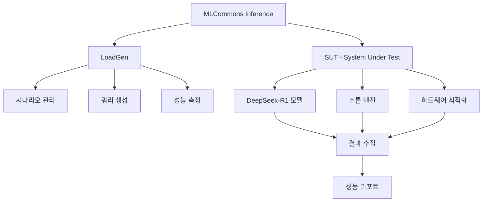

## 개요

[MLCommons Inference](https://github.com/mlcommons/inference/tree/master/language/deepseek-r1)는 AI 모델의 추론 성능을 표준화된 방식으로 측정하는 벤치마크 프레임워크입니다. 이 가이드에서는 DeepSeek-R1 모델을 대상으로 한 체계적인 성능 평가 방법을 다룹니다.

### MLCommons Inference의 특징

- **표준화된 평가**: 일관된 메트릭과 방법론
- **다양한 워크로드**: 언어, 비전, 음성 등 멀티모달 지원
- **실제 환경 반영**: 프로덕션 시나리오 기반 벤치마크
- **공정한 비교**: 하드웨어와 소프트웨어 최적화 기준 제공

## 시스템 아키텍처



## 환경 설정

### 1. 기본 환경 구성

```bash
# MLCommons Inference 저장소 클론
git clone https://github.com/mlcommons/inference.git
cd inference

# Python 환경 설정
python -m venv mlcommons-env
source mlcommons-env/bin/activate

# 필수 패키지 설치
pip install -r requirements.txt
pip install torch transformers accelerate
```

### 2. DeepSeek-R1 특화 설정

```bash
# DeepSeek-R1 디렉토리로 이동
cd language/deepseek-r1

# 모델 다운로드 스크립트 실행
python download_model.py --model deepseek-ai/deepseek-r1-distill-qwen-8b

# 데이터셋 준비
python prepare_dataset.py --dataset-name openai_humaneval
```

### 3. 하드웨어 요구사항

| 구성요소 | 최소 사양 | 권장 사양 | 비고 |
|----------|-----------|-----------|------|
| **GPU** | RTX 4090 24GB | A100 80GB | CUDA 11.8+ |
| **CPU** | 16 코어 | 32 코어 | Intel/AMD |
| **메모리** | 64GB | 128GB | DDR4/DDR5 |
| **스토리지** | 1TB SSD | 2TB NVMe | 고속 I/O |

## 벤치마크 시나리오

### 1. SingleStream 시나리오

단일 쿼리 처리 지연시간 측정:

```python
# configs/singlestream_config.py
import mlperf_loadgen as lg

def get_singlestream_config():
    """SingleStream 시나리오 설정"""
    settings = lg.TestSettings()
    settings.scenario = lg.TestScenario.SingleStream
    settings.mode = lg.TestMode.PerformanceOnly
    
    # 성능 목표 설정
    settings.single_stream_expected_latency_ns = 1000000000  # 1초
    settings.min_duration_ms = 60000  # 1분
    settings.max_queries = 1024
    
    return settings

# 실행 예시
config = get_singlestream_config()
```

### 2. Offline 시나리오

최대 처리량 측정:

```python
# configs/offline_config.py
def get_offline_config():
    """Offline 시나리오 설정"""
    settings = lg.TestSettings()
    settings.scenario = lg.TestScenario.Offline
    settings.mode = lg.TestMode.PerformanceOnly
    
    # 처리량 목표 설정
    settings.offline_expected_qps = 10.0  # 초당 10 쿼리
    settings.min_duration_ms = 60000
    settings.max_queries = 2048
    
    return settings
```

### 3. Server 시나리오

실시간 서비스 성능 측정:

```python
# configs/server_config.py
def get_server_config():
    """Server 시나리오 설정"""
    settings = lg.TestSettings()
    settings.scenario = lg.TestScenario.Server
    settings.mode = lg.TestMode.PerformanceOnly
    
    # 서버 성능 목표
    settings.server_target_qps = 5.0
    settings.server_target_latency_ns = 2000000000  # 2초
    settings.min_duration_ms = 60000
    
    return settings
```

## SUT (System Under Test) 구현

### 1. DeepSeek-R1 SUT 클래스

```python
# deepseek_r1_sut.py
import mlperf_loadgen as lg
import torch
from transformers import AutoTokenizer, AutoModelForCausalLM
import threading
import queue
import time

class DeepSeekR1SUT:
    """DeepSeek-R1 SUT 구현"""
    
    def __init__(self, model_path, device="cuda", max_length=2048):
        self.model_path = model_path
        self.device = device
        self.max_length = max_length
        
        # 모델 로딩
        self.tokenizer = AutoTokenizer.from_pretrained(model_path)
        self.model = AutoModelForCausalLM.from_pretrained(
            model_path,
            torch_dtype=torch.float16,
            device_map="auto"
        )
        
        # 추론 큐
        self.query_queue = queue.Queue()
        self.response_queue = queue.Queue()
        
        # 워커 스레드 시작
        self.worker_thread = threading.Thread(target=self._inference_worker)
        self.worker_thread.daemon = True
        self.worker_thread.start()
        
        print(f"DeepSeek-R1 SUT 초기화 완료: {model_path}")
    
    def _inference_worker(self):
        """추론 워커 스레드"""
        while True:
            try:
                query_id, query_text = self.query_queue.get(timeout=1)
                
                # 추론 실행
                start_time = time.time()
                response = self._generate_response(query_text)
                end_time = time.time()
                
                # 결과 반환
                self.response_queue.put((query_id, response, end_time - start_time))
                
            except queue.Empty:
                continue
            except Exception as e:
                print(f"추론 오류: {e}")
    
    def _generate_response(self, query_text):
        """텍스트 생성"""
        inputs = self.tokenizer(
            query_text, 
            return_tensors="pt", 
            truncation=True, 
            max_length=self.max_length
        ).to(self.device)
        
        with torch.no_grad():
            outputs = self.model.generate(
                **inputs,
                max_new_tokens=512,
                do_sample=True,
                temperature=0.7,
                top_p=0.9,
                pad_token_id=self.tokenizer.eos_token_id
            )
        
        response = self.tokenizer.decode(
            outputs[0][len(inputs['input_ids'][0]):], 
            skip_special_tokens=True
        )
        
        return response
    
    def issue_query(self, query_samples):
        """쿼리 발행 (MLPerf LoadGen 콜백)"""
        for sample in query_samples:
            query_id = sample.id
            query_text = self._get_query_text(sample.index)
            self.query_queue.put((query_id, query_text))
    
    def flush_queries(self):
        """대기 중인 쿼리 플러시"""
        pass
    
    def _get_query_text(self, index):
        """인덱스로부터 쿼리 텍스트 추출"""
        # 실제 구현에서는 데이터셋에서 쿼리를 가져옴
        return f"Sample query {index}"

# SUT 등록
def register_sut():
    sut = DeepSeekR1SUT("deepseek-ai/deepseek-r1-distill-qwen-8b")
    
    # MLPerf LoadGen에 SUT 등록
    lg.ConstructSUT(
        sut.issue_query,
        sut.flush_queries,
        process_latencies=True
    )
    
    return sut
```

### 2. 데이터셋 처리

```python
# dataset_handler.py
import json
import random
from typing import List, Dict

class DatasetHandler:
    """데이터셋 처리 클래스"""
    
    def __init__(self, dataset_path: str):
        self.dataset_path = dataset_path
        self.samples = self._load_dataset()
        
    def _load_dataset(self) -> List[Dict]:
        """데이터셋 로딩"""
        samples = []
        
        with open(self.dataset_path, 'r', encoding='utf-8') as f:
            for line in f:
                data = json.loads(line)
                samples.append({
                    'prompt': data.get('prompt', ''),
                    'expected_output': data.get('output', ''),
                    'task_type': data.get('task_type', 'general')
                })
        
        return samples
    
    def get_sample(self, index: int) -> Dict:
        """인덱스로 샘플 가져오기"""
        return self.samples[index % len(self.samples)]
    
    def get_random_samples(self, count: int) -> List[Dict]:
        """랜덤 샘플 가져오기"""
        return random.sample(self.samples, min(count, len(self.samples)))
    
    def __len__(self):
        return len(self.samples)

# 사용 예시
dataset = DatasetHandler("./data/evaluation_dataset.jsonl")
print(f"데이터셋 크기: {len(dataset)}")
```

## 벤치마크 실행

### 1. 기본 벤치마크 실행

```python
# run_benchmark.py
import mlperf_loadgen as lg
import sys
import os
from deepseek_r1_sut import register_sut
from dataset_handler import DatasetHandler

def run_benchmark(scenario="SingleStream", duration_ms=60000):
    """벤치마크 실행"""
    
    # SUT 등록
    sut = register_sut()
    
    # 데이터셋 로드
    dataset = DatasetHandler("./data/evaluation_dataset.jsonl")
    
    # QSL (Query Sample Library) 생성
    qsl = lg.ConstructQSL(
        len(dataset),
        len(dataset),
        dataset.get_sample,
        "DeepSeek-R1-QSL"
    )
    
    # 테스트 설정
    settings = lg.TestSettings()
    if scenario == "SingleStream":
        settings.scenario = lg.TestScenario.SingleStream
        settings.single_stream_expected_latency_ns = 1000000000
    elif scenario == "Offline":
        settings.scenario = lg.TestScenario.Offline
        settings.offline_expected_qps = 10.0
    elif scenario == "Server":
        settings.scenario = lg.TestScenario.Server
        settings.server_target_qps = 5.0
        settings.server_target_latency_ns = 2000000000
    
    settings.mode = lg.TestMode.PerformanceOnly
    settings.min_duration_ms = duration_ms
    
    # 로그 설정
    log_settings = lg.LogSettings()
    log_settings.log_output.outdir = "./logs"
    log_settings.log_output.prefix = f"deepseek_r1_{scenario.lower()}"
    log_settings.enable_trace = True
    
    # 벤치마크 실행
    print(f"벤치마크 시작: {scenario} 시나리오")
    lg.StartTestWithLogSettings(sut, qsl, settings, log_settings)
    
    # 정리
    lg.DestroyQSL(qsl)
    lg.DestroySUT(sut)
    
    print("벤치마크 완료")

if __name__ == "__main__":
    scenario = sys.argv[1] if len(sys.argv) > 1 else "SingleStream"
    run_benchmark(scenario)
```

### 2. 배치 실행 스크립트

```bash
#!/bin/bash
# run_all_benchmarks.sh

echo "=== DeepSeek-R1 MLCommons 벤치마크 실행 ==="

# 결과 디렉토리 생성
mkdir -p results logs

# SingleStream 시나리오
echo "1. SingleStream 시나리오 실행..."
python run_benchmark.py SingleStream
mv logs/* results/singlestream/

# Offline 시나리오
echo "2. Offline 시나리오 실행..."
python run_benchmark.py Offline
mv logs/* results/offline/

# Server 시나리오
echo "3. Server 시나리오 실행..."
python run_benchmark.py Server
mv logs/* results/server/

echo "모든 벤치마크 완료. 결과는 results/ 디렉토리에 저장됨."
```

## 성능 분석

### 1. 결과 파싱

```python
# parse_results.py
import json
import pandas as pd
from pathlib import Path

class ResultParser:
    """벤치마크 결과 파싱"""
    
    def __init__(self, results_dir: str):
        self.results_dir = Path(results_dir)
        
    def parse_summary(self, scenario: str) -> dict:
        """요약 결과 파싱"""
        summary_file = self.results_dir / scenario / "mlperf_log_summary.txt"
        
        if not summary_file.exists():
            return {}
        
        results = {}
        with open(summary_file, 'r') as f:
            for line in f:
                if "Result is" in line:
                    # 결과 파싱 로직
                    if "VALID" in line:
                        results['status'] = 'VALID'
                    else:
                        results['status'] = 'INVALID'
                
                elif "90th percentile latency" in line:
                    latency = float(line.split(':')[1].strip().split()[0])
                    results['p90_latency_ns'] = latency
                
                elif "Queries per second" in line:
                    qps = float(line.split(':')[1].strip())
                    results['qps'] = qps
        
        return results
    
    def parse_detailed_results(self, scenario: str) -> pd.DataFrame:
        """상세 결과 파싱"""
        detail_file = self.results_dir / scenario / "mlperf_log_detail.txt"
        
        if not detail_file.exists():
            return pd.DataFrame()
        
        data = []
        with open(detail_file, 'r') as f:
            for line in f:
                if "Query" in line and "latency" in line:
                    # 상세 로그 파싱
                    parts = line.strip().split()
                    query_id = parts[1]
                    latency = float(parts[3])
                    
                    data.append({
                        'query_id': query_id,
                        'latency_ns': latency,
                        'latency_ms': latency / 1e6
                    })
        
        return pd.DataFrame(data)
    
    def generate_report(self) -> dict:
        """종합 리포트 생성"""
        scenarios = ['singlestream', 'offline', 'server']
        report = {}
        
        for scenario in scenarios:
            summary = self.parse_summary(scenario)
            details = self.parse_detailed_results(scenario)
            
            if not details.empty:
                summary.update({
                    'mean_latency_ms': details['latency_ms'].mean(),
                    'median_latency_ms': details['latency_ms'].median(),
                    'p95_latency_ms': details['latency_ms'].quantile(0.95),
                    'p99_latency_ms': details['latency_ms'].quantile(0.99),
                    'total_queries': len(details)
                })
            
            report[scenario] = summary
        
        return report

# 사용 예시
parser = ResultParser("./results")
report = parser.generate_report()
print(json.dumps(report, indent=2))
```

### 2. 시각화

```python
# visualize_results.py
import matplotlib.pyplot as plt
import seaborn as sns
import pandas as pd

class ResultVisualizer:
    """결과 시각화"""
    
    def __init__(self, parser: ResultParser):
        self.parser = parser
        
    def plot_latency_distribution(self, scenario: str):
        """지연시간 분포 시각화"""
        details = self.parser.parse_detailed_results(scenario)
        
        if details.empty:
            print(f"No data for {scenario}")
            return
        
        plt.figure(figsize=(12, 6))
        
        # 히스토그램
        plt.subplot(1, 2, 1)
        plt.hist(details['latency_ms'], bins=50, alpha=0.7, edgecolor='black')
        plt.xlabel('Latency (ms)')
        plt.ylabel('Frequency')
        plt.title(f'{scenario.title()} - Latency Distribution')
        plt.grid(True, alpha=0.3)
        
        # 박스플롯
        plt.subplot(1, 2, 2)
        plt.boxplot(details['latency_ms'])
        plt.ylabel('Latency (ms)')
        plt.title(f'{scenario.title()} - Latency Box Plot')
        plt.grid(True, alpha=0.3)
        
        plt.tight_layout()
        plt.savefig(f'results/{scenario}_latency_analysis.png', dpi=300)
        plt.show()
    
    def plot_performance_comparison(self):
        """성능 비교 차트"""
        report = self.parser.generate_report()
        
        scenarios = list(report.keys())
        metrics = ['mean_latency_ms', 'p95_latency_ms', 'qps']
        
        fig, axes = plt.subplots(1, 3, figsize=(15, 5))
        
        for i, metric in enumerate(metrics):
            values = [report[scenario].get(metric, 0) for scenario in scenarios]
            
            axes[i].bar(scenarios, values, alpha=0.7)
            axes[i].set_title(metric.replace('_', ' ').title())
            axes[i].set_ylabel('Value')
            axes[i].grid(True, alpha=0.3)
            
            # 값 표시
            for j, v in enumerate(values):
                axes[i].text(j, v, f'{v:.2f}', ha='center', va='bottom')
        
        plt.tight_layout()
        plt.savefig('results/performance_comparison.png', dpi=300)
        plt.show()

# 사용 예시
parser = ResultParser("./results")
visualizer = ResultVisualizer(parser)
visualizer.plot_latency_distribution('singlestream')
visualizer.plot_performance_comparison()
```

## 최적화 가이드

### 1. 모델 최적화

```python
# model_optimization.py
import torch
from transformers import AutoModelForCausalLM
from torch.quantization import quantize_dynamic

class ModelOptimizer:
    """모델 최적화 클래스"""
    
    @staticmethod
    def apply_quantization(model_path: str, output_path: str):
        """동적 양자화 적용"""
        model = AutoModelForCausalLM.from_pretrained(model_path)
        
        # INT8 양자화
        quantized_model = quantize_dynamic(
            model, 
            {torch.nn.Linear}, 
            dtype=torch.qint8
        )
        
        quantized_model.save_pretrained(output_path)
        print(f"양자화된 모델 저장: {output_path}")
    
    @staticmethod
    def optimize_for_inference(model):
        """추론 최적화"""
        model.eval()
        
        # 그래디언트 계산 비활성화
        for param in model.parameters():
            param.requires_grad = False
        
        # CUDA 최적화 (가능한 경우)
        if torch.cuda.is_available():
            model = model.half()  # FP16 사용
            torch.backends.cudnn.benchmark = True
        
        return model

# 사용 예시
optimizer = ModelOptimizer()
optimizer.apply_quantization(
    "deepseek-ai/deepseek-r1-distill-qwen-8b",
    "./optimized_model"
)
```

### 2. 시스템 튜닝

```bash
# system_tuning.sh
#!/bin/bash

echo "시스템 성능 튜닝 시작..."

# CPU 거버너 설정
echo performance | sudo tee /sys/devices/system/cpu/cpu*/cpufreq/scaling_governor

# GPU 성능 모드 설정
nvidia-smi -pm 1
nvidia-smi -ac 1215,1410  # 메모리, GPU 클럭 설정

# 메모리 설정
echo never | sudo tee /sys/kernel/mm/transparent_hugepage/enabled
echo 1 | sudo tee /proc/sys/vm/drop_caches

# 네트워크 최적화
echo 'net.core.rmem_max = 134217728' | sudo tee -a /etc/sysctl.conf
echo 'net.core.wmem_max = 134217728' | sudo tee -a /etc/sysctl.conf
sudo sysctl -p

echo "시스템 튜닝 완료"
```

## 제출 및 검증

### 1. 결과 검증

```python
# validate_results.py
import json
from pathlib import Path

class ResultValidator:
    """결과 검증 클래스"""
    
    def __init__(self, results_dir: str):
        self.results_dir = Path(results_dir)
    
    def validate_accuracy(self, scenario: str) -> bool:
        """정확도 검증"""
        accuracy_file = self.results_dir / scenario / "accuracy.json"
        
        if not accuracy_file.exists():
            print(f"정확도 파일 없음: {accuracy_file}")
            return False
        
        with open(accuracy_file, 'r') as f:
            accuracy_data = json.load(f)
        
        # 최소 정확도 요구사항 확인
        min_accuracy = 0.80  # 80%
        actual_accuracy = accuracy_data.get('accuracy', 0)
        
        if actual_accuracy >= min_accuracy:
            print(f"정확도 검증 통과: {actual_accuracy:.3f}")
            return True
        else:
            print(f"정확도 검증 실패: {actual_accuracy:.3f} < {min_accuracy}")
            return False
    
    def validate_performance(self, scenario: str) -> bool:
        """성능 검증"""
        summary = self.parser.parse_summary(scenario)
        
        if summary.get('status') != 'VALID':
            print(f"성능 검증 실패: {scenario}")
            return False
        
        print(f"성능 검증 통과: {scenario}")
        return True
    
    def generate_submission_package(self):
        """제출 패키지 생성"""
        submission_dir = Path("./submission")
        submission_dir.mkdir(exist_ok=True)
        
        # 필요한 파일들 복사
        required_files = [
            "mlperf_log_summary.txt",
            "mlperf_log_detail.txt", 
            "accuracy.json",
            "system_description.json"
        ]
        
        for scenario in ['singlestream', 'offline', 'server']:
            scenario_dir = submission_dir / scenario
            scenario_dir.mkdir(exist_ok=True)
            
            for file_name in required_files:
                src_file = self.results_dir / scenario / file_name
                if src_file.exists():
                    dst_file = scenario_dir / file_name
                    dst_file.write_text(src_file.read_text())
        
        print("제출 패키지 생성 완료: ./submission/")

# 사용 예시
validator = ResultValidator("./results")
for scenario in ['singlestream', 'offline', 'server']:
    validator.validate_accuracy(scenario)
    validator.validate_performance(scenario)

validator.generate_submission_package()
```

### 2. 시스템 정보 수집

```python
# system_info.py
import json
import platform
import torch
import subprocess

def collect_system_info():
    """시스템 정보 수집"""
    
    info = {
        "system": {
            "os": platform.system(),
            "os_version": platform.release(),
            "architecture": platform.machine(),
            "processor": platform.processor(),
            "python_version": platform.python_version()
        },
        "hardware": {
            "cpu_count": torch.get_num_threads(),
            "gpu_count": torch.cuda.device_count() if torch.cuda.is_available() else 0
        },
        "software": {
            "torch_version": torch.__version__,
            "cuda_version": torch.version.cuda if torch.cuda.is_available() else None,
            "cudnn_version": torch.backends.cudnn.version() if torch.cuda.is_available() else None
        }
    }
    
    # GPU 정보 추가
    if torch.cuda.is_available():
        gpu_info = []
        for i in range(torch.cuda.device_count()):
            gpu_properties = torch.cuda.get_device_properties(i)
            gpu_info.append({
                "name": gpu_properties.name,
                "memory_total": gpu_properties.total_memory,
                "compute_capability": f"{gpu_properties.major}.{gpu_properties.minor}"
            })
        info["hardware"]["gpus"] = gpu_info
    
    # 시스템 정보 저장
    with open("system_description.json", "w") as f:
        json.dump(info, f, indent=2)
    
    print("시스템 정보 수집 완료")
    return info

# 실행
system_info = collect_system_info()
print(json.dumps(system_info, indent=2))
```

## 트러블슈팅

### 일반적인 문제들

1. **메모리 부족 오류**
```bash
# GPU 메모리 확인
nvidia-smi

# 모델 크기 줄이기
export CUDA_VISIBLE_DEVICES=0,1,2,3
python run_benchmark.py --model-size 8b
```

2. **성능 저하**
```python
# 프로파일링
import torch.profiler

with torch.profiler.profile(
    activities=[torch.profiler.ProfilerActivity.CPU, torch.profiler.ProfilerActivity.CUDA],
    record_shapes=True
) as prof:
    # 벤치마크 실행
    pass

print(prof.key_averages().table(sort_by="cuda_time_total"))
```

3. **정확도 문제**
```python
# 추론 검증
def verify_inference(model, tokenizer, test_prompt):
    inputs = tokenizer(test_prompt, return_tensors="pt")
    with torch.no_grad():
        outputs = model.generate(**inputs, max_new_tokens=100)
    
    response = tokenizer.decode(outputs[0], skip_special_tokens=True)
    print(f"입력: {test_prompt}")
    print(f"출력: {response}")
    
    return response
```

## 결론

이 가이드에서는 [MLCommons Inference](https://github.com/mlcommons/inference/tree/master/language/deepseek-r1)를 활용한 DeepSeek-R1 모델의 체계적인 성능 평가 방법을 다뤘습니다.

### 주요 성과
- **표준화된 평가**: 일관된 메트릭으로 공정한 비교
- **다양한 시나리오**: 실제 사용 환경을 반영한 테스트
- **최적화 가이드**: 성능 향상을 위한 실용적 방법
- **검증 프로세스**: 신뢰할 수 있는 결과 보장

### 다음 단계
1. **커스텀 워크로드**: 특정 도메인에 맞는 벤치마크 개발
2. **하드웨어 최적화**: 다양한 GPU 아키텍처 지원
3. **자동화**: CI/CD 파이프라인 통합
4. **비교 분석**: 다른 모델과의 성능 비교

MLCommons Inference 프레임워크를 통해 DeepSeek-R1의 실제 성능을 정확히 측정하고, 최적화 방향을 찾을 수 있습니다. 