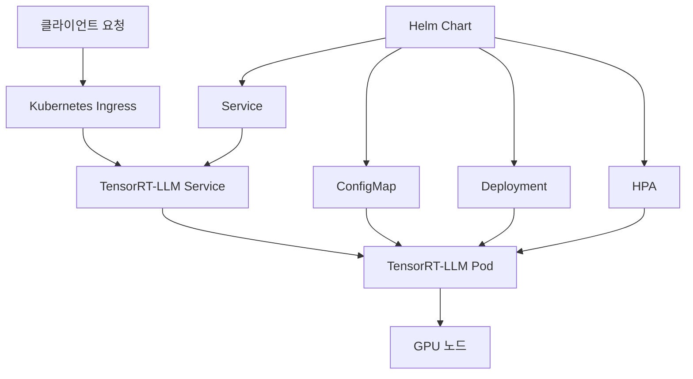

## 개요

NVIDIA TensorRT-LLM은 GPU에서 대규모 언어 모델(LLM) 추론을 최적화하는 오픈소스 라이브러리입니다. 이 가이드에서는 [NVIDIA TensorRT-LLM](https://github.com/NVIDIA/TensorRT-LLM)을 활용하여 프로덕션 환경에서 고성능 LLM 서비스를 구축하는 전체 과정을 다룹니다.

### TensorRT-LLM의 주요 특징

- **최적화된 성능**: 커스텀 어텐션 커널, 인플라이트 배칭, 페이지드 KV 캐싱
- **다양한 양자화**: FP8, FP4, INT4 AWQ, INT8 SmoothQuant 지원
- **PyTorch 백엔드**: 빠른 개발 및 실험을 위한 유연한 워크플로우
- **확장성**: 단일 GPU부터 멀티노드 배포까지 지원

## 시스템 아키텍처



## 환경 요구사항

### 하드웨어 요구사항
- NVIDIA GPU (Compute Capability 7.0+)
- CUDA 12.4+
- 최소 16GB GPU 메모리 (모델에 따라 다름)

### 소프트웨어 요구사항
- Docker 20.10+
- Kubernetes 1.24+
- Helm 3.8+
- NVIDIA Container Toolkit

## 단계 1: 개발 환경 설정

### 1.1 프로젝트 초기화

```bash
# 프로젝트 디렉토리 생성
mkdir tensorrt-llm-deployment
cd tensorrt-llm-deployment

# 디렉토리 구조 생성
mkdir -p {docker,helm,scripts,configs}
```

### 1.2 TensorRT-LLM 설치 및 테스트

```bash
# Python 환경 설정
python -m venv tensorrt-env
source tensorrt-env/bin/activate

# TensorRT-LLM 설치
pip install tensorrt-llm --extra-index-url https://pypi.nvidia.com
```

### 1.3 기본 추론 테스트

```python
# test_inference.py
import torch
from tensorrt_llm import LLM, SamplingParams

def test_basic_inference():
    """기본 추론 테스트"""
    
    # LLM 초기화 (예: Llama-2-7B)
    llm = LLM(
        model="meta-llama/Llama-2-7b-chat-hf",
        tensor_parallel_size=1,
        dtype="float16"
    )
    
    # 샘플링 파라미터 설정
    sampling_params = SamplingParams(
        temperature=0.8,
        top_p=0.95,
        max_tokens=512
    )
    
    # 추론 실행
    prompts = ["Hello, how are you?", "What is machine learning?"]
    outputs = llm.generate(prompts, sampling_params)
    
    for output in outputs:
        print(f"Prompt: {output.prompt}")
        print(f"Generated: {output.outputs[0].text}")
        print("-" * 50)

if __name__ == "__main__":
    test_basic_inference()
```

## 단계 2: 최적화된 Docker 이미지 구축

### 2.1 멀티스테이지 Dockerfile

```dockerfile
# docker/Dockerfile
# Stage 1: Build stage
FROM nvcr.io/nvidia/tensorrt:24.02-py3 as builder

WORKDIR /workspace

# 시스템 의존성 설치
RUN apt-get update && apt-get install -y \
    python3-pip \
    python3-dev \
    build-essential \
    cmake \
    git \
    && rm -rf /var/lib/apt/lists/*

# Python 의존성 설치
COPY requirements.txt .
RUN pip install --no-cache-dir -r requirements.txt

# TensorRT-LLM 설치
RUN pip install --no-cache-dir tensorrt-llm \
    --extra-index-url https://pypi.nvidia.com

# Stage 2: Runtime stage
FROM nvcr.io/nvidia/cuda:12.4-runtime-ubuntu22.04

WORKDIR /app

# 런타임 의존성만 설치
RUN apt-get update && apt-get install -y \
    python3 \
    python3-pip \
    libcudnn8 \
    && rm -rf /var/lib/apt/lists/* \
    && apt-get clean

# 빌드 스테이지에서 Python 환경 복사
COPY --from=builder /usr/local/lib/python3.10/dist-packages /usr/local/lib/python3.10/dist-packages
COPY --from=builder /usr/local/bin /usr/local/bin

# 애플리케이션 코드 복사
COPY src/ ./src/
COPY configs/ ./configs/

# 환경 변수 설정
ENV PYTHONPATH=/app
ENV CUDA_VISIBLE_DEVICES=0

# 비루트 사용자 생성
RUN groupadd -r tensorrt && useradd -r -g tensorrt tensorrt
RUN chown -R tensorrt:tensorrt /app
USER tensorrt

# 헬스체크 추가
HEALTHCHECK --interval=30s --timeout=10s --start-period=60s --retries=3 \
    CMD python3 -c "import requests; requests.get('http://localhost:8000/health')"

EXPOSE 8000

CMD ["python3", "src/server.py"]
```

### 2.2 의존성 파일

```txt
# requirements.txt
fastapi==0.104.1
uvicorn[standard]==0.24.0
pydantic==2.5.0
torch==2.1.0
transformers==4.36.0
accelerate==0.24.1
numpy==1.24.3
```

### 2.3 FastAPI 서버 구현

```python
# src/server.py
from fastapi import FastAPI, HTTPException
from pydantic import BaseModel
from typing import List, Optional
import torch
import logging
import os
from tensorrt_llm import LLM, SamplingParams

# 로깅 설정
logging.basicConfig(level=logging.INFO)
logger = logging.getLogger(__name__)

app = FastAPI(title="TensorRT-LLM API Server", version="1.0.0")

class GenerationRequest(BaseModel):
    prompt: str
    max_tokens: int = 512
    temperature: float = 0.8
    top_p: float = 0.95
    stream: bool = False

class GenerationResponse(BaseModel):
    text: str
    tokens_used: int
    latency_ms: float

class TensorRTLLMService:
    def __init__(self):
        self.model = None
        self.load_model()
    
    def load_model(self):
        """모델 로드"""
        try:
            model_path = os.getenv("MODEL_PATH", "meta-llama/Llama-2-7b-chat-hf")
            tensor_parallel_size = int(os.getenv("TENSOR_PARALLEL_SIZE", "1"))
            
            logger.info(f"Loading model: {model_path}")
            
            self.model = LLM(
                model=model_path,
                tensor_parallel_size=tensor_parallel_size,
                dtype="float16",
                trust_remote_code=True
            )
            
            logger.info("Model loaded successfully")
            
        except Exception as e:
            logger.error(f"Failed to load model: {e}")
            raise
    
    def generate(self, request: GenerationRequest) -> GenerationResponse:
        """텍스트 생성"""
        import time
        
        start_time = time.time()
        
        sampling_params = SamplingParams(
            temperature=request.temperature,
            top_p=request.top_p,
            max_tokens=request.max_tokens
        )
        
        outputs = self.model.generate([request.prompt], sampling_params)
        
        end_time = time.time()
        latency_ms = (end_time - start_time) * 1000
        
        generated_text = outputs[0].outputs[0].text
        tokens_used = len(outputs[0].outputs[0].token_ids)
        
        return GenerationResponse(
            text=generated_text,
            tokens_used=tokens_used,
            latency_ms=latency_ms
        )

# 전역 서비스 인스턴스
service = TensorRTLLMService()

@app.get("/health")
async def health_check():
    """헬스 체크"""
    return {"status": "healthy", "model_loaded": service.model is not None}

@app.post("/generate", response_model=GenerationResponse)
async def generate_text(request: GenerationRequest):
    """텍스트 생성 API"""
    try:
        response = service.generate(request)
        return response
    except Exception as e:
        logger.error(f"Generation failed: {e}")
        raise HTTPException(status_code=500, detail=str(e))

@app.get("/metrics")
async def get_metrics():
    """메트릭 정보"""
    gpu_memory = torch.cuda.memory_allocated() if torch.cuda.is_available() else 0
    return {
        "gpu_memory_used": gpu_memory,
        "gpu_available": torch.cuda.is_available(),
        "gpu_count": torch.cuda.device_count()
    }

if __name__ == "__main__":
    import uvicorn
    uvicorn.run(app, host="0.0.0.0", port=8000)
```

### 2.4 Docker 이미지 빌드

```bash
# scripts/build-docker.sh
#!/bin/bash

set -e

# 환경 변수
IMAGE_NAME="tensorrt-llm-server"
TAG=${1:-"latest"}
REGISTRY=${REGISTRY:-"your-registry.com"}

echo "Building TensorRT-LLM Docker image..."

# Docker 빌드
docker build \
    -t ${IMAGE_NAME}:${TAG} \
    -f docker/Dockerfile \
    .

# 이미지 크기 확인
echo "Image size:"
docker images ${IMAGE_NAME}:${TAG}

# 레지스트리에 푸시 (옵션)
if [ "$PUSH" = "true" ]; then
    echo "Pushing to registry..."
    docker tag ${IMAGE_NAME}:${TAG} ${REGISTRY}/${IMAGE_NAME}:${TAG}
    docker push ${REGISTRY}/${IMAGE_NAME}:${TAG}
fi

echo "Build completed successfully!"
```

## 단계 3: Helm Chart 구성

### 3.1 Chart 구조 생성

```bash
# Helm Chart 생성
helm create helm/tensorrt-llm
cd helm/tensorrt-llm

# 불필요한 파일 제거
rm -rf templates/tests
rm templates/hpa.yaml templates/ingress.yaml
```

### 3.2 Values 파일 구성

```yaml
# helm/tensorrt-llm/values.yaml
replicaCount: 1

image:
  repository: tensorrt-llm-server
  pullPolicy: IfNotPresent
  tag: "latest"

nameOverride: ""
fullnameOverride: ""

serviceAccount:
  create: true
  annotations: {}
  name: ""

podAnnotations: {}

podSecurityContext:
  fsGroup: 1000

securityContext:
  capabilities:
    drop:
    - ALL
  readOnlyRootFilesystem: false
  runAsNonRoot: true
  runAsUser: 1000

service:
  type: ClusterIP
  port: 8000

ingress:
  enabled: false
  className: ""
  annotations: {}
  hosts:
    - host: tensorrt-llm.local
      paths:
        - path: /
          pathType: Prefix
  tls: []

resources:
  limits:
    nvidia.com/gpu: 1
    memory: 16Gi
    cpu: 4
  requests:
    nvidia.com/gpu: 1
    memory: 8Gi
    cpu: 2

autoscaling:
  enabled: true
  minReplicas: 1
  maxReplicas: 5
  targetCPUUtilizationPercentage: 70
  targetMemoryUtilizationPercentage: 80

nodeSelector:
  accelerator: nvidia-tesla-v100

tolerations:
  - key: nvidia.com/gpu
    operator: Exists
    effect: NoSchedule

affinity:
  nodeAffinity:
    requiredDuringSchedulingIgnoredDuringExecution:
      nodeSelectorTerms:
      - matchExpressions:
        - key: accelerator
          operator: In
          values:
          - nvidia-tesla-v100
          - nvidia-tesla-a100

# TensorRT-LLM 특정 설정
tensorrtllm:
  model:
    path: "meta-llama/Llama-2-7b-chat-hf"
    tensorParallelSize: 1
  
  inference:
    maxTokens: 512
    temperature: 0.8
    topP: 0.95

# 모니터링 설정
monitoring:
  enabled: true
  serviceMonitor:
    enabled: true
    interval: 30s
  
# 로깅 설정
logging:
  level: INFO
  format: json
```

### 3.3 Deployment 템플릿


```yaml
# helm/tensorrt-llm/templates/deployment.yaml
apiVersion: apps/v1
kind: Deployment
metadata:
  name: {{ include "tensorrt-llm.fullname" . }}
  labels:
    {{- include "tensorrt-llm.labels" . | nindent 4 }}
spec:
  {{- if not .Values.autoscaling.enabled }}
  replicas: {{ .Values.replicaCount }}
  {{- end }}
  selector:
    matchLabels:
      {{- include "tensorrt-llm.selectorLabels" . | nindent 6 }}
  template:
    metadata:
      {{- with .Values.podAnnotations }}
      annotations:
        {{- toYaml . | nindent 8 }}
      {{- end }}
      labels:
        {{- include "tensorrt-llm.selectorLabels" . | nindent 8 }}
    spec:
      {{- with .Values.imagePullSecrets }}
      imagePullSecrets:
        {{- toYaml . | nindent 8 }}
      {{- end }}
      serviceAccountName: {{ include "tensorrt-llm.serviceAccountName" . }}
      securityContext:
        {{- toYaml .Values.podSecurityContext | nindent 8 }}
      containers:
        - name: {{ .Chart.Name }}
          securityContext:
            {{- toYaml .Values.securityContext | nindent 12 }}
          image: "{{ .Values.image.repository }}:{{ .Values.image.tag | default .Chart.AppVersion }}"
          imagePullPolicy: {{ .Values.image.pullPolicy }}
          ports:
            - name: http
              containerPort: 8000
              protocol: TCP
          env:
            - name: MODEL_PATH
              value: {{ .Values.tensorrtllm.model.path | quote }}
            - name: TENSOR_PARALLEL_SIZE
              value: {{ .Values.tensorrtllm.model.tensorParallelSize | quote }}
            - name: MAX_TOKENS
              value: {{ .Values.tensorrtllm.inference.maxTokens | quote }}
            - name: TEMPERATURE
              value: {{ .Values.tensorrtllm.inference.temperature | quote }}
            - name: TOP_P
              value: {{ .Values.tensorrtllm.inference.topP | quote }}
            - name: LOG_LEVEL
              value: {{ .Values.logging.level | quote }}
          livenessProbe:
            httpGet:
              path: /health
              port: http
            initialDelaySeconds: 120
            periodSeconds: 30
            timeoutSeconds: 10
            failureThreshold: 3
          readinessProbe:
            httpGet:
              path: /health
              port: http
            initialDelaySeconds: 60
            periodSeconds: 10
            timeoutSeconds: 5
            failureThreshold: 3
          resources:
            {{- toYaml .Values.resources | nindent 12 }}
          volumeMounts:
            - name: model-cache
              mountPath: /root/.cache
            - name: tmp
              mountPath: /tmp
      volumes:
        - name: model-cache
          emptyDir:
            sizeLimit: 50Gi
        - name: tmp
          emptyDir: {}
      {{- with .Values.nodeSelector }}
      nodeSelector:
        {{- toYaml . | nindent 8 }}
      {{- end }}
      {{- with .Values.affinity }}
      affinity:
        {{- toYaml . | nindent 8 }}
      {{- end }}
      {{- with .Values.tolerations }}
      tolerations:
        {{- toYaml . | nindent 8 }}
      {{- end }}
```


### 3.4 HPA 구성


```yaml
# helm/tensorrt-llm/templates/hpa.yaml
{{- if .Values.autoscaling.enabled }}
apiVersion: autoscaling/v2
kind: HorizontalPodAutoscaler
metadata:
  name: {{ include "tensorrt-llm.fullname" . }}
  labels:
    {{- include "tensorrt-llm.labels" . | nindent 4 }}
spec:
  scaleTargetRef:
    apiVersion: apps/v1
    kind: Deployment
    name: {{ include "tensorrt-llm.fullname" . }}
  minReplicas: {{ .Values.autoscaling.minReplicas }}
  maxReplicas: {{ .Values.autoscaling.maxReplicas }}
  metrics:
    {{- if .Values.autoscaling.targetCPUUtilizationPercentage }}
    - type: Resource
      resource:
        name: cpu
        target:
          type: Utilization
          averageUtilization: {{ .Values.autoscaling.targetCPUUtilizationPercentage }}
    {{- end }}
    {{- if .Values.autoscaling.targetMemoryUtilizationPercentage }}
    - type: Resource
      resource:
        name: memory
        target:
          type: Utilization
          averageUtilization: {{ .Values.autoscaling.targetMemoryUtilizationPercentage }}
    {{- end }}
{{- end }}
```


### 3.5 ServiceMonitor 구성


```yaml
# helm/tensorrt-llm/templates/servicemonitor.yaml
{{- if and .Values.monitoring.enabled .Values.monitoring.serviceMonitor.enabled }}
apiVersion: monitoring.coreos.com/v1
kind: ServiceMonitor
metadata:
  name: {{ include "tensorrt-llm.fullname" . }}
  labels:
    {{- include "tensorrt-llm.labels" . | nindent 4 }}
spec:
  selector:
    matchLabels:
      {{- include "tensorrt-llm.selectorLabels" . | nindent 6 }}
  endpoints:
  - port: http
    path: /metrics
    interval: {{ .Values.monitoring.serviceMonitor.interval }}
{{- end }}
```


## 단계 4: Kubernetes 클러스터 준비

### 4.1 GPU 노드 설정

```bash
# scripts/setup-gpu-nodes.sh
#!/bin/bash

echo "Setting up GPU nodes for Kubernetes..."

# NVIDIA Container Toolkit 설치
curl -fsSL https://nvidia.github.io/libnvidia-container/gpgkey | sudo gpg --dearmor -o /usr/share/keyrings/nvidia-container-toolkit-keyring.gpg
curl -s -L https://nvidia.github.io/libnvidia-container/stable/deb/nvidia-container-toolkit.list | \
    sed 's#deb https://#deb [signed-by=/usr/share/keyrings/nvidia-container-toolkit-keyring.gpg] https://#g' | \
    sudo tee /etc/apt/sources.list.d/nvidia-container-toolkit.list

sudo apt-get update
sudo apt-get install -y nvidia-container-toolkit

# Docker 설정
sudo nvidia-ctk runtime configure --runtime=docker
sudo systemctl restart docker

# NVIDIA Device Plugin 설치
kubectl apply -f https://raw.githubusercontent.com/NVIDIA/k8s-device-plugin/v0.14.0/nvidia-device-plugin.yml

echo "GPU nodes setup completed!"
```

### 4.2 네임스페이스 및 RBAC 설정

```yaml
# configs/namespace.yaml
apiVersion: v1
kind: Namespace
metadata:
  name: tensorrt-llm
  labels:
    name: tensorrt-llm
---
apiVersion: v1
kind: ResourceQuota
metadata:
  name: tensorrt-llm-quota
  namespace: tensorrt-llm
spec:
  hard:
    requests.nvidia.com/gpu: "4"
    limits.nvidia.com/gpu: "4"
    requests.memory: "64Gi"
    limits.memory: "128Gi"
```

## 단계 5: 배포 및 운영

### 5.1 배포 스크립트

```bash
# scripts/deploy.sh
#!/bin/bash

set -e

NAMESPACE=${NAMESPACE:-"tensorrt-llm"}
RELEASE_NAME=${RELEASE_NAME:-"tensorrt-llm"}
VALUES_FILE=${VALUES_FILE:-"values.yaml"}

echo "Deploying TensorRT-LLM to Kubernetes..."

# 네임스페이스 생성
kubectl apply -f configs/namespace.yaml

# Helm 배포
helm upgrade --install ${RELEASE_NAME} ./helm/tensorrt-llm \
    --namespace ${NAMESPACE} \
    --values helm/tensorrt-llm/${VALUES_FILE} \
    --wait \
    --timeout 10m

# 배포 상태 확인
kubectl get pods -n ${NAMESPACE}
kubectl get svc -n ${NAMESPACE}

echo "Deployment completed successfully!"

# 서비스 테스트
echo "Testing service..."
kubectl port-forward -n ${NAMESPACE} svc/${RELEASE_NAME} 8000:8000 &
PF_PID=$!

sleep 5

curl -X POST "http://localhost:8000/generate" \
    -H "Content-Type: application/json" \
    -d '{"prompt": "Hello, how are you?", "max_tokens": 100}'

kill $PF_PID

echo "Service test completed!"
```

### 5.2 모니터링 설정

```yaml
# configs/grafana-dashboard.yaml
apiVersion: v1
kind: ConfigMap
metadata:
  name: tensorrt-llm-dashboard
  namespace: monitoring
data:
  dashboard.json: |
    {
      "dashboard": {
        "title": "TensorRT-LLM Metrics",
        "panels": [
          {
            "title": "GPU Memory Usage",
            "type": "graph",
            "targets": [
              {
                "expr": "gpu_memory_used_bytes / gpu_memory_total_bytes * 100"
              }
            ]
          },
          {
            "title": "Request Latency",
            "type": "graph",
            "targets": [
              {
                "expr": "histogram_quantile(0.95, rate(http_request_duration_seconds_bucket[5m]))"
              }
            ]
          },
          {
            "title": "Throughput (Requests/sec)",
            "type": "graph",
            "targets": [
              {
                "expr": "rate(http_requests_total[5m])"
              }
            ]
          }
        ]
      }
    }
```

### 5.3 로드 테스트

```python
# scripts/load_test.py
import asyncio
import aiohttp
import time
import json
from typing import List

class LoadTester:
    def __init__(self, base_url: str):
        self.base_url = base_url
        self.results = []
    
    async def send_request(self, session: aiohttp.ClientSession, prompt: str):
        """단일 요청 전송"""
        start_time = time.time()
        
        try:
            async with session.post(
                f"{self.base_url}/generate",
                json={
                    "prompt": prompt,
                    "max_tokens": 100,
                    "temperature": 0.8
                }
            ) as response:
                result = await response.json()
                end_time = time.time()
                
                self.results.append({
                    "success": True,
                    "latency": end_time - start_time,
                    "tokens": result.get("tokens_used", 0)
                })
                
        except Exception as e:
            end_time = time.time()
            self.results.append({
                "success": False,
                "latency": end_time - start_time,
                "error": str(e)
            })
    
    async def run_load_test(self, concurrent_users: int, requests_per_user: int):
        """로드 테스트 실행"""
        prompts = [
            "What is artificial intelligence?",
            "Explain machine learning in simple terms.",
            "How does neural network work?",
            "What are the benefits of cloud computing?",
            "Describe the future of AI technology."
        ]
        
        async with aiohttp.ClientSession() as session:
            tasks = []
            
            for user in range(concurrent_users):
                for req in range(requests_per_user):
                    prompt = prompts[req % len(prompts)]
                    task = self.send_request(session, prompt)
                    tasks.append(task)
            
            await asyncio.gather(*tasks)
    
    def print_results(self):
        """결과 출력"""
        successful = [r for r in self.results if r["success"]]
        failed = [r for r in self.results if not r["success"]]
        
        if successful:
            latencies = [r["latency"] for r in successful]
            tokens = [r["tokens"] for r in successful]
            
            print(f"Total requests: {len(self.results)}")
            print(f"Successful: {len(successful)}")
            print(f"Failed: {len(failed)}")
            print(f"Success rate: {len(successful)/len(self.results)*100:.2f}%")
            print(f"Average latency: {sum(latencies)/len(latencies):.2f}s")
            print(f"Min latency: {min(latencies):.2f}s")
            print(f"Max latency: {max(latencies):.2f}s")
            print(f"Average tokens: {sum(tokens)/len(tokens):.2f}")

async def main():
    tester = LoadTester("http://localhost:8000")
    
    print("Starting load test...")
    await tester.run_load_test(concurrent_users=10, requests_per_user=5)
    
    print("\nLoad test results:")
    tester.print_results()

if __name__ == "__main__":
    asyncio.run(main())
```

## 단계 6: 운영 및 최적화

### 6.1 성능 튜닝

```yaml
# configs/performance-values.yaml
# 고성능 설정을 위한 values 오버라이드
resources:
  limits:
    nvidia.com/gpu: 2
    memory: 32Gi
    cpu: 8
  requests:
    nvidia.com/gpu: 2
    memory: 16Gi
    cpu: 4

tensorrtllm:
  model:
    tensorParallelSize: 2
  
  inference:
    batchSize: 32
    maxSequenceLength: 2048

# 노드 어피니티 최적화
affinity:
  podAntiAffinity:
    preferredDuringSchedulingIgnoredDuringExecution:
    - weight: 100
      podAffinityTerm:
        labelSelector:
          matchExpressions:
          - key: app.kubernetes.io/name
            operator: In
            values:
            - tensorrt-llm
        topologyKey: kubernetes.io/hostname
```

### 6.2 자동 스케일링 설정

```yaml
# configs/custom-metrics-hpa.yaml
apiVersion: autoscaling/v2
kind: HorizontalPodAutoscaler
metadata:
  name: tensorrt-llm-custom-hpa
  namespace: tensorrt-llm
spec:
  scaleTargetRef:
    apiVersion: apps/v1
    kind: Deployment
    name: tensorrt-llm
  minReplicas: 2
  maxReplicas: 10
  metrics:
  - type: Pods
    pods:
      metric:
        name: gpu_utilization
      target:
        type: AverageValue
        averageValue: "70"
  - type: Pods
    pods:
      metric:
        name: queue_length
      target:
        type: AverageValue
        averageValue: "5"
```

### 6.3 백업 및 복구

```bash
# scripts/backup.sh
#!/bin/bash

NAMESPACE="tensorrt-llm"
BACKUP_DIR="./backups/$(date +%Y%m%d_%H%M%S)"

mkdir -p ${BACKUP_DIR}

echo "Creating backup..."

# Helm values 백업
helm get values tensorrt-llm -n ${NAMESPACE} > ${BACKUP_DIR}/values.yaml

# ConfigMaps 백업
kubectl get configmaps -n ${NAMESPACE} -o yaml > ${BACKUP_DIR}/configmaps.yaml

# Secrets 백업
kubectl get secrets -n ${NAMESPACE} -o yaml > ${BACKUP_DIR}/secrets.yaml

# PVC 백업 (있는 경우)
kubectl get pvc -n ${NAMESPACE} -o yaml > ${BACKUP_DIR}/pvc.yaml

echo "Backup completed: ${BACKUP_DIR}"
```

## 트러블슈팅

### 일반적인 문제들

1. **GPU 리소스 부족**
```bash
# GPU 사용량 확인
kubectl describe nodes | grep -A 5 "nvidia.com/gpu"

# Pod GPU 할당 확인
kubectl get pods -n tensorrt-llm -o custom-columns=NAME:.metadata.name,GPU:.spec.containers[0].resources.requests.'nvidia\.com/gpu'
```

2. **메모리 부족 오류**
```bash
# 메모리 사용량 모니터링
kubectl top pods -n tensorrt-llm

# OOMKilled 이벤트 확인
kubectl get events -n tensorrt-llm --field-selector reason=OOMKilling
```

3. **모델 로딩 실패**
```bash
# Pod 로그 확인
kubectl logs -n tensorrt-llm deployment/tensorrt-llm -f

# 초기화 컨테이너 추가
initContainers:
- name: model-downloader
  image: busybox
  command: ['sh', '-c', 'echo "Preparing model cache..."']
```

## 보안 고려사항

### 1. 네트워크 정책

```yaml
# configs/network-policy.yaml
apiVersion: networking.k8s.io/v1
kind: NetworkPolicy
metadata:
  name: tensorrt-llm-policy
  namespace: tensorrt-llm
spec:
  podSelector:
    matchLabels:
      app.kubernetes.io/name: tensorrt-llm
  policyTypes:
  - Ingress
  - Egress
  ingress:
  - from:
    - namespaceSelector:
        matchLabels:
          name: ingress-nginx
    ports:
    - protocol: TCP
      port: 8000
  egress:
  - to: []
    ports:
    - protocol: TCP
      port: 443  # HTTPS
    - protocol: TCP
      port: 80   # HTTP
```

### 2. Pod Security Standards

```yaml
# configs/pod-security.yaml
apiVersion: v1
kind: Namespace
metadata:
  name: tensorrt-llm
  labels:
    pod-security.kubernetes.io/enforce: restricted
    pod-security.kubernetes.io/audit: restricted
    pod-security.kubernetes.io/warn: restricted
```

## 결론

이 가이드에서는 NVIDIA TensorRT-LLM을 활용하여 고성능 LLM 추론 서비스를 구축하는 전체 과정을 다뤘습니다. 

### 주요 성과
- **최적화된 Docker 이미지**: 멀티스테이지 빌드로 이미지 크기 최소화
- **확장 가능한 아키텍처**: Kubernetes와 Helm을 활용한 자동 스케일링
- **프로덕션 준비**: 모니터링, 로깅, 보안 설정 포함
- **성능 최적화**: GPU 리소스 효율적 활용

### 다음 단계
1. **모델 최적화**: 양자화 및 압축 기법 적용
2. **멀티 모델 서빙**: 여러 모델 동시 서비스
3. **A/B 테스팅**: 모델 버전 비교 및 점진적 배포
4. **비용 최적화**: Spot 인스턴스 활용 및 리소스 스케줄링

[NVIDIA TensorRT-LLM](https://github.com/NVIDIA/TensorRT-LLM)을 활용하면 기존 대비 최대 4배 빠른 추론 성능을 달성할 수 있습니다. 이 가이드를 바탕으로 여러분만의 고성능 LLM 서비스를 구축해보세요. 