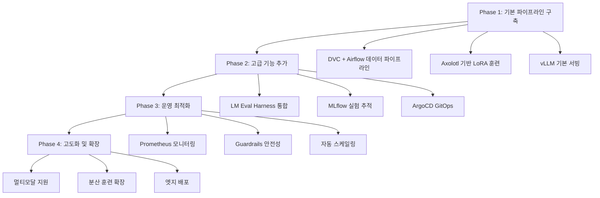

## 개요

완전한 오픈소스 스택으로 구성된 엔터프라이즈급 LLMOps 파이프라인을 구축할 수 있습니다. 이 가이드는 Hugging Face Transformers, vLLM, MLflow, ArgoCD 등을 활용해 데이터 전처리부터 모델 서빙까지 전체 AI 플라이휠을 구현하는 방법을 다룹니다.

## 오픈소스 LLMOps 아키텍처

### 1. 전체 아키텍처 개요

```
Data Sources → DVC + Airflow → Axolotl/Unsloth → LM Eval → vLLM → Production
     ↓              ↓              ↓            ↓        ↓         ↓
  Git Repo    → GitOps/ArgoCD → MLflow Track → Guardrails → Kubernetes
```

### 2. 스택 구성 요소

| 기능 영역 | NVIDIA | 오픈소스 대안 |
|-----------|---------------|--------------|
| 데이터 큐레이션 | NeMo Curator | DVC + Apache Airflow |
| 모델 훈련 | NeMo Customizer | Axolotl + Unsloth |
| 모델 평가 | NeMo Evaluator | LM Evaluation Harness |
| 모델 서빙 | NIM | vLLM + Text Generation Inference |
| 오케스트레이션 | DGX Cloud | Kubernetes + ArgoCD |
| 실험 추적 | 독점 솔루션 | MLflow + Weights & Biases |
| 안전성 보장 | NeMo Guardrails | Guardrails AI + NLTK |

## 파이프라인 구성 요소별 상세 가이드

### 1. 데이터 파이프라인: DVC + Apache Airflow

#### DVC를 활용한 데이터 버전 관리

```yaml
# dvc.yaml
stages:
  data_preprocessing:
    cmd: python src/data/preprocess.py
    deps:
    - src/data/preprocess.py
    - data/raw/
    outs:
    - data/processed/
    
  data_validation:
    cmd: python src/data/validate.py
    deps:
    - src/data/validate.py
    - data/processed/
    outs:
    - data/validated/
```

#### Airflow DAG 구성

```python
# airflow_dags/llmops_pipeline.py
from airflow import DAG
from airflow.operators.bash import BashOperator
from datetime import datetime, timedelta

default_args = {
    'owner': 'llmops-team',
    'depends_on_past': False,
    'start_date': datetime(2025, 6, 25),
    'retries': 1,
    'retry_delay': timedelta(minutes=5)
}

dag = DAG(
    'llmops_pipeline',
    default_args=default_args,
    description='Open Source LLMOps Pipeline',
    schedule_interval='@daily',
    catchup=False
)

data_preprocess = BashOperator(
    task_id='data_preprocess',
    bash_command='cd /workspace && dvc repro data_preprocessing',
    dag=dag
)

model_training = BashOperator(
    task_id='model_training',
    bash_command='cd /workspace && python -m axolotl.cli.train config/llama3_lora.yml',
    dag=dag
)

data_preprocess >> model_training
```

### 2. 모델 훈련: Axolotl + Unsloth

#### Axolotl 설정 파일

```yaml
# config/llama3_lora.yml
base_model: meta-llama/Llama-3.1-8B-Instruct
model_type: LlamaForCausalLM
tokenizer_type: LlamaTokenizer

load_in_8bit: false
load_in_4bit: true
strict: false

datasets:
  - path: datasets/custom_dataset
    type: sharegpt
    conversation: llama-3

dataset_prepared_path: last_run_prepared
val_set_size: 0.1
output_dir: ./outputs/llama3-lora

adapter: lora
lora_model_dir:
lora_r: 32
lora_alpha: 16
lora_dropout: 0.05
lora_target_linear: true
lora_fan_in_fan_out:

wandb_project: llmops-training
wandb_entity: your-team
wandb_watch:
wandb_name:
wandb_log_model:

sequence_len: 4096
sample_packing: true
pad_to_sequence_len: true

gradient_accumulation_steps: 4
micro_batch_size: 2
num_epochs: 3
optimizer: adamw_bnb_8bit
lr_scheduler: cosine
learning_rate: 0.0002

train_on_inputs: false
group_by_length: false
bf16: auto
fp16:
tf32: false

gradient_checkpointing: true
early_stopping_patience:
resume_from_checkpoint:
local_rank:

logging_steps: 1
xformers_attention:
flash_attention: true

warmup_steps: 10
evals_per_epoch: 4
eval_table_size:
saves_per_epoch: 1
debug:
deepspeed:
weight_decay: 0.0
fsdp:
fsdp_config:
special_tokens:
```

#### Unsloth를 활용한 고속 훈련

```python
# src/training/unsloth_trainer.py
from unsloth import FastLanguageModel
import torch

def setup_unsloth_model():
    model, tokenizer = FastLanguageModel.from_pretrained(
        model_name="meta-llama/Llama-3.1-8B-Instruct",
        max_seq_length=4096,
        dtype=None,
        load_in_4bit=True,
    )
    
    model = FastLanguageModel.get_peft_model(
        model,
        r=16,
        target_modules=["q_proj", "k_proj", "v_proj", "o_proj",
                      "gate_proj", "up_proj", "down_proj"],
        lora_alpha=16,
        lora_dropout=0,
        bias="none",
        use_gradient_checkpointing="unsloth",
        random_state=3407,
        use_rslora=False,
        loftq_config=None,
    )
    
    return model, tokenizer

def train_model(model, tokenizer, dataset):
    from trl import SFTTrainer
    from transformers import TrainingArguments
    
    trainer = SFTTrainer(
        model=model,
        tokenizer=tokenizer,
        train_dataset=dataset,
        dataset_text_field="text",
        max_seq_length=4096,
        dataset_num_proc=2,
        packing=False,
        args=TrainingArguments(
            per_device_train_batch_size=2,
            gradient_accumulation_steps=4,
            warmup_steps=5,
            max_steps=60,
            learning_rate=2e-4,
            fp16=not torch.cuda.is_bf16_supported(),
            bf16=torch.cuda.is_bf16_supported(),
            logging_steps=1,
            optim="adamw_8bit",
            weight_decay=0.01,
            lr_scheduler_type="linear",
            seed=3407,
            output_dir="outputs",
        ),
    )
    
    trainer.train()
    return trainer
```

### 3. 모델 평가: LM Evaluation Harness

#### 평가 설정 파일

```yaml
# eval_config.yaml
model_args: "pretrained=./outputs/llama3-lora,dtype=float16"
tasks: 
  - gsm8k
  - arc_easy
  - arc_challenge
  - hellaswag
  - winogrande
  - piqa
  - custom_domain_qa

num_fewshot: 5
batch_size: 8
device: cuda
output_path: ./eval_results/
```

#### 커스텀 평가 태스크

```python
# src/evaluation/custom_tasks.py
from lm_eval.api.task import ConfigurableTask
from lm_eval.api.instance import Instance

class CustomDomainQA(ConfigurableTask):
    VERSION = 0
    DATASET_PATH = "datasets/domain_qa"
    DATASET_NAME = None
    
    def has_training_docs(self):
        return False
    
    def has_validation_docs(self):
        return True
    
    def has_test_docs(self):
        return True
    
    def validation_docs(self):
        return self._load_docs("validation")
    
    def test_docs(self):
        return self._load_docs("test")
    
    def _load_docs(self, split):
        # 커스텀 데이터셋 로딩 로직
        pass
    
    def doc_to_text(self, doc):
        return f"Question: {doc['question']}\nAnswer:"
    
    def doc_to_target(self, doc):
        return doc['answer']
    
    def construct_requests(self, doc, ctx, **kwargs):
        return [Instance(
            request_type="generate_until",
            doc=doc,
            arguments=(ctx, {"until": ["\n"], "max_gen_toks": 256}),
        )]
    
    def process_results(self, doc, results):
        pred = results[0].strip()
        target = self.doc_to_target(doc)
        
        # 도메인별 정확도 계산 로직
        exact_match = pred.lower() == target.lower()
        
        return {
            "exact_match": exact_match,
            "prediction": pred,
            "target": target
        }
    
    def aggregation(self):
        return {
            "exact_match": "mean",
        }
    
    def higher_is_better(self):
        return {
            "exact_match": True,
        }
```

### 4. LLM-as-a-Judge 평가 시스템

```python
# src/evaluation/llm_judge.py
from transformers import pipeline
import json

class LLMJudge:
    def __init__(self, judge_model="meta-llama/Llama-3.1-8B-Instruct"):
        self.judge = pipeline(
            "text-generation",
            model=judge_model,
            torch_dtype=torch.float16,
            device_map="auto"
        )
    
    def evaluate_response(self, question, response, criteria):
        prompt = f"""
        다음 질문에 대한 응답을 평가해주세요:

        질문: {question}
        응답: {response}

        평가 기준:
        {criteria}

        1-10점 척도로 평가하고 이유를 설명해주세요.
        
        평가:
        점수: 
        이유:
        """
        
        result = self.judge(prompt, max_length=512, temperature=0.1)
        return self._parse_evaluation(result[0]['generated_text'])
    
    def _parse_evaluation(self, text):
        # 평가 결과 파싱 로직
        lines = text.split('\n')
        score_line = [l for l in lines if l.startswith('점수:')]
        reason_lines = [l for l in lines if l.startswith('이유:')]
        
        score = None
        if score_line:
            try:
                score = int(score_line[0].split(':')[1].strip())
            except:
                score = 5  # 기본값
        
        reason = reason_lines[0].split(':')[1].strip() if reason_lines else ""
        
        return {"score": score, "reason": reason}

def run_llm_judge_evaluation(test_data, model_responses):
    judge = LLMJudge()
    results = []
    
    for item in test_data:
        question = item['question']
        expected = item['answer']
        response = model_responses[item['id']]
        
        criteria = """
        1. 정확성: 답변이 사실적으로 올바른가?
        2. 완전성: 질문에 완전히 답변했는가?
        3. 명확성: 답변이 이해하기 쉬운가?
        4. 관련성: 질문과 관련된 답변인가?
        """
        
        evaluation = judge.evaluate_response(question, response, criteria)
        
        results.append({
            "question": question,
            "response": response,
            "expected": expected,
            "evaluation": evaluation
        })
    
    return results
```

### 5. 모델 서빙: vLLM + Kubernetes

#### vLLM 서빙 설정

```python
# src/serving/vllm_server.py
from vllm import LLM, SamplingParams
from fastapi import FastAPI
from pydantic import BaseModel
import uvicorn

app = FastAPI()

# vLLM 모델 로드
llm = LLM(
    model="./outputs/llama3-lora",
    tensor_parallel_size=1,
    gpu_memory_utilization=0.9,
    max_model_len=4096,
    quantization="bitsandbytes",
    load_format="bitsandbytes"
)

class ChatRequest(BaseModel):
    prompt: str
    max_tokens: int = 256
    temperature: float = 0.7
    top_p: float = 0.9

@app.post("/chat")
async def chat(request: ChatRequest):
    sampling_params = SamplingParams(
        temperature=request.temperature,
        top_p=request.top_p,
        max_tokens=request.max_tokens
    )
    
    outputs = llm.generate([request.prompt], sampling_params)
    response = outputs[0].outputs[0].text
    
    return {"response": response}

@app.get("/health")
async def health():
    return {"status": "healthy"}

if __name__ == "__main__":
    uvicorn.run(app, host="0.0.0.0", port=8000)
```

#### Kubernetes 배포 매니페스트

```yaml
# k8s/vllm-deployment.yaml
apiVersion: apps/v1
kind: Deployment
metadata:
  name: vllm-llm-server
  namespace: llmops
spec:
  replicas: 2
  selector:
    matchLabels:
      app: vllm-llm-server
  template:
    metadata:
      labels:
        app: vllm-llm-server
    spec:
      containers:
      - name: vllm-server
        image: your-registry/vllm-server:latest
        ports:
        - containerPort: 8000
        resources:
          requests:
            nvidia.com/gpu: 1
            memory: "16Gi"
            cpu: "4"
          limits:
            nvidia.com/gpu: 1
            memory: "32Gi"
            cpu: "8"
        env:
        - name: CUDA_VISIBLE_DEVICES
          value: "0"
        volumeMounts:
        - name: model-storage
          mountPath: /workspace/outputs
      volumes:
      - name: model-storage
        persistentVolumeClaim:
          claimName: model-pvc
---
apiVersion: v1
kind: Service
metadata:
  name: vllm-service
  namespace: llmops
spec:
  selector:
    app: vllm-llm-server
  ports:
  - port: 80
    targetPort: 8000
  type: LoadBalancer
```

### 6. GitOps 오케스트레이션: ArgoCD

#### ArgoCD Application 설정

```yaml
# argocd/llmops-app.yaml
apiVersion: argoproj.io/v1alpha1
kind: Application
metadata:
  name: llmops-pipeline
  namespace: argocd
spec:
  project: default
  source:
    repoURL: https://github.com/your-org/llmops-manifests
    targetRevision: HEAD
    path: k8s/
  destination:
    server: https://kubernetes.default.svc
    namespace: llmops
  syncPolicy:
    automated:
      prune: true
      selfHeal: true
    syncOptions:
    - CreateNamespace=true
```

#### Workflow Template (Argo Workflows)

```yaml
# workflows/training-workflow.yaml
apiVersion: argoproj.io/v1alpha1
kind: WorkflowTemplate
metadata:
  name: llm-training-template
  namespace: llmops
spec:
  entrypoint: llm-training-pipeline
  templates:
  - name: llm-training-pipeline
    dag:
      tasks:
      - name: data-preprocessing
        template: data-preprocess
      - name: model-training
        template: train-model
        dependencies: [data-preprocessing]
      - name: model-evaluation
        template: evaluate-model
        dependencies: [model-training]
      - name: model-deployment
        template: deploy-model
        dependencies: [model-evaluation]
        when: "{{tasks.model-evaluation.outputs.parameters.accuracy}} > 0.8"

  - name: data-preprocess
    container:
      image: your-registry/data-processor:latest
      command: ["python"]
      args: ["src/data/preprocess.py"]
      volumeMounts:
      - name: data-volume
        mountPath: /data

  - name: train-model
    container:
      image: your-registry/axolotl-trainer:latest
      command: ["python"]
      args: ["-m", "axolotl.cli.train", "config/llama3_lora.yml"]
      resources:
        requests:
          nvidia.com/gpu: 2
        limits:
          nvidia.com/gpu: 2
      volumeMounts:
      - name: model-volume
        mountPath: /workspace/outputs

  - name: evaluate-model
    container:
      image: your-registry/lm-eval:latest
      command: ["lm_eval"]
      args: ["--config", "eval_config.yaml"]
    outputs:
      parameters:
      - name: accuracy
        valueFrom:
          path: /tmp/accuracy.txt

  - name: deploy-model
    container:
      image: your-registry/kubectl:latest
      command: ["kubectl"]
      args: ["apply", "-f", "k8s/vllm-deployment.yaml"]
```

### 7. 실험 추적 및 모니터링: MLflow + Weights & Biases

#### MLflow 추적 설정

```python
# src/tracking/mlflow_tracker.py
import mlflow
import mlflow.pytorch
from mlflow.tracking import MlflowClient

class LLMOpsTracker:
    def __init__(self, experiment_name="llmops-experiments"):
        mlflow.set_experiment(experiment_name)
        self.client = MlflowClient()
    
    def start_run(self, run_name=None):
        return mlflow.start_run(run_name=run_name)
    
    def log_training_params(self, config):
        mlflow.log_params({
            "base_model": config.get("base_model"),
            "lora_r": config.get("lora_r"),
            "lora_alpha": config.get("lora_alpha"),
            "learning_rate": config.get("learning_rate"),
            "batch_size": config.get("micro_batch_size"),
            "num_epochs": config.get("num_epochs")
        })
    
    def log_evaluation_metrics(self, metrics):
        mlflow.log_metrics(metrics)
    
    def log_model(self, model, model_name):
        mlflow.pytorch.log_model(model, model_name)
    
    def register_model(self, model_uri, model_name):
        mlflow.register_model(model_uri, model_name)
    
    def transition_model_stage(self, model_name, version, stage):
        self.client.transition_model_version_stage(
            name=model_name,
            version=version,
            stage=stage
        )

# 사용 예시
def train_with_tracking():
    tracker = LLMOpsTracker()
    
    with tracker.start_run("llama3-lora-experiment"):
        # 훈련 파라미터 로깅
        config = load_config("config/llama3_lora.yml")
        tracker.log_training_params(config)
        
        # 모델 훈련
        model = train_model(config)
        
        # 평가 실행
        eval_results = evaluate_model(model)
        tracker.log_evaluation_metrics(eval_results)
        
        # 모델 저장 및 등록
        tracker.log_model(model, "llama3-lora")
        
        if eval_results["accuracy"] > 0.8:
            model_uri = f"runs:/{mlflow.active_run().info.run_id}/llama3-lora"
            tracker.register_model(model_uri, "production-llm")
            tracker.transition_model_stage("production-llm", "1", "Production")
```

### 8. 안전성 보장: Guardrails AI

```python
# src/safety/guardrails_config.py
from guardrails import Guard
from guardrails.validators import (
    ValidLength,
    NoToxicLanguage,
    NoSecrets,
    ValidJson
)

def create_response_guard():
    guard = Guard.from_rail_string("""
    <rail version="0.1">
    <output>
        <string 
            name="response"
            description="AI model response"
            validators="valid-length:1 100000;no-toxic-language;no-secrets"
        />
    </output>
    </rail>
    """)
    return guard

def validate_response(response_text):
    guard = create_response_guard()
    
    try:
        validated_response = guard.parse(response_text)
        return {
            "is_valid": True,
            "response": validated_response.validated_output,
            "errors": []
        }
    except Exception as e:
        return {
            "is_valid": False,
            "response": None,
            "errors": [str(e)]
        }

# FastAPI 미들웨어로 통합
from fastapi import FastAPI, HTTPException
from fastapi.middleware.base import BaseHTTPMiddleware

class GuardrailsMiddleware(BaseHTTPMiddleware):
    async def dispatch(self, request, call_next):
        response = await call_next(request)
        
        if request.url.path == "/chat":
            # 응답 내용 검증
            response_body = await response.body()
            response_text = response_body.decode()
            
            validation_result = validate_response(response_text)
            
            if not validation_result["is_valid"]:
                raise HTTPException(
                    status_code=400,
                    detail=f"Response validation failed: {validation_result['errors']}"
                )
        
        return response
```

## 비용 효율성 및 성능 최적화

### 1. 리소스 최적화 전략

```yaml
# k8s/resource-optimization.yaml
apiVersion: v1
kind: ResourceQuota
metadata:
  name: llmops-quota
  namespace: llmops
spec:
  hard:
    requests.nvidia.com/gpu: "8"
    limits.nvidia.com/gpu: "8"
    requests.memory: "64Gi"
    limits.memory: "128Gi"

---
apiVersion: policy/v1
kind: PodDisruptionBudget
metadata:
  name: vllm-pdb
  namespace: llmops
spec:
  minAvailable: 1
  selector:
    matchLabels:
      app: vllm-llm-server

---
apiVersion: autoscaling/v2
kind: HorizontalPodAutoscaler
metadata:
  name: vllm-hpa
  namespace: llmops
spec:
  scaleTargetRef:
    apiVersion: apps/v1
    kind: Deployment
    name: vllm-llm-server
  minReplicas: 1
  maxReplicas: 5
  metrics:
  - type: Resource
    resource:
      name: cpu
      target:
        type: Utilization
        averageUtilization: 70
```

### 2. 모델 최적화 기법

```python
# src/optimization/model_optimization.py
from transformers import BitsAndBytesConfig
import torch

def setup_quantization_config():
    """8비트 및 4비트 양자화 설정"""
    bnb_config = BitsAndBytesConfig(
        load_in_4bit=True,
        bnb_4bit_use_double_quant=True,
        bnb_4bit_quant_type="nf4",
        bnb_4bit_compute_dtype=torch.bfloat16
    )
    return bnb_config

def optimize_model_for_inference(model_path):
    """추론 최적화된 모델 생성"""
    from optimum.bettertransformer import BetterTransformer
    from torch.jit import script
    
    # BetterTransformer 적용
    model = BetterTransformer.transform(model_path)
    
    # TorchScript 컴파일 (옵션)
    example_input = torch.randint(0, 1000, (1, 512))
    scripted_model = script(model, example_input)
    
    return scripted_model

def setup_flash_attention():
    """Flash Attention 활성화"""
    import flash_attn
    
    # Flash Attention이 사용 가능한지 확인
    if flash_attn.flash_attn_func:
        return True
    return False
```

## 모니터링 및 관찰성

### 1. Prometheus + Grafana 메트릭

```python
# src/monitoring/metrics.py
from prometheus_client import Counter, Histogram, Gauge, start_http_server
import time

# 메트릭 정의
REQUEST_COUNT = Counter('llm_requests_total', 'Total LLM requests', ['model', 'status'])
REQUEST_DURATION = Histogram('llm_request_duration_seconds', 'LLM request duration')
ACTIVE_CONNECTIONS = Gauge('llm_active_connections', 'Active connections')
MODEL_LOAD_TIME = Histogram('llm_model_load_seconds', 'Model loading time')

class MetricsCollector:
    def __init__(self):
        start_http_server(8001)  # Prometheus 메트릭 서버
    
    def record_request(self, model_name, status, duration):
        REQUEST_COUNT.labels(model=model_name, status=status).inc()
        REQUEST_DURATION.observe(duration)
    
    def update_active_connections(self, count):
        ACTIVE_CONNECTIONS.set(count)
    
    def record_model_load_time(self, duration):
        MODEL_LOAD_TIME.observe(duration)

# FastAPI와 통합
from fastapi import FastAPI
import time

app = FastAPI()
metrics = MetricsCollector()

@app.middleware("http")
async def add_metrics_middleware(request, call_next):
    start_time = time.time()
    
    response = await call_next(request)
    
    duration = time.time() - start_time
    status = "success" if response.status_code < 400 else "error"
    
    metrics.record_request("llama3-lora", status, duration)
    
    return response
```

### 2. 로깅 및 트레이싱

```python
# src/monitoring/logging_config.py
import logging
import json
from datetime import datetime

class JSONFormatter(logging.Formatter):
    def format(self, record):
        log_entry = {
            "timestamp": datetime.utcnow().isoformat(),
            "level": record.levelname,
            "message": record.getMessage(),
            "module": record.module,
            "function": record.funcName,
            "line": record.lineno
        }
        
        if hasattr(record, 'request_id'):
            log_entry['request_id'] = record.request_id
        
        if hasattr(record, 'user_id'):
            log_entry['user_id'] = record.user_id
            
        return json.dumps(log_entry)

def setup_logging():
    logger = logging.getLogger("llmops")
    logger.setLevel(logging.INFO)
    
    handler = logging.StreamHandler()
    handler.setFormatter(JSONFormatter())
    
    logger.addHandler(handler)
    return logger

# OpenTelemetry 트레이싱
from opentelemetry import trace
from opentelemetry.exporter.jaeger.thrift import JaegerExporter
from opentelemetry.sdk.trace import TracerProvider
from opentelemetry.sdk.trace.export import BatchSpanProcessor

def setup_tracing():
    trace.set_tracer_provider(TracerProvider())
    tracer = trace.get_tracer(__name__)
    
    jaeger_exporter = JaegerExporter(
        agent_host_name="jaeger",
        agent_port=6831,
    )
    
    span_processor = BatchSpanProcessor(jaeger_exporter)
    trace.get_tracer_provider().add_span_processor(span_processor)
    
    return tracer
```

## 보안 및 컴플라이언스

### 1. 데이터 보안

```python
# src/security/data_security.py
from cryptography.fernet import Fernet
import hashlib
import os

class DataEncryption:
    def __init__(self):
        self.key = os.environ.get('ENCRYPTION_KEY') or Fernet.generate_key()
        self.cipher_suite = Fernet(self.key)
    
    def encrypt_sensitive_data(self, data):
        """민감한 데이터 암호화"""
        return self.cipher_suite.encrypt(data.encode()).decode()
    
    def decrypt_sensitive_data(self, encrypted_data):
        """암호화된 데이터 복호화"""
        return self.cipher_suite.decrypt(encrypted_data.encode()).decode()
    
    def hash_user_data(self, user_data):
        """사용자 데이터 해싱 (개인정보 보호)"""
        return hashlib.sha256(user_data.encode()).hexdigest()

class DataAnonymizer:
    def __init__(self):
        self.pii_patterns = [
            r'\b\d{3}-\d{2}-\d{4}\b',  # SSN
            r'\b[A-Za-z0-9._%+-]+@[A-Za-z0-9.-]+\.[A-Z|a-z]{2,}\b',  # Email
            r'\b\d{3}-\d{3}-\d{4}\b',  # Phone
        ]
    
    def anonymize_text(self, text):
        """텍스트에서 개인정보 제거/마스킹"""
        import re
        
        anonymized = text
        for pattern in self.pii_patterns:
            anonymized = re.sub(pattern, '[REDACTED]', anonymized)
        
        return anonymized
```

### 2. 접근 제어 및 인증

```yaml
# k8s/rbac.yaml
apiVersion: rbac.authorization.k8s.io/v1
kind: Role
metadata:
  namespace: llmops
  name: llmops-operator
rules:
- apiGroups: [""]
  resources: ["pods", "services", "configmaps", "secrets"]
  verbs: ["get", "list", "watch", "create", "update", "patch", "delete"]
- apiGroups: ["apps"]
  resources: ["deployments", "replicasets"]
  verbs: ["get", "list", "watch", "create", "update", "patch", "delete"]

---
apiVersion: rbac.authorization.k8s.io/v1
kind: RoleBinding
metadata:
  name: llmops-operator-binding
  namespace: llmops
subjects:
- kind: ServiceAccount
  name: llmops-service-account
  namespace: llmops
roleRef:
  kind: Role
  name: llmops-operator
  apiGroup: rbac.authorization.k8s.io
```

## 실전 배포 체크리스트

### 1. 프로덕션 준비 사항

```markdown
## 배포 전 체크리스트

### 인프라
- [ ] Kubernetes 클러스터 준비 (GPU 노드 포함)
- [ ] ArgoCD 설치 및 구성
- [ ] Prometheus + Grafana 모니터링 스택
- [ ] ELK/EFK 로깅 스택
- [ ] 네트워크 정책 및 보안 그룹 설정

### 데이터
- [ ] DVC 리포지터리 초기화
- [ ] 데이터 파이프라인 검증
- [ ] 데이터 품질 체크
- [ ] 백업 및 복원 절차 확립

### 모델
- [ ] 기본 모델 다운로드 및 검증
- [ ] LoRA 어댑터 훈련 및 테스트
- [ ] 모델 평가 자동화
- [ ] A/B 테스트 환경 준비

### 보안
- [ ] RBAC 권한 설정
- [ ] 시크릿 관리 (Vault 등)
- [ ] 네트워크 보안 정책
- [ ] 데이터 암호화 활성화

### 운영
- [ ] 알람 및 모니터링 룰 설정
- [ ] 백업 및 재해복구 계획
- [ ] 용량 계획 및 스케일링 정책
- [ ] 운영 매뉴얼 작성
```

### 2. 성능 튜닝 가이드

```python
# src/performance/tuning_guide.py
def optimize_vllm_config():
    """vLLM 성능 최적화 설정"""
    config = {
        # GPU 메모리 사용률 (80-95% 권장)
        "gpu_memory_utilization": 0.9,
        
        # 텐서 병렬화 (GPU 수에 따라 조정)
        "tensor_parallel_size": 2,
        
        # 배치 크기 최적화
        "max_num_batched_tokens": 8192,
        "max_num_seqs": 256,
        
        # KV 캐시 최적화
        "block_size": 16,
        "swap_space": 4,  # GB
        
        # 양자화 설정
        "quantization": "bitsandbytes",
        "load_format": "bitsandbytes",
        
        # 메모리 효율성
        "enable_prefix_caching": True,
        "disable_log_stats": False,
    }
    return config

def kubernetes_resource_tuning():
    """Kubernetes 리소스 최적화"""
    recommendations = {
        "node_affinity": {
            "gpu_nodes": "nvidia.com/gpu=true",
            "memory_nodes": "memory-optimized=true"
        },
        "resource_requests": {
            "memory": "16Gi",
            "cpu": "4",
            "nvidia.com/gpu": "1"
        },
        "resource_limits": {
            "memory": "32Gi", 
            "cpu": "8",
            "nvidia.com/gpu": "1"
        },
        "pod_anti_affinity": True,  # 고가용성
        "horizontal_pod_autoscaler": {
            "min_replicas": 2,
            "max_replicas": 10,
            "target_cpu_utilization": 70
        }
    }
    return recommendations
```

## 결론 및 다음 단계

### 1. 오픈소스 LLMOps의 장점

1. **비용 효율성**: 라이센스 비용 제거로 50-70% 비용 절감
2. **투명성**: 전체 소스코드 접근으로 완전한 커스터마이징 가능
3. **유연성**: 벤더 종속성 없이 다양한 모델과 도구 조합 가능
4. **커뮤니티**: 활발한 오픈소스 생태계와 빠른 혁신
5. **표준화**: 업계 표준 도구들의 조합으로 이식성 높음

### 2. 고려사항

1. **기술적 복잡성**: 더 많은 통합 작업과 운영 노하우 필요
2. **지원**: 상업적 지원 대신 커뮤니티 기반 지원
3. **안정성**: 엔터프라이즈급 안정성 확보를 위한 추가 노력 필요

### 3. 로드맵



이 오픈소스 LLMOps 파이프라인은 유연성과 비용 효율성을 제공합니다. 각 조직의 요구사항에 맞게 점진적으로 구축하여 안정적이고 확장 가능한 AI 인프라를 만들어보세요. 