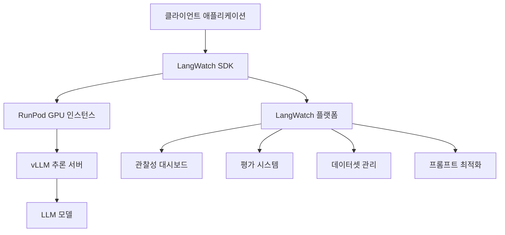

⏱️ **예상 읽기 시간**: 12분

## 서론

LLM(Large Language Model) 기반 애플리케이션이 프로덕션 환경에서 안정적으로 운영되려면 체계적인 관찰성(Observability), 평가(Evaluation), 최적화 시스템이 필수입니다. [LangWatch](https://github.com/langwatch/langwatch)는 이러한 LLMOps 요구사항을 충족하는 오픈소스 플랫폼으로, OpenTelemetry 표준을 기반으로 LLM 애플리케이션의 전체 라이프사이클을 관리할 수 있게 해줍니다.

### LangWatch의 핵심 가치

**기존 모니터링 도구의 한계**:
- 일반적인 APM 도구들은 LLM 특화 메트릭 부족
- 프롬프트 품질과 응답 정확도 추적 어려움
- 비용 최적화와 성능 분석의 복잡성

**LangWatch가 제공하는 해결책**:
- LLM 전용 관찰성과 추적 시스템
- 실시간/오프라인 평가 프레임워크
- 프롬프트 버전 관리와 최적화 도구
- 다양한 LLM 프레임워크와의 네이티브 통합

## LangWatch 핵심 기능 분석

### 1. 관찰성 (Observability)

LangWatch는 OpenTelemetry 표준을 기반으로 LLM 애플리케이션의 모든 상호작용을 추적합니다.

**주요 추적 요소**:
- **Request/Response 추적**: 입력 프롬프트와 모델 응답의 전체 플로우
- **지연시간 분석**: 토큰 생성 속도, 첫 토큰까지의 시간 (TTFT)
- **비용 추적**: API 호출별 토큰 사용량과 비용 계산
- **오류 모니터링**: 실패한 요청과 예외 상황 분석

```python
import langwatch
from openai import OpenAI

client = OpenAI()

@langwatch.trace()
def chat_completion(messages):
    """LangWatch로 추적되는 OpenAI API 호출"""
    langwatch.get_current_trace().autotrack_openai_calls(client)
    
    response = client.chat.completions.create(
        model="gpt-4",
        messages=messages,
        temperature=0.7
    )
    
    return response.choices[0].message.content
```

### 2. 평가 시스템 (Evaluation)

**실시간 평가**:
- 프로덕션 환경에서 응답 품질 실시간 모니터링
- 사용자 피드백과 자동 평가 메트릭 결합
- 성능 저하 조기 감지 시스템

**오프라인 평가**:
- 데이터셋 기반 일괄 평가
- A/B 테스트를 통한 모델 성능 비교
- 프롬프트 변경사항의 영향도 분석

**평가 메트릭**:
- **관련성(Relevance)**: 질문과 답변의 연관성
- **정확성(Accuracy)**: 팩트 체크와 정보 정확도
- **일관성(Consistency)**: 동일 질문에 대한 응답 일관성
- **안전성(Safety)**: 유해 콘텐츠 감지와 필터링

### 3. 데이터셋 관리

**자동 데이터셋 생성**:
- 추적된 메시지로부터 자동 데이터셋 구성
- 사용자 상호작용 패턴 분석
- 실제 사용 사례 기반 테스트 케이스 추출

**수동 데이터셋 업로드**:
- 커스텀 평가용 데이터셋 업로드
- 도메인 특화 테스트 케이스 관리
- 지속적인 평가를 위한 골든 데이터셋 구축

### 4. 프롬프트 최적화

**버전 관리**:
- 프롬프트 변경사항 추적
- 성능 영향도 분석
- 롤백 및 A/B 테스트 지원

**자동 최적화**:
- DSPy의 MIPROv2 알고리즘 활용
- Few-shot 예제 자동 생성
- 프롬프트 템플릿 최적화

```python
# 프롬프트 버전 관리 예시
from langwatch import prompt_manager

# 프롬프트 버전 등록
prompt_v1 = prompt_manager.create_prompt(
    name="customer_support",
    version="1.0",
    template="당신은 고객 지원 담당자입니다. 질문: {question}",
    parameters=["question"]
)

# 성능 평가와 함께 새 버전 테스트
prompt_v2 = prompt_manager.test_prompt(
    base_prompt=prompt_v1,
    modifications={"add_examples": True, "tone": "friendly"},
    evaluation_dataset="customer_queries_100"
)
```

## AI 플랫폼과의 연계 활용

### RunPod과의 통합

RunPod은 GPU 클라우드 인프라를 제공하는 플랫폼으로, LangWatch와 함께 사용하면 강력한 LLMOps 환경을 구축할 수 있습니다.

**통합 아키텍처**:



**RunPod + LangWatch 설정**:

```python
# RunPod에서 vLLM 서버 실행
import requests
import langwatch

# RunPod 엔드포인트 설정
RUNPOD_ENDPOINT = "https://api.runpod.ai/v2/your-endpoint-id"
RUNPOD_API_KEY = "your-runpod-api-key"

@langwatch.trace()
def call_runpod_llm(prompt, model="meta-llama/Llama-2-7b-chat-hf"):
    """RunPod에서 호스팅되는 LLM 호출"""
    
    headers = {
        "Authorization": f"Bearer {RUNPOD_API_KEY}",
        "Content-Type": "application/json"
    }
    
    payload = {
        "input": {
            "prompt": prompt,
            "model": model,
            "max_tokens": 512,
            "temperature": 0.7
        }
    }
    
    # LangWatch에서 요청 추적
    with langwatch.trace_span("runpod_inference") as span:
        span.set_attribute("model", model)
        span.set_attribute("prompt_length", len(prompt))
        
        response = requests.post(
            f"{RUNPOD_ENDPOINT}/run",
            headers=headers,
            json=payload
        )
        
        result = response.json()
        
        # 응답 메트릭 기록
        span.set_attribute("response_length", len(result.get("output", "")))
        span.set_attribute("inference_time", result.get("execution_time", 0))
        
        return result["output"]
```

### vLLM과의 최적화 연계

vLLM은 높은 처리량과 효율적인 메모리 사용을 제공하는 LLM 추론 라이브러리입니다.

**vLLM + LangWatch 통합**:

```python
from vllm import LLM, SamplingParams
import langwatch

class OptimizedLLMService:
    def __init__(self, model_name="meta-llama/Llama-2-7b-chat-hf"):
        self.llm = LLM(
            model=model_name,
            tensor_parallel_size=2,  # GPU 병렬 처리
            max_model_len=4096,
            trust_remote_code=True
        )
        
        self.sampling_params = SamplingParams(
            temperature=0.7,
            top_p=0.95,
            max_tokens=512
        )
    
    @langwatch.trace()
    def generate(self, prompts, batch_size=8):
        """배치 처리로 최적화된 생성"""
        
        with langwatch.trace_span("vllm_batch_inference") as span:
            span.set_attribute("batch_size", len(prompts))
            span.set_attribute("model", self.llm.llm_engine.model_config.model)
            
            # vLLM 배치 추론
            outputs = self.llm.generate(prompts, self.sampling_params)
            
            # 처리량 메트릭 계산
            total_tokens = sum(len(output.outputs[0].token_ids) for output in outputs)
            span.set_attribute("total_output_tokens", total_tokens)
            span.set_attribute("throughput_tokens_per_second", 
                             total_tokens / span.duration if span.duration > 0 else 0)
            
            return [output.outputs[0].text for output in outputs]

# 사용 예시
llm_service = OptimizedLLMService()

prompts = [
    "AI의 미래에 대해 설명해주세요.",
    "기후 변화 해결 방안은 무엇인가요?",
    "양자 컴퓨팅의 원리를 간단히 설명해주세요."
]

responses = llm_service.generate(prompts)
```

### TensorRT-LLM 가속화

NVIDIA TensorRT-LLM을 사용하여 추론 성능을 극대화할 수 있습니다.

```python
import tensorrt_llm
import langwatch

class TensorRTLLMService:
    def __init__(self, engine_path):
        self.engine = tensorrt_llm.LLMEngine(engine_path)
        
    @langwatch.trace()
    def optimized_inference(self, prompt):
        """TensorRT 최적화된 추론"""
        
        with langwatch.trace_span("tensorrt_inference") as span:
            # 추론 성능 메트릭 수집
            start_time = time.time()
            
            result = self.engine.generate(
                prompt,
                max_new_tokens=512,
                temperature=0.7
            )
            
            inference_time = time.time() - start_time
            
            # LangWatch에 성능 데이터 기록
            span.set_attribute("inference_time_ms", inference_time * 1000)
            span.set_attribute("tokens_per_second", 
                             len(result.split()) / inference_time)
            
            return result
```

## 실전 LLMOps 워크플로우

### 1. 개발 단계

```python
# 개발 환경에서의 LangWatch 설정
import langwatch

# 개발 모드 설정
langwatch.init(
    api_key="your-dev-api-key",
    endpoint="http://localhost:5560",  # 로컬 LangWatch 인스턴스
    environment="development"
)

@langwatch.trace()
def prototype_chatbot(user_input):
    """프로토타입 챗봇 함수"""
    
    # 프롬프트 템플릿 테스트
    system_prompt = """당신은 도움이 되는 AI 어시스턴트입니다.
    사용자의 질문에 정확하고 친절하게 답변해주세요."""
    
    response = call_llm(system_prompt, user_input)
    
    # 개발 단계에서 즉시 평가
    evaluation_score = langwatch.evaluate_response(
        prompt=user_input,
        response=response,
        criteria=["relevance", "helpfulness", "safety"]
    )
    
    return response, evaluation_score
```

### 2. 스테이징 단계

```python
# 스테이징 환경에서 자동 평가 설정
@langwatch.trace()
def staging_deployment():
    """스테이징 환경에서 종합 테스트"""
    
    # 테스트 데이터셋 로드
    test_dataset = langwatch.load_dataset("customer_support_test_100")
    
    results = []
    for test_case in test_dataset:
        response = production_chatbot(test_case.input)
        
        # 자동 평가 실행
        evaluation = langwatch.auto_evaluate(
            input=test_case.input,
            output=response,
            expected=test_case.expected,
            metrics=["accuracy", "relevance", "safety"]
        )
        
        results.append({
            "input": test_case.input,
            "output": response,
            "scores": evaluation.scores,
            "passed": evaluation.overall_score > 0.8
        })
    
    # 스테이징 결과 리포트
    langwatch.create_evaluation_report(
        results=results,
        environment="staging",
        deployment_version="v1.2.0"
    )
    
    return results
```

### 3. 프로덕션 단계

```python
# 프로덕션 환경에서 실시간 모니터링
@langwatch.trace()
def production_chatbot(user_input, user_id=None):
    """프로덕션 챗봇 with 실시간 모니터링"""
    
    with langwatch.trace_span("production_inference") as span:
        # 사용자 컨텍스트 추가
        span.set_attribute("user_id", user_id)
        span.set_attribute("input_length", len(user_input))
        
        # 안전성 사전 검사
        safety_check = langwatch.safety_filter(user_input)
        if not safety_check.is_safe:
            span.set_attribute("safety_blocked", True)
            return "죄송합니다. 해당 요청을 처리할 수 없습니다."
        
        # LLM 추론 실행
        response = optimized_llm_call(user_input)
        
        # 실시간 품질 평가
        quality_score = langwatch.real_time_evaluate(
            input=user_input,
            output=response,
            metrics=["relevance", "coherence"]
        )
        
        span.set_attribute("quality_score", quality_score.overall)
        span.set_attribute("response_length", len(response))
        
        # 저품질 응답 감지 시 알림
        if quality_score.overall < 0.7:
            langwatch.alert(
                type="low_quality_response",
                severity="warning",
                details={
                    "user_id": user_id,
                    "score": quality_score.overall,
                    "input": user_input[:100] + "..."
                }
            )
        
        return response

# 프로덕션 메트릭 대시보드 설정
langwatch.setup_dashboard(
    metrics=[
        "requests_per_minute",
        "average_response_time",
        "quality_score_distribution",
        "error_rate",
        "cost_per_token"
    ],
    alerts=[
        {"metric": "error_rate", "threshold": 0.05, "action": "email"},
        {"metric": "avg_quality_score", "threshold": 0.8, "action": "slack"},
        {"metric": "cost_per_hour", "threshold": 100, "action": "email"}
    ]
)
```

## macOS 로컬 개발 환경 구축

### Docker Compose 설정

LangWatch를 로컬에서 실행하여 개발 환경을 구축해보겠습니다.

```bash
# LangWatch 클론 및 실행
git clone https://github.com/langwatch/langwatch.git
cd langwatch

# 환경 설정 파일 복사
cp langwatch/.env.example langwatch/.env

# Docker Compose로 실행 (ARM Mac의 경우)
docker compose -f compose.yml -f docker-compose.arm64.override.yml up -d --wait --build

# 브라우저에서 확인
open http://localhost:5560
```

### 개발환경 SDK 설정

```bash
# Python 가상환경 생성
python3 -m venv langwatch-dev
source langwatch-dev/bin/activate

# LangWatch SDK 설치
pip install langwatch

# 개발용 의존성 설치
pip install openai python-dotenv jupyter
```

### 환경 변수 설정

```bash
# ~/.zshrc에 추가
export LANGWATCH_API_KEY="lw-your-local-dev-key"
export LANGWATCH_ENDPOINT="http://localhost:5560"
export OPENAI_API_KEY="your-openai-api-key"

# alias 추가
alias langwatch-local="docker compose -f ~/langwatch/compose.yml up -d"
alias langwatch-stop="docker compose -f ~/langwatch/compose.yml down"
alias langwatch-logs="docker compose -f ~/langwatch/compose.yml logs -f"

# 변경사항 적용
source ~/.zshrc
```

### 테스트 스크립트 작성

```python
# test_langwatch_integration.py
import os
import langwatch
from openai import OpenAI

# LangWatch 초기화
langwatch.init(
    api_key=os.getenv("LANGWATCH_API_KEY"),
    endpoint=os.getenv("LANGWATCH_ENDPOINT")
)

client = OpenAI()

@langwatch.trace()
def test_basic_integration():
    """기본 통합 테스트"""
    
    # OpenAI 자동 추적 설정
    langwatch.get_current_trace().autotrack_openai_calls(client)
    
    # 테스트 요청
    response = client.chat.completions.create(
        model="gpt-3.5-turbo",
        messages=[
            {"role": "system", "content": "당신은 도움이 되는 AI 어시스턴트입니다."},
            {"role": "user", "content": "Python의 장점을 3가지만 설명해주세요."}
        ],
        temperature=0.7,
        max_tokens=200
    )
    
    result = response.choices[0].message.content
    print(f"응답: {result}")
    
    # 평가 실행
    evaluation = langwatch.evaluate_response(
        prompt="Python의 장점을 3가지만 설명해주세요.",
        response=result,
        criteria=["relevance", "accuracy", "completeness"]
    )
    
    print(f"평가 점수: {evaluation}")
    
    return result, evaluation

if __name__ == "__main__":
    result, evaluation = test_basic_integration()
    print("\n✅ LangWatch 통합 테스트 완료!")
    print(f"LangWatch 대시보드: http://localhost:5560")
```

### 실행 및 검증

```bash
# 테스트 실행
python test_langwatch_integration.py

# 브라우저에서 결과 확인
open http://localhost:5560

# 로그 확인
langwatch-logs
```

## 고급 활용 사례

### 1. 멀티모델 A/B 테스트

```python
import random
import langwatch

@langwatch.trace()
def multi_model_ab_test(user_input):
    """여러 모델을 동시에 테스트"""
    
    models = [
        {"name": "gpt-4", "weight": 0.3},
        {"name": "gpt-3.5-turbo", "weight": 0.5},
        {"name": "claude-3-sonnet", "weight": 0.2}
    ]
    
    # 가중치 기반 모델 선택
    selected_model = random.choices(
        models, 
        weights=[m["weight"] for m in models]
    )[0]
    
    with langwatch.trace_span("model_selection") as span:
        span.set_attribute("selected_model", selected_model["name"])
        span.set_attribute("selection_weight", selected_model["weight"])
        
        response = call_model(selected_model["name"], user_input)
        
        # 모델별 성능 메트릭 수집
        langwatch.record_metric(
            name=f"response_quality_{selected_model['name']}",
            value=evaluate_response_quality(response),
            tags={"model": selected_model["name"]}
        )
        
        return response
```

### 2. 자동 프롬프트 최적화

```python
from langwatch.optimization import DSPyOptimizer

class AutoPromptOptimizer:
    def __init__(self):
        self.optimizer = DSPyOptimizer()
        
    def optimize_prompt(self, base_prompt, training_data, metrics):
        """자동 프롬프트 최적화"""
        
        optimization_run = langwatch.start_optimization(
            name="customer_support_prompt_v2",
            base_prompt=base_prompt,
            training_data=training_data
        )
        
        # DSPy MIPROv2를 사용한 최적화
        optimized_prompt = self.optimizer.optimize(
            prompt_template=base_prompt,
            training_examples=training_data,
            eval_metrics=metrics,
            iterations=50
        )
        
        # 최적화 결과 평가
        evaluation_results = langwatch.evaluate_prompt(
            original_prompt=base_prompt,
            optimized_prompt=optimized_prompt,
            test_dataset=training_data,
            metrics=metrics
        )
        
        langwatch.complete_optimization(
            run_id=optimization_run.id,
            results=evaluation_results,
            optimized_prompt=optimized_prompt
        )
        
        return optimized_prompt, evaluation_results

# 사용 예시
optimizer = AutoPromptOptimizer()

base_prompt = """당신은 고객 지원 담당자입니다.
고객의 문의에 친절하고 정확하게 답변해주세요.

고객 문의: {question}
답변:"""

training_data = [
    {"question": "환불 정책이 어떻게 되나요?", "expected": "14일 이내 전액 환불..."},
    {"question": "배송 기간은 얼마나 걸리나요?", "expected": "일반 배송은 2-3일..."},
    # ... 더 많은 예시
]

optimized_prompt, results = optimizer.optimize_prompt(
    base_prompt=base_prompt,
    training_data=training_data,
    metrics=["accuracy", "helpfulness", "response_time"]
)
```

### 3. 비용 최적화 모니터링

```python
class CostOptimizedLLMService:
    def __init__(self):
        self.cost_thresholds = {
            "hourly": 50,  # $50/hour
            "daily": 500,   # $500/day
            "monthly": 10000  # $10,000/month
        }
        
    @langwatch.trace()
    def cost_aware_inference(self, prompt, priority="normal"):
        """비용을 고려한 추론 실행"""
        
        # 현재 비용 사용량 확인
        current_costs = langwatch.get_cost_metrics()
        
        with langwatch.trace_span("cost_check") as span:
            span.set_attribute("hourly_cost", current_costs.hourly)
            span.set_attribute("daily_cost", current_costs.daily)
            span.set_attribute("priority", priority)
            
            # 비용 임계값 확인
            if current_costs.hourly > self.cost_thresholds["hourly"]:
                if priority == "low":
                    span.set_attribute("cost_limited", True)
                    return "서비스가 일시적으로 제한되었습니다."
                elif priority == "normal":
                    # 더 저렴한 모델로 폴백
                    model = "gpt-3.5-turbo"  # 대신 gpt-4
                else:
                    model = "gpt-4"  # high priority는 고성능 모델 사용
            else:
                model = "gpt-4"
            
            span.set_attribute("selected_model", model)
            
            response = call_model(model, prompt)
            
            # 이번 요청의 비용 계산
            estimated_cost = estimate_request_cost(prompt, response, model)
            span.set_attribute("request_cost", estimated_cost)
            
            # 비용 알림 확인
            if current_costs.daily + estimated_cost > self.cost_thresholds["daily"]:
                langwatch.alert(
                    type="cost_threshold_approached",
                    severity="warning",
                    details={"daily_cost": current_costs.daily + estimated_cost}
                )
            
            return response
```

## 결론

LangWatch는 현대적인 LLMOps 요구사항을 충족하는 종합적인 플랫폼입니다. OpenTelemetry 표준 기반의 관찰성, 실시간/오프라인 평가 시스템, 자동화된 프롬프트 최적화 등의 기능을 통해 LLM 애플리케이션의 전체 라이프사이클을 효과적으로 관리할 수 있습니다.

### 주요 장점 요약

1. **표준화된 관찰성**: OpenTelemetry 기반으로 다양한 LLM 프레임워크와 호환
2. **종합적인 평가**: 실시간 모니터링과 오프라인 평가의 결합
3. **자동화된 최적화**: DSPy MIPROv2를 활용한 프롬프트 자동 최적화
4. **비용 효율성**: 상세한 비용 추적과 최적화 기능
5. **확장 가능성**: RunPod, vLLM 등 다양한 인프라와의 연계

### 다음 단계 권장사항

1. **로컬 환경 구축**: Docker Compose로 개발 환경 설정
2. **단계적 도입**: 개발 → 스테이징 → 프로덕션 순서로 적용
3. **메트릭 정의**: 비즈니스 목표에 맞는 평가 지표 설정
4. **자동화 구축**: CI/CD 파이프라인에 평가 프로세스 통합
5. **팀 협업**: 도메인 전문가와 개발팀 간의 협업 프로세스 구축

LangWatch를 통해 구축된 LLMOps 체계는 AI 애플리케이션의 품질과 안정성을 크게 향상시키며, 지속적인 개선과 최적화를 가능하게 합니다. 특히 RunPod, vLLM과 같은 최신 AI 인프라와 결합하면 더욱 강력하고 효율적인 LLM 운영 환경을 구축할 수 있습니다.
