⏱️ **예상 읽기 시간**: 20분

## 서론

AI 에이전트 시대의 새로운 패러다임이 등장했습니다. **클라우드 의존성을 줄이고, 프라이버시를 보장하면서도 강력한 성능을 제공하는 온디바이스 AI 솔루션**입니다. 

Hugging Face의 [SmolLM3](https://github.com/huggingface/smollm)는 이러한 요구사항을 완벽하게 충족하는 3B 파라미터 모델로, **Llama 3.2 3B와 Qwen2.5 3B를 능가하는 성능**을 보여주면서도 로컬 환경에서 효율적으로 실행됩니다.

이 글에서는 SmolLM3를 활용한 **오픈 워크플로우 관리 시스템** 구축 방법과 향후 에이전트 생태계 발전 방향을 종합적으로 다루겠습니다.

## SmolLM3 Overview: 게임 체인저의 등장

### 핵심 혁신 사항

SmolLM3는 단순한 모델 업데이트가 아닌 **패러다임 전환**을 의미합니다:

- 🧠 **3B 파라미터**: 11T 토큰으로 학습된 최고 성능
- 🌐 **멀티링구얼**: 6개 언어 지원 (영어, 프랑스어, 스페인어, 독일어, 이탈리아어, 포르투갈어)
- 📖 **긴 컨텍스트**: 128k 토큰 지원 (NoPE + YaRN 기술)
- 🧩 **듀얼 모드 추론**: think/no_think 모드 지원
- 🔓 **완전 오픈**: 가중치 + 학습 세부사항 + 데이터셋 공개

### 성능 벤치마크 분석


## 온디바이스 워크플로우 아키텍처

### 시스템 설계 원칙

```mermaid
graph TB
    subgraph "사용자 인터페이스"
        UI[Web UI / CLI]
        API[REST API]
        WS[WebSocket]
    end
    
    subgraph "워크플로우 오케스트레이션"
        WM[Workflow Manager]
        TM[Task Manager]
        SM[State Manager]
    end
    
    subgraph "AI 에이전트 계층"
        LLM[SmolLM3 Agent]
        VLM[SmolVLM Agent]
        TC[Tool Calling Engine]
    end
    
    subgraph "툴 및 서비스"
        FT[File Tools]
        WT[Web Tools]
        DT[Database Tools]
        CT[Code Tools]
    end
    
    subgraph "데이터 계층"
        FS[File System]
        DB[Local Database]
        VS[Vector Store]
        CH[Chat History]
    end
    
    UI --> WM
    API --> WM
    WS --> WM
    
    WM --> TM
    WM --> SM
    
    TM --> LLM
    TM --> VLM
    LLM --> TC
    VLM --> TC
    
    TC --> FT
    TC --> WT
    TC --> DT
    TC --> CT
    
    FT --> FS
    WT --> DB
    DT --> DB
    CT --> VS
    
    SM --> CH
    SM --> VS
```



### 핵심 컴포넌트 상세 분석

#### 1. SmolLM3 에이전트 엔진

```python
# SmolLM3 워크플로우 에이전트 기본 구조
from transformers import AutoModelForCausalLM, AutoTokenizer
import torch
from typing import Dict, List, Any
import json

class SmolLM3WorkflowAgent:
    def __init__(self, model_name="HuggingFaceTB/SmolLM3-3B"):
        self.device = "cuda" if torch.cuda.is_available() else "cpu"
        self.tokenizer = AutoTokenizer.from_pretrained(model_name)
        self.model = AutoModelForCausalLM.from_pretrained(
            model_name,
            torch_dtype=torch.float16 if self.device == "cuda" else torch.float32,
            device_map="auto"
        ).to(self.device)
        
        # 워크플로우 상태 관리
        self.workflow_state = {}
        self.tool_registry = {}
        self.conversation_history = []
    
    def register_tool(self, name: str, func: callable, description: str):
        """툴 등록 시스템"""
        self.tool_registry[name] = {
            "function": func,
            "description": description,
            "schema": self._extract_function_schema(func)
        }
    
    def execute_workflow(self, workflow_config: Dict) -> Dict:
        """워크플로우 실행"""
        try:
            # 1. 워크플로우 파싱
            tasks = workflow_config.get("tasks", [])
            
            # 2. 의존성 그래프 구성
            dependency_graph = self._build_dependency_graph(tasks)
            
            # 3. 순차/병렬 실행
            results = self._execute_tasks(dependency_graph)
            
            return {
                "status": "success",
                "results": results,
                "workflow_id": workflow_config.get("id")
            }
        except Exception as e:
            return {
                "status": "error",
                "error": str(e)
            }
    
    def think_mode_planning(self, objective: str) -> Dict:
        """Think 모드로 복잡한 워크플로우 계획"""
        planning_prompt = f"""
        <think>
        사용자의 목표: {objective}
        
        이 목표를 달성하기 위한 단계별 계획을 세워보자:
        1. 필요한 정보 파악
        2. 사용 가능한 도구 확인
        3. 실행 순서 결정
        4. 예상 결과 검증
        </think>
        
        다음 목표를 달성하기 위한 워크플로우를 설계해주세요: {objective}
        """
        
        response = self._generate_response(planning_prompt)
        return self._parse_workflow_plan(response)
```

#### 2. 멀티모달 처리 시스템

```python
class SmolVLMWorkflowAgent:
    def __init__(self):
        from transformers import AutoProcessor, AutoModelForVision2Seq
        
        self.processor = AutoProcessor.from_pretrained("HuggingFaceTB/SmolVLM-Instruct")
        self.model = AutoModelForVision2Seq.from_pretrained("HuggingFaceTB/SmolVLM-Instruct")
    
    def process_visual_workflow(self, images: List, task_description: str):
        """이미지 기반 워크플로우 처리"""
        messages = [
            {
                "role": "user",
                "content": [
                    {"type": "image"},
                    {"type": "text", "text": f"다음 작업을 수행해주세요: {task_description}"}
                ]
            }
        ]
        
        # 멀티 이미지 처리
        for i, image in enumerate(images):
            if i > 0:  # 첫 번째 이미지는 이미 추가됨
                messages[0]["content"].insert(-1, {"type": "image"})
        
        return self._process_multimodal_input(messages, images)
```

## 실제 구현 가이드

### 환경 설정 및 설치

#### 1. 기본 환경 구성

```bash
# Python 환경 설정
python -m venv smollm3-workflow
source smollm3-workflow/bin/activate  # Linux/Mac
# smollm3-workflow\Scripts\activate  # Windows

# 필수 패키지 설치
pip install torch transformers accelerate bitsandbytes
pip install fastapi uvicorn websockets
pip install sqlite3 chromadb
pip install pillow opencv-python
```

#### 2. 고급 최적화 설정

```python
# config/model_config.py
MODEL_CONFIG = {
    "base_model": "HuggingFaceTB/SmolLM3-3B",
    "torch_dtype": "float16",
    "device_map": "auto",
    "load_in_8bit": False,  # 메모리 제약시 True
    "load_in_4bit": False,  # 더 극단적 메모리 절약
    "max_memory": {0: "6GiB"},  # GPU 메모리 제한
    "offload_folder": "./offload",
    "trust_remote_code": True
}

WORKFLOW_CONFIG = {
    "max_concurrent_tasks": 4,
    "context_window": 128000,
    "enable_streaming": True,
    "cache_embeddings": True,
    "vector_store_path": "./vector_store",
    "conversation_history_limit": 1000
}
```

### 워크플로우 정의 시스템

#### 1. YAML 기반 워크플로우 정의

```yaml
# workflows/data_analysis_workflow.yaml
workflow:
  id: "data-analysis-pipeline"
  name: "Data Analysis Workflow"
  description: "CSV 데이터 분석 및 리포트 생성"
  
  variables:
    input_file: "data/sales_data.csv"
    output_dir: "reports/"
    
  tasks:
    - id: "load_data"
      type: "tool_call"
      tool: "pandas_loader"
      inputs:
        file_path: "${input_file}"
      outputs:
        - "dataframe"
    
    - id: "analyze_data"
      type: "llm_task"
      depends_on: ["load_data"]
      prompt: |
        다음 데이터를 분석하고 주요 인사이트를 추출해주세요:
        ${dataframe.describe()}
        
        분석 결과를 JSON 형태로 반환해주세요.
      outputs:
        - "analysis_results"
    
    - id: "generate_chart"
      type: "tool_call"
      tool: "matplotlib_chart"
      depends_on: ["analyze_data"]
      inputs:
        data: "${dataframe}"
        chart_type: "bar"
        insights: "${analysis_results}"
      outputs:
        - "chart_path"
    
    - id: "create_report"
      type: "llm_task"
      depends_on: ["analyze_data", "generate_chart"]
      prompt: |
        다음 분석 결과와 차트를 바탕으로 종합 리포트를 작성해주세요:
        
        분석 결과: ${analysis_results}
        차트 경로: ${chart_path}
        
        마크다운 형식으로 작성해주세요.
      outputs:
        - "final_report"
```

#### 2. 동적 워크플로우 생성

```python
class DynamicWorkflowBuilder:
    def __init__(self, agent: SmolLM3WorkflowAgent):
        self.agent = agent
        
    def create_workflow_from_description(self, description: str) -> Dict:
        """자연어 설명으로부터 워크플로우 자동 생성"""
        
        planning_prompt = f"""
        사용자 요청: {description}
        
        이 요청을 수행하기 위한 워크플로우를 다음 JSON 형식으로 생성해주세요:
        
        
        {{
            "workflow_id": "auto_generated_workflow",
            "tasks": [
                {{
                    "id": "task_1",
                    "type": "tool_call|llm_task|conditional",
                    "description": "작업 설명",
                    "tool": "도구명",
                    "inputs": {{}},
                    "depends_on": []
                }}
            ]
        }}
        
        
        사용 가능한 도구: {list(self.agent.tool_registry.keys())}
        """
        
        workflow_json = self.agent._generate_response(planning_prompt)
        return json.loads(workflow_json)
    
    def optimize_workflow(self, workflow: Dict) -> Dict:
        """워크플로우 최적화"""
        # 병렬화 가능한 작업 식별
        # 불필요한 의존성 제거
        # 리소스 사용량 최적화
        return self._apply_optimizations(workflow)
```

### 툴 콜링 시스템 구현

#### 1. 기본 툴 프레임워크

```python
from abc import ABC, abstractmethod
from typing import Any, Dict, List
import inspect

class BaseTool(ABC):
    """기본 툴 인터페이스"""
    
    @property
    @abstractmethod
    def name(self) -> str:
        pass
    
    @property
    @abstractmethod
    def description(self) -> str:
        pass
    
    @abstractmethod
    def execute(self, **kwargs) -> Any:
        pass
    
    def get_schema(self) -> Dict:
        """함수 시그니처 기반 스키마 생성"""
        sig = inspect.signature(self.execute)
        parameters = {}
        
        for param_name, param in sig.parameters.items():
            if param_name != 'kwargs':
                parameters[param_name] = {
                    "type": str(param.annotation).replace("<class '", "").replace("'>", ""),
                    "required": param.default == inspect.Parameter.empty
                }
        
        return {
            "name": self.name,
            "description": self.description,
            "parameters": parameters
        }

class FileSystemTool(BaseTool):
    """파일 시스템 조작 툴"""
    
    @property
    def name(self) -> str:
        return "filesystem"
    
    @property
    def description(self) -> str:
        return "파일 시스템 읽기/쓰기/검색 작업"
    
    def execute(self, action: str, path: str, content: str = None) -> Dict:
        import os
        
        if action == "read":
            try:
                with open(path, 'r', encoding='utf-8') as f:
                    return {"status": "success", "content": f.read()}
            except Exception as e:
                return {"status": "error", "error": str(e)}
        
        elif action == "write":
            try:
                os.makedirs(os.path.dirname(path), exist_ok=True)
                with open(path, 'w', encoding='utf-8') as f:
                    f.write(content)
                return {"status": "success", "message": f"파일 저장됨: {path}"}
            except Exception as e:
                return {"status": "error", "error": str(e)}
        
        elif action == "list":
            try:
                files = os.listdir(path)
                return {"status": "success", "files": files}
            except Exception as e:
                return {"status": "error", "error": str(e)}

class WebScrapingTool(BaseTool):
    """웹 스크래핑 툴"""
    
    @property
    def name(self) -> str:
        return "web_scraping"
    
    @property
    def description(self) -> str:
        return "웹페이지에서 정보 추출"
    
    def execute(self, url: str, selector: str = None) -> Dict:
        try:
            import requests
            from bs4 import BeautifulSoup
            
            headers = {
                'User-Agent': 'Mozilla/5.0 (Windows NT 10.0; Win64; x64) AppleWebKit/537.36'
            }
            
            response = requests.get(url, headers=headers)
            soup = BeautifulSoup(response.content, 'html.parser')
            
            if selector:
                elements = soup.select(selector)
                content = [elem.get_text().strip() for elem in elements]
            else:
                content = soup.get_text().strip()
            
            return {
                "status": "success",
                "url": url,
                "content": content,
                "title": soup.title.string if soup.title else "No title"
            }
        except Exception as e:
            return {"status": "error", "error": str(e)}

class CodeExecutionTool(BaseTool):
    """코드 실행 툴 (샌드박스)"""
    
    @property
    def name(self) -> str:
        return "code_execution"
    
    @property
    def description(self) -> str:
        return "Python 코드 안전 실행"
    
    def execute(self, code: str, language: str = "python") -> Dict:
        try:
            import subprocess
            import tempfile
            import os
            
            if language != "python":
                return {"status": "error", "error": "현재 Python만 지원"}
            
            # 임시 파일 생성
            with tempfile.NamedTemporaryFile(mode='w', suffix='.py', delete=False) as f:
                f.write(code)
                temp_path = f.name
            
            try:
                # 안전한 실행 환경에서 코드 실행
                result = subprocess.run(
                    ['python', temp_path],
                    capture_output=True,
                    text=True,
                    timeout=30,  # 30초 제한
                    cwd=tempfile.gettempdir()  # 안전한 디렉토리에서 실행
                )
                
                return {
                    "status": "success",
                    "stdout": result.stdout,
                    "stderr": result.stderr,
                    "return_code": result.returncode
                }
            finally:
                os.unlink(temp_path)
                
        except subprocess.TimeoutExpired:
            return {"status": "error", "error": "코드 실행 시간 초과"}
        except Exception as e:
            return {"status": "error", "error": str(e)}
```

#### 2. 툴 콜링 엔진

```python
class ToolCallingEngine:
    def __init__(self):
        self.tools = {}
        self.execution_history = []
    
    def register_tool(self, tool: BaseTool):
        """툴 등록"""
        self.tools[tool.name] = tool
    
    def get_tools_schema(self) -> List[Dict]:
        """모든 툴의 스키마 반환"""
        return [tool.get_schema() for tool in self.tools.values()]
    
    def execute_tool(self, tool_name: str, **kwargs) -> Dict:
        """툴 실행"""
        if tool_name not in self.tools:
            return {
                "status": "error",
                "error": f"알 수 없는 툴: {tool_name}"
            }
        
        try:
            tool = self.tools[tool_name]
            result = tool.execute(**kwargs)
            
            # 실행 기록 저장
            self.execution_history.append({
                "tool": tool_name,
                "inputs": kwargs,
                "result": result,
                "timestamp": datetime.now().isoformat()
            })
            
            return result
        except Exception as e:
            return {
                "status": "error",
                "error": f"툴 실행 오류: {str(e)}"
            }
    
    def parse_tool_calls(self, llm_response: str) -> List[Dict]:
        """LLM 응답에서 툴 콜 파싱"""
        import re
        import json
        
        # JSON 형태의 툴 콜 패턴 찾기
        tool_call_pattern = r'```json\s*(\{.*?"tool".*?\})\s*```'
        matches = re.findall(tool_call_pattern, llm_response, re.DOTALL)
        
        tool_calls = []
        for match in matches:
            try:
                tool_call = json.loads(match)
                tool_calls.append(tool_call)
            except json.JSONDecodeError:
                continue
        
        return tool_calls
```

## 실전 활용 사례

### 사례 1: 자동화된 컨텐츠 생성 워크플로우

```python
class ContentGenerationWorkflow:
    def __init__(self, agent: SmolLM3WorkflowAgent):
        self.agent = agent
        
        # 필요한 툴들 등록
        self.agent.register_tool("web_research", WebScrapingTool())
        self.agent.register_tool("file_manager", FileSystemTool())
        self.agent.register_tool("image_generator", ImageGenerationTool())
    
    def generate_blog_post(self, topic: str, target_audience: str) -> Dict:
        """블로그 포스트 자동 생성"""
        
        workflow = {
            "id": "blog_generation",
            "tasks": [
                {
                    "id": "research",
                    "type": "tool_call",
                    "tool": "web_research",
                    "inputs": {"query": f"{topic} 최신 동향"}
                },
                {
                    "id": "outline",
                    "type": "llm_task",
                    "depends_on": ["research"],
                    "prompt": f"""
                    주제: {topic}
                    대상 독자: {target_audience}
                    조사 결과: {{research_results}}
                    
                    위 정보를 바탕으로 블로그 포스트 목차를 작성해주세요.
                    """
                },
                {
                    "id": "content",
                    "type": "llm_task",
                    "depends_on": ["outline"],
                    "prompt": "목차에 따라 전체 블로그 포스트를 작성해주세요."
                },
                {
                    "id": "images",
                    "type": "tool_call",
                    "tool": "image_generator",
                    "depends_on": ["content"],
                    "inputs": {"description": "블로그 포스트 헤더 이미지"}
                },
                {
                    "id": "save",
                    "type": "tool_call",
                    "tool": "file_manager",
                    "depends_on": ["content", "images"],
                    "inputs": {
                        "action": "write",
                        "path": f"blog_posts/{topic.replace(' ', '_')}.md"
                    }
                }
            ]
        }
        
        return self.agent.execute_workflow(workflow)

# 실행 예시
workflow = ContentGenerationWorkflow(agent)
result = workflow.generate_blog_post(
    topic="SmolLM3 활용 사례",
    target_audience="AI 개발자"
)
```

### 사례 2: 데이터 분석 자동화

```python
class DataAnalysisWorkflow:
    def __init__(self, agent: SmolLM3WorkflowAgent):
        self.agent = agent
        self.agent.register_tool("pandas_processor", PandasTool())
        self.agent.register_tool("chart_generator", ChartTool())
        self.agent.register_tool("report_generator", ReportTool())
    
    def analyze_sales_data(self, data_path: str) -> Dict:
        """매출 데이터 종합 분석"""
        
        # SmolLM3의 think 모드로 분석 계획 수립
        analysis_plan = self.agent.think_mode_planning(
            f"파일 {data_path}의 매출 데이터를 분석하여 비즈니스 인사이트 도출"
        )
        
        # 동적 워크플로우 실행
        return self.agent.execute_workflow(analysis_plan)
```

## 향후 액션 아이템 및 로드맵

### 단기 목표 (1-3개월)

#### 1. 코어 기능 강화

```python
# 우선순위 1: 툴 콜링 정확도 개선
ACTION_ITEMS_Q1 = {
    "tool_calling_enhancement": {
        "description": "SmolLM3의 툴 콜링 정확도 95% 달성",
        "tasks": [
            "함수 스키마 자동 생성 시스템 구축",
            "Few-shot 프롬프팅 템플릿 최적화",
            "툴 실행 결과 피드백 루프 구현",
            "오류 복구 메커니즘 개발"
        ],
        "success_metrics": ["정확도 95%", "응답시간 < 2초"],
        "timeline": "2025.02-03"
    },
    
    "multimodal_integration": {
        "description": "SmolVLM과 SmolLM3 완전 통합",
        "tasks": [
            "이미지-텍스트 컨텍스트 공유 시스템",
            "비전 기반 워크플로우 트리거",
            "문서 이미지 OCR + 분석 파이프라인",
            "차트/그래프 자동 해석 기능"
        ],
        "success_metrics": ["멀티모달 정확도 90%"],
        "timeline": "2025.03-04"
    }
}
```

#### 2. 개발자 경험 개선

```python
ACTION_ITEMS_DX = {
    "workflow_builder_ui": {
        "description": "비주얼 워크플로우 빌더 개발",
        "components": [
            "드래그앤드롭 노드 에디터",
            "실시간 워크플로우 시뮬레이션",
            "템플릿 라이브러리",
            "성능 모니터링 대시보드"
        ],
        "tech_stack": ["React", "D3.js", "FastAPI", "WebSocket"]
    },
    
    "plugin_ecosystem": {
        "description": "플러그인 생태계 구축",
        "features": [
            "플러그인 SDK",
            "마켓플레이스",
            "자동 업데이트 시스템",
            "보안 샌드박스"
        ]
    }
}
```

### 중기 목표 (3-6개월)

#### 1. 에이전트 네트워킹

```python
AGENT_NETWORK_ROADMAP = {
    "multi_agent_coordination": {
        "description": "다중 에이전트 협업 시스템",
        "architecture": {
            "coordinator_agent": "워크플로우 분산 및 조율",
            "specialist_agents": "도메인별 전문 에이전트",
            "consensus_mechanism": "결정 합의 알고리즘",
            "load_balancing": "작업 부하 분산"
        },
        "communication_protocols": [
            "JSON-RPC over WebSocket",
            "gRPC for high-performance",
            "MQTT for IoT integration"
        ]
    },
    
    "federated_learning": {
        "description": "연합 학습 기반 에이전트 개선",
        "components": [
            "로컬 모델 파인튜닝",
            "지식 증류 시스템",
            "프라이버시 보존 학습",
            "모델 성능 벤치마킹"
        ]
    }
}
```

#### 2. 엔터프라이즈 기능

```python
ENTERPRISE_FEATURES = {
    "governance_framework": {
        "audit_trail": "모든 에이전트 행동 로깅",
        "access_control": "역할 기반 접근 제어",
        "compliance_checking": "규정 준수 자동 검증",
        "security_monitoring": "이상 행동 탐지"
    },
    
    "scalability_enhancements": {
        "horizontal_scaling": "에이전트 클러스터링",
        "resource_optimization": "GPU 메모리 관리",
        "caching_strategies": "응답 캐싱 시스템",
        "queue_management": "작업 큐 최적화"
    }
}
```

### 장기 목표 (6-12개월)

#### 1. 자율 에이전트 생태계

```python
AUTONOMOUS_ECOSYSTEM = {
    "self_improving_agents": {
        "description": "자가 개선 에이전트 시스템",
        "capabilities": [
            "성능 메트릭 기반 자동 최적화",
            "새로운 툴 자동 발견 및 통합",
            "워크플로우 패턴 학습 및 제안",
            "오류 패턴 분석 및 예방"
        ]
    },
    
    "market_driven_optimization": {
        "description": "시장 메커니즘 기반 리소스 배분",
        "features": [
            "에이전트 성능 기반 보상 시스템",
            "리소스 경매 메커니즘",
            "평판 시스템",
            "품질 보증 프로토콜"
        ]
    }
}
```

#### 2. 산업별 특화 솔루션

```python
INDUSTRY_SOLUTIONS = {
    "healthcare": {
        "medical_workflow_agents": "의료 워크플로우 자동화",
        "patient_data_analysis": "환자 데이터 분석 에이전트",
        "drug_discovery_pipeline": "신약 개발 파이프라인",
        "compliance": "의료 규정 준수 체크"
    },
    
    "finance": {
        "trading_agents": "자동 거래 시스템",
        "risk_assessment": "리스크 평가 에이전트",
        "fraud_detection": "사기 탐지 시스템",
        "regulatory_reporting": "규제 보고서 자동 생성"
    },
    
    "manufacturing": {
        "production_optimization": "생산 최적화 에이전트",
        "quality_control": "품질 관리 자동화",
        "supply_chain": "공급망 관리 에이전트",
        "predictive_maintenance": "예측 정비 시스템"
    }
}
```

## 성능 최적화 전략

### 메모리 및 연산 최적화

```python
class PerformanceOptimizer:
    def __init__(self):
        self.optimization_strategies = {
            "model_quantization": self._apply_quantization,
            "dynamic_batching": self._optimize_batching,
            "cache_management": self._manage_cache,
            "memory_mapping": self._optimize_memory
        }
    
    def _apply_quantization(self, model):
        """모델 양자화 적용"""
        from transformers import BitsAndBytesConfig
        
        quantization_config = BitsAndBytesConfig(
            load_in_4bit=True,
            bnb_4bit_quant_type="nf4",
            bnb_4bit_compute_dtype=torch.float16,
            bnb_4bit_use_double_quant=True
        )
        
        return model.quantize(quantization_config)
    
    def _optimize_batching(self, requests):
        """동적 배치 처리"""
        # 유사한 길이의 요청들을 배치로 그룹화
        batches = self._group_by_length(requests)
        return batches
    
    def _manage_cache(self):
        """캐시 관리 전략"""
        cache_strategies = {
            "lru_cache": "최근 사용 기반 캐시",
            "semantic_cache": "의미적 유사성 기반 캐시",
            "result_cache": "결과 캐싱",
            "embedding_cache": "임베딩 캐싱"
        }
        return cache_strategies

# 실제 성능 모니터링
class PerformanceMonitor:
    def __init__(self):
        self.metrics = {
            "response_time": [],
            "memory_usage": [],
            "gpu_utilization": [],
            "throughput": []
        }
    
    def track_performance(self, func):
        """성능 추적 데코레이터"""
        def wrapper(*args, **kwargs):
            start_time = time.time()
            start_memory = self._get_memory_usage()
            
            result = func(*args, **kwargs)
            
            end_time = time.time()
            end_memory = self._get_memory_usage()
            
            self.metrics["response_time"].append(end_time - start_time)
            self.metrics["memory_usage"].append(end_memory - start_memory)
            
            return result
        return wrapper
```

## 보안 및 프라이버시 고려사항

### 온디바이스 보안 프레임워크

```python
class SecurityFramework:
    def __init__(self):
        self.security_policies = {
            "data_isolation": self._enforce_data_isolation,
            "code_sandboxing": self._setup_sandbox,
            "access_control": self._manage_access,
            "audit_logging": self._enable_auditing
        }
    
    def _enforce_data_isolation(self):
        """데이터 격리 정책"""
        isolation_policies = {
            "user_data_separation": "사용자별 데이터 격리",
            "workflow_isolation": "워크플로우 간 데이터 격리",
            "temporary_data_cleanup": "임시 데이터 자동 삭제",
            "encrypted_storage": "저장 데이터 암호화"
        }
        return isolation_policies
    
    def _setup_sandbox(self):
        """코드 실행 샌드박스"""
        import docker
        
        sandbox_config = {
            "container_limits": {
                "memory": "512m",
                "cpu": "0.5",
                "network": "none",
                "storage": "100m"
            },
            "allowed_packages": [
                "pandas", "numpy", "matplotlib", "requests"
            ],
            "blocked_operations": [
                "file_system_access", "network_access", "subprocess"
            ]
        }
        return sandbox_config

# 프라이버시 보호 메커니즘
class PrivacyProtection:
    def __init__(self):
        self.protection_methods = {
            "differential_privacy": self._apply_differential_privacy,
            "data_anonymization": self._anonymize_data,
            "federated_computation": self._federated_processing
        }
    
    def _apply_differential_privacy(self, data, epsilon=1.0):
        """차분 프라이버시 적용"""
        import numpy as np
        
        # 라플라스 노이즈 추가
        sensitivity = self._calculate_sensitivity(data)
        noise = np.random.laplace(0, sensitivity/epsilon, data.shape)
        return data + noise
```

## 커뮤니티 및 생태계 구축

### 오픈소스 기여 가이드라인

```python
CONTRIBUTION_GUIDELINES = {
    "development_workflow": {
        "git_flow": "기능 브랜치 기반 개발",
        "code_review": "2명 이상 리뷰 필수",
        "testing": "유닛 테스트 + 통합 테스트",
        "documentation": "코드 변경시 문서 업데이트"
    },
    
    "quality_standards": {
        "code_coverage": "80% 이상",
        "performance_regression": "5% 이내",
        "backward_compatibility": "마이너 버전 호환성 보장",
        "security_review": "보안 취약점 검사"
    },
    
    "community_governance": {
        "rfc_process": "주요 변경사항 RFC 프로세스",
        "maintainer_election": "메인테이너 선출 프로세스",
        "conflict_resolution": "갈등 해결 메커니즘",
        "recognition_program": "기여자 인정 프로그램"
    }
}
```

## 결론

SmolLM3는 **온디바이스 AI 혁신의 새로운 이정표**입니다. 3B 파라미터라는 제약 속에서도 **대형 모델에 匹敵하는 성능**을 보여주며, **완전한 오픈소스**로 제공되어 누구나 활용할 수 있습니다.

### 핵심 가치 제안

1. **프라이버시 보장**: 모든 처리가 로컬에서 수행
2. **비용 효율성**: 클라우드 API 비용 절감
3. **커스터마이징**: 도메인별 특화 가능
4. **확장성**: 에이전트 네트워크 구축 가능
5. **투명성**: 완전한 오픈소스

### 향후 전망

**오픈 워크플로우 관리**의 미래는 다음과 같은 방향으로 발전할 것입니다:

- **자율 에이전트 생태계**: 스스로 개선하고 협업하는 에이전트들
- **산업별 특화**: 각 도메인에 최적화된 에이전트 솔루션
- **페더레이션**: 분산된 에이전트들의 협력 네트워크
- **지능형 자동화**: 인간의 개입 없이도 복잡한 작업 수행

SmolLM3를 기반으로 한 워크플로우 관리 시스템은 **개인 개발자부터 엔터프라이즈까지** 모든 규모에서 활용 가능한 강력한 도구가 될 것입니다.

지금이 바로 **온디바이스 AI 워크플로우 혁명**에 동참할 때입니다. 🚀

## 참고 자료

- **SmolLM GitHub**: [https://github.com/huggingface/smollm](https://github.com/huggingface/smollm)
- **SmolLM3 모델 컬렉션**: [Hugging Face Model Hub](https://huggingface.co/HuggingFaceTB)
- **SmolLM3 기술 블로그**: Hugging Face 공식 블로그
- **Transformers 라이브러리**: [Hugging Face Transformers](https://github.com/huggingface/transformers)

---

💡 **커뮤니티 참여를 환영합니다!** SmolLM3 기반 워크플로우 관리 시스템 개발에 관심이 있으시거나 경험을 공유하고 싶으시면 언제든 연락주세요. 