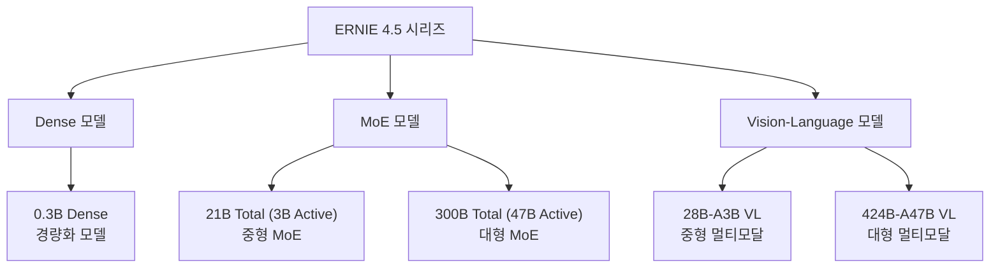

⏱️ **예상 읽기 시간**: 12분

## 서론

2025년 6월 30일, Baidu가 약속을 지켰습니다! 🚀 6월 마지막 날에 **ERNIE 4.5** 시리즈 10개 모델을 모두 오픈소스로 공개했습니다. 

**ERNIE 4.5**는 0.3B부터 424B까지의 광범위한 파라미터 범위를 커버하는 완전 오픈소스 AI 모델 시리즈입니다. MoE(Mixture of Experts) 아키텍처, Vision-Language 멀티모달 지원, 그리고 128K 컨텍스트 길이까지 지원하는 이 모델들은 **Apache 2.0 라이선스**로 상업적 활용이 자유롭습니다.

이 가이드에서는 ERNIE 4.5 시리즈의 모든 모델을 상세히 분석하고, 실전 활용 방법까지 완벽 정리해드리겠습니다.

## ERNIE 4.5 시리즈 개요

### 핵심 특징

**ERNIE 4.5**는 다음과 같은 혁신적 특징을 가지고 있습니다:

- **다양한 크기**: 0.3B Dense 모델부터 424B MoE 모델까지
- **MoE 아키텍처**: 47B & 3B active parameter 모델들
- **Vision-Language**: 텍스트+이미지 멀티모달 지원
- **긴 컨텍스트**: 128K 토큰 컨텍스트 길이 지원
- **완전 오픈**: Apache 2.0 라이선스로 상업적 사용 가능
- **다중 프레임워크**: Transformers & PaddlePaddle 지원

### 모델 라인업



## 모델별 상세 분석

### 1. ERNIE-4.5-0.3B: 경량화 Dense 모델

**특징**:
- **아키텍처**: Dense 모델 (MoE 아님)
- **파라미터**: 0.3B (3억 개)
- **용도**: 엣지 디바이스, 실시간 추론
- **언어**: 영어, 중국어

```python
# ERNIE-4.5-0.3B 사용 예시
from transformers import AutoTokenizer, AutoModelForCausalLM
import torch

model_name = "baidu/ERNIE-4.5-0.3B-PT"
tokenizer = AutoTokenizer.from_pretrained(model_name, trust_remote_code=True)
model = AutoModelForCausalLM.from_pretrained(
    model_name, 
    trust_remote_code=True,
    torch_dtype=torch.float16,
    device_map="auto"
)

# 텍스트 생성
prompt = "Artificial intelligence is"
inputs = tokenizer(prompt, return_tensors="pt")
outputs = model.generate(
    **inputs,
    max_length=100,
    temperature=0.7,
    do_sample=True
)
response = tokenizer.decode(outputs[0], skip_special_tokens=True)
print(response)
```

### 2. ERNIE-4.5-21B-A3B: 중형 MoE 모델

**특징**:
- **총 파라미터**: 21.9B (약 220억 개)
- **활성 파라미터**: 3B (30억 개)
- **아키텍처**: Mixture of Experts (MoE)
- **효율성**: 3B 모델 수준의 계산 비용으로 21B 성능

```python
# ERNIE-4.5-21B-A3B MoE 모델 사용
from transformers import AutoTokenizer, AutoModelForCausalLM
import torch

model_name = "baidu/ERNIE-4.5-21B-A3B-PT"
tokenizer = AutoTokenizer.from_pretrained(model_name, trust_remote_code=True)
model = AutoModelForCausalLM.from_pretrained(
    model_name,
    trust_remote_code=True,
    torch_dtype=torch.bfloat16,
    device_map="auto"
)

# 중국어 텍스트 생성
prompt = "人工智能的发展前景"
inputs = tokenizer(prompt, return_tensors="pt")
outputs = model.generate(
    **inputs,
    max_length=200,
    temperature=0.8,
    do_sample=True,
    pad_token_id=tokenizer.eos_token_id
)
response = tokenizer.decode(outputs[0], skip_special_tokens=True)
print(response)
```

### 3. ERNIE-4.5-300B-A47B: 대형 MoE 모델

**특징**:
- **총 파라미터**: 300.5B (약 3천억 개)
- **활성 파라미터**: 47B (470억 개)
- **성능**: GPT-4 급 성능을 47B 계산 비용으로
- **메모리 최적화**: 양자화 버전 제공

```python
# ERNIE-4.5-300B-A47B 고성능 추론
from transformers import AutoTokenizer, AutoModelForCausalLM
import torch

model_name = "baidu/ERNIE-4.5-300B-A47B-PT"
tokenizer = AutoTokenizer.from_pretrained(model_name, trust_remote_code=True)

# GPU 메모리가 부족한 경우 양자화 버전 사용
# model_name = "baidu/ERNIE-4.5-300B-A47B-FP8-Paddle"  # FP8 양자화
# model_name = "baidu/ERNIE-4.5-300B-A47B-2Bits-Paddle"  # 2bit 양자화

model = AutoModelForCausalLM.from_pretrained(
    model_name,
    trust_remote_code=True,
    torch_dtype=torch.bfloat16,
    device_map="auto",
    offload_folder="./offload"  # 디스크 오프로드 사용
)

# 복잡한 추론 작업
prompt = """
Analyze the following complex problem and provide a detailed solution:
A company needs to optimize its supply chain to reduce costs while maintaining quality.
"""

inputs = tokenizer(prompt, return_tensors="pt")
outputs = model.generate(
    **inputs,
    max_length=1000,
    temperature=0.7,
    do_sample=True,
    top_p=0.9
)
response = tokenizer.decode(outputs[0], skip_special_tokens=True)
print(response)
```

### 4. ERNIE-4.5-VL: Vision-Language 멀티모달 모델

**특징**:
- **멀티모달**: 텍스트 + 이미지 동시 처리
- **Vision Transformer**: ViT 및 UPO 기술 적용
- **두 가지 크기**: 28B-A3B, 424B-A47B
- **실시간 처리**: 이미지 분석과 텍스트 생성 동시 수행

```python
# ERNIE-4.5-VL Vision-Language 모델 사용
from transformers import AutoTokenizer, AutoModel
from PIL import Image
import torch
import requests

model_name = "baidu/ERNIE-4.5-VL-28B-A3B-PT"
tokenizer = AutoTokenizer.from_pretrained(model_name, trust_remote_code=True)
model = AutoModel.from_pretrained(
    model_name,
    trust_remote_code=True,
    torch_dtype=torch.bfloat16,
    device_map="auto"
)

# 이미지 로드
image_url = "https://example.com/sample_image.jpg"
image = Image.open(requests.get(image_url, stream=True).raw)

# 이미지 + 텍스트 질문
question = "What is happening in this image? Describe it in detail."

# 멀티모달 추론
inputs = {
    "image": image,
    "text": question
}

# Vision-Language 처리
with torch.no_grad():
    response = model.chat(
        tokenizer=tokenizer,
        query=question,
        image=image,
        max_length=500,
        temperature=0.7
    )

print(f"Question: {question}")
print(f"Answer: {response}")
```

## 성능 비교 및 벤치마크

### 계산 효율성 비교

| 모델 | 총 파라미터 | 활성 파라미터 | 추론 비용 | 성능 등급 |
|------|-------------|---------------|-----------|-----------|
| ERNIE-4.5-0.3B | 0.3B | 0.3B | 매우 낮음 | 기본 |
| ERNIE-4.5-21B-A3B | 21.9B | 3B | 낮음 | 높음 |
| ERNIE-4.5-300B-A47B | 300.5B | 47B | 중간 | 매우 높음 |
| ERNIE-4.5-VL-424B-A47B | 423.5B | 47B | 중간 | 최고 (멀티모달) |

### GPU 메모리 요구사항

```python
# 모델별 GPU 메모리 요구사항 계산
def estimate_gpu_memory(model_size_b, precision="fp16"):
    """모델 크기를 기반으로 GPU 메모리 요구사항 추정"""
    precision_multiplier = {
        "fp32": 4,
        "fp16": 2,
        "bfloat16": 2,
        "int8": 1,
        "int4": 0.5
    }
    
    base_memory = model_size_b * precision_multiplier[precision]
    overhead = base_memory * 0.2  # 20% 오버헤드
    
    return base_memory + overhead

# 각 모델별 메모리 요구사항
models = {
    "ERNIE-4.5-0.3B": 0.3,
    "ERNIE-4.5-21B-A3B": 3,  # 활성 파라미터 기준
    "ERNIE-4.5-300B-A47B": 47,  # 활성 파라미터 기준
    "ERNIE-4.5-VL-424B-A47B": 47
}

for model_name, active_params in models.items():
    memory_fp16 = estimate_gpu_memory(active_params, "fp16")
    memory_int8 = estimate_gpu_memory(active_params, "int8")
    
    print(f"{model_name}:")
    print(f"  FP16: {memory_fp16:.1f}GB")
    print(f"  INT8: {memory_int8:.1f}GB")
    print()
```

## 실전 배포 가이드

### 1. 로컬 환경 설정

```bash
# 환경 설정
pip install torch torchvision transformers accelerate
pip install paddlepaddle-gpu  # PaddlePaddle 버전 사용시

# 양자화 지원을 위한 추가 라이브러리
pip install bitsandbytes optimum
pip install auto-gptq  # GPTQ 양자화
```

### 2. Docker 컨테이너 배포

```dockerfile
# Dockerfile for ERNIE 4.5
FROM nvidia/cuda:12.1-devel-ubuntu22.04

# 기본 환경 설정
RUN apt-get update && apt-get install -y \
    python3 python3-pip git wget \
    && rm -rf /var/lib/apt/lists/*

# Python 라이브러리 설치
COPY requirements.txt .
RUN pip install -r requirements.txt

# 모델 캐시 디렉토리 생성
RUN mkdir -p /app/models /app/cache

# 애플리케이션 코드
COPY app/ /app/
WORKDIR /app

# 환경 변수
ENV TRANSFORMERS_CACHE=/app/cache
ENV HF_HOME=/app/cache

# 서비스 시작
EXPOSE 8000
CMD ["python3", "serve.py"]
```

```yaml
# docker-compose.yml
version: '3.8'
services:
  ernie-45:
    build: .
    ports:
      - "8000:8000"
    volumes:
      - ./models:/app/models
      - ./cache:/app/cache
    environment:
      - CUDA_VISIBLE_DEVICES=0,1
      - MODEL_NAME=baidu/ERNIE-4.5-21B-A3B-PT
    deploy:
      resources:
        reservations:
          devices:
            - driver: nvidia
              count: 2
              capabilities: [gpu]
```

### 3. Kubernetes 배포

```yaml
# k8s-deployment.yaml
apiVersion: apps/v1
kind: Deployment
metadata:
  name: ernie-45-deployment
spec:
  replicas: 2
  selector:
    matchLabels:
      app: ernie-45
  template:
    metadata:
      labels:
        app: ernie-45
    spec:
      containers:
      - name: ernie-45
        image: your-registry/ernie-45:latest
        ports:
        - containerPort: 8000
        resources:
          requests:
            memory: "32Gi"
            nvidia.com/gpu: 2
          limits:
            memory: "64Gi"
            nvidia.com/gpu: 2
        env:
        - name: MODEL_NAME
          value: "baidu/ERNIE-4.5-21B-A3B-PT"
        - name: MAX_BATCH_SIZE
          value: "4"
        volumeMounts:
        - name: model-cache
          mountPath: /app/cache
      volumes:
      - name: model-cache
        persistentVolumeClaim:
          claimName: model-cache-pvc
---
apiVersion: v1
kind: Service
metadata:
  name: ernie-45-service
spec:
  selector:
    app: ernie-45
  ports:
  - port: 80
    targetPort: 8000
  type: LoadBalancer
```

### 4. FastAPI 서비스 구현

```python
# serve.py - FastAPI 서비스
from fastapi import FastAPI, HTTPException
from pydantic import BaseModel
from transformers import AutoTokenizer, AutoModelForCausalLM
import torch
import os
from typing import Optional
import asyncio

app = FastAPI(title="ERNIE 4.5 API", version="1.0.0")

class GenerationRequest(BaseModel):
    prompt: str
    max_length: int = 500
    temperature: float = 0.7
    top_p: float = 0.9
    do_sample: bool = True

class GenerationResponse(BaseModel):
    generated_text: str
    model_name: str
    parameters_used: dict

# 모델 로딩
MODEL_NAME = os.environ.get("MODEL_NAME", "baidu/ERNIE-4.5-21B-A3B-PT")
print(f"Loading model: {MODEL_NAME}")

tokenizer = AutoTokenizer.from_pretrained(MODEL_NAME, trust_remote_code=True)
model = AutoModelForCausalLM.from_pretrained(
    MODEL_NAME,
    trust_remote_code=True,
    torch_dtype=torch.bfloat16,
    device_map="auto"
)

@app.post("/generate", response_model=GenerationResponse)
async def generate_text(request: GenerationRequest):
    try:
        inputs = tokenizer(request.prompt, return_tensors="pt")
        
        with torch.no_grad():
            outputs = model.generate(
                **inputs,
                max_length=request.max_length,
                temperature=request.temperature,
                top_p=request.top_p,
                do_sample=request.do_sample,
                pad_token_id=tokenizer.eos_token_id
            )
        
        generated_text = tokenizer.decode(outputs[0], skip_special_tokens=True)
        
        return GenerationResponse(
            generated_text=generated_text,
            model_name=MODEL_NAME,
            parameters_used={
                "max_length": request.max_length,
                "temperature": request.temperature,
                "top_p": request.top_p
            }
        )
    except Exception as e:
        raise HTTPException(status_code=500, detail=str(e))

@app.get("/health")
async def health_check():
    return {"status": "healthy", "model": MODEL_NAME}

if __name__ == "__main__":
    import uvicorn
    uvicorn.run(app, host="0.0.0.0", port=8000)
```

## 성능 최적화 팁

### 1. 메모리 최적화

```python
# 메모리 효율적인 모델 로딩
from transformers import AutoModelForCausalLM, BitsAndBytesConfig
import torch

# 4bit 양자화 설정
quantization_config = BitsAndBytesConfig(
    load_in_4bit=True,
    bnb_4bit_compute_dtype=torch.bfloat16,
    bnb_4bit_use_double_quant=True,
    bnb_4bit_quant_type="nf4"
)

# 양자화된 모델 로드
model = AutoModelForCausalLM.from_pretrained(
    "baidu/ERNIE-4.5-300B-A47B-PT",
    quantization_config=quantization_config,
    trust_remote_code=True,
    device_map="auto"
)

# CPU 오프로드 설정
model = AutoModelForCausalLM.from_pretrained(
    "baidu/ERNIE-4.5-300B-A47B-PT",
    trust_remote_code=True,
    device_map="auto",
    offload_folder="./cpu_offload",
    torch_dtype=torch.bfloat16
)
```

### 2. 배치 처리 최적화

```python
# 배치 추론 최적화
def batch_generate(prompts, model, tokenizer, batch_size=4):
    """배치 단위로 효율적인 텍스트 생성"""
    results = []
    
    for i in range(0, len(prompts), batch_size):
        batch_prompts = prompts[i:i+batch_size]
        
        # 배치 토크나이징
        inputs = tokenizer(
            batch_prompts, 
            return_tensors="pt", 
            padding=True, 
            truncation=True
        )
        
        # 배치 생성
        with torch.no_grad():
            outputs = model.generate(
                **inputs,
                max_length=200,
                temperature=0.7,
                do_sample=True,
                pad_token_id=tokenizer.eos_token_id
            )
        
        # 디코딩
        batch_results = [
            tokenizer.decode(output, skip_special_tokens=True) 
            for output in outputs
        ]
        results.extend(batch_results)
    
    return results

# 사용 예시
prompts = [
    "Explain artificial intelligence",
    "What is machine learning?",
    "How does deep learning work?",
    "Describe neural networks"
]

results = batch_generate(prompts, model, tokenizer)
```

### 3. 캐싱 및 모델 최적화

```python
# 모델 캐싱 및 컴파일 최적화
import torch._dynamo as dynamo

# PyTorch 2.0 컴파일 최적화
model = torch.compile(model, mode="reduce-overhead")

# KV 캐시 최적화
def optimized_generate(prompt, model, tokenizer):
    inputs = tokenizer(prompt, return_tensors="pt")
    
    # KV 캐시를 활용한 효율적 생성
    with torch.no_grad():
        outputs = model.generate(
            **inputs,
            max_length=500,
            use_cache=True,  # KV 캐시 활용
            temperature=0.7,
            do_sample=True
        )
    
    return tokenizer.decode(outputs[0], skip_special_tokens=True)
```

## 라이선스 및 상업적 활용

### Apache 2.0 라이선스 특징

**ERNIE 4.5**는 **Apache 2.0 라이선스**로 공개되어 다음과 같은 자유를 제공합니다:

- ✅ **상업적 사용**: 제품이나 서비스에 자유롭게 활용 가능
- ✅ **수정 및 배포**: 모델을 수정하고 재배포 가능
- ✅ **특허 권리**: Apache 2.0의 특허 보호 조항 적용
- ✅ **소스 공개 의무 없음**: 수정된 코드 공개 의무 없음

### 상업적 활용 가이드

```python
# 상업적 서비스 예시
class ERNIECommercialService:
    def __init__(self, model_name="baidu/ERNIE-4.5-21B-A3B-PT"):
        self.model_name = model_name
        self.tokenizer = AutoTokenizer.from_pretrained(model_name, trust_remote_code=True)
        self.model = AutoModelForCausalLM.from_pretrained(
            model_name,
            trust_remote_code=True,
            torch_dtype=torch.bfloat16,
            device_map="auto"
        )
    
    def generate_content(self, prompt, customer_id=None):
        """상업적 콘텐츠 생성 서비스"""
        # 고객별 사용량 추적
        if customer_id:
            self.track_usage(customer_id)
        
        inputs = self.tokenizer(prompt, return_tensors="pt")
        outputs = self.model.generate(
            **inputs,
            max_length=1000,
            temperature=0.7,
            do_sample=True
        )
        
        return self.tokenizer.decode(outputs[0], skip_special_tokens=True)
    
    def track_usage(self, customer_id):
        """사용량 추적 (과금 목적)"""
        # 상업적 서비스를 위한 사용량 추적 로직
        pass

# 상업적 서비스 인스턴스
commercial_service = ERNIECommercialService()
```

## 커뮤니티 및 지원

### 공식 리소스

- **Hugging Face 컬렉션**: [ERNIE 4.5 Collection](https://huggingface.co/collections/baidu/ernie-45-6861cd4c9be84540645f35c9)
- **모델 카드**: 각 모델별 상세 문서 제공
- **GitHub**: Baidu 공식 저장소 (업데이트 예정)
- **논문**: 기술적 세부사항 (출간 예정)

### 커뮤니티 활동

```python
# 커뮤니티 기여 예시
def contribute_to_ernie_community():
    """ERNIE 4.5 커뮤니티 기여 방법"""
    
    contributions = [
        "모델 성능 벤치마크 결과 공유",
        "새로운 활용 사례 개발",
        "최적화 기법 공유",
        "버그 리포트 및 수정",
        "번역 및 다국어 지원",
        "교육 자료 제작"
    ]
    
    return contributions

# 성능 벤치마크 기여 예시
def benchmark_ernie_performance():
    """커뮤니티 벤치마크 기여"""
    import time
    
    model_name = "baidu/ERNIE-4.5-21B-A3B-PT"
    prompts = ["Test prompt " + str(i) for i in range(100)]
    
    start_time = time.time()
    results = batch_generate(prompts, model, tokenizer)
    end_time = time.time()
    
    benchmark_results = {
        "model": model_name,
        "total_prompts": len(prompts),
        "total_time": end_time - start_time,
        "throughput": len(prompts) / (end_time - start_time),
        "average_length": sum(len(r) for r in results) / len(results)
    }
    
    return benchmark_results
```

## 미래 전망 및 로드맵

### 예상 업데이트

1. **더 큰 모델**: 1T+ 파라미터 모델 출시 예정
2. **특화 모델**: 도메인별 특화 버전 (의료, 법률, 금융)
3. **멀티모달 확장**: 오디오, 비디오 지원 확대
4. **효율성 개선**: 더 효율적인 MoE 아키텍처
5. **툴 통합**: LangChain, AutoGen 등과의 네이티브 통합

### 기술적 혁신 포인트

```python
# 향후 기술 발전 방향 예측
future_innovations = {
    "architecture": [
        "Dynamic MoE routing",
        "Adaptive expert selection", 
        "Cross-modal expert sharing"
    ],
    "efficiency": [
        "Sub-linear scaling MoE",
        "Memory-efficient attention",
        "Dynamic batching optimization"
    ],
    "capabilities": [
        "Code generation specialization",
        "Scientific reasoning enhancement",
        "Real-time multimodal processing"
    ]
}

# 예상 성능 개선
performance_roadmap = {
    "2025 Q3": "Code generation 50% improvement",
    "2025 Q4": "Multimodal latency 3x reduction", 
    "2026 Q1": "128K+ context stable support",
    "2026 Q2": "Domain-specific expert modules"
}
```

## 결론

**Baidu ERNIE 4.5**는 2025년 오픈소스 AI 생태계에 중대한 변화를 가져왔습니다. 🔥

### 주요 혁신점

1. **완전한 오픈소스**: Apache 2.0으로 상업적 활용 자유
2. **스케일러블 아키텍처**: 0.3B부터 424B까지 다양한 선택
3. **MoE 효율성**: 47B 활성으로 424B 성능 달성
4. **멀티모달 지원**: 텍스트+비전 통합 처리
5. **실용적 배포**: 다양한 환경 지원

### 활용 권장사항

- **스타트업**: 0.3B 또는 21B-A3B 모델로 시작
- **중견기업**: 300B-A47B로 고성능 서비스 구축
- **대기업**: VL 모델로 멀티모달 혁신 추진
- **연구기관**: 전체 시리즈로 포괄적 연구 수행

Baidu가 약속을 지키며 공개한 ERNIE 4.5 시리즈는 오픈소스 AI의 새로운 장을 열었습니다. 이제 여러분의 프로젝트에 이 강력한 모델들을 활용해 혁신을 만들어보시기 바랍니다! 🚀

---

**참고 링크**:
- [ERNIE 4.5 Hugging Face 컬렉션](https://huggingface.co/collections/baidu/ernie-45-6861cd4c9be84540645f35c9)
- [Apache 2.0 라이선스 전문](https://www.apache.org/licenses/LICENSE-2.0)
- [Transformers 라이브러리 문서](https://huggingface.co/docs/transformers/)
- [PaddlePaddle 공식 문서](https://www.paddlepaddle.org.cn/) 