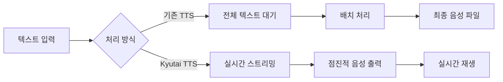

⏱️ **예상 읽기 시간**: 8분

## 서론

실시간 음성 합성 기술이 빠르게 발전하면서, 전체 텍스트를 기다리지 않고 즉시 음성 출력을 시작하는 스트리밍 TTS의 중요성이 커지고 있습니다. Kyutai에서 공개한 **TTS 1.6B 모델**은 이러한 요구사항을 충족하는 혁신적인 오픈소스 솔루션으로, **CC-BY 4.0 라이센스**를 통해 상업적 이용까지 가능합니다.

이 글에서는 Kyutai TTS 모델의 핵심 기능, 기술적 특징, 그리고 실제 구현 방법을 상세히 알아보겠습니다.

## Kyutai TTS 1.6B 모델 개요

### 🎯 핵심 특징

**Kyutai TTS 1.6B**는 실시간 텍스트-음성 변환을 위한 계층적 Transformer 모델입니다.

| 특징 | 상세 내용 |
|------|-----------|
| **모델 크기** | 백본 1B + depth transformer 600M 파라미터 |
| **지원 언어** | 영어, 프랑스어 |
| **라이센스** | **CC-BY 4.0** (상업적 이용 가능) |
| **프레임률** | 12.5 Hz |
| **오디오 토큰** | 32개 (추론 시 조정 가능) |
| **지연 시간** | 1.28초 (16 스텝) |

### 📋 라이센스 분석: CC-BY 4.0

**CC-BY 4.0 라이센스**는 가장 관대한 Creative Commons 라이센스 중 하나입니다.

**✅ 허용 사항:**
- 상업적 이용
- 수정 및 재배포
- 사용, 복사, 배포
- 파생 작품 생성

**📌 의무 사항:**
- 저작자 표시 (Attribution)
- 라이센스 명시

**💡 비즈니스 활용도:**
- 엔터프라이즈 제품 통합 가능
- SaaS 서비스 백엔드 활용 가능
- 커스터마이징 및 재판매 가능

## 기술적 아키텍처

### 🏗️ 모델 구조

Kyutai TTS는 [Moshi 아키텍처](https://arxiv.org/abs/2410.00037)를 기반으로 한 멀티스트림 디자인을 사용합니다.

```python
# 모델 구조 개념도
class KyutaiTTS:
    def __init__(self):
        self.backbone_model = "1B parameters"
        self.depth_transformer = "600M parameters"
        self.audio_tokenizer = "Mimi"
        self.frame_rate = 12.5  # Hz
        self.audio_tokens_per_frame = 32
        self.acoustic_delay = 2
```

### 🔄 스트리밍 처리 방식

**기존 오프라인 TTS vs Kyutai 스트리밍 TTS:**



### 🎵 음성 조건화 (Voice Conditioning)

Kyutai TTS는 사전 계산된 임베딩을 통한 음성 조건화를 지원합니다.

```python
# 음성 조건화 예제
from kyutai_tts import load_voice_embedding

# 사전 정의된 음성 임베딩 로드
voice_embedding = load_voice_embedding("professional_male_en")

# 텍스트를 특정 음성으로 변환
audio_output = model.generate(
    text="Hello, this is a test.",
    voice_embedding=voice_embedding,
    streaming=True
)
```

## 훈련 데이터 및 성능 최적화

### 📊 훈련 스펙

**데이터셋:**
- **2.5백만 시간**의 공개 오디오 콘텐츠
- Whisper-timestamped로 생성된 합성 전사본
- Whisper-medium 모델 사용

**훈련 환경:**
- **사전 훈련**: 32x H100 GPU, 750k 스텝
- **CFG Distillation**: 8x H100 GPU, 24k 업데이트
- 배치 크기: 64
- 세그먼트 길이: 120초

### ⚡ CFG Distillation 최적화

**Classifier Free Guidance (CFG) Distillation**은 추론 속도를 크게 향상시킵니다.

**성능 개선:**
- 배치 크기 2배 불필요
- **75x 실시간 생성** 처리량 달성
- 품질 저하 없는 고속 추론

## 실제 구현 가이드

### 🚀 빠른 시작

**1단계: 환경 설정**

```bash
# 필요한 패키지 설치
pip install torch transformers huggingface_hub
pip install kyutai-tts  # 가상의 패키지명

# 모델 다운로드
from huggingface_hub import snapshot_download
snapshot_download("kyutai/tts-1.6b-en_fr", local_dir="./kyutai-tts")
```

**2단계: 기본 사용법**

```python
import torch
from kyutai_tts import KyutaiTTS

# 모델 로드
model = KyutaiTTS.from_pretrained("kyutai/tts-1.6b-en_fr")
model.eval()

# 실시간 음성 합성
text = "This is a streaming text-to-speech example."
audio_stream = model.stream_generate(text, language="en")

# 스트림 처리
for audio_chunk in audio_stream:
    # 실시간 재생 또는 저장
    play_audio_chunk(audio_chunk)
```

### 🎛️ 고급 설정

**음성 품질 조정:**

```python
# 고품질 설정 (느린 생성)
audio_high_quality = model.generate(
    text=text,
    num_audio_tokens=32,  # 최대 토큰 수
    temperature=0.7,
    top_p=0.9
)

# 고속 설정 (빠른 생성)
audio_fast = model.generate(
    text=text,
    num_audio_tokens=16,  # 줄어든 토큰 수
    temperature=1.0,
    top_p=0.95
)
```

**배치 처리:**

```python
# 여러 텍스트 동시 처리
texts = [
    "First sentence in English.",
    "Deuxième phrase en français.",
    "Third sentence with different voice."
]

# 배치 생성으로 처리량 최적화
audio_outputs = model.batch_generate(
    texts=texts,
    batch_size=4,
    streaming=True
)
```

## 보안 및 윤리적 고려사항

### 🛡️ 음성 복제 제한

Kyutai TTS는 무분별한 음성 복제를 방지하기 위한 설계를 채택했습니다.

**제한 사항:**
- **사전 계산된 임베딩만** 사용 가능
- 실시간 음성 복제 불가
- 워터마킹 대신 접근 제어 방식 채택

**워터마킹 미사용 이유:**
1. 오픈소스 모델에서 쉽게 제거 가능
2. Mimi 인코딩/디코딩으로 워터마크 손실
3. 사전 임베딩 제한이 더 효과적

### 🔒 상업적 활용 가이드라인

**CC-BY 4.0 라이센스 준수:**

```python
# 코드 내 저작자 표시 예제
"""
This application uses Kyutai TTS model (kyutai/tts-1.6b-en_fr)
Licensed under CC-BY 4.0
Original work by: Kyutai Research Team
Model URL: https://huggingface.co/kyutai/tts-1.6b-en_fr
"""

def generate_speech_with_attribution(text):
    # 저작자 표시와 함께 음성 생성
    return model.generate(text)
```

## 다른 TTS 모델과의 비교

### 📈 성능 비교표

| 모델 | 파라미터 | 스트리밍 | 다국어 | 라이센스 | 상업 이용 |
|------|----------|----------|---------|----------|-----------|
| **Kyutai TTS** | 1.6B | ✅ | EN/FR | CC-BY 4.0 | ✅ |
| Coqui TTS | 다양 | ❌ | 다국어 | Mozilla | ✅ |
| Tortoise TTS | 2.8B | ❌ | EN | Apache 2.0 | ✅ |
| Bark | 1B+ | ❌ | 다국어 | MIT | ✅ |

### 🎯 활용 시나리오별 추천

**실시간 대화형 AI:**
- ✅ Kyutai TTS (스트리밍 특화)
- ❌ Tortoise TTS (고품질이지만 느림)

**다국어 지원 필요:**
- ✅ Coqui TTS (광범위한 언어 지원)
- ⚠️ Kyutai TTS (현재 EN/FR만)

**상업적 프로덕션:**
- ✅ Kyutai TTS (CC-BY 4.0, 최적화됨)
- ✅ Coqui TTS (Mozilla 라이센스)

## 향후 발전 방향

### 🔮 예상 업데이트

**모델 개선 영역:**
1. **언어 확장**: 한국어, 일본어, 중국어 지원
2. **음성 품질**: 더 자연스러운 감정 표현
3. **처리 속도**: 더 빠른 실시간 생성
4. **모델 크기**: 경량화된 모바일 버전

**커뮤니티 기여 방향:**
- 새로운 언어 데이터셋 기여
- 음성 임베딩 컬렉션 확장
- 최적화 기법 공유
- 실제 사용 사례 문서화

## 실제 프로덕션 활용 사례

### 💼 엔터프라이즈 통합 예제

**웹 서비스 통합:**

```python
from flask import Flask, request, Response
import io

app = Flask(__name__)
tts_model = KyutaiTTS.from_pretrained("kyutai/tts-1.6b-en_fr")

@app.route('/tts/stream', methods=['POST'])
def stream_tts():
    text = request.json['text']
    language = request.json.get('language', 'en')
    
    def generate():
        for audio_chunk in tts_model.stream_generate(text, language):
            yield audio_chunk.tobytes()
    
    return Response(generate(), mimetype='audio/wav')

if __name__ == '__main__':
    app.run(host='0.0.0.0', port=5000)
```

**실시간 스트리밍 서버:**

```python
import asyncio
import websockets
import json

async def tts_handler(websocket, path):
    async for message in websocket:
        data = json.loads(message)
        text = data['text']
        
        # 스트리밍 TTS 생성
        for audio_chunk in tts_model.stream_generate(text):
            await websocket.send(audio_chunk.tobytes())

# WebSocket 서버 시작
start_server = websockets.serve(tts_handler, "localhost", 8765)
asyncio.get_event_loop().run_until_complete(start_server)
asyncio.get_event_loop().run_forever()
```

## 결론

Kyutai TTS 1.6B 모델은 **CC-BY 4.0 라이센스**의 관대한 조건과 함께 실시간 음성 합성의 새로운 가능성을 제시합니다. 특히 스트리밍 기능과 CFG distillation을 통한 최적화는 상업적 프로덕션 환경에서 즉시 활용 가능한 수준의 성능을 보여줍니다.

**핵심 장점 요약:**
- ✅ **상업적 자유로운 활용** (CC-BY 4.0)
- ✅ **실시간 스트리밍** 지원
- ✅ **최적화된 성능** (75x 실시간)
- ✅ **음성 조건화** 기능
- ✅ **오픈소스 투명성**

앞으로 더 많은 언어 지원과 모델 경량화가 진행된다면, Kyutai TTS는 오픈소스 음성 합성 생태계의 핵심 솔루션으로 자리잡을 것으로 예상됩니다.

**참고 자료:**
- [Kyutai TTS 모델 페이지](https://huggingface.co/kyutai/tts-1.6b-en_fr)
- [Moshi 아키텍처 논문](https://arxiv.org/abs/2410.00037)
- [CC-BY 4.0 라이센스 전문](https://creativecommons.org/licenses/by/4.0/)
- [Kyutai 공식 프로젝트 페이지](https://kyutai.org/next/tts) 