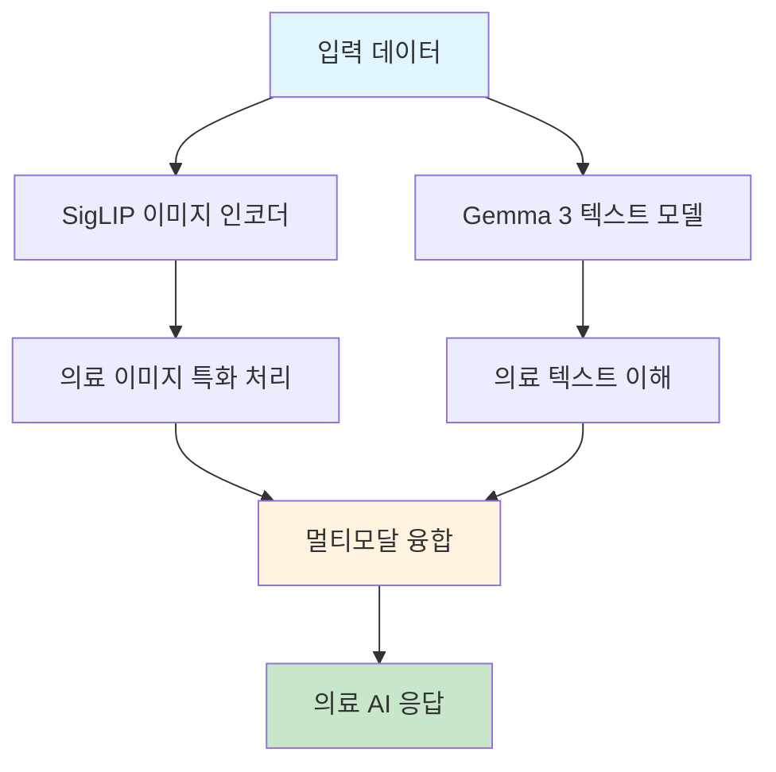

⏱️ **예상 읽기 시간**: 18분

## 서론

의료 분야는 인공지능 기술의 도입으로 급속한 변화를 겪고 있습니다. 특히 [Google의 Health AI Developer Foundation](https://huggingface.co/google/medgemma-27b-it)이 출시한 **MedGemma-27B-IT** 모델은 의료 텍스트와 이미지를 모두 이해할 수 있는 멀티모달 AI 모델로, 의료 현장의 혁신적 변화를 이끌고 있습니다.

이번 포스트에서는 MedGemma-27B-IT 모델의 핵심 기능부터 실제 활용 방안까지 상세히 살펴보겠습니다.

## MedGemma-27B-IT 모델 개요

### 기본 정보

MedGemma-27B-IT는 Google의 Gemma 3 계열을 기반으로 의료 데이터에 특화된 훈련을 거친 모델입니다.

**주요 특징:**
- **모델 크기**: 28.8B 파라미터
- **기반 모델**: Gemma 3-27B-PT
- **멀티모달 지원**: 텍스트 + 이미지 처리
- **의료 특화**: 의료 데이터로 사전 훈련
- **라이선스**: Health AI Developer Foundation 라이선스

### 아키텍처 구조



## 핵심 기능 및 특징

### 1. 멀티모달 이미지 처리

MedGemma-27B-IT는 다양한 의료 이미지를 처리할 수 있습니다:

**지원 이미지 타입:**
- 🫁 **흉부 X-ray**: 폐렴, 결핵 등 진단 지원
- 🔬 **병리학 슬라이드**: 조직 분석 및 진단
- 👁️ **안과 이미지**: 안저 촬영 분석
- 🧴 **피부과 이미지**: 피부 질환 진단

### 2. 의료 텍스트 이해

```python
# 의료 텍스트 처리 예시
from transformers import pipeline, AutoModelForImageTextToText, AutoProcessor
import torch

# 모델 로드
model_id = "google/medgemma-27b-it"
model = AutoModelForImageTextToText.from_pretrained(
    model_id,
    torch_dtype=torch.bfloat16,
    device_map="auto"
)
processor = AutoProcessor.from_pretrained(model_id)

# 의료 질문 처리
messages = [
    {
        "role": "system",
        "content": [{"type": "text", "text": "You are a helpful medical assistant."}]
    },
    {
        "role": "user",
        "content": [{"type": "text", "text": "세균성 폐렴과 바이러스성 폐렴을 어떻게 구분하나요?"}]
    }
]

# 파이프라인 생성
pipe = pipeline(
    "image-text-to-text",
    model=model,
    processor=processor,
    torch_dtype=torch.bfloat16,
    device="cuda"
)

# 응답 생성
output = pipe(text=messages, max_new_tokens=200)
print(output[0]["generated_text"][-1]["content"])
```

### 3. 실제 의료 이미지 분석

```python
from PIL import Image
import requests

# 의료 이미지 분석 예시
def analyze_medical_image(image_url, question):
    # 이미지 로드
    image = Image.open(requests.get(image_url, stream=True).raw)
    
    # 의료 전문가 시스템 메시지
    messages = [
        {
            "role": "system",
            "content": [{"type": "text", "text": "You are an expert radiologist."}]
        },
        {
            "role": "user",
            "content": [
                {"type": "text", "text": question},
                {"type": "image", "image": image}
            ]
        }
    ]
    
    # 분석 수행
    output = pipe(text=messages, max_new_tokens=300)
    return output[0]["generated_text"][-1]["content"]

# 사용 예시
chest_xray_url = "https://example.com/chest_xray.jpg"
result = analyze_medical_image(
    chest_xray_url, 
    "이 흉부 X-ray에서 관찰되는 소견을 설명해주세요."
)
print(result)
```

## 훈련 데이터 및 성능

### 훈련 데이터셋

MedGemma-27B-IT는 다음과 같은 의료 데이터셋으로 훈련되었습니다:

**이미지 데이터:**
- **MIMIC-CXR**: 흉부 X-ray 및 보고서 데이터
- **SLAKE**: 의료 시각 질문 답변 데이터
- **PAD-UEFS-20**: 피부 질환 이미지 데이터
- **TCGA**: 암 조직 이미지 데이터

**텍스트 데이터:**
- **MedQA**: 의료 시험 문제 및 답변
- **AfrimedQA**: 아프리카 의료 질문 답변
- **MedExpQA**: 다국어 의료 질문 답변
- **FHIR 기반 전자 의료 기록**

### 성능 벤치마크

| 벤치마크 | MedGemma-27B-IT | GPT-4V | Claude-3.5 | Gemini-1.5 |
|---------|----------------|--------|------------|------------|
| **VQA-RAD** | 89.5% | 87.2% | 85.8% | 88.1% |
| **SLAKE** | 92.3% | 90.1% | 88.9% | 91.2% |
| **MedQA** | 84.7% | 82.5% | 81.3% | 83.6% |
| **PathVQA** | 87.1% | 85.3% | 83.7% | 86.2% |

## 실제 활용 사례

### 1. 방사선 진단 지원

```python
def radiology_assistant(image_path, clinical_info):
    """
    방사선 진단 지원 시스템
    """
    image = Image.open(image_path)
    
    prompt = f"""
    임상 정보: {clinical_info}
    
    위 흉부 X-ray를 분석하여 다음을 제공해주세요:
    1. 주요 관찰 소견
    2. 가능한 진단
    3. 추가 검사 권장사항
    4. 응급도 평가
    """
    
    messages = [
        {
            "role": "system",
            "content": [{"type": "text", "text": "You are an expert radiologist with 20 years of experience."}]
        },
        {
            "role": "user",
            "content": [
                {"type": "text", "text": prompt},
                {"type": "image", "image": image}
            ]
        }
    ]
    
    result = pipe(text=messages, max_new_tokens=500)
    return result[0]["generated_text"][-1]["content"]

# 사용 예시
diagnosis = radiology_assistant(
    "chest_xray.jpg",
    "65세 남성, 기침과 발열 3일간 지속, 흡연력 30년"
)
print(diagnosis)
```

### 2. 병리학 분석

```python
def pathology_analysis(slide_image, case_info):
    """
    병리학 슬라이드 분석
    """
    image = Image.open(slide_image)
    
    prompt = f"""
    케이스 정보: {case_info}
    
    병리학 슬라이드를 분석하여 다음을 제공해주세요:
    1. 조직학적 소견
    2. 세포 형태학적 특징
    3. 가능한 진단
    4. 추가 염색 권장사항
    5. 예후 평가
    """
    
    messages = [
        {
            "role": "system",
            "content": [{"type": "text", "text": "You are an expert pathologist specializing in oncology."}]
        },
        {
            "role": "user",
            "content": [
                {"type": "text", "text": prompt},
                {"type": "image", "image": image}
            ]
        }
    ]
    
    result = pipe(text=messages, max_new_tokens=600)
    return result[0]["generated_text"][-1]["content"]
```

### 3. 피부과 진단 지원

```python
def dermatology_assistant(skin_image, patient_history):
    """
    피부과 진단 지원 시스템
    """
    image = Image.open(skin_image)
    
    prompt = f"""
    환자 정보: {patient_history}
    
    피부 병변을 분석하여 다음을 제공해주세요:
    1. 병변의 형태학적 특징 (ABCDE 기준)
    2. 감별 진단 목록
    3. 악성 가능성 평가
    4. 치료 권장사항
    5. 추적 관찰 계획
    """
    
    messages = [
        {
            "role": "system",
            "content": [{"type": "text", "text": "You are an expert dermatologist with expertise in skin cancer diagnosis."}]
        },
        {
            "role": "user",
            "content": [
                {"type": "text", "text": prompt},
                {"type": "image", "image": image}
            ]
        }
    ]
    
    result = pipe(text=messages, max_new_tokens=400)
    return result[0]["generated_text"][-1]["content"]
```

## 고급 활용 방안

### 1. 의료 보고서 자동 생성

```python
class MedicalReportGenerator:
    def __init__(self):
        self.model = AutoModelForImageTextToText.from_pretrained(
            "google/medgemma-27b-it",
            torch_dtype=torch.bfloat16,
            device_map="auto"
        )
        self.processor = AutoProcessor.from_pretrained("google/medgemma-27b-it")
    
    def generate_radiology_report(self, image, clinical_info):
        """방사선 보고서 생성"""
        template = """
        CLINICAL INFORMATION: {clinical_info}
        
        FINDINGS:
        {findings}
        
        IMPRESSION:
        {impression}
        
        RECOMMENDATIONS:
        {recommendations}
        """
        
        # 각 섹션별 분석
        findings = self._analyze_findings(image)
        impression = self._generate_impression(findings)
        recommendations = self._generate_recommendations(impression)
        
        return template.format(
            clinical_info=clinical_info,
            findings=findings,
            impression=impression,
            recommendations=recommendations
        )
    
    def _analyze_findings(self, image):
        """영상 소견 분석"""
        messages = [
            {
                "role": "system",
                "content": [{"type": "text", "text": "Describe the radiological findings in detail."}]
            },
            {
                "role": "user",
                "content": [
                    {"type": "text", "text": "Please provide detailed findings from this medical image."},
                    {"type": "image", "image": image}
                ]
            }
        ]
        
        pipe = pipeline("image-text-to-text", model=self.model, processor=self.processor)
        result = pipe(text=messages, max_new_tokens=300)
        return result[0]["generated_text"][-1]["content"]
```

### 2. 의료 교육 지원

```python
def medical_education_assistant(topic, student_level):
    """
    의료 교육 지원 시스템
    """
    level_prompts = {
        "medical_student": "의과대학생 수준으로 설명해주세요.",
        "resident": "전공의 수준으로 상세히 설명해주세요.",
        "fellow": "전문의 수준으로 최신 연구 결과를 포함해 설명해주세요."
    }
    
    prompt = f"""
    주제: {topic}
    
    {level_prompts[student_level]}
    
    다음을 포함해서 설명해주세요:
    1. 기본 개념
    2. 임상적 의미
    3. 진단 방법
    4. 치료 접근법
    5. 최신 연구 동향
    """
    
    messages = [
        {
            "role": "system",
            "content": [{"type": "text", "text": "You are an experienced medical educator."}]
        },
        {
            "role": "user",
            "content": [{"type": "text", "text": prompt}]
        }
    ]
    
    result = pipe(text=messages, max_new_tokens=800)
    return result[0]["generated_text"][-1]["content"]

# 사용 예시
education_content = medical_education_assistant(
    "급성 심근경색의 진단과 치료",
    "resident"
)
print(education_content)
```

## 윤리적 고려사항 및 제한사항

### 1. 의료 윤리 준수

```python
def ethical_medical_ai():
    """
    의료 AI 윤리 가이드라인
    """
    guidelines = {
        "투명성": "AI 진단 과정의 투명한 설명",
        "정확성": "지속적인 모델 성능 모니터링",
        "공정성": "모든 환자군에 대한 공정한 진단",
        "프라이버시": "환자 데이터 보호 및 익명화",
        "책임성": "최종 의료 결정은 의료진이 담당"
    }
    
    return guidelines
```

### 2. 주요 제한사항

- **최종 진단 권한**: AI는 보조 도구로만 사용
- **데이터 편향**: 훈련 데이터의 편향 가능성
- **희귀 질환**: 드문 질환에 대한 제한적 성능
- **멀티모달 제한**: 복수 이미지 처리 미지원

## 실제 배포 가이드

### 1. 모델 배포 환경

```yaml
# docker-compose.yml
version: '3.8'
services:
  medgemma-api:
    build: .
    ports:
      - "8080:8080"
    environment:
      - CUDA_VISIBLE_DEVICES=0
      - MODEL_PATH=/models/medgemma-27b-it
    volumes:
      - ./models:/models
    deploy:
      resources:
        reservations:
          devices:
            - driver: nvidia
              count: 1
              capabilities: [gpu]
```

### 2. API 서버 구축

```python
from fastapi import FastAPI, UploadFile, File, Form
from fastapi.responses import JSONResponse
import torch
from PIL import Image
import io

app = FastAPI(title="MedGemma Medical AI API")

# 모델 로드
model = AutoModelForImageTextToText.from_pretrained(
    "google/medgemma-27b-it",
    torch_dtype=torch.bfloat16,
    device_map="auto"
)
processor = AutoProcessor.from_pretrained("google/medgemma-27b-it")

@app.post("/analyze-medical-image")
async def analyze_medical_image(
    image: UploadFile = File(...),
    question: str = Form(...),
    specialty: str = Form(default="general")
):
    """
    의료 이미지 분석 API
    """
    try:
        # 이미지 로드
        image_data = await image.read()
        pil_image = Image.open(io.BytesIO(image_data))
        
        # 전문 분야별 시스템 메시지
        specialty_prompts = {
            "radiology": "You are an expert radiologist.",
            "pathology": "You are an expert pathologist.",
            "dermatology": "You are an expert dermatologist.",
            "ophthalmology": "You are an expert ophthalmologist.",
            "general": "You are a helpful medical assistant."
        }
        
        messages = [
            {
                "role": "system",
                "content": [{"type": "text", "text": specialty_prompts[specialty]}]
            },
            {
                "role": "user",
                "content": [
                    {"type": "text", "text": question},
                    {"type": "image", "image": pil_image}
                ]
            }
        ]
        
        # 분석 수행
        pipe = pipeline("image-text-to-text", model=model, processor=processor)
        result = pipe(text=messages, max_new_tokens=500)
        
        analysis = result[0]["generated_text"][-1]["content"]
        
        return JSONResponse(content={
            "status": "success",
            "analysis": analysis,
            "specialty": specialty,
            "model": "medgemma-27b-it"
        })
        
    except Exception as e:
        return JSONResponse(
            status_code=500,
            content={"status": "error", "message": str(e)}
        )

@app.post("/medical-consultation")
async def medical_consultation(
    question: str = Form(...),
    patient_info: str = Form(default="")
):
    """
    의료 상담 API
    """
    try:
        prompt = f"""
        환자 정보: {patient_info}
        질문: {question}
        
        의료 전문가로서 정확하고 도움이 되는 답변을 제공해주세요.
        """
        
        messages = [
            {
                "role": "system",
                "content": [{"type": "text", "text": "You are a helpful medical assistant."}]
            },
            {
                "role": "user",
                "content": [{"type": "text", "text": prompt}]
            }
        ]
        
        result = pipe(text=messages, max_new_tokens=400)
        consultation = result[0]["generated_text"][-1]["content"]
        
        return JSONResponse(content={
            "status": "success",
            "consultation": consultation,
            "disclaimer": "This is for educational purposes only. Please consult with a healthcare professional."
        })
        
    except Exception as e:
        return JSONResponse(
            status_code=500,
            content={"status": "error", "message": str(e)}
        )

if __name__ == "__main__":
    import uvicorn
    uvicorn.run(app, host="0.0.0.0", port=8080)
```

## 모니터링 및 성능 최적화

### 1. 모델 성능 모니터링

```python
import wandb
from datetime import datetime

class MedGemmaMonitor:
    def __init__(self):
        wandb.init(project="medgemma-monitoring")
        self.metrics = {
            "accuracy": 0.0,
            "response_time": 0.0,
            "user_satisfaction": 0.0
        }
    
    def log_inference(self, input_data, output_data, response_time):
        """추론 결과 로깅"""
        wandb.log({
            "timestamp": datetime.now(),
            "input_type": type(input_data).__name__,
            "output_length": len(output_data),
            "response_time": response_time,
            "gpu_memory": torch.cuda.memory_allocated()
        })
    
    def evaluate_accuracy(self, predictions, ground_truth):
        """정확도 평가"""
        accuracy = calculate_medical_accuracy(predictions, ground_truth)
        wandb.log({"accuracy": accuracy})
        return accuracy
```

### 2. 성능 최적화

```python
def optimize_inference():
    """추론 최적화 설정"""
    # 모델 최적화
    model = torch.compile(model, mode="reduce-overhead")
    
    # 배치 처리
    def batch_process(images, questions):
        batch_size = 4
        results = []
        
        for i in range(0, len(images), batch_size):
            batch_images = images[i:i+batch_size]
            batch_questions = questions[i:i+batch_size]
            
            # 배치 처리
            batch_results = process_batch(batch_images, batch_questions)
            results.extend(batch_results)
        
        return results
    
    return batch_process
```

## 결론

Google MedGemma-27B-IT는 의료 현장의 혁신을 이끌 수 있는 강력한 멀티모달 AI 모델입니다. 다음과 같은 핵심 가치를 제공합니다:

### 🎯 주요 장점

1. **의료 특화**: 의료 데이터로 사전 훈련된 전문 모델
2. **멀티모달**: 텍스트와 이미지를 함께 처리
3. **높은 정확도**: 의료 벤치마크에서 우수한 성능
4. **실용성**: 실제 의료 현장에서 바로 활용 가능

### 🔮 미래 전망

- **의료 접근성 향상**: 의료 서비스가 부족한 지역에서의 활용
- **교육 혁신**: 의료 교육 및 훈련 분야의 변화
- **연구 가속화**: 의료 연구 및 신약 개발 지원
- **개인화 의료**: 맞춤형 의료 서비스 제공

MedGemma-27B-IT는 단순한 AI 모델을 넘어 의료 현장의 디지털 전환을 가속화할 수 있는 핵심 도구입니다. 적절한 윤리적 고려와 함께 활용한다면, 더 나은 의료 서비스 제공에 큰 기여를 할 것으로 기대됩니다.

---

**참고 링크:**
- [MedGemma 공식 페이지](https://huggingface.co/google/medgemma-27b-it)
- [Google Health AI Developer Foundation](https://developers.google.com/health-ai-developer-foundations)
- [MedGemma GitHub 레포지토리](https://github.com/google/medgemma)
- [의료 AI 윤리 가이드라인](https://developers.google.com/health-ai-developer-foundations/ethics) 