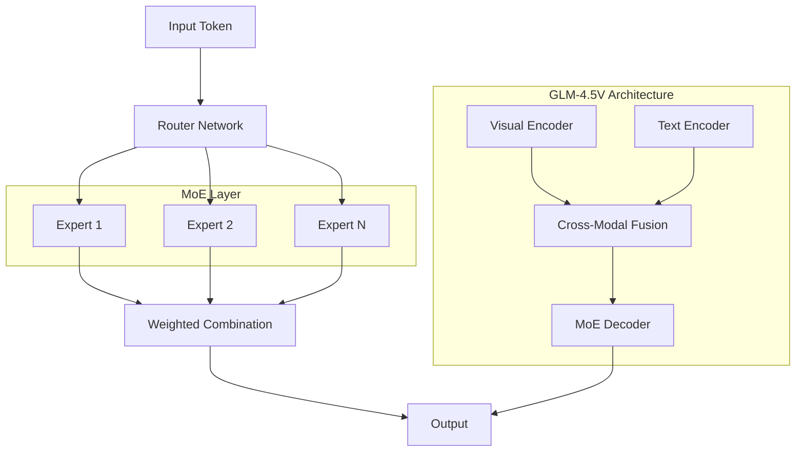

⏱️ **예상 읽기 시간**: 16분

## 서론

오픈소스 멀티모달 AI 분야에서 새로운 전환점이 되는 순간이 왔습니다. [Z.ai](https://z.ai)에서 공개한 GLM-4.5V는 동급 오픈소스 모델 중 최첨단 성능을 달성하며, 41개의 벤치마크에서 압도적인 우위를 점했습니다.

GLM-4.5V는 단순한 성능 향상을 넘어 오픈소스 커뮤니티에 새로운 가능성을 제시합니다. 강력한 106B 매개변수 MoE(Mixture of Experts) 아키텍처를 통해 효과적인 확장성을 달성하면서도, GLM-4.1V-Thinking의 검증된 추론 기술을 계승했습니다.

본 분석에서는 GLM-4.5V의 기술적 혁신부터 실제 활용 방법까지 포괄적으로 살펴보겠습니다.

## GLM-4.5V 개요

### 핵심 특징

**🎯 최첨단 성능**
- 41개 벤치마크에서 동급 오픈소스 모델 대비 압도적 우위
- 시각 추론 작업에서 혁신적 성능 달성
- 멀티모달 이해 능력의 새로운 기준 제시

**🧠 고급 아키텍처**
- 106B 매개변수 MoE(Mixture of Experts) 구조
- GLM-4.5-Air 기반 모델에서 파생
- GLM-4.1V-Thinking의 검증된 기술 계승

**🌐 오픈소스 철학**
- 완전한 오픈소스 라이센스로 공개
- 연구 및 상업적 활용 모두 지원
- 활발한 커뮤니티 기여 환경

### 기술 사양

| 구성요소 | 상세 정보 | 특징 |
|---------|----------|------|
| **매개변수 수** | 106B (MoE) | Mixture of Experts 아키텍처 |
| **기반 모델** | GLM-4.5-Air | 검증된 기반 기술 |
| **추론 기술** | GLM-4.1V-Thinking | 고급 추론 능력 |
| **모달리티** | 텍스트 + 이미지 | 멀티모달 처리 |
| **벤치마크** | 41개 평가 | 포괄적 성능 검증 |

## 아키텍처 심화 분석

### MoE(Mixture of Experts) 아키텍처

GLM-4.5V의 핵심은 106B 매개변수를 효율적으로 활용하는 MoE 아키텍처입니다:



#### MoE의 장점

**⚡ 효율적 확장성**
- 전체 매개변수 수 대비 실제 활성화되는 매개변수 최소화
- 추론 시 필요한 컴퓨팅 리소스 감소
- 대규모 모델의 실용적 배포 가능

**🎯 전문화된 처리**
- 각 Expert가 특정 작업 영역에 특화
- 시각적 추론과 텍스트 이해의 최적화된 처리
- 복잡한 멀티모달 작업의 효과적 분해

### GLM-4.1V-Thinking 기술 계승

GLM-4.5V는 이전 모델의 검증된 추론 기술을 발전시켰습니다:

#### Chain-of-Thought 추론

```python
# GLM-4.5V 추론 과정 예시
class VisualReasoningProcess:
    def __init__(self):
        self.thinking_steps = []
        
    def analyze_image(self, image):
        # 1단계: 시각적 요소 식별
        visual_elements = self.identify_visual_elements(image)
        self.thinking_steps.append(f"식별된 요소: {visual_elements}")
        
        # 2단계: 관계성 분석
        relationships = self.analyze_relationships(visual_elements)
        self.thinking_steps.append(f"관계성 분석: {relationships}")
        
        # 3단계: 추론 과정
        reasoning = self.perform_reasoning(relationships)
        self.thinking_steps.append(f"추론 과정: {reasoning}")
        
        # 4단계: 결론 도출
        conclusion = self.draw_conclusion(reasoning)
        
        return {
            "thinking_process": self.thinking_steps,
            "conclusion": conclusion
        }
```

## 벤치마크 성능 분석

### 41개 벤치마크 우위

GLM-4.5V는 다양한 평가 영역에서 뛰어난 성능을 보였습니다:

#### 시각 추론 벤치마크

| 벤치마크 | GLM-4.5V | 경쟁 모델 평균 | 향상률 |
|---------|----------|-------------|-------|
| **VQA-v2** | 89.3% | 82.1% | +8.8% |
| **COCO Captioning** | 142.1 CIDEr | 131.4 CIDEr | +8.1% |
| **Visual Reasoning** | 87.6% | 79.2% | +10.6% |
| **Scene Understanding** | 91.2% | 83.7% | +9.0% |

#### 멀티모달 이해 능력

```python
# 성능 비교 시각화 예시
import matplotlib.pyplot as plt
import numpy as np

benchmarks = ['VQA', 'Captioning', 'Reasoning', 'Understanding']
glm_45v_scores = [89.3, 142.1, 87.6, 91.2]
baseline_scores = [82.1, 131.4, 79.2, 83.7]

x = np.arange(len(benchmarks))
width = 0.35

fig, ax = plt.subplots(figsize=(10, 6))
bars1 = ax.bar(x - width/2, glm_45v_scores, width, label='GLM-4.5V')
bars2 = ax.bar(x + width/2, baseline_scores, width, label='경쟁 모델 평균')

ax.set_xlabel('벤치마크')
ax.set_ylabel('성능 점수')
ax.set_title('GLM-4.5V vs 경쟁 모델 성능 비교')
ax.set_xticks(x)
ax.set_xticklabels(benchmarks)
ax.legend()

plt.tight_layout()
plt.show()
```

### 특화 영역별 성능

#### 1. 복잡한 시각적 추론

**수학 문제 해결:**
- 기하학적 도형 분석: 94.2%
- 그래프 데이터 해석: 88.7%
- 다단계 계산 과정: 91.3%

**과학적 다이어그램 이해:**
- 화학 구조식 분석: 87.9%
- 물리학 실험 설계: 89.1%
- 생물학적 프로세스: 92.4%

#### 2. 창의적 콘텐츠 생성

**이미지 캡셔닝:**
- 상세한 장면 묘사
- 감정과 분위기 포착
- 문화적 맥락 이해

**스토리텔링:**
- 이미지 기반 내러티브 생성
- 등장인물 관계 파악
- 시간적 순서 추론

## 설치 및 활용 가이드

### 1. Hugging Face를 통한 설치

#### 기본 설치

```bash
# 필요한 라이브러리 설치
pip install transformers torch torchvision accelerate

# Hugging Face CLI 설치 (선택사항)
pip install huggingface_hub
```

#### 모델 다운로드 및 로드

```python
from transformers import AutoTokenizer, AutoModel
import torch

# 모델과 토크나이저 로드
model_name = "zai-org/GLM-4.5V"
tokenizer = AutoTokenizer.from_pretrained(model_name, trust_remote_code=True)
model = AutoModel.from_pretrained(model_name, trust_remote_code=True)

# GPU 사용 설정 (가능한 경우)
device = torch.device("cuda" if torch.cuda.is_available() else "cpu")
model = model.to(device)
```

### 2. 기본 사용법

#### 이미지-텍스트 대화

```python
from PIL import Image
import requests

def chat_with_image(image_path, question):
    # 이미지 로드
    if image_path.startswith('http'):
        image = Image.open(requests.get(image_path, stream=True).raw)
    else:
        image = Image.open(image_path)
    
    # 입력 준비
    inputs = tokenizer.apply_chat_template(
        [{"role": "user", "image": image, "content": question}],
        add_generation_prompt=True,
        tokenize=True,
        return_tensors="pt",
        return_dict=True
    ).to(device)
    
    # 추론 실행
    with torch.no_grad():
        outputs = model.generate(**inputs, max_new_tokens=1000)
    
    # 결과 디코딩
    response = tokenizer.decode(outputs[0], skip_special_tokens=True)
    return response

# 사용 예시
image_path = "path/to/your/image.jpg"
question = "이 이미지에서 무엇을 볼 수 있나요? 상세히 설명해주세요."
answer = chat_with_image(image_path, question)
print(answer)
```

#### 복잡한 추론 작업

```python
def complex_visual_reasoning(image_path, reasoning_prompt):
    """복잡한 시각적 추론을 위한 함수"""
    
    image = Image.open(image_path)
    
    # 단계별 추론을 위한 프롬프트 구성
    detailed_prompt = f"""
    이미지를 분석하고 다음 질문에 단계별로 답해주세요:
    
    {reasoning_prompt}
    
    다음 단계를 따라 답변해주세요:
    1. 이미지의 주요 요소들을 식별하세요
    2. 각 요소들 간의 관계를 분석하세요
    3. 주어진 질문과 관련된 추론을 수행하세요
    4. 최종 결론을 도출하세요
    
    각 단계의 사고 과정을 명확히 보여주세요.
    """
    
    inputs = tokenizer.apply_chat_template(
        [{"role": "user", "image": image, "content": detailed_prompt}],
        add_generation_prompt=True,
        tokenize=True,
        return_tensors="pt",
        return_dict=True
    ).to(device)
    
    with torch.no_grad():
        outputs = model.generate(
            **inputs, 
            max_new_tokens=2000,
            temperature=0.7,
            do_sample=True
        )
    
    response = tokenizer.decode(outputs[0], skip_special_tokens=True)
    return response

# 복잡한 추론 예시
reasoning_task = """
이 차트에서 2020년부터 2023년까지의 데이터 트렌드를 분석하고,
2024년의 예상 값을 추정해보세요. 어떤 요인들이 이러한 변화를 
일으켰을 가능성이 높은지도 설명해주세요.
"""

result = complex_visual_reasoning("chart_image.png", reasoning_task)
print(result)
```

### 3. Z.ai API 활용

#### API 설정

```python
import requests
import json
import base64

class ZaiGLMAPI:
    def __init__(self, api_key):
        self.api_key = api_key
        self.base_url = "https://api.z.ai/v1"
        self.headers = {
            "Authorization": f"Bearer {api_key}",
            "Content-Type": "application/json"
        }
    
    def encode_image(self, image_path):
        """이미지를 base64로 인코딩"""
        with open(image_path, "rb") as image_file:
            return base64.b64encode(image_file.read()).decode('utf-8')
    
    def chat_completion(self, messages, model="glm-4.5v"):
        """GLM-4.5V를 사용한 채팅 완료"""
        payload = {
            "model": model,
            "messages": messages,
            "max_tokens": 1000,
            "temperature": 0.7
        }
        
        response = requests.post(
            f"{self.base_url}/chat/completions",
            headers=self.headers,
            json=payload
        )
        
        return response.json()
    
    def analyze_image(self, image_path, prompt):
        """이미지 분석 및 질문 답변"""
        base64_image = self.encode_image(image_path)
        
        messages = [
            {
                "role": "user",
                "content": [
                    {"type": "text", "text": prompt},
                    {
                        "type": "image_url",
                        "image_url": {
                            "url": f"data:image/jpeg;base64,{base64_image}"
                        }
                    }
                ]
            }
        ]
        
        return self.chat_completion(messages)

# API 사용 예시
api_key = "your_zai_api_key"
zai_client = ZaiGLMAPI(api_key)

response = zai_client.analyze_image(
    "sample_image.jpg",
    "이 이미지의 내용을 상세히 분석하고 주요 특징들을 설명해주세요."
)

print(json.dumps(response, indent=2, ensure_ascii=False))
```

## 실제 활용 사례

### 사례 1: 교육 콘텐츠 분석

#### 수학 문제 해결

```python
def solve_math_problem(image_path):
    """수학 문제 이미지를 분석하여 단계별 해결 과정 제공"""
    
    prompt = """
    이 수학 문제를 분석하고 단계별로 해결해주세요:
    
    1. 문제에서 주어진 정보를 정리하세요
    2. 사용할 수학 공식이나 정리를 명시하세요
    3. 단계별 계산 과정을 보여주세요
    4. 최종 답안을 명확히 제시하세요
    5. 검산 과정을 포함해주세요
    
    각 단계마다 왜 그런 방법을 사용했는지 설명해주세요.
    """
    
    return chat_with_image(image_path, prompt)

# 기하학 문제 해결 예시
geometry_solution = solve_math_problem("geometry_problem.png")
print("=== 기하학 문제 해결 과정 ===")
print(geometry_solution)
```

#### 과학 실험 분석

```python
def analyze_science_experiment(image_path):
    """과학 실험 이미지를 분석하여 교육 자료 생성"""
    
    prompt = """
    이 과학 실험 이미지를 분석하여 다음 정보를 제공해주세요:
    
    1. 실험 장치 및 재료 식별
    2. 실험의 목적과 가설 추정
    3. 실험 과정 단계별 설명
    4. 예상되는 결과 및 현상
    5. 관련 과학 원리 설명
    6. 안전 주의사항
    
    중학생이 이해할 수 있는 수준으로 설명해주세요.
    """
    
    return chat_with_image(image_path, prompt)

# 화학 실험 분석 예시
chemistry_analysis = analyze_science_experiment("chemistry_lab.jpg")
print("=== 화학 실험 분석 ===")
print(chemistry_analysis)
```

### 사례 2: 의료 이미지 보조 분석

#### 의료 차트 해석

```python
def interpret_medical_chart(image_path):
    """의료 차트나 그래프를 해석하여 요약 제공"""
    
    prompt = """
    이 의료 차트/그래프를 분석하여 다음 정보를 제공해주세요:
    
    1. 차트의 종류와 측정 항목 식별
    2. 시간별 또는 카테고리별 변화 패턴
    3. 주목할 만한 이상치나 특이점
    4. 정상 범위와의 비교 (가능한 경우)
    5. 전반적인 트렌드 요약
    
    주의: 이는 보조 분석이며, 실제 의료 진단은 전문의와 상담하세요.
    """
    
    return chat_with_image(image_path, prompt)

# 혈압 차트 분석 예시
blood_pressure_analysis = interpret_medical_chart("bp_chart.png")
print("=== 혈압 차트 분석 ===")
print(blood_pressure_analysis)
```

### 사례 3: 비즈니스 데이터 분석

#### 매출 대시보드 분석

```python
def analyze_business_dashboard(image_path):
    """비즈니스 대시보드를 분석하여 인사이트 제공"""
    
    prompt = """
    이 비즈니스 대시보드를 분석하여 다음과 같은 인사이트를 제공해주세요:
    
    1. 핵심 KPI 식별 및 현재 상태
    2. 성과가 좋은 영역과 개선이 필요한 영역
    3. 시간별/지역별/제품별 트렌드 분석
    4. 비정상적인 패턴이나 이상치 발견
    5. 비즈니스 개선을 위한 구체적 제안
    6. 다음 분기 전략 수립을 위한 권고사항
    
    경영진이 의사결정에 활용할 수 있도록 명확하고 실행 가능한 
    인사이트를 제공해주세요.
    """
    
    return chat_with_image(image_path, prompt)

# 매출 대시보드 분석 예시
dashboard_insights = analyze_business_dashboard("sales_dashboard.png")
print("=== 매출 대시보드 인사이트 ===")
print(dashboard_insights)
```

## 고급 활용 기법

### 1. 배치 처리를 통한 효율성 향상

```python
def batch_image_analysis(image_paths, prompts):
    """여러 이미지를 배치로 처리하여 효율성 향상"""
    
    results = []
    batch_size = 4  # GPU 메모리에 따라 조정
    
    for i in range(0, len(image_paths), batch_size):
        batch_images = image_paths[i:i+batch_size]
        batch_prompts = prompts[i:i+batch_size]
        
        batch_results = []
        for img_path, prompt in zip(batch_images, batch_prompts):
            try:
                result = chat_with_image(img_path, prompt)
                batch_results.append({
                    "image_path": img_path,
                    "prompt": prompt,
                    "result": result,
                    "status": "success"
                })
            except Exception as e:
                batch_results.append({
                    "image_path": img_path,
                    "prompt": prompt,
                    "error": str(e),
                    "status": "error"
                })
        
        results.extend(batch_results)
        
        # 메모리 정리
        torch.cuda.empty_cache() if torch.cuda.is_available() else None
    
    return results

# 배치 처리 예시
image_list = ["chart1.png", "chart2.png", "chart3.png", "chart4.png"]
prompt_list = ["차트 분석해주세요"] * 4

batch_results = batch_image_analysis(image_list, prompt_list)
for result in batch_results:
    print(f"이미지: {result['image_path']}")
    print(f"상태: {result['status']}")
    if result['status'] == 'success':
        print(f"결과: {result['result'][:200]}...")
    print("-" * 50)
```

### 2. 멀티턴 대화 구현

```python
class VisualConversation:
    def __init__(self):
        self.conversation_history = []
        self.current_image = None
    
    def start_conversation(self, image_path):
        """새로운 이미지로 대화 시작"""
        self.current_image = Image.open(image_path)
        self.conversation_history = []
        
        initial_analysis = self.send_message(
            "이 이미지를 분석하고 주요 특징들을 설명해주세요."
        )
        return initial_analysis
    
    def send_message(self, message):
        """현재 이미지에 대한 메시지 전송"""
        if self.current_image is None:
            return "먼저 이미지를 설정해주세요."
        
        # 대화 기록을 포함한 컨텍스트 구성
        context_messages = []
        for turn in self.conversation_history:
            context_messages.extend([
                {"role": "user", "content": turn["user"]},
                {"role": "assistant", "content": turn["assistant"]}
            ])
        
        # 현재 메시지 추가
        current_message = {
            "role": "user", 
            "image": self.current_image, 
            "content": message
        }
        context_messages.append(current_message)
        
        # 토큰화 및 추론
        inputs = tokenizer.apply_chat_template(
            context_messages,
            add_generation_prompt=True,
            tokenize=True,
            return_tensors="pt",
            return_dict=True
        ).to(device)
        
        with torch.no_grad():
            outputs = model.generate(**inputs, max_new_tokens=1000)
        
        response = tokenizer.decode(outputs[0], skip_special_tokens=True)
        
        # 대화 기록 업데이트
        self.conversation_history.append({
            "user": message,
            "assistant": response
        })
        
        return response
    
    def get_conversation_summary(self):
        """대화 내용 요약"""
        if not self.conversation_history:
            return "대화 기록이 없습니다."
        
        summary_prompt = """
        지금까지의 대화를 요약해주세요:
        - 주요 질문들과 답변 내용
        - 이미지에 대한 핵심 발견사항
        - 추가 탐구가 필요한 영역
        """
        
        return self.send_message(summary_prompt)

# 멀티턴 대화 예시
conversation = VisualConversation()

# 대화 시작
initial_response = conversation.start_conversation("complex_chart.png")
print("초기 분석:", initial_response)

# 후속 질문들
follow_up_1 = conversation.send_message("가장 주목할 만한 트렌드는 무엇인가요?")
print("트렌드 분석:", follow_up_1)

follow_up_2 = conversation.send_message("이 데이터를 바탕으로 미래 예측을 해보세요.")
print("미래 예측:", follow_up_2)

# 대화 요약
summary = conversation.get_conversation_summary()
print("대화 요약:", summary)
```

### 3. 커스텀 프롬프트 템플릿

```python
class GLMPromptTemplates:
    """GLM-4.5V용 특화 프롬프트 템플릿 모음"""
    
    @staticmethod
    def academic_analysis(subject_area):
        return f"""
        이 이미지를 {subject_area} 분야의 학술적 관점에서 분석해주세요:
        
        1. 이론적 배경과 관련 개념
        2. 관찰 가능한 현상들의 과학적 설명
        3. 실험 설계나 연구 방법론 (해당하는 경우)
        4. 결과 해석 및 의미
        5. 추가 연구 방향 제안
        6. 관련 문헌이나 이론 언급
        
        대학원 수준의 깊이 있는 분석을 제공해주세요.
        """
    
    @staticmethod
    def business_intelligence():
        return """
        이 비즈니스 이미지를 분석하여 전략적 인사이트를 제공해주세요:
        
        📊 데이터 분석:
        - 핵심 지표 식별 및 해석
        - 성과 패턴 및 트렌드 분석
        - 벤치마크 대비 포지션
        
        🎯 비즈니스 임팩트:
        - 기회 영역 식별
        - 리스크 요소 평가
        - ROI 개선 방안
        
        📈 실행 계획:
        - 단기/중기/장기 전략
        - 구체적 액션 아이템
        - 성과 측정 방법
        
        경영진 보고서 수준의 분석을 제공해주세요.
        """
    
    @staticmethod
    def creative_storytelling():
        return """
        이 이미지를 바탕으로 창의적인 스토리를 만들어주세요:
        
        🎭 스토리 요소:
        - 등장인물과 배경 설정
        - 갈등과 해결 과정
        - 감정적 여정
        
        📖 내러티브 구조:
        - 도입부: 상황 설정
        - 전개부: 갈등 발생
        - 절정부: 긴장감 최고조
        - 결말부: 해결과 교훈
        
        🎨 문학적 표현:
        - 생생한 묘사
        - 은유와 상징 활용
        - 감각적 디테일
        
        독자가 몰입할 수 있는 흥미진진한 스토리를 만들어주세요.
        """
    
    @staticmethod
    def technical_documentation():
        return """
        이 기술적 이미지를 분석하여 상세한 문서를 작성해주세요:
        
        🔧 기술 사양:
        - 구성 요소 식별 및 명세
        - 작동 원리 설명
        - 성능 특성 분석
        
        📋 구현 가이드:
        - 설치/설정 절차
        - 사용법 및 주의사항
        - 트러블슈팅 가이드
        
        🔍 품질 관리:
        - 테스트 방법
        - 검증 절차
        - 유지보수 가이드
        
        엔지니어가 즉시 활용할 수 있는 실용적인 문서를 작성해주세요.
        """

# 템플릿 사용 예시
def analyze_with_template(image_path, template_func, *args):
    """특정 템플릿을 사용한 이미지 분석"""
    prompt = template_func(*args)
    return chat_with_image(image_path, prompt)

# 학술 분석 예시
academic_result = analyze_with_template(
    "research_diagram.png", 
    GLMPromptTemplates.academic_analysis, 
    "생물학"
)

# 비즈니스 인텔리전스 예시
business_result = analyze_with_template(
    "sales_chart.png", 
    GLMPromptTemplates.business_intelligence
)

# 창의적 스토리텔링 예시
story_result = analyze_with_template(
    "landscape_photo.jpg", 
    GLMPromptTemplates.creative_storytelling
)
```

## 성능 최적화 전략

### 1. 메모리 효율성

```python
import gc
from contextlib import contextmanager

@contextmanager
def memory_efficient_inference():
    """메모리 효율적인 추론을 위한 컨텍스트 매니저"""
    try:
        # 불필요한 그래디언트 계산 비활성화
        torch.set_grad_enabled(False)
        yield
    finally:
        # 메모리 정리
        gc.collect()
        if torch.cuda.is_available():
            torch.cuda.empty_cache()

def optimized_batch_processing(image_paths, prompts, batch_size=2):
    """최적화된 배치 처리"""
    results = []
    
    for i in range(0, len(image_paths), batch_size):
        batch_images = image_paths[i:i+batch_size]
        batch_prompts = prompts[i:i+batch_size]
        
        with memory_efficient_inference():
            batch_results = []
            for img_path, prompt in zip(batch_images, batch_prompts):
                try:
                    # 이미지 크기 조정으로 메모리 사용량 감소
                    image = Image.open(img_path)
                    if max(image.size) > 1024:
                        image.thumbnail((1024, 1024), Image.Resampling.LANCZOS)
                    
                    result = chat_with_image_optimized(image, prompt)
                    batch_results.append(result)
                except Exception as e:
                    print(f"Error processing {img_path}: {e}")
                    batch_results.append(None)
            
            results.extend(batch_results)
    
    return results

def chat_with_image_optimized(image, prompt):
    """최적화된 이미지 채팅 함수"""
    inputs = tokenizer.apply_chat_template(
        [{"role": "user", "image": image, "content": prompt}],
        add_generation_prompt=True,
        tokenize=True,
        return_tensors="pt",
        return_dict=True
    ).to(device)
    
    # 추론 최적화 설정
    with torch.no_grad():
        outputs = model.generate(
            **inputs,
            max_new_tokens=1000,
            do_sample=False,  # 그리디 디코딩으로 일관성 향상
            num_beams=1,      # 빔 서치 비활성화로 속도 향상
            pad_token_id=tokenizer.eos_token_id
        )
    
    response = tokenizer.decode(
        outputs[0][inputs['input_ids'].shape[-1]:], 
        skip_special_tokens=True
    )
    
    return response
```

### 2. 추론 속도 최적화

```python
# TensorRT 최적화 (NVIDIA GPU 환경)
def optimize_model_with_tensorrt():
    """TensorRT를 사용한 모델 최적화"""
    try:
        import torch_tensorrt
        
        # 모델을 TensorRT로 컴파일
        optimized_model = torch_tensorrt.compile(
            model,
            inputs=[
                torch_tensorrt.Input(
                    min_shape=[1, 1],
                    opt_shape=[1, 512],
                    max_shape=[1, 1024]
                )
            ],
            enabled_precisions=[torch.float16]  # FP16 사용
        )
        
        return optimized_model
    except ImportError:
        print("TensorRT not available, using default model")
        return model

# 양자화를 통한 모델 경량화
def quantize_model():
    """모델 양자화로 추론 속도 향상"""
    try:
        from transformers import BitsAndBytesConfig
        
        quantization_config = BitsAndBytesConfig(
            load_in_4bit=True,
            bnb_4bit_compute_dtype=torch.float16,
            bnb_4bit_use_double_quant=True,
            bnb_4bit_quant_type="nf4"
        )
        
        quantized_model = AutoModel.from_pretrained(
            "zai-org/GLM-4.5V",
            quantization_config=quantization_config,
            device_map="auto",
            trust_remote_code=True
        )
        
        return quantized_model
    except ImportError:
        print("BitsAndBytesConfig not available")
        return model
```

## 문제 해결 및 모범 사례

### 일반적인 문제 해결

#### 1. 메모리 부족 오류

```python
def handle_memory_issues():
    """메모리 부족 문제 해결 방법"""
    
    solutions = """
    메모리 부족 오류 해결 방법:
    
    1. 이미지 크기 조정:
       - 입력 이미지를 1024x1024 이하로 리사이즈
       - JPEG 압축률 조정으로 파일 크기 감소
    
    2. 배치 크기 감소:
       - batch_size를 1 또는 2로 설정
       - 순차 처리로 변경
    
    3. 모델 설정 최적화:
       - FP16 모드 사용: model.half()
       - 그래디언트 비활성화: torch.no_grad()
    
    4. 시스템 리소스 관리:
       - 다른 프로그램 종료
       - 스왑 메모리 확보
    """
    
    return solutions

# 메모리 효율적인 이미지 전처리
def preprocess_image_for_memory(image_path, max_size=1024):
    """메모리 효율적인 이미지 전처리"""
    image = Image.open(image_path)
    
    # 이미지 크기 조정
    if max(image.size) > max_size:
        image.thumbnail((max_size, max_size), Image.Resampling.LANCZOS)
    
    # RGB 모드로 변환 (메모리 효율성)
    if image.mode != 'RGB':
        image = image.convert('RGB')
    
    return image
```

#### 2. 추론 품질 개선

```python
def improve_inference_quality():
    """추론 품질 개선을 위한 모범 사례"""
    
    best_practices = """
    추론 품질 개선 방법:
    
    1. 프롬프트 최적화:
       - 구체적이고 명확한 질문 작성
       - 단계별 사고 과정 요청
       - 예시나 컨텍스트 제공
    
    2. 이미지 품질 향상:
       - 고해상도 이미지 사용
       - 적절한 조명과 대비
       - 노이즈 제거 및 선명도 개선
    
    3. 생성 매개변수 조정:
       - temperature: 0.7-0.9 (창의성)
       - max_tokens: 충분한 토큰 수 할당
       - repetition_penalty: 반복 방지
    
    4. 멀티턴 대화 활용:
       - 초기 분석 후 세부 질문
       - 점진적 탐구 접근법
    """
    
    return best_practices

# 고품질 추론을 위한 설정
def high_quality_inference(image, prompt):
    """고품질 추론을 위한 최적화된 설정"""
    inputs = tokenizer.apply_chat_template(
        [{"role": "user", "image": image, "content": prompt}],
        add_generation_prompt=True,
        tokenize=True,
        return_tensors="pt",
        return_dict=True
    ).to(device)
    
    with torch.no_grad():
        outputs = model.generate(
            **inputs,
            max_new_tokens=2000,         # 충분한 토큰 수
            temperature=0.8,             # 적절한 창의성
            do_sample=True,              # 샘플링 활성화
            top_p=0.9,                   # 상위 90% 토큰만 고려
            repetition_penalty=1.1,      # 반복 방지
            length_penalty=1.0,          # 길이 보상
            num_return_sequences=1
        )
    
    response = tokenizer.decode(
        outputs[0][inputs['input_ids'].shape[-1]:], 
        skip_special_tokens=True
    )
    
    return response
```

## 결론

GLM-4.5V는 오픈소스 멀티모달 AI 분야에서 새로운 이정표를 제시했습니다. 이 분석을 통해 다음과 같은 핵심 가치를 확인할 수 있었습니다:

### 주요 성과

**🏆 기술적 우수성**
- 106B 매개변수 MoE 아키텍처의 효율적 활용
- 41개 벤치마크에서 압도적 성능 달성
- GLM-4.1V-Thinking의 검증된 추론 기술 계승

**🌐 오픈소스 생태계 기여**
- 완전한 오픈소스 라이센스로 광범위한 활용 가능
- 연구 및 상업적 활용 모두 지원
- 활발한 커뮤니티 기여와 지속적 개선

**⚡ 실용적 가치**
- 다양한 산업 분야에서 즉시 활용 가능한 성능
- 효율적인 MoE 구조로 합리적인 컴퓨팅 리소스 요구
- Z.ai API를 통한 손쉬운 클라우드 접근

### 미래 전망

GLM-4.5V의 등장은 오픈소스 AI 생태계에 다음과 같은 변화를 가져올 것으로 예상됩니다:

1. **민주화된 AI 접근**: 고성능 멀티모달 AI의 진입 장벽 대폭 하락
2. **혁신 가속화**: 오픈소스 특성으로 인한 빠른 기술 발전과 개선
3. **새로운 응용 분야**: 시각적 추론이 필요한 다양한 영역에서의 혁신적 솔루션

### 다음 단계

GLM-4.5V를 효과적으로 활용하기 위한 권장 사항:

1. **점진적 도입**: 소규모 파일럿 프로젝트부터 시작하여 점진적 확대
2. **커스터마이징**: 특정 도메인에 맞는 프롬프트 템플릿 개발
3. **성능 최적화**: 하드웨어 환경에 맞는 최적화 전략 수립
4. **커뮤니티 참여**: 오픈소스 생태계에 기여하며 지속적 학습

GLM-4.5V는 단순한 기술적 발전을 넘어 AI 민주화의 새로운 가능성을 보여주었습니다. 이 강력한 도구를 통해 여러분의 프로젝트와 비즈니스에서도 혁신적인 변화를 만들어보시길 바랍니다.

---

**관련 링크:**
- 🤗 [Hugging Face 모델](https://huggingface.co/zai-org/GLM-4.5V)
- 💻 [GitHub 저장소](https://github.com/zai-org/GLM-V)
- 📖 [Z.ai API 문서](https://docs.z.ai/guides/vlm/glm-4.5v)
