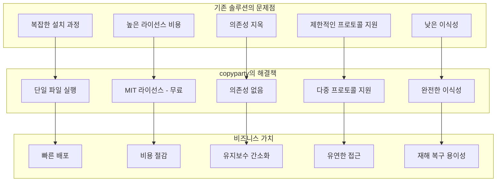

⏱️ **예상 읽기 시간**: 25분

## 서론

기업 파일 관리의 새로운 패러다임이 등장했습니다. **복잡한 설정 없이, 의존성 없이, 단일 파일로 실행되는 완전한 파일 서버**를 원한다면 [copyparty](https://github.com/9001/copyparty)가 답입니다.

**8.6k 스타**를 받은 이 오픈소스 프로젝트는 **MIT 라이선스**로 제공되며, 다음과 같은 강력한 기능들을 제공합니다:

- 🚀 **가속화된 재개 가능 업로드**
- 🔄 **파일 중복 제거 (dedup)**
- 🌐 **WebDAV, FTP, TFTP 지원**
- 📱 **Zeroconf (자동 검색)**
- 🎵 **미디어 인덱싱 및 썸네일**
- 📦 **단일 파일 실행, 의존성 없음**

이 글에서는 copyparty를 **기업 환경에서 안전하고 효율적으로 구축하고 운영하는 방법**을 완전히 다루겠습니다.

## copyparty 개요: 왜 기업이 선택해야 하는가?

### 기업용 파일 서버로서의 장점



### 핵심 기업용 기능

#### 1. 다중 프로토콜 지원
- **HTTP/HTTPS**: 웹 브라우저 접근
- **WebDAV**: Windows/macOS 네이티브 통합
- **FTP/FTPS**: 레거시 시스템 호환
- **TFTP**: 네트워크 부팅, 펌웨어 업데이트

#### 2. 고급 파일 관리
- **중복 제거**: 스토리지 비용 절감
- **재개 가능 업로드**: 대용량 파일 안정성
- **미디어 인덱싱**: 자동 메타데이터 추출
- **썸네일 생성**: 빠른 시각적 탐색

#### 3. 엔터프라이즈 보안
- **사용자 인증**: 다중 사용자 관리
- **접근 제어**: 세밀한 권한 설정
- **SSL/TLS**: 암호화된 전송
- **감사 로그**: 모든 활동 추적

## 기업 환경 설치 가이드

### 방법 1: Self-contained SFX (권장)

기업 환경에서 **가장 안전하고 간단한 방법**입니다.

```bash
# 1. copyparty-sfx.py 다운로드
wget https://github.com/9001/copyparty/releases/latest/download/copyparty-sfx.py

# 2. 실행 권한 부여
chmod +x copyparty-sfx.py

# 3. 기본 실행 (테스트)
python3 copyparty-sfx.py --help

# 4. 기업용 디렉토리 구조 생성
sudo mkdir -p /opt/copyparty/{data,config,logs}
sudo chown $(whoami):$(whoami) /opt/copyparty -R
```

### 방법 2: pip 설치 (시스템 통합)

```bash
# 1. 시스템 패키지 설치
sudo apt update
sudo apt install python3 python3-pip ffmpeg

# 2. copyparty 설치
pip3 install --user copyparty

# 3. PATH 설정 확인
echo 'export PATH="$HOME/.local/bin:$PATH"' >> ~/.bashrc
source ~/.bashrc

# 4. 설치 확인
copyparty --version
```

### 방법 3: Docker 컨테이너 (컨테이너 환경)

```bash
# 1. Docker 이미지 빌드
cat > Dockerfile << 'EOF'
FROM python:3.11-slim

# 필수 패키지 설치
RUN apt-get update && apt-get install -y \
    ffmpeg \
    libvips42 \
    && rm -rf /var/lib/apt/lists/*

# copyparty 설치
RUN pip install copyparty pillow pyvips

# 사용자 생성
RUN useradd -m -u 1000 copyparty

# 작업 디렉토리 설정
WORKDIR /data
RUN chown copyparty:copyparty /data

USER copyparty

EXPOSE 3923

CMD ["copyparty", "--config-file", "/config/copyparty.conf"]
EOF

# 2. 이미지 빌드
docker build -t copyparty-enterprise .

# 3. 설정 디렉토리 생성
mkdir -p ./copyparty-config ./copyparty-data

# 4. 컨테이너 실행
docker run -d \
  --name copyparty \
  -p 3923:3923 \
  -v ./copyparty-config:/config \
  -v ./copyparty-data:/data \
  copyparty-enterprise
```

## 기업용 설정 파일 구성

### 기본 설정 구조

```bash
# /opt/copyparty/config/copyparty.conf 생성
cat > /opt/copyparty/config/copyparty.conf << 'EOF'
# copyparty 기업용 설정 파일

[global]
# 기본 서버 설정
port = 3923
host = 0.0.0.0
name = "회사명 파일서버"
motd = "회사 파일 서버에 오신 것을 환영합니다"

# 보안 설정
salt-path = /opt/copyparty/config/.salt
accounts-path = /opt/copyparty/config/accounts.txt
log-path = /opt/copyparty/logs/access.log

# SSL 설정 (프로덕션에서 필수)
ssl-cert = /opt/copyparty/config/server.crt
ssl-key = /opt/copyparty/config/server.key

# 성능 최적화
threads = 4
j2-cache-size = 1000

# 중복 제거 활성화
hash-max-age = 3600
dedup = true

[/]
# 루트 디렉토리 - 인증된 사용자만 접근
path = /opt/copyparty/data
accs = {"r": ["@users"], "w": ["@admin"], "a": ["@admin"]}

[/public]
# 공개 디렉토리 - 읽기 전용
path = /opt/copyparty/data/public
accs = {"r": ["*"], "w": ["@admin"], "a": ["@admin"]}

[/upload]
# 업로드 디렉토리 - 모든 사용자 업로드 가능
path = /opt/copyparty/data/upload
accs = {"r": ["@users"], "w": ["@users"], "a": ["@admin"]}

[/departments]
# 부서별 디렉토리
path = /opt/copyparty/data/departments
accs = {"r": ["@users"], "w": ["@dept-leads"], "a": ["@admin"]}

[/archive]
# 아카이브 디렉토리 - 읽기 전용
path = /opt/copyparty/data/archive
accs = {"r": ["@users"], "w": ["@admin"], "a": ["@admin"]}
EOF
```

### 사용자 계정 관리

```bash
# /opt/copyparty/config/accounts.txt 생성
cat > /opt/copyparty/config/accounts.txt << 'EOF'
# copyparty 사용자 계정 파일
# 형식: username:password:groups

# 관리자 계정
admin:$6$rounds=100000$강력한해시$:admin,users
it-admin:$6$rounds=100000$강력한해시$:admin,users

# 부서 리더
sales-lead:$6$rounds=100000$강력한해시$:dept-leads,users
dev-lead:$6$rounds=100000$강력한해시$:dept-leads,users
hr-lead:$6$rounds=100000$강력한해시$:dept-leads,users

# 일반 사용자
john.doe:$6$rounds=100000$강력한해시$:users
jane.smith:$6$rounds=100000$강력한해시$:users
mike.johnson:$6$rounds=100000$강력한해시$:users
EOF

# 계정 파일 권한 설정 (보안 강화)
chmod 600 /opt/copyparty/config/accounts.txt
```

### 패스워드 해시 생성

```python
# password_hash.py - 패스워드 해시 생성 스크립트
#!/usr/bin/env python3
import hashlib
import secrets
import getpass

def generate_password_hash(password):
    """SHA-512 기반 패스워드 해시 생성"""
    salt = secrets.token_hex(16)
    rounds = 100000
    
    # SHA-512 해시 생성
    hash_obj = hashlib.pbkdf2_hmac('sha512', 
                                   password.encode('utf-8'), 
                                   salt.encode('utf-8'), 
                                   rounds)
    hash_hex = hash_obj.hex()
    
    return f"$6$rounds={rounds}${salt}${hash_hex}"

if __name__ == "__main__":
    username = input("사용자명: ")
    password = getpass.getpass("패스워드: ")
    groups = input("그룹 (쉼표로 구분): ")
    
    hash_password = generate_password_hash(password)
    
    print(f"\n계정 파일에 추가할 라인:")
    print(f"{username}:{hash_password}:{groups}")
```

```bash
# 패스워드 해시 생성 및 사용
python3 password_hash.py
```

## SSL/TLS 보안 설정

### 자체 서명 인증서 생성

```bash
# 1. 인증서 디렉토리 생성
mkdir -p /opt/copyparty/config/ssl

# 2. 개인키 생성
openssl genrsa -out /opt/copyparty/config/ssl/server.key 2048

# 3. 인증서 서명 요청 생성
cat > /opt/copyparty/config/ssl/server.conf << 'EOF'
[req]
distinguished_name = req_distinguished_name
req_extensions = v3_req
prompt = no

[req_distinguished_name]
C = KR
ST = Seoul
L = Seoul
O = Company Name
OU = IT Department
CN = fileserver.company.com

[v3_req]
basicConstraints = CA:FALSE
keyUsage = nonRepudiation, digitalSignature, keyEncipherment
subjectAltName = @alt_names

[alt_names]
DNS.1 = fileserver.company.com
DNS.2 = fileserver.local
IP.1 = 192.168.1.100
EOF

# 4. 자체 서명 인증서 생성
openssl req -new -x509 -key /opt/copyparty/config/ssl/server.key \
  -out /opt/copyparty/config/ssl/server.crt \
  -days 365 \
  -config /opt/copyparty/config/ssl/server.conf \
  -extensions v3_req

# 5. 권한 설정
chmod 600 /opt/copyparty/config/ssl/server.key
chmod 644 /opt/copyparty/config/ssl/server.crt
```

### Let's Encrypt 인증서 (프로덕션)

```bash
# 1. Certbot 설치
sudo apt install certbot

# 2. 도메인 인증서 발급
sudo certbot certonly --standalone -d fileserver.company.com

# 3. copyparty 설정에 인증서 경로 지정
# /opt/copyparty/config/copyparty.conf에 추가:
# ssl-cert = /etc/letsencrypt/live/fileserver.company.com/fullchain.pem
# ssl-key = /etc/letsencrypt/live/fileserver.company.com/privkey.pem

# 4. 인증서 자동 갱신
sudo crontab -e
# 다음 라인 추가:
# 0 3 * * * certbot renew --quiet && systemctl restart copyparty
```

## 고급 기업 기능 설정

### WebDAV 네트워크 드라이브 설정

#### Windows 클라이언트

```batch
@echo off
REM Windows WebDAV 네트워크 드라이브 연결 스크립트

echo copyparty 파일서버 연결 중...

REM WebDAV 서비스 시작
net start webclient

REM 네트워크 드라이브 연결
net use Z: https://fileserver.company.com:3923/ /persistent:yes

echo 연결 완료: Z 드라이브로 접근 가능합니다.
pause
```

#### macOS 클라이언트

```bash
#!/bin/bash
# macOS WebDAV 연결 스크립트

echo "copyparty 파일서버 마운트 중..."

# 마운트 포인트 생성
mkdir -p ~/copyparty-server

# WebDAV 마운트
mount_webdav -S -v "copyparty" https://fileserver.company.com:3923/ ~/copyparty-server

echo "마운트 완료: ~/copyparty-server에서 접근 가능합니다."
```

#### Linux 클라이언트

```bash
# 1. WebDAV 클라이언트 설치
sudo apt install davfs2

# 2. 마운트 포인트 생성
sudo mkdir /mnt/copyparty

# 3. fstab 설정
echo "https://fileserver.company.com:3923/ /mnt/copyparty davfs user,noauto 0 0" | sudo tee -a /etc/fstab

# 4. 인증 정보 설정
mkdir -p ~/.davfs2
echo "https://fileserver.company.com:3923/ username password" > ~/.davfs2/secrets
chmod 600 ~/.davfs2/secrets

# 5. 마운트
mount /mnt/copyparty
```

### FTP/FTPS 서버 활성화

```bash
# copyparty.conf에 FTP 설정 추가
cat >> /opt/copyparty/config/copyparty.conf << 'EOF'

# FTP 서버 설정
[ftp]
port = 21
pasv-port = 21000-21100
ssl-cert = /opt/copyparty/config/ssl/server.crt
ssl-key = /opt/copyparty/config/ssl/server.key

# FTPS 강제 (보안 강화)
ftps-only = true
EOF
```

### 미디어 인덱싱 및 썸네일

```bash
# 1. 추가 패키지 설치 (썸네일 및 메타데이터)
pip3 install pillow mutagen

# 2. FFmpeg 설치 (비디오 썸네일)
sudo apt install ffmpeg

# 3. copyparty.conf에 미디어 설정 추가
cat >> /opt/copyparty/config/copyparty.conf << 'EOF'

# 미디어 인덱싱 설정
[media]
# 썸네일 생성 활성화
thumbnails = true
thumb-size = 256
thumb-quality = 80

# 메타데이터 추출
metadata = true

# 비디오 썸네일
video-thumbs = true

# 오디오 스펙트로그램
audio-spectrograms = true
EOF
```

## 시스템 서비스 설정

### systemd 서비스 등록

```bash
# 1. 서비스 파일 생성
sudo tee /etc/systemd/system/copyparty.service << 'EOF'
[Unit]
Description=copyparty Enterprise File Server
After=network.target
Wants=network.target

[Service]
Type=simple
User=copyparty
Group=copyparty
WorkingDirectory=/opt/copyparty
ExecStart=/usr/local/bin/python3 /opt/copyparty/copyparty-sfx.py --config-file /opt/copyparty/config/copyparty.conf
Restart=always
RestartSec=10

# 보안 강화
NoNewPrivileges=true
ProtectSystem=strict
ProtectHome=true
ReadWritePaths=/opt/copyparty

# 로그 설정
StandardOutput=journal
StandardError=journal
SyslogIdentifier=copyparty

[Install]
WantedBy=multi-user.target
EOF

# 2. copyparty 사용자 생성
sudo useradd -r -s /bin/false -d /opt/copyparty copyparty
sudo chown -R copyparty:copyparty /opt/copyparty

# 3. 서비스 활성화
sudo systemctl daemon-reload
sudo systemctl enable copyparty
sudo systemctl start copyparty

# 4. 상태 확인
sudo systemctl status copyparty
```

### 로그 로테이션 설정

```bash
# /etc/logrotate.d/copyparty 생성
sudo tee /etc/logrotate.d/copyparty << 'EOF'
/opt/copyparty/logs/*.log {
    daily
    missingok
    rotate 52
    compress
    delaycompress
    notifempty
    create 644 copyparty copyparty
    postrotate
        systemctl reload copyparty
    endscript
}
EOF
```

## 백업 및 재해 복구 전략

### 자동 백업 스크립트

```bash
#!/bin/bash
# /opt/copyparty/scripts/backup.sh

set -e

# 설정
BACKUP_DIR="/backup/copyparty"
DATA_DIR="/opt/copyparty/data"
CONFIG_DIR="/opt/copyparty/config"
RETENTION_DAYS=30

# 백업 디렉토리 생성
mkdir -p "$BACKUP_DIR"

# 날짜별 백업 디렉토리
BACKUP_DATE=$(date +%Y%m%d_%H%M%S)
CURRENT_BACKUP="$BACKUP_DIR/$BACKUP_DATE"

echo "copyparty 백업 시작: $BACKUP_DATE"

# 1. 설정 파일 백업
echo "설정 파일 백업 중..."
mkdir -p "$CURRENT_BACKUP/config"
cp -r "$CONFIG_DIR"/* "$CURRENT_BACKUP/config/"

# 2. 데이터 디렉토리 백업 (rsync 사용)
echo "데이터 백업 중..."
rsync -av --progress "$DATA_DIR/" "$CURRENT_BACKUP/data/"

# 3. 서비스 상태 백업
echo "서비스 정보 백업 중..."
systemctl status copyparty > "$CURRENT_BACKUP/service_status.txt"
journalctl -u copyparty --since "24 hours ago" > "$CURRENT_BACKUP/recent_logs.txt"

# 4. 백업 압축
echo "백업 압축 중..."
cd "$BACKUP_DIR"
tar -czf "${BACKUP_DATE}.tar.gz" "$BACKUP_DATE"
rm -rf "$BACKUP_DATE"

# 5. 오래된 백업 삭제
echo "오래된 백업 정리 중..."
find "$BACKUP_DIR" -name "*.tar.gz" -mtime +$RETENTION_DAYS -delete

echo "백업 완료: ${BACKUP_DIR}/${BACKUP_DATE}.tar.gz"

# 6. 백업 검증
if [ -f "${BACKUP_DIR}/${BACKUP_DATE}.tar.gz" ]; then
    echo "백업 검증 성공"
    exit 0
else
    echo "백업 실패!"
    exit 1
fi
```

### 복구 스크립트

```bash
#!/bin/bash
# /opt/copyparty/scripts/restore.sh

set -e

BACKUP_FILE="$1"
RESTORE_DIR="/opt/copyparty-restore"

if [ -z "$BACKUP_FILE" ]; then
    echo "사용법: $0 <백업파일.tar.gz>"
    echo "예시: $0 /backup/copyparty/20250127_143000.tar.gz"
    exit 1
fi

echo "copyparty 복구 시작..."

# 1. 복구 디렉토리 생성
mkdir -p "$RESTORE_DIR"
cd "$RESTORE_DIR"

# 2. 백업 파일 추출
echo "백업 파일 추출 중..."
tar -xzf "$BACKUP_FILE"

BACKUP_NAME=$(basename "$BACKUP_FILE" .tar.gz)

# 3. 서비스 중지
echo "copyparty 서비스 중지 중..."
sudo systemctl stop copyparty

# 4. 기존 데이터 백업
echo "기존 데이터 백업 중..."
sudo mv /opt/copyparty /opt/copyparty-old-$(date +%Y%m%d_%H%M%S)

# 5. 복구된 데이터 적용
echo "데이터 복구 중..."
sudo mkdir -p /opt/copyparty
sudo cp -r "$RESTORE_DIR/$BACKUP_NAME"/* /opt/copyparty/
sudo chown -R copyparty:copyparty /opt/copyparty

# 6. 서비스 재시작
echo "서비스 재시작 중..."
sudo systemctl start copyparty

# 7. 상태 확인
sleep 5
if sudo systemctl is-active --quiet copyparty; then
    echo "복구 완료! copyparty가 정상 실행 중입니다."
else
    echo "복구 실패! 서비스가 시작되지 않았습니다."
    sudo systemctl status copyparty
    exit 1
fi

# 8. 정리
rm -rf "$RESTORE_DIR"
echo "복구 프로세스 완료"
```

### 크론잭 설정

```bash
# 자동 백업 스케줄 설정
sudo crontab -e

# 다음 라인들 추가:
# 매일 새벽 2시 백업
0 2 * * * /opt/copyparty/scripts/backup.sh >> /var/log/copyparty-backup.log 2>&1

# 매주 일요일 새벽 3시 전체 시스템 백업
0 3 * * 0 /opt/copyparty/scripts/full-backup.sh >> /var/log/copyparty-full-backup.log 2>&1
```

## 성능 최적화 및 모니터링

### 성능 모니터링 스크립트

```bash
#!/bin/bash
# /opt/copyparty/scripts/monitor.sh

# 시스템 리소스 모니터링
echo "=== copyparty 성능 모니터링 $(date) ==="

# 1. CPU 및 메모리 사용량
echo "## 시스템 리소스"
ps aux | grep copyparty | grep -v grep | awk '{print "CPU: " $3 "%, MEM: " $4 "%, CMD: " $11}'

# 2. 디스크 사용량
echo -e "\n## 디스크 사용량"
df -h /opt/copyparty/data

# 3. 네트워크 연결 상태
echo -e "\n## 네트워크 연결"
netstat -tulpn | grep :3923

# 4. 최근 에러 로그
echo -e "\n## 최근 에러 로그"
journalctl -u copyparty --since "1 hour ago" -p err --no-pager | tail -10

# 5. 액세스 로그 통계
echo -e "\n## 액세스 통계 (최근 1시간)"
if [ -f /opt/copyparty/logs/access.log ]; then
    tail -1000 /opt/copyparty/logs/access.log | awk -v cutoff=$(date -d '1 hour ago' '+%s') '
    {
        # 로그 시간 파싱 (형식에 따라 조정 필요)
        if ($(NF-1) > cutoff) {
            requests++
            if ($9 ~ /^2/) success++
            else if ($9 ~ /^4/) client_error++
            else if ($9 ~ /^5/) server_error++
        }
    }
    END {
        print "총 요청: " requests
        print "성공: " success
        print "클라이언트 오류: " client_error  
        print "서버 오류: " server_error
    }'
fi

echo -e "\n=== 모니터링 완료 ==="
```

### Prometheus 메트릭 수집

```python
#!/usr/bin/env python3
# /opt/copyparty/scripts/metrics_exporter.py

import time
import psutil
import os
import subprocess
from prometheus_client import start_http_server, Gauge, Counter

# Prometheus 메트릭 정의
copyparty_cpu_usage = Gauge('copyparty_cpu_usage_percent', 'copyparty CPU 사용률')
copyparty_memory_usage = Gauge('copyparty_memory_usage_mb', 'copyparty 메모리 사용량 (MB)')
copyparty_disk_usage = Gauge('copyparty_disk_usage_percent', 'copyparty 데이터 디렉토리 디스크 사용률')
copyparty_active_connections = Gauge('copyparty_active_connections', '활성 연결 수')
copyparty_uptime = Gauge('copyparty_uptime_seconds', 'copyparty 업타임 (초)')

def get_copyparty_process():
    """copyparty 프로세스 찾기"""
    for proc in psutil.process_iter(['pid', 'name', 'cmdline']):
        try:
            if 'copyparty' in ' '.join(proc.info['cmdline']):
                return psutil.Process(proc.info['pid'])
        except (psutil.NoSuchProcess, psutil.AccessDenied):
            continue
    return None

def get_active_connections():
    """활성 연결 수 확인"""
    try:
        result = subprocess.run(['netstat', '-an'], capture_output=True, text=True)
        lines = result.stdout.split('\n')
        connections = [line for line in lines if ':3923' in line and 'ESTABLISHED' in line]
        return len(connections)
    except:
        return 0

def collect_metrics():
    """메트릭 수집"""
    proc = get_copyparty_process()
    
    if proc:
        # CPU 및 메모리 사용량
        copyparty_cpu_usage.set(proc.cpu_percent())
        copyparty_memory_usage.set(proc.memory_info().rss / 1024 / 1024)
        
        # 업타임
        uptime = time.time() - proc.create_time()
        copyparty_uptime.set(uptime)
    
    # 디스크 사용량
    disk_usage = psutil.disk_usage('/opt/copyparty/data')
    copyparty_disk_usage.set((disk_usage.used / disk_usage.total) * 100)
    
    # 활성 연결 수
    copyparty_active_connections.set(get_active_connections())

if __name__ == '__main__':
    # Prometheus 메트릭 서버 시작 (포트 8000)
    start_http_server(8000)
    
    print("copyparty 메트릭 수집기 시작됨 (포트 8000)")
    
    while True:
        try:
            collect_metrics()
            time.sleep(30)  # 30초마다 수집
        except KeyboardInterrupt:
            break
        except Exception as e:
            print(f"메트릭 수집 오류: {e}")
            time.sleep(30)
```

## 실제 기업 사용 사례

### 사례 1: 소프트웨어 개발팀 파일 공유

```bash
# 개발팀 전용 설정
cat > /opt/copyparty/config/dev-team.conf << 'EOF'
[global]
name = "개발팀 파일서버"
port = 3923

[/builds]
path = /opt/copyparty/data/builds
accs = {"r": ["@developers"], "w": ["@build-servers"], "a": ["@devops"]}
desc = "빌드 아티팩트 저장소"

[/docs]
path = /opt/copyparty/data/documentation
accs = {"r": ["@developers", "@qa"], "w": ["@tech-writers"], "a": ["@devops"]}
desc = "기술 문서"

[/releases]
path = /opt/copyparty/data/releases
accs = {"r": ["@all"], "w": ["@release-managers"], "a": ["@devops"]}
desc = "제품 릴리즈"

[/temp]
path = /opt/copyparty/data/temp
accs = {"r": ["@developers"], "w": ["@developers"], "a": ["@devops"]}
desc = "임시 파일 공유"
# 7일 후 자동 삭제
cleanup-after = 604800
EOF
```

### 사례 2: 미디어 에이전시 자산 관리

```bash
# 미디어 파일 관리 설정
cat > /opt/copyparty/config/media-agency.conf << 'EOF'
[global]
name = "크리에이티브 에이전시 자산 관리"
port = 3923

# 대용량 파일 지원
max-upload-size = 5368709120  # 5GB

[/raw-footage]
path = /opt/copyparty/data/raw-footage
accs = {"r": ["@editors"], "w": ["@videographers"], "a": ["@producers"]}
desc = "원본 영상 소스"

[/project-files]
path = /opt/copyparty/data/projects
accs = {"r": ["@team"], "w": ["@editors", "@designers"], "a": ["@producers"]}
desc = "프로젝트 파일"

[/approved-assets]
path = /opt/copyparty/data/approved
accs = {"r": ["@clients", "@team"], "w": ["@producers"], "a": ["@producers"]}
desc = "승인된 최종 자산"

[/client-review]
path = /opt/copyparty/data/client-review
accs = {"r": ["@clients"], "w": ["@producers"], "a": ["@producers"]}
desc = "클라이언트 검토용"
# 클라이언트 업로드 금지, 다운로드만 허용
upload = false
EOF
```

### 사례 3: 법무팀 문서 보관소

```bash
# 법무팀 보안 강화 설정
cat > /opt/copyparty/config/legal-docs.conf << 'EOF'
[global]
name = "법무팀 문서 보관소"
port = 3924  # 별도 포트
ssl-only = true  # HTTPS 강제

# 강화된 로깅
log-path = /opt/copyparty/logs/legal-access.log
log-format = detailed

[/contracts]
path = /opt/copyparty/data/legal/contracts
accs = {"r": ["@legal-team"], "w": ["@senior-legal"], "a": ["@legal-admin"]}
desc = "계약서 보관소"
# 삭제 금지
delete = false

[/compliance]
path = /opt/copyparty/data/legal/compliance
accs = {"r": ["@compliance-team"], "w": ["@compliance-officers"], "a": ["@legal-admin"]}
desc = "컴플라이언스 문서"

[/litigation]
path = /opt/copyparty/data/legal/litigation
accs = {"r": ["@litigation-team"], "w": ["@litigation-team"], "a": ["@legal-admin"]}
desc = "소송 관련 자료"
# 암호화 권장 폴더
encrypt = recommended
EOF
```

## 고급 보안 설정

### 방화벽 설정

```bash
# UFW 방화벽 설정
sudo ufw allow 22/tcp      # SSH
sudo ufw allow 3923/tcp    # copyparty HTTPS
sudo ufw allow 21/tcp      # FTP 제어 포트
sudo ufw allow 21000:21100/tcp  # FTP 패시브 포트

# 특정 IP에서만 접근 허용 (선택사항)
sudo ufw allow from 192.168.1.0/24 to any port 3923

sudo ufw enable
```

### Fail2ban 설정

```bash
# 1. Fail2ban 설치
sudo apt install fail2ban

# 2. copyparty용 필터 생성
sudo tee /etc/fail2ban/filter.d/copyparty.conf << 'EOF'
[Definition]
failregex = ^.* \[.*\] ".*" 401 .* from <HOST>.*$
            ^.* \[.*\] ".*" 403 .* from <HOST>.*$
ignoreregex =
EOF

# 3. Jail 설정
sudo tee /etc/fail2ban/jail.d/copyparty.conf << 'EOF'
[copyparty]
enabled = true
port = 3923
filter = copyparty
logpath = /opt/copyparty/logs/access.log
maxretry = 5
bantime = 3600
findtime = 600
EOF

# 4. 서비스 재시작
sudo systemctl restart fail2ban
```

### 네트워크 세분화

```bash
# iptables를 이용한 접근 제어
sudo iptables -A INPUT -p tcp --dport 3923 -s 192.168.1.0/24 -j ACCEPT
sudo iptables -A INPUT -p tcp --dport 3923 -s 10.0.0.0/8 -j ACCEPT
sudo iptables -A INPUT -p tcp --dport 3923 -j DROP

# 설정 저장
sudo iptables-save > /etc/iptables/rules.v4
```

## 트러블슈팅 가이드

### 일반적인 문제들

#### 1. 서비스 시작 실패

```bash
# 문제 진단
sudo systemctl status copyparty
sudo journalctl -u copyparty -f

# 일반적인 해결책
# - 설정 파일 문법 확인
python3 /opt/copyparty/copyparty-sfx.py --config-file /opt/copyparty/config/copyparty.conf --test-config

# - 포트 충돌 확인
sudo netstat -tulpn | grep :3923

# - 권한 문제 해결
sudo chown -R copyparty:copyparty /opt/copyparty
```

#### 2. WebDAV 연결 문제

```bash
# Windows에서 WebDAV 문제
# 1. WebClient 서비스 확인
net start webclient

# 2. 레지스트리 수정 (관리자 권한)
reg add HKEY_LOCAL_MACHINE\SYSTEM\CurrentControlSet\Services\WebClient\Parameters /v BasicAuthLevel /t REG_DWORD /d 2 /f

# 3. 서비스 재시작
net stop webclient
net start webclient
```

#### 3. 업로드 실패

```bash
# 디스크 용량 확인
df -h /opt/copyparty/data

# 파일 권한 확인
ls -la /opt/copyparty/data

# 업로드 크기 제한 확인
grep "max-upload-size" /opt/copyparty/config/copyparty.conf

# 로그 확인
tail -f /opt/copyparty/logs/access.log
```

### 성능 문제 해결

#### 1. 느린 업로드/다운로드

```bash
# 네트워크 최적화
echo 'net.core.rmem_max = 16777216' >> /etc/sysctl.conf
echo 'net.core.wmem_max = 16777216' >> /etc/sysctl.conf
echo 'net.ipv4.tcp_rmem = 4096 16384 16777216' >> /etc/sysctl.conf
echo 'net.ipv4.tcp_wmem = 4096 16384 16777216' >> /etc/sysctl.conf
sudo sysctl -p

# copyparty 스레드 수 증가
# copyparty.conf에 추가:
# threads = 8
```

#### 2. 메모리 사용량 최적화

```bash
# 환경 변수로 메모리 제한
export PRTY_NO_PIL=1     # Pillow 비활성화
export PRTY_NO_VIPS=1    # libvips 비활성화

# 설정에서 캐시 크기 조정
# j2-cache-size = 500     # 기본값 1000에서 감소
```

### 모니터링 및 알림

```bash
#!/bin/bash
# /opt/copyparty/scripts/health-check.sh

# 서비스 상태 확인
if ! systemctl is-active --quiet copyparty; then
    echo "CRITICAL: copyparty 서비스가 중지됨" | mail -s "copyparty 알림" admin@company.com
    exit 1
fi

# 디스크 사용량 확인 (80% 이상시 경고)
DISK_USAGE=$(df /opt/copyparty/data | tail -1 | awk '{print $5}' | sed 's/%//')
if [ $DISK_USAGE -gt 80 ]; then
    echo "WARNING: 디스크 사용량 ${DISK_USAGE}%" | mail -s "copyparty 디스크 경고" admin@company.com
fi

# 메모리 사용량 확인
MEMORY_USAGE=$(ps aux | grep copyparty | grep -v grep | awk '{sum+=$6} END {print sum/1024}')
if [ $(echo "$MEMORY_USAGE > 1000" | bc) -eq 1 ]; then
    echo "WARNING: 메모리 사용량 ${MEMORY_USAGE}MB" | mail -s "copyparty 메모리 경고" admin@company.com
fi

echo "Health check passed at $(date)"
```

## 결론

copyparty는 **기업 환경에서 완벽하게 활용할 수 있는 강력한 파일 서버 솔루션**입니다. 단일 파일로 실행되는 간편함과 엔터프라이즈급 기능을 모두 제공하는 독특한 도구입니다.

### 핵심 장점 요약

1. **즉시 배포 가능**: 복잡한 설치 과정 없이 바로 실행
2. **다중 프로토콜 지원**: HTTP/WebDAV/FTP를 하나의 서버로
3. **비용 효율성**: MIT 라이선스로 무료 사용
4. **확장성**: 작은 팀부터 대기업까지 확장 가능
5. **보안**: 엔터프라이즈급 인증 및 암호화 지원

### 도입 권장 시나리오

- **중소기업**: 비용 효율적인 파일 공유 솔루션
- **개발팀**: 빌드 아티팩트 및 문서 관리
- **미디어 회사**: 대용량 파일 및 자산 관리
- **원격 근무**: 안전한 파일 접근 환경 구축
- **임시 프로젝트**: 빠른 배포가 필요한 단기 프로젝트

copyparty로 **더 간단하고, 더 안전하고, 더 효율적인** 기업 파일 관리 환경을 구축해보세요! 🚀

## 참고 자료

- **copyparty GitHub**: [https://github.com/9001/copyparty](https://github.com/9001/copyparty)
- **공식 문서**: README.md 및 docs 디렉토리
- **릴리즈 노트**: [GitHub Releases](https://github.com/9001/copyparty/releases)
- **커뮤니티 지원**: GitHub Issues 및 Discussions

---

💡 **실제 기업 도입 경험을 공유하세요!** copyparty를 기업 환경에서 사용해보신 경험이나 추가 질문이 있으시면 댓글로 남겨주세요. 