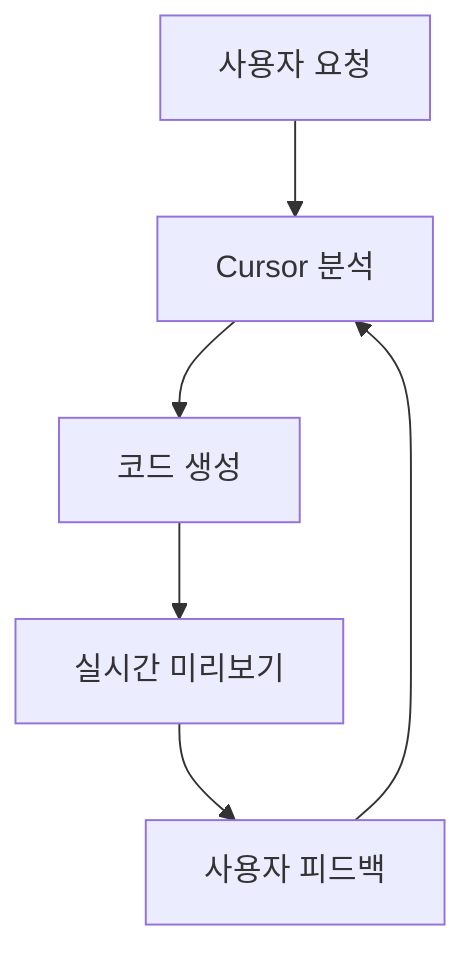

드디어 Cursor 1.0이 공개되었습니다! 이번 릴리스는 AI 기반 코딩 경험을 완전히 새로운 차원으로 끌어올리는 혁신적인 기능들로 가득합니다. BugBot을 통한 자동 코드 리뷰부터 모든 사용자에게 제공되는 Background Agent, 그리고 Jupyter Notebook 지원까지, 개발자들이 그동안 기다려온 모든 것들이 한꺼번에 출시되었습니다.

## BugBot으로 똑똑한 코드 리뷰

### 자동 PR 리뷰 시스템

BugBot은 여러분의 풀 리퀘스트를 자동으로 분석하여 잠재적인 버그나 문제점을 찾아내는 혁신적인 기능입니다.

**주요 특징:**
- GitHub PR에 자동으로 코멘트 작성
- 발견된 이슈에 대한 상세한 설명 제공
- "Fix in Cursor" 버튼으로 원클릭 수정 기능

### 설정 방법

BugBot을 사용하려면 [공식 문서](https://docs.cursor.com/bugbot)의 지침을 따라 설정하면 됩니다. 설정이 완료되면 자동으로 모든 PR을 모니터링하기 시작합니다.

## Background Agent, 이제 모든 사용자에게

### 원격 코딩 에이전트의 대중화

이전에 얼리 액세스로만 제공되던 Background Agent가 드디어 모든 사용자에게 공개되었습니다.

**사용 방법:**
- 채팅창의 클라우드 아이콘 클릭
- `Cmd/Ctrl+E` 단축키 사용
- 프라이버시 모드 비활성화 필요

**Background Agent의 장점:**
- 병렬 작업 처리로 효율성 극대화
- 대규모 태스크 분할 처리
- 원격 환경에서 안전한 코드 실행

## Jupyter Notebook 지원으로 데이터 과학 혁신

### AI 에이전트와 노트북의 만남

Cursor 에이전트가 이제 Jupyter Notebook에서도 완벽하게 작동합니다.

**지원 기능:**
- 여러 셀 동시 생성 및 수정
- 데이터 과학 작업 흐름 최적화
- 연구 및 분석 작업 자동화

**현재 제한사항:**
- Sonnet 모델에서만 지원 (추후 확장 예정)

### 사용 예시

```python
# Cursor가 자동으로 생성하는 데이터 분석 셀
import pandas as pd
import matplotlib.pyplot as plt

# 데이터 로드
df = pd.read_csv('data.csv')

# 시각화
plt.figure(figsize=(10, 6))
plt.plot(df['date'], df['value'])
plt.title('Data Trend Analysis')
plt.show()
```

## Memories 기능으로 프로젝트별 지식 관리

### 대화 기록 기반 지능형 메모리

새로운 Memories 기능은 프로젝트별로 중요한 대화 내용을 기억하고 활용할 수 있게 해줍니다.

**특징:**
- 프로젝트별 개별 메모리 저장
- 미래 대화에서 자동 참조
- 개별 메모리 관리 가능

### 활성화 방법

```
Settings → Rules → Memories 베타 기능 활성화
```

## MCP 원클릭 설치와 OAuth 지원

### 간편해진 MCP 서버 설정

MCP(Model Context Protocol) 서버 설치가 이제 단 한 번의 클릭으로 가능해졌습니다.

**새로운 기능:**
- 원클릭 MCP 서버 설치
- OAuth 인증 지원으로 보안 강화
- 공식 MCP 서버 목록 제공

### 개발자를 위한 배포 도구

MCP 개발자라면 다음과 같이 "Add to Cursor" 버튼을 문서에 추가할 수 있습니다:

```markdown
[Add to Cursor](https://docs.cursor.com/deeplinks)
```

자세한 정보는 [docs.cursor.com/tools](https://docs.cursor.com/tools)에서 확인하세요.

## 풍부한 채팅 응답과 시각화

### 대화 중 실시간 시각화

이제 Cursor와의 대화에서 바로 시각적 요소를 생성하고 확인할 수 있습니다.

**지원 형식:**
- Mermaid 다이어그램
- 마크다운 테이블
- 실시간 렌더링

### 예시: Mermaid 다이어그램



## 새로워진 설정과 대시보드

### 개선된 사용자 인터페이스

설정과 대시보드가 완전히 새롭게 디자인되었습니다.

**새로운 기능:**
- 개인/팀 사용량 분석
- 디스플레이 이름 변경
- 도구별/모델별 상세 통계
- 깔끔한 인터페이스

### 사용량 모니터링

```
Dashboard → Usage Analytics → 모델별 통계 확인
```

## 추가 개선사항들

### 파일 처리 능력 확장

**@Link와 웹 검색 개선:**
- PDF 파일 파싱 지원
- 네트워크 진단 기능 추가
- 병렬 도구 호출로 속도 향상

### 채팅 인터페이스 개선

**새로운 기능:**
- 도구 호출 결과 접기/펼치기
- 더 깔끔한 대화 정리
- 향상된 응답 속도

## 팀과 엔터프라이즈를 위한 기능

### 강화된 관리 도구

**엔터프라이즈 기능:**
- 안정화된 버전 접근 제한
- 팀 관리자의 프라이버시 모드 제어
- Admin API를 통한 사용량 관리

### 팀 관리 예시

```bash
# Admin API를 통한 팀 사용량 조회
curl -H "Authorization: Bearer YOUR_TOKEN" \
     https://api.cursor.com/v1/teams/usage
```

## 시작하기

### Cursor 1.0 업데이트

기존 Cursor 사용자라면:

1. **자동 업데이트 확인**
2. **새 기능 활성화**: Settings → Beta에서 원하는 기능 활성화
3. **BugBot 설정**: GitHub 연동 및 권한 설정

### 새로운 사용자

1. **Cursor 다운로드**: [cursor.sh](https://cursor.sh)
2. **계정 생성 및 로그인**
3. **프라이버시 설정**: Background Agent 사용을 위해 필요시 조정

## 버전별 주요 변화 타임라인

### 최근 업데이트 히스토리

**0.50 (May 15, 2025):**
- 통합 요청 기반 가격 정책
- 모든 최고급 모델에 Max Mode 지원
- 새로운 Tab 모델 도입

**0.49 (April 15, 2025):**
- 자동 규칙 생성 기능
- 향상된 에이전트 터미널 제어
- MCP 이미지 지원

**0.48 (March 23, 2025):**
- 채팅 탭 기능
- 커스텀 모드 (베타)
- 더 빠른 인덱싱

## 마무리

Cursor 1.0은 단순한 업데이트를 넘어서 AI 기반 개발 도구의 새로운 표준을 제시합니다. BugBot의 자동 코드 리뷰부터 Background Agent의 병렬 처리, Jupyter Notebook 지원까지, 모든 기능이 개발자의 생산성을 극대화하는 데 초점을 맞추고 있습니다.

특히 Memories 기능과 MCP 원클릭 설치는 AI와 개발자 간의 협업을 한 단계 더 발전시킨 혁신적인 기능들입니다. 데이터 과학자들에게는 Jupyter Notebook 지원이, 팀 단위로 작업하는 개발자들에게는 강화된 관리 도구들이 큰 도움이 될 것입니다.

지금 바로 Cursor 1.0을 경험해보고, AI가 만들어가는 코딩의 미래를 직접 느껴보시기 바랍니다! 