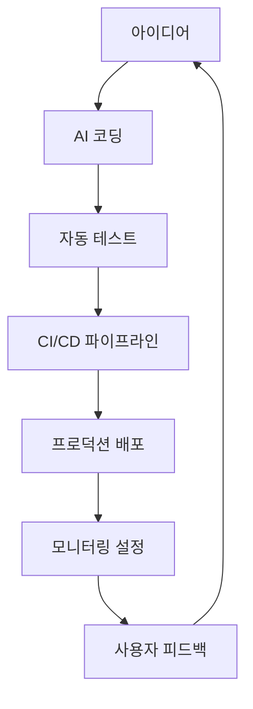

개발의 새로운 패러다임이 등장했습니다. AI Tinkerers London에서 ACI.dev 팀이 선보인 **"VibeOps"**는 단일 MCP 서버만으로 Cursor를 Lovable처럼 강력한 도구로 변신시키는 혁신적인 접근법입니다. 이제 비기술적이거나 반기술적인 빌더들도 아이디어에서 배포까지 전체 개발 루프를 devOps 지식 없이 완성할 수 있게 되었습니다.

## VibeOps란 무엇인가?

**VibeOps**(Vibe Operations)는 "Vibe Experience Engineering" 무브먼트의 일환으로, 기술적 복잡성을 제거하고 창의적 아이디어에만 집중할 수 있게 하는 새로운 개발 철학입니다.

### 핵심 개념

**"아이디어 → 코드 → 배포 → 배포"**의 전체 과정을 AI가 자동으로 처리하며, 개발자는 오직 창의적인 비전에만 집중할 수 있습니다.

## Cursor가 완전 자율로 수행한 놀라운 작업들

ACI.dev의 데모에서 Cursor는 단일 프롬프트만으로 다음 작업을 모두 자동으로 완성했습니다:

### 🚀 **완전 자동 개발 파이프라인**

1. **Next.js 랜딩 페이지 구축** - 스키 명소 소개 사이트 개발
2. **GitHub 리포지토리 생성** - 자동 코드 푸시 및 버전 관리
3. **Vercel 배포** - 원클릭 프로덕션 배포
4. **Cloudflare DNS 설정** - 커스텀 도메인 자동 구성
5. **Gmail 알림** - 최종 URL을 이메일로 자동 전송

### 🛠️ **핵심 기술: 단 두 개의 범용 함수**

이 모든 마법은 단지 두 개의 MCP 함수로 이루어집니다:

```javascript
// 필요한 도구를 동적으로 검색
search_functions()

// 검색된 도구를 실행
execute_function()
```

## 기존 방식의 한계와 ACI.dev의 해결책

### 🚫 **기존 방식의 문제점**

대부분의 agentic IDE들은 다음과 같은 한계에 부딪힙니다:
- 40개 이상의 도구 사용 시 성능 저하
- 3개 이상의 MCP 서버 연결 시 복잡성 증가
- 실제 업무 자동화에서의 제약

### ✅ **ACI.dev의 혁신적 해결책**

```
전통적 방식: 40+ 도구 사전 로딩 → 성능 저하
ACI.dev 방식: Just-in-time 도구 발견 → 최적화된 성능
```

**통합 MCP 서버**를 통해 필요한 도구만 동적으로 로딩하여 실제 업무 자동화를 가능하게 합니다.

## 실제 구현하기: 단계별 가이드

### 1단계: ACI.dev 계정 생성

[platform.aci.dev](https://platform.aci.dev)에서 계정을 생성합니다.

### 2단계: 필수 앱 연동 설정

App Store에서 다음 통합을 구성합니다:

**필수 연동 서비스:**
- **GitHub** - 코드 저장소 관리
- **Vercel** - 배포 플랫폼
- **Cloudflare** - DNS 및 도메인 관리
- **Gmail** - 알림 시스템

```bash
# 모든 서비스에 동일한 Linked Account Owner ID 사용
# OAuth 또는 API 키로 계정 연결
# 사용할 에이전트에 대해 앱 활성화
```

### 3단계: 도메인 구매 (선택사항)

Cloudflare에서 원하는 도메인을 구매하거나 기존 도메인을 연결합니다.

### 4단계: Cursor에 통합 MCP 설정

#### MCP 서버 구성

1. **[Unified MCP 문서](https://docs.aci.dev)**에서 설정을 복사
2. **Cursor 설정**으로 이동: `Settings → MCP → Add new global MCP server`
3. 다음 설정을 적용:

```json
{
  "mcpServers": {
    "aci-mcp-unified": {
      "command": "npx",
      "args": [
        "@aipotheosis-labs/aci-mcp-unified@latest",
        "-linked-account-owner-id",
        "your-linked-account-owner-id",
        "-allowed-apps-only"
      ],
      "env": {
        "ACI_API_KEY": "your-api-key"
      }
    }
  }
}
```

#### 필수 교체사항

- `your-linked-account-owner-id`: 실제 계정 ID로 교체
- `your-api-key`: Manage Projects에서 발급받은 API 키로 교체
- `-allowed-apps-only` 플래그 반드시 포함

### 5단계: 자동 실행 활성화 (선택사항)

Cursor 설정에서 **"Autorun tool calls"**를 활성화하여 각 단계별 수동 확인을 생략할 수 있습니다.

### 6단계: 마법의 프롬프트 실행

새로운 Cursor 채팅에서 다음 프롬프트를 사용합니다:

```
미국 최고의 스키 명소를 소개하는 간단한 랜딩 페이지 웹앱을 개발해주세요. 제 취미와 관련된 내용이고, 인터랙티브 요소도 포함해주세요. 웹사이트는 작게 만들고 간단한 콘텐츠로 채워주세요. Next.js를 사용하고, ESLint는 사용하지 마세요. Turbopack을 사용하고, npm build를 실행해서 오류를 수정해주세요.

그 다음에는:
1. GitHub 리포지토리를 생성하고 코드를 푸시하세요
2. Vercel에 배포하세요
3. 커스텀 도메인을 설정하세요 (도메인이 있다면)
4. 최종 URL을 Gmail로 전송해주세요
```

## VibeOps의 혁신적 가치

### 🎯 **접근성 혁명**

```
기존: 개발자 → 코드 → DevOps → 배포
VibeOps: 아이디어 → AI → 완성된 서비스
```

### 🚀 **생산성 극대화**

- **시간 단축**: 몇 시간 → 몇 분
- **학습 곡선 제거**: DevOps 지식 불필요
- **창의성 집중**: 기술적 제약에서 해방

### 🌍 **IDE 무관성**

VibeOps 접근법은 IDE에 국한되지 않습니다:
- **Cursor** (현재 지원)
- **VS Code** (확장 가능)
- **기타 agentic 도구들** (향후 지원)

## 확장 가능성과 미래 비전

### 🔮 **향후 통합 계획**

ACI.dev 팀은 다음 서비스들로 확장을 계획하고 있습니다:

- **Supabase** - 백엔드 및 데이터베이스
- **AWS** - 클라우드 인프라
- **Logfire** - 로깅 및 모니터링

### 🏗️ **복잡한 워크플로우 지원**



## 실제 사용 사례

### 📱 **스타트업 MVP 개발**

```
Day 1: 아이디어 구상
Day 1 (30분 후): 완전히 배포된 MVP
Day 2: 사용자 피드백 수집
Day 3: AI로 개선사항 적용
```

### 🎨 **크리에이터 이코노미**

비전만 있는 크리에이터들이 기술적 장벽 없이 디지털 제품을 만들 수 있습니다:

- **콘텐츠 크리에이터** → 개인 브랜드 웹사이트
- **아티스트** → 포트폴리오 플랫폼  
- **교육자** → 온라인 코스 플랫폼

## 커뮤니티와 오픈소스

### 🌟 **놀라운 성장**

ACI.dev는 출시 첫 달만에 **3,600개 이상의 GitHub 스타**를 획득하며 개발자 커뮤니티의 뜨거운 관심을 받고 있습니다.

**GitHub 저장소**: [https://github.com/aipotheosis-labs/aci](https://github.com/aipotheosis-labs/aci)

### 🤝 **커뮤니티 참여**

- **오픈소스 기여**: 완전히 오픈소스로 개발
- **피드백 환영**: 사용자 경험 개선에 집중
- **확장 가능**: 커뮤니티 주도 통합 개발

## 시작해보기

### 💡 **지금 바로 시작하는 방법**

1. **[ACI.dev 플랫폼](https://platform.aci.dev) 가입**
2. **필수 서비스 연동** (GitHub, Vercel, Cloudflare, Gmail)
3. **Cursor에 MCP 설정**
4. **첫 번째 VibeOps 프로젝트 시작**

### 🎯 **추천 첫 프로젝트**

- **개인 포트폴리오 사이트**
- **취미 관련 랜딩 페이지**
- **간단한 SaaS 아이디어 MVP**

## 마무리

VibeOps는 단순한 도구가 아닌 **개발 패러다임의 혁신**입니다. ACI.dev의 통합 MCP 서버를 통해 누구나 아이디어를 실제 서비스로 변환할 수 있는 시대가 열렸습니다.

기술적 복잡성에 가려져 있던 창의적 가능성을 해방시키는 VibeOps. 이제 여러분의 아이디어를 현실로 만들어보세요.

### 다음 단계

1. **[ACI.dev 블로그](https://www.aci.dev/blog/vibeopsturn-cursor-into-lovable-close-the-dev-loop-with-a-single-mcp) 원문 확인**
2. **실제 데모 따라하기**
3. **커뮤니티에 결과 공유**
4. **다음 프로젝트 기획**

VibeOps의 세계에 오신 것을 환영합니다. 이제 코딩이 아닌 상상이 여러분의 한계입니다! 🚀 