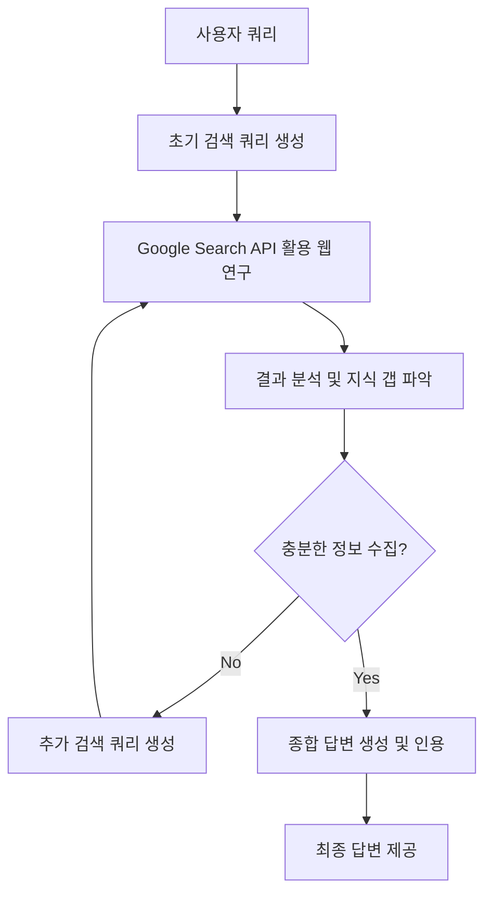
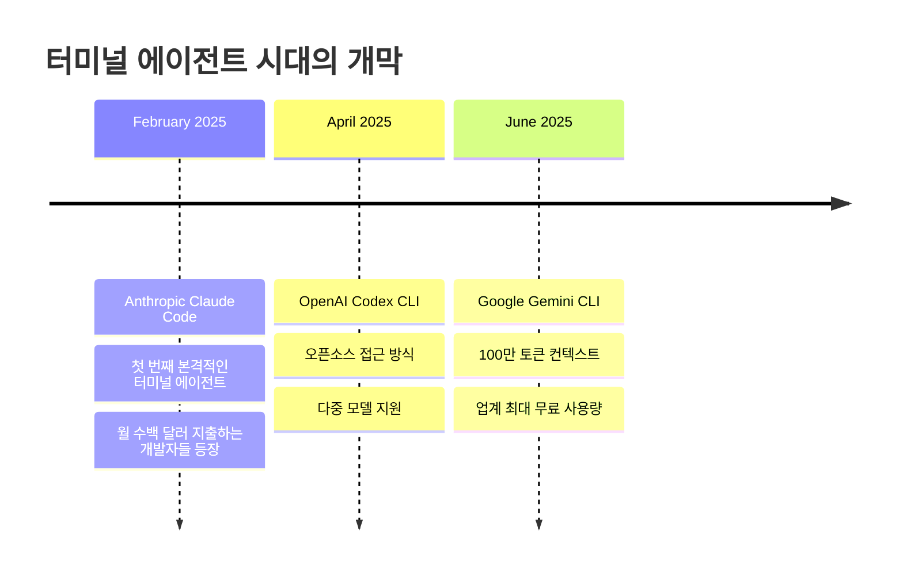

## 개요

2025년 6월 25일, Google이 공개한 [Gemini CLI](https://github.com/google-gemini/gemini-cli)는 터미널 환경에서 작동하는 혁신적인 오픈소스 AI 에이전트입니다. 이는 **"터미널 에이전트"** 카테고리의 최신작으로, 2월의 Claude Code, 4월의 OpenAI Codex CLI에 이어 세 번째 주요 AI 랩의 진입을 의미합니다.

### 터미널 에이전트 시대의 개막

**2025년 터미널 에이전트 발전사:**
- **2월**: Anthropic Claude Code 출시
- **4월**: OpenAI Codex CLI 공개  
- **6월**: Google Gemini CLI 발표

이 카테고리는 당초 예상보다 훨씬 중요하고 큰 시장을 형성하고 있습니다. 실제로 Claude Code에 월 수백 달러를 지출하는 개발자들이 상당수 존재하며, 이는 터미널 기반 AI 에이전트에 대한 실질적 수요가 매우 크다는 것을 보여줍니다.

Gemini CLI는 이러한 흐름 속에서 **Gemini 2.5 Pro의 100만 토큰 컨텍스트**를 활용하여 언제 파일을 읽고 언제 명령을 실행할지에 대한 뛰어난 판단력을 보여주며, **오픈소스(Apache 2.0)** 라이선스로 공개되어 개발자 커뮤니티의 기여를 적극 장려하고 있습니다.

## 핵심 아키텍처 분석

### 기술 스택과 구조

Gemini CLI는 다음과 같은 기술적 기반 위에 구축되었습니다.

**백엔드 구조:**
- **Gemini 2.5 Pro**: 100만 토큰 컨텍스트 윈도우를 제공하는 최신 LLM
- **LangGraph**: 다단계 AI 에이전트 워크플로우 구성
- **FastAPI**: 고성능 백엔드 API 서버
- **MCP (Model Context Protocol)**: 외부 도구 연동을 위한 표준화된 프로토콜

**프론트엔드와 CLI:**
- **React + Vite**: 웹 기반 UI (fullstack 모드)
- **Node.js**: CLI 인터페이스 (npm 패키지로 배포)
- **TypeScript**: 타입 안전성과 개발 생산성

### 핵심 시스템 프롬프트 분석

Gemini CLI의 핵심 동작 원리는 `getCoreSystemPrompt` 함수에서 확인할 수 있습니다. 이 함수는 AI 에이전트의 행동 방식을 정의하는 상세한 시스템 프롬프트를 생성합니다.

**시스템 프롬프트 구조:**

```typescript
export function getCoreSystemPrompt(userMemory?: string): string {
  // 1. 커스텀 시스템 프롬프트 오버라이드 지원
  let systemMdEnabled = false;
  let systemMdPath = path.join(GEMINI_CONFIG_DIR, 'system.md');
  const systemMdVar = process.env.GEMINI_SYSTEM_MD?.toLowerCase();
  
  if (systemMdVar && !['0', 'false'].includes(systemMdVar)) {
    systemMdEnabled = true;
    if (!['1', 'true'].includes(systemMdVar)) {
      systemMdPath = systemMdVar; // 커스텀 경로 사용
    }
  }
```

**핵심 구성 요소:**

1. **Core Mandates (핵심 지침)**
   - 프로젝트 컨벤션 준수
   - 라이브러리/프레임워크 검증
   - 코드 스타일 및 구조 모방
   - 관용적(idiomatic) 변경사항 적용

2. **Built-in Tools (내장 도구)**
   ```typescript
   import { LSTool } from '../tools/ls.js';
   import { EditTool } from '../tools/edit.js';
   import { GlobTool } from '../tools/glob.js';
   import { GrepTool } from '../tools/grep.js';
   import { ReadFileTool } from '../tools/read-file.js';
   import { ReadManyFilesTool } from '../tools/read-many-files.js';
   import { ShellTool } from '../tools/shell.js';
   import { WriteFileTool } from '../tools/write-file.js';
   import { MemoryTool } from '../tools/memoryTool.js';
   ```

3. **환경별 적응형 지침**
   ```typescript
   // 샌드박스 환경 감지
   const isSandboxExec = process.env.SANDBOX === 'sandbox-exec';
   const isGenericSandbox = !!process.env.SANDBOX;
   
   // Git 리포지토리 감지
   if (isGitRepository(process.cwd())) {
     // Git 관련 특별 지침 추가
   }
   ```

**AI 에이전트 워크플로우:**

```typescript
// 소프트웨어 엔지니어링 작업 플로우
// 1. Understand: 요청 이해 및 코드베이스 컨텍스트 파악
// 2. Plan: 일관성 있는 계획 수립
// 3. Implement: 도구를 활용한 구현
// 4. Verify (Tests): 테스트를 통한 검증
// 5. Verify (Standards): 코드 품질 및 표준 준수 확인
```

**보안 및 안전성 규칙:**
- 중요한 명령어 실행 전 설명 제공
- 절대 경로 사용 강제
- 사용자 확인 대화상자 지원
- 백그라운드 프로세스 관리

### 도구별 상세 분석

Gemini CLI는 **11개의 핵심 도구**를 통해 파일 시스템, 웹, 시스템과 상호작용합니다:

**1. 파일 탐색 도구:**
```typescript
ls: 디렉토리 내용 나열
glob: 패턴 기반 파일 검색 (예: "**/*.js")  
grep: 파일 내 텍스트 검색
```

**2. 파일 조작 도구:**
```typescript
read-file: 단일 파일 읽기
read-many-files: 다중 파일 일괄 읽기
edit: 기존 파일 프로그래밍 방식으로 수정
write-file: 새 파일 생성 또는 전체 덮어쓰기
```

**3. 웹 상호작용 도구:**
```typescript
web-fetch: URL에서 콘텐츠 가져오기
web-search: 웹 검색 수행 (Gemini API의 Google Search Grounding 활용)
```

**4. 시스템 상호작용:**
```typescript
shell: 터미널 명령어 실행
memoryTool: 사용자별 지속적 메모리 관리
```

**시스템 프롬프트를 통한 자기 문서화:**

흥미롭게도 Gemini CLI의 시스템 프롬프트는 도구 자체의 정확하고 간결한 문서 역할을 합니다. 예를 들어, 코드 주석에 대한 철학을 명확히 정의합니다:

> **Comments**: Add code comments sparingly. Focus on *why* something is done, especially for complex logic, rather than *what* is done. Only add high-value comments if necessary for clarity or if requested by the user. Do not edit comments that are separate from the code you are changing. *NEVER* talk to the user or describe your changes through comments.

**Google 선호 기술 스택:**

시스템 프롬프트에는 Google이 권장하는 기술 스택이 명시되어 있어, 새로운 프로젝트 생성 시 일관된 기술 선택이 이루어집니다:

- **웹 프론트엔드**: React (TypeScript) + Bootstrap CSS + Material Design
- **백엔드 API**: Node.js + Express.js 또는 Python + FastAPI  
- **풀스택**: Next.js 또는 Django/Flask + React/Vue.js
- **CLI**: Python 또는 Go
- **모바일**: Compose Multiplatform 또는 Flutter (크로스 플랫폼), Jetpack Compose 또는 SwiftUI (네이티브)
- **3D 게임**: HTML/CSS/JavaScript + Three.js
- **2D 게임**: HTML/CSS/JavaScript

### 적응형 환경 감지 시스템

Gemini CLI의 혁신적 특징 중 하나는 실행 환경을 자동으로 감지하고 그에 맞는 동작 방식을 적용하는 것입니다:

**샌드박스 환경 처리:**
```typescript
// macOS Seatbelt 환경
if (isSandboxExec) {
  return `
# MacOS Seatbelt
You are running under macos seatbelt with limited access to files 
outside the project directory or system temp directory...
`;
}

// 일반 샌드박스 환경  
else if (isGenericSandbox) {
  return `
# Sandbox
You are running in a sandbox container with limited access...
`;
}

// 샌드박스 외부 환경
else {
  return `
# Outside of Sandbox
You are running outside of a sandbox container, directly on 
the user's system. For critical commands...
`;
}
```

**Git 리포지토리 자동 감지:**
```typescript
if (isGitRepository(process.cwd())) {
  return `
# Git Repository
- The current working (project) directory is being managed by a git repository.
- When asked to commit changes or prepare a commit, always start by gathering information:
  - \`git status\` to ensure that all relevant files are tracked & staged
  - \`git diff HEAD\` to review all changes
  - \`git log -n 3\` to review recent commit messages and match their style
`;
}
```

### 실제 동작 예시 분석

시스템 프롬프트에 포함된 실제 상호작용 예시들을 보면 Gemini CLI의 동작 패턴을 이해할 수 있습니다:

**간단한 질의응답:**
```bash
user: 1 + 2
model: 3

user: is 13 a prime number?  
model: true
```

**파일 시스템 작업:**
```bash
user: list files here.
model: [tool_call: LSTool for path '.']
```

**복잡한 리팩터링 작업:**
```bash
user: Refactor the auth logic in src/auth.py to use the requests library instead of urllib.
model: 
1. 먼저 테스트 파일 확인
[tool_call: GlobTool for pattern 'tests/test_auth.py']
[tool_call: ReadFileTool for absolute_path '/path/to/tests/test_auth.py']

2. 의존성 확인  
[tool_call: ReadFileTool for absolute_path '/path/to/requirements.txt']

3. 계획 공유 및 승인 요청
4. 리팩터링 실행
[tool_call: EditTool to apply changes to 'src/auth.py']

5. 검증
[tool_call: ShellTool for 'ruff check src/auth.py && pytest']
```

이러한 패턴은 Gemini CLI가 단순한 명령어 실행기가 아닌, **상황을 이해하고 적절한 도구를 선택하여 단계적으로 문제를 해결하는 지능형 에이전트**임을 보여줍니다.

### 사용자 메모리 및 커스터마이제이션 시스템

**사용자별 지속 메모리:**
```typescript
// 사용자 메모리가 있을 경우 시스템 프롬프트에 추가
const memorySuffix = userMemory && userMemory.trim().length > 0
  ? `\n\n---\n\n${userMemory.trim()}`
  : '';

return `${basePrompt}${memorySuffix}`;
```

**커스텀 시스템 프롬프트 지원:**
```bash
# 환경변수를 통한 시스템 프롬프트 오버라이드
export GEMINI_SYSTEM_MD="true"  # 기본 경로 사용 (~/.gemini/system.md)
export GEMINI_SYSTEM_MD="/path/to/custom/system.md"  # 커스텀 경로

# 시스템 프롬프트를 파일로 내보내기
export GEMINI_WRITE_SYSTEM_MD="true"  # 기본 경로에 저장
export GEMINI_WRITE_SYSTEM_MD="/path/to/export/system.md"  # 커스텀 경로에 저장
```

**메모리 도구 활용 예시:**
```bash
user: "나는 항상 TypeScript strict 모드를 선호해"
model: 
[tool_call: MemoryTool to save "User prefers TypeScript strict mode"]
알겠습니다. 앞으로 TypeScript 프로젝트에서는 strict 모드를 기본으로 설정하겠습니다.

user: "내 선호 프로젝트 경로는 ~/projects야"  
model:
[tool_call: MemoryTool to save "User's preferred project path: ~/projects"]
~/projects를 기본 프로젝트 경로로 기억하겠습니다.
```

### 톤 및 스타일 가이드라인

코드에서 정의된 CLI 상호작용 가이드라인:

**핵심 원칙:**
- **간결함과 직접성**: 전문적이고 직접적인 톤 사용
- **최소 출력**: 가능한 경우 3줄 이하의 텍스트 출력
- **명확성 우선**: 필요시 간결함보다 명확성 우선
- **불필요한 대화 금지**: 인사말이나 불필요한 설명 제거

**실제 적용 예시:**
```bash
# ❌ 부적절한 응답
user: list files
model: 안녕하세요! 파일 목록을 보여드리겠습니다. 잠시만 기다려주세요...

# ✅ 적절한 응답  
user: list files
model: [tool_call: LSTool for path '.']
```

**보안 중심 설계:**
```typescript
// 중요한 명령어 실행 전 반드시 설명 제공
user: "Delete the temp directory."
model: I can run `rm -rf ./temp`. This will permanently delete 
       the directory and all its contents.
       
// 절대 경로 강제 사용
// ❌ 상대 경로 사용 불가
ReadFileTool('./config.js')

// ✅ 절대 경로 필수
ReadFileTool('/absolute/path/to/config.js')
```

이러한 상세한 분석을 통해 **Gemini CLI가 단순한 AI 도구가 아닌, 사용자의 작업 환경과 선호도를 학습하고 적응하는 고도로 정교한 AI 에이전트 시스템**임을 알 수 있습니다.

### 멀티모달 연구 에이전트 동작 원리

[Gemini Fullstack LangGraph Quickstart](https://github.com/google-gemini/gemini-fullstack-langgraph-quickstart) 프로젝트에서 확인할 수 있는 Gemini CLI의 백엔드 에이전트는 다음과 같은 정교한 연구 플로우를 따릅니다.



**1단계: 동적 쿼리 생성**
```python
# backend/src/agent/graph.py의 핵심 로직
def generate_queries(user_input: str) -> List[str]:
    """사용자 입력을 바탕으로 다양한 관점의 검색 쿼리를 생성"""
    return gemini_model.generate_search_queries(user_input)
```

**2단계: 웹 연구 및 정보 수집**
- Google Search API를 통한 실시간 웹 검색
- 검색 결과의 내용 추출 및 구조화
- 다양한 소스로부터의 정보 통합

**3단계: 반복적 지식 갭 분석**
```python
def reflect_on_results(search_results: List[SearchResult]) -> ReflectionOutput:
    """수집된 정보의 충분성을 판단하고 추가 연구 방향 제시"""
    return gemini_model.analyze_knowledge_gaps(search_results)
```

**4단계: 최종 답변 합성**
- 수집된 모든 정보를 종합
- 출처 인용을 포함한 구조화된 답변 생성
- 다양한 포맷(텍스트, 이미지, 동영상)으로 결과 제공

## 혁신적 특징들

### 무제한에 가까운 무료 사용량

Google은 개발자 생태계 확장을 위해 **업계 최대 규모의 파격적인 무료 사용량**을 제공합니다.

**무료 Gemini Code Assist 라이선스 혜택:**
- **분당 60회 요청**: 실시간 개발 워크플로우 지원
- **일일 1,000회 요청**: 대부분의 개발자 사용량을 커버  
- **Gemini 2.5 Pro 모델**: 최고 성능의 AI 모델 무료 제공
- **100만 토큰 컨텍스트**: 대규모 코드베이스 분석 가능

**비용 및 데이터 정책:**

Google의 발표에 따르면:
> 개인 Google 계정으로 로그인하여 무료 Gemini Code Assist 라이선스를 받기만 하면 됩니다. 이 무료 라이선스는 Gemini 2.5 Pro와 방대한 100만 토큰 컨텍스트 윈도우에 대한 액세스를 제공합니다. 프리뷰 기간 동안 제한에 거의 도달하지 않도록 업계 최대 허용량인 분당 60회 요청 및 일일 1,000회 요청을 무료로 제공합니다.

**중요한 고려사항:**
- **무료 티어**: 개인 Google 계정 사용 시 데이터가 모델 개선에 사용될 가능성 (명확하지 않음)
- **유료 API 키**: 자체 유료 API 키 사용 시 데이터가 모델 개선에 사용되지 않으며 토큰 사용량에 따라 청구
- **프리뷰 종료 후**: 현재 무료 혜택이 정식 출시 후에도 지속될지는 불분명

### 멀티모달 콘텐츠 생성

단순한 텍스트 처리를 넘어 다양한 미디어 생성이 가능합니다.

```bash
# 이미지 생성 예시
gemini "호주를 여행하는 고양이의 모험 이미지를 만들어줘"
# Imagen 모델을 활용한 이미지 생성

# 동영상 생성 예시  
gemini "방금 만든 고양이 캐릭터로 짧은 모험 영상을 제작해줘"
# Veo 모델을 활용한 동영상 생성
```

### 확장 가능한 에이전트 시스템

**GEMINI.md를 통한 프로젝트별 컨텍스트:**
```markdown
# GEMINI.md 예시
## 프로젝트 개요
이 프로젝트는 React + TypeScript 기반의 대시보드 애플리케이션입니다.

## 코딩 스타일
- ESLint + Prettier 사용
- 함수형 컴포넌트 선호
- TypeScript strict 모드 활성화

## 배포 환경
- Vercel을 통한 자동 배포
- Environment variables: NEXT_PUBLIC_API_URL
```

**MCP를 통한 도구 연동:**
```typescript
// 외부 도구 연동 예시
const mcpServer = new MCPServer({
  tools: [
    new DatabaseTool({ connectionString: process.env.DB_URL }),
    new SlackTool({ token: process.env.SLACK_TOKEN }),
    new JiraTool({ apiKey: process.env.JIRA_API_KEY })
  ]
});
```

## 실제 사용 시나리오

### 코드 리뷰 및 디버깅

```bash
# 전체 프로젝트 아키텍처 분석
gemini "이 프로젝트의 메인 구조와 보안 메커니즘을 설명해줘"

# 에러 분석 및 해결책 제안
gemini "다음 스택 트레이스를 분석하고 해결 방법을 제안해줘: [에러 로그]"

# 테스트 실행 및 결과 분석
gemini "테스트 스위트를 실행하고 실패한 테스트들의 원인을 분석해줘"
```

### 자동화된 개발 워크플로우

```bash
# Discord 봇 생성 예시 (Google 데모에서 실제 시연)
gemini "Discord에서 사용자 메시지에 반응하는 봇을 만들어줘"
# -> 코드 생성, 의존성 설치, 환경 설정까지 자동 처리

# CI/CD 파이프라인 구성
gemini "이 프로젝트를 위한 GitHub Actions 워크플로우를 설정해줘"
# -> 기술 스택 분석 후 적절한 YAML 설정 생성
```

### 레거시 코드 마이그레이션

```bash
# Java 버전 업그레이드
gemini "이 코드베이스를 최신 Java 버전으로 마이그레이션하는 계획을 세우고 실행해줘"
# -> 단계별 마이그레이션 플랜 + 자동 코드 변환

# 보안 취약점 패치
gemini "이 라이브러리의 알려진 취약점을 찾아서 권장 수정사항을 적용해줘"
# -> CVE 검색 + 코드 패치 자동 적용
```

## 터미널 에이전트 삼국지: 경쟁 분석

### 2025년 터미널 에이전트 발전 타임라인



이 카테고리는 **당초 예상보다 훨씬 중요하고 큰 시장**을 형성했습니다. Claude Code에 월 수백 달러를 지출하는 개발자들의 존재는 터미널 기반 AI 에이전트에 대한 실질적 수요가 매우 크다는 것을 증명합니다.

### 3파전 상세 비교

| 특징 | **Gemini CLI** | **Codex CLI** | **Claude Code** |
|------|----------------|---------------|-----------------|
| **출시** | 2025년 6월 | 2025년 4월 | 2025년 2월 |
| **무료 사용량** | 60/분, 1000/일 (업계 최대) | API 키 필요 (유료) | 제한적 무료/유료 |
| **오픈소스** | Apache 2.0 라이선스 | 오픈소스 | 오픈소스 |
| **컨텍스트 윈도우** | **100만 토큰** | 8k-32k 토큰 | 10만 토큰 |
| **Windows 지원** | 네이티브 지원 | WSL 필요 | WSL 필요 |
| **웹 통합** | 내장 Google Search + web-fetch | 별도 구성 필요 | 웹 검색 지원 |
| **멀티모달** | 이미지/비디오 생성 (Imagen/Veo) | 텍스트 중심 | 텍스트 중심 |
| **도구 수** | **11개** | 8개 | 9개 |
| **클라우드 통합** | Google Cloud 네이티브 | 다중 프로바이더 | Bedrock/Vertex |
| **시장 성숙도** | 신규 (14.3k stars) | 중간 | 성숙 (월 수백$ 사용자층) |

### 차별화 포인트 분석

**Gemini CLI의 강점:**
- **압도적 컨텍스트**: 100만 토큰으로 전체 코드베이스 이해 가능
- **파격적 무료 정책**: 경쟁사를 압도하는 사용량 제공
- **Web-native**: 내장 웹 검색 및 콘텐츠 가져오기 기능
- **멀티모달**: 텍스트를 넘어 이미지/비디오 생성

**OpenAI Codex CLI의 강점:**  
- **유연성**: 다양한 AI 모델 프로바이더 지원
- **선발 주자 경험**: 터미널 에이전트 패턴의 선구자
- **승인 모드**: 3단계 자동화 레벨 (Suggest/Auto-Edit/Full-Auto)

**Claude Code의 강점:**
- **시장 검증**: 실제 수익을 창출하는 성숙한 사용자 기반
- **장문 맥락**: 10만 토큰으로 대규모 프로젝트 이해
- **엔터프라이즈**: 기업 환경에 최적화된 기능들

## 보안 및 샌드박싱

### 다층 보안 구조

**승인 기반 실행:**
```bash
# 기본적으로 모든 위험한 작업은 사용자 승인 필요
$ gemini "시스템 설정을 변경해줘"
> ⚠️  다음 명령을 실행하시겠습니까?
> sudo systemctl enable new-service
> [y/N/always]: 
```

**플랫폼별 샌드박싱:**
- **macOS**: 시스템 샌드박스 (Seatbelt) 사용
- **Linux/Windows**: Docker/Podman 컨테이너 격리
- **프롬프트 인젝션 방지**: 입력 검증 및 필터링

### 데이터 프라이버시

- 소스 코드는 로컬에 보관
- API 호출 시 최소한의 컨텍스트만 전송
- 오픈소스로 투명성 보장

## 실제 배포 시나리오

### Docker를 활용한 프로덕션 배포

```dockerfile
# Dockerfile 구조
FROM node:18-alpine
WORKDIR /app
COPY package*.json ./
RUN npm install
COPY . .
RUN npm run build
EXPOSE 8123
CMD ["npm", "start"]
```

```yaml
# docker-compose.yml
version: '3.8'
services:
  gemini-cli:
    build: .
    ports:
      - "8123:8123"
    environment:
      - GEMINI_API_KEY=${GEMINI_API_KEY}
      - LANGSMITH_API_KEY=${LANGSMITH_API_KEY}
    depends_on:
      - redis
      - postgres
      
  redis:
    image: redis:alpine
    
  postgres:
    image: postgres:13
    environment:
      POSTGRES_DB: langgraph
```

### 엔터프라이즈 통합

```bash
# Vertex AI를 통한 기업용 제어
export GOOGLE_APPLICATION_CREDENTIALS="path/to/service-account.json"
export VERTEX_AI_PROJECT="my-enterprise-project"

gemini --provider vertex --model gemini-2.5-pro "코드 리뷰를 해줘"
```

## 향후 발전 방향

### 로컬 모델 지원 계획

Google은 향후 Gemma와 같은 경량 모델을 통한 오프라인 동작을 지원할 예정입니다.

```bash
# 미래 예상 사용법
gemini --local --model gemma-2b "간단한 코드 설명해줘"
# 인터넷 연결 없이도 로컬에서 동작
```

### 개발자 생태계 확장

- **IDE 플러그인**: VS Code, IntelliJ 등과 더 깊은 통합
- **CI/CD 통합**: GitHub Actions, GitLab CI에서 자동화된 에이전트 실행
- **커뮤니티 확장**: 오픈소스 기여를 통한 기능 확장

## 결론: 터미널 에이전트 시대의 새로운 표준

Google Gemini CLI는 단순한 AI 도구를 넘어서, **터미널 에이전트 카테고리의 새로운 벤치마크**를 제시하는 혁신적인 플랫폼입니다.

### 터미널 에이전트 시장의 성숙화

2025년 한 해 동안 Claude Code(2월) → OpenAI Codex CLI(4월) → Gemini CLI(6월)로 이어진 연속적 출시는 **터미널 기반 AI 에이전트가 더 이상 틈새 시장이 아님**을 명확히 보여줍니다. 실제로 Claude Code에 월 수백 달러를 지출하는 개발자들의 존재는 이 시장의 실질적 가치와 성장 잠재력을 증명합니다.

### Gemini CLI의 전략적 차별화

**1. 압도적 무료 접근성**
- 업계 최대 규모의 무료 사용량 (60/분, 1000/일)
- 100만 토큰 컨텍스트를 무료로 제공
- 진입 장벽 최소화를 통한 시장 선점 전략

**2. 기술적 우위**
- 100만 토큰 컨텍스트로 전체 코드베이스 이해
- 11개 도구를 통한 포괄적 작업 지원
- 웹 통합 (검색, 콘텐츠 가져오기) 기본 제공
- 멀티모달 콘텐츠 생성 (이미지/비디오)

**3. 오픈소스 생태계 활성화**
- Apache 2.0 라이선스로 완전 공개
- 시스템 프롬프트 자체가 상세한 문서 역할
- 커뮤니티 기여를 통한 지속적 발전

### 시장 전망과 의미

**단기적 영향:**
- 기존 유료 터미널 에이전트 사용자들의 대거 이탈 가능성
- 개발자 커뮤니티의 AI 에이전트 도입 가속화
- 터미널 중심 개발 워크플로우의 재정립

**장기적 전망:**
- AI 에이전트가 표준 개발 도구로 자리잡는 시대의 개막
- IDE와 터미널 간의 경계 모호화
- 개발 생산성 패러다임의 근본적 변화

### 개발자에게 주는 시사점

Gemini CLI의 등장은 **AI가 개발자의 선택사항이 아닌 필수 도구**로 전환되는 시점을 알리는 신호탄입니다. 특히 Google의 파격적인 무료 정책은 모든 개발자가 최고 수준의 AI 에이전트를 경험할 수 있는 기회를 제공합니다.

현재 프리뷰 단계이지만 이미 14.3k의 GitHub 스타를 획득한 Gemini CLI는 터미널 에이전트 시장의 새로운 강자로 자리잡을 가능성이 높습니다. [공식 GitHub 리포지토리](https://github.com/google-gemini/gemini-cli)에서 직접 체험해보고, 오픈소스 기여를 통해 **AI 개발 도구의 미래를 함께 만들어나가는 것**을 적극 권장합니다.

**터미널 에이전트 시대는 이제 시작되었으며, Gemini CLI는 그 시대를 이끌어갈 핵심 플랫폼이 될 것입니다.**

## 시작하기

```bash
# 설치
npm install -g @google/gemini-cli

# 또는 일회성 실행
npx @google/gemini-cli

# 첫 실행 시 Google 계정으로 로그인
gemini
```

---

**참고 자료:**
- [Gemini CLI GitHub 리포지토리](https://github.com/google-gemini/gemini-cli)
- [Google 공식 블로그 발표](https://blog.google/technology/developers/introducing-gemini-cli-open-source-ai-agent/)
- [Gemini Fullstack LangGraph Quickstart](https://github.com/google-gemini/gemini-fullstack-langgraph-quickstart)
- [Gemini API 문서](https://ai.google.dev/gemini-api/docs/google-search) 