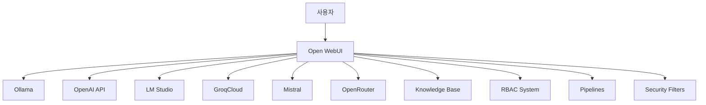
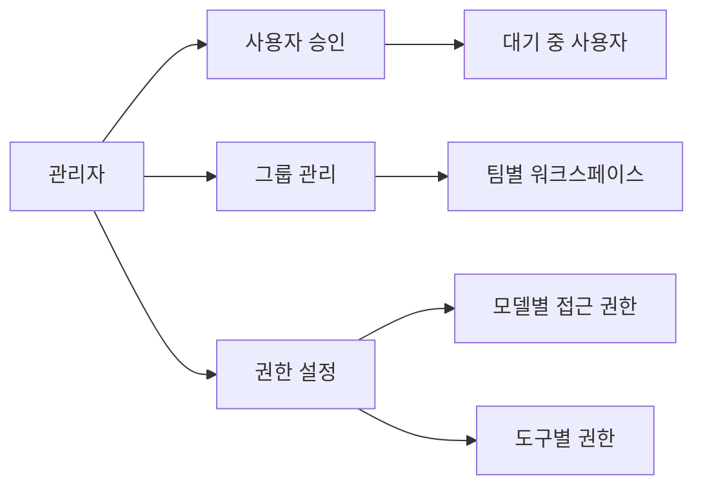
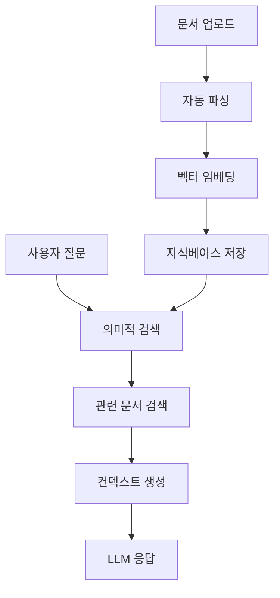
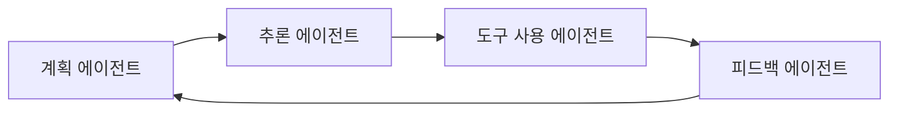

AI 인터페이스 생태계가 급속히 발전하면서, 개발자와 기업들은 ChatGPT 같은 클라우드 서비스와 셀프 호스팅 솔루션 사이에서 선택의 기로에 서 있습니다. 이런 상황에서 **Open WebUI**는 단순한 LLM 인터페이스를 넘어 통합 AI 플랫폼으로 자리매김하며 주목받고 있습니다.

## 셀프 호스팅 AI 플랫폼의 부상

Open WebUI는 100,000개 이상의 GitHub 스타를 보유한 오픈소스 AI 인터페이스로, "User-friendly AI Interface (Supports Ollama, OpenAI API, ...)"라는 슬로건 하에 다양한 LLM 백엔드를 지원합니다. 단순히 채팅 UI를 제공하는 것을 넘어서, 기업급 기능들을 내장한 **통합 AI 플랫폼**의 성격을 띠고 있습니다.



## 핵심 아키텍처와 설치 방식

### 배포 옵션의 다양성

Open WebUI는 다양한 환경에서 유연하게 배포할 수 있도록 설계되었습니다:

**Docker 기반 배포:**
```bash
# Ollama와 함께 사용
docker run -d -p 3000:8080 --add-host=host.docker.internal:host-gateway \
  -v open-webui:/app/backend/data --name open-webui --restart always \
  ghcr.io/open-webui/open-webui:main

# GPU 지원
docker run -d -p 3000:8080 --gpus all \
  -v open-webui:/app/backend/data --name open-webui --restart always \
  ghcr.io/open-webui/open-webui:cuda

# Ollama 번들 포함
docker run -d -p 3000:8080 --gpus=all \
  -v ollama:/root/.ollama -v open-webui:/app/backend/data \
  --name open-webui --restart always \
  ghcr.io/open-webui/open-webui:ollama
```

**Python pip 설치:**
```bash
pip install open-webui
open-webui serve
```

## 경쟁 분석 1: 단순 vLLM UI와의 차별점

### 기준선: 단순 vLLM UI의 한계

일반적인 "vLLM 서버 + 간단한 Chat UI" 조합은 다음과 같은 기본 기능만 제공합니다:

| 범주 | 기본 기능 | 한계점 |
|-----|----------|---------|
| 채팅 | 실시간 스트리밍, 로컬 스토리지 대화 저장 | 단일 사용자, 권한 관리 없음 |
| 모델 | 단일 vLLM 엔드포인트 | 모델 전환 불가, 다중 백엔드 미지원 |
| 설치 | Next.js/Tailwind 기반 수동 배포 | Docker 최적화 미흡 |
| 보안 | 브라우저 로컬 저장 | 기업급 보안 기능 부재 |

### Open WebUI의 차별화된 가치

**1. 모델 및 엔드포인트 관리**

Open WebUI는 여러 LLM 백엔드를 동시에 연결하고 실시간으로 전환할 수 있습니다:

- **다중 모델 스위처**: Ollama, OpenAI, LM Studio, GroqCloud, Mistral, OpenRouter 등
- **GPU/CPU 최적화**: CUDA 이미지와 경량 CPU 이미지 선택
- **모델별 파라미터 설정**: 채팅, 모델, 계정 레벨의 3단계 설정 계층

**2. 기업급 사용자 관리**



**3. Knowledge Base 및 RAG 시스템**

- **문서 업로드**: PDF, Markdown, 웹 문서를 지식베이스로 구성
- **RAG 파이프라인**: 업로드된 파일을 컨텍스트로 활용
- **Full-Context Mode**: 장문 문서를 통합 검색·참조

**4. 생산성 강화 기능**

- **자동 Follow-Up 제안** (v0.6.14+): 매 메시지 후 후속 질문 자동 생성
- **태그 및 자동 제목**: 대화 주제별 정리
- **채팅 검색**: 과거 대화 내용 빠른 검색

## 경쟁 분석 2: ChatGPT와의 차별점

### 배포 환경 및 데이터 주권

| 구분 | Open WebUI | ChatGPT |
|------|------------|---------|
| **배포** | 셀프 호스팅, Docker/K8s/Helm | 클라우드 SaaS |
| **데이터 위치** | 로컬 볼륨, 완전 격리 | OpenAI 클라우드 |
| **오프라인 동작** | 완전 자급자족 가능 | 인터넷 필수 |
| **인프라 제어** | 100% 사용자 제어 | OpenAI 의존 |

### 모델 지원 및 통합성

**Open WebUI:**
- 다중 모델 동시 운영 (Ollama + OpenAI + 기타)
- 원클릭 모델 전환
- LLM-Guard를 통한 보안 필터링
- 커스텀 파이프라인 구성 가능

**ChatGPT:**
- GPT-4o/4.5 등 독점 고성능 모델
- 모델별 기능 차등 (4o-mini 음성, 4.5 Canvas)
- 커스텀 GPTs

### 사용자 관리 및 협업

**Open WebUI:**
```yaml
권한 체계:
  - 관리자: 전체 시스템 관리
  - 사용자: 기본 모델 접근
  - 그룹: 워크스페이스별 권한
  - 펜딩: 승인 대기 상태

리소스 권한:
  - 모델별 읽기/쓰기 권한
  - 도구별 접근 제어
  - 워크스페이스 격리
```

**ChatGPT:**
- 개인/팀/엔터프라이즈 플랜
- 프로젝트별 협업
- 실시간 공동 편집 (예정)

### 생산성 및 멀티모달 기능

| 기능 영역 | Open WebUI | ChatGPT |
|-----------|------------|---------|
| **후속 질문** | ✅ v0.6.14부터 자동 생성 | ❌ 기본 미제공 |
| **메모리** | Knowledge 섹션 구조화 저장 | 대화 기억 + Plus/Pro 장기 메모리 |
| **음성** | STT 공급자 선택 (OpenAI, DeepGram) | Advanced Voice Mode |
| **파일 처리** | PDF/문서 RAG | Vision + Data Analysis |
| **코드 실행** | 로드맵 포함 (Code Interpreter) | Code Interpreter 내장 |

## 핵심 기능 심화 분석

### 1. Pipelines: 확장 가능한 아키텍처

Open WebUI의 가장 혁신적인 특징 중 하나는 **Pipelines** 시스템입니다:

```python
# 커스텀 파이프라인 예시
class CustomPipeline:
    def __init__(self):
        self.name = "Custom Agent Pipeline"
        
    async def on_startup(self):
        # 초기화 로직
        pass
        
    async def on_shutdown(self):
        # 정리 작업
        pass
        
    def pipe(self, user_message: str, model_id: str, **kwargs):
        # 메인 처리 로직
        return {"content": processed_response}
```

**주요 특징:**
- 별도 컨테이너로 무제한 확장 가능
- AI agents부터 홈오토메이션까지 커버
- event_emitter API로 실시간 진행 상황 스트리밍
- 커뮤니티 생태계 활성화

### 2. 보안 및 거버넌스

**LLM-Guard 통합:**
```yaml
보안 필터:
  - 프롬프트 인젝션 차단
  - 정책 위반 탐지
  - 실행 전 위험 평가
  - 응답 후 검증
```

**데이터 주권:**
- 모든 대화 로컬 DB 저장
- 외부 클라우드 전송 없음
- GDPR/CCPA 컴플라이언스 용이
- 감사 로그 완전 제어

### 3. Knowledge Base 시스템

Open WebUI의 RAG 시스템은 단순 파일 업로드를 넘어서는 구조화된 지식 관리를 제공합니다:



**지원 형식:**
- PDF, Markdown, TXT
- 웹 페이지 크롤링
- CSV/Excel 데이터
- 코드 파일

## 미래 발전 방향: 에이전트 시대로의 진화

### 공식 로드맵 분석

Open WebUI는 단순한 채팅 인터페이스를 넘어 **종합 AI 워크플로 플랫폼**으로 진화하고 있습니다:

| 계획 기능 | 설명 | 의미 |
|----------|------|------|
| **AI Workflow Tool** | 노드 기반 시각 편집기로 AI 모듈 연결 | 멀티-에이전트 오케스트레이션 GUI |
| **Code Interpreter** | LLM 코드 작성·실행·검증 자동화 | Agentic coding 완전 지원 |
| **전용 Task Model** | 백그라운드 작업용 경량 LLM 분리 | UI 성능 최적화 |

### 멀티-에이전트 아키텍처

현재도 Pipelines + 이벤트 API를 통해 멀티-에이전트 시스템 구성이 가능하며, 커뮤니티에서는 다음과 같은 구현체들이 제공되고 있습니다:

**SMART (Sequential Multi-Agent Reasoning Technique):**


**Multi-Agent Model:**
- 중앙 CI가 전문 에이전트들을 동적 생성·조정
- 태스크별 특화된 에이전트 자동 할당
- 실시간 협업 및 결과 통합

## 실제 사용 시나리오별 추천

### 개인 개발자용
```yaml
추천 구성:
  - 모델: Ollama + 로컬 LLM (Llama, CodeLlama)
  - 설치: Docker Compose
  - 특징: 비용 제로, 완전 오프라인 가능
  
사용 사례:
  - 코드 리뷰 및 디버깅
  - 문서 작성 지원
  - 학습 및 실험
```

### 팀/기업용
```yaml
추천 구성:
  - 모델: Ollama + OpenAI API 하이브리드
  - 설치: Kubernetes + Helm
  - 특징: RBAC, 감사 로그, 보안 필터
  
사용 사례:
  - 팀 지식베이스 구축
  - 고객 지원 자동화
  - 내부 문서 QA 시스템
```

### 연구 및 실험용
```yaml
추천 구성:
  - 모델: 다중 백엔드 (OpenAI, Anthropic, 로컬)
  - 설치: GPU 클러스터 + 분산 배포
  - 특징: 모델 비교, 파라미터 튜닝, 실험 추적
  
사용 사례:
  - LLM 벤치마킹
  - 프롬프트 엔지니어링
  - 멀티모달 연구
```

## 설치 및 최적화 가이드

### 기본 설치
```bash
# 최소 구성 (Ollama 로컬)
docker run -d -p 3000:8080 \
  --add-host=host.docker.internal:host-gateway \
  -v open-webui:/app/backend/data \
  --name open-webui --restart always \
  ghcr.io/open-webui/open-webui:main

# 메모리 최적화 (200MB 이하)
export HF_HUB_OFFLINE=1
docker run -d -p 3000:8080 \
  -e HF_HUB_OFFLINE=1 \
  -v open-webui:/app/backend/data \
  --name open-webui-lite \
  ghcr.io/open-webui/open-webui:main
```

### 기업급 배포
```yaml
# docker-compose.yml
version: '3.8'
services:
  open-webui:
    image: ghcr.io/open-webui/open-webui:main
    ports:
      - "3000:8080"
    environment:
      - OPENAI_API_KEY=${OPENAI_API_KEY}
      - OLLAMA_BASE_URL=http://ollama:11434
    volumes:
      - open-webui:/app/backend/data
    depends_on:
      - ollama
      - postgres
      
  ollama:
    image: ollama/ollama:latest
    volumes:
      - ollama:/root/.ollama
    ports:
      - "11434:11434"
      
  postgres:
    image: postgres:15
    environment:
      POSTGRES_DB: openwebui
      POSTGRES_USER: openwebui
      POSTGRES_PASSWORD: ${DB_PASSWORD}
    volumes:
      - postgres_data:/var/lib/postgresql/data
```

## 결론 및 전망

Open WebUI는 단순한 LLM 인터페이스를 넘어서 **셀프 호스팅 AI 플랫폼의 새로운 기준**을 제시하고 있습니다. 특히 다음과 같은 영역에서 독보적인 강점을 보여줍니다:

### 핵심 강점
1. **데이터 주권**: 완전한 로컬 호스팅으로 민감 정보 보호
2. **확장성**: Pipelines 아키텍처로 무한 커스터마이징 가능
3. **통합성**: 다중 모델·백엔드를 단일 인터페이스에서 관리
4. **미래 지향성**: AI Workflow Tool과 멀티-에이전트 지원 로드맵

### 선택 가이드

**Open WebUI를 선택해야 하는 경우:**
- 데이터 보안과 프라이버시가 중요한 기업/기관
- 다양한 LLM 모델을 실험하고 비교하는 연구자
- 커스텀 AI 워크플로가 필요한 개발팀
- 장기적으로 AI 인프라를 자체 구축하려는 조직

**ChatGPT가 더 적합한 경우:**
- 즉시 사용 가능한 고성능 모델이 필요
- 인프라 관리 부담을 최소화하려는 경우
- 최신 멀티모달 기능을 우선적으로 활용하고 싶은 경우

Open WebUI는 오픈소스 커뮤니티의 활발한 기여와 함께 빠르게 발전하고 있으며, AI Workflow Tool과 Code Interpreter 같은 로드맵 기능들이 완성되면 **완전한 AI 개발 플랫폼**으로 자리매김할 것으로 예상됩니다. 특히 에이전트 기반 AI가 주류가 되는 시점에서, 셀프 호스팅으로 안전하고 유연한 멀티-에이전트 시스템을 구축할 수 있는 Open WebUI의 가치는 더욱 부각될 것입니다.

---

**관련 링크:**
- [Open WebUI GitHub](https://github.com/open-webui/open-webui)
- [공식 문서](https://docs.openwebui.com)
- [커뮤니티 모델](https://openwebui.com)
- [Discord 커뮤니티](https://discord.gg/5rJgQTnV4s) 