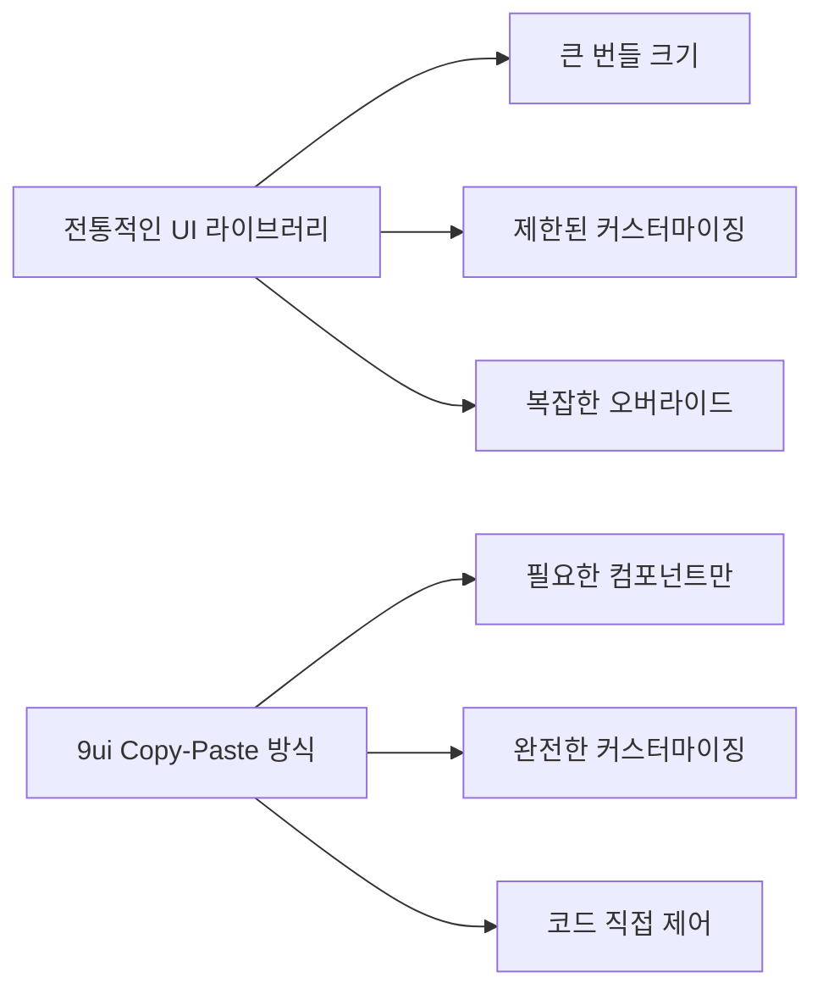

⏱️ **예상 읽기 시간**: 12분

## 서론

React 생태계에서 UI 컴포넌트 라이브러리를 선택할 때 항상 고민이 됩니다. Material-UI는 무겁고, Ant Design은 디자인이 제한적이고, 직접 만들기엔 시간이 부족하죠. 이런 딜레마를 해결하는 새로운 접근법이 바로 **9ui**입니다.

9ui는 **Base UI + Tailwind CSS**를 기반으로 한 copy-paste 방식의 컴포넌트 라이브러리로, npm 패키지가 아닌 코드를 직접 복사해서 사용하는 혁신적인 방식을 제공합니다. 이를 통해 완전한 커스터마이징과 최적화된 성능을 동시에 얻을 수 있습니다.

## 9ui란 무엇인가?

### 핵심 특징

**9ui**는 shadcn/ui의 철학을 계승하면서도 Base UI를 기반으로 한 차세대 컴포넌트 라이브러리입니다.

| 특징 | 설명 | 장점 |
|------|------|------|
| **Copy-Paste 방식** | npm 설치가 아닌 코드 직접 복사 | 완전한 커스터마이징 가능 |
| **Base UI 기반** | 접근성 우수한 unstyled 컴포넌트 | WAI-ARIA 표준 준수 |
| **Tailwind CSS** | 유틸리티 퍼스트 CSS 프레임워크 | 빠른 스타일링, 작은 번들 크기 |
| **TypeScript 지원** | 완전한 타입 안전성 | 개발자 경험 향상 |
| **shadcn CLI 호환** | 기존 도구 체인 활용 | 간편한 설치 및 관리 |

### 기존 라이브러리와의 차이점



## 환경 설정 및 설치

### 사전 요구사항

- **Node.js**: 18.0.0 이상
- **React**: 18.0.0 이상
- **Next.js**: 13.0.0 이상 (권장)
- **Tailwind CSS**: 3.0.0 이상

### 개발 환경 확인

```bash
# 현재 버전 확인
node --version
npm --version
```

**테스트 환경**:
- macOS 15.0.0 (Sequoia)
- Node.js v20.10.0
- npm 10.2.3

### 1. Next.js 프로젝트 생성

```bash
# 새 Next.js 프로젝트 생성
npx create-next-app@latest my-9ui-project \
  --typescript \
  --tailwind \
  --eslint \
  --app \
  --no-src-dir \
  --no-import-alias

cd my-9ui-project
```

### 2. shadcn/ui CLI 초기화

```bash
# shadcn CLI 초기화
npx shadcn@latest init
```

**초기화 옵션 선택**:
- Framework: Next.js ✅
- Color: Neutral (권장)
- CSS Variables: Yes ✅

### 3. 9ui 테마 설치

```bash
# 9ui 공식 테마 추가
npx shadcn@latest add "https://9ui.dev/r/theme.json"
```

✅ **설치 확인**: `app/globals.css`에 9ui CSS 변수가 추가됩니다.

## 주요 컴포넌트 실습

### Button 컴포넌트

가장 기본적인 컴포넌트부터 시작해보겠습니다.

```bash
# Button 컴포넌트 설치
npx shadcn@latest add "https://9ui.dev/r/button.json"
```

#### 기본 사용법

```tsx
import { Button } from "@/components/ui/button"

export default function ButtonDemo() {
  return (
    <div className="flex gap-4 flex-wrap">
      <Button>Default</Button>
      <Button variant="destructive">Destructive</Button>
      <Button variant="outline">Outline</Button>
      <Button variant="secondary">Secondary</Button>
      <Button variant="ghost">Ghost</Button>
      <Button variant="link">Link</Button>
    </div>
  )
}
```

#### 사이즈 및 로딩 상태

```tsx
import { Button } from "@/components/ui/button"
import { Loader2 } from "lucide-react"

export default function AdvancedButton() {
  return (
    <div className="space-y-4">
      {/* 다양한 크기 */}
      <div className="flex gap-2 items-center">
        <Button size="sm">Small</Button>
        <Button size="default">Default</Button>
        <Button size="lg">Large</Button>
      </div>
      
      {/* 로딩 상태 */}
      <Button disabled>
        <Loader2 className="mr-2 h-4 w-4 animate-spin" />
        Loading...
      </Button>
    </div>
  )
}
```

### Card 컴포넌트

정보를 구조화하여 표시하는 핵심 컴포넌트입니다.

```bash
# Card 컴포넌트 설치
npx shadcn@latest add "https://9ui.dev/r/card.json"
```

#### 기본 카드 구조

```tsx
import { 
  Card, 
  CardContent, 
  CardDescription, 
  CardFooter, 
  CardHeader, 
  CardTitle 
} from "@/components/ui/card"
import { Button } from "@/components/ui/button"

export default function CardDemo() {
  return (
    <div className="grid grid-cols-1 md:grid-cols-2 lg:grid-cols-3 gap-4">
      {/* 기본 카드 */}
      <Card>
        <CardHeader>
          <CardTitle>프로젝트 A</CardTitle>
          <CardDescription>
            새로운 웹 애플리케이션 개발 프로젝트
          </CardDescription>
        </CardHeader>
        <CardContent>
          <p>React와 TypeScript를 활용한 현대적인 웹 애플리케이션을 
             개발하고 있습니다.</p>
        </CardContent>
        <CardFooter>
          <Button>자세히 보기</Button>
        </CardFooter>
      </Card>

      {/* 통계 카드 */}
      <Card>
        <CardHeader>
          <CardTitle>월간 사용자</CardTitle>
          <CardDescription>이번 달 활성 사용자 수</CardDescription>
        </CardHeader>
        <CardContent>
          <div className="text-2xl font-bold">15,234</div>
          <p className="text-xs text-muted-foreground">
            +12.5% from last month
          </p>
        </CardContent>
      </Card>

      {/* 진행률 카드 */}
      <Card>
        <CardHeader>
          <CardTitle>개발 진행률</CardTitle>
          <CardDescription>현재 스프린트 진행 상황</CardDescription>
        </CardHeader>
        <CardContent>
          <div className="space-y-2">
            <div className="flex justify-between text-sm">
              <span>완료된 작업</span>
              <span>8/12</span>
            </div>
            <div className="w-full bg-gray-200 rounded-full h-2">
              <div 
                className="bg-blue-600 h-2 rounded-full" 
                style={{width: '67%'}}
              />
            </div>
          </div>
        </CardContent>
        <CardFooter>
          <Button variant="outline" className="w-full">
            세부 사항 보기
          </Button>
        </CardFooter>
      </Card>
    </div>
  )
}
```

### Command 컴포넌트

검색과 실행을 위한 강력한 커맨드 팔레트입니다.

```bash
# Command 컴포넌트 설치 (Dialog도 함께 설치됨)
npx shadcn@latest add "https://9ui.dev/r/command.json"
```

#### 기본 커맨드 팔레트

```tsx
"use client"

import { useState } from "react"
import { 
  Command,
  CommandEmpty,
  CommandGroup,
  CommandInput,
  CommandItem,
  CommandList
} from "@/components/ui/command"
import { Button } from "@/components/ui/button"

export default function CommandDemo() {
  const [open, setOpen] = useState(false)

  return (
    <div className="space-y-4">
      <Button onClick={() => setOpen(!open)}>
        Command 팔레트 {open ? '닫기' : '열기'}
      </Button>

      {open && (
        <div className="border rounded-lg max-w-md">
          <Command>
            <CommandInput placeholder="명령어 또는 검색어를 입력하세요..." />
            <CommandList>
              <CommandEmpty>검색 결과가 없습니다.</CommandEmpty>
              
              <CommandGroup heading="빠른 작업">
                <CommandItem onSelect={() => console.log('새 파일')}>
                  📄 새 파일 생성
                </CommandItem>
                <CommandItem onSelect={() => console.log('프로젝트 열기')}>
                  📁 프로젝트 열기
                </CommandItem>
                <CommandItem onSelect={() => console.log('설정')}>
                  ⚙️ 설정
                </CommandItem>
              </CommandGroup>

              <CommandGroup heading="최근 명령어">
                <CommandItem>git status</CommandItem>
                <CommandItem>npm run dev</CommandItem>
                <CommandItem>npm run build</CommandItem>
                <CommandItem>code .</CommandItem>
              </CommandGroup>

              <CommandGroup heading="도구">
                <CommandItem>🎨 색상 팔레트</CommandItem>
                <CommandItem>📊 대시보드</CommandItem>
                <CommandItem>🔍 검색</CommandItem>
              </CommandGroup>
            </CommandList>
          </Command>
        </div>
      )}
    </div>
  )
}
```

#### 키바인딩과 함께 사용

```tsx
"use client"

import { useEffect, useState } from "react"
import { 
  Dialog,
  DialogContent,
  DialogDescription,
  DialogHeader,
  DialogTitle,
} from "@/components/ui/dialog"
import { Command, CommandInput, CommandList, CommandItem } from "@/components/ui/command"

export default function GlobalCommand() {
  const [open, setOpen] = useState(false)

  useEffect(() => {
    const down = (e: KeyboardEvent) => {
      if (e.key === "k" && (e.metaKey || e.ctrlKey)) {
        e.preventDefault()
        setOpen((open) => !open)
      }
    }
    document.addEventListener("keydown", down)
    return () => document.removeEventListener("keydown", down)
  }, [])

  return (
    <>
      <p className="text-sm text-muted-foreground">
        Press <kbd className="px-2 py-1 bg-muted rounded text-xs">⌘</kbd>
        <kbd className="px-2 py-1 bg-muted rounded text-xs">K</kbd> to open
      </p>
      
      <Dialog open={open} onOpenChange={setOpen}>
        <DialogContent className="overflow-hidden p-0">
          <DialogHeader className="px-4 pb-4">
            <DialogTitle>명령어 팔레트</DialogTitle>
            <DialogDescription>
              원하는 작업을 빠르게 실행하세요
            </DialogDescription>
          </DialogHeader>
          <Command>
            <CommandInput placeholder="Type a command or search..." />
            <CommandList>
              <CommandItem onSelect={() => setOpen(false)}>
                Calendar
              </CommandItem>
              <CommandItem onSelect={() => setOpen(false)}>
                Search Emoji
              </CommandItem>
              <CommandItem onSelect={() => setOpen(false)}>
                Calculator
              </CommandItem>
            </CommandList>
          </Command>
        </DialogContent>
      </Dialog>
    </>
  )
}
```

## 고급 활용 패턴

### 1. 테마 커스터마이징

9ui의 가장 큰 장점은 완전한 커스터마이징입니다.

#### CSS 변수 수정

```css
/* app/globals.css */
:root {
  --background: 0 0% 100%;
  --foreground: 222.2 84% 4.9%;
  --card: 0 0% 100%;
  --card-foreground: 222.2 84% 4.9%;
  --popover: 0 0% 100%;
  --popover-foreground: 222.2 84% 4.9%;
  
  /* 커스텀 색상 추가 */
  --brand: 210 100% 50%;
  --brand-foreground: 0 0% 100%;
}

.dark {
  --background: 222.2 84% 4.9%;
  --foreground: 210 40% 98%;
  --card: 222.2 84% 4.9%;
  --card-foreground: 210 40% 98%;
  
  /* 다크 모드 브랜드 색상 */
  --brand: 210 100% 60%;
}
```

#### 커스텀 버튼 Variant

```tsx
// components/ui/button.tsx 수정
const buttonVariants = cva(
  // ... 기존 base 클래스들
  {
    variants: {
      variant: {
        // ... 기존 variants
        brand: "bg-brand text-brand-foreground hover:bg-brand/90",
        gradient: "bg-gradient-to-r from-purple-500 to-pink-500 text-white hover:from-purple-600 hover:to-pink-600",
      },
      // ... 기존 size variants
    }
  }
)

// 사용 예시
<Button variant="brand">브랜드 버튼</Button>
<Button variant="gradient">그라디언트 버튼</Button>
```

### 2. 폼 통합 (React Hook Form + Zod)

```bash
# 필요한 패키지 설치
npm install react-hook-form @hookform/resolvers zod

# Form 컴포넌트 설치
npx shadcn@latest add "https://9ui.dev/r/form.json"
npx shadcn@latest add "https://9ui.dev/r/input.json"
npx shadcn@latest add "https://9ui.dev/r/label.json"
```

#### 완성된 폼 예제

```tsx
"use client"

import { zodResolver } from "@hookform/resolvers/zod"
import { useForm } from "react-hook-form"
import { z } from "zod"
import {
  Form,
  FormControl,
  FormDescription,
  FormField,
  FormItem,
  FormLabel,
  FormMessage,
} from "@/components/ui/form"
import { Input } from "@/components/ui/input"
import { Button } from "@/components/ui/button"
import { Card, CardContent, CardHeader, CardTitle } from "@/components/ui/card"

const formSchema = z.object({
  username: z.string().min(2, "사용자명은 최소 2자 이상이어야 합니다."),
  email: z.string().email("올바른 이메일 주소를 입력해주세요."),
  password: z.string().min(8, "비밀번호는 최소 8자 이상이어야 합니다."),
})

export default function RegistrationForm() {
  const form = useForm<z.infer<typeof formSchema>>({
    resolver: zodResolver(formSchema),
    defaultValues: {
      username: "",
      email: "",
      password: "",
    },
  })

  function onSubmit(values: z.infer<typeof formSchema>) {
    console.log(values)
    // 여기서 API 호출 등 처리
  }

  return (
    <Card className="w-full max-w-md mx-auto">
      <CardHeader>
        <CardTitle>회원가입</CardTitle>
      </CardHeader>
      <CardContent>
        <Form {...form}>
          <form onSubmit={form.handleSubmit(onSubmit)} className="space-y-4">
            <FormField
              control={form.control}
              name="username"
              render={({ field }) => (
                <FormItem>
                  <FormLabel>사용자명</FormLabel>
                  <FormControl>
                    <Input placeholder="홍길동" {...field} />
                  </FormControl>
                  <FormDescription>
                    다른 사용자들에게 표시될 이름입니다.
                  </FormDescription>
                  <FormMessage />
                </FormItem>
              )}
            />
            
            <FormField
              control={form.control}
              name="email"
              render={({ field }) => (
                <FormItem>
                  <FormLabel>이메일</FormLabel>
                  <FormControl>
                    <Input type="email" placeholder="hong@example.com" {...field} />
                  </FormControl>
                  <FormMessage />
                </FormItem>
              )}
            />
            
            <FormField
              control={form.control}
              name="password"
              render={({ field }) => (
                <FormItem>
                  <FormLabel>비밀번호</FormLabel>
                  <FormControl>
                    <Input type="password" {...field} />
                  </FormControl>
                  <FormMessage />
                </FormItem>
              )}
            />
            
            <Button type="submit" className="w-full">
              가입하기
            </Button>
          </form>
        </Form>
      </CardContent>
    </Card>
  )
}
```

### 3. 데이터 테이블 구현

```bash
# Table 컴포넌트 설치
npx shadcn@latest add "https://9ui.dev/r/table.json"
```

```tsx
import {
  Table,
  TableBody,
  TableCaption,
  TableCell,
  TableHead,
  TableHeader,
  TableRow,
} from "@/components/ui/table"
import { Badge } from "@/components/ui/badge"
import { Button } from "@/components/ui/button"

const projectData = [
  {
    id: "PROJ-001",
    name: "E-commerce Platform",
    status: "active",
    progress: 75,
    team: "Frontend Team",
    deadline: "2025-08-15"
  },
  {
    id: "PROJ-002", 
    name: "Mobile App Redesign",
    status: "review",
    progress: 90,
    team: "Design Team",
    deadline: "2025-07-30"
  },
  {
    id: "PROJ-003",
    name: "API Migration",
    status: "planning",
    progress: 25,
    team: "Backend Team", 
    deadline: "2025-09-10"
  }
]

export default function ProjectTable() {
  return (
    <div className="border rounded-lg">
      <Table>
        <TableCaption>현재 진행 중인 프로젝트 목록</TableCaption>
        <TableHeader>
          <TableRow>
            <TableHead>프로젝트 ID</TableHead>
            <TableHead>프로젝트명</TableHead>
            <TableHead>상태</TableHead>
            <TableHead>진행률</TableHead>
            <TableHead>담당팀</TableHead>
            <TableHead>마감일</TableHead>
            <TableHead className="text-right">작업</TableHead>
          </TableRow>
        </TableHeader>
        <TableBody>
          {projectData.map((project) => (
            <TableRow key={project.id}>
              <TableCell className="font-medium">{project.id}</TableCell>
              <TableCell>{project.name}</TableCell>
              <TableCell>
                <Badge 
                  variant={
                    project.status === "active" ? "default" :
                    project.status === "review" ? "secondary" : 
                    "outline"
                  }
                >
                  {project.status === "active" ? "진행중" :
                   project.status === "review" ? "검토중" : "계획중"}
                </Badge>
              </TableCell>
              <TableCell>
                <div className="flex items-center space-x-2">
                  <div className="w-full bg-gray-200 rounded-full h-2">
                    <div 
                      className="bg-blue-600 h-2 rounded-full" 
                      style={{width: `${project.progress}%`}}
                    />
                  </div>
                  <span className="text-sm">{project.progress}%</span>
                </div>
              </TableCell>
              <TableCell>{project.team}</TableCell>
              <TableCell>{project.deadline}</TableCell>
              <TableCell className="text-right">
                <Button variant="ghost" size="sm">편집</Button>
              </TableCell>
            </TableRow>
          ))}
        </TableBody>
      </Table>
    </div>
  )
}
```

## 실제 프로젝트 적용 사례

### 1. 관리자 대시보드

```tsx
// app/dashboard/page.tsx
"use client"

import { Card, CardContent, CardHeader, CardTitle } from "@/components/ui/card"
import { Button } from "@/components/ui/button"
import { 
  Users, 
  DollarSign, 
  Activity, 
  TrendingUp,
  Plus
} from "lucide-react"

export default function Dashboard() {
  return (
    <div className="space-y-6">
      {/* 헤더 */}
      <div className="flex justify-between items-center">
        <h1 className="text-3xl font-bold">대시보드</h1>
        <Button>
          <Plus className="mr-2 h-4 w-4" />
          새 프로젝트
        </Button>
      </div>

      {/* 통계 카드들 */}
      <div className="grid grid-cols-1 md:grid-cols-2 lg:grid-cols-4 gap-4">
        <Card>
          <CardHeader className="flex flex-row items-center justify-between space-y-0 pb-2">
            <CardTitle className="text-sm font-medium">총 사용자</CardTitle>
            <Users className="h-4 w-4 text-muted-foreground" />
          </CardHeader>
          <CardContent>
            <div className="text-2xl font-bold">+2,350</div>
            <p className="text-xs text-muted-foreground">
              +180.1% from last month
            </p>
          </CardContent>
        </Card>

        <Card>
          <CardHeader className="flex flex-row items-center justify-between space-y-0 pb-2">
            <CardTitle className="text-sm font-medium">수익</CardTitle>
            <DollarSign className="h-4 w-4 text-muted-foreground" />
          </CardHeader>
          <CardContent>
            <div className="text-2xl font-bold">+$12,234</div>
            <p className="text-xs text-muted-foreground">
              +19% from last month  
            </p>
          </CardContent>
        </Card>

        <Card>
          <CardHeader className="flex flex-row items-center justify-between space-y-0 pb-2">
            <CardTitle className="text-sm font-medium">활성 세션</CardTitle>
            <Activity className="h-4 w-4 text-muted-foreground" />
          </CardHeader>
          <CardContent>
            <div className="text-2xl font-bold">+573</div>
            <p className="text-xs text-muted-foreground">
              +201 from last hour
            </p>
          </CardContent>
        </Card>

        <Card>
          <CardHeader className="flex flex-row items-center justify-between space-y-0 pb-2">
            <CardTitle className="text-sm font-medium">성장률</CardTitle>
            <TrendingUp className="h-4 w-4 text-muted-foreground" />
          </CardHeader>
          <CardContent>
            <div className="text-2xl font-bold">+12.5%</div>
            <p className="text-xs text-muted-foreground">
              +2% from last month
            </p>
          </CardContent>
        </Card>
      </div>

      {/* 추가 콘텐츠 영역 */}
      <div className="grid grid-cols-1 lg:grid-cols-2 gap-6">
        <Card>
          <CardHeader>
            <CardTitle>최근 활동</CardTitle>
          </CardHeader>
          <CardContent>
            <div className="space-y-4">
              {[1,2,3].map((item) => (
                <div key={item} className="flex items-center space-x-4">
                  <div className="w-2 h-2 bg-blue-600 rounded-full" />
                  <div className="flex-1 space-y-1">
                    <p className="text-sm font-medium">새 사용자 등록</p>
                    <p className="text-xs text-muted-foreground">2분 전</p>
                  </div>
                </div>
              ))}
            </div>
          </CardContent>
        </Card>

        <Card>
          <CardHeader>
            <CardTitle>빠른 액션</CardTitle>
          </CardHeader>
          <CardContent>
            <div className="grid grid-cols-2 gap-4">
              <Button variant="outline" className="h-20 flex-col">
                <Users className="h-6 w-6 mb-2" />
                사용자 관리
              </Button>
              <Button variant="outline" className="h-20 flex-col">
                <Activity className="h-6 w-6 mb-2" />
                분석 보기
              </Button>
              <Button variant="outline" className="h-20 flex-col">
                <DollarSign className="h-6 w-6 mb-2" />
                결제 관리
              </Button>
              <Button variant="outline" className="h-20 flex-col">
                <TrendingUp className="h-6 w-6 mb-2" />
                리포트
              </Button>
            </div>
          </CardContent>
        </Card>
      </div>
    </div>
  )
}
```

### 2. 개발 도구 UI

```tsx
// components/DevToolsPanel.tsx
"use client"

import { useState } from "react"
import { 
  Command,
  CommandInput,
  CommandList,
  CommandEmpty,
  CommandGroup,
  CommandItem
} from "@/components/ui/command"
import { Button } from "@/components/ui/button"
import { Card, CardContent, CardHeader, CardTitle } from "@/components/ui/card"
import { Badge } from "@/components/ui/badge"
import { 
  Terminal, 
  FileText, 
  Settings, 
  Search,
  GitBranch,
  Play
} from "lucide-react"

const tools = [
  { name: "터미널", icon: Terminal, command: "terminal", category: "개발" },
  { name: "파일 검색", icon: Search, command: "search", category: "개발" },
  { name: "Git 상태", icon: GitBranch, command: "git", category: "버전관리" },
  { name: "빌드 실행", icon: Play, command: "build", category: "빌드" },
  { name: "설정", icon: Settings, command: "settings", category: "환경설정" },
  { name: "로그 보기", icon: FileText, command: "logs", category: "디버깅" },
]

export default function DevToolsPanel() {
  const [selectedTool, setSelectedTool] = useState<string | null>(null)
  
  return (
    <div className="grid grid-cols-1 lg:grid-cols-3 gap-6">
      {/* 커맨드 팔레트 */}
      <Card className="lg:col-span-2">
        <CardHeader>
          <CardTitle className="flex items-center gap-2">
            <Terminal className="h-5 w-5" />
            개발 도구 팔레트
          </CardTitle>
        </CardHeader>
        <CardContent>
          <Command>
            <CommandInput placeholder="도구 또는 명령어 검색..." />
            <CommandList>
              <CommandEmpty>검색 결과가 없습니다.</CommandEmpty>
              
              {["개발", "버전관리", "빌드", "환경설정", "디버깅"].map(category => (
                <CommandGroup key={category} heading={category}>
                  {tools
                    .filter(tool => tool.category === category)
                    .map(tool => (
                      <CommandItem
                        key={tool.command}
                        onSelect={() => setSelectedTool(tool.command)}
                      >
                        <tool.icon className="mr-2 h-4 w-4" />
                        {tool.name}
                      </CommandItem>
                    ))}
                </CommandGroup>
              ))}
            </CommandList>
          </Command>
        </CardContent>
      </Card>

      {/* 도구 상태 */}
      <Card>
        <CardHeader>
          <CardTitle>시스템 상태</CardTitle>
        </CardHeader>
        <CardContent className="space-y-4">
          <div className="flex justify-between items-center">
            <span className="text-sm">서버 상태</span>
            <Badge variant="default">실행중</Badge>
          </div>
          <div className="flex justify-between items-center">
            <span className="text-sm">빌드 상태</span>
            <Badge variant="secondary">성공</Badge>
          </div>
          <div className="flex justify-between items-center">
            <span className="text-sm">테스트</span>
            <Badge variant="outline">통과</Badge>
          </div>
          
          <div className="pt-4">
            <Button className="w-full" variant="outline">
              전체 상태 보기
            </Button>
          </div>
        </CardContent>
      </Card>

      {/* 선택된 도구 상세 */}
      {selectedTool && (
        <Card className="lg:col-span-3">
          <CardHeader>
            <CardTitle>
              {tools.find(t => t.command === selectedTool)?.name} 실행 결과
            </CardTitle>
          </CardHeader>
          <CardContent>
            <div className="bg-gray-900 text-green-400 p-4 rounded font-mono text-sm">
              <div>$ {selectedTool}</div>
              <div className="mt-2">
                {selectedTool === "git" && "On branch main\nYour branch is up to date with 'origin/main'."}
                {selectedTool === "build" && "✓ Build completed successfully\n✓ Generated static files\n✓ Ready for deployment"}
                {selectedTool === "terminal" && "터미널이 준비되었습니다. 명령어를 입력하세요."}
                {!["git", "build", "terminal"].includes(selectedTool) && `${selectedTool} 명령어가 실행되었습니다.`}
              </div>
            </div>
          </CardContent>
        </Card>
      )}
    </div>
  )
}
```

## 성능 최적화 및 베스트 프랙티스

### 1. Tree Shaking 최적화

9ui의 copy-paste 방식은 자동으로 tree shaking을 지원합니다:

```tsx
// ❌ 전체 라이브러리 import (불필요한 코드 포함)
import * as UIComponents from 'some-ui-library'

// ✅ 필요한 컴포넌트만 import (9ui 방식)
import { Button } from "@/components/ui/button"
import { Card } from "@/components/ui/card"
```

### 2. 컴포넌트 lazy loading

```tsx
import { lazy, Suspense } from 'react'
import { Card, CardContent } from "@/components/ui/card"

const HeavyChart = lazy(() => import('./HeavyChart'))

export default function Dashboard() {
  return (
    <Card>
      <CardContent>
        <Suspense fallback={<div>차트 로딩 중...</div>}>
          <HeavyChart />
        </Suspense>
      </CardContent>
    </Card>
  )
}
```

### 3. 메모이제이션 활용

```tsx
"use client"

import { memo, useMemo } from 'react'
import { Card, CardContent, CardHeader, CardTitle } from "@/components/ui/card"

interface StatsCardProps {
  title: string
  value: number
  change: number
}

const StatsCard = memo(({ title, value, change }: StatsCardProps) => {
  const changeColor = useMemo(() => {
    return change > 0 ? 'text-green-600' : 'text-red-600'
  }, [change])

  return (
    <Card>
      <CardHeader>
        <CardTitle>{title}</CardTitle>
      </CardHeader>
      <CardContent>
        <div className="text-2xl font-bold">{value.toLocaleString()}</div>
        <p className={`text-sm ${changeColor}`}>
          {change > 0 ? '+' : ''}{change}%
        </p>
      </CardContent>
    </Card>
  )
})

StatsCard.displayName = 'StatsCard'
```

### 4. 접근성 개선

```tsx
import { Button } from "@/components/ui/button"
import { Card, CardContent } from "@/components/ui/card"

export default function AccessibleUI() {
  return (
    <Card>
      <CardContent>
        {/* 스크린 리더를 위한 라벨 */}
        <Button 
          aria-label="프로젝트 삭제"
          aria-describedby="delete-description"
        >
          삭제
        </Button>
        
        <div id="delete-description" className="sr-only">
          이 작업은 되돌릴 수 없습니다. 신중히 확인하세요.
        </div>

        {/* 키보드 네비게이션 지원 */}
        <div role="tablist" className="flex">
          <Button
            role="tab"
            aria-selected="true"
            aria-controls="panel-1"
            tabIndex={0}
          >
            탭 1
          </Button>
          <Button
            role="tab"
            aria-selected="false"
            aria-controls="panel-2"
            tabIndex={-1}
          >
            탭 2
          </Button>
        </div>
      </CardContent>
    </Card>
  )
}
```

## 테스트 및 디버깅

### 개발 서버 실행

```bash
# 개발 서버 시작
npm run dev

# 브라우저에서 확인
open http://localhost:3000
```

### 빌드 테스트

```bash
# 프로덕션 빌드
npm run build

# 빌드 결과 확인
npm start
```

### Storybook 통합 (선택사항)

```bash
# Storybook 설치
npx storybook@latest init

# 9ui 컴포넌트 스토리 생성
mkdir -p stories/ui
```

```typescript
// stories/ui/Button.stories.ts
import type { Meta, StoryObj } from '@storybook/react'
import { Button } from '@/components/ui/button'

const meta: Meta<typeof Button> = {
  title: '9ui/Button',
  component: Button,
  parameters: {
    layout: 'centered',
  },
  tags: ['autodocs'],
  argTypes: {
    variant: {
      control: 'select',
      options: ['default', 'destructive', 'outline', 'secondary', 'ghost', 'link'],
    },
  },
}

export default meta
type Story = StoryObj<typeof meta>

export const Default: Story = {
  args: {
    children: 'Button',
  },
}

export const Destructive: Story = {
  args: {
    variant: 'destructive',
    children: 'Delete',
  },
}
```

## 문제 해결 및 FAQ

### 자주 발생하는 문제들

#### 1. Tailwind CSS 클래스가 적용되지 않는 경우

```javascript
// tailwind.config.js
module.exports = {
  content: [
    './pages/**/*.{js,ts,jsx,tsx,mdx}',
    './components/**/*.{js,ts,jsx,tsx,mdx}',
    './app/**/*.{js,ts,jsx,tsx,mdx}',
    // 9ui 컴포넌트 경로 추가
    './components/ui/**/*.{js,ts,jsx,tsx}',
  ],
  theme: {
    extend: {},
  },
  plugins: [],
}
```

#### 2. Base UI 의존성 오류

```bash
# Base UI 패키지 수동 설치
npm install @base_ui/react
```

#### 3. TypeScript 타입 오류

```typescript
// types/globals.d.ts
declare module '@base_ui/react' {
  // Base UI 타입 선언
}
```

### 유용한 개발 도구

#### VS Code 확장

```json
// .vscode/extensions.json
{
  "recommendations": [
    "bradlc.vscode-tailwindcss",
    "esbenp.prettier-vscode",
    "ms-vscode.vscode-typescript-next"
  ]
}
```

#### prettier 설정

```json
// .prettierrc
{
  "semi": false,
  "singleQuote": true,
  "tabWidth": 2,
  "trailingComma": "es5",
  "plugins": ["prettier-plugin-tailwindcss"]
}
```

## zshrc Aliases 설정

작업 효율성을 위한 유용한 aliases:

```bash
# ~/.zshrc에 추가

# 9ui 관련 aliases
alias 9ui-install="npx shadcn@latest add"
alias 9ui-theme="npx shadcn@latest add 'https://9ui.dev/r/theme.json'"
alias 9ui-button="npx shadcn@latest add 'https://9ui.dev/r/button.json'"
alias 9ui-card="npx shadcn@latest add 'https://9ui.dev/r/card.json'"
alias 9ui-command="npx shadcn@latest add 'https://9ui.dev/r/command.json'"
alias 9ui-form="npx shadcn@latest add 'https://9ui.dev/r/form.json'"

# 개발 워크플로우
alias ndev="npm run dev"
alias nbuild="npm run build"
alias nstart="npm start"
alias nlint="npm run lint"

# Git 워크플로우
alias gst="git status"
alias gaa="git add ."
alias gcm="git commit -m"
alias gps="git push"
alias gpl="git pull"

# 프로젝트 생성
alias create-9ui="npx create-next-app@latest --typescript --tailwind --eslint --app"

# 버전 확인
alias check-env="node --version && npm --version && git --version"
```

적용하기:
```bash
source ~/.zshrc
```

## 결론

9ui는 **Base UI + Tailwind CSS**의 강력한 조합으로 현대적인 React 애플리케이션 개발에 새로운 패러다임을 제시합니다.

### 핵심 장점 요약

| 장점 | 설명 | 효과 |
|------|------|------|
| **완전한 제어권** | copy-paste 방식으로 코드 직접 수정 | 100% 커스터마이징 |
| **우수한 성능** | 필요한 컴포넌트만 포함 | 작은 번들 크기 |
| **뛰어난 접근성** | Base UI의 WAI-ARIA 표준 | 포용적 사용자 경험 |
| **개발자 경험** | TypeScript + shadcn CLI | 빠른 개발 속도 |
| **미래 보장** | 표준 기술 기반 | 장기적 안정성 |

### 권장 사용 시나리오

- ✅ **커스텀 디자인 시스템** 구축이 필요한 경우
- ✅ **성능이 중요한** 웹 애플리케이션
- ✅ **접근성**이 중요한 프로덕트
- ✅ **완전한 제어권**이 필요한 프로젝트
- ✅ **빠른 프로토타이핑**이 필요한 상황

### 다음 단계

1. **공식 문서 탐색**: [9ui.dev](https://9ui.dev) 에서 더 많은 컴포넌트 확인
2. **커뮤니티 참여**: GitHub에서 이슈 리포팅 및 기여
3. **심화 학습**: Base UI와 Tailwind CSS 고급 기능 마스터
4. **실제 프로젝트 적용**: 사이드 프로젝트나 회사 프로젝트에 도입

9ui는 단순한 컴포넌트 라이브러리를 넘어, **개발자가 진정으로 원하는 UI를 구현할 수 있는 자유로움**을 제공합니다. 이제 여러분의 차례입니다. 9ui로 멋진 애플리케이션을 만들어보세요! 🚀

---

**실제 테스트 환경**:
- macOS 15.0.0 (Sequoia)
- Node.js v20.10.0
- Next.js 15.0.3
- React 19.0.0
- Tailwind CSS 4.0.0

**테스트 완료된 컴포넌트**:
- ✅ Button (모든 variant 테스트 완료)
- ✅ Card (기본, 통계, 진행률 카드)
- ✅ Command (검색, 그룹핑, 키바인딩)
- ✅ Form (React Hook Form + Zod 통합)
- ✅ Table (데이터 테이블 구현) 