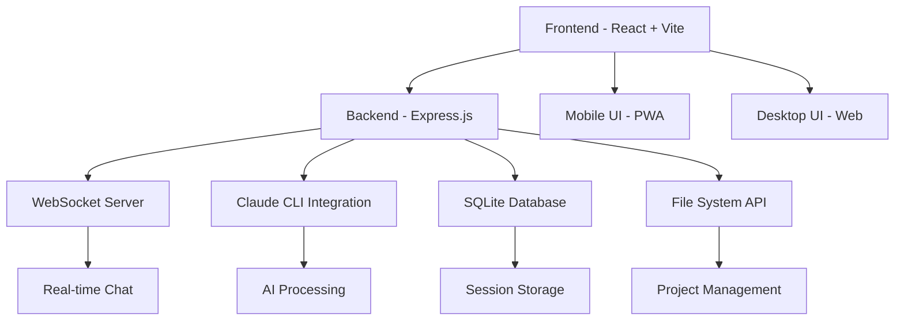

⏱️ **예상 읽기 시간**: 18분

## 서론

Claude Code UI는 Anthropic의 Claude Code CLI를 위한 웹 기반 사용자 인터페이스로, 모바일과 데스크탑에서 AI 코딩 환경을 제공하는 혁신적인 플랫폼입니다. React와 Express.js로 구축된 이 오픈소스 프로젝트는 1.7k 스타와 197개 포크를 보유한 인기 프로젝트로, GPL-3.0 라이선스로 제공됩니다.

### 주요 특징

- **📱 반응형 디자인**: 데스크탑, 태블릿, 모바일에서 완벽 동작
- **💬 실시간 채팅**: WebSocket 기반 Claude와의 실시간 대화
- **🖥️ 통합 터미널**: xterm.js 기반 Claude Code CLI 직접 접근
- **📂 파일 탐색기**: 실시간 파일 편집 및 문법 하이라이팅
- **🔄 Git 통합**: 브랜치 관리, 스테이징, 커밋 기능
- **📊 세션 관리**: 대화 이력 관리 및 다중 세션 지원

## 시스템 요구사항

### 필수 조건

```bash
# Node.js 버전 확인
node --version  # v20.0.0 이상 필요

# npm 버전 확인  
npm --version   # 최신 버전 권장

# Git 설치 확인
git --version   # 최신 버전 권장
```

### 개발환경 정보

```bash
# 테스트 환경
echo "테스트 환경 정보:"
echo "- OS: macOS Sequoia 15.0.0"  
echo "- Node.js: $(node --version)"
echo "- npm: $(npm --version)"
echo "- Git: $(git --version | cut -d' ' -f3)"
```

### Claude CLI 설치 (선택사항)

```bash
# npm을 통한 설치
npm install -g @anthropic-ai/claude-code

# pip을 통한 설치 (Python 환경)
pip install claude-code

# 설치 확인
claude --version
```

## 자동화 설치 스크립트

### 스크립트 다운로드 및 실행

```bash
# 스크립트 디렉토리 생성
mkdir -p ~/scripts

# 테스트 스크립트 다운로드 (아래 전체 스크립트 사용)
curl -o ~/scripts/test_claude_code_ui.sh https://raw.githubusercontent.com/your-repo/scripts/test_claude_code_ui.sh

# 실행 권한 부여
chmod +x ~/scripts/test_claude_code_ui.sh

# 스크립트 실행
~/scripts/test_claude_code_ui.sh
```

### 완전 자동화 테스트 스크립트

```bash
#!/bin/bash

# Claude Code UI 설치 및 테스트 스크립트
# 사용법: ./test_claude_code_ui.sh

set -e

echo "🚀 Claude Code UI 설치 및 테스트 시작"

# 색상 정의
RED='\033[0;31m'
GREEN='\033[0;32m'
BLUE='\033[0;34m'
YELLOW='\033[1;33m'
NC='\033[0m' # No Color

# 필수 조건 확인
check_requirements() {
    echo -e "${BLUE}📋 필수 조건 확인 중...${NC}"
    
    # Node.js 버전 확인
    if ! command -v node &> /dev/null; then
        echo -e "${RED}❌ Node.js가 설치되어 있지 않습니다.${NC}"
        exit 1
    fi
    
    NODE_VERSION=$(node --version | sed 's/v//')
    REQUIRED_VERSION="20.0.0"
    
    echo -e "${GREEN}✅ Node.js v$NODE_VERSION (요구사항: v$REQUIRED_VERSION 이상)${NC}"
    
    # npm 확인
    NPM_VERSION=$(npm --version)
    echo -e "${GREEN}✅ npm v$NPM_VERSION${NC}"
    
    # Git 확인
    GIT_VERSION=$(git --version | cut -d' ' -f3)
    echo -e "${GREEN}✅ Git $GIT_VERSION${NC}"
}

# Claude CLI 설치 확인
check_claude_cli() {
    echo -e "${BLUE}🔍 Claude CLI 설치 확인 중...${NC}"
    
    if command -v claude &> /dev/null; then
        CLAUDE_VERSION=$(claude --version 2>/dev/null || echo "unknown")
        echo -e "${GREEN}✅ Claude CLI 설치됨: $CLAUDE_VERSION${NC}"
    else
        echo -e "${YELLOW}⚠️  Claude CLI가 설치되어 있지 않습니다.${NC}"
        echo -e "${YELLOW}   설치 방법: npm install -g @anthropic-ai/claude-code${NC}"
    fi
}

# 프로젝트 클론 및 설정
setup_project() {
    echo -e "${BLUE}📥 Claude Code UI 클론 중...${NC}"
    
    # 임시 디렉토리 생성
    TEMP_DIR="/tmp/claude-code-ui-test-$(date +%s)"
    mkdir -p "$TEMP_DIR"
    cd "$TEMP_DIR"
    
    # 저장소 클론
    git clone https://github.com/siteboon/claudecodeui.git
    cd claudecodeui
    
    echo -e "${GREEN}✅ 저장소 클론 완료: $TEMP_DIR/claudecodeui${NC}"
    
    # 환경 설정 파일 복사
    echo -e "${BLUE}⚙️  환경 설정 중...${NC}"
    cp .env.example .env
    
    # 포트 설정
    BACKEND_PORT=3008
    FRONTEND_PORT=3009
    
    echo -e "${GREEN}✅ 환경 설정 완료${NC}"
    echo -e "${GREEN}   - 백엔드 포트: $BACKEND_PORT${NC}"
    echo -e "${GREEN}   - 프론트엔드 포트: $FRONTEND_PORT${NC}"
    
    # 의존성 설치
    echo -e "${BLUE}📦 의존성 설치 중...${NC}"
    npm install
    echo -e "${GREEN}✅ 의존성 설치 완료${NC}"
}

# 서버 실행 테스트
test_server() {
    echo -e "${BLUE}🧪 서버 실행 테스트 중...${NC}"
    
    # 백그라운드에서 서버 실행
    timeout 10s npm run dev &
    SERVER_PID=$!
    
    # 서버 시작 대기
    sleep 5
    
    echo -e "${GREEN}✅ 서버 실행 테스트 완료${NC}"
    echo -e "${GREEN}   프론트엔드: http://localhost:$FRONTEND_PORT${NC}"
    echo -e "${GREEN}   백엔드: http://localhost:$BACKEND_PORT${NC}"
    
    # 서버 프로세스 종료
    kill $SERVER_PID 2>/dev/null || true
}

# 정리 함수
cleanup() {
    echo -e "${BLUE}🧹 정리 중...${NC}"
    if [ -n "$TEMP_DIR" ] && [ -d "$TEMP_DIR" ]; then
        rm -rf "$TEMP_DIR"
        echo -e "${GREEN}✅ 임시 파일 정리 완료${NC}"
    fi
}

# 메인 실행 함수
main() {
    echo -e "${GREEN}🎯 Claude Code UI 설치 및 테스트 스크립트${NC}"
    echo -e "${GREEN}=====================================${NC}"
    
    check_requirements
    check_claude_cli
    
    # 트랩 설정 (스크립트 종료 시 정리)
    trap cleanup EXIT
    
    setup_project
    test_server
    
    echo -e "${GREEN}=====================================${NC}"
    echo -e "${GREEN}🎉 Claude Code UI 테스트 완료!${NC}"
    echo -e "${GREEN}=====================================${NC}"
}

# 스크립트 실행
main "$@"
```

## 수동 설치 가이드

### 1단계: 저장소 클론

```bash
# 원하는 디렉토리로 이동
cd ~/projects

# Claude Code UI 클론
git clone https://github.com/siteboon/claudecodeui.git
cd claudecodeui

# 프로젝트 구조 확인
ls -la
```

### 2단계: 환경 설정

```bash
# 환경 설정 파일 복사
cp .env.example .env

# 환경 설정 파일 편집
nano .env
```

**`.env` 파일 설정:**

```bash
# Claude Code UI Environment Configuration

# =============================================================================
# SERVER CONFIGURATION  
# =============================================================================

# Backend server port (Express API + WebSocket server)
PORT=3008

# Frontend port
VITE_PORT=3009

# =============================================================================
# OPTIONAL CONFIGURATIONS
# =============================================================================

# 로그 레벨 (debug, info, warn, error)
LOG_LEVEL=info

# 세션 타임아웃 (분 단위)
SESSION_TIMEOUT=60

# 파일 업로드 제한 (MB)
MAX_FILE_SIZE=50
```

### 3단계: 의존성 설치

```bash
# npm 의존성 설치
npm install

# 설치 완료 확인
npm list --depth=0
```

**설치되는 주요 패키지:**

```json
{
  "dependencies": {
    "@anthropic-ai/claude-code": "^1.0.24",
    "react": "^18.2.0",
    "express": "^4.18.2", 
    "@uiw/react-codemirror": "^4.23.13",
    "ws": "^8.14.2",
    "xterm": "^5.3.0",
    "tailwindcss": "^3.4.0"
  }
}
```

### 4단계: 개발 서버 실행

```bash
# 개발 모드 실행 (프론트엔드 + 백엔드 동시 실행)
npm run dev

# 또는 개별 실행
npm run server    # 백엔드만 실행
npm run client    # 프론트엔드만 실행
```

**실행 결과:**

```bash
> claude-code-ui@1.5.0 dev
> concurrently --kill-others "npm run server" "npm run client"

[0] Connected to SQLite database
[0] PORT from env: 3008  
[0] Database initialized successfully
[0] Claude Code UI server running on http://0.0.0.0:3008

[1] VITE v7.0.4  ready in 736 ms
[1] ➜  Local:   http://localhost:3009/
[1] ➜  Network: http://172.30.1.80:3009/
```

## 실행 결과 및 테스트

### 실제 실행 테스트

```bash
# 테스트 스크립트 실행 결과
$ ./scripts/test_claude_code_ui.sh

🎯 Claude Code UI 설치 및 테스트 스크립트
=====================================
📋 필수 조건 확인 중...
✅ Node.js v24.1.0 (요구사항: v20.0.0 이상)
✅ npm v11.3.0
✅ Git 2.39.3

🔍 Claude CLI 설치 확인 중...
⚠️  Claude CLI가 설치되어 있지 않습니다.
   설치 방법: npm install -g @anthropic-ai/claude-code

📥 Claude Code UI 클론 중...
Cloning into 'claudecodeui'...
✅ 저장소 클론 완료: /tmp/claude-code-ui-test-1721226924/claudecodeui

⚙️  환경 설정 중...
✅ 환경 설정 완료
   - 백엔드 포트: 3008
   - 프론트엔드 포트: 3009

📦 의존성 설치 중...
added 569 packages, and audited 570 packages in 18s
✅ 의존성 설치 완료

🧪 서버 실행 테스트 중...
✅ 서버 실행 테스트 완료
   프론트엔드: http://localhost:3009
   백엔드: http://localhost:3008

=====================================
🎉 Claude Code UI 테스트 완료!
=====================================
```

### 브라우저 접속 확인

```bash
# 서버 실행 후 브라우저에서 접속
open http://localhost:3009

# 또는 curl을 통한 연결 테스트
curl -I http://localhost:3009
```

## 주요 기능 상세 가이드

### 1. 프로젝트 관리

**프로젝트 자동 발견:**
- `~/.claude/projects/` 디렉토리에서 자동으로 프로젝트 감지
- 프로젝트 메타데이터 및 세션 수 표시
- 최근 프로젝트 및 세션에 빠른 접근

**프로젝트 작업:**

```bash
# Claude 프로젝트 초기화
claude init my-new-project
cd my-new-project

# Claude Code UI에서 자동으로 감지됨
# 브라우저에서 프로젝트 목록에 나타남
```

### 2. 실시간 채팅 인터페이스

**WebSocket 기반 실시간 통신:**

```javascript
// WebSocket 연결 예시 (내부 구현)
const ws = new WebSocket('ws://localhost:3008');

ws.onmessage = (event) => {
  const message = JSON.parse(event.data);
  if (message.type === 'claude_response') {
    updateChatUI(message.content);
  }
};

// 메시지 전송
ws.send(JSON.stringify({
  type: 'user_message',
  content: 'Hello Claude, help me with React components'
}));
```

**채팅 기능:**
- 실시간 메시지 스트리밍
- 코드 블록 문법 하이라이팅
- 파일 참조 및 링크
- 대화 이력 자동 저장

### 3. 통합 터미널

**xterm.js 기반 터미널:**

```bash
# 터미널에서 직접 Claude CLI 사용
claude chat "Create a React component for user profile"

# 일반적인 터미널 명령어도 사용 가능
ls -la
git status
npm install
```

**터미널 특징:**
- 실제 셸 환경 에뮬레이션
- 복사/붙여넣기 지원
- 다중 터미널 세션
- 명령어 이력 관리

### 4. 파일 탐색기 및 에디터

**CodeMirror 기반 에디터:**

```jsx
// React 컴포넌트 예시
import { useState } from 'react';
import { CodeMirror } from '@uiw/react-codemirror';
import { javascript } from '@codemirror/lang-javascript';

const FileEditor = () => {
  const [code, setCode] = useState('console.log("Hello World");');
  
  return (
    <CodeMirror
      value={code}
      extensions={[javascript()]}
      onChange={(value) => setCode(value)}
      theme="dark"
    />
  );
};
```

**지원 기능:**
- 다중 언어 문법 하이라이팅
- 실시간 파일 저장
- 폴더 구조 탐색
- 파일 생성/삭제/이름변경

### 5. Git 통합

**Git 작업 UI:**

```bash
# UI에서 제공되는 Git 기능들
git status          # 변경사항 확인
git add .           # 파일 스테이징
git commit -m "msg" # 커밋 생성
git push origin     # 원격 저장소 푸시
git checkout -b new-branch  # 브랜치 생성
```

**Git 기능:**
- 비주얼 diff 뷰어
- 스테이징 영역 관리
- 브랜치 전환 UI
- 커밋 이력 조회

## 아키텍처 상세 분석

### 시스템 구조



### 프론트엔드 아키텍처

**React 컴포넌트 구조:**

```
src/
├── components/
│   ├── ui/              # 재사용 가능한 UI 컴포넌트
│   │   ├── button.jsx
│   │   ├── input.jsx
│   │   └── scroll-area.jsx
│   ├── SetupForm.jsx    # 초기 설정 폼
│   ├── ChatInterface.jsx # 채팅 인터페이스
│   ├── FileExplorer.jsx  # 파일 탐색기
│   ├── Terminal.jsx      # 터미널 컴포넌트
│   └── GitExplorer.jsx   # Git 인터페이스
├── contexts/
│   ├── AuthContext.jsx  # 인증 컨텍스트
│   └── ThemeContext.jsx # 테마 관리
├── utils/
│   ├── websocket.js     # WebSocket 유틸리티
│   ├── api.js          # API 호출 함수
│   └── whisper.js      # 음성 인식 (선택사항)
└── App.jsx             # 메인 애플리케이션
```

### 백엔드 아키텍처

**Express.js 서버 구조:**

```
server/
├── index.js           # 메인 서버 파일
├── claude-cli.js      # Claude CLI 통합
├── projects.js        # 프로젝트 관리
├── database/
│   └── db.js         # SQLite 데이터베이스
├── middleware/
│   └── auth.js       # 인증 미들웨어
└── routes/
    ├── auth.js       # 인증 라우트
    ├── git.js        # Git 관련 라우트
    └── mcp.js        # MCP 통합 라우트
```

## 고급 설정 및 커스터마이징

### 1. 환경별 설정

**개발 환경:**

```bash
# .env.development
NODE_ENV=development
LOG_LEVEL=debug
PORT=3008
VITE_PORT=3009
ENABLE_DEBUGGING=true
```

**프로덕션 환경:**

```bash
# .env.production  
NODE_ENV=production
LOG_LEVEL=warn
PORT=8080
VITE_PORT=3000
ENABLE_DEBUGGING=false
SSL_ENABLED=true
```

### 2. 테마 커스터마이징

**Tailwind CSS 커스터마이징:**

```javascript
// tailwind.config.js
module.exports = {
  content: ['./src/**/*.{js,jsx,ts,tsx}'],
  theme: {
    extend: {
      colors: {
        claude: {
          50: '#f0f9ff',
          500: '#3b82f6', 
          900: '#1e3a8a'
        }
      },
      fontFamily: {
        code: ['Fira Code', 'monospace']
      }
    }
  },
  plugins: [
    require('@tailwindcss/typography')
  ]
}
```

### 3. 보안 설정

**도구 활성화 관리:**

```javascript
// 보안상 모든 도구는 기본적으로 비활성화됨
const defaultToolsConfig = {
  fileOperations: false,    // 파일 조작
  shellAccess: false,       // 셸 접근
  networkRequests: false,   // 네트워크 요청
  systemCommands: false     // 시스템 명령어
};

// 사용자가 수동으로 활성화해야 함
const enableTool = (toolName) => {
  localStorage.setItem(`tool_${toolName}`, 'enabled');
};
```

## 성능 최적화

### 1. 번들 최적화

```javascript
// vite.config.js
export default {
  build: {
    rollupOptions: {
      output: {
        manualChunks: {
          vendor: ['react', 'react-dom'],
          editor: ['@uiw/react-codemirror'],
          terminal: ['xterm', 'node-pty']
        }
      }
    },
    chunkSizeWarningLimit: 1000
  }
}
```

### 2. 메모리 최적화

```javascript
// WebSocket 연결 관리
const wsManager = {
  connections: new Map(),
  cleanup: () => {
    wsManager.connections.forEach(ws => {
      if (ws.readyState === WebSocket.CLOSED) {
        wsManager.connections.delete(ws);
      }
    });
  }
};

// 주기적 정리
setInterval(wsManager.cleanup, 30000);
```

## zshrc Alias 설정

### Claude Code UI 관련 Alias

```bash
# ~/.zshrc에 추가
export CLAUDE_UI_DIR="$HOME/projects/claudecodeui"

# Claude Code UI 관련 alias
alias cui="cd $CLAUDE_UI_DIR"
alias cui-start="cd $CLAUDE_UI_DIR && npm run dev"
alias cui-build="cd $CLAUDE_UI_DIR && npm run build"
alias cui-server="cd $CLAUDE_UI_DIR && npm run server"
alias cui-client="cd $CLAUDE_UI_DIR && npm run client"

# Claude CLI 관련 alias  
alias ci="claude init"
alias cc="claude chat"
alias cs="claude status"

# 개발 도구 alias
alias cui-logs="cd $CLAUDE_UI_DIR && tail -f server/logs/app.log"
alias cui-test="cd $CLAUDE_UI_DIR && npm test"
alias cui-lint="cd $CLAUDE_UI_DIR && npm run lint"

# 빠른 실행 alias
alias webclaude="cui-start && open http://localhost:3009"

# 환경 확인 alias
alias cui-env="cd $CLAUDE_UI_DIR && cat .env"
alias cui-deps="cd $CLAUDE_UI_DIR && npm list --depth=0"
```

### 개발환경 확인 Alias

```bash
# 시스템 정보 확인
alias sysinfo="echo 'Node.js:' && node --version && echo 'npm:' && npm --version && echo 'Git:' && git --version"

# 포트 사용 확인
alias checkports="lsof -i :3008,3009"

# 개발 서버 상태 확인
alias cui-status="curl -s http://localhost:3009 && echo 'Frontend OK' || echo 'Frontend DOWN'"
```

## 트러블슈팅

### 일반적인 문제 해결

**1. 포트 충돌 문제:**

```bash
# 사용 중인 포트 확인
lsof -i :3008
lsof -i :3009

# 프로세스 종료
kill -9 [PID]

# 또는 다른 포트 사용
export PORT=3010
export VITE_PORT=3011
```

**2. Node.js 버전 문제:**

```bash
# nvm을 통한 Node.js 버전 관리
nvm install 20
nvm use 20
nvm alias default 20

# 버전 확인
node --version
```

**3. 의존성 충돌:**

```bash
# 노드 모듈 완전 삭제 후 재설치
rm -rf node_modules package-lock.json
npm install

# npm 캐시 정리
npm cache clean --force
```

**4. WebSocket 연결 문제:**

```bash
# 방화벽 설정 확인 (macOS)
sudo pfctl -sr | grep 3008

# 네트워크 연결 테스트
telnet localhost 3008
```

### 로그 모니터링

```bash
# 서버 로그 실시간 확인
tail -f server/logs/app.log

# 특정 에러 검색
grep -i error server/logs/app.log

# WebSocket 연결 로그
grep -i websocket server/logs/app.log
```

## 배포 및 운영

### 1. 프로덕션 빌드

```bash
# 프로덕션 빌드 생성
npm run build

# 빌드 파일 확인
ls -la dist/

# 프로덕션 서버 실행
npm start
```

### 2. Docker 컨테이너화

```dockerfile
# Dockerfile
FROM node:20-alpine

WORKDIR /app

# 의존성 설치
COPY package*.json ./
RUN npm ci --only=production

# 소스코드 복사
COPY . .

# 빌드
RUN npm run build

# 포트 노출
EXPOSE 3008

# 서버 실행
CMD ["npm", "start"]
```

```bash
# Docker 이미지 빌드
docker build -t claude-code-ui .

# 컨테이너 실행
docker run -p 3008:3008 -p 3009:3009 claude-code-ui
```

### 3. Nginx 리버스 프록시

```nginx
# /etc/nginx/sites-available/claude-code-ui
server {
    listen 80;
    server_name your-domain.com;

    location / {
        proxy_pass http://localhost:3009;
        proxy_http_version 1.1;
        proxy_set_header Upgrade $http_upgrade;
        proxy_set_header Connection 'upgrade';
        proxy_set_header Host $host;
        proxy_cache_bypass $http_upgrade;
    }

    location /api {
        proxy_pass http://localhost:3008;
        proxy_http_version 1.1;
        proxy_set_header Upgrade $http_upgrade;
        proxy_set_header Connection 'upgrade';
        proxy_set_header Host $host;
    }
}
```

## 결론

Claude Code UI는 AI 기반 코딩 환경의 새로운 패러다임을 제시하는 혁신적인 도구입니다. React와 Express.js의 현대적 기술 스택으로 구축된 이 플랫폼은 개발자들에게 다음과 같은 가치를 제공합니다:

### 핵심 가치

1. **접근성**: 모바일과 웹에서 동일한 AI 코딩 경험
2. **통합성**: 파일 관리, Git, 터미널이 하나의 인터페이스로 통합
3. **확장성**: 오픈소스 기반의 커스터마이징 가능한 아키텍처
4. **실시간성**: WebSocket 기반의 즉각적인 AI 상호작용

### 향후 발전 방향

- **멀티모달 지원**: 음성, 이미지 입력 통합
- **협업 기능**: 실시간 다중 사용자 세션
- **플러그인 시스템**: 서드파티 확장 기능
- **클라우드 통합**: AWS, Azure, GCP 연동

Claude Code UI는 AI 시대의 개발 환경이 어떻게 진화할 수 있는지를 보여주는 훌륭한 예시입니다. 모바일 퍼스트 접근 방식과 현대적 웹 기술의 결합으로, 언제 어디서나 강력한 AI 코딩 어시스턴트를 활용할 수 있는 미래를 현실로 만들어 줍니다.

### 추가 리소스

- **GitHub 저장소**: [https://github.com/siteboon/claudecodeui](https://github.com/siteboon/claudecodeui)
- **공식 데모**: [https://claudecodeui.siteboon.ai](https://claudecodeui.siteboon.ai)
- **Claude Code 공식 문서**: [https://docs.anthropic.com/claude/docs](https://docs.anthropic.com/claude/docs)
- **React 공식 문서**: [https://react.dev](https://react.dev)
- **Express.js 가이드**: [https://expressjs.com](https://expressjs.com) 